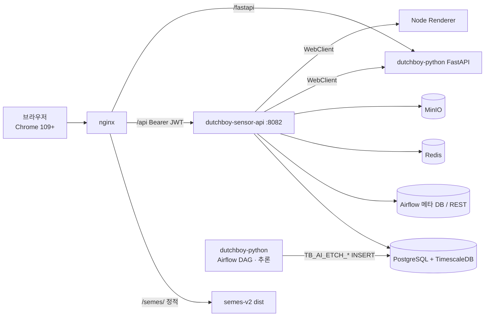
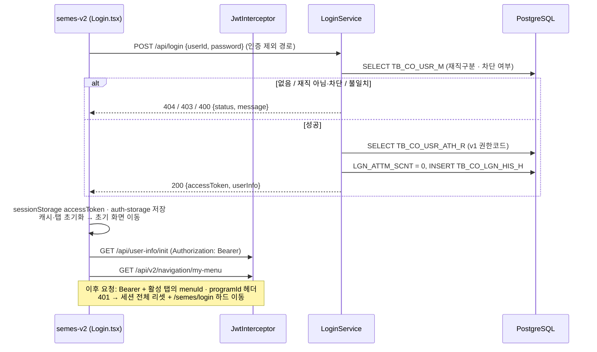
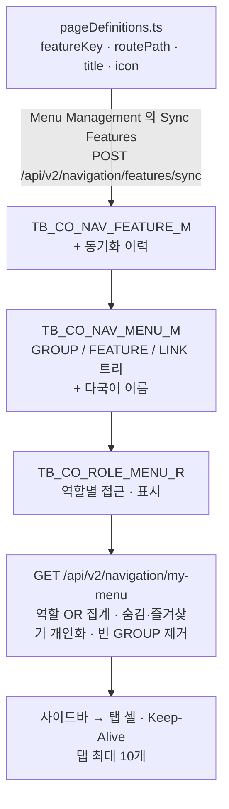

# DUTCHBOY — 센서/설비 AI 분석 플랫폼 (semes-v2 + dutchboy-sensor-api) 구성 개요

반도체 식각(Etch) 설비의 센서 데이터와 AI 이상탐지 결과를 조회·분석하는 운영 웹 플랫폼이다. 챔버 대시보드, 모델 분석 타임라인, 웨이퍼 트레이스 비교, PM(예방정비) 분석을 제공한다. 기준정보·사용자·역할·메뉴 관리와 모델·API 성능·디스크 모니터링 화면도 있다. AI 추론 자체는 별도 Python 리포가 수행하고, 이 플랫폼은 그 결과를 읽어 보여 준다.

| 문서 | 내용 |
|---|---|
| [frontend.md](./frontend.md) | `front-monorepo`(pnpm + Turborepo, 활성 앱 `apps/semes-v2`) — 탭 셸·Keep-Alive, JWT Bearer, pageDefinitions → Feature Sync → Menu V2, 차트 렌더러, Chrome 109 하한, CI·릴리즈 |
| [backend.md](./backend.md) | `dutchboy-sensor-api`(Spring Boot 3.1) — usecase→service→repository→infra 4단 구조, v1/v2 권한 체계, API, 스케줄러, 배포 스크립트 |
| [database.md](./database.md) | PostgreSQL + TimescaleDB — Flyway 타임스탬프 마이그레이션, v1/v2 시스템 테이블 DDL, `TB_AI_ETCH_*` 도메인 테이블, 시드 |

기준: 백엔드 `dev@4a160667` (2026-09-29), 프론트 `dev@b50e89a4` (2026-10-02, 태그 v2.0.0 이후). 작성일 2026-10-06.

---

## 1. 한눈에 보는 구성

| 계층 | 기술 | 비고 |
|---|---|---|
| 프론트엔드 | React + TypeScript + Vite(`base: /semes/`, `build.target: chrome109`), Zustand, TanStack Query, Tailwind **v3**(v4 금지), 차트 uPlot · ECharts · SciChart(WebGL, 없으면 uPlot 폴백) | pnpm + Turborepo 모노레포, 디자인 시스템 패키지 7개. UI 문구는 영어 하드코딩이 원칙 |
| 백엔드 | Java 17, Spring Boot 3.1.6, MyBatis 3.0.2(XML), jjwt 0.12.3(HS256), Flyway 10.20, Lettuce Redis, MinIO SDK 9, PDFBox 3, springdoc 2.2 | Spring Security 미사용, `HandlerInterceptor` 로 JWT 검증. 포트 8082 |
| DB | PostgreSQL 14+ + TimescaleDB, 스키마 `public` | Flyway 파일명 `V<yyyyMMddHHmm>__설명.sql`(순차 번호 금지), `FLYWAY_ENABLED` 토글 |
| AI 추론 | 별도 리포 `dutchboy-python`(Airflow DAG + FastAPI) 가 `TB_AI_ETCH_*` 에 직접 적재 | 이 서버는 해당 테이블을 **읽기만** 한다 |
| 기타 연동 | Airflow REST·메타 DB, FastAPI(브라우저도 `/fastapi` 로 직접 호출), Node Renderer(차트 PNG), MinIO(리포트 캐시), MLflow, Redis(PM 병합 큐, 렌더 잠금) | 다수 기능이 환경변수 토글 뒤에 있다 |
| 배포 | 프론트: CI 가 `dist/` 를 스테이징 nginx 볼륨에 교체(헬스체크 실패 시 롤백). 백엔드: CI 가 jar 를 scp → 배포 스크립트가 백업·교체·재기동·롤백 | **dev 머지 = 스테이징 자동 배포**(양쪽 모두) |

---

## 2. 배포 환경

| 항목 | 프론트 (`apps/semes-v2`) | 백엔드 (`dutchboy-sensor-api`) |
|---|---|---|
| 산출물 | `dist/`(모든 URL 이 `/semes/` 기준, SciChart wasm 포함) | `dutchboy-spring-0.0.1-SNAPSHOT.jar` → `app.jar` |
| 설정 주입 | 빌드 시 추적된 `.env` 만 사용(사이트별 값은 빌드에 넣지 않음, API baseURL 은 같은 출처 `''`) | `application.yaml` 은 gitignore. CI 변수 `SPRING_APPLICATION_YML` 로 작성. 새 키는 `application_template.yaml` 에도 추가해야 운영 반영 |
| 실행 | nginx 컨테이너가 dist 를 bind mount. `/semes/` 정적 + SPA fallback(추정), `/api` → Spring, `/fastapi` → FastAPI | 배포 호스트의 compose(`make springboot-down/up`)로 컨테이너 재기동 |
| CI 게이트 | MR: `type_check` · `lint` · `test`. "Pipelines must succeed" 머지 체크가 꺼져 있어 빨간 파이프라인도 머지 가능 | MR: `test` + `check-migrations`(V 버전 > dev 최대, 머지된 V 파일 수정 금지) |
| CD (dev push) | `build` → `deploy_staging`(tar 전송, 백업 10개, 60초 헬스체크 실패 시 롤백) → `release`(수동, `v2.N.0` 태그·CHANGELOG·패키지 업로드) | `build-jar` → `deploy-production`(scp + 체크섬 검증 → 백업·교체·재기동, 120초 대기 실패 시 롤백) |
| 고객 사이트 | 릴리즈 tar.gz 를 사람이 반입. `staging` 브랜치 = 마지막 반입 릴리즈 | 반입 시 Flyway 로 스키마 반영(`FLYWAY_ENABLED=true`) |
| 브라우저 하한 | Chrome 109 / Win7 / 1280×1024. `.browserslistrc` + `vite.config.ts build.target` + `tsconfig lib` 을 함께 유지. `toSorted`·`structuredClone`·`Object.groupBy`·oklch 금지 | — |
| 커밋 규칙 | commitlint: `type(scope): 설명 DUTS-N`(Jira 키 없으면 거부) | 같은 Jira `DUTS-*` |
| 로컬 | `pnpm --filter semes-v2 dev`(:3000, `/api`·`/fastapi`·`/grafana` 프록시) | IntelliJ `DemoApplication`(`.env` 파일 필요) 또는 `./gradlew bootRun`. 공유 sandbox DB 는 `FLYWAY_ENABLED` 미설정으로 drift 방지 |

---

## 3. 로그인 흐름 (프론트 ↔ 백엔드 ↔ DB)

| 항목 | 내용 |
|---|---|
| 토큰 | JWT HS256 단일 액세스 토큰(유효 약 30일), refresh 토큰 없음. 클레임 `userInfo`, `userAuthorityList`(v1 권한) |
| 저장 | `sessionStorage['accessToken']` + Zustand persist `auth-storage`. 탭을 닫으면 로그아웃과 같다 |
| 요청 인증 | `Authorization: Bearer <token>`. 인증 제외 경로: 로그인, `/api/config`, PM·데이터 분석 일부, Feature Sync, 내부 API 키 경로 |
| 로그아웃 | 프론트가 세션 상태만 비운다(서버 `/api/logout` 미호출). 토큰 갱신(`/api/refresh`)도 프론트가 쓰지 않는다 |
| 비밀번호 | **현재 평문 저장·비교**이며 초기 비밀번호는 사번. 재구현 시 bcrypt 등 해시로 바꿔야 한다(backend.md §4.1, §10) |
| 잠금 | 자동 잠금 매퍼는 있으나 호출되지 않는다. 차단은 관리자가 v2 사용자 관리에서 수동 설정 |
| 주의 | v1 권한 실패(`common.noAuthority`)가 401 로 와서 프론트가 세션 만료로 보고 강제 로그아웃한다(frontend.md §16.2) |

---

## 4. 사용자·역할 관리 흐름 (v1 / v2 이중 체계)

| 영역 | v1 (레거시) | v2 (현행 화면) |
|---|---|---|
| 사용자 | `/api/user-info/**` (Map 기반) | `/api/v2/users/**` — 목록(페이징 `{items,total,page,size}`), 생성(초기 비밀번호=사번), 수정, 비활성화, 재활성화, 비밀번호 초기화, 역할 교체 |
| 권한/역할 | `TB_CO_ATH_M`(권한코드 `ATCO010` 일반, `ATCO090` 관리자), `TB_CO_USR_ATH_R` | `TB_CO_ROLE_M`(scope `SU(3) > ADMIN(2) > DEFAULT(1)`), `TB_CO_USR_ROLE_R`, `TB_CO_ROLE_ATH_R`(역할 ↔ v1 권한코드), `TB_CO_ROLE_MENU_R` |
| 판정 | 컨트롤러가 JWT 의 `ATCO0xx` 를 직접 검사 | 요청마다 사용자 역할을 조회해 최고 scope 로 판정. ADMIN 이상만 관리 API, **자기보다 낮은 scope 만 수정 가능**. SU 역할은 DB 에 하나, 한 사용자에게만, 단독으로만 |
| 로그인 토큰 | v1 권한을 클레임에 싣는다(로그인은 아직 v1 사용) | 토큰을 쓰지 않고 DB 조회 |

공통 사용자 저장소는 `TB_CO_USR_M` 하나다. 프론트 앱에는 v2 사용자·역할 화면만 있고, 역할 화면의 권한코드·사용자 피커는 v1 API 를 그대로 쓴다.

---

## 5. 메뉴·Feature 흐름 (v2)

- **새 화면 노출 3단계**(MENU-GUIDE): ① `pageDefinitions.ts` 에 페이지 등록 ② Menu Management V2 에서 **Sync Features**(SYNC 모드) — 배포 빌드는 기동 시 자동 동기화하지 않는다 ③ 같은 화면에서 FEATURE 메뉴를 만들어 Feature 에 연결하고, 역할별 메뉴 권한을 준다.
- Feature Sync 는 메뉴를 만들지 않는다. 메뉴에 연결되지 않은 Feature 의 보호 API 는 SU 도 403 이다(`NavigationFeatureAccessChecker`).
- v1 메뉴(`TB_CO_MNU_M`·`TB_CO_MNU_ATH_R`, `GET /api/menu/main`)는 레거시로 남아 있다.

---

## 6. 재구현 순서 (요약)

1. DB: [database.md](./database.md) — TimescaleDB 확장, Flyway 타임스탬프 마이그레이션 재생(빈 DB 에 V1 부터), v1/v2 시스템 테이블, SU 역할·관리자 시드.
2. 백엔드: [backend.md](./backend.md) §2 4단 레이어 → §3 설정·토글 → §4 JWT 인터셉터 → §5·§6 v2 사용자·역할·메뉴·Feature Sync → §7 도메인. 비밀번호는 해시로 바꾼다.
3. 프론트: [frontend.md](./frontend.md) §1·§3 모노레포·브라우저 하한 → §5 탭 셸·pageDefinitions → §6 인증 → §8 메뉴·Feature Sync → §9 공통 컴포넌트(DataTable, useConfirm/useToast).
4. 배포: nginx(`/semes/` 정적, `/api`·`/fastapi` 프록시) + 백엔드 컨테이너, 양쪽 모두 롤백 가능한 배포 스크립트.
