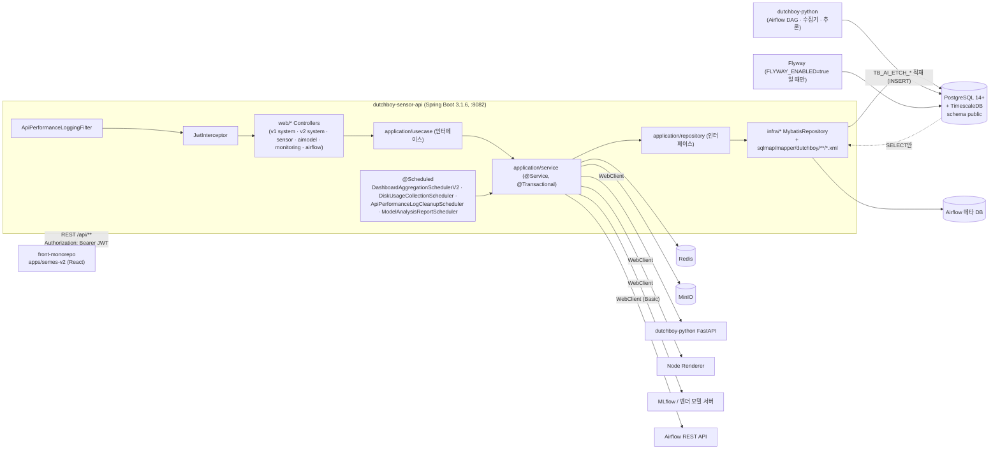
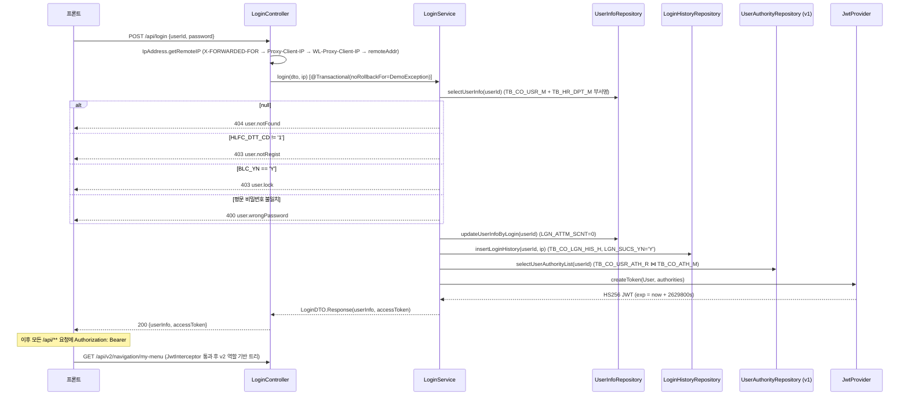

# DUTCHBOY Sensor API (dutchboy-sensor-api) — 백엔드 재구현 명세

| 항목 | 값 |
|---|---|
| 대상 리포 | `dutchboy-sensor-api` (Gradle 프로젝트명 `dutchboy-spring`, 패키지 루트 `com.dutchboy.demo`) |
| 기준 브랜치 / 커밋 | `dev` / `4a16066772060f5a67c3ca21f86c4b3dad9d3819` (2026-09-29, `Merge branch 'feature/DUTS-887' into 'dev'`) |
| 작성일 | 2026-10-06 |
| 짝 문서 | `frontend.md` (front-monorepo `apps/semes-v2`, 별도 작성) / `database.md` (이 문서와 같은 폴더) |
| 작성 방식 | 소스 정적 분석만 수행(앱·테스트 실행 없음). 문서(README/AGENTS.md/API_DOCUMENT.md)보다 코드를 우선했고, 코드로 확인하지 못한 서술은 "(추정)"으로 표시 |
| 보안 | 비밀값은 모두 `<PLACEHOLDER>`. 사내 호스트·IP·계정·실명은 역할명으로 일반화 |

## 목차

1. [시스템 개요](#1-시스템-개요)
2. [디렉터리/패키지 구조](#2-디렉터리패키지-구조)
3. [설정](#3-설정)
4. [인증/로그인](#4-인증로그인)
5. [사용자 관리](#5-사용자-관리)
6. [메뉴/권한 관리](#6-메뉴권한-관리)
7. [그 외 도메인 모듈](#7-그-외-도메인-모듈)
8. [공통 인프라](#8-공통-인프라)
9. [빌드/배포](#9-빌드배포)
10. [재구현 체크리스트](#10-재구현-체크리스트)

---

## 1. 시스템 개요

### 1.1 역할

반도체 Etch 설비의 센서 데이터와 그에 대한 AI 추론 결과(Encoder/Trend/Spike/AWC 등)를 **조회·분석**하고, 설비·공정·레시피·PM(Process Module, 챔버 유지보수)·센서그룹 같은 **도메인 기준정보를 관리**하며, 사용자·역할·메뉴·권한 같은 **시스템 관리** 기능을 제공하는 Spring Boot REST API 서버다.

핵심 전제 (`AGENTS.md`, 코드로 확인):

- **AI 추론은 이 서버가 하지 않는다.** 별도 리포 `dutchboy-python`(Airflow DAG + FastAPI)이 추론 결과를 `TB_AI_ETCH_*` 테이블에 직접 적재하고, 이 서버는 해당 테이블을 **SELECT만** 한다. 과거 `pipeline/` 패키지는 2026-06-15 커밋 `3030c75`(DUTS-488)로 삭제됐다.
- 예외적으로 도메인 관리성 테이블(`TB_AI_ETCH_EQP_MNG`, `TB_AI_ETCH_EQP_TYPE`, `TB_AI_ETCH_SNS_GRP_MNG`, `TB_AI_ETCH_SNS_SET_M/D`, `TB_AI_ETCH_ISSUE_M/D`, `TB_AI_ETCH_PRESET_MNG`, `TB_AI_ETCH_CONFIG_EXCL`, `TB_AI_ETCH_RCP_MNG`, `TB_AI_ETCH_RCP_KEYWORD`, `TB_AI_ETCH_FTP_M`, Dashboard V2 집계 테이블, In-depth 북마크/리뷰)은 이 서버가 INSERT/UPDATE/DELETE 한다 (`src/main/resources/sqlmap/mapper/dutchboy/sensor/**`에서 write 문 grep 결과).
- 권한·메뉴·사용자 체계가 **v1(레거시, `/api/menu`, `/api/authority`, `/api/user-info`)**과 **v2(`/api/v2/navigation/**`, `/api/v2/roles/**`, `/api/v2/users/**`)**로 병존한다. 로그인(`LoginService`)은 아직 v1 권한 테이블(`TB_CO_USR_ATH_R`)을 JWT 클레임에 싣는다.

### 1.2 연동 시스템

| 구분 | 대상 | 방식 | 근거 |
|---|---|---|---|
| 주 DB | PostgreSQL 14+ (`public` 스키마) + TimescaleDB 확장 | MyBatis XML(`sqlmap/mapper/dutchboy/**`), DataSource `spring.datasource.postgresql` | `config/DataSourceBeanConfig.java`, `config/PostgreDataSourceConfig.java`, `db/migration/V1__baseline.sql` 상단 `CREATE EXTENSION IF NOT EXISTS timescaledb` |
| Airflow 메타 DB | PostgreSQL (`spring.datasource.airflow`) | 별도 SqlSessionFactory(`airflowSqlSessionFactory`), 매퍼 `sqlmap/mapper/airflow/*.xml` — `dag_run`, `task_instance`, `xcom`, `log`, `serialized_dag` 테이블 직접 조회 | `airflow/config/AirflowDataSourceBeanConfig.java`, `AirflowDataSourceConfig.java` |
| Airflow REST API | Basic Auth WebClient | DAG pause/resume, DAG run 트리거, task 로그 | `airflow/config/AirflowApiConfig.java`, `airflow/client/AirflowRestApiClient.java` |
| Redis | Lettuce (`spring.data.redis.host/port`) | (1) PM 병합 시 `pm-manage` 리스트에 LPUSH (dutchboy-python 소비 추정), (2) Model Analysis 렌더 잠금(`SET NX` + Lua 해제) | `config/RedisConfig.java`, `application/service/sensor/PmManagementService.java`, `application/service/sensor/report/ModelAnalysisRenderLock.java` |
| dutchboy-python (FastAPI) | WebClient (`fastapi.base-url`) | Model Analysis 리포트용 차트 데이터(step-graph-data 등) 조회 | `config/ModelAnalysisReportConfig.java`, `application/service/sensor/report/ModelAnalysisFastApiClient.java` |
| Node Renderer | WebClient (`model-analysis.report.renderer.base-url`) | ECharts 옵션 → PNG 렌더(`POST /v1/render/echarts`) | `ModelAnalysisRendererClient.java`, `docs/model-analysis-raw-image-api.md` |
| MinIO (S3 호환) | MinIO SDK 9.0.1 | Model Analysis 이미지/PDF 캐시, Action Item 리포트 PDF 조회, 디스크 정리 대상 버킷 목록 | `config/ModelAnalysisObjectStorageConfig.java`, `application/service/sensor/actionitem/ActionItemReportObjectStore.java`, `application/service/system/DiskCleanupObjectStorageService.java` |
| MLflow / 벤더 모델 서버 | WebClient (`mlflow.api.url`, `model.url.api`) | 모니터링용 수동 호출, 활성 모델 호출 이력 기록 | `monitoring/mlflow/**`, `config/ModelApiWebClientConfig.java` |
| 프론트엔드 | REST + Bearer JWT, CORS allow-list | `front-monorepo/apps/semes-v2` | `config/WebConfigs.java` |

### 1.3 전체 구성



### 1.4 기술 스택 (`build.gradle` 기준)

| 분류 | 기술 / 버전 |
|---|---|
| 언어 / 런타임 | Java 17 (`sourceCompatibility = 17`) |
| 프레임워크 | Spring Boot **3.1.6** (`spring-boot-gradle-plugin:3.1.6`, dependency-management 1.0.11) — Web MVC + Validation + AOP + WebFlux(WebClient 용) |
| 빌드 | Gradle **8.5** (wrapper, `distributionUrl=gradle-8.5-bin.zip`, 오프라인 빌드용 `libs/` 배치 옵션) |
| DB 접근 | MyBatis Spring Boot Starter **3.0.2** (XML 매퍼), PostgreSQL JDBC(버전은 Boot BOM), `log4jdbc-log4j2-jdbc4.1:1.16` (SQL 로깅 드라이버 `net.sf.log4jdbc.sql.jdbcapi.DriverSpy`) |
| DB | PostgreSQL **14 이상** + TimescaleDB (README 8.7, V1 baseline) |
| 마이그레이션 | Flyway **10.20.1** (`flyway-core`, `flyway-database-postgresql`) |
| 인증 | JJWT **0.12.3** (`jjwt-api/impl/gson`) — HS256 |
| 설정 암호화 | Jasypt Spring Boot Starter 3.0.5 (`PBEWITHHMACSHA512ANDAES_256`) — 빈은 등록돼 있으나 `ENC(...)` 실사용처 없음 |
| 캐시/락 | Spring Data Redis Reactive starter (Lettuce) — 실제 사용은 `RedisTemplate`/`StringRedisTemplate` 동기 API |
| 오브젝트 스토리지 | MinIO Java SDK **9.0.1** |
| PDF | Apache PDFBox **3.0.8** |
| 문서화 | springdoc-openapi-starter-webmvc-ui **2.2.0** (`/swagger-ui.html`, 그룹 `sensor-api`/`system-api`/`airflow-api`) |
| 유틸 | Lombok, commons-lang3 3.13.0, commons-codec 1.15, pyrolite 4.30 (Airflow XCom pickle 역직렬화 용도로 추정) |
| 테스트 | spring-boot-starter-test, assertj 3.24.2, reactor-test, mybatis-spring-boot-starter-test 3.0.2. `@Tag("local")` 테스트는 CI에서 제외(`excludeTags 'local'`) |

---

## 2. 디렉터리/패키지 구조

### 2.1 트리

```
dutchboy-sensor-api/
├── AGENTS.md                 # 에이전트 컨텍스트(원본). CLAUDE.md → 심볼릭 링크
├── README.md                 # 개발 가이드 (일부 구식: 포트 8081, "V번호+1" 서술)
├── API_DOCUMENT.md           # 초기 API 명세(구식, 현재 컨트롤러의 일부만 반영)
├── GUIDE.md                  # 패키지/의존성 방향 가이드
├── build.gradle / settings.gradle (rootProject.name = 'dutchboy-spring')
├── .gitlab-ci.yml            # MR 검증(test, check-migrations) + dev push 시 build-jar → deploy-production
├── scripts/
│   ├── check-migrations.sh           # Flyway 파일명/버전 정적 검사 (DUTS-873)
│   ├── deploy-springboot-jar.sh      # 배포 서버에서 jar 교체 + compose 재기동 + 롤백
│   ├── model-analysis-local.sh       # 로컬 Model Analysis 스택 헬스체크
│   └── performance/api-performance-log-load.js   # k6 부하 스크립트
├── docs/
│   ├── ERD.md, erd-svg/              # 카테고리별 ERD (V16 시점 스냅샷)
│   ├── api-performance-log-operations.md
│   ├── model-analysis-local-test.md, model-analysis-raw-image-api.md
│   └── db/rollback/                  # 수동 롤백 SQL/문서
└── src/
    ├── main/java/com/dutchboy/demo/
    │   ├── DemoApplication.java      # @SpringBootApplication @EnableScheduling
    │   ├── config/                   # WebConfigs, CorsProperties, DataSource/MyBatis, Redis, Jasypt, Swagger, ModelAnalysis*, DiskUsageProperties, DashboardV2Config
    │   ├── aspect/                   # SystemLoggingAspectJoinPoint, SystemErrorAspectJoinPoint(비활성), UserIdInjectAspect
    │   ├── exception/                # ApiResponse, DemoException, ModelAnalysisBusyException, GlobalExceptionHandler
    │   ├── util/                     # JwtProvider, JwtInterceptor, ModelAnalysisApiKeyInterceptor, MessageUtil, IpAddress, RowTypeConstants, typehandler/*
    │   ├── web/                      # Controller
    │   │   ├── system/               # v1: Login, UserInfo, Authority, UserAuthority, Menu, MenuAuthority, Department, LoginHistory, SystemUsage, ErrorLogHistory, Config, DiskUsage*, DiskCleanup*, FtpRegistration
    │   │   ├── system/v2/{view,menu,feature,role,user,preference,dashboard}/   # v2 Navigation/Role/User
    │   │   ├── sensor/               # AiAnalysis, AiOverview, AiAnomalyChamber, Awc, ConfigCompare, CwaReport, Dashboard, DataAnalysis, Equipment, IssueManagement, ModelAnalysisReport, PmAnalysis, PmManagement, Process, RealMonitoring, RecipeMaster, SensorGroup, SensorSet, TraceAnalysis, ActionItemReport
    │   │   ├── sensor/v2/{dashboard,indepth}/
    │   │   ├── aimodel/              # AiModelVersion, AiEventApi
    │   │   └── advice/AiAnalysisBindingAdvice.java
    │   ├── application/
    │   │   ├── usecase/{system,system/v2/*,sensor,sensor/v2/*,aimodel}/   # UseCase 인터페이스
    │   │   ├── service/{...}/        # @Service 구현 (UseCase implements)
    │   │   ├── repository/{...}/     # Repository 인터페이스
    │   │   └── dto/{common,system,system/v2/*,sensor/*,aimodel}/
    │   ├── infra/{system,system/v2/*,sensor,sensor/v2/*,aimodel,monitoring/*}/   # *MybatisRepository (= MyBatis @Mapper 네임스페이스)
    │   ├── monitoring/mlflow/{client,config,domain,dto,exception,repository,service,web}/
    │   ├── monitoring/performance/{capture,config,domain,dto,repository,service,web}/
    │   └── airflow/{client,config,controller,model/{dto,repository,service}}/
    ├── main/resources/
    │   ├── application_template.yaml # 설정 기준 (application.yaml 은 gitignore)
    │   ├── sqlmap/sql-mapper-config.xml
    │   ├── sqlmap/mapper/dutchboy/{system,system/v2/*,sensor,sensor/v2,aimodel,monitoring/*}/*.xml
    │   ├── sqlmap/mapper/airflow/*.xml  (+ 레거시 중복본 resources/airflow/sqlmap/mapper)
    │   ├── db/migration/V*.sql, README.md  # Flyway
    │   ├── sql/v2/V2__create_navigation_tables.sql   # Flyway 이전 수동 적용용 보관본(Flyway가 읽지 않음)
    │   ├── i18n/{exception,success,validation}_{ko_KR,en_US}.properties
    │   ├── logback-spring.xml, log4jdbc.log4j2.properties
    └── test/java/...                  # 단위·계약 테스트 (DemoApplicationTest 는 @Tag("local"))
```

### 2.2 패키지 책임

| 패키지 | 책임 | 비고 |
|---|---|---|
| `web/**` | REST 컨트롤러. `HttpServletRequest.getAttribute("userInfo")`로 사용자 식별, UseCase 호출, `ResponseEntity` 반환 | 메뉴/화면 단위로 클래스 분리 |
| `application/usecase/**` | UseCase **인터페이스**. 컨트롤러가 의존하는 유일한 진입점 | `LoginUseCase`, `MenuManagementUseCaseV2` 등 |
| `application/service/**` | UseCase 구현체(`@Service`). `@Transactional` 선언 위치. 검증·정규화·비즈니스 규칙 | v2 서비스는 `@Transactional(readOnly = true)` 클래스 + 쓰기 메서드만 `@Transactional` |
| `application/repository/**` | Repository **인터페이스** (서비스가 의존) | |
| `infra/**` | `*MybatisRepository` — Repository 구현체이자 MyBatis `@Mapper`. XML 매퍼의 `namespace`가 이 클래스 FQN | `@MapperScan("com.dutchboy.demo.infra")` |
| `application/dto/**` | 요청/응답/명령 DTO. MyBatis typeAlias 패키지 | `SaveDTO`(감사 컬럼+rowType), `InfinityScrollDTO`(fetchSize/page) |
| `config/**` | Spring 설정 빈 | 아래 §3 |
| `aspect/**` | AOP: 컨트롤러 호출 로그 적재, SaveDTO에 사용자ID 주입 | §8.4 |
| `util/**` | JWT, 인터셉터, 메시지, IP, TypeHandler | |
| `monitoring/**` | MLflow 모니터링·API 성능 로그. **4단 레이어를 따르지 않고** 패키지 내부에 web/service/repository 자체 구성 | `infra/monitoring/*`에 MyBatis 구현만 둠 |
| `airflow/**` | Airflow 연동. 자체 `model/{dto,repository,service}` 구조, 별도 DataSource | |

### 2.3 4단 레이어링 규칙과 전 계층 매핑 예시

규칙 (`GUIDE.md` + 코드):

```
web(Controller) ──의존──▶ application.usecase(인터페이스)
                           ▲ implements
                     application.service(@Service) ──의존──▶ application.repository(인터페이스)
                                                                 ▲ implements
                                                           infra.*MybatisRepository(@Mapper)
                                                                 ▲ namespace
                                                      resources/sqlmap/mapper/dutchboy/**/*.xml
```

- `web`은 `usecase`만 안다. `service`는 `repository` 인터페이스만 안다. `infra`는 MyBatis 매퍼 인터페이스(=repository 구현)이며 XML이 SQL을 가진다.
- 매퍼 XML의 `namespace`는 **infra 클래스 FQN**이다 (예: `com.dutchboy.demo.infra.system.v2.role.RoleMybatisRepositoryV2`).
- `resultType`/`parameterType`에는 typeAlias(클래스 단순명)를 쓴다 (`PostgreDataSourceConfig.setTypeAliasesPackage`에 `application.dto`, `monitoring.mlflow.domain/dto` 등록).

예시 1 — v2 Role 관리 (`/api/v2/roles`):

| 계층 | 파일 |
|---|---|
| web | `src/main/java/com/dutchboy/demo/web/system/v2/role/RoleManagementControllerV2.java` |
| usecase | `src/main/java/com/dutchboy/demo/application/usecase/system/v2/role/RoleManagementUseCaseV2.java` |
| service | `src/main/java/com/dutchboy/demo/application/service/system/v2/role/RoleManagementServiceV2.java` (+ `RoleV2PolicyValidator.java`) |
| repository | `src/main/java/com/dutchboy/demo/application/repository/system/v2/role/RoleRepositoryV2.java` |
| infra | `src/main/java/com/dutchboy/demo/infra/system/v2/role/RoleMybatisRepositoryV2.java` |
| mapper XML | `src/main/resources/sqlmap/mapper/dutchboy/system/v2/role/roleMapperV2.xml` |
| DTO | `application/dto/system/v2/role/{RoleDTO,RoleSaveDTO,RoleSearchDTO,RoleScope}.java` |

예시 2 — v1 설비 관리 (`/api/sensor/equipment`): `web/sensor/EquipmentController` → `usecase/sensor/EquipmentUseCase` → `service/sensor/EquipmentService` → `repository/sensor/EquipmentRepository` → `infra/sensor/EquipmentMybatisRepository` → `sqlmap/mapper/dutchboy/sensor/equipmentMapper.xml`.

### 2.4 네이밍 규칙 (코드에서 관찰)

| 대상 | 규칙 | 예 |
|---|---|---|
| 컨트롤러 | `<도메인>Controller`, v2는 `<도메인>ControllerV2` | `MenuManagementControllerV2` |
| UseCase/Service | `<도메인>UseCase` / `<도메인>Service` (v2: `...UseCaseV2`/`...ServiceV2`) | |
| Repository/infra | `<도메인>Repository` / `<도메인>MybatisRepository` (v2: `...RepositoryV2`/`...MybatisRepositoryV2`) | |
| 매퍼 XML | `<도메인 camelCase>Mapper.xml`, v2는 `...MapperV2.xml` | `userAccountMapperV2.xml` |
| DTO | `<도메인>DTO`, 저장 요청 `<도메인>SaveDTO`, 검색 `<도메인>SearchDTO`, 내부 명령 `<도메인>CommandDTO` | |
| v1 저장 API | `List<Map<String,Object>>` 또는 `SaveDTO` 상속 리스트 + `rowType`(0 normal/1 insert/2 update/3 delete, `RowTypeConstants`) 또는 `ROWTYPE` 키 | 그리드 일괄 저장 패턴 |
| v2 API | 리소스별 REST(`GET/POST/PUT/DELETE /api/v2/<res>/{id}`), 저장은 전량 교체(`DELETE → INSERT`) | |
| DB 컬럼 | snake_case + 약어(`USR_ID`, `MNU_ID`, `REGR_ID/REG_DATE/UPDR_ID/UPD_DATE`), `mapUnderscoreToCamelCase=true` | |
| 메시지 키 | `common.*`, `user.*`, `token.*`, `role.v2.*`, `modelAnalysis.report.*` 등 (`i18n/*.properties`) | |

### 2.5 v1 / v2 병존 구조

| 영역 | v1 (레거시) | v2 (신규) |
|---|---|---|
| 사용자 | `/api/user-info/**` — `TB_CO_USR_M` Map 기반 CRUD | `/api/v2/users/**` — 같은 `TB_CO_USR_M`을 DTO로 관리, 상태/차단/비밀번호 초기화 |
| 권한 | `/api/authority/**`(`TB_CO_ATH_M`), `/api/user-authority/**`(`TB_CO_USR_ATH_R`), `/api/menu-authority/**`(`TB_CO_MNU_ATH_R`) | `/api/v2/roles/**` — `TB_CO_ROLE_M`(SU/ADMIN/DEFAULT 스코프), `TB_CO_ROLE_ATH_R`(역할↔v1 권한코드), `TB_CO_USR_ROLE_R`, `TB_CO_ROLE_MENU_R` |
| 메뉴 | `/api/menu/**` — `TB_CO_MNU_M`/`TB_CO_PGM_M`, 재귀 뷰 `VI_CO_MNU_M_01` + plpgsql 함수 | `/api/v2/navigation/**` — `TB_CO_NAV_MENU_M`(GROUP/FEATURE/LINK), `TB_CO_NAV_FEATURE_M`(프론트 pageDefinitions 스냅샷), 다국어 `TB_CO_NAV_MENU_NM_M`, 개인화 `TB_CO_NAV_USR_MENU_PREF_R` |
| 로그인 토큰 | **v1 권한(`TB_CO_USR_ATH_R`)을 JWT `userAuthorityList` 클레임에 포함** | v2는 토큰을 쓰지 않고 요청마다 `TB_CO_USR_ROLE_R`을 조회해 스코프 판정 |
| 프론트 사용 | 로그인·비밀번호 변경·장비 기준정보 등 (`apps/semes-v2/src/lib/apiUrlConfig.ts`). v2 역할 화면의 권한코드 피커는 v1 `/api/authority`, 사용자 피커는 `/api/user-info/user`를 그대로 사용(`apiUrlConfigV2.ts` `legacyRoleSupport`) | 사이드바/즐겨찾기/메뉴 관리/역할 관리/사용자 관리/대시보드 레이아웃/사용자 설정 (`apiUrlConfigV2.ts`) |

v1 권한 코드 `ATCO010`(일반), `ATCO090`(관리자)는 `TB_CO_ATH_M.ATH_ID` 값이며, v2 `TB_CO_ROLE_ATH_R.ATH_ID`도 같은 코드 집합을 참조한다(`roleAuthorityMapperV2.xml`의 `countExistingAuthorities`가 `TB_CO_ATH_M`을 검사).

---

## 3. 설정

### 3.1 설정 파일과 프로파일

- 기준 파일: `src/main/resources/application_template.yaml`. **실제 `application.yaml`은 gitignore**이며 로컬/CI/배포 환경마다 따로 둔다. CI는 GitLab 변수 `SPRING_APPLICATION_YML` 내용을 빌드 직전 `application.yaml`로 써 넣는다(`.gitlab-ci.yml` build-jar).
- Spring 프로파일(`spring.profiles.*`)은 사용하지 않는다. 환경 분기는 전부 **환경변수 플레이스홀더** `${ENV:default}`로 한다.
- Jasypt 빈(`JasyptConfigAES`, 알고리즘 `PBEWITHHMACSHA512ANDAES_256`, 키 `jasypt.secret-key`)이 등록돼 있으나 `ENC(...)` 값은 템플릿에 없다. 템플릿의 기본 키 값은 비밀로 취급해 `<JASYPT_SECRET_KEY>`로 교체할 것.
- 로컬 `.env`: IntelliJ `DemoApplication` 실행 구성이 이 파일을 환경변수 파일로 읽는다(없으면 실행 실패). 기본 토글은 주석 처리(`#FLYWAY_ENABLED` 등)되어 있다.

### 3.2 `application_template.yaml` 구조

```yaml
jasypt.encryptor.bean: jasyptEncryptorAES / jasypt.secret-key: <JASYPT_SECRET_KEY>
mybatis.config-location: classpath:/sqlmap/sql-mapper-config.xml
spring:
  datasource:
    postgresql: { driver-class-name: net.sf.log4jdbc.sql.jdbcapi.DriverSpy, jdbc-url, username, password }
    airflow:    { driver-class-name: net.sf.log4jdbc.sql.jdbcapi.DriverSpy, jdbc-url, username, password }
  flyway: { enabled: ${FLYWAY_ENABLED}, locations: classpath:db/migration, baseline-on-migrate: true,
            baseline-version: 1, baseline-description: "Pre-Flyway baseline", table: flyway_schema_history,
            validate-on-migrate: true, validate-migration-naming: true, out-of-order: false, mixed: false, clean-disabled: true }
  data.redis: { host: localhost, port: 6379 }
  task.scheduling.pool.size: 4          # @Scheduled 끼리 밀어내지 않도록 (DUTS-722)
jwt: { secret-key: <JWT_SECRET_KEY>, access-token-validity-in-seconds: 2629800 }   # ≈ 30.4일
server: { port: 8082, servlet.session.timeout: 3600s }
logging.level.com.dutchboy: debug
airflow.api: { url, username, password }
cors.allowed-origins: [ "http://localhost:3000", "http://localhost:3001", "<FRONTEND_PROD_ORIGIN>" ]
react.url.dash: <프론트 대시보드 URL>      # GET /api/config 로 그대로 노출
dashboard.v2: { scheduler.enabled, chamber-backfill-days, aggregation-cron, data-delay-minutes }
api-performance-log: { enabled, body-capture-enabled, max-body-bytes, ..., cleanup.*, executor.* }
disk-usage: { scheduler.enabled, targets[], explorer-roots[] }
mlflow.api: { url, connect-timeout-ms, response-timeout-ms }
fastapi.base-url
model-analysis.report: { enabled, max-wafers, max-charts, render-concurrency, batch-timeout-ms, image-ttl-days,
                         cache-schema-version, retry-after-seconds, awc-lookback-days, allowed-run-types[],
                         auth.api-key, fastapi.*, renderer.*, minio.*, lock.*, pdf.*, prewarm.*, cleanup.* }
```

로컬 `application.yaml`에는 템플릿에 없는 키(`spring.datasource.mariadb-etch/mariadb-clean`, `model.url.api`, `spring.devtools`, `server.error.*`)도 존재한다. `model.url.api`는 `ModelApiWebClientConfig`가 읽으므로 재구현 시 템플릿에 추가해야 한다 (코드 참고: `config/ModelApiWebClientConfig.java`).

### 3.3 환경변수 전체 목록

값은 전부 `<PLACEHOLDER>`. "필수"는 해당 기능을 켤 때 기준.

| 환경변수 | 용도 | 필수 | 기본값 | 토글/플래그 |
|---|---|---|---|---|
| `FLYWAY_ENABLED` | Flyway 마이그레이션 실행 여부 | 운영·고객사 컨테이너 필수 `true` | 템플릿은 `${FLYWAY_ENABLED}`(기본값 없음 → 로컬 application.yaml은 `false`) | 토글 |
| `JWT_SECRET_KEY` (yaml `jwt.secret-key`) | HS256 서명 키 | 필수 | 없음 | |
| `SERVER_PORT` | 포트 (`.env.model-analysis.local`에서 사용) | 선택 | 8082 | |
| `DASHBOARD_V2_SCHEDULER_ENABLED` | Dashboard V2 집계 스케줄러 빈 등록 | 운영 `true` | `false` | 토글(`@ConditionalOnProperty`) |
| `DASHBOARD_V2_CHAMBER_BACKFILL_DAYS` | 챔버 스냅샷 backfill·로직버전 재집계 범위(일) | 선택 | 180 | 0 이하면 미수행 |
| `DASHBOARD_V2_AGGREGATION_CRON` | 집계 cron | 선택 | `0 */10 * * * *` | |
| `DASHBOARD_V2_DATA_DELAY_MINUTES` | delayed 판정·전일 마감 대기(분) | 선택 | 75 | |
| `API_PERFORMANCE_LOG_ENABLED` | 인바운드 API 성능 로그 수집 | 선택 | `true` | 토글 |
| `API_PERFORMANCE_LOG_BODY_CAPTURE_ENABLED` | 요청/응답 본문 저장 | 선택 | `false` | 토글 |
| `API_PERFORMANCE_LOG_CURSOR_SIGNING_SECRET` | 목록 커서 서명 키 | 선택 | 빈값(비면 JWT secret 사용, 둘 다 비면 기동 실패 — `docs/api-performance-log-operations.md`) | |
| `API_PERFORMANCE_LOG_CLEANUP_ENABLED` / `_CRON` | 보관기간(90일) 초과 로그 정리 | 선택 | `true` / `0 30 3 * * *` | 토글 |
| `DISK_USAGE_SCHEDULER_ENABLED` | 디스크 사용량 1시간 주기 수집 | 운영 `true` | `false` | 토글 |
| `MLFLOW_API_URL` | MLflow 모니터링 base URL | MLflow 모니터링 사용 시 필수 | 없음 | |
| `MLFLOW_CONNECT_TIMEOUT_MS` / `MLFLOW_RESPONSE_TIMEOUT_MS` | | 선택 | 10000 / 30000 | |
| `FASTAPI_BASE_URL` | dutchboy-python FastAPI | 환경별 | `http://fastapi:8000` | |
| `MODEL_ANALYSIS_REPORT_ENABLED` | Model Analysis 리포트 빈·컨트롤러 전체 활성 | 기능 사용 시 `true` | `false` | 토글(`@ConditionalOnProperty` 15개 클래스) |
| `MODEL_ANALYSIS_REPORT_AUTH_API_KEY` | `X-Internal-Api-Key` 공유 키 | 기능 활성 시 필수(비면 401) | 없음 | |
| `MODEL_ANALYSIS_REPORT_MAX_WAFERS` / `_MAX_CHARTS` / `_RENDER_CONCURRENCY` / `_BATCH_TIMEOUT_MS` / `_IMAGE_TTL_DAYS` / `_CACHE_SCHEMA_VERSION` / `_RETRY_AFTER_SECONDS` / `MODEL_ANALYSIS_AWC_LOOKBACK_DAYS` | 리포트 용량/동시성 | 선택 | 2000 / 250 / 4 / 120000 / 30 / 1 / 30 / 30 | |
| `MODEL_ANALYSIS_FASTAPI_*` (`CONNECT_TIMEOUT_MS`, `RESPONSE_TIMEOUT_MS`, `MAX_RESPONSE_BYTES`, `MAX_RETRIES`, `RETRY_BACKOFF_MS`) | FastAPI 클라이언트 | 선택 | 10000 / 120000 / 20971520 / 1 / 500 | |
| `MODEL_ANALYSIS_RENDERER_BASE_URL` | Node Renderer | 환경별 | `http://node-renderer:3000` | |
| `MODEL_ANALYSIS_RENDERER_VERSION` | 캐시 키에 들어가는 렌더러 버전 | 운영 필수 | `duts-711-awc-selection-v1` | |
| `MODEL_ANALYSIS_RENDERER_*` (`CONNECT_TIMEOUT_MS`, `RESPONSE_TIMEOUT_MS`, `MAX_REQUEST_BYTES`, `MAX_RESPONSE_BYTES`, `MAX_RETRIES`, `RETRY_BACKOFF_MS`, `RECIPE_VERSION`, `WIDTH`, `HEIGHT`, `PIXEL_RATIO`, `MAX_POINTS`) | 렌더 튜닝 | 선택 | 5000 / 150000 / 10485760 / 20971520 / 1 / 500 / 5 / 1600 / 500 / 1 / 4000 | |
| `MODEL_ANALYSIS_MINIO_ENDPOINT` / `_ACCESS_KEY` / `_SECRET_KEY` / `_REGION` / `_PATH_STYLE` / `_BUCKET` / `_CREATE_BUCKET` / `_MAX_OBJECT_BYTES` | MinIO | 엔드포인트·키 필수 | `http://minio:7078` / 빈값 / 빈값 / `us-east-1` / `true` / `model-analysis-reports` / `false` / 104857600 | |
| `MODEL_ANALYSIS_REPORT_LOCK_ENABLED` / `_KEY_PREFIX` / `_TTL_SECONDS` / `_WAIT_MAX_MILLIS` / `_POLL_INTERVAL_MILLIS` | Redis 렌더 잠금 | 선택 | `true` / `model-analysis:image-lock:` / 600 / 3000 / 200 | 토글 |
| `MODEL_ANALYSIS_PDF_FONT_PATH` / `MODEL_ANALYSIS_PDF_TITLE` | PDF 폰트/제목 | 선택 | 빈값 / `Model Analysis Report` | |
| `MODEL_ANALYSIS_PREWARM_ENABLED` / `_CRON` / `_BATCH_SIZE` | 전일 리포트 이미지 사전 생성 | 운영 1 인스턴스만 `true` | `false` / `0 0 2 * * *` / 20 | 토글 |
| `MODEL_ANALYSIS_CLEANUP_ENABLED` / `_CRON` | 이미지 캐시 TTL 정리 | 운영 1 인스턴스만 `true` | `false` / `0 30 3 * * *` | 토글 |
| `NODE_RENDERER_HOST/PORT`, `FASTAPI_HOST/PORT` | 로컬 스크립트(`model-analysis-local.sh`) 전용 | 선택 | | |
| (yaml 직접) `spring.datasource.postgresql.*`, `spring.datasource.airflow.*`, `airflow.api.*`, `spring.data.redis.*`, `cors.allowed-origins`, `react.url.dash`, `disk-usage.targets[].path`, `disk-usage.explorer-roots` | 환경변수가 아니라 yaml 값으로 주입 | DB는 필수 | | |

### 3.4 웹 설정 요약

| 항목 | 값 | 근거 |
|---|---|---|
| 포트 | **8082** (템플릿). README의 8081은 구식 | `application_template.yaml` |
| 컨텍스트 경로 | 없음. 모든 API는 `/api/**` | 컨트롤러 `@RequestMapping` |
| CORS | `/api/**`에 대해 `cors.allowed-origins` 목록, 메서드 `GET,POST,PUT,DELETE,PATCH,OPTIONS`, 모든 헤더 허용, `exposedHeaders: X-Request-Id`, `allowCredentials: true` | `config/WebConfigs.addCorsMappings` |
| 업로드 제한 | 멀티파트 업로드 엔드포인트 없음(`MultipartFile` 미사용). 본문 크기는 Spring 기본. API 성능 로그의 본문 캡처 상한 65536B | `monitoring/performance/config/ApiPerformanceLogProperties` |
| 타임존 | JVM 기본. 스케줄러는 `zone="Asia/Seoul"` 명시(`DashboardAggregationSchedulerV2`, `ModelAnalysisReportScheduler`, api-performance cleanup), Dashboard V2 `Clock`도 `Asia/Seoul`(`DashboardV2Config`). SQL은 `CURRENT_TIMESTAMP AT TIME ZONE 'Asia/Seoul'` 사용 | |
| Jackson | Boot 기본. `AiAnalysisController`만 `startTime/endTime`을 `ZonedDateTime.parse(...).toLocalDateTime()`으로 바인딩(`web/advice/AiAnalysisBindingAdvice`) | |
| Locale/i18n | `SessionLocaleResolver` 기본 `ko_KR`, 요청 파라미터 `lang`으로 변경(`LocaleChangeInterceptor`). 메시지 번들 `i18n/exception`, `i18n/success`, `i18n/validation` | `config/MessageSourceConfig` |
| 세션 | `server.servlet.session.timeout=3600s`이지만 인증은 무상태 JWT. 세션은 Locale 보관에만 쓰임 | |
| 로깅 | logback: 콘솔 + ERROR 전용 파일 appender(롤링 정책 주석 처리), `jdbc.sqlonly`/`jdbc.sqltiming` DEBUG, 나머지 jdbc.* OFF, `reactor.netty...HttpClientConnect` ERROR, root INFO | `logback-spring.xml`, `log4jdbc.log4j2.properties` |
| Swagger | `/swagger-ui.html`, bearerAuth 스킴, 그룹 3개(`sensor-api`=`web.sensor`, `system-api`=`web.system`, `airflow-api`=`airflow.controller`). 서버 URL은 `<PROD_HOST>` 및 `http://localhost:{port}` | `config/SwaggerConfig` |

### 3.5 MyBatis 설정

| 항목 | 값 |
|---|---|
| 전역 설정 | `sqlmap/sql-mapper-config.xml`: `callSettersOnNulls=true`, `jdbcTypeForNull=NULL`, `mapUnderscoreToCamelCase=true`, typeAliases 패키지 `airflow.model.dto`, `application.dto`, `monitoring.mlflow.dto`, `monitoring.mlflow.domain` |
| 주 DB SqlSessionFactory | `postgreSqlSessionFactory` — `@MapperScan(basePackages="com.dutchboy.demo.infra")`, 매퍼 위치 `classpath:/sqlmap/mapper/dutchboy/**/*.xml`, TypeHandler 패키지 `com.dutchboy.demo.util.typehandler`, `mapUnderscoreToCamelCase=true` (코드에서 재설정) |
| Airflow SqlSessionFactory | `airflowSqlSessionFactory` — `@MapperScan("com.dutchboy.demo.airflow.model.repository")`, 매퍼 `classpath:/sqlmap/mapper/airflow/*.xml` |
| DataSource | `DataSourceBuilder` + `@ConfigurationProperties("spring.datasource.postgresql")`, `@FlywayDataSource` 명시(중첩 prefix라 자동 식별 안 됨). 드라이버는 log4jdbc `DriverSpy` (jdbc-url은 `jdbc:log4jdbc:postgresql://...` 형식이어야 함 — (추정, log4jdbc 규약)) |
| TypeHandler | `JsonbTypeHandler`(String↔PGobject jsonb, `jdbcType=OTHER`), `JsonNodeJsonbTypeHandler`(Jackson `JsonNode`↔jsonb), `LongListTypeHandler`(`List<Long>`↔`bigint[]`, `jdbcType=ARRAY`), `IntegerListTypeHandler`, `StringListTypeHandler`, `StringArrayTypeHandler`, `DoubleArrayTypeHandler`, `UuidTypeHandler`, `ByteaTypeHandler`, `LocalDate(Time)TypeHandler`, `BigDecimalToDoubleTypeHandler` |
| XML 규칙 | `<`는 `&lt;`로 이스케이프, JSONB 파라미터는 `typeHandler=...JsonbTypeHandler, jdbcType=OTHER` |

---

## 4. 인증/로그인

### 4.1 방식

- **무상태 JWT(HS256) Bearer 토큰** 단일 토큰. Refresh 토큰 없음(`TB_CO_USR_M.REFRESH_TOKEN_VAL` 컬럼은 존재하나 코드가 쓰지 않음). 갱신은 `GET /api/refresh`로 **유효한 액세스 토큰을 제시하면 같은 클레임으로 새 토큰 재발급**.
- 쿠키·세션 미사용. 로그아웃은 서버 상태 변경 없이 200만 반환(클라이언트가 토큰 폐기).
- Spring Security **미사용**. `HandlerInterceptor`(`util/JwtInterceptor`)가 `/api/**`를 가로챈다.
- 토큰 유효기간 `jwt.access-token-validity-in-seconds=2629800`(≈30.4일).
- **비밀번호는 해싱 없이 평문 비교·저장**한다 (`LoginService.login`: `loginPassword.equals(userInfoPassword)`; `UserInfoService.changePassword`; `UserAccountServiceV2.createUser`가 `password = employeeNo`). `BCrypt`/`PasswordEncoder`/`MessageDigest` 기반 해싱 코드가 소스 어디에도 없다. 재구현 시 반드시 bcrypt 등으로 교체할 것(§10).

### 4.2 필터 체인 (인터셉터 등록 — 핵심 코드)

```java
// src/main/java/com/dutchboy/demo/config/WebConfigs.java
@Override
public void addInterceptors(InterceptorRegistry registry) {
    registry.addInterceptor(jwtInterceptor)
            .addPathPatterns("/api/**")
            .excludePathPatterns(
                    "/api/login",
                    "/api/sensor/pm-management/**",
                    "/api/sensor/data-analysis/**",
                    "/api/sensor/model-analysis/reports/pdf",
                    "/api/sensor/model-analysis/reports/raw-image/**",
                    "/api/sensor/model-analysis/reports/images/**",
                    "/api/config",
                    "/api/v2/navigation/features/sync"
            );
    registry.addInterceptor(modelAnalysisApiKeyInterceptor)
            .addPathPatterns(
                    "/api/sensor/model-analysis/reports/pdf",
                    "/api/sensor/model-analysis/reports/raw-image/**",
                    "/api/sensor/model-analysis/reports/images/**"
            );
}
```

요청 처리 순서: `ApiPerformanceLoggingFilter`(서블릿 필터, `/api/**` 전부) → `LocaleChangeInterceptor` → `JwtInterceptor` → `ModelAnalysisApiKeyInterceptor`(해당 경로만) → 컨트롤러 → `SystemLoggingAspectJoinPoint`(@Before) → UseCase.

주의: `/api/sensor/pm-management/**`, `/api/sensor/data-analysis/**`, `/api/config`, `/api/v2/navigation/features/sync`는 **JWT 없이 호출 가능**하다(의도: 배치/프론트 부팅 동기화). Feature Sync는 토큰이 없으면 요청자 ID를 `"SYSTEM"`으로 기록한다.

### 4.3 토큰 생성·검증 (핵심 코드)

```java
// src/main/java/com/dutchboy/demo/util/JwtProvider.java (발췌)
public String createToken(User user, List<UserAuthority> userAuthorityList) {
    Date now = new Date();
    long expiration = 1000 * accessTokenValidityInSeconds;
    return Jwts.builder().setHeaderParam("typ", "JWT")
            .setSubject("accessToken")
            .setIssuedAt(now)
            .setExpiration(new Date(System.currentTimeMillis() + expiration))
            .claim("userInfo", user)                       // {userId,userName,department,employeeNo}
            .claim("userAuthorityList", userAuthorityList) // v1 TB_CO_USR_ATH_R 조인 결과
            .signWith(SignatureAlgorithm.HS256, secretKey.getBytes())
            .compact();
}
private Claims parseClaims(String token) {
    try {
        return Jwts.parser().setSigningKey(secretKey.getBytes()).build().parseClaimsJws(token).getBody();
    } catch (ExpiredJwtException e)     { throw new DemoException(UNAUTHORIZED, "token.expired"); }
      catch (UnsupportedJwtException e) { throw new DemoException(UNAUTHORIZED, "token.unsupported"); }
      catch (JwtException | IllegalArgumentException e) { throw new DemoException(UNAUTHORIZED, "token.notValidToken"); }
}
```

```java
// src/main/java/com/dutchboy/demo/util/JwtInterceptor.java (발췌)
public boolean preHandle(HttpServletRequest request, HttpServletResponse response, Object handler) {
    if (HttpMethod.OPTIONS.matches(request.getMethod())) return true;          // CORS preflight 통과
    String authorization = request.getHeader(HttpHeaders.AUTHORIZATION);
    if (authorization == null || !authorization.startsWith("Bearer ")) throw unauthorized();
    String token = authorization.substring("Bearer ".length()).trim();
    if (token.isEmpty() || "undefined".equalsIgnoreCase(token)) throw unauthorized();
    Claims claims = jwtProvider.getMemberInfo(token);
    User user = objectMapper.convertValue(claims.get("userInfo"), User.class);
    List<UserAuthority> auths = objectMapper.convertValue(claims.get("userAuthorityList"), new TypeReference<>() {});
    if (user == null || user.getUserId() == null || user.getUserId().isBlank() || auths == null) throw unauthorized();
    userContext.setUserId(user.getUserId());               // @RequestScope 빈 (UserIdInjectAspect 가 사용)
    request.setAttribute("userInfo", user);
    request.setAttribute("userAuthorityList", auths);
    return true;
}
```

JWT 페이로드 예:

```json
{
  "sub": "accessToken",
  "iat": 1759708800,
  "exp": 1762338600,
  "userInfo": { "userId": "su", "userName": "관리자", "department": "데이터팀", "employeeNo": "100001" },
  "userAuthorityList": [
    { "userId": "su", "authorityId": "ATCO090", "authorityName": "관리자", "singleAuthority": "N", "wholeAuthority": "Y" }
  ]
}
```

### 4.4 로그인/갱신/로그아웃/내정보 API

| Method | Path | 인증 | 설명 |
|---|---|---|---|
| POST | `/api/login` | 없음 | 로그인, 토큰 발급 |
| GET | `/api/refresh` | Bearer | 토큰 재발급(동일 클레임) |
| GET | `/api/logout` | Bearer | 200 고정 응답 |
| POST | `/api/co/cm/updateLoginUnlock` | Bearer | 잠금 해제(`LoginRepository.updateLoginUnlock`). 컨트롤러가 `userInfo`를 `Map`으로 캐스팅하는데 실제 객체는 `User`라 **정적 분석상 ClassCastException(500)** 가능 |
| GET | `/api/v2/roles/me` / `/me/authorities` / `/me/menu-permissions` | Bearer | v2 "내 정보": 내 역할·최종 권한코드·최종 메뉴권한 |
| GET | `/api/user-info/init` | Bearer | 로그인 직후 초기 데이터(공정→설비타입→설비→챔버 트리) |
| POST | `/api/user-info/change` | Bearer | 비밀번호 변경(`oldPassword`, `newPassword`) |

별도의 "내 프로필 조회" API는 없다. 프론트는 로그인 응답의 `userInfo`를 보관한다 (추정).

요청/응답 예:

```http
POST /api/login
Content-Type: application/json

{ "userId": "su", "password": "<PASSWORD>" }
```

```json
HTTP 200
{
  "userInfo": { "userId": "su", "userName": "관리자", "department": "데이터팀", "employeeNo": "100001" },
  "accessToken": "<JWT>"
}
```

```http
GET /api/refresh
Authorization: Bearer <JWT>
→ 200, 본문은 새 토큰 문자열(JSON 아님, `ResponseEntity<String>`)
```

```json
GET /api/logout → 200 { "status": "OK", "message": "정상적으로 로그아웃 되었습니다." }
```

```json
GET /api/user-info/init → 200
[
  { "processCode": "ETCH",
    "equipmentTypes": [
      { "equipmentTypeCode": 1, "equipmentTypeModel": "MODEL-A-V1",
        "equipments": [ { "equipmentCode": "EQP01", "chambers": ["PM1","PM2","PM3","PM4","PM5","PM6"] } ] } ] }
]
```
(챔버 목록은 `TB_AI_ETCH_EQP_MNG.PM_CNT`로 `generate_series(1, pm_cnt)` → `'PM'||n` 생성, `userInfoMapper.xml getAllEquipments`)

실패 응답 (`GlobalExceptionHandler` → `ApiResponse`):

| 상황 | HTTP | body |
|---|---|---|
| 사용자 없음 | 404 | `{"status":"NOT_FOUND","message":"사용자 정보를 찾을 수 없습니다. ..."}` (`user.notFound`) |
| 재직 아님(`HLFC_DTT_CD != '1'`) | 403 | `user.notRegist` |
| 잠금(`BLC_YN = 'Y'`) | 403 | `user.lock` |
| 비밀번호 불일치 | 400 | `user.wrongPassword` |
| 토큰 없음/형식 오류/서명 오류 | 401 | `token.notValidToken` |
| 토큰 만료 | 401 | `token.expired` |
| 지원 안 하는 토큰 | 401 | `token.unsupported` |
| 권한 없음(컨트롤러/서비스 판정) | 401(v1 `common.noAuthority` with UNAUTHORIZED) 또는 403(v2) | `common.noAuthority`, `role.v2.noScopePermission` |

`ApiResponse.status`는 `HttpStatus` enum이라 JSON에는 enum 이름(`"OK"`, `"UNAUTHORIZED"`)으로 직렬화된다.

### 4.5 로그인 시퀀스



### 4.6 권한 체크 방식

| 체계 | 판정 위치 | 데이터 소스 | 방식 |
|---|---|---|---|
| v1 | 컨트롤러 코드 직접 | JWT 클레임 `userAuthorityList`(발급 시점 스냅샷) | `request.getAttribute("userAuthorityList")`를 순회해 `authorityId`가 `ATCO090`(관리자) 등인지 검사. 적용처: `ProcessController.PUT /api/sensor/process`(ATCO090), `airflow XComController GET /api/airflow/xcom`(ATCO010 또는 ATCO090). 실패 시 `DemoException(UNAUTHORIZED, "common.noAuthority")` |
| v1 메뉴 | SQL | `TB_CO_MNU_ATH_R`(권한별 메뉴 조회/수정/출력 플래그) | `GET /api/menu/main`이 사용자의 권한 ID 집합으로 메뉴를 필터 |
| v2 역할 | 서비스 계층 (`resolveActorScope`) | 요청마다 `TB_CO_USR_ROLE_R ⋈ TB_CO_ROLE_M`(USE_YN='Y') 조회 | 사용자의 활성 역할 중 **최고 스코프**(SU=3 > ADMIN=2 > DEFAULT=1)를 actor scope로 결정. 역할·사용자 관리 API는 `ADMIN` 이상 필요(`RoleManagementServiceV2`, `UserAccountServiceV2`, `UserRoleServiceV2`). 대상 역할/사용자를 수정하려면 `actor.priority > target.priority` (`RoleScope.canModify`) → ADMIN은 DEFAULT만, SU는 전부 |
| v2 메뉴/기능 | `RoleEffectiveViewServiceV2`, `NavigationFeatureAccessChecker` | `TB_CO_ROLE_MENU_R` (역할별 `MNU_ACCS_YN/MNU_DSPL_YN`) | 사용자의 활성 역할들의 메뉴 권한을 **OR 집계**(`selectEffectiveMenuPermissions`: `MAX(...)`). SU는 `USE_YN='Y'`인 모든 메뉴에 access/display Y. `NavigationFeatureAccessChecker.requireFeatureAccess(userId, featureKey)`는 해당 featureKey를 가진 메뉴 중 하나라도 `accessYn='Y'`여야 통과(403). 적용처: `ApiPerformanceLogController`, `DiskCleanupPolicyController`, `DiskCleanupDbMetaController`, `DiskCleanupObjectStorageController` |
| 내부 API 키 | `ModelAnalysisApiKeyInterceptor` | `model-analysis.report.auth.api-key` | 헤더 `X-Internal-Api-Key`를 `MessageDigest.isEqual`로 상수시간 비교. 기능 OFF면 통과 |

어노테이션 기반(`@PreAuthorize` 등) 권한 체크는 없다. URL 패턴 기반 권한도 없다(인증 제외 패턴만 존재).

### 4.7 로그인 이력 / 잠금 정책

- 성공 로그인만 `TB_CO_LGN_HIS_H`에 INSERT (`LGN_SNO = YYYYMMDD || LPAD(nextval('SQ_LGN_HIS_01'),7,'0')`, `LGN_SUCS_YN='Y'`, `DMN_CD='<DMN_CD>'`(코드 상수), `OPE_RSBR_CNN_YN='0'`). 실패 로그인은 기록하지 않는다.
- 실패 횟수 증가(`updateAttemptCount`)·자동 잠금(`lockedUserInfo`) 매퍼는 존재하지만 **어떤 서비스도 호출하지 않는다**(정적 분석). 즉 자동 잠금은 동작하지 않고, `BLC_YN='Y'`는 관리자가 사용자 관리에서 수동 설정(v2 `blocked: true`)한 경우만 적용된다.
- 로그인 성공 시 `LGN_ATTM_SCNT=0`으로 리셋.
- 잠금 해제: v2 `PUT /api/v2/users/{userId}` with `blocked:false`, 또는 v1 `/api/co/cm/updateLoginUnlock`(결함 가능).
- 조회: `GET /api/login-history/loginHistory?LGN_ST_DATE&LGN_END_DATE&USR_ID&IP_ADDR&FETCHSIZE&PAGE` → `List<Map>`.
- 비밀번호 정책: 길이/복잡도 검증 없음. 초기 비밀번호 = 사번(`EMP_NO`), 초기화도 사번으로.

---

## 5. 사용자 관리

### 5.1 공통 저장소: `TB_CO_USR_M`

v1·v2 모두 같은 테이블을 쓴다. 상태 코드 매핑:

| 컬럼 | 의미 | v2 표현 |
|---|---|---|
| `HLFC_DTT_CD` | 재직 구분 `'1'` 재직 / `'0'` 퇴직(비활성) | `status: ACTIVE/INACTIVE` |
| `BLC_YN` | 잠금 `'Y'/'N'` | `blocked: true/false` |
| `LGN_ATTM_SCNT` | 로그인 시도 횟수(현재 0으로만 리셋) | `attemptCount` |
| `PWD` | 평문 비밀번호 | 응답에 노출하지 않음(v2). v1 `selectUsrList`는 `PWD`를 그대로 반환 — 재구현 시 제거 |
| `USR_TP_CD` | 사용자 유형 코드 | `userTypeCode` |
| `DPT_CD` → `TB_HR_DPT_M`/`VI_HR_DPT_M_01` | 부서 | `departmentCode/departmentName` |
| `HRK_RLT_CMP_CD`, `RLT_CMP_CD` | 관계회사 코드 — `TB_CO_CMN_CD_C(TP_CD='DPT_CD')`의 `USR_FLD_2/1_CONT`에서 파생 | v2 insert/update가 서브쿼리로 채움 |

### 5.2 v1 사용자 관리

도메인 모델 `UserInfoDTO extends SaveDTO` (`application/dto/system/UserInfoDTO.java`):

| 필드 | 컬럼 | 타입 |
|---|---|---|
| userId | USR_ID | String |
| userName | USR_NM | String |
| password | PWD | String |
| employeeNo | EMP_NO | String |
| department | DPT_NM(서브쿼리) | String |
| rank | PSCL_CD | String |
| position | RSPOFC_CD | String |
| block | BLC_YN | Character |
| attemptCount | LGN_ATTM_SCNT | Integer |
| incumbent | HLFC_DTT_CD | Character |
| oldPassword / newPassword | — | 비밀번호 변경 전용 |

API (`web/system/UserInfoController.java`, `userInfoMapper.xml`):

| Method | Path | 설명 | 필요 권한 | 요청 | 응답 |
|---|---|---|---|---|---|
| GET | `/api/user-info/user` | 사용자 목록 | Bearer | query `USR_TP_CD`(필수), `USR_NM`, `DPT_NM`, `HLFC_DTT_CD`, `DPT_CD`, `RSPOFC_CD`, `HRK_DPT_CD`, `FETCHSIZE`, `PAGE` | `List<Map>` (대문자 컬럼 키, `ROWTYPE: 0`) |
| POST | `/api/user-info/user` | 그리드 일괄 저장 | Bearer | `[{ "ROWTYPE": 1|2|3, "USR_ID", "USR_NM", "EMP_NO", "DPT_CD", ... }]` | `{"status":"OK","message":""}` |
| PUT | `/api/user-info/co/cm/pwdInit` | 비밀번호 초기화(사번으로) | Bearer | `{ "USR_ID", "EMP_NO" }` | 실제 UPDATE 호출은 주석 처리됨(no-op) |
| POST | `/api/user-info/change` | 내 비밀번호 변경 | Bearer | `{ "oldPassword", "newPassword" }` | `{"status":"OK","message":"비밀번호 수정 성공"}` |
| GET | `/api/user-info/init` | 초기 데이터(설비 트리) | Bearer | — | §4.4 |

비즈니스 규칙 (`UserInfoService`): INSERT 시 `USR_ID` 중복이면 409 `exception.common.existEntity`; INSERT 시 `PWD = EMP_NO`; UPDATE 시 `BLC_YN='Y'`가 아니면 `'N'`으로 강제(`updateUsr`). DELETE는 물리 삭제. `POST /user`·`pwdInit`은 `userInfo`를 Map으로 캐스팅해 **정적 분석상 ClassCastException** 위험(레거시 미사용 추정).

### 5.3 v2 사용자 관리

도메인 모델 `UserAccountDTO` (`application/dto/system/v2/user/UserAccountDTO.java`):

| 필드 | 컬럼/파생 | 설명 |
|---|---|---|
| userId | USR_ID | PK |
| userName | USR_NM | |
| employeeNo | EMP_NO | 초기 비밀번호 원천 |
| departmentCode / departmentName | DPT_CD / VI_HR_DPT_M_01.DPT_NM | |
| rankCode / positionCode | PSCL_CD / RSPOFC_CD | |
| email / mobilePhone / telephone / fax | EML_ADDR / MBL_TEL_NO / TEL_NO / FAX_NO | |
| userTypeCode | USR_TP_CD | 필수 |
| status | `HLFC_DTT_CD='1'` → `ACTIVE` else `INACTIVE` | |
| blocked | `BLC_YN='Y'` | Boolean |
| attemptCount | LGN_ATTM_SCNT | |
| lastLoginAt / lastLoginIp | `TB_CO_LGN_HIS_H` 최근 성공 1건 (`LATERAL ... ORDER BY LGN_DATE DESC, LGN_SNO DESC LIMIT 1`) | `yyyy-MM-dd'T'HH:mm:ss` |
| roleCount | `COUNT(*) FROM TB_CO_USR_ROLE_R` | |

`UserAccountSaveDTO`: `userId`(생성 시 필수), `userName`*, `employeeNo`*, `departmentCode`, `rankCode`, `positionCode`, `email`, `mobilePhone`, `telephone`, `fax`, `userTypeCode`*, `blocked`, `resetPassword`(true면 비밀번호를 사번으로).
`UserAccountSearchDTO`: `keyword`(ID/이름/사번/부서코드/부서명 LIKE), `status`, `blocked`, `departmentCode`, `userTypeCode`, `page`(0-base, 기본 0), `size`(기본 50, 최대 200).

API (`web/system/v2/user/UserAccountControllerV2.java`):

| Method | Path | 설명 | 필요 권한 | 요청 | 응답 |
|---|---|---|---|---|---|
| GET | `/api/v2/users` | 목록(페이징) | ADMIN 이상 | query = SearchDTO | `{ "items":[UserAccountDTO], "total":123, "page":0, "size":50 }` |
| GET | `/api/v2/users/{userId}` | 상세 | ADMIN 이상 + 대상 관리 가능 | | `UserAccountDTO` |
| POST | `/api/v2/users` | 생성 | ADMIN 이상 | `UserAccountSaveDTO` | `UserAccountDTO` |
| PUT | `/api/v2/users/{userId}` | 수정 | ADMIN 이상 + 대상 관리 가능 | `UserAccountSaveDTO` | `UserAccountDTO` |
| DELETE | `/api/v2/users/{userId}` | 비활성화(`HLFC_DTT_CD='0'`) | ADMIN 이상, 본인 불가 | | 204 |
| POST | `/api/v2/users/{userId}/reactivate` | 재활성화 | ADMIN 이상 | | `UserAccountDTO` |
| POST | `/api/v2/users/{userId}/password-reset` | 비밀번호 초기화 | ADMIN 이상 | `{ "resetType": "EMPLOYEE_NO" }` | 200 |
| GET | `/api/v2/users/{userId}/roles` | 사용자 역할 조회 | ADMIN 이상 | | `[{roleId, roleName, scopeCode}]` |
| PUT | `/api/v2/users/{userId}/roles` | 사용자 역할 전량 교체 | ADMIN 이상 | `{ "roleIds": [1,2] }` | 200 |

비즈니스 규칙 (`UserAccountServiceV2`, `UserRoleServiceV2`):

1. actor scope = 요청자의 활성 역할 중 최고 스코프. 없으면 403 `role.v2.noScopePermission`; DEFAULT면 403 `common.noAuthority`.
2. 대상 사용자의 모든 활성 역할 스코프에 대해 `actor.canModify(target)`(엄격히 큼)이어야 한다. → ADMIN은 ADMIN/SU 사용자를 조회·수정·비활성화할 수 없다.
3. 생성: `USR_ID` 중복 409. `HLFC_DTT_CD='1'`, `PWD=EMP_NO`, `LGN_ATTM_SCNT=0`, `GOGL_LNKG_USE_YN='N'`.
4. 수정: `resetPassword=true`면 `PWD=EMP_NO`, `LGN_ATTM_SCNT=0`. 부서코드로 관계회사 코드 서브쿼리 갱신.
5. 자기 자신 비활성화 금지(`user.v2.selfDeactivateForbidden`, 400).
6. 역할 저장: 존재하지 않는 사용자 400 `role.v2.userNotFound`; roleIds 중복 400; 모든 요청 역할이 존재·`USE_YN='Y'`; `SYS_PROT_YN='Y'` 역할 할당 불가; **SU 역할은 단독**(다른 역할과 동시 불가, `role.v2.suUserExclusive`)이며 **한 사용자에게만**(`role.v2.suUserAlreadyAssigned`); 저장은 `DELETE FROM TB_CO_USR_ROLE_R WHERE USR_ID=?` 후 일괄 INSERT.

### 5.4 역할/그룹/권한 모델 (v2)

```
TB_CO_USR_M ──< TB_CO_USR_ROLE_R >── TB_CO_ROLE_M (scope SU|ADMIN|DEFAULT, use_yn, sys_prot_yn)
                                          │
                                          ├──< TB_CO_ROLE_ATH_R >── TB_CO_ATH_M (v1 권한코드 ATCO010 …)
                                          └──< TB_CO_ROLE_MENU_R (mnu_accs_yn, mnu_dspl_yn) >── TB_CO_NAV_MENU_M
```

| 개념 | 설명 |
|---|---|
| `RoleScope` | enum `SU(3)`, `ADMIN(2)`, `DEFAULT(1)`; `canModify(target) = this.priority > target.priority`; `fromCode`는 대소문자 무시, 잘못되면 400 `role.v2.invalidScope` |
| SU 역할 | DB 부분 유니크 `ux_tb_co_role_m_01 (scope_cd) WHERE scope_cd='SU'`로 **1개만** 존재. API로 생성 불가(`role.v2.suCreationForbidden`), 수정/삭제/권한 변경 불가(`validateNotProtected`). 시드로 넣어야 함(§database.md 5) |
| 활성 역할명 유니크 | `ux_tb_co_role_m_02 (role_nm) WHERE use_yn='Y'` + 서비스 `countActiveRoleName` 409 |
| 역할 삭제 | 사용자 매핑이 있으면 400 `role.v2.roleInUse` |
| 역할-권한 저장 | `PUT /api/v2/roles/{id}/authorities {"authorityIds":[...]}` — 전부 `TB_CO_ATH_M`에 존재해야 함(`role.v2.authorityNotFound`) |
| 역할-메뉴 저장 | `PUT /api/v2/roles/{id}/menu-permissions {"items":[{navMenuId, accessYn, displayYn}]}` — `displayYn='Y'`면 `accessYn`을 'Y'로 강제; DB CHECK `ck_tb_co_role_menu_r_03`도 동일 불변식. 메뉴 ID 존재 검증(`role.v2.menuNotFound`) |
| 그룹 | 사용자 "그룹" 개념은 없다. 조직(`TB_CO_ORGANIZATION`, `TB_CO_USER_ORGANIZATION`)은 AI 이벤트 API 권한(§7.8) 전용 |

`RoleV2ExceptionHandler`(`@RestControllerAdvice(assignableTypes = Role*ControllerV2)`)가 `DataIntegrityViolationException`의 제약명을 보고 400 메시지로 변환한다: `ck_tb_co_role_menu_r_03`→`role.v2.displayRequiresAccess`, `ux_tb_co_role_m_01`→`role.v2.suAlreadyExists`, `ux_tb_co_role_m_02`→`common.existEntity(Role)`.

---

## 6. 메뉴/권한 관리

### 6.1 v1 메뉴 모델

| 테이블 | 역할 |
|---|---|
| `TB_CO_MNU_M` | 메뉴 마스터. `MNU_ID`(문자, 루트는 `HRK_MNU_ID='-1'`, 그 아래 `'0'`), `HRK_MNU_ID`, `MNU_NM`, `PGM_ID`, `SRT_SQN`, `USE_YN`, `MNU_IDCT_YN`(표시), `DMN_CD`, `CNN_DTT_CD`, `MNU_PARM_VAL`, `HLSN_URL_ADDR`, `NTH_LGN_PMS_YN`(비로그인 허용), `PRV_INF_ICD_YN` |
| `TB_CO_PGM_M` | 프로그램(화면) 마스터. `PGM_ID`, `PGM_NM`, `SYS_DTT_CD`, `USE_YN` |
| `VI_CO_MNU_M_01` | `WITH RECURSIVE`로 `level`, `path`(정렬용 문자열 배열), `cycle`을 계산한 뷰 |
| `SF_GET_MENU_LEVEL/SF_GET_FULL_MENU_ID/SF_GET_FULL_MENU_NAME/SF_GET_MENU_PATH` | 최대 6단 self-join plpgsql 함수. 레벨, 6자리 LPAD 연결 ID, 이름 연결, `A > B > C` 경로 |
| `TB_CO_MNU_ATH_R` | 권한(ATH_ID)×메뉴 매핑: `INQ_ATH_YN`(조회) `UPD_ATH_YN`(수정) `PRNT_ATH_YN`(출력) `INQ_RNG_DTT_CD` |
| `TB_CO_FAVR_MNU_R` | 사용자 즐겨찾기 |
| `TB_CO_MNU_HIS_H`, `TB_CO_MNU_ATH_HIS_H`, `TB_CO_ATH_HIS_H`, `TB_CO_USR_ATH_HIS_H` | 변경 이력(`CHG_DTT_CD` I/U/D). 메뉴 저장 시마다 INSERT |

v1 메뉴 API (`web/system/MenuController.java`, `menuMapper.xml`):

| Method | Path | 설명 | 요청 | 응답 |
|---|---|---|---|---|
| GET | `/api/menu/main` | **사용자 권한별 메뉴**(평면 리스트, 트리는 프론트가 구성) | — | `List<MainMenuDTO>` |
| GET | `/api/menu/my-menu` / POST `/api/menu/my-menu` | 즐겨찾기 조회 / 토글(본문 = menuId 문자열) | | `List<MainMenuDTO>` / `ApiResponse(myMenu.regist|remove)` |
| GET | `/api/menu/menu` | 메뉴 목록(관리) `HRK_MNU_ID, DMN_CD, USE_YN, FETCHSIZE, PAGE` | | `List<Map>` |
| GET | `/api/menu/parentMenu` | 상위 메뉴 후보 | | `List<Map>` |
| POST | `/api/menu/menu` | 일괄 저장(`ROWTYPE`), 이력 INSERT | `[{ROWTYPE, MNU_ID, HRK_MNU_ID, MNU_NM, PGM_ID, SRT_SQN, USE_YN, ...}]` | `ApiResponse` |
| GET/POST | `/api/menu-authority/authorityMenu` | 권한별 메뉴 매핑 조회(`authId, useYn, fetchSize, page`)/저장(`List<MenuAuthority>`; 저장은 DELETE 후 `INQ+UPD+PRNT != "000"`일 때만 INSERT) | | |
| GET/POST | `/api/authority/authority` | 권한 목록(`AuthSearch: authId, authName, useYn`)/저장(`List<Authority>` rowType) | | |
| GET/POST | `/api/user-authority/{userAuthority,assignedAuthority,possibleAuthority}` | 사용자별 권한 조회/할당 | | |

`GET /api/menu/main` 판정 로직(`selectMenuListByUserAuthority`): 사용자의 `TB_CO_USR_ATH_R.ATH_ID` 집합 → `TB_CO_MNU_ATH_R`에서 메뉴별 `MAX(INQ_ATH_YN)` 등 집계 → `VI_CO_MNU_M_01 M (USE_YN='Y')`와 INNER JOIN → `ORDER BY PATH, MNU_GROUP, SRT_SQN`. 즉 **조회권한이 매핑된 메뉴만** 내려간다.

`MainMenuDTO` 응답 예(`application/dto/common/MainMenuDTO.java`, `MainMenuResultMap`):

```json
[
  { "menuId": "100000", "parentMenuId": "0", "menuGroup": "100000", "menuPath": "AI 분석",
    "menuName": "AI 분석", "menuDisplay": "Y", "menuUsage": "Y",
    "path": ["100000"], "level": 1, "viewingRights": "Y",
    "programId": null, "programName": null, "programUsage": null, "sortOrder": "1" },
  { "menuId": "100100", "parentMenuId": "100000", "menuGroup": "1000001", "menuPath": "AI 분석AI Analysis",
    "menuName": "AI Analysis", "menuDisplay": "Y", "menuUsage": "Y",
    "path": ["100000","000001100100"], "level": 2, "viewingRights": "Y",
    "programId": "PGM_AI_ANALYSIS", "programName": "AI Analysis", "programUsage": "Y", "sortOrder": "1" }
]
```
(값은 형식 예시. `path`는 뷰의 `character varying[]`를 `StringArrayTypeHandler`로 매핑.)

### 6.2 v2 메뉴 모델

| 테이블 | 역할 |
|---|---|
| `TB_CO_NAV_FEATURE_M` | **Feature 레지스트리** — 프론트 `pageDefinitions`의 스냅샷. PK `FTR_KEY`, `PAGE_ID`/`ROUT_PATH`(활성 행 내 유니크), `DFLT_TITLE`, `DFLT_LOCL_CD`, `ICON_NM`, `PGM_ID`, `SYNC_ENABLED_YN`, `MENU_ENABLED_YN`, `ACTIVE_YN`, `SRC_HASH_VAL`(SHA-256), `SRC_META_JSON`, `FRST/LAST_SYNC_DTTM`, `LAST_SEEN_DTTM` |
| `TB_CO_NAV_FEATURE_SYNC_H` / `_D` | Feature Sync 실행 이력 헤더/상세 |
| `TB_CO_NAV_MENU_M` | 메뉴 트리. `NAV_MNU_ID`(identity), `PRNT_NAV_MNU_ID`, `MNU_LEVEL`, `PATH bigint[]`(조상 ID 경로, GIN 인덱스), `SORT_SQN`, `MNU_TYPE_CD`(`GROUP`/`FEATURE`/`LINK`), `FTR_KEY`(FEATURE일 때 FK), `URL_ADDR`(LINK일 때), `DFLT_MNU_NM`, `DFLT_LOCL_CD`, `ICON_NM`, `MNU_DSPL_YN`, `USE_YN`, `RPT_USE_YN`(상단 리포트 버튼, DUTS-849), `AUTH_MATCH_CD`(NONE/ANY/ALL — 저장만 되고 판정 로직은 없음), `META_JSON` |
| `TB_CO_NAV_MENU_NM_M` | 메뉴명 다국어 (`NAV_MNU_ID, LOCL_CD`) |
| `TB_CO_NAV_USR_MENU_PREF_R` | 사용자별 override: `HIDE_YN`, `FAVR_YN`, `USR_SORT_SQN` (셋 다 NULL이면 행 삭제) |
| `TB_CO_ROLE_MENU_R` | 역할별 메뉴 `MNU_ACCS_YN`/`MNU_DSPL_YN` |

DB CHECK로 강제되는 불변식: 타입별 `FTR_KEY/URL_ADDR` 조합(`ck_..._06`), 루트는 `PRNT NULL ∧ LEVEL=1 ∧ cardinality(PATH)=1`(`_07`,`_09`), 메뉴명 비어있지 않음.

### 6.3 v2 메뉴 CRUD API (`MenuManagementControllerV2`, `/api/v2/navigation/menus`)

| Method | Path | 설명 | 요청 | 응답 |
|---|---|---|---|---|
| GET | `/api/v2/navigation/menus` | 평면 목록(+`menuNames`) | | `List<NavigationMenuDTO>` |
| GET | `/api/v2/navigation/menus/tree` | 트리 | | `List<NavigationMenuTreeDTO>` (children 재귀) |
| GET | `/api/v2/navigation/menus/{navMenuId}` | 상세 | | `NavigationMenuDTO` |
| POST | `/api/v2/navigation/menus` | 생성 | `{ "menu": NavigationMenuDTO, "menuNames": [{localeCode, menuName}] }` | 생성된 메뉴 |
| PUT | `/api/v2/navigation/menus/{navMenuId}` | 수정(부모 변경 시 자손 `PATH/LEVEL` 재계산) | 동일 | |
| DELETE | `/api/v2/navigation/menus/{navMenuId}` | 삭제(자식 있으면 400 `common.children`) | | 204 |
| PUT | `/api/v2/navigation/menus/{navMenuId}/names` | 다국어 이름 전량 교체 | `[{localeCode, menuName}]` | 200 |

생성/수정 규칙 (`MenuManagementServiceV2`): `menuTypeCode ∈ {GROUP,FEATURE,LINK}` 대문자 정규화; 부모는 반드시 `GROUP`; 자기 자신/자손을 부모로 지정 불가; `FEATURE`는 `featureKey` 필수이고 Feature가 `ACTIVE_YN='Y' ∧ MENU_ENABLED_YN='Y'`여야 함; `LINK`는 `urlAddress` 필수; `sortSequence>=0` 기본 0; `menuDisplayYn/useYn` 기본 Y, `reportYn` 기본 N; `authMatchCode` 기본 ANY; `metaJson`은 JSON 파싱 후 재직렬화; 자식이 있는 메뉴는 GROUP 외 타입으로 변경 불가; ID는 `nextval(pg_get_serial_sequence('tb_co_nav_menu_m','nav_mnu_id'))`로 선채번 후 `PATH = parent.PATH || id`.

### 6.4 Feature Sync (프론트 pageDefinitions ↔ `TB_CO_NAV_FEATURE_M`)

프론트(`apps/semes-v2/src/components/app-shell/NavigationSyncBootstrap.tsx`)는 앱 기동 시 `VITE_NAVIGATION_SYNC_MODE`(NONE/VALIDATE/UPDATE/SYNC)에 따라 `pageDefinitions`에서 `syncEnabledYn='Y'`인 페이지를 스냅샷(`featureSnapshot.ts`)으로 만들어 `POST /api/v2/navigation/features/sync`를 **JWT 없이** 호출한다(인터셉터 제외 경로). 같은 스냅샷+모드는 세션당 1회만.

요청:

```json
POST /api/v2/navigation/features/sync
{
  "syncMode": "SYNC",
  "requestAppName": "semes-v2",
  "features": [
    { "featureKey": "ai-analysis", "pageId": "ai-analysis", "routePath": "/ai-analysis",
      "defaultTitle": "AI Analysis", "defaultLocaleCode": "ko", "iconName": "chart",
      "programId": "PGM_AI_ANALYSIS", "menuEnabledYn": "Y", "syncEnabledYn": "Y",
      "sourceMeta": { "pageId": "ai-analysis", "routePath": "/ai-analysis" } }
  ]
}
```

응답 `FeatureSyncResultDTO`:

```json
{ "syncHistoryId": 42, "syncMode": "SYNC", "syncResultCode": "SUCCESS", "snapshotHashValue": "<sha256>",
  "totalCount": 37, "insertCount": 1, "updateCount": 2, "noChangeCount": 34, "missingCount": 1, "inactiveCount": 1, "errorCount": 0 }
```

알고리즘 (`FeatureSyncServiceV2.syncFeatures`, 핵심):

```java
String syncMode = normalizeSyncMode(request);                 // NONE | VALIDATE | UPDATE | SYNC
List<FeatureDefinitionDTO> snapshot = normalizeFeatures(request.getFeatures()); // trim, 기본값, activeYn=Y,
                                                               // sourceHashValue = sha256(정렬된 JSON{featureKey,pageId,routePath,defaultTitle,
                                                               //   defaultLocaleCode,iconName,programId,syncEnabledYn,menuEnabledYn,sourceMeta})
validateFeatureSnapshot(snapshot);                             // featureKey/pageId/routePath 각각 중복이면 409
historyPersistenceService.createHistory(history);              // REQUIRES_NEW: 본 트랜잭션이 실패해도 이력은 남김
for (feature : snapshot) {
    existing = existingByKey.get(feature.featureKey);
    if (existing == null) {
        conflict = 활성 feature 중 같은 pageId 또는 routePath 를 가진 것;
        if (conflict != null && 요청에 없고 && mutationMode) markFeatureInactive(conflict);  // INACTIVE 상세 기록
        if (mutationMode) insertFeature(feature);              // mutationMode = UPDATE || SYNC
        detail(INSERT);
    } else if (same hash && existing.active) { detail(NO_CHANGE); }
    else { if (mutationMode) updateFeature(feature); detail(UPDATE); }   // 비활성 재활성화 포함
}
for (existing : existingFeatures) if (요청 스냅샷에 없음) {
    missingCount++;
    if (syncMode == SYNC && existing.active) { markFeatureInactive(existing); detail(INACTIVE); }
    else detail(MISSING);
}
resultCode = errorCount > 0 ? PARTIAL_FAIL : SUCCESS;   // RuntimeException 시 FAIL + ERROR 상세 후 rethrow
```

- `NONE`/`VALIDATE`: DB 변경 없이 이력만 기록(드라이런). `UPDATE`: 삽입/갱신만. `SYNC`: 누락 feature를 비활성화까지.
- Feature Sync는 `TB_CO_NAV_MENU_M`을 건드리지 않는다. 메뉴는 운영자가 메뉴 관리 화면에서 FEATURE 메뉴로 연결한다.
- 조회 API: `GET /api/v2/navigation/features?featureKey&pageId&routePath&activeYn&menuEnabledYn&syncEnabledYn&fetchSize&page`, `GET /features/{featureKey}`, `GET /features/sync-history`, `GET /features/sync-history/{id}`(상세 포함).

### 6.5 사용자 최종 메뉴 트리 (프론트에 내려주는 응답)

`GET /api/v2/navigation/my-menu` (`NavigationViewServiceV2.getUserNavigation`) — locale은 `LocaleContextHolder`(요청 `lang` 파라미터, 기본 `ko`).

```json
{
  "localeCode": "ko",
  "menus": [
    { "navMenuId": 1, "parentNavMenuId": null, "featureKey": null, "routePath": null, "menuTypeCode": "GROUP",
      "menuName": "AI 분석", "iconName": "sparkles", "urlAddress": null, "sortSequence": 1,
      "hiddenYn": "N", "favoriteYn": "N", "reportYn": "N",
      "children": [
        { "navMenuId": 11, "parentNavMenuId": 1, "featureKey": "ai-analysis", "routePath": "/ai-analysis",
          "menuTypeCode": "FEATURE", "menuName": "AI Analysis", "iconName": "chart", "urlAddress": null,
          "sortSequence": 1, "hiddenYn": "N", "favoriteYn": "Y", "reportYn": "Y", "children": [] },
        { "navMenuId": 12, "parentNavMenuId": 1, "featureKey": null, "routePath": null, "menuTypeCode": "LINK",
          "menuName": "MLflow", "iconName": null, "urlAddress": "https://<MLFLOW_UI>", "sortSequence": 2,
          "hiddenYn": "N", "favoriteYn": "N", "reportYn": "N", "children": [] }
      ] }
  ],
  "favorites": [ { "navMenuId": 11, "parentNavMenuId": 1, "featureKey": "ai-analysis", "routePath": "/ai-analysis",
                   "menuTypeCode": "FEATURE", "menuName": "AI Analysis", "iconName": "chart", "urlAddress": null,
                   "sortSequence": 1, "hiddenYn": "N", "favoriteYn": "Y", "reportYn": "Y", "children": [] } ]
}
```

트리 빌더 핵심 (`NavigationViewServiceV2`, ≤40줄 요약):

```java
List<NavigationTreeNodeDTO> buildVisibleNodes(userId, locale) {
    menus = selectMenus(); names = selectMenuNamesByMenuIds(ids); prefs = selectUserPreferences(userId);
    features = selectAllFeatures(); perms = resolveEffectiveMenuPermissions(userId); // SU → 모든 USE_YN='Y' 메뉴
    for (menu : menus) {
        if (!"Y".equals(menu.useYn) || !"Y".equals(menu.menuDisplayYn)) continue;
        if (pref != null && "Y".equals(pref.hideYn)) continue;
        if ("FEATURE".equals(menu.type) && (feature == null || !active || !menuEnabled)) continue;
        node = toNode(menu, feature, pref, names, locale);   // 이름: 요청 locale → 메뉴 기본 locale → ko → en → DFLT_MNU_NM → feature.DFLT_TITLE → featureKey
                                                             // sortSequence: pref.userSortSequence ?? menu.sortSequence
        if (perm != null && "Y".equals(perm.displayYn)) directlyVisible.add(menu.id);
    }
    visible = directlyVisible + 그 조상들(includeVisibleAncestors);   // 권한 없는 GROUP도 자식이 보이면 노출
    return visible.sorted(sortSequence, navMenuId);
}
List<NavigationTreeNodeDTO> buildTree(nodes) { 부모-자식 연결 → 재귀 정렬 → 자식 없는 GROUP 제거(pruneEmptyGroups); }
favorites = 트리 전체에서 favoriteYn='Y' 노드만 평면 복사(children 비움) 후 정렬
```

### 6.6 사용자 메뉴 개인화 / 기타 v2 사용자 설정

| Method | Path | 설명 |
|---|---|---|
| GET | `/api/v2/navigation/my-menu/favorites` | 즐겨찾기만 |
| GET / PUT / DELETE | `/api/v2/navigation/my-menu/preferences[/{navMenuId}]` | 개인화 조회 / upsert(`{hideYn, favoriteYn, userSortSequence}`, 모두 null이면 삭제 후 204) / 삭제 |
| GET / PUT / DELETE | `/api/v2/user/preferences/{key}` | 사용자별 임의 JSON 설정(`TB_CO_USR_PREFERENCE`, key ≤64자, `{schemaVersion, value}`; 없으면 204). 첫 사용처 `cwa-favorite-sensors` |
| GET / PUT / DELETE | `/api/v2/user/dashboard-layout/{pageId}` | 창형 대시보드 레이아웃(`TB_CO_USR_DASHBOARD_LAYOUT`, `{schemaVersion(기본 2), layouts: {...}}` object 필수) |

### 6.7 권한 판정 로직 정리

| 질문 | v1 | v2 |
|---|---|---|
| "이 사용자가 메뉴 X를 볼 수 있나?" | `TB_CO_USR_ATH_R`→`TB_CO_MNU_ATH_R.INQ_ATH_YN` 존재 | 활성 역할들의 `TB_CO_ROLE_MENU_R.MNU_DSPL_YN` OR = 'Y' (SU는 전부) + 메뉴/Feature 활성 + 사용자 hide 아님 |
| "이 사용자가 기능 X의 API를 호출할 수 있나?" | 컨트롤러에서 `ATCO0xx` 하드코딩 검사 | `NavigationFeatureAccessChecker`: featureKey가 달린 메뉴 중 `MNU_ACCS_YN='Y'`인 것이 하나라도 있으면 허용. 메뉴에 연결되지 않은 Feature는 SU도 403 (`docs/api-performance-log-operations.md`) |
| "관리 API(역할/사용자)를 쓸 수 있나?" | — | actor scope ≥ ADMIN, 대상 scope < actor scope |
| "권한 코드(ATCO…)는?" | 토큰 클레임 | `GET /api/v2/roles/me/authorities` = 활성 역할의 `TB_CO_ROLE_ATH_R` 합집합(SU는 `TB_CO_ATH_M` 전체) |

---

## 7. 그 외 도메인 모듈

각 모듈은 책임 · 핵심 테이블 · 핵심 API 순. 경로는 `src/main/java/com/dutchboy/demo/` 기준.

### 7.1 Sensor — Dashboard v1 (`web/sensor/DashboardController`, `dashboardMapper.xml`)
`GET /api/sensor/dashboard?startTime&endTime` 한 개로 기간 내 AI 분석 요약·챔버 상태·위험 챔버 Top5·장비 현황을 반환한다. 테이블 `TB_AI_ETCH_DATA_M`, `TB_AI_ETCH_INF_M`, `TB_AI_ETCH_EQP_MNG`. 요청 시점 계산(캐시 없음).

### 7.2 Sensor — Dashboard v2 (`web/sensor/v2/dashboard/DashboardControllerV2`, `DashboardServiceV2`, `DashboardAggregationSchedulerV2`, `dashboardMapperV2.xml` 1,934줄)
책임: 챔버 단위 **운영 상태(RUN/AG/OTHER/NO_DATA)**와 **AI 상태(NORMAL/CAUTION/CRITICAL/NO_DATA)**를 일별로 집계·스냅샷하고, 사용자별 설비 그룹(최대 10개, 그룹당 설비 20개, 시스템 `FAVORITE` 그룹 1개 고정)을 관리한다.
핵심 테이블: `TB_AI_ETCH_DASHBOARD_STS_H`(일별 카운트, PK base_date), `TB_AI_ETCH_DASHBOARD_CHAMBER_STS_H`(챔버별 일별 스냅샷), `TB_AI_ETCH_DASHBOARD_GRP_M/GRP_EQP_D`, 원천 `TB_AI_ETCH_DATA_M`, `TB_AI_ETCH_INF_M`, `TB_AI_ETCH_EQP_MNG`(pm_cnt, enabled_yn), `TB_AI_ETCH_RCP_MNG`(rcp_type).
핵심 API: `GET /api/v2/sensor/dashboard/status`(종료일 기준 전체 챔버 최신 상태), `GET /history`(일별 추이, 스냅샷 우선·없으면 라이브 fallback), `GET /major-criticals`(활성 CRITICAL 알람 + Action Item 매핑, 페이징), `GET /groups`, `GET /groups/{id}/status`, `POST/PUT/DELETE /groups[...]`, `PATCH /groups/{id}/name|sort-order`, `PUT/DELETE /favorites/equipments/{equipmentNo}`, `GET /groups/{id}/equipment-candidates`.
집계 스케줄러(토글 `DASHBOARD_V2_SCHEDULER_ENABLED`, cron 기본 10분): `pg_try_advisory_xact_lock(64820001)`로 인스턴스 간 단일 실행 → 미마감일(`completed_yn != 'Y'`, 최근 31일) 마감 → `isSourceUnchanged`(원천 워터마크 `MAX(str_date)`/`MAX(inf_date)` + 로직 버전 + 기준정보 MD5 `masterFingerprint`가 모두 같으면 본체 생략) → 당일 챔버 스냅샷 `DELETE→INSERT` → `sts_h` upsert → backfill 청크(20일/틱, 범위 `chamber-backfill-days`).
무거운 window CTE(`chamberStatusSnapshot`, `activeMajorCriticalAnomalies`, `selectDashboardGroupStatusRows`)가 하는 계산: ① 챔버 모집단 = `enabled_yn='Y'` 장비 × `generate_series(1,pm_cnt)`; ② `latest_operation` = 31일 창 내 챔버별 최신 `DATA_M` 행의 레시피 `rcp_type`으로 RUN/AG/OTHER 판정; ③ `scored` = 62일 창의 `INF_M.ff_score`에 대해 `AVG(...) OVER (PARTITION BY eqp,dvc ORDER BY str_date,file_sno,lrn_sno ROWS 9 PRECEDING)` **10-wafer 이동평균**; ④ **히스테리시스** `roll_mean>=0.5 → ON(1)`, `<0.4 → OFF(0)`, 그 사이는 NULL(이전 상태 유지)을 `COUNT(raw_state) OVER (...)`로 상태 그룹화 후 그룹 내 `MAX(raw_state)`로 채움; ⑤ `LAG(alarm_on)`으로 알람 시작점(run) 식별, 챔버별 최신 run이 활성이면 CRITICAL/CAUTION 판정과 `anomaly_start_time`, `anomaly_last_detected_time` 산출. 로직을 바꾸면 `aggregationLogicVersion` 조각(현재 1)을 올려야 하며 계약 테스트(`DashboardMapperV2SqlContractTest`)가 SQL 해시를 고정한다.

### 7.3 Sensor — AI Anomaly Chamber (`AiAnomalyChamberController`, `aiAnomalyChamberMapper.xml`)
`GET /api/ai-anomaly-chambers`: 위젯 대시보드용. 7.2와 같은 이동평균+히스테리시스 상태머신을 라이브로 계산해 챔버별 알람 run(`run_id`, `MAX(run_id) OVER (...)`로 최신 run)과 소비 RF on-time을 반환. 테이블 `TB_AI_ETCH_DATA_M`, `TB_AI_ETCH_INF_M`, `TB_AI_ETCH_EQP_MNG`(`DISTINCT ON (eqp_cd)` 방어).

### 7.4 Sensor — AI Analysis (`AiAnalysisController`, `aiAnalysisMapper.xml` 777줄)
책임: 웨이퍼별 추론 점수·판정, change point, 히트맵, 트렌드 센서 차트, 챔버 비교, 스파이크.
테이블: `TB_AI_ETCH_INF_M/INF_D`, 모델별 결과 `tb_ai_etch_inf_<model>`(encoder/trend/rolling/dummy/spike_model_m,d — 모델명은 `TB_AI_ETCH_INF_JRN`에서 동적 조회해 `${modelName}` 치환), `TB_AI_ETCH_TREND_M`, `TB_AI_ETCH_CONFIG_SNAPSHOT`(change point), `daily_reports`, `TB_AI_ETCH_SNS_CD_MNG_W`.
핵심 API: `GET /api/sensor/ai-analysis`(기간·설비·챔버별 웨이퍼 점수), `/with-change-points`, `/change-points`(`LAG(value) OVER (PARTITION BY io_name,eqp_cd,group_name ORDER BY chg_date)`로 이전값 대비 변경 추출), `/daily-report`(`COUNT/ROW_NUMBER OVER (PARTITION BY work_date, issue)`로 이슈별 묶음), `/production-info`, `/sensors`, `/{fileSno}/heatmap`, `/trend-sensor-chart`, `/chamber-comparison-chart`, `/trend-sensor-info`, `/spike-sensors`, `/spike-result`.
Action Item: `GET /api/sensor/ai-analysis/action-items?eqp&startTime&endTime`(타임라인 박스, `TB_AI_ETCH_ACTN_BOX_M/BOX_PTRN/MAP`), `GET /action-items/{boxSno}/report`(MinIO의 PDF 바이트 스트리밍; `rpt_bucket/rpt_object_key` 없으면 409).
AWC: `GET /api/sensor/ai-analysis/awc-raw/{wafer-drift,wafer-polar,wafer-summary}` (`TB_AI_ETCH_AWC_*` python 적재 결과 조회).

### 7.5 Sensor — AI Overview / Real Monitoring / Trace / Data Analysis
- `GET /api/sensor/ai-overview/{startTime}/{endTime}`: 장비·챔버별 RUN 웨이퍼 수, RF on-time, 모델별 추론 결과 집계(`TB_AI_ETCH_INF_JRN`으로 모델 목록 동적 UNION).
- `GET /api/sensor/real-monitoring/chamber-scores/{history,latest}`: 10분 슬롯(`date_trunc + INTERVAL '10 min' * FLOOR(minute/10)`)별 챔버 health score 시계열, `since` 폴링 지원.
- `/api/sensor/trace-analysis/**`: 웨이퍼 조회(`wafers`, `wafers/fileSnos`, `wafers/lot`), 센서/그룹 평균(`sensor-average`), AI-Compare용 골든 프리셋 CRUD(`golden/presets`, `TB_AI_ETCH_PRESET_MNG`).
- `/api/sensor/data-analysis/**`(JWT 제외 경로): 레시피/센서그룹/센서 목록, Statistic Plot 센서 목록(`get_stat_data_all*` 함수 사용 추정).
- `/api/sensor/config-compare/**`: 설비 공통/챔버 파라미터(`TB_AI_ETCH_CONFIG`), 제외 파라미터(`TB_AI_ETCH_CONFIG_EXCL`) CRUD.

### 7.6 Sensor — 기준정보 (Equipment / Process / Recipe / SensorGroup / SensorSet / Issue)
- `GET/POST /api/sensor/equipment-type`, `GET/POST /api/sensor/equipment`, `GET /api/sensor/equipment/{no}/chamber-removal-impact`: `TB_AI_ETCH_EQP_TYPE`, `TB_AI_ETCH_EQP_MNG`(soft delete `enabled_yn`, `pm_cnt` ≥ 0 기본 6). 저장은 rowType 그리드 일괄. 유니크 제약(`V202608281500`)으로 중복 방어.
- `GET /api/sensor/process`, `GET /process/{processCode}`, `PUT /process`(ATCO090): `TB_AI_ETCH_PRS_MNG`.
- `/api/sensor/recipe-management/{recipes,keywords}`: `TB_AI_ETCH_RCP_MNG`(표시명 `rcp_nm`, `use_yn`, 생성 컬럼 `rcp_norm_nm`), 키워드 규칙 `TB_AI_ETCH_RCP_KEYWORD`(소문자 `strpos` 매칭).
- `/api/sensor/sensor-group`, `/api/sensor/sensor-set`: `TB_AI_ETCH_SNS_GRP_MNG`, `TB_AI_ETCH_SNS_CD_MNG_W`(센서↔그룹), `TB_AI_ETCH_SNS_SET_M/D`.
- `/api/sensor/issue-management/**`: `TB_AI_ETCH_ISSUE_M/D`(이슈↔웨이퍼).

### 7.7 Sensor — PM 관리/분석 (`PmManagementController`, `PmAnalysisController`)
`/api/sensor/pm-management/**`(JWT 제외 경로): PM 목록(기간 ≤31일 검증), 웨이퍼 목록(`ROW_NUMBER() OVER (ORDER BY str_date DESC)`로 순번), `PATCH /wafers/discord|exclusions|wafer/comment`(`TB_AI_ETCH_INF_M.user_label/exclusions/comment` 갱신), `POST /merge`(`TB_AI_ETCH_DATA_M.pm_sno` 병합 후 Redis `LPUSH pm-manage <basePmSno>` — 재추론 트리거를 python이 소비(추정)), `PUT /division` 미구현, `GET /latest-pm`. `/api/pm/management/{list,wafers}`는 성공/실패 요약 포함 조회(`pmAnalysisMapper.xml`, `TB_AI_ETCH_PM_M`).

### 7.8 Model Analysis / CWA 리포트 (`ModelAnalysisReportController`, `CwaReportController`, `application/service/sensor/report/*`)
토글 `MODEL_ANALYSIS_REPORT_ENABLED=true`일 때만 빈이 뜬다. 인증은 JWT가 아니라 `X-Internal-Api-Key`.
흐름: fileSno → `modelAnalysisReportMapper.xml`로 웨이퍼 메타·허용 run type 검증 → 기본 센서 선택(`ModelAnalysisDefaultSensorSelector`: Plasma 그룹 점수>0이면 Plasma, 아니면 상위 6개 비-Plasma 중 최고점, 그 안에서 anomaly 최고 센서) → MinIO object key(`ModelAnalysisObjectKeyFactory`, 렌더러 버전·recipe 버전·cache schema 포함 SHA-256) → 캐시 HIT면 반환, MISS면 Redis `SET NX` 잠금 → FastAPI 데이터 → Node Renderer PNG → MinIO PUT. 동시성은 `ModelAnalysisWorkLimiter`(max-charts) 초과 시 `ModelAnalysisBusyException`(429 + `Retry-After`).
API: `POST /api/sensor/model-analysis/reports/pdf`(fileSno 목록 → PDFBox PDF), `POST /reports/raw-image/{fileSno}`, `POST /reports/images/{fileSno}/{chartType}`(chartType ∈ sensor, sensor-ai, trend, trend-ai, spike, awc, awc-wafer, awc-trend), `POST /reports/images/{fileSno}`(8종 일괄, `batch-timeout-ms`), `POST /api/sensor/cwa/reports/pdf`(웨이퍼×센서 트레이스 차트 PDF). 스케줄: 전일 prewarm 02:00, 캐시 TTL 정리 03:30.

### 7.9 aimodel — AI 모델 버전·벤더·이벤트 API (`web/aimodel/*`, `sqlmap/mapper/dutchboy/aimodel/*`)
추론이 아니라 **메타데이터 CRUD**. `TB_AI_MODEL_VERSIONS`(model_type 대문자, `lrn_sno`, version, run_id/exp_id, status activate/deactivate — 타입당 활성 1개 부분 유니크, soft delete `is_deleted/deleted_at/deleted_by`, `process_domain` ETCH/CLEAN/PHOTO, `trigger_type` BATCH/EVENT + `batch_interval_minutes`/`event_api_id`, `vendor_id`), `TB_AI_MODEL_VENDOR`(name/domain/slug 유니크, is_internal, use_yn), `TB_AI_EVENT_API` + `TB_AI_EVENT_API_ORG_PERMISSION`(회사/부서/팀 조직 권한, `TB_CO_ORGANIZATION`, `TB_CO_USER_ORGANIZATION`), 학습 메타 `TB_AI_ETCH_LRN_MNG`.
API: `GET/POST /api/ai-model-version`, `PATCH /{id}/status`, `PATCH /status/bulk`, `DELETE /{id}`, `DELETE /bulk`, `GET /vendors`, `GET /vendors/manage`, `POST /vendors`, `PUT /vendors/{id}/{endpoint,deactivate,reactivate}`(SU 전용 — 메시지 `exception.aiModelVersion.vendorSuOnly`), `/api/ai-event-api/**`(목록/visible/권한/CRUD/organizations).

### 7.10 monitoring — MLflow 모니터링 (`monitoring/mlflow/**`)
`TB_CO_MLFLOW_MONITOR_LOG`에 호출 1건당 1행(`log_type` SUCCESS/MLFLOW_ERROR/SERVER_ERROR, `route_key`, 모델 정체성 `model_type/model_version/trigger_type`, 벤더 스냅샷, 타이밍 `backend_received_at → request_at → response_at → backend_sent_at`, `total_elapsed_ms`, 클라이언트 측정 시각). API: `GET /api/monitoring/mlflow/logs`(페이징), `/logs/error-codes`, `/logs/{id}`, `POST /logs/{id}/client-timing`, `GET /timeseries/count`, `/timeseries/latency`. 라우트 카탈로그는 코드 enum `MlflowRouteKey`. 업스트림 오류는 `MlflowException` → 502 `mlflow.error.upstream`.

### 7.11 monitoring — API 성능 로그 (`monitoring/performance/**`)
`ApiPerformanceLoggingFilter`(OncePerRequestFilter, `/api/**`)가 모든 요청의 메타(메서드, URI, 상태, 소요 ms, 사용자, 헤더 allowlist, 쿼리/경로 파라미터, 선택적 본문 ≤64KiB, 예외)를 비동기 발행(`ApiPerformanceLogPublisher` → executor → `TB_CO_API_PERFORMANCE_LOG`). 응답에 `X-Request-Id` 부여. 본문 제외 경로는 로그인/비밀번호/리포트. 조회 API `GET /api/system/api-performance-logs?from&to&...&size&cursor`(서명된 커서 페이징, 30일 상한, size 1~200)와 `GET /{id}`. 정리 스케줄러는 `TB_CO_API_PERFORMANCE_LOG_LEASE`(row `retention`)로 리스를 잡고 `FOR UPDATE SKIP LOCKED` 배치 삭제(90일, 10,000행×최대 100배치).

### 7.12 system — 디스크 사용량/알람/정리, FTP 등록, 부서, 시스템 로그
- 디스크: `DiskUsageCollectionScheduler`(1시간, 토글)가 `disk-usage.targets`와 루트 FileStore를 수집 → `TB_CO_DISK_USAGE_H` + 상태 전환 시 `TB_CO_DISK_USAGE_ALARM_M`(SAFE<80 / WARN 80~90 / CRIT≥90, `DiskUsageService` 상수). API `GET /api/system/disk-usage`(DB 캐시), `POST /scan`·`GET /scan/{scanId}`(비동기 스캔 잡, 1분마다 만료 정리), `GET /browse`, `/browse/folder-size`(explorer-roots 제한). 알람 `GET /alarms/unread`, `/unread/count`(5분 폴링, AOP 로깅 제외), `POST /{id}/read|dismiss`, `/read-all`, `GET/PUT /preferences`(`TB_CO_USR_ALARM_READ_R`, `TB_CO_USR_ALARM_PREF_R`).
- 정리 정책: `/api/system/disk-cleanup/policies`(CRUD, `TB_CO_DISK_CLEANUP_POLICY_M`, 대상 DB/FTP/OBJECT_STORAGE), `/disk-cleanup/db/{schemas,tables,columns}`(information_schema), `/disk-cleanup/object-storage/{buckets,folders}`(MinIO). 실제 삭제 배치는 리포에 없음(정책 CRUD만).
- FTP/S3 수집기 등록: `/api/system/ftp-registration` CRUD → `TB_AI_ETCH_FTP_M`(soft delete, `source_type` FTP/S3, S3는 `usage=true` 금지 CHECK). 수집은 python이 수행.
- 부서: `GET/POST /api/department` → `TB_HR_DPT_M`(레벨 자동 계산). 시스템 사용 로그 `/api/system/usage/**`(`TB_CO_SYS_LOG_G`), 오류 로그 `/api/error-log/history/**`(`TB_CO_ERR_LOG_G`), 설정 `GET /api/config`(`react.url` 맵 노출).

### 7.13 sensor/v2 In-depth (`AnomalyReviewControllerV2`, `WaferBookmarkControllerV2`)
`GET/POST /api/v2/anomaly-reviews`(이상 구간 리뷰 이력, 키 `eqp_cd,dvc_cd,str_date`, 추가만), `GET/POST/DELETE /api/v2/wafer-bookmarks`(사용자별 fileSno 북마크, DELETE는 `?fileSnos=` 쿼리, 멱등).

### 7.14 airflow (`airflow/**`)
Airflow 메타 DB 직접 조회(`DagMapper`, `DagRunMapper`, `TaskMapper`, `EventLogMapper`, `XComMapper`)와 REST API 호출을 합친 운영 화면용 API: `/api/airflow/dags[/summary|/detail]`, `/dag-runs/{grid,summary,state}`, `/tasks`, `/tasks/instance/{detail,log}`, `/event-log`, `/xcom`(ATCO010/090), `PATCH /dags`(pause), `POST /dag-runs`(trigger).

---

## 8. 공통 인프라

### 8.1 공통 응답 래퍼

성공 조회는 DTO/리스트를 **그대로** 반환(래퍼 없음). 저장·삭제와 **모든 오류**는 `ApiResponse`:

```java
// src/main/java/com/dutchboy/demo/exception/ApiResponse.java
@Getter @Setter @ToString
public class ApiResponse {
    private HttpStatus status;   // JSON: "OK", "BAD_REQUEST", ... (enum 이름)
    private String message;
    public ApiResponse(HttpStatus status, String message) { this.status = status; this.message = message; }
    public ApiResponse(String message) { this.status = HttpStatus.OK; this.message = message; }
}
```

```json
{ "status": "OK", "message": "권한, 3건 저장 성공." }
{ "status": "NOT_FOUND", "message": "삭제하려는 대상이 존재하지 않습니다." }
```

v2 삭제류는 본문 없는 204, v2 저장은 200 + 결과 DTO(또는 본문 없음).

### 8.2 예외/에러 코드

`DemoException(HttpStatus status, String messageKey, Object... args)` → `GlobalExceptionHandler`가 `MessageUtil`로 현재 Locale 메시지로 변환.

| 예외 | HTTP | 처리 |
|---|---|---|
| `DemoException` | 예외에 담긴 status | `ApiResponse(status, i18n(messageKey,args))` |
| `ModelAnalysisBusyException extends DemoException` | 429 | + `Retry-After` 헤더 |
| `MlflowException` | 502 | `mlflow.error.upstream` |
| `MethodArgumentNotValidException` | 400 | 필드별 메시지 `{field=msg,...}.toString()` |
| `HttpMessageNotReadableException` | 400 | `exception.common.format`(InvalidFormat 값 포함) 또는 `exception.common.readFail` |
| `BindException`, `MethodArgumentTypeMismatchException`, `TypeMismatchException`, `ConversionFailedException`, `MissingServletRequestParameterException`, `MissingPathVariableException`, `DateTimeParseException`, `IllegalArgumentException` | 400 | 잘못된 값 추출해 `exception.common.format` |
| `DataIntegrityViolationException` (Role v2 컨트롤러 한정) | 400/500 | 제약명 매핑(§5.4) |
| 그 외 `Exception` | 500 | `common.internal` (스택 로그) |

메시지 키 전체는 `src/main/resources/i18n/exception_ko_KR.properties`(+ `en_US`) 참고. 주요 그룹: `common.*`(existEntity, notExistEntity, overPeried, startOverEnd, requiredField, noAuthority, children, internal…), `token.*`, `user.*`, `role.v2.*`, `user.v2.*`, `exception.aiModelVersion.*`, `modelAnalysis.report.*`, `dashboard.group.*`, `apiPerformanceLog.*`, `cwa.report.*`, `inDepth.bookmark.*`.

### 8.3 페이징 규약

| 체계 | 파라미터 | SQL |
|---|---|---|
| v1 Map 기반 | `FETCHSIZE`, `PAGE` (PAGE는 **OFFSET 행 수**) | `LIMIT #{FETCHSIZE}::INTEGER OFFSET #{PAGE}::INTEGER` |
| `InfinityScrollDTO` 상속 (`MenuAuthoritySearch`, `FeatureSearchDTO`, `FeatureSyncHistorySearchDTO`) | `fetchSize`(기본 50), `page`(기본 0) | v1: `LIMIT fetchSize OFFSET page*fetchSize`; v2 feature: `LIMIT fetchSize OFFSET page` (page=offset) — 혼재 주의 |
| v2 사용자 | `page`(0-base), `size`(기본 50, ≤200) → `{items,total,page,size}` | `LIMIT size OFFSET page*size` + `COUNT(*)` |
| Dashboard v2 major-criticals / 설비 후보 | `page/size` (≤100) | |
| API 성능 로그 | 서명 커서(`nextCursor`, `hasNext`) | keyset `(started_at, id) DESC`, `LIMIT size+1` |
| 목록 응답 | 총건수 없는 경우 리스트만 반환(무한스크롤 전제) | |

### 8.4 로깅 / AOP

| 컴포넌트 | 동작 |
|---|---|
| `SystemLoggingAspectJoinPoint` (`@Before execution(* com.dutchboy.demo..*Controller.*(..))`) | 컨트롤러 호출마다 `TB_CO_SYS_LOG_G`에 INSERT(메서드명, 헤더 `menuId`/`programId`, Map/List 파라미터 4000자 절단, 사용자ID 또는 `Anonymous`, IP). 제외 메서드명: `main, login, logout, selectUsrList, selectSysLogAllList, selectErrLogList, selectErrLogDetail, downloadFile, uploadFiles, getUnreadAlarms, getUnreadAlarmCount` |
| `SystemErrorAspectJoinPoint` | `@AfterThrowing` 본문이 `return;` — 비활성(과거 `TB_CO_ERR_LOG_G` 적재) |
| `UserIdInjectAspect` (`@Before execution(* ...application.service..*(..))`) | 서비스 인자 중 `SaveDTO`(또는 그 List)에 `registId/updateId = UserContext.userId` 주입 |
| `ApiPerformanceLoggingFilter` | §7.11 |
| 애플리케이션 로그 | logback 콘솔 + ERROR 파일, SQL은 log4jdbc `jdbc.sqlonly/sqltiming` DEBUG |

### 8.5 스케줄러

`DemoApplication`에 `@EnableScheduling`, 풀 크기 `spring.task.scheduling.pool.size=4`.

| 클래스 | 주기 | 토글 | 동시성 보호 |
|---|---|---|---|
| `DashboardAggregationSchedulerV2` | cron `DASHBOARD_V2_AGGREGATION_CRON` (기본 10분), Asia/Seoul | `dashboard.v2.scheduler.enabled` (`@ConditionalOnProperty`) | PG advisory xact lock |
| `DiskUsageCollectionScheduler` | fixedRate 1h, initialDelay 1m | `disk-usage.scheduler.enabled` | `AtomicBoolean` |
| `DiskUsageScanJobManager.cleanupExpiredJobs` | fixedRate 1m | 항상 | 인메모리 |
| `ApiPerformanceLogCleanupScheduler` | cron 기본 `0 30 3 * * *` | `api-performance-log.enabled && cleanup.enabled` | DB 리스 테이블 + `AtomicBoolean` |
| `ApiPerformanceLogMetrics` | fixedDelay 5m (메트릭 로그) | `api-performance-log.enabled` | |
| `ModelAnalysisReportScheduler.prewarmPreviousDay` | cron 기본 `0 0 2 * * *` | `model-analysis.report.enabled && prewarm.enabled` | `AtomicBoolean` (다중 인스턴스면 1곳만 켤 것) |
| `ModelAnalysisReportScheduler.cleanup` | cron 기본 `0 30 3 * * *` | `... && cleanup.enabled` | 동일 |

### 8.6 캐시 / Redis 사용처

| 사용처 | 키/자료형 | 설명 |
|---|---|---|
| `PmManagementService.mergePm` | `pm-manage` LIST, `LPUSH basePmSno` | PM 병합 후 외부(dutchboy-python 추정)가 소비해 재계산 |
| `ModelAnalysisRenderLock` | `model-analysis:image-lock:<objectKey>` STRING, `SET NX EX ttl`(600s), Lua로 소유 토큰 일치 시 DEL | 다중 인스턴스 중복 렌더 방지. Redis 장애 시 fail-open |
| HTTP 응답 캐시 | 없음 (Spring Cache 미사용) | |

### 8.7 파일 저장

- 로컬 파일 업로드/다운로드 API 없음(`TB_CO_ATCH_FL_M` 테이블은 미사용 레거시).
- MinIO: Model Analysis 이미지·PDF 캐시(버킷 `model-analysis-reports`, TTL 30일), Action Item 리포트 PDF(python이 생성해 `rpt_bucket/rpt_object_key`에 기록, API는 GET만), 디스크 정리 버킷 탐색.
- 디스크 탐색기(`/api/system/disk-usage/browse`)는 서버 로컬 FS를 읽기 전용으로 노출(explorer-roots 제한 필수).

### 8.8 i18n

`ResourceBundleMessageSource` basenames `i18n/exception`, `i18n/success`, `i18n/validation`, UTF-8. 기본 로케일 `ko_KR`, 요청 파라미터 `lang=en_US`로 전환(세션 보관). Bean Validation 메시지도 같은 MessageSource 사용(`getValidator()`), 예: `{not.empty}`. v2 메뉴명은 DB 다국어 테이블로 별도 처리(§6.5).

---

## 9. 빌드/배포

### 9.1 Gradle

```bash
./gradlew clean build            # 테스트 포함 (local 태그 제외)
./gradlew clean bootJar --no-daemon
./gradlew test --tests '*JwtProviderTest'
# 오프라인: gradle/wrapper/gradle-8.5-bin.zip 배치 후 distributionUrl 주석 전환, ./gradlew ... --offline
```

산출물: `build/libs/dutchboy-spring-0.0.1-SNAPSHOT.jar` (CI는 `-plain.jar` 제외 후 `build/libs/app.jar`로 복사). `bootBuildImage` 빌더 `paketobuildpacks/builder-jammy-base:latest` 설정만 있고 CI는 jar 배포를 쓴다. Dockerfile/compose는 **이 리포에 없다**(배포 서버의 별도 setup 디렉터리에 `docker-compose.yml`, `docker-compose-gpu.yml`, `Makefile`이 있어 `make springboot-down/up`으로 재기동 — `scripts/deploy-springboot-jar.sh`).

### 9.2 GitLab CI (`.gitlab-ci.yml`)

| 스테이지 | 잡 | 트리거 | 내용 |
|---|---|---|---|
| test | `test` | dev 대상 MR | `./gradlew test --no-daemon`, JUnit 리포트. "파이프라인 성공 시에만 머지" 설정과 결합(DUTS-800/801) |
| test | `check-migrations` | dev 대상 MR | `scripts/check-migrations.sh origin/<target>` — 새 V 파일 버전 > dev 최대, 머지된 V 파일 변경 금지, 버전 중복 금지, 파일명 `V<yyyyMMddHHmm>__x.sql` 또는 `R__x.sql` |
| build | `build-jar` | `dev` push(=머지) | `SPRING_APPLICATION_YML` 변수 → `application.yaml` 작성 후 bootJar, artifact `build/libs/app.jar` (1일) |
| deploy | `deploy-production` | `dev` push | `DEPLOY_HOST/DEPLOY_USER/SSH_PRIVATE_KEY/SSH_KNOWN_HOSTS` 검증 → scp `app.jar.upload.<pipeline>` → ssh로 `deploy-springboot-jar.sh <pipeline> <sha256>` 실행. `resource_group`으로 직렬화, environment `production` |

**dev 머지 = 자동 배포**이며 별도 승인/스테이징 스테이지가 없다. 러너는 shell executor(러너 JDK 사용), 태그 `sonarqube`.

### 9.3 배포 스크립트 (`scripts/deploy-springboot-jar.sh`)

1. 인자(파이프라인 ID, SHA-256) 형식 검증, `<DEPLOY_APP_DIR>/app.jar` 존재·업로드 jar 체크섬 검증.
2. `backup/back.<yyyyMMdd-HHmmss>.jar`로 현재 jar 백업 → 업로드 jar를 `app.jar`로 `mv`.
3. `make springboot-down && make springboot-up` (compose profile `springboot`, GPU compose 파일 병합, 서버명/IP 환경변수는 `<DEPLOY_HOST>`/`<DEPLOY_IP>`).
4. 최대 120초 동안 컨테이너 healthcheck `healthy` 또는 로그 `Started DemoApplication` 대기.
5. 실패 시 백업 jar 복원 후 재기동(롤백), 마지막 100줄 로그 출력.

### 9.4 런타임 요구

| 항목 | 요구 |
|---|---|
| JDK | 17 (runtime: `eclipse-temurin:17-jre` 계열 추정) |
| PostgreSQL | 14 이상 + TimescaleDB 확장(`CREATE EXTENSION` 권한), 앱 DB 사용자에 CREATE 권한(Flyway) |
| Redis | 6+ (버전 명시 없음; `SET NX EX`, Lua `EVAL` 사용) |
| MinIO | S3 호환, 버킷 사전 생성(`create-bucket=false` 기본) |
| 외부 | Airflow 2.x REST API + 메타 DB 읽기 계정, dutchboy-python FastAPI, Node Renderer, MLflow(선택) |
| 네트워크 | 프론트 origin을 `cors.allowed-origins`에 등록 |

기동 순서: PostgreSQL(+Timescale) → Redis → MinIO/FastAPI/Renderer(기능 토글 시) → 앱(`FLYWAY_ENABLED=true`면 기동 전 마이그레이션 적용, 실패 시 기동 중단) → 프론트가 `features/sync` 호출. 헬스체크: Actuator 미포함. 컨테이너 healthcheck 또는 `Started DemoApplication` 로그, 혹은 `GET /api/config`(무인증) 200 확인으로 대체.

### 9.5 로컬 실행

1. `src/main/resources/application.yaml` 생성(템플릿 복사): DB(`jdbc:log4jdbc:postgresql://<DB_HOST>:5432/<DB>` (추정)), airflow DB/API, redis, `jwt.secret-key`, `cors.allowed-origins`에 `http://localhost:3000`.
2. `.env`(IntelliJ 실행 구성이 읽음) — 기본은 토글 전부 주석. 사내 공유 sandbox DB(`semes_test`)에 붙을 때는 **`FLYWAY_ENABLED` 미설정(false)**로 두어 drift를 막는다. 빈 DB에 전체 마이그레이션을 검증하려면 `FLYWAY_ENABLED=true`로 빈 PG(+timescaledb)에 기동.
3. 실행: IntelliJ `DemoApplication` 또는 `./gradlew bootRun`. Swagger `http://localhost:8082/swagger-ui.html`.
4. Model Analysis 로컬: `.env.model-analysis.local`(gitignore 아님 — 비밀값 포함 금지) + `scripts/model-analysis-local.sh`로 MinIO/FastAPI/Renderer 헬스체크.
5. 테스트: `./gradlew test` (실 DB 필요 테스트는 `@Tag("local")`로 제외됨).

---

## 10. 재구현 체크리스트

순서대로 진행하되, 각 단계의 "함정"을 먼저 읽을 것.

1. **DB 준비** — PostgreSQL 14+ 에 `CREATE EXTENSION timescaledb`; `database.md`의 DDL 또는 Flyway `V1__baseline.sql`부터 적용. 함정: `tb_ai_etch_data_s_w`는 하이퍼테이블이지만 `create_hypertable` 호출이 마이그레이션에 없다(python/수동 생성 추정) → 재구현 시 명시적으로 생성.
2. **Flyway 규칙 고정** — `baseline-on-migrate=true, baseline-version=1, out-of-order=false, validate-on-migrate=true, clean-disabled=true`. 새 파일은 **`V<yyyyMMddHHmm>__desc.sql`**만, `V23__` 같은 순차 번호 금지(기존 `V1~V22`가 이미 `V2026…`보다 작아 out-of-order 실패). 머지된 파일 수정 금지, 롤백은 `revert` 파일 추가. CI `check-migrations.sh` 재현.
3. **설정 골격** — `application_template.yaml`을 기준으로 환경변수 플레이스홀더 재현. 새 키는 **템플릿에도 추가**(로컬 yaml은 gitignore). `model.url.api`처럼 템플릿 누락 키 보완. `FLYWAY_ENABLED` 기본 false, 토글 6종(`DASHBOARD_V2_SCHEDULER_ENABLED`, `DISK_USAGE_SCHEDULER_ENABLED`, `MODEL_ANALYSIS_REPORT_ENABLED`, `MODEL_ANALYSIS_PREWARM_ENABLED`, `MODEL_ANALYSIS_CLEANUP_ENABLED`, `API_PERFORMANCE_LOG_*`)을 `@ConditionalOnProperty`/properties로 구현.
4. **DataSource/MyBatis** — 주 DB(`spring.datasource.postgresql`, `@FlywayDataSource`)와 Airflow DB 두 개의 SqlSessionFactory, `mapUnderscoreToCamelCase`, typeAlias/TypeHandler 패키지, JSONB/배열 TypeHandler.
5. **공통 인프라** — `ApiResponse`/`DemoException`/`GlobalExceptionHandler`, `MessageUtil`+i18n 번들 3종, `SaveDTO`+`RowTypeConstants`+`UserIdInjectAspect`, `InfinityScrollDTO`, `SystemLoggingAspectJoinPoint`(제외 메서드 목록 포함).
6. **인증** — `JwtProvider`(HS256, 클레임 `userInfo`,`userAuthorityList`, 30일), `JwtInterceptor`(제외 경로 8개, OPTIONS 통과, `UserContext` 주입), `LoginService` 흐름(상태 검증 순서: notFound→notRegist→lock→wrongPassword, 성공 시 시도횟수 리셋+이력 INSERT+v1 권한 조회). **함정**: 현재 평문 비밀번호 — 재구현에서는 bcrypt 해시 저장·검증으로 바꾸고 초기 비밀번호(사번) 정책을 유지하려면 생성/초기화 시 해싱. `refresh`는 유효 토큰만으로 재발급된다는 점(사실상 슬라이딩 세션) 유지 여부 결정.
7. **v1 시스템 API** — Map 기반 사용자/권한/메뉴/부서/로그 API와 매퍼. 함정: `userInfo` 속성을 `Map`으로 캐스팅하는 저장 API들은 그대로 옮기면 500 — `User` 객체로 수정. `selectUsrList`가 `PWD`를 응답에 포함 — 제거.
8. **v2 Navigation/Role/User** — 테이블 10개(§database.md 3.2), `RoleScope` 정책(`canModify` 엄격 비교, SU 단독·유일), 전량 교체 저장, `RoleV2ExceptionHandler` 제약명 매핑, `NavigationViewServiceV2` 트리 알고리즘(조상 포함, 빈 GROUP 제거, locale 폴백), `FeatureSyncServiceV2`(4 모드, SHA-256 해시, REQUIRES_NEW 이력, pageId/routePath 충돌 시 기존 feature 비활성화), `NavigationFeatureAccessChecker`.
9. **시드** — SU 역할 1개 + 초기 SU 사용자 + `TB_CO_ATH_M`의 `ATCO010/ATCO090` + 기본 메뉴 트리(§database.md 5). 리포에 시드 SQL이 없으므로 `R__seed.sql`(멱등 `ON CONFLICT`)로 추가 권장. 함정: SU 역할은 API로 못 만든다.
10. **센서 도메인 조회** — python 적재 테이블은 **읽기 전용**으로 두고 매퍼를 이식. 대형 CTE(Dashboard v2 상태머신, AI Anomaly Chamber)는 `aggregationLogicVersion`과 계약 테스트를 함께 옮길 것. `tb_ai_etch_inf_<model>` 동적 테이블명(`${modelName}`)은 `TB_AI_ETCH_INF_JRN`의 값만 허용하도록 화이트리스트 유지(SQL 인젝션 방지).
11. **Dashboard v2 스케줄러** — advisory lock, 워터마크·마스터 해시·로직 버전 3중 비교, backfill 청크, `data-delay-minutes`(75분) 마감 지연. 함정: 토글 미주입 시 집계가 조용히 멈춤; `logic_version` 컬럼 없는 sandbox DB에서 INSERT 실패.
12. **Model Analysis / 외부 연동** — 토글 뒤에 두고 WebClient 타임아웃·재시도·바이트 상한, Redis NX 잠금 fail-open, MinIO 키 팩토리(버전 포함), 429+Retry-After, 내부 API 키 상수시간 비교.
13. **monitoring** — 성능 로그 필터(본문 제외 경로, allowlist 헤더, 커서 서명 키 폴백), 리스 기반 정리 배치; MLflow 로그 테이블.
14. **CI/CD** — MR 게이트(test + check-migrations) → dev push 시 jar 빌드·scp·원격 스크립트(백업/재기동/헬스 대기/롤백). 비밀은 전부 CI 변수. 함정: `SPRING_APPLICATION_YML`에 담긴 운영 yaml이 유일한 설정 원본이므로 템플릿과 동기화 절차를 문서화.
15. **보안 마감** — Swagger 운영 노출 여부, `/api/config`·`/api/sensor/pm-management/**`·`/api/sensor/data-analysis/**` 무인증 경로 재검토, `disk-usage.explorer-roots` 필수 설정, CORS allow-list, `.env.model-analysis.local` 등 비밀 파일 gitignore.
