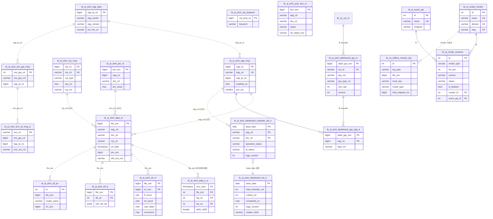

# DUTCHBOY Sensor API — 데이터베이스 재구현 명세

| 항목 | 값 |
|---|---|
| 대상 리포 | `dutchboy-sensor-api` (`src/main/resources/db/migration/`, `sqlmap/mapper/**`) |
| 기준 브랜치 / 커밋 | `dev` / `4a16066772060f5a67c3ca21f86c4b3dad9d3819` (2026-09-29) |
| 작성일 | 2026-10-06 |
| 짝 문서 | `backend.md`(이 폴더), `frontend.md`(별도 작성) |
| 작성 방식 | `V1__baseline.sql`(pg_dump 스냅샷) 위에 `V2`~`V202609291625`를 순서대로 적용한 **최종 상태**로 DDL을 재구성했다. 컬럼 타입은 pg_dump 표기를 그대로 두었다. 코드로 확인되지 않은 내용은 "(추정)" |
| 보안 | 자격증명·호스트·회사명·실명은 `<PLACEHOLDER>`로 일반화. 시드의 비밀번호는 값 대신 `<초기 비밀번호>` |

## 목차

1. [DB 개요](#1-db-개요)
2. [ERD](#2-erd)
3. [시스템 테이블 상세](#3-시스템-테이블-상세)
4. [도메인 테이블](#4-도메인-테이블)
5. [시드/초기 데이터](#5-시드초기-데이터)
6. [뷰/함수/트리거/시퀀스/continuous aggregate](#6-뷰함수트리거시퀀스continuous-aggregate)
7. [마이그레이션 이력 요약](#7-마이그레이션-이력-요약)
8. [재구현 체크리스트](#8-재구현-체크리스트)

---

## 1. DB 개요

### 1.1 엔진·스키마

| 항목 | 값 | 근거 |
|---|---|---|
| RDBMS | PostgreSQL **14 이상** | `README.md` 8.7, `docs/ERD.md`("PostgreSQL 14") |
| 확장 | **TimescaleDB** (`CREATE EXTENSION IF NOT EXISTS timescaledb` — `V1__baseline.sql` 8행). 버전 명시 없음. `tb_ai_etch_data_s_w`에 `_timescaledb_functions.insert_blocker` 트리거가 있어 Timescale 2.x 계열 (추정) | |
| 스키마 | `public` 단일 | pg_dump `-n public` |
| DB 이름 | 운영 `semes`, 사내 sandbox `semes_test`, 고객사 온프레미스 별도 | `AGENTS.md` |
| 접속 | 앱은 log4jdbc `DriverSpy` 경유, Flyway는 `@FlywayDataSource`로 같은 DataSource | `config/DataSourceBeanConfig.java` |
| 보조 DB | Airflow 메타 DB(별도 PostgreSQL, 읽기 전용 조회: `dag_run`, `task_instance`, `xcom`, `log`, `serialized_dag`, `rendered_task_instance_fields`) | `sqlmap/mapper/airflow/*.xml` |

### 1.2 Flyway 설정

| 키 | 값 |
|---|---|
| `spring.flyway.enabled` | `${FLYWAY_ENABLED}` — 운영·고객사 컨테이너만 `true`. sandbox(`semes_test`)·로컬은 미설정/false |
| `locations` | `classpath:db/migration` (`src/main/resources/db/migration/`) |
| `table` | `flyway_schema_history` |
| `baseline-on-migrate` / `baseline-version` / `baseline-description` | `true` / `1` / `"Pre-Flyway baseline"` — 이미 스키마가 있는 DB는 V1을 BASELINE 마킹 후 V2부터, 빈 DB는 V1부터 전부 적용 |
| `validate-on-migrate` / `validate-migration-naming` | `true` / `true` — 적용된 파일 체크섬 변경 시 기동 실패 |
| `out-of-order` | **`false`** — 적용된 최대 버전보다 작은 버전은 거부 |
| `mixed` / `clean-disabled` | `false` / `true` |

### 1.3 네이밍 규칙 (`db/migration/README.md`가 최종 권위)

- 파일명: **`V<yyyyMMddHHmm>__<영문_설명>.sql`** (예: `V202609291625__add_dashboard_aggregation_version.sql`). 뷰/함수/반복 시드는 `R__<이름>.sql`. `V1`~`V22`는 과거 순차 번호로 그대로 둔다. **`V23__` 같은 순차 번호는 금지** — `V202608…`이 이미 적용돼 `out-of-order:false`에 걸린다. CI `scripts/check-migrations.sh`가 형식·순서·중복·머지된 파일 변경을 검사한다.
- 브랜치당 미반영 마이그레이션 1개 유지, 머지 직전 dev에 더 큰 버전이 들어왔으면 리네임 후 파이프라인 재실행.
- 운영 절차(README 요지): sandbox에서 자유롭게 실험 → 운영 반영분만 타임스탬프 파일로 작성 → **빈 PG(+timescaledb)에 `FLYWAY_ENABLED=true`로 기동해 전체 적용 검증** → MR → dev 머지 시 다음 배포 컨테이너가 자동 적용. 운영·고객사 DB 콘솔 직접 변경 금지. 롤백은 `undo` 대신 `V<ts>__revert_<원본>.sql` + `docs/db/rollback/*`.
- 테이블 접두: `TB_CO_*` 공통/시스템, `TB_HR_*` 인사(부서), `TB_AI_ETCH_*` Etch 도메인(python 적재 + 일부 API 관리), `TB_AI_MODEL_*`/`TB_AI_EVENT_*` AI 모델 메타, `TB_DI_*` 데이터 통합(미사용 레거시). 접미: `_M` 마스터, `_D` 상세, `_R` 관계(매핑), `_H` 이력/시계열, `_G` 로그, `_C` 코드, `_W` 작업(wide).
- 제약명: `pk_`, `fk_<table>_NN`, `ck_<table>_NN`, `ux_/uq_` 유니크, `ix_/ik` 인덱스. 신규 테이블은 CHECK로 Y/N·코드값·빈 문자열을 강제한다.
- 공통 컬럼: v1 레거시 `REGR_ID varchar(20)`, `REG_DATE date`, `UPDR_ID varchar(20)`, `UPD_DATE date`; v2/신규 `REGR_ID varchar(50) NOT NULL`, `REG_DATE timestamp NOT NULL DEFAULT now()`, `UPDR_ID`, `UPD_DATE`; Etch 도메인 `REG_ID/REG_DATE/UPD_ID/UPD_DATE`(date 또는 timestamp). 앱은 `SaveDTO.registId/updateId`를 `UserIdInjectAspect`로 채운다.
- 식별자: pg_dump 결과는 소문자(`tb_co_usr_m`). 매퍼 XML은 대문자로 쓰지만 PostgreSQL이 접어서 같다.

---

## 2. ERD

### 2.1 시스템 (v1 사용자·권한·메뉴 + v2 역할·내비게이션)

```mermaid
erDiagram
    tb_co_usr_m {
        varchar usr_id PK
        varchar pwd
        varchar dpt_cd
        varchar emp_no
        varchar usr_nm
        varchar blc_yn
        numeric lgn_attm_scnt
        varchar hlfc_dtt_cd
        varchar usr_tp_cd
    }
    tb_hr_dpt_m {
        varchar dpt_cd PK
        varchar dpt_nm
        varchar hrk_dpt_cd
        numeric dpt_lvl_val
    }
    tb_co_ath_m {
        varchar ath_id PK
        varchar ath_nm
        varchar use_yn
        numeric srt_sqn
    }
    tb_co_usr_ath_r {
        varchar usr_id PK
        varchar ath_id PK
    }
    tb_co_pgm_m {
        varchar pgm_id PK
        varchar pgm_nm
        varchar use_yn
    }
    tb_co_mnu_m {
        varchar mnu_id PK
        varchar hrk_mnu_id
        varchar mnu_nm
        varchar pgm_id
        numeric srt_sqn
        varchar use_yn
    }
    tb_co_mnu_ath_r {
        varchar ath_id PK
        varchar mnu_id PK
        varchar inq_ath_yn
        varchar upd_ath_yn
        varchar prnt_ath_yn
    }
    tb_co_favr_mnu_r {
        varchar usr_id PK
        varchar mnu_id PK
    }
    tb_co_lgn_his_h {
        varchar lgn_sno PK
        timestamptz lgn_date
        varchar usr_id
        varchar ip_addr
        varchar lgn_sucs_yn
    }
    tb_co_role_m {
        bigint role_id PK
        varchar role_nm
        varchar scope_cd
        char use_yn
        char sys_prot_yn
    }
    tb_co_usr_role_r {
        varchar usr_id PK
        bigint role_id PK
    }
    tb_co_role_ath_r {
        bigint role_id PK
        varchar ath_id PK
    }
    tb_co_role_menu_r {
        bigint role_id PK
        bigint nav_mnu_id PK
        char mnu_accs_yn
        char mnu_dspl_yn
    }
    tb_co_nav_feature_m {
        varchar ftr_key PK
        varchar page_id
        varchar rout_path
        varchar dflt_title
        char active_yn
        char menu_enabled_yn
        varchar src_hash_val
    }
    tb_co_nav_feature_sync_h {
        bigint sync_his_id PK
        varchar sync_mode_cd
        varchar sync_rslt_cd
    }
    tb_co_nav_feature_sync_d {
        bigint sync_dtl_id PK
        bigint sync_his_id FK
        varchar ftr_key
        varchar sync_act_cd
    }
    tb_co_nav_menu_m {
        bigint nav_mnu_id PK
        bigint prnt_nav_mnu_id FK
        int mnu_level
        bigint_array path
        varchar mnu_type_cd
        varchar ftr_key FK
        varchar url_addr
        varchar dflt_mnu_nm
        char mnu_dspl_yn
        char use_yn
        char rpt_use_yn
    }
    tb_co_nav_menu_nm_m {
        bigint nav_mnu_id PK
        varchar locl_cd PK
        varchar mnu_nm
    }
    tb_co_nav_usr_menu_pref_r {
        varchar usr_id PK
        bigint nav_mnu_id PK
        char hide_yn
        char favr_yn
        int usr_sort_sqn
    }
    tb_co_usr_preference {
        varchar usr_id PK
        varchar pref_key PK
        jsonb value_json
    }
    tb_co_usr_dashboard_layout {
        varchar usr_id PK
        varchar page_id PK
        jsonb layouts_json
    }

    tb_hr_dpt_m ||..o{ tb_co_usr_m : "dpt_cd (논리)"
    tb_co_usr_m ||..o{ tb_co_usr_ath_r : "논리"
    tb_co_ath_m ||..o{ tb_co_usr_ath_r : "논리"
    tb_co_ath_m ||..o{ tb_co_mnu_ath_r : "논리"
    tb_co_mnu_m ||..o{ tb_co_mnu_ath_r : "논리"
    tb_co_mnu_m ||..o{ tb_co_mnu_m : "hrk_mnu_id (논리)"
    tb_co_pgm_m ||..o{ tb_co_mnu_m : "pgm_id (논리)"
    tb_co_usr_m ||..o{ tb_co_favr_mnu_r : "논리"
    tb_co_mnu_m ||..o{ tb_co_favr_mnu_r : "논리"
    tb_co_usr_m ||..o{ tb_co_lgn_his_h : "논리"
    tb_co_usr_m ||..o{ tb_co_usr_role_r : "논리"
    tb_co_role_m ||--o{ tb_co_usr_role_r : "fk cascade"
    tb_co_role_m ||--o{ tb_co_role_ath_r : "fk cascade"
    tb_co_ath_m ||..o{ tb_co_role_ath_r : "논리(앱 검증)"
    tb_co_role_m ||--o{ tb_co_role_menu_r : "fk cascade"
    tb_co_nav_menu_m ||..o{ tb_co_role_menu_r : "논리(앱 검증)"
    tb_co_nav_feature_m ||--o{ tb_co_nav_menu_m : "fk ftr_key"
    tb_co_nav_menu_m ||--o{ tb_co_nav_menu_m : "fk prnt"
    tb_co_nav_menu_m ||--o{ tb_co_nav_menu_nm_m : "fk cascade"
    tb_co_nav_menu_m ||--o{ tb_co_nav_usr_menu_pref_r : "fk cascade"
    tb_co_usr_m ||--o{ tb_co_nav_usr_menu_pref_r : "fk"
    tb_co_nav_feature_sync_h ||--o{ tb_co_nav_feature_sync_d : "fk cascade"
    tb_co_usr_m ||--o{ tb_co_usr_preference : "fk cascade"
    tb_co_usr_m ||--o{ tb_co_usr_dashboard_layout : "fk cascade"
```



### 2.2 도메인 핵심 관계 (Etch · 대시보드 · 모델 메타 · 모니터링)



---

## 3. 시스템 테이블 상세

### 3.1 v1 (레거시) 시스템 테이블

모두 `V1__baseline.sql`에서 생성되며 이후 마이그레이션에서 변경이 없다. FK가 없고 무결성은 앱이 보장한다.

#### `tb_co_usr_m` — 사용자 마스터 (v1·v2 공용)

```sql
CREATE TABLE public.tb_co_usr_m (
    usr_id              character varying(20)  NOT NULL,
    pwd                 character varying(100),                       -- 현재 평문. 재구현 시 bcrypt 해시(60자) 저장
    hrk_rlt_cmp_cd      character varying(4),                         -- 상위 관계회사 코드 (TB_CO_CMN_CD_C DPT_CD.USR_FLD_2_CONT)
    rlt_cmp_cd          character varying(4),                         -- 관계회사 코드 (USR_FLD_1_CONT)
    dpt_cd              character varying(10)  NOT NULL,              -- 부서 코드 → tb_hr_dpt_m
    pscl_cd             character varying(10),                        -- 직급 코드
    rspofc_cd           character varying(10),                        -- 직책 코드
    emp_no              character varying(10),                        -- 사번 (초기 비밀번호 원천)
    usr_nm              character varying(100),
    mbl_tel_no          character varying(20),
    tel_no              character varying(20),
    fax_no              character varying(20),
    eml_addr            character varying(100),
    blc_yn              character varying(1)   DEFAULT 'N',           -- 잠금 Y/N
    lgn_attm_scnt       numeric(5,0),                                 -- 로그인 시도 횟수
    hlfc_dtt_cd         character varying(4),                         -- 재직 구분 '1' 재직 / '0' 퇴직
    usr_dtt_cd          character varying(4),
    usr_tp_cd           character varying(4),                         -- 사용자 유형
    gogl_lnkg_use_yn    character varying(1),
    refresh_token_val   character varying(1000),                      -- 미사용
    regr_id             character varying(20),
    reg_date            date,
    updr_id             character varying(20),
    upd_date            date,
    CONSTRAINT pk_tb_co_usr_m PRIMARY KEY (usr_id)
);
```

샘플 행:

| usr_id | pwd | dpt_cd | emp_no | usr_nm | blc_yn | lgn_attm_scnt | hlfc_dtt_cd | usr_tp_cd |
|---|---|---|---|---|---|---|---|---|
| `su` | `<초기 비밀번호>` | `D001` | `100001` | 시스템관리자 | N | 0 | 1 | `U` |

#### `tb_co_ath_m` — 권한(v1) 마스터

```sql
CREATE TABLE public.tb_co_ath_m (
    ath_id              character varying(10)  NOT NULL,   -- 예: ATCO010(일반), ATCO090(관리자)
    ath_nm              character varying(100),
    hrk_ath_id          character varying(10),
    ath_desc_cont       character varying(2000),
    use_yn              character varying(1)   DEFAULT 'Y',
    srt_sqn             numeric(5,0),
    utr_dpt_ath_yn      character varying(1),              -- 단일 부서 권한 여부
    utr_use_dpt_cd      character varying(10),
    whl_rlt_cmp_use_yn  character varying(1),              -- 전 관계회사 사용 여부
    regr_id             character varying(20), reg_date date,
    updr_id             character varying(20), upd_date date,
    CONSTRAINT pk_tb_co_ath_m PRIMARY KEY (ath_id)
);
```

#### `tb_co_usr_ath_r` — 사용자×권한 (로그인 토큰 클레임 원천)

```sql
CREATE TABLE public.tb_co_usr_ath_r (
    usr_id   character varying(20) NOT NULL,
    ath_id   character varying(10) NOT NULL,
    regr_id  character varying(20), reg_date date,
    updr_id  character varying(20), upd_date date,
    CONSTRAINT pk_tb_co_usr_ath_r PRIMARY KEY (usr_id, ath_id)
);
```

#### `tb_co_pgm_m` — 프로그램(화면) 마스터

```sql
CREATE TABLE public.tb_co_pgm_m (
    pgm_id        character varying(20)  NOT NULL,
    pgm_nm        character varying(200),
    pgm_desc_cont character varying(2000),
    sys_dtt_cd    character varying(10),
    use_yn        character varying(1),
    desc_rmk      character varying(1000),
    regr_id character varying(20), reg_date date, updr_id character varying(20), upd_date date,
    CONSTRAINT pk_tb_co_pgm_m PRIMARY KEY (pgm_id)
);
```

#### `tb_co_mnu_m` — 메뉴(v1) 마스터

```sql
CREATE TABLE public.tb_co_mnu_m (
    mnu_id          character varying(10)  NOT NULL,
    hrk_mnu_id      character varying(10),                 -- 루트 '-1', 최상위 그룹의 부모 '0'
    mnu_nm          character varying(100),
    pgm_id          character varying(20),                 -- → tb_co_pgm_m
    mnu_cont        character varying(2000),
    srt_sqn         numeric(5,0),
    mnu_idct_yn     character varying(1),                  -- 표시 여부
    use_yn          character varying(1)   DEFAULT 'Y',
    dmn_cd          character varying(8),
    cnn_dtt_cd      character varying(3),
    mnu_parm_val    character varying(1000),
    hlsn_url_addr   character varying(100),
    nth_lgn_pms_yn  character varying(1),                  -- 비로그인 허용
    prv_inf_icd_yn  character varying(1),
    od_cd           character varying(20),
    regr_id character varying(20), reg_date date, updr_id character varying(20), upd_date date,
    CONSTRAINT pk_tb_co_mnu_m PRIMARY KEY (mnu_id)
);
```

#### `tb_co_mnu_ath_r` — 권한×메뉴(v1)

```sql
CREATE TABLE public.tb_co_mnu_ath_r (
    ath_id          character varying(10) NOT NULL,
    mnu_id          character varying(10) NOT NULL,
    inq_ath_yn      character varying(1),     -- 조회
    upd_ath_yn      character varying(1),     -- 수정
    prnt_ath_yn     character varying(1),     -- 출력
    inq_rng_dtt_cd  character varying(1),     -- 조회 범위 구분
    regr_id character varying(20), reg_date date, updr_id character varying(20), upd_date date,
    CONSTRAINT pk_tb_co_mnu_ath_r PRIMARY KEY (ath_id, mnu_id)
);
```

#### `tb_co_favr_mnu_r` — 즐겨찾기(v1)

```sql
CREATE TABLE public.tb_co_favr_mnu_r (
    usr_id  character varying(20) NOT NULL,
    mnu_id  character varying(10) NOT NULL,
    regr_id character varying(20), reg_date date, updr_id character varying(20), upd_date date,
    CONSTRAINT pk_tb_co_favr_mnu_r PRIMARY KEY (usr_id, mnu_id)
);
```

#### `tb_co_lgn_his_h` — 로그인 이력

```sql
CREATE TABLE public.tb_co_lgn_his_h (
    lgn_sno           character varying(15) NOT NULL,      -- YYYYMMDD || LPAD(nextval('sq_lgn_his_01'),7,'0')
    lgn_date          timestamp with time zone,
    usr_id            character varying(20),
    ip_addr           character varying(100),
    lgn_sucs_yn       character varying(1),                 -- 앱은 'Y'만 기록(성공만). 조회 SQL은 '1'도 비교함
    dmn_cd            character varying(8),
    ope_rsbr_cnn_yn   character varying(1),
    ope_rsbr_id       character varying(10),
    cnn_prps_cd       character varying(4),
    cnn_rsn_cont      character varying(2000),
    regr_id character varying(20), reg_date date, updr_id character varying(20), upd_date date,
    CONSTRAINT pk_tb_co_lgn_his_h PRIMARY KEY (lgn_sno)
);
```

> 주의: `LoginService`는 `LGN_SUCS_YN='Y'`로 INSERT하지만 `loginMapper.selectLoginDetail`·`userAccountMapperV2`의 최근 로그인 조회는 `LGN_SUCS_YN='1'`을 조건으로 쓴다. 재구현 시 값 체계를 하나(`'Y'/'N'` 권장)로 통일할 것.

#### 이력 테이블 4종 (`CHG_DTT_CD` I/U/D, `*_HIS_SNO = YYMMDDHH24MISS || 8자리 시퀀스`)

```sql
CREATE TABLE public.tb_co_ath_his_h (
    ath_his_sno character varying(20) NOT NULL, his_occ_date date, chg_dtt_cd character varying(10),
    ath_id character varying(20), ath_nm character varying(100), hrk_ath_id character varying(20),
    ath_desc_cont character varying(2000), use_yn character varying(1) DEFAULT 'Y', srt_sqn numeric(5,0),
    utr_dpt_ath_yn character varying(1), utr_use_dpt_cd character varying(10), whl_rlt_cmp_use_yn character varying(1),
    regr_id character varying(20), reg_date date, updr_id character varying(20), upd_date date,
    CONSTRAINT pk_tb_co_ath_his_h PRIMARY KEY (ath_his_sno));

CREATE TABLE public.tb_co_mnu_his_h (
    mnu_his_sno character varying(20) NOT NULL, his_occ_date date, chg_dtt_cd character varying(10),
    mnu_id character varying(10), hrk_mnu_id character varying(10), pgm_id character varying(20),
    mnu_nm character varying(100), mnu_cont character varying(2000), srt_sqn numeric(5,0),
    mnu_idct_yn character varying(1), use_yn character varying(1) DEFAULT 'Y', dmn_cd character varying(8),
    cnn_dtt_cd character varying(3), mnu_parm_val character varying(1000), nth_lgn_pms_yn character varying(1),
    hlsn_url_addr character varying(100), prv_inf_icd_yn character varying(1),
    regr_id character varying(20), reg_date date, updr_id character varying(20), upd_date date,
    CONSTRAINT pk_tb_co_mnu_his_h PRIMARY KEY (mnu_his_sno));

CREATE TABLE public.tb_co_mnu_ath_his_h (
    mnu_ath_his_sno character varying(20) NOT NULL, his_occ_date date, chg_dtt_cd character varying(10),
    mnu_id character varying(10), ath_id character varying(10), inq_ath_yn character varying(1),
    upd_ath_yn character varying(1), prnt_ath_yn character varying(1), inq_rng_dtt_cd character varying(1),
    regr_id character varying(20), reg_date date, updr_id character varying(20), upd_date date,
    CONSTRAINT pk_tb_co_mnu_ath_his_h PRIMARY KEY (mnu_ath_his_sno));

CREATE TABLE public.tb_co_usr_ath_his_h (
    usr_ath_his_sno character varying(20) NOT NULL, his_occ_date character varying(10), chg_dtt_cd character varying(10),
    usr_id character varying(20), ath_id character varying(10),
    regr_id character varying(20), reg_date date, updr_id character varying(20), upd_date date,
    CONSTRAINT pk_tb_co_usr_ath_his_h PRIMARY KEY (usr_ath_his_sno));
```

#### 로그·코드·기타

```sql
CREATE TABLE public.tb_co_sys_log_g (                       -- 컨트롤러 호출 로그 (SystemLoggingAspectJoinPoint)
    log_sno character varying(20) NOT NULL, mnu_id character varying(50), pgm_id character varying(50),
    cl_mth_nm character varying(200), cl_vrb_cont character varying(4000), usr_id character varying(20),
    log_occ_date timestamp with time zone, cl_ip_addr character varying(100), dmn_cd character varying(8),
    regr_id character varying(20), reg_date date, updr_id character varying(20), upd_date date);
CREATE INDEX ik1_tb_co_sys_log_g ON public.tb_co_sys_log_g (log_sno);   -- PK 없음

CREATE TABLE public.tb_co_err_log_g (                       -- 오류 로그 (현재 AOP 비활성)
    log_sno character varying(20) NOT NULL, mnu_id character varying(10), pgm_id character varying(20),
    cl_mth_nm character varying(200), cl_vrb_cont character varying(4000), usr_id character varying(20),
    log_occ_date timestamp with time zone, err_log_cont character varying(4000), cl_ip_addr character varying(100),
    err_tp_cd character varying(2), regr_id character varying(20), reg_date date, updr_id character varying(20), upd_date date,
    CONSTRAINT pk_tb_co_err_log_g PRIMARY KEY (log_sno));

CREATE TABLE public.tb_co_cmn_cd_c (                        -- 공통 코드 (TP_CD='DPT_CD' 가 부서→관계회사 매핑에 사용)
    tp_cd character varying(30) NOT NULL, cmn_cd character varying(10) NOT NULL, cmn_cd_nm character varying(100),
    cmn_cd_abv_nm character varying, cmn_cd_cont character varying(2000), srt_sqn numeric(5,0),
    use_yn character varying(1) DEFAULT 'Y', usr_fld_1_cont character varying(100), usr_fld_2_cont character varying(100),
    usr_fld_3_cont character varying(100), usr_fld_4_cont character varying(100), usr_fld_5_cont character varying(100),
    od_cd character varying(20), regr_id character varying(20), reg_date date, updr_id character varying(20), upd_date date,
    CONSTRAINT pk_tb_co_cmn_cd_c PRIMARY KEY (tp_cd, cmn_cd));

CREATE TABLE public.tb_co_cmn_cd_tp_c (                     -- 공통 코드 유형
    tp_cd character varying(30) NOT NULL, tp_cd_nm character varying(200), tp_cd_cont character varying(4000),
    use_yn character varying(1), use_clsf_cd character varying(3), sys_dtt_cd character varying(10), tsk_dtt_cd character varying(10),
    cmn_cd_len_val numeric(5,0),
    usr_fld_1_nm character varying(200), usr_fld_1_inp_frm_cd character varying(5), usr_fld_1_tp_cd character varying(32),
    usr_fld_2_nm character varying(200), usr_fld_2_inp_frm_cd character varying(5), usr_fld_2_tp_cd character varying(32),
    usr_fld_3_nm character varying(200), usr_fld_3_inp_frm_cd character varying(5), usr_fld_3_tp_cd character varying(32),
    usr_fld_4_nm character varying(200), usr_fld_4_inp_frm_cd character varying(5), usr_fld_4_tp_cd character varying(32),
    usr_fld_5_nm character varying(200), usr_fld_5_inp_frm_cd character varying(5), usr_fld_5_tp_cd character varying(32),
    od_tp_cd character varying(20), regr_id character varying(20), reg_date date, updr_id character varying(20), upd_date date,
    "공통여부" character varying,                            -- 한글 컬럼명(레거시). 재구현 시 제거 권장
    CONSTRAINT pk_tb_co_cmn_cd_tp_c PRIMARY KEY (tp_cd));

CREATE TABLE public.tb_hr_dpt_m (                           -- 부서 (DepartmentController 가 CRUD)
    dpt_cd character varying(10) NOT NULL, dpt_nm character varying(200), dpt_dtt_cd character varying(4),
    hrk_dpt_cd character varying(10), reg_ymd character varying(8), dus_ymd character varying(8), srt_sqn numeric(5,0),
    use_yn character varying(1) DEFAULT '1', rmk_cont character varying(100), dpt_lvl_val numeric(5,0),
    dpt_whl_cd character varying(50), dpt_whl_nm character varying(200),
    regr_id character varying(20), reg_date date, updr_id character varying(20), upd_date date,
    CONSTRAINT pk_tb_hr_dpt_m PRIMARY KEY (dpt_cd));
```

미사용 레거시(DDL만 존재, 코드 참조 없음): `tb_co_atch_fl_m`(첨부파일, PK `(dcm_id, fl_sno)`), `tb_co_cmn_cmb`(공통 콤보 SQL 정의), `tb_co_srch_ppu_m`(검색 팝업 정의), `tb_co_sys_msg_c`(시스템 메시지), `tb_co_list`(코드 리스트 — 챔버 목록은 `V202608281015`에서 `pm_cnt`로 이관됨).

### 3.2 v2 시스템 테이블 (Navigation / Role / 사용자 설정)

`V1__baseline.sql`에 포함(Flyway 이전 `sql/v2/V2__create_navigation_tables.sql`로 수동 적용됐던 것), `rpt_use_yn`은 `V202609221010`, `tb_co_usr_dashboard_layout`은 `V15`, `tb_co_usr_preference`는 `V202609011351`.

#### `tb_co_nav_feature_m` — Feature 레지스트리

```sql
CREATE TABLE public.tb_co_nav_feature_m (
    ftr_key          character varying(100) NOT NULL,
    page_id          character varying(100) NOT NULL,
    rout_path        character varying(200) NOT NULL,
    dflt_title       character varying(200) NOT NULL,
    dflt_locl_cd     character varying(10)  DEFAULT 'ko' NOT NULL,
    icon_nm          character varying(100),
    pgm_id           character varying(100),
    sync_enabled_yn  character(1) DEFAULT 'Y' NOT NULL,
    menu_enabled_yn  character(1) DEFAULT 'Y' NOT NULL,
    active_yn        character(1) DEFAULT 'Y' NOT NULL,
    src_hash_val     character varying(64)  NOT NULL,                     -- SHA-256 hex
    src_meta_json    jsonb DEFAULT '{}'::jsonb NOT NULL,
    frst_sync_dttm   timestamp without time zone DEFAULT now() NOT NULL,
    last_sync_dttm   timestamp without time zone DEFAULT now() NOT NULL,
    last_seen_dttm   timestamp without time zone DEFAULT now() NOT NULL,
    regr_id          character varying(50) NOT NULL,
    reg_date         timestamp without time zone DEFAULT now() NOT NULL,
    updr_id          character varying(50) NOT NULL,
    upd_date         timestamp without time zone DEFAULT now() NOT NULL,
    CONSTRAINT tb_co_nav_feature_m_pkey PRIMARY KEY (ftr_key),
    CONSTRAINT ck_tb_co_nav_feature_m_01 CHECK (sync_enabled_yn IN ('Y','N')),
    CONSTRAINT ck_tb_co_nav_feature_m_02 CHECK (menu_enabled_yn IN ('Y','N')),
    CONSTRAINT ck_tb_co_nav_feature_m_03 CHECK (active_yn IN ('Y','N')),
    CONSTRAINT ck_tb_co_nav_feature_m_04 CHECK (btrim(ftr_key) <> ''),
    CONSTRAINT ck_tb_co_nav_feature_m_05 CHECK (btrim(page_id) <> ''),
    CONSTRAINT ck_tb_co_nav_feature_m_06 CHECK (btrim(rout_path) <> ''),
    CONSTRAINT ck_tb_co_nav_feature_m_07 CHECK (btrim(dflt_title) <> ''),
    CONSTRAINT ck_tb_co_nav_feature_m_08 CHECK (btrim(dflt_locl_cd) <> '')
);
CREATE INDEX ix_tb_co_nav_feature_m_01 ON public.tb_co_nav_feature_m (active_yn, menu_enabled_yn);
CREATE INDEX ix_tb_co_nav_feature_m_02 ON public.tb_co_nav_feature_m (pgm_id);
CREATE INDEX ix_tb_co_nav_feature_m_03 ON public.tb_co_nav_feature_m (last_sync_dttm);
CREATE UNIQUE INDEX ux_tb_co_nav_feature_m_01 ON public.tb_co_nav_feature_m (page_id)   WHERE active_yn = 'Y';
CREATE UNIQUE INDEX ux_tb_co_nav_feature_m_02 ON public.tb_co_nav_feature_m (rout_path) WHERE active_yn = 'Y';
```

| 컬럼 | 설명 |
|---|---|
| ftr_key | 프론트 `pageDefinitions[].featureKey` (예 `ai-analysis`) |
| page_id / rout_path | 페이지 ID, 라우트 경로. 활성 행 내 유니크 |
| sync_enabled_yn | 프론트가 스냅샷에 포함할지 |
| menu_enabled_yn | 메뉴로 연결 가능한지(N이면 트리에서 제외) |
| active_yn | SYNC 모드에서 스냅샷에 없으면 N |
| src_hash_val | 정규화 정의 SHA-256 — 변경 감지 |

샘플: `('ai-analysis','ai-analysis','/ai-analysis','AI Analysis','ko','chart','PGM_AI_ANALYSIS','Y','Y','Y','<sha256>','{"pageId":"ai-analysis","routePath":"/ai-analysis"}',now(),now(),now(),'SYSTEM',now(),'SYSTEM',now())`

#### `tb_co_nav_feature_sync_h` / `tb_co_nav_feature_sync_d` — Feature Sync 이력

```sql
CREATE TABLE public.tb_co_nav_feature_sync_h (
    sync_his_id        bigint GENERATED BY DEFAULT AS IDENTITY NOT NULL,
    sync_mode_cd       character varying(20) NOT NULL,
    sync_rslt_cd       character varying(20) NOT NULL,
    snapshot_hash_val  character varying(64) NOT NULL,
    tot_cnt integer DEFAULT 0 NOT NULL, ins_cnt integer DEFAULT 0 NOT NULL, upd_cnt integer DEFAULT 0 NOT NULL,
    nochg_cnt integer DEFAULT 0 NOT NULL, missing_cnt integer DEFAULT 0 NOT NULL, inact_cnt integer DEFAULT 0 NOT NULL,
    err_cnt integer DEFAULT 0 NOT NULL,
    snapshot_json      jsonb DEFAULT '[]'::jsonb NOT NULL,
    err_msg            text,
    req_usr_id         character varying(50),
    req_app_nm         character varying(100),
    reg_date           timestamp without time zone DEFAULT now() NOT NULL,
    CONSTRAINT tb_co_nav_feature_sync_h_pkey PRIMARY KEY (sync_his_id),
    CONSTRAINT ck_tb_co_nav_feature_sync_h_01 CHECK (sync_mode_cd IN ('NONE','VALIDATE','UPDATE','SYNC')),
    CONSTRAINT ck_tb_co_nav_feature_sync_h_02 CHECK (sync_rslt_cd IN ('SUCCESS','PARTIAL_FAIL','FAIL')),
    CONSTRAINT ck_tb_co_nav_feature_sync_h_03 CHECK (tot_cnt >= 0 AND ins_cnt >= 0 AND upd_cnt >= 0 AND nochg_cnt >= 0
                                                     AND missing_cnt >= 0 AND inact_cnt >= 0 AND err_cnt >= 0)
);
CREATE INDEX ix_tb_co_nav_feature_sync_h_01 ON public.tb_co_nav_feature_sync_h (reg_date DESC);
CREATE INDEX ix_tb_co_nav_feature_sync_h_02 ON public.tb_co_nav_feature_sync_h (sync_mode_cd, sync_rslt_cd);

CREATE TABLE public.tb_co_nav_feature_sync_d (
    sync_dtl_id    bigint GENERATED BY DEFAULT AS IDENTITY NOT NULL,
    sync_his_id    bigint NOT NULL,
    ftr_key        character varying(100),
    page_id        character varying(100),
    rout_path      character varying(200),
    sync_act_cd    character varying(20) NOT NULL,
    befr_hash_val  character varying(64),
    aftr_hash_val  character varying(64),
    note_msg       text,
    CONSTRAINT tb_co_nav_feature_sync_d_pkey PRIMARY KEY (sync_dtl_id),
    CONSTRAINT fk_tb_co_nav_feature_sync_d_01 FOREIGN KEY (sync_his_id) REFERENCES public.tb_co_nav_feature_sync_h(sync_his_id) ON DELETE CASCADE,
    CONSTRAINT ck_tb_co_nav_feature_sync_d_01 CHECK (sync_act_cd IN ('INSERT','UPDATE','NO_CHANGE','MISSING','INACTIVE','ERROR')),
    CONSTRAINT ck_tb_co_nav_feature_sync_d_02 CHECK (COALESCE(btrim(ftr_key),'') <> '' OR COALESCE(btrim(page_id),'') <> '' OR COALESCE(btrim(rout_path),'') <> '')
);
CREATE INDEX ix_tb_co_nav_feature_sync_d_01 ON public.tb_co_nav_feature_sync_d (ftr_key);
CREATE INDEX ix_tb_co_nav_feature_sync_d_02 ON public.tb_co_nav_feature_sync_d (sync_his_id);
```

#### `tb_co_nav_menu_m` — v2 메뉴 트리 (최종: `rpt_use_yn` 포함)

```sql
CREATE TABLE public.tb_co_nav_menu_m (
    nav_mnu_id       bigint GENERATED BY DEFAULT AS IDENTITY NOT NULL,
    prnt_nav_mnu_id  bigint,
    mnu_level        integer NOT NULL,
    path             bigint[] NOT NULL,                                -- 루트부터 자기 ID까지
    sort_sqn         integer DEFAULT 0 NOT NULL,
    mnu_type_cd      character varying(20) NOT NULL,                    -- GROUP | FEATURE | LINK
    ftr_key          character varying(100),
    url_addr         character varying(300),
    dflt_mnu_nm      character varying(200) NOT NULL,
    dflt_locl_cd     character varying(10) DEFAULT 'ko' NOT NULL,
    icon_nm          character varying(100),
    mnu_dspl_yn      character(1) DEFAULT 'Y' NOT NULL,
    use_yn           character(1) DEFAULT 'Y' NOT NULL,
    auth_match_cd    character varying(20) DEFAULT 'ANY' NOT NULL,      -- NONE | ANY | ALL (저장만, 판정 미구현)
    meta_json        jsonb DEFAULT '{}'::jsonb NOT NULL,
    rpt_use_yn       char(1) DEFAULT 'N' NOT NULL,                      -- V202609221010: 상단 리포트 버튼
    regr_id          character varying(50) NOT NULL,
    reg_date         timestamp without time zone DEFAULT now() NOT NULL,
    updr_id          character varying(50) NOT NULL,
    upd_date         timestamp without time zone DEFAULT now() NOT NULL,
    CONSTRAINT tb_co_nav_menu_m_pkey PRIMARY KEY (nav_mnu_id),
    CONSTRAINT fk_tb_co_nav_menu_m_01 FOREIGN KEY (prnt_nav_mnu_id) REFERENCES public.tb_co_nav_menu_m(nav_mnu_id),
    CONSTRAINT fk_tb_co_nav_menu_m_02 FOREIGN KEY (ftr_key) REFERENCES public.tb_co_nav_feature_m(ftr_key),
    CONSTRAINT ck_tb_co_nav_menu_m_01  CHECK (mnu_level >= 1),
    CONSTRAINT ck_tb_co_nav_menu_m_01a CHECK (sort_sqn >= 0),
    CONSTRAINT ck_tb_co_nav_menu_m_02  CHECK (mnu_type_cd IN ('GROUP','FEATURE','LINK')),
    CONSTRAINT ck_tb_co_nav_menu_m_03  CHECK (mnu_dspl_yn IN ('Y','N')),
    CONSTRAINT ck_tb_co_nav_menu_m_04  CHECK (use_yn IN ('Y','N')),
    CONSTRAINT ck_tb_co_nav_menu_m_05  CHECK (auth_match_cd IN ('NONE','ANY','ALL')),
    CONSTRAINT ck_tb_co_nav_menu_m_06  CHECK ((mnu_type_cd = 'GROUP'   AND ftr_key IS NULL     AND url_addr IS NULL)
                                           OR (mnu_type_cd = 'FEATURE' AND ftr_key IS NOT NULL AND url_addr IS NULL)
                                           OR (mnu_type_cd = 'LINK'    AND ftr_key IS NULL     AND url_addr IS NOT NULL)),
    CONSTRAINT ck_tb_co_nav_menu_m_07  CHECK ((prnt_nav_mnu_id IS NULL AND mnu_level = 1) OR (prnt_nav_mnu_id IS NOT NULL AND mnu_level > 1)),
    CONSTRAINT ck_tb_co_nav_menu_m_08  CHECK (cardinality(path) >= 1),
    CONSTRAINT ck_tb_co_nav_menu_m_09  CHECK ((prnt_nav_mnu_id IS NULL AND cardinality(path) = 1) OR (prnt_nav_mnu_id IS NOT NULL AND cardinality(path) > 1)),
    CONSTRAINT ck_tb_co_nav_menu_m_10  CHECK (btrim(dflt_mnu_nm) <> ''),
    CONSTRAINT ck_tb_co_nav_menu_m_11  CHECK (btrim(dflt_locl_cd) <> ''),
    CONSTRAINT ck_tb_co_nav_menu_m_12  CHECK (rpt_use_yn IN ('Y','N'))
);
CREATE INDEX ix_tb_co_nav_menu_m_01 ON public.tb_co_nav_menu_m (prnt_nav_mnu_id, sort_sqn);
CREATE INDEX ix_tb_co_nav_menu_m_02 ON public.tb_co_nav_menu_m (ftr_key);
CREATE INDEX ix_tb_co_nav_menu_m_03 ON public.tb_co_nav_menu_m (use_yn, mnu_dspl_yn);
CREATE INDEX ix_tb_co_nav_menu_m_04 ON public.tb_co_nav_menu_m USING gin (path);
```

샘플 행:

| nav_mnu_id | prnt | level | path | sort | type | ftr_key | url_addr | dflt_mnu_nm | dspl | use | rpt |
|---|---|---|---|---|---|---|---|---|---|---|---|
| 1 | NULL | 1 | `{1}` | 1 | GROUP | NULL | NULL | AI 분석 | Y | Y | N |
| 11 | 1 | 2 | `{1,11}` | 1 | FEATURE | `ai-analysis` | NULL | AI Analysis | Y | Y | Y |
| 90 | NULL | 1 | `{90}` | 9 | GROUP | NULL | NULL | 시스템 관리 | Y | Y | N |
| 91 | 90 | 2 | `{90,91}` | 1 | FEATURE | `menu-management-v2` | NULL | 메뉴 관리 | Y | Y | N |

#### `tb_co_nav_menu_nm_m`, `tb_co_nav_usr_menu_pref_r`

```sql
CREATE TABLE public.tb_co_nav_menu_nm_m (
    nav_mnu_id bigint NOT NULL, locl_cd character varying(10) NOT NULL, mnu_nm character varying(200) NOT NULL,
    regr_id character varying(50) NOT NULL, reg_date timestamp without time zone DEFAULT now() NOT NULL,
    updr_id character varying(50) NOT NULL, upd_date timestamp without time zone DEFAULT now() NOT NULL,
    CONSTRAINT pk_tb_co_nav_menu_nm_m PRIMARY KEY (nav_mnu_id, locl_cd),
    CONSTRAINT fk_tb_co_nav_menu_nm_m_01 FOREIGN KEY (nav_mnu_id) REFERENCES public.tb_co_nav_menu_m(nav_mnu_id) ON DELETE CASCADE,
    CONSTRAINT ck_tb_co_nav_menu_nm_m_01 CHECK (btrim(locl_cd) <> ''),
    CONSTRAINT ck_tb_co_nav_menu_nm_m_02 CHECK (btrim(mnu_nm) <> ''));
CREATE INDEX ix_tb_co_nav_menu_nm_m_01 ON public.tb_co_nav_menu_nm_m (locl_cd);

CREATE TABLE public.tb_co_nav_usr_menu_pref_r (
    usr_id character varying(50) NOT NULL, nav_mnu_id bigint NOT NULL,
    hide_yn character(1), favr_yn character(1), usr_sort_sqn integer,
    regr_id character varying(50) NOT NULL, reg_date timestamp without time zone DEFAULT now() NOT NULL,
    updr_id character varying(50) NOT NULL, upd_date timestamp without time zone DEFAULT now() NOT NULL,
    CONSTRAINT pk_tb_co_nav_usr_menu_pref_r PRIMARY KEY (usr_id, nav_mnu_id),
    CONSTRAINT fk_tb_co_nav_usr_menu_pref_r_01 FOREIGN KEY (usr_id) REFERENCES public.tb_co_usr_m(usr_id),
    CONSTRAINT fk_tb_co_nav_usr_menu_pref_r_02 FOREIGN KEY (nav_mnu_id) REFERENCES public.tb_co_nav_menu_m(nav_mnu_id) ON DELETE CASCADE,
    CONSTRAINT ck_tb_co_nav_usr_menu_pref_r_01 CHECK (hide_yn IS NULL OR hide_yn IN ('Y','N')),
    CONSTRAINT ck_tb_co_nav_usr_menu_pref_r_02 CHECK (favr_yn IS NULL OR favr_yn IN ('Y','N')),
    CONSTRAINT ck_tb_co_nav_usr_menu_pref_r_03 CHECK (usr_sort_sqn IS NULL OR usr_sort_sqn >= 0),
    CONSTRAINT ck_tb_co_nav_usr_menu_pref_r_04 CHECK (hide_yn IS NOT NULL OR favr_yn IS NOT NULL OR usr_sort_sqn IS NOT NULL));
CREATE INDEX ix_tb_co_nav_usr_menu_pref_r_01 ON public.tb_co_nav_usr_menu_pref_r (usr_id, favr_yn);
CREATE INDEX ix_tb_co_nav_usr_menu_pref_r_02 ON public.tb_co_nav_usr_menu_pref_r (usr_id, usr_sort_sqn);
```

> `usr_id` 길이가 `tb_co_usr_m.usr_id`(20)와 달리 50이다. FK는 타입 호환이면 허용되지만 재구현 시 20 또는 50으로 통일 권장.

#### `tb_co_role_m`, `tb_co_role_ath_r`, `tb_co_usr_role_r`, `tb_co_role_menu_r`

```sql
CREATE TABLE public.tb_co_role_m (
    role_id         bigint GENERATED BY DEFAULT AS IDENTITY NOT NULL,
    role_nm         character varying(100) NOT NULL,
    role_desc_cont  character varying(500),
    scope_cd        character varying(20) NOT NULL,          -- SU | ADMIN | DEFAULT
    use_yn          character(1) DEFAULT 'Y' NOT NULL,
    sys_prot_yn     character(1) DEFAULT 'N' NOT NULL,       -- Y 면 수정/삭제/할당 불가
    regr_id character varying(50) NOT NULL, reg_date timestamp without time zone DEFAULT now() NOT NULL,
    updr_id character varying(50) NOT NULL, upd_date timestamp without time zone DEFAULT now() NOT NULL,
    CONSTRAINT tb_co_role_m_pkey PRIMARY KEY (role_id),
    CONSTRAINT ck_tb_co_role_m_01 CHECK (scope_cd IN ('SU','ADMIN','DEFAULT')),
    CONSTRAINT ck_tb_co_role_m_02 CHECK (use_yn IN ('Y','N')),
    CONSTRAINT ck_tb_co_role_m_03 CHECK (sys_prot_yn IN ('Y','N')),
    CONSTRAINT ck_tb_co_role_m_04 CHECK (btrim(role_nm) <> ''));
CREATE UNIQUE INDEX ux_tb_co_role_m_01 ON public.tb_co_role_m (scope_cd) WHERE scope_cd = 'SU';     -- SU 역할 1개
CREATE UNIQUE INDEX ux_tb_co_role_m_02 ON public.tb_co_role_m (role_nm)  WHERE use_yn = 'Y';        -- 활성 역할명 유니크

CREATE TABLE public.tb_co_role_ath_r (
    role_id bigint NOT NULL, ath_id character varying(50) NOT NULL,
    regr_id character varying(50) NOT NULL, reg_date timestamp without time zone DEFAULT now() NOT NULL,
    updr_id character varying(50) NOT NULL, upd_date timestamp without time zone DEFAULT now() NOT NULL,
    CONSTRAINT pk_tb_co_role_ath_r PRIMARY KEY (role_id, ath_id),
    CONSTRAINT fk_tb_co_role_ath_r_01 FOREIGN KEY (role_id) REFERENCES public.tb_co_role_m(role_id) ON DELETE CASCADE,
    CONSTRAINT ck_tb_co_role_ath_r_01 CHECK (btrim(ath_id) <> ''));
CREATE INDEX ix_tb_co_role_ath_r_01 ON public.tb_co_role_ath_r (ath_id);

CREATE TABLE public.tb_co_usr_role_r (
    usr_id character varying(50) NOT NULL, role_id bigint NOT NULL,
    regr_id character varying(50) NOT NULL, reg_date timestamp without time zone DEFAULT now() NOT NULL,
    updr_id character varying(50) NOT NULL, upd_date timestamp without time zone DEFAULT now() NOT NULL,
    CONSTRAINT pk_tb_co_usr_role_r PRIMARY KEY (usr_id, role_id),
    CONSTRAINT fk_tb_co_usr_role_r_01 FOREIGN KEY (role_id) REFERENCES public.tb_co_role_m(role_id) ON DELETE CASCADE,
    CONSTRAINT ck_tb_co_usr_role_r_01 CHECK (btrim(usr_id) <> ''));
CREATE INDEX ix_tb_co_usr_role_r_01 ON public.tb_co_usr_role_r (role_id);

CREATE TABLE public.tb_co_role_menu_r (
    role_id bigint NOT NULL, nav_mnu_id bigint NOT NULL,
    mnu_accs_yn character(1) DEFAULT 'N' NOT NULL,            -- API/기능 접근
    mnu_dspl_yn character(1) DEFAULT 'N' NOT NULL,            -- 사이드바 노출 (Y 면 accs 도 Y)
    regr_id character varying(50) NOT NULL, reg_date timestamp without time zone DEFAULT now() NOT NULL,
    updr_id character varying(50) NOT NULL, upd_date timestamp without time zone DEFAULT now() NOT NULL,
    CONSTRAINT pk_tb_co_role_menu_r PRIMARY KEY (role_id, nav_mnu_id),
    CONSTRAINT fk_tb_co_role_menu_r_01 FOREIGN KEY (role_id) REFERENCES public.tb_co_role_m(role_id) ON DELETE CASCADE,
    CONSTRAINT ck_tb_co_role_menu_r_01 CHECK (mnu_accs_yn IN ('Y','N')),
    CONSTRAINT ck_tb_co_role_menu_r_02 CHECK (mnu_dspl_yn IN ('Y','N')),
    CONSTRAINT ck_tb_co_role_menu_r_03 CHECK (NOT (mnu_dspl_yn = 'Y' AND mnu_accs_yn = 'N')));
CREATE INDEX ix_tb_co_role_menu_r_01 ON public.tb_co_role_menu_r (nav_mnu_id);
```

> `tb_co_usr_role_r.usr_id`, `tb_co_role_menu_r.nav_mnu_id`, `tb_co_role_ath_r.ath_id`에는 FK가 없다(앱이 `countExistingUser/Menus/Authorities`로 검증). 재구현 시 FK(`ON DELETE CASCADE`) 추가 권장.

#### `tb_co_usr_dashboard_layout` (V15), `tb_co_usr_preference` (V202609011351)

```sql
CREATE TABLE tb_co_usr_dashboard_layout (
    usr_id VARCHAR(50) NOT NULL, page_id VARCHAR(64) NOT NULL,
    schema_version INTEGER NOT NULL DEFAULT 1,
    layouts_json JSONB NOT NULL,                                   -- {"workspaceSize":{...},"windows":[{...,"hidden":bool}]}
    hidden_widgets_json JSONB NOT NULL DEFAULT '[]'::JSONB,        -- v1 호환, v2 미사용
    regr_id VARCHAR(50) NOT NULL, reg_date TIMESTAMP NOT NULL DEFAULT NOW(),
    updr_id VARCHAR(50) NOT NULL, upd_date TIMESTAMP NOT NULL DEFAULT NOW(),
    CONSTRAINT pk_tb_co_usr_dashboard_layout PRIMARY KEY (usr_id, page_id),
    CONSTRAINT fk_tb_co_usr_dashboard_layout_01 FOREIGN KEY (usr_id) REFERENCES tb_co_usr_m (usr_id) ON DELETE CASCADE,
    CONSTRAINT ck_tb_co_usr_dashboard_layout_01 CHECK (BTRIM(usr_id) <> ''),
    CONSTRAINT ck_tb_co_usr_dashboard_layout_02 CHECK (BTRIM(page_id) <> ''),
    CONSTRAINT ck_tb_co_usr_dashboard_layout_03 CHECK (schema_version >= 1));

CREATE TABLE tb_co_usr_preference (
    usr_id VARCHAR(50) NOT NULL, pref_key VARCHAR(64) NOT NULL,
    schema_version INTEGER NOT NULL DEFAULT 1,
    value_json JSONB NOT NULL,                                     -- 임의 JSON (첫 사용처 cwa-favorite-sensors)
    regr_id VARCHAR(50) NOT NULL, reg_date TIMESTAMP NOT NULL DEFAULT NOW(),
    updr_id VARCHAR(50) NOT NULL, upd_date TIMESTAMP NOT NULL DEFAULT NOW(),
    CONSTRAINT pk_tb_co_usr_preference PRIMARY KEY (usr_id, pref_key),
    CONSTRAINT fk_tb_co_usr_preference_01 FOREIGN KEY (usr_id) REFERENCES tb_co_usr_m (usr_id) ON DELETE CASCADE,
    CONSTRAINT ck_tb_co_usr_preference_01 CHECK (BTRIM(usr_id) <> ''),
    CONSTRAINT ck_tb_co_usr_preference_02 CHECK (BTRIM(pref_key) <> ''),
    CONSTRAINT ck_tb_co_usr_preference_03 CHECK (schema_version >= 1));
```

### 3.3 기타 시스템 운영 테이블 (요약 DDL)

```sql
-- 디스크 사용량 시계열 (V6)
CREATE TABLE tb_co_disk_usage_h (
    disk_use_his_id BIGINT GENERATED BY DEFAULT AS IDENTITY PRIMARY KEY,
    collect_dttm TIMESTAMP NOT NULL DEFAULT NOW(), target_type_cd VARCHAR(20) NOT NULL,          -- ROOT | FOLDER
    target_label VARCHAR(200) NOT NULL, target_path VARCHAR(500) NOT NULL,
    total_bytes BIGINT, used_bytes BIGINT, usable_bytes BIGINT, used_percent NUMERIC(5,2),
    disk_status_cd VARCHAR(10), folder_size_bytes BIGINT, msg_cont VARCHAR(500),               -- SAFE | WARN | CRIT
    CONSTRAINT ck_tb_co_disk_usage_h_01 CHECK (target_type_cd IN ('ROOT','FOLDER')),
    CONSTRAINT ck_tb_co_disk_usage_h_02 CHECK (disk_status_cd IS NULL OR disk_status_cd IN ('SAFE','WARN','CRIT')),
    CONSTRAINT ck_tb_co_disk_usage_h_03 CHECK (BTRIM(target_label) <> ''), CONSTRAINT ck_tb_co_disk_usage_h_04 CHECK (BTRIM(target_path) <> ''));
CREATE INDEX ix_tb_co_disk_usage_h_01 ON tb_co_disk_usage_h (collect_dttm DESC);
CREATE INDEX ix_tb_co_disk_usage_h_02 ON tb_co_disk_usage_h (target_path, collect_dttm DESC);
CREATE INDEX ix_tb_co_disk_usage_h_03 ON tb_co_disk_usage_h (disk_status_cd, collect_dttm DESC) WHERE disk_status_cd IN ('WARN','CRIT');

-- 디스크 알람 (V14)
CREATE TABLE tb_co_disk_usage_alarm_m (
    alarm_id BIGINT GENERATED BY DEFAULT AS IDENTITY PRIMARY KEY, occurred_dttm TIMESTAMP NOT NULL DEFAULT NOW(),
    target_type_cd VARCHAR(20) NOT NULL, target_label VARCHAR(200) NOT NULL, target_path VARCHAR(500) NOT NULL,
    before_status_cd VARCHAR(10), after_status_cd VARCHAR(10) NOT NULL, used_percent NUMERIC(5,2), msg_cont VARCHAR(500),
    regr_id VARCHAR(50) NOT NULL DEFAULT 'SYSTEM', reg_date TIMESTAMP NOT NULL DEFAULT NOW(),
    CONSTRAINT ck_tb_co_disk_usage_alarm_m_01 CHECK (target_type_cd IN ('ROOT','FOLDER')),
    CONSTRAINT ck_tb_co_disk_usage_alarm_m_02 CHECK (before_status_cd IS NULL OR before_status_cd IN ('SAFE','WARN','CRIT')),
    CONSTRAINT ck_tb_co_disk_usage_alarm_m_03 CHECK (after_status_cd IN ('SAFE','WARN','CRIT')),
    CONSTRAINT ck_tb_co_disk_usage_alarm_m_04 CHECK (BTRIM(target_label) <> ''), CONSTRAINT ck_tb_co_disk_usage_alarm_m_05 CHECK (BTRIM(target_path) <> ''));
CREATE INDEX ix_tb_co_disk_usage_alarm_m_01 ON tb_co_disk_usage_alarm_m (occurred_dttm DESC);
CREATE INDEX ix_tb_co_disk_usage_alarm_m_02 ON tb_co_disk_usage_alarm_m (target_path, occurred_dttm DESC);
CREATE INDEX ix_tb_co_disk_usage_alarm_m_03 ON tb_co_disk_usage_alarm_m (after_status_cd, occurred_dttm DESC) WHERE after_status_cd IN ('WARN','CRIT');

CREATE TABLE tb_co_usr_alarm_read_r (                        -- 행 부재 = unread
    usr_id VARCHAR(50) NOT NULL, alarm_id BIGINT NOT NULL, read_status_cd VARCHAR(20) NOT NULL,   -- READ | DISMISSED
    read_dttm TIMESTAMP NOT NULL DEFAULT NOW(), regr_id VARCHAR(50) NOT NULL, reg_date TIMESTAMP NOT NULL DEFAULT NOW(),
    CONSTRAINT pk_tb_co_usr_alarm_read_r PRIMARY KEY (usr_id, alarm_id),
    CONSTRAINT fk_tb_co_usr_alarm_read_r_01 FOREIGN KEY (alarm_id) REFERENCES tb_co_disk_usage_alarm_m (alarm_id) ON DELETE CASCADE,
    CONSTRAINT ck_tb_co_usr_alarm_read_r_01 CHECK (read_status_cd IN ('READ','DISMISSED')), CONSTRAINT ck_tb_co_usr_alarm_read_r_02 CHECK (BTRIM(usr_id) <> ''));
CREATE INDEX ix_tb_co_usr_alarm_read_r_01 ON tb_co_usr_alarm_read_r (usr_id, read_dttm DESC);

CREATE TABLE tb_co_usr_alarm_pref_r (
    usr_id VARCHAR(50) NOT NULL, alarm_ctgy_cd VARCHAR(50) NOT NULL,        -- 'DISK_USAGE'
    receive_yn CHAR(1) NOT NULL DEFAULT 'Y',
    regr_id VARCHAR(50) NOT NULL, reg_date TIMESTAMP NOT NULL DEFAULT NOW(), updr_id VARCHAR(50) NOT NULL, upd_date TIMESTAMP NOT NULL DEFAULT NOW(),
    CONSTRAINT pk_tb_co_usr_alarm_pref_r PRIMARY KEY (usr_id, alarm_ctgy_cd),
    CONSTRAINT ck_tb_co_usr_alarm_pref_r_01 CHECK (receive_yn IN ('Y','N')),
    CONSTRAINT ck_tb_co_usr_alarm_pref_r_02 CHECK (BTRIM(usr_id) <> ''), CONSTRAINT ck_tb_co_usr_alarm_pref_r_03 CHECK (BTRIM(alarm_ctgy_cd) <> ''));

-- 디스크 정리 정책 (V17)
CREATE TABLE tb_co_disk_cleanup_policy_m (
    cleanup_policy_id BIGINT GENERATED BY DEFAULT AS IDENTITY PRIMARY KEY,
    target_type_cd VARCHAR(20) NOT NULL,                     -- DB | FTP | OBJECT_STORAGE
    target_name VARCHAR(100) NOT NULL, target_ref VARCHAR(500) NOT NULL,     -- "schema.table" / 경로 / "bucket/prefix"
    age_column VARCHAR(100), time_attr_cd VARCHAR(20), retention_days INT NOT NULL, trigger_threshold_pct NUMERIC(5,2),
    enabled_yn CHAR(1) NOT NULL DEFAULT 'N', msg_cont VARCHAR(500),
    regr_id VARCHAR(50) NOT NULL DEFAULT 'SYSTEM', reg_date TIMESTAMP NOT NULL DEFAULT NOW(), updr_id VARCHAR(50), upd_date TIMESTAMP,
    CONSTRAINT ck_tb_co_disk_cleanup_policy_m_01 CHECK (target_type_cd IN ('DB','FTP','OBJECT_STORAGE')),
    CONSTRAINT ck_tb_co_disk_cleanup_policy_m_02 CHECK (retention_days >= 1),
    CONSTRAINT ck_tb_co_disk_cleanup_policy_m_03 CHECK (trigger_threshold_pct IS NULL OR (trigger_threshold_pct >= 0 AND trigger_threshold_pct <= 100)),
    CONSTRAINT ck_tb_co_disk_cleanup_policy_m_04 CHECK (time_attr_cd IS NULL OR time_attr_cd IN ('LAST_MODIFIED','CREATION')),
    CONSTRAINT ck_tb_co_disk_cleanup_policy_m_05 CHECK (enabled_yn IN ('Y','N')),
    CONSTRAINT ck_tb_co_disk_cleanup_policy_m_06 CHECK (BTRIM(target_name) <> ''), CONSTRAINT ck_tb_co_disk_cleanup_policy_m_07 CHECK (BTRIM(target_ref) <> ''),
    CONSTRAINT uq_tb_co_disk_cleanup_policy_m_01 UNIQUE (target_type_cd, target_name));
CREATE INDEX ix_tb_co_disk_cleanup_policy_m_01 ON tb_co_disk_cleanup_policy_m (enabled_yn, target_type_cd);

-- 조직 (V11 → V12 rename → V16 제약)
CREATE TABLE tb_co_organization (
    id SERIAL PRIMARY KEY, parent_id INTEGER NULL, org_level VARCHAR(16) NOT NULL, name VARCHAR(64) NOT NULL,
    use_yn CHARACTER(1) NOT NULL DEFAULT 'Y', regr_id VARCHAR(20), reg_date TIMESTAMP DEFAULT NOW(), updr_id VARCHAR(20), upd_date TIMESTAMP DEFAULT NOW(),
    CONSTRAINT chk_co_organization_org_level CHECK (org_level IN ('COMPANY','DEPT','TEAM')),
    CONSTRAINT chk_co_organization_use_yn CHECK (use_yn IN ('Y','N')),
    CONSTRAINT fk_co_organization_01 FOREIGN KEY (parent_id) REFERENCES tb_co_organization (id) ON DELETE SET NULL,
    CONSTRAINT chk_co_organization_name CHECK (BTRIM(name) <> ''));   -- (V16, 이름은 파일 참조)
CREATE INDEX idx_co_organization_parent_id ON tb_co_organization(parent_id);
CREATE INDEX idx_co_organization_org_level ON tb_co_organization(org_level);
CREATE TABLE tb_co_user_organization (
    user_id VARCHAR(20) PRIMARY KEY, org_id INTEGER NOT NULL,
    regr_id VARCHAR(20), reg_date TIMESTAMP DEFAULT NOW(), updr_id VARCHAR(20), upd_date TIMESTAMP DEFAULT NOW()
    /* V16: fk_co_user_organization_01 (user_id → tb_co_usr_m), _02 (org_id → tb_co_organization), chk_co_user_organization_01 */);
CREATE INDEX idx_co_user_organization_org_id ON tb_co_user_organization(org_id);

-- MLflow 모니터링 로그 (V7 + V8 + V9 + V13 + V19 최종)
CREATE TABLE public.tb_co_mlflow_monitor_log (
    id integer NOT NULL DEFAULT nextval('tb_co_mlflow_monitor_log_id_seq'),
    log_type character varying(20) NOT NULL,                -- SUCCESS | MLFLOW_ERROR | SERVER_ERROR
    file_sno bigint, request_payload jsonb, response_payload jsonb, score numeric,
    error_code character varying(50), error_message character varying(4000), http_status integer,
    request_at timestamp with time zone NOT NULL, response_at timestamp with time zone, elapsed_ms bigint,
    log_occ_date timestamp with time zone DEFAULT now() NOT NULL,
    regr_id character varying(20), reg_date date DEFAULT CURRENT_DATE, updr_id character varying(20), upd_date date,
    route_key character varying(40) DEFAULT 'GOLDEN_WAFERS',   -- V8 추가, V19 에서 NULL 허용
    backend_received_at timestamp with time zone, backend_sent_at timestamp with time zone,     -- V9
    total_elapsed_ms bigint, client_request_start_at timestamp with time zone, client_response_end_at timestamp with time zone,  -- V13
    model_type varchar(40), model_version varchar(40), vendor_id integer, vendor_name varchar(100),            -- V19
    vendor_slug varchar(32), vendor_is_internal boolean, endpoint varchar(255), trigger_type varchar(16),
    CONSTRAINT pk_tb_co_mlflow_monitor_log PRIMARY KEY (id),
    CONSTRAINT chk_tb_co_mlflow_monitor_log_type CHECK (log_type IN ('SUCCESS','MLFLOW_ERROR','SERVER_ERROR'))
    /* V16: chk_tb_co_mlflow_monitor_log_route_key */);
CREATE INDEX ik1_tb_co_mlflow_monitor_log ON tb_co_mlflow_monitor_log (log_occ_date DESC);
CREATE INDEX ik2_tb_co_mlflow_monitor_log ON tb_co_mlflow_monitor_log (log_type, log_occ_date DESC);
CREATE INDEX ik3_tb_co_mlflow_monitor_log ON tb_co_mlflow_monitor_log (file_sno);
CREATE INDEX ik4_tb_co_mlflow_monitor_log ON tb_co_mlflow_monitor_log (route_key, log_occ_date DESC);
CREATE INDEX ix_mlflow_log_model_type ON tb_co_mlflow_monitor_log (model_type, log_occ_date DESC);
CREATE INDEX ix_mlflow_log_vendor_slug ON tb_co_mlflow_monitor_log (vendor_slug, log_occ_date DESC);
CREATE INDEX ix_mlflow_log_trigger_type ON tb_co_mlflow_monitor_log (trigger_type);

-- API 성능 로그 (V202608120935)
CREATE TABLE public.tb_co_api_performance_log (
    id BIGSERIAL NOT NULL, request_id UUID NOT NULL, trace_id VARCHAR(64) NOT NULL,
    started_at TIMESTAMPTZ NOT NULL, completed_at TIMESTAMPTZ NOT NULL, duration_ms BIGINT NOT NULL,
    http_method VARCHAR(10) NOT NULL, request_uri TEXT NOT NULL, path_pattern VARCHAR(2000), http_status INTEGER NOT NULL,
    outcome VARCHAR(20) NOT NULL,                             -- SUCCESS | REDIRECTION | CLIENT_ERROR | SERVER_ERROR | UNKNOWN
    user_id VARCHAR(20), user_name VARCHAR(100), client_ip VARCHAR(64), user_agent VARCHAR(1000),
    request_content_type VARCHAR(255), request_content_length_bytes BIGINT,
    request_headers JSONB NOT NULL DEFAULT '{}', query_params JSONB NOT NULL DEFAULT '{}', path_params JSONB NOT NULL DEFAULT '{}',
    request_metadata_truncated BOOLEAN NOT NULL DEFAULT FALSE, request_body TEXT, request_body_size_bytes BIGINT NOT NULL DEFAULT 0,
    request_body_truncated BOOLEAN NOT NULL DEFAULT FALSE, request_body_omitted_reason VARCHAR(30), request_masked BOOLEAN NOT NULL DEFAULT FALSE,
    response_content_type VARCHAR(255), response_content_length_bytes BIGINT, response_headers JSONB NOT NULL DEFAULT '{}',
    response_metadata_truncated BOOLEAN NOT NULL DEFAULT FALSE, response_body TEXT, response_body_size_bytes BIGINT NOT NULL DEFAULT 0,
    response_body_truncated BOOLEAN NOT NULL DEFAULT FALSE, response_body_omitted_reason VARCHAR(30), response_masked BOOLEAN NOT NULL DEFAULT FALSE,
    error_type VARCHAR(255), error_message VARCHAR(4000), reg_date TIMESTAMPTZ NOT NULL DEFAULT CURRENT_TIMESTAMP,
    CONSTRAINT pk_tb_co_api_performance_log PRIMARY KEY (id),
    CONSTRAINT uq_tb_co_api_performance_log_01 UNIQUE (request_id),
    CONSTRAINT ck_tb_co_api_performance_log_01 CHECK (duration_ms >= 0),
    CONSTRAINT ck_tb_co_api_performance_log_02 CHECK (outcome IN ('SUCCESS','REDIRECTION','CLIENT_ERROR','SERVER_ERROR','UNKNOWN')),
    CONSTRAINT ck_tb_co_api_performance_log_03 CHECK (request_content_length_bytes IS NULL OR request_content_length_bytes >= 0),
    CONSTRAINT ck_tb_co_api_performance_log_04 CHECK (request_body_size_bytes >= 0),
    CONSTRAINT ck_tb_co_api_performance_log_05 CHECK (response_content_length_bytes IS NULL OR response_content_length_bytes >= 0),
    CONSTRAINT ck_tb_co_api_performance_log_06 CHECK (response_body_size_bytes >= 0),
    CONSTRAINT ck_tb_co_api_performance_log_07 CHECK (request_body_omitted_reason IS NULL OR request_body_omitted_reason IN
        ('NO_BODY','NOT_CONSUMED','CAPTURE_DISABLED','PATH_EXCLUDED','MULTIPART','BINARY_CONTENT','FORM_PARAMETERS_ONLY','TRUNCATED_UNSAFE','MASKING_FAILED','UNSUPPORTED_ENCODING','ASYNC_STREAMING')),
    CONSTRAINT ck_tb_co_api_performance_log_08 CHECK (response_body_omitted_reason IS NULL OR response_body_omitted_reason IN
        ('NO_BODY','NOT_CONSUMED','CAPTURE_DISABLED','PATH_EXCLUDED','MULTIPART','BINARY_CONTENT','FORM_PARAMETERS_ONLY','TRUNCATED_UNSAFE','MASKING_FAILED','UNSUPPORTED_ENCODING','ASYNC_STREAMING')));
CREATE INDEX ix_tb_co_api_performance_log_01 ON tb_co_api_performance_log (trace_id, started_at DESC);
CREATE INDEX ix_tb_co_api_performance_log_02 ON tb_co_api_performance_log (started_at DESC, id DESC);
CREATE INDEX ix_tb_co_api_performance_log_03 ON tb_co_api_performance_log (http_status, started_at DESC);
CREATE INDEX ix_tb_co_api_performance_log_04 ON tb_co_api_performance_log (user_id, started_at DESC);
CREATE INDEX ix_tb_co_api_performance_log_05 ON tb_co_api_performance_log (request_uri text_pattern_ops);
CREATE INDEX ix_tb_co_api_performance_log_06 ON tb_co_api_performance_log (started_at DESC, id DESC) WHERE duration_ms >= 1000;
CREATE TABLE public.tb_co_api_performance_log_lease (
    lease_key VARCHAR(50) NOT NULL, owner_id UUID,
    locked_until TIMESTAMPTZ NOT NULL DEFAULT '-infinity', upd_date TIMESTAMPTZ NOT NULL DEFAULT CURRENT_TIMESTAMP,
    CONSTRAINT pk_tb_co_api_performance_log_lease PRIMARY KEY (lease_key));
INSERT INTO tb_co_api_performance_log_lease (lease_key) VALUES ('retention');
```

---

## 4. 도메인 테이블

### 4.1 전체 목록

적재 주체: **python** = `dutchboy-python`(Airflow DAG/수집기/추론)이 INSERT, **API** = 이 서버가 CRUD, **스케줄러** = 이 서버의 `@Scheduled`. 하이퍼테이블은 마이그레이션에 `create_hypertable` 호출이 없고 `tb_ai_etch_data_s_w`의 `ts_insert_blocker` 트리거로만 확인된다(청크 간격 미확인 → "(추정)").

| 테이블 | 용도 | 주요 컬럼 | hypertable | 적재 주체 |
|---|---|---|---|---|
| `tb_ai_etch_data_m` | 웨이퍼(파일) 마스터 — 1 run = 1 file_sno | file_sno PK, file_nm, eqp_cd, dvc_cd(챔버 `PMn`), rcp_cd, lot_cd, mat_cd, wfr_no, str_date, end_date, prc_sts, rf_on_time, prs_cd, prs_hrk_cd, use_yn, h_val, whl_sns_nm(센서명 CSV), pm_sno, consumption_rfontime | N | python (API는 `pm_sno` 병합 UPDATE만) |
| `tb_ai_etch_data_s_w` | 센서 시계열 wide (스텝별 300채널) | occr_time, file_sno, stp_no, sts_cd, s001~s300 double | **Y** (timescale insert_blocker 존재; 청크 간격 (추정) 1일) | python |
| `tb_ai_etch_inf_m` | 웨이퍼별 최종 추론 결과 | file_sno+lrn_sno PK, inf_date, inf_result, user_label, confidence, exclusions, comment, version, ff_score(real), main/sub_category, alarm_type, final_type | N | python (API는 user_label/exclusions/comment UPDATE) |
| `tb_ai_etch_inf_d` | 추론 상세(JSONB) | file_sno, dtt_cd, whl_rslt_val jsonb | N | python |
| `tb_ai_etch_inf_jrn` | 추론 저널(모델명/버전 — 동적 테이블명 원천) | id, file_sno, timestamp, model_name, model_version, output_result, lrn_sno | N | python |
| `tb_ai_etch_inf_encoder_model` / `_trend_model` / `_rolling_model` / `_dummy_model` / `_spike_model_m` / `_spike_model_d` | 모델별 추론 결과(`tb_ai_etch_inf_${modelName}`) | file_sno, 점수/센서별 결과 | N | python |
| `tb_ai_etch_inf_aging`, `tb_ai_etch_inf_err`, `tb_ai_etch_inf_mng` | 에이징 추론, 추론 오류, 추론 관리 | | N | python |
| `tb_ai_etch_trend_m` | 트렌드 모델 센서별 결과(mu_raw, sns_score, sigma) | | N | python |
| `tb_ai_etch_anom_sts_hist`, `tb_ai_etch_anom_ts_hist`, `tb_ai_etch_anom_wfr_m` | 이상 상태/시계열/웨이퍼 이력 | | N | python |
| `tb_ai_etch_awc_*` (analysis_run, artifact, dbscan_parameter_log, delta_point_result, file_sno_event, file_sno_overview, group_summary, mars, pair_type_summary, raw_point_result, + 코드 참조 `awc_m`, `awc_dvc_m`, `awc_wfr_m`, `awc_day_d`) | AWC(Auto Wafer Centering) 분석 결과 | analysis_run_id, eqp_cd, dvc_cd, file_sno, pick_place(PIK/PLC) | N | python |
| `tb_ai_etch_actn_eval` / `_wafer_log` / `_box_m` / `_box_ptrn` / `_map` / `_feedback` | Action Item: 패턴 hit → 박스(에피소드) → 조치 매핑, 리포트 PDF 경로(`rpt_bucket/rpt_object_key/rpt_status/...` V21) | box_sno, eqp_cd, dvc_cd, str_date, end_date, status open/closed, severity | N | python (API는 조회·PDF 스트리밍) |
| `tb_ai_etch_eqp_type` | 설비 타입 | eqp_tp_no PK, eqp_model, eqp_version, prs_hrk_cd; UNIQUE(eqp_model, eqp_version) (V202608281500) | N | API |
| `tb_ai_etch_eqp_mng` | 설비 | eqp_no PK, eqp_cd UNIQUE, eqp_tp_no, eqp_line, eqp_serial_no, inf_yn, enabled_yn(V202608051500), pm_cnt smallint ≥0 DEFAULT 6 (V202608281015/1315) | N | API |
| `tb_ai_etch_prs_mng` | 공정 코드 | prs_no, prs_cd, prs_hrk_cd, prs_dtt_cd, srt_sqn, use_yn | N | API |
| `tb_ai_etch_rcp_mng` | 레시피 마스터 | rcp_no PK, rcp_cd UNIQUE, aging_flag, duration, rcp_type(RUN/AG/…), use_stp_no int[], use_yn, deleted_at, rcp_nm, rcp_norm_nm(생성 컬럼) | N | python 적재 + API 수정 |
| `tb_ai_etch_rcp_keyword` | 레시피명 매칭 키워드 규칙 | rcp_kwd_no, keyword(lower 유니크, deleted_at IS NULL) | N | API |
| `tb_ai_etch_pm_m` | PM(챔버 유지보수) 마스터 | pm_sno PK, eqp_no, dvc_cd, rmk_cont, pm_result | N | python |
| `tb_ai_etch_lot_mng`, `tb_ai_etch_mat_mng` | Lot/자재 마스터 | | N | python |
| `tb_ai_etch_sns_grp_mng` | 센서 그룹 | sns_grp_cd PK, sns_grp_nm, eqp_tp_no | N | API |
| `tb_ai_etch_sns_cd_mng_w` | 센서 코드(채널)↔그룹 | sns_cd PK/UNIQUE, sns_grp_cd, sns_cd_nm, true_sns_cd, eqp_tp_no, use_yn | N | python/API 수정 |
| `tb_ai_etch_sns_set_m` / `_d` | 센서 세트 | sns_set_cd, eqp_tp_no / 세트×센서 | N | API |
| `tb_ai_etch_lrn_mng`, `tb_ai_etch_lrn_sns`, `tb_ai_etch_node_relation`, `tb_ai_etch_dataset_specs` | 학습 메타(lrn_sno, rcp_no, experiment_id, run_id), 학습 센서, 노드 관계, 데이터셋 스펙 | | N | python |
| `tb_ai_etch_issue_m` / `_d` | 이슈 관리 | issue_no, str/end_date, eqp_cd, dvc_cd, detail_log / 이슈×file_sno | N | API |
| `tb_ai_etch_preset_mng` | AI-Compare 골든 웨이퍼 프리셋 | id, usr_id, preset 이름, file_sno 목록 (추정) | N | API |
| `tb_ai_etch_config`, `tb_ai_etch_config_use`, `tb_ai_etch_config_excl` | 설비 config 현재값 / 사용 io / 비교 제외 파라미터 | eqp_cd, group_name, io_name, value(≤500) | N | python / API(excl) |
| `tb_ai_etch_config_snapshot` (+ `_default`, 월 파티션) | config 변경 이력 delta-only (V202609141100) | eqp_cd, chg_date, group_name, io_name, value, act_type(I/U); PK(eqp_cd,chg_date,group_name,io_name); `PARTITION BY RANGE (chg_date)` | N (PG 파티션) | python |
| `tb_ai_etch_config_part_history`, `tb_ai_etch_config_dump_d` | 부품 교체 이력, 덤프 처리 대장 | | N | python |
| `tb_ai_etch_ftp_m` / `_d` | 수집기 FTP/S3 접속 정보 / 수집 이력 | ftp_id, eqp_id, ftp_ip/user/pass, usage, updated_at(워터마크), deleted_at, source_type FTP/S3, s3_* (V202609081436) | N | API 등록, python 사용 |
| `tb_ai_etch_alarm_log` | 설비 알람 로그 | eqp_cd, occr_date, flag | N | python |
| `tb_ai_etch_dashboard_grp_m` / `_grp_eqp_d` | Dashboard v2 사용자 그룹/그룹 설비 | §4.2 | N | API |
| `tb_ai_etch_dashboard_sts_h` | Dashboard v2 일별 집계 | §4.2 | N | 스케줄러 |
| `tb_ai_etch_dashboard_chamber_sts_h` | Dashboard v2 챔버별 일별 스냅샷 | §4.2 | N | 스케줄러 |
| `tb_ai_etch_anomaly_rvw_h`, `tb_ai_etch_wfr_bkmk_m` | In-depth 리뷰 이력, 웨이퍼 북마크 | (eqp_cd,dvc_cd,str_date), (usr_id,file_sno) | N | API |
| `tb_ai_model_versions`, `tb_ai_model_vendor`, `tb_ai_event_api`, `tb_ai_event_api_org_permission` | AI 모델 메타 | §4.2 | N | API |
| `daily_reports` | 일일 보고(issue, work_log, work_date) | id, work_date, issue, work_log | N | python (추정) |
| `tb_di_s3`, `tb_di_schema`, `tb_di_table` | 데이터 통합 메타 | | N | 미사용 레거시 (추정) |
| `mv_eqp_sensor_names` (MATERIALIZED VIEW) | 설비타입별 센서명 (`whl_sns_nm` unnest) | eqp_tp_no, sns_nm | — | 수동 REFRESH |

### 4.2 핵심 테이블 DDL (최종 상태)

```sql
-- 웨이퍼 마스터
CREATE TABLE public.tb_ai_etch_data_m (
    file_sno bigint NOT NULL, file_nm character varying, eqp_cd character varying, dvc_cd character varying,
    rcp_cd character varying, lot_cd character varying, mat_cd character varying, wfr_no character varying,
    str_date timestamp without time zone, end_date timestamp without time zone, prc_sts character varying,
    rf_on_time numeric(8,3), prs_cd character varying, prs_hrk_cd character varying,
    use_yn character(1) DEFAULT 'Y', h_val character varying, whl_sns_nm character varying,
    pm_sno bigint, consumption_rfontime numeric(8,3),
    CONSTRAINT pk_tb_ai_etch_data_m PRIMARY KEY (file_sno)      -- (V1 ALTER 구간, 이름 추정)
);
CREATE INDEX idx_data_m_eqp_dvc_str ON tb_ai_etch_data_m (eqp_cd, dvc_cd, str_date DESC);
CREATE INDEX idx_data_m_str_rcp ON tb_ai_etch_data_m (str_date, rcp_cd, eqp_cd, dvc_cd);
CREATE INDEX idx_data_m_whl_sns_nm_array_expr ON tb_ai_etch_data_m USING gin (string_to_array(whl_sns_nm::text, ','));
CREATE INDEX ik1 ON tb_ai_etch_data_m (file_nm);
CREATE INDEX ik2 ON tb_ai_etch_data_m (prs_cd);
CREATE INDEX ik3 ON tb_ai_etch_data_m (lot_cd, wfr_no);
CREATE INDEX tb_ai_etch_data_m_eqp_cd_idx ON tb_ai_etch_data_m (eqp_cd, dvc_cd, str_date);
CREATE INDEX tb_ai_etch_data_m_pm_sno_idx ON tb_ai_etch_data_m (pm_sno);
CREATE INDEX tb_ai_etch_data_m_rcp_cd_idx ON tb_ai_etch_data_m (rcp_cd);
CREATE INDEX tb_ai_etch_data_m_str_date_prs_hrk_cd_eqp_cd_dvc_cd_rcp_cd_idx ON tb_ai_etch_data_m (str_date, prs_hrk_cd, eqp_cd, dvc_cd, rcp_cd);

-- 센서 시계열 (하이퍼테이블)
CREATE TABLE public.tb_ai_etch_data_s_w (
    occr_time timestamp without time zone NOT NULL,
    file_sno integer NOT NULL, stp_no integer NOT NULL, sts_cd integer NOT NULL,
    s001 double precision, s002 double precision, /* ... */ s300 double precision      -- 300개 센서 채널
);
CREATE INDEX tb_ai_etch_data_s_w_file_sno_occr_time_idx ON tb_ai_etch_data_s_w (file_sno, occr_time DESC);
CREATE INDEX tb_ai_etch_data_s_w_occr_time_idx ON tb_ai_etch_data_s_w (occr_time DESC);
-- 재구현 시 명시 (baseline 에는 없음, 운영 DB 에서 트리거로만 확인):
-- SELECT create_hypertable('tb_ai_etch_data_s_w', 'occr_time', chunk_time_interval => INTERVAL '1 day');  -- 간격 (추정)

-- 추론 결과
CREATE TABLE public.tb_ai_etch_inf_m (
    file_sno bigint NOT NULL, lrn_sno bigint NOT NULL,
    inf_date timestamp without time zone, inf_result character(1), user_label character(1),
    confidence numeric(10,6), exclusions character(1), comment character varying(2000),
    version integer DEFAULT 0 NOT NULL, ff_score real,                       -- ff_score: 상태머신 입력(0~1, Inf/NaN 제외)
    main_category character varying, sub_category character varying, alarm_type character varying, final_type character varying,
    CONSTRAINT pk_tb_ai_etch_inf_m PRIMARY KEY (file_sno, lrn_sno)         -- (추정)
);
CREATE TABLE public.tb_ai_etch_inf_d (
    file_sno bigint NOT NULL, dtt_cd integer NOT NULL, whl_rslt_val jsonb,
    CONSTRAINT pk_tb_ai_etch_inf_d PRIMARY KEY (file_sno, dtt_cd)            -- (추정)
);
CREATE TABLE public.tb_ai_etch_inf_jrn (
    id integer NOT NULL DEFAULT nextval('tb_ai_etch_inf_jrn_id_seq'), file_sno bigint, "timestamp" timestamp with time zone,
    model_name character varying(100), model_version character varying(50), output_result character varying(500), lrn_sno bigint
);

-- 설비 타입 / 설비 (최종)
CREATE TABLE public.tb_ai_etch_eqp_type (
    eqp_tp_no bigint DEFAULT nextval('sq_eqp_tp_sno_01') NOT NULL, eqp_model character varying, eqp_version character varying,
    rmk_cont character varying, reg_date date, reg_id character varying, upd_date date, upd_id character varying, prs_hrk_cd character varying,
    CONSTRAINT pk_tb_ai_etch_eqp_type PRIMARY KEY (eqp_tp_no)
    /* V202608281500: UNIQUE (eqp_model, eqp_version) */
);
CREATE TABLE public.tb_ai_etch_eqp_mng (
    eqp_no bigint DEFAULT nextval('sq_eqp_sno_01') NOT NULL, eqp_cd character varying, eqp_tp_no bigint NOT NULL,
    eqp_line character varying, eqp_serial_no character varying, inf_yn character(1), rmk_cont character varying,
    reg_date date, reg_id character varying, upd_date date, upd_id character varying,
    enabled_yn CHAR(1) NOT NULL DEFAULT 'Y',                                 -- V202608051500 (soft delete)
    pm_cnt SMALLINT DEFAULT 6,                                               -- V202608281015/1315: 챔버 수 → 'PM1'..'PMn'
    CONSTRAINT pk_tb_ai_etch_eqp_mng PRIMARY KEY (eqp_no),
    CONSTRAINT ck_tb_ai_etch_eqp_mng_01 CHECK (enabled_yn IN ('Y','N')),
    CONSTRAINT ck_tb_ai_etch_eqp_mng_02 CHECK (pm_cnt >= 0)
    /* V202608281500: UNIQUE (eqp_cd) */
);

-- 레시피 (최종)
CREATE TABLE public.tb_ai_etch_rcp_mng (
    rcp_no bigint DEFAULT nextval('sq_rcp_sno_01') NOT NULL, rcp_cd character varying, rmk_cont character varying,
    reg_date date, reg_id character varying, upd_date date, upd_id character varying,
    aging_flag character(1) DEFAULT 'N', duration integer DEFAULT 0, rcp_type character varying(20), use_stp_no integer[],
    use_yn CHAR(1) NOT NULL DEFAULT 'Y', deleted_at TIMESTAMP, rcp_nm VARCHAR,                       -- V202609080805
    rcp_norm_nm TEXT GENERATED ALWAYS AS ('-' || regexp_replace(lower(rcp_cd), '[^a-z0-9]+', '-', 'g') || '-') STORED,
    CONSTRAINT pk_tb_ai_etch_rcp_mng PRIMARY KEY (rcp_no),
    CONSTRAINT ck_tb_ai_etch_rcp_mng_01 CHECK (use_yn IN ('Y','N'))
    /* V202608281500: UNIQUE (rcp_cd) */
);
CREATE TABLE tb_ai_etch_rcp_keyword (
    rcp_kwd_no BIGINT GENERATED BY DEFAULT AS IDENTITY PRIMARY KEY, keyword VARCHAR(100) NOT NULL,
    reg_date TIMESTAMP NOT NULL DEFAULT NOW(), reg_id VARCHAR, upd_date TIMESTAMP, upd_id VARCHAR, deleted_at TIMESTAMP,
    CONSTRAINT ck_tb_ai_etch_rcp_keyword_01 CHECK (BTRIM(keyword) <> ''));
CREATE UNIQUE INDEX uk_tb_ai_etch_rcp_keyword_01 ON tb_ai_etch_rcp_keyword (lower(keyword)) WHERE deleted_at IS NULL;

-- PM / 센서 그룹 / 센서
CREATE TABLE public.tb_ai_etch_pm_m (pm_sno bigint NOT NULL, eqp_no bigint NOT NULL, dvc_cd character varying, rmk_cont character varying, pm_result character(1), PRIMARY KEY (pm_sno));
CREATE TABLE public.tb_ai_etch_sns_grp_mng (
    sns_grp_cd integer DEFAULT nextval('sq_sns_grp_01') NOT NULL, sns_grp_nm character varying, rmk_cont character varying,
    reg_date date, reg_id character varying, upd_date date, upd_id character varying, eqp_tp_no bigint, PRIMARY KEY (sns_grp_cd));
CREATE INDEX tb_ai_etch_sns_grp_mng_sns_grp_cd_idx ON tb_ai_etch_sns_grp_mng (sns_grp_cd);
CREATE TABLE public.tb_ai_etch_sns_cd_mng_w (
    sns_grp_cd bigint NOT NULL, sns_cd_nm character varying, use_yn character(1), rmk_cont character varying,
    reg_date date, reg_id character varying, upd_date date, upd_id character varying,
    sns_hrk_cd character varying, sns_cd character varying NOT NULL, eqp_tp_no bigint, true_sns_cd character varying
    /* V202608281500: UNIQUE (sns_cd) */);
CREATE INDEX tb_ai_etch_sns_cd_mng_w_sns_cd_idx ON tb_ai_etch_sns_cd_mng_w (sns_cd);

-- Dashboard v2 (V22 + V202608041043 + V202608140930 + V202608181100 + V202609291625 최종)
CREATE TABLE tb_ai_etch_dashboard_grp_m (
    dash_grp_sno BIGSERIAL NOT NULL, usr_id VARCHAR(20) NOT NULL, grp_nm VARCHAR(100) NOT NULL,
    sort_sqn INTEGER NOT NULL DEFAULT 0, version INTEGER NOT NULL DEFAULT 1,
    reg_id VARCHAR(20) NOT NULL, reg_date TIMESTAMP NOT NULL DEFAULT NOW(), upd_id VARCHAR(20) NOT NULL, upd_date TIMESTAMP NOT NULL DEFAULT NOW(),
    grp_type_cd VARCHAR(16) NOT NULL DEFAULT 'NORMAL',                       -- NORMAL | FAVORITE (사용자당 1개, sort 0)
    CONSTRAINT pk_tb_ai_etch_dashboard_grp_m PRIMARY KEY (dash_grp_sno),
    CONSTRAINT fk_tb_ai_etch_dashboard_grp_m_01 FOREIGN KEY (usr_id) REFERENCES tb_co_usr_m (usr_id) ON DELETE CASCADE,
    CONSTRAINT ck_tb_ai_etch_dashboard_grp_m_01 CHECK (BTRIM(grp_nm) <> ''),
    CONSTRAINT ck_tb_ai_etch_dashboard_grp_m_02 CHECK (sort_sqn >= 0),
    CONSTRAINT ck_tb_ai_etch_dashboard_grp_m_03 CHECK (version >= 1),
    CONSTRAINT ck_tb_ai_etch_dashboard_grp_m_04 CHECK (grp_type_cd IN ('NORMAL','FAVORITE')),
    CONSTRAINT ck_tb_ai_etch_dashboard_grp_m_05 CHECK ((grp_type_cd = 'FAVORITE' AND sort_sqn = 0) OR (grp_type_cd = 'NORMAL' AND sort_sqn >= 1)));
CREATE UNIQUE INDEX ux_tb_ai_etch_dashboard_grp_m_01 ON tb_ai_etch_dashboard_grp_m (usr_id, LOWER(BTRIM(grp_nm)));
CREATE UNIQUE INDEX ux_tb_ai_etch_dashboard_grp_m_02 ON tb_ai_etch_dashboard_grp_m (usr_id) WHERE grp_type_cd = 'FAVORITE';
CREATE INDEX ix_tb_ai_etch_dashboard_grp_m_01 ON tb_ai_etch_dashboard_grp_m (usr_id, sort_sqn, dash_grp_sno);

CREATE TABLE tb_ai_etch_dashboard_grp_eqp_d (
    dash_grp_sno BIGINT NOT NULL, eqp_no BIGINT NOT NULL, dspl_nm VARCHAR(100), sort_sqn INTEGER NOT NULL DEFAULT 0,
    reg_id VARCHAR(20) NOT NULL, reg_date TIMESTAMP NOT NULL DEFAULT NOW(), upd_id VARCHAR(20) NOT NULL, upd_date TIMESTAMP NOT NULL DEFAULT NOW(),
    CONSTRAINT pk_tb_ai_etch_dashboard_grp_eqp_d PRIMARY KEY (dash_grp_sno, eqp_no),
    CONSTRAINT fk_tb_ai_etch_dashboard_grp_eqp_d_01 FOREIGN KEY (dash_grp_sno) REFERENCES tb_ai_etch_dashboard_grp_m (dash_grp_sno) ON DELETE CASCADE,
    CONSTRAINT fk_tb_ai_etch_dashboard_grp_eqp_d_02 FOREIGN KEY (eqp_no) REFERENCES tb_ai_etch_eqp_mng (eqp_no) ON DELETE RESTRICT,
    CONSTRAINT ck_tb_ai_etch_dashboard_grp_eqp_d_01 CHECK (dspl_nm IS NULL OR BTRIM(dspl_nm) <> ''),
    CONSTRAINT ck_tb_ai_etch_dashboard_grp_eqp_d_02 CHECK (sort_sqn >= 0));
CREATE INDEX ix_tb_ai_etch_dashboard_grp_eqp_d_01 ON tb_ai_etch_dashboard_grp_eqp_d (eqp_no);

CREATE TABLE tb_ai_etch_dashboard_sts_h (
    base_date DATE NOT NULL,
    total_chamber_cnt INTEGER NOT NULL DEFAULT 0, run_cnt INTEGER NOT NULL DEFAULT 0, ag_cnt INTEGER NOT NULL DEFAULT 0,
    other_cnt INTEGER NOT NULL DEFAULT 0, op_no_data_cnt INTEGER NOT NULL DEFAULT 0,
    normal_cnt INTEGER NOT NULL DEFAULT 0, caution_cnt INTEGER NOT NULL DEFAULT 0, critical_cnt INTEGER NOT NULL DEFAULT 0, ai_no_data_cnt INTEGER NOT NULL DEFAULT 0,
    source_updated_at TIMESTAMP,                                             -- MAX(data_m.str_date) 워터마크
    aggregated_at TIMESTAMP NOT NULL DEFAULT NOW(), completed_yn CHAR(1) NOT NULL DEFAULT 'N',
    reg_date TIMESTAMP NOT NULL DEFAULT NOW(), upd_date TIMESTAMP NOT NULL DEFAULT NOW(),
    source_inf_at TIMESTAMP,                                                 -- V202608140930: MAX(inf_m.inf_date)
    logic_version INTEGER NOT NULL DEFAULT 0,                                -- V202609291625
    master_hash VARCHAR(32),                                                 -- V202609291625: 기준정보 MD5
    CONSTRAINT pk_tb_ai_etch_dashboard_sts_h PRIMARY KEY (base_date),
    CONSTRAINT ck_tb_ai_etch_dashboard_sts_h_01 CHECK (total_chamber_cnt >= 0), /* _02.._09: 각 cnt >= 0 */
    CONSTRAINT ck_tb_ai_etch_dashboard_sts_h_10 CHECK (completed_yn IN ('Y','N')),
    CONSTRAINT ck_tb_ai_etch_dashboard_sts_h_11 CHECK (run_cnt + ag_cnt + other_cnt + op_no_data_cnt = total_chamber_cnt),
    CONSTRAINT ck_tb_ai_etch_dashboard_sts_h_12 CHECK (normal_cnt + caution_cnt + critical_cnt + ai_no_data_cnt = total_chamber_cnt));

CREATE TABLE tb_ai_etch_dashboard_chamber_sts_h (
    base_date DATE NOT NULL, eqp_cd VARCHAR(50) NOT NULL, dvc_cd VARCHAR(50) NOT NULL,
    operation_status VARCHAR(10) NOT NULL, ai_status VARCHAR(10) NOT NULL,
    anomaly_score NUMERIC(5,2), anomaly_start_time TIMESTAMP, anomaly_last_detected_time TIMESTAMP,
    trace_file_sno BIGINT, latest_file_sno BIGINT, source_data_at TIMESTAMP,
    completed_yn CHAR(1) NOT NULL DEFAULT 'N', reg_date TIMESTAMP NOT NULL DEFAULT NOW(), upd_date TIMESTAMP NOT NULL DEFAULT NOW(),
    logic_version INTEGER NOT NULL DEFAULT 0,                                -- V202609291625
    CONSTRAINT pk_tb_ai_etch_dashboard_chamber_sts_h PRIMARY KEY (base_date, eqp_cd, dvc_cd),
    CONSTRAINT ck_tb_ai_etch_dashboard_chamber_sts_h_01 CHECK (operation_status IN ('RUN','AG','OTHER','NO_DATA')),
    CONSTRAINT ck_tb_ai_etch_dashboard_chamber_sts_h_02 CHECK (ai_status IN ('NORMAL','CAUTION','CRITICAL','NO_DATA')),
    CONSTRAINT ck_tb_ai_etch_dashboard_chamber_sts_h_03 CHECK (completed_yn IN ('Y','N')));

-- AI 모델 메타 (V1 + V2..V5 + V10 + V11 + V16 + V18 최종)
CREATE TABLE public.tb_ai_model_vendor (
    id SERIAL PRIMARY KEY, name VARCHAR(64) NOT NULL UNIQUE, domain VARCHAR(255) NOT NULL UNIQUE,
    is_internal BOOLEAN NOT NULL DEFAULT false, use_yn CHARACTER(1) NOT NULL DEFAULT 'Y',
    regr_id VARCHAR(20), reg_date TIMESTAMP DEFAULT NOW(), updr_id VARCHAR(20), upd_date TIMESTAMP DEFAULT NOW(),
    slug VARCHAR(32) NOT NULL UNIQUE,                                        -- V18 (URL path segment)
    CONSTRAINT chk_ai_model_vendor_use_yn CHECK (use_yn IN ('Y','N')));
CREATE TABLE public.tb_ai_model_versions (
    id integer NOT NULL DEFAULT nextval('tb_ai_model_versions_id_seq'),
    model_type character varying(64) NOT NULL,                               -- 대문자 (V5 CHECK)
    lrn_sno integer NOT NULL, version character varying(16) NOT NULL, version_num integer NOT NULL,
    run_id character varying(64) NOT NULL, exp_id character varying(64) NOT NULL,
    status character varying(16) DEFAULT 'archived' NOT NULL,               -- activate | deactivate | archived
    created_at timestamp with time zone DEFAULT now() NOT NULL, description text,
    is_deleted BOOLEAN NOT NULL DEFAULT false, deleted_at TIMESTAMPTZ, deleted_by VARCHAR(20),     -- V3, V4
    process_domain VARCHAR(16) NOT NULL DEFAULT 'ETCH', trigger_type VARCHAR(8) NOT NULL DEFAULT 'BATCH',  -- V10
    vendor_id INTEGER NOT NULL DEFAULT 1, batch_interval_minutes INTEGER, event_api_id INTEGER,          -- V10, V11
    PRIMARY KEY (id),
    CONSTRAINT uq_model_version UNIQUE (model_type, lrn_sno, version),      -- (V5 주석에서 확인)
    CONSTRAINT chk_amv_process_domain CHECK (process_domain IN ('ETCH','CLEAN','PHOTO')),
    CONSTRAINT chk_amv_trigger_type CHECK (trigger_type IN ('EVENT','BATCH')),
    CONSTRAINT fk_amv_vendor FOREIGN KEY (vendor_id) REFERENCES tb_ai_model_vendor(id),          -- V16 재생성
    CONSTRAINT fk_amv_event_api FOREIGN KEY (event_api_id) REFERENCES tb_ai_event_api(id));      -- V16
CREATE UNIQUE INDEX uq_amv_one_active_per_model_type ON tb_ai_model_versions(model_type) WHERE status = 'activate' AND is_deleted = false;
CREATE INDEX idx_tb_ai_model_versions_active ON tb_ai_model_versions (model_type, lrn_sno, status);
CREATE INDEX idx_amv_process_domain ON tb_ai_model_versions(process_domain);
CREATE INDEX idx_amv_vendor_id ON tb_ai_model_versions(vendor_id);
CREATE TABLE tb_ai_event_api (
    id SERIAL PRIMARY KEY, name VARCHAR(64) NOT NULL UNIQUE, endpoint VARCHAR(255) NOT NULL, description TEXT,
    use_yn CHARACTER(1) NOT NULL DEFAULT 'Y', regr_id VARCHAR(20), reg_date TIMESTAMP DEFAULT NOW(), updr_id VARCHAR(20), upd_date TIMESTAMP DEFAULT NOW(),
    CONSTRAINT chk_ai_event_api_use_yn CHECK (use_yn IN ('Y','N')) /* V16: chk_ai_event_api_endpoint */);
CREATE TABLE tb_ai_event_api_org_permission (
    id SERIAL PRIMARY KEY, event_api_id INTEGER NOT NULL, company_org_id INTEGER NOT NULL, dept_org_id INTEGER NULL, team_org_id INTEGER NULL,
    use_yn CHARACTER(1) NOT NULL DEFAULT 'Y', regr_id VARCHAR(20), reg_date TIMESTAMP DEFAULT NOW(), updr_id VARCHAR(20), upd_date TIMESTAMP DEFAULT NOW(),
    CONSTRAINT chk_ai_event_api_perm_use_yn CHECK (use_yn IN ('Y','N'))
    /* V16: fk_ai_event_api_perm_01..04 (event_api_id → tb_ai_event_api, company/dept/team → tb_co_organization) */);

-- In-depth (V202608310839)
CREATE TABLE tb_ai_etch_anomaly_rvw_h (
    rvw_sno BIGSERIAL NOT NULL, eqp_cd VARCHAR NOT NULL, dvc_cd VARCHAR NOT NULL, str_date TIMESTAMP NOT NULL, end_date TIMESTAMP NOT NULL,
    rvw_sts VARCHAR(50) NOT NULL, rvw_cmt VARCHAR(500),
    reg_id VARCHAR(20) NOT NULL, reg_date TIMESTAMP NOT NULL DEFAULT NOW(), upd_id VARCHAR(20) NOT NULL, upd_date TIMESTAMP NOT NULL DEFAULT NOW(),
    CONSTRAINT pk_tb_ai_etch_anomaly_rvw_h PRIMARY KEY (rvw_sno),
    CONSTRAINT ck_tb_ai_etch_anomaly_rvw_h_01 CHECK (BTRIM(eqp_cd) <> ''), CONSTRAINT ck_tb_ai_etch_anomaly_rvw_h_02 CHECK (BTRIM(dvc_cd) <> ''),
    CONSTRAINT ck_tb_ai_etch_anomaly_rvw_h_03 CHECK (BTRIM(rvw_sts) <> ''));
CREATE INDEX ix_tb_ai_etch_anomaly_rvw_h_01 ON tb_ai_etch_anomaly_rvw_h (eqp_cd, dvc_cd, str_date);
CREATE TABLE tb_ai_etch_wfr_bkmk_m (
    usr_id VARCHAR(20) NOT NULL, file_sno BIGINT NOT NULL,
    reg_id VARCHAR(20) NOT NULL, reg_date TIMESTAMP NOT NULL DEFAULT NOW(), upd_id VARCHAR(20) NOT NULL, upd_date TIMESTAMP NOT NULL DEFAULT NOW(),
    CONSTRAINT pk_tb_ai_etch_wfr_bkmk_m PRIMARY KEY (usr_id, file_sno),
    CONSTRAINT fk_tb_ai_etch_wfr_bkmk_m_01 FOREIGN KEY (usr_id) REFERENCES tb_co_usr_m (usr_id) ON DELETE CASCADE);
```

Action Item 테이블(`tb_ai_etch_actn_eval/_wafer_log/_box_m/_box_ptrn/_map/_feedback`)의 전체 DDL은 `V20__create_action_item_tables.sql` + `V21` + `V202608041126`(`ptrn_cd` 40자, `(file_sno, ptrn_cd)` 유니크로 재편) + `V202608100857`(`src_type`, `n_attempts`, `n_success`, `success_rate`)를 순서대로 적용한 결과다. 핵심 불변식: `uq_actn_box_open ON (eqp_cd, dvc_cd) WHERE status='open' AND use_yn='Y'`(챔버당 열린 박스 1개).

---

## 5. 시드/초기 데이터

### 5.1 리포에 존재하는 시드 (마이그레이션 내)

| 파일 | 내용 |
|---|---|
| `V10`, `V18` | `tb_ai_model_vendor` — 자사 `(name='<COMPANY>', domain='<COMPANY_DOMAIN>', slug='aibiz', is_internal=true)` + `Vendor A (vendor-a.local, vendor-a)`, `Vendor B (vendor-b.local, vendor-b)` `ON CONFLICT (domain) DO NOTHING` |
| `V11` | `tb_co_organization (id=1, parent NULL, 'COMPANY', '<COMPANY>', 'SYSTEM')` + `setval` |
| `V202608041043` | 모든 `tb_co_usr_m` 사용자에게 Dashboard `FAVORITE` 그룹 1개씩 생성(없는 경우) |
| `V202608120935` | `tb_co_api_performance_log_lease ('retention')` |

**사용자·권한·역할·메뉴 시드는 리포에 없다** (`V1__baseline.sql`은 schema-only, `COPY/INSERT` 0건). 운영 DB에는 수동 입력된 데이터가 있고 `tb_co_ath_m`의 `ATCO010/ATCO090`은 코드 상수로만 등장한다. 아래는 코드가 요구하는 최소 조건을 만족하는 **제안 시드**(`R__seed_system.sql`로 멱등 작성 권장).

### 5.2 제안 시드

```sql
-- 1) v1 권한 코드 (코드가 참조: ATCO010 일반, ATCO090 관리자)
INSERT INTO tb_co_ath_m (ath_id, ath_nm, ath_desc_cont, use_yn, srt_sqn, utr_dpt_ath_yn, whl_rlt_cmp_use_yn, regr_id, reg_date, updr_id, upd_date)
VALUES ('ATCO010', '일반 사용자', '일반 조회 권한', 'Y', 1, 'N', 'Y', 'SYSTEM', CURRENT_DATE, 'SYSTEM', CURRENT_DATE),
       ('ATCO090', '시스템 관리자', '관리 권한', 'Y', 9, 'N', 'Y', 'SYSTEM', CURRENT_DATE, 'SYSTEM', CURRENT_DATE)
ON CONFLICT (ath_id) DO NOTHING;

-- 2) 부서 (tb_co_usr_m.dpt_cd NOT NULL) + 관계회사 코드 매핑
INSERT INTO tb_hr_dpt_m (dpt_cd, dpt_nm, hrk_dpt_cd, dpt_lvl_val, use_yn, regr_id, reg_date, updr_id, upd_date)
VALUES ('D001', '데이터팀', NULL, 1, '1', 'SYSTEM', CURRENT_DATE, 'SYSTEM', CURRENT_DATE) ON CONFLICT (dpt_cd) DO NOTHING;
INSERT INTO tb_co_cmn_cd_tp_c (tp_cd, tp_cd_nm, use_yn) VALUES ('DPT_CD', '부서코드', 'Y') ON CONFLICT (tp_cd) DO NOTHING;
INSERT INTO tb_co_cmn_cd_c (tp_cd, cmn_cd, cmn_cd_nm, use_yn, usr_fld_1_cont, usr_fld_2_cont)
VALUES ('DPT_CD', 'D001', '데이터팀', 'Y', 'C001', 'C000') ON CONFLICT (tp_cd, cmn_cd) DO NOTHING;

-- 3) 초기 관리자 (현재 코드는 평문 비교 → 재구현에서는 bcrypt 해시 저장)
INSERT INTO tb_co_usr_m (usr_id, pwd, dpt_cd, emp_no, usr_nm, blc_yn, lgn_attm_scnt, hlfc_dtt_cd, usr_tp_cd, gogl_lnkg_use_yn, regr_id, reg_date, updr_id, upd_date)
VALUES ('su', '<bcrypt 해시 또는 초기 비밀번호>', 'D001', '100001', '시스템관리자', 'N', 0, '1', 'U', 'N', 'SYSTEM', CURRENT_DATE, 'SYSTEM', CURRENT_DATE)
ON CONFLICT (usr_id) DO NOTHING;
INSERT INTO tb_co_usr_ath_r (usr_id, ath_id, regr_id, reg_date, updr_id, upd_date)
VALUES ('su', 'ATCO090', 'SYSTEM', CURRENT_DATE, 'SYSTEM', CURRENT_DATE) ON CONFLICT DO NOTHING;   -- JWT 클레임용(v1)

-- 4) v2 역할: SU 는 API 로 생성 불가 → 시드 필수. sys_prot_yn='Y' 로 보호
INSERT INTO tb_co_role_m (role_nm, role_desc_cont, scope_cd, use_yn, sys_prot_yn, regr_id, updr_id)
SELECT 'Super User', '시스템 최고 관리자', 'SU', 'Y', 'Y', 'SYSTEM', 'SYSTEM'
WHERE NOT EXISTS (SELECT 1 FROM tb_co_role_m WHERE scope_cd = 'SU');
INSERT INTO tb_co_role_m (role_nm, role_desc_cont, scope_cd, use_yn, sys_prot_yn, regr_id, updr_id)
SELECT 'Administrator', '관리자', 'ADMIN', 'Y', 'N', 'SYSTEM', 'SYSTEM'
WHERE NOT EXISTS (SELECT 1 FROM tb_co_role_m WHERE role_nm = 'Administrator' AND use_yn = 'Y');
INSERT INTO tb_co_role_m (role_nm, role_desc_cont, scope_cd, use_yn, sys_prot_yn, regr_id, updr_id)
SELECT 'User', '일반 사용자', 'DEFAULT', 'Y', 'N', 'SYSTEM', 'SYSTEM'
WHERE NOT EXISTS (SELECT 1 FROM tb_co_role_m WHERE role_nm = 'User' AND use_yn = 'Y');
INSERT INTO tb_co_usr_role_r (usr_id, role_id, regr_id, updr_id)
SELECT 'su', role_id, 'SYSTEM', 'SYSTEM' FROM tb_co_role_m WHERE scope_cd = 'SU' ON CONFLICT DO NOTHING;   -- SU 는 단독·유일
INSERT INTO tb_co_role_ath_r (role_id, ath_id, regr_id, updr_id)
SELECT r.role_id, a.ath_id, 'SYSTEM', 'SYSTEM' FROM tb_co_role_m r CROSS JOIN tb_co_ath_m a
WHERE r.scope_cd IN ('SU','ADMIN') ON CONFLICT DO NOTHING;

-- 5) v2 Feature: 프론트 기동 시 POST /api/v2/navigation/features/sync (SYNC) 가 채운다. 수동 시드는 불필요.
--    메뉴 트리는 Feature Sync 후 메뉴 관리 화면(또는 아래)으로 구성. ID 는 identity 라 path 는 nextval 로 선채번.
WITH g AS (
  INSERT INTO tb_co_nav_menu_m (prnt_nav_mnu_id, mnu_level, path, sort_sqn, mnu_type_cd, dflt_mnu_nm, dflt_locl_cd, regr_id, updr_id)
  VALUES (NULL, 1, ARRAY[nextval(pg_get_serial_sequence('tb_co_nav_menu_m','nav_mnu_id'))], 9, 'GROUP', '시스템 관리', 'ko', 'SYSTEM', 'SYSTEM')
  RETURNING nav_mnu_id, path
)
INSERT INTO tb_co_nav_menu_m (nav_mnu_id, prnt_nav_mnu_id, mnu_level, path, sort_sqn, mnu_type_cd, ftr_key, dflt_mnu_nm, dflt_locl_cd, regr_id, updr_id)
SELECT nextval(pg_get_serial_sequence('tb_co_nav_menu_m','nav_mnu_id')), g.nav_mnu_id, 2, g.path || currval(pg_get_serial_sequence('tb_co_nav_menu_m','nav_mnu_id')),
       1, 'FEATURE', 'menu-management-v2', '메뉴 관리', 'ko', 'SYSTEM', 'SYSTEM'
FROM g WHERE EXISTS (SELECT 1 FROM tb_co_nav_feature_m WHERE ftr_key = 'menu-management-v2' AND active_yn = 'Y');
-- (위 INSERT 의 path 구성은 예시이며 실제 ID 채번 순서에 맞춰 조정할 것)

-- 6) 역할-메뉴 권한: SU 는 코드가 전체 허용(테이블 불필요). ADMIN/DEFAULT 는 메뉴별로 입력
INSERT INTO tb_co_role_menu_r (role_id, nav_mnu_id, mnu_accs_yn, mnu_dspl_yn, regr_id, updr_id)
SELECT r.role_id, m.nav_mnu_id, 'Y', 'Y', 'SYSTEM', 'SYSTEM'
FROM tb_co_role_m r CROSS JOIN tb_co_nav_menu_m m WHERE r.scope_cd = 'ADMIN' AND m.use_yn = 'Y' ON CONFLICT DO NOTHING;
```

기본 메뉴 트리(제안, 프론트 `pageDefinitions`의 featureKey는 `frontend.md` 참조):

| GROUP | FEATURE (featureKey) |
|---|---|
| 대시보드 | `dashboard-v2`, `widget-dashboard` |
| AI 분석 | `ai-analysis`, `ai-overview`, `trace-analysis`, `in-depth`, `model-analysis` |
| 기준정보 | `equipment-management`, `process-management`, `recipe-management`, `sensor-group`, `sensor-set`, `pm-management`, `issue-management`, `ftp-registration` |
| 모델/모니터링 | `ai-model-version`, `mlflow-monitoring`, `api-performance-logs`, `airflow` |
| 시스템 관리 | `user-management-v2`, `role-management-v2`, `menu-management-v2`, `disk-usage`, `disk-cleanup`, `login-history`, `system-usage` |

---

## 6. 뷰/함수/트리거/시퀀스/continuous aggregate

### 6.1 뷰

| 이름 | 정의 요지 | 사용처 |
|---|---|---|
| `vi_co_mnu_m_01` | `WITH RECURSIVE menu_record` — `tb_co_mnu_m`에서 `hrk_mnu_id='-1'`을 루트로 자식을 따라가며 `level`, `path`(`path || lpad(srt_sqn,6,'0') || mnu_id` 문자열 배열), `cycle`(순환 감지) 계산, `ORDER BY path` | v1 메뉴 매퍼 전부 |
| `vi_hr_dpt_m_01` | `tb_hr_dpt_m` self-join으로 `hrk_dpt_nm`, `use_yn`(`dus_ymd IS NULL OR dus_ymd > today`→'1') | 사용자 목록·v2 사용자 부서명 |
| `mv_eqp_sensor_names` (MATERIALIZED) | `SELECT DISTINCT eqp_tp_no, unnest(string_to_array(whl_sns_nm,','))` from `tb_ai_etch_data_m ⋈ tb_ai_etch_eqp_mng`, `WITH NO DATA`; 인덱스 `(eqp_tp_no, sns_nm)` | 센서명 조회(REFRESH 주체 미확인 — python 또는 수동 (추정)) |

### 6.2 함수

| 이름 | 언어 | 역할 |
|---|---|---|
| `sf_get_menu_level(varchar) → int` | plpgsql | `tb_co_mnu_m`을 최대 6단 self LEFT JOIN 해 깊이(0~5) 반환 |
| `sf_get_full_menu_id(varchar) → varchar` | plpgsql | 조상부터 자신까지 `LPAD(mnu_id,6,'0')` 연결 문자열 |
| `sf_get_full_menu_name(varchar) → varchar` | plpgsql | 조상부터 메뉴명 연결 |
| `sf_get_menu_path(varchar) → varchar` | plpgsql | `' > '` 구분 경로(`mnu_id='0'` 제외) |
| `get_stat_data_all(...)`, `get_stat_data_all2(...)`, `get_stat_data_all_fast(...)` | plpgsql/sql (`RETURNS TABLE`) | 센서코드·기간·공정/설비타입/설비/챔버/레시피/스텝/상태 배열 조건으로 통계값(`stat_val`) 추출 — Statistic Plot 용. 두 개의 `get_stat_data_all` 오버로드(`eqp_type bigint[]` vs `varchar[]`) 존재 |
| `ensure_ai_etch_config_snapshot_partition(...)` | plpgsql | `tb_ai_etch_config_snapshot`의 월 파티션을 적재 전에 생성(`CREATE TABLE %I PARTITION OF ... FOR VALUES FROM ... TO ...`). python 적재가 호출 |
| `sync_io_use()` | plpgsql trigger fn | (V1) `tb_ai_etch_config_his_d` INSERT 시 `tb_ai_etch_config_use`에 io_name upsert → **V202609171600에서 테이블과 함께 DROP** |
| `fn_auto_create_config_snapshot_partition()` | — | V202609141100에서 DROP(동작하지 않던 BEFORE INSERT 트리거 함수) |
| `pg_try_advisory_xact_lock(64820001)` | 내장 | Dashboard v2 집계 단일 실행 락(함수가 아니라 호출 규약) |

### 6.3 트리거

| 트리거 | 테이블 | 비고 |
|---|---|---|
| `ts_insert_blocker` BEFORE INSERT → `_timescaledb_functions.insert_blocker()` | `tb_ai_etch_data_s_w` | TimescaleDB가 하이퍼테이블 변환 시 자동 생성. 즉 운영 DB에서는 하이퍼테이블이며 baseline에는 `create_hypertable` 호출이 빠져 있음 → 빈 DB 적용 시 트리거 생성이 실패할 수 있다(`_timescaledb_functions` 스키마는 확장 설치로 존재하지만 블로커만 달린 일반 테이블이 되어 INSERT가 막힘). 재구현 시 baseline에서 트리거를 제거하고 `create_hypertable`로 대체할 것 |
| `trg_sync_io_use` | `tb_ai_etch_config_his_d` | V202609171600에서 테이블과 함께 제거 |

### 6.4 시퀀스

| 시퀀스 | 용도 |
|---|---|
| `sq_lgn_his_01` (MAXVALUE 999999999 CYCLE) | `tb_co_lgn_his_h.lgn_sno` |
| `sq_sys_log_01`, `sq_err_log_01` | 시스템/오류 로그 SNO |
| `sq_ath_his_01`, `sq_mnu_his_01`, `sq_mnu_ath_his_01`, `sq_usr_ath_his_01` | v1 이력 SNO (`YYMMDDHH24MISS || 8자리`) |
| `sq_eqp_sno_01`, `sq_eqp_tp_sno_01`, `sq_prs_sno_01`, `sq_rcp_sno_01`, `sq_sns_grp_01`, `sq_sns_set_m`, `sq_sns_sno_01`, `sq_pm_sno_01`, `sq_lot_sno_01`, `sq_mat_sno_01`, `sq_lrn_sno_01`, `sq_file_sno_01`, `sq_issue_m`, `sq_etch_ftp`, `sq_alarm_sno_01`, `sq_mmo_01` | Etch 도메인 PK 기본값 |
| `sq_cfg_his` | V202609171600에서 DROP |
| identity/serial | `tb_co_nav_*`, `tb_co_role_m`, `tb_co_disk_*`, `tb_ai_model_*`, `tb_ai_event_api*`, `tb_co_organization`, `tb_ai_etch_dashboard_grp_m`, `tb_ai_etch_actn_*`, `tb_ai_etch_awc_*_seq`, `tb_ai_etch_inf_*_id_seq`, `tb_co_mlflow_monitor_log_id_seq`, `daily_reports_id_seq` |

### 6.5 Continuous aggregate / 압축 / 보존 정책

리포의 마이그레이션에는 `create_hypertable`, `add_continuous_aggregate_policy`, `add_compression_policy`, `add_retention_policy` 호출이 **없다**. 시계열 집계는 모두 Dashboard v2 스케줄러(일반 테이블 `*_sts_h`)와 API 성능 로그 정리 배치(일반 DELETE)로 구현된다. Timescale 정책이 운영 DB에 수동 설정돼 있을 가능성은 "(추정)"이며 재구현 시 `tb_ai_etch_data_s_w`에 압축/보존 정책 추가를 검토할 것.

---

## 7. 마이그레이션 이력 요약

| 버전 | 내용 |
|---|---|
| `V1__baseline` | 운영 DB `pg_dump --schema-only -n public` 스냅샷(4,804줄): timescaledb 확장, 함수 9개, 테이블 ~90개, 뷰 2, MV 1, 인덱스·PK·FK. `IF NOT EXISTS` 보강 |
| `V2` | `tb_ai_model_versions` model_type당 활성 1개 부분 유니크(기존 중복 정리) |
| `V3` | `is_deleted` soft delete + 유니크 인덱스에 `is_deleted=false` 조건 |
| `V4` | `deleted_at`, `deleted_by` 감사 컬럼 |
| `V5` | `model_type` 대문자 정규화 + 사전 dedup + CHECK |
| `V6` | `tb_co_disk_usage_h` 디스크 사용량 시계열 |
| `V7` | `tb_co_mlflow_monitor_log` 생성 |
| `V8` | mlflow 로그 `route_key` (기본 GOLDEN_WAFERS) |
| `V9` | mlflow 로그 `backend_received_at/backend_sent_at` |
| `V10` | `tb_ai_model_vendor` 생성·자사 시드, versions에 `process_domain/trigger_type/vendor_id` |
| `V11` | 조직(`tb_organization`, `tb_user_organization`), `tb_ai_event_api(+org_permission)`, versions `batch_interval_minutes/event_api_id` (FK 없음 정책) |
| `V12` | 조직 테이블 `tb_co_*` 접두로 rename |
| `V13` | mlflow 로그 `total_elapsed_ms`, 클라이언트 측정 시각 2개 + 백필 |
| `V14` | 디스크 알람 3테이블(`alarm_m`, `usr_alarm_read_r`, `usr_alarm_pref_r`) |
| `V15` | `tb_co_usr_dashboard_layout` |
| `V16` | V11 조직/이벤트API/모델버전/mlflow에 FK·CHECK 일괄 보강(멱등 DO 블록) |
| `V17` | `tb_co_disk_cleanup_policy_m` |
| `V18` | 벤더 `slug` 컬럼 + Vendor A/B 시드 |
| `V19` | mlflow 로그에 활성 모델 정체성·벤더 스냅샷·`trigger_type`, `route_key` NULL 허용 |
| `V20` | Action Item 테이블 6개(`tb_ai_etch_actn_*`) |
| `V21` | `actn_box_m` 리포트 PDF 컬럼(`rpt_bucket/rpt_object_key/rpt_status/rpt_err_msg/rpt_created_at`) |
| `V22` | Dashboard v2: `dashboard_grp_m`, `grp_eqp_d`, `dashboard_sts_h` |
| `V202608041043` | 그룹 `grp_type_cd`(NORMAL/FAVORITE), 사용자별 FAVORITE 그룹 생성, 정렬 CHECK |
| `V202608041126` | Action Item 컬럼 재편(`config_ver` 제거, `ptrn_cd` 40자, 유니크 키 변경 — 사전 검증 DO 블록) |
| `V202608051500` | `tb_ai_etch_eqp_mng.enabled_yn` |
| `V202608100857` | `actn_map` 통계 컬럼(`src_type`, `n_attempts`, `n_success`, `success_rate`) |
| `V202608120935` | `tb_co_api_performance_log` + `_lease` |
| `V202608131400` | `tb_ai_etch_pm_insp_rcmnd` DROP (PM 점검 추천 기능 제거, DUTS-721) |
| `V202608140930` | `dashboard_sts_h.source_inf_at` |
| `V202608181100` | `tb_ai_etch_dashboard_chamber_sts_h` |
| `V202608201130` | `chamber_sts_h` TRUNCATE(가동 조회 창 31일 변경에 따른 무효화, DUTS-744) |
| `V202608281015` | `eqp_mng.pm_cnt` 추가 및 `tb_co_list(chamber)`에서 이관(사전 검증) |
| `V202608281315` | `pm_cnt` 기본값 1→6 |
| `V202608281500` | 기준정보 UNIQUE: `eqp_mng(eqp_cd)`, `rcp_mng(rcp_cd)`, `eqp_type(eqp_model,eqp_version)`, `sns_cd_mng_w(sns_cd)` (중복 사전 점검) |
| `V202608310839` | In-depth `anomaly_rvw_h`, `wfr_bkmk_m` |
| `V202609011351` | `tb_co_usr_preference` |
| `V202609080805` | 레시피 관리: `rcp_mng.use_yn/deleted_at/rcp_nm/rcp_norm_nm(생성)`, `tb_ai_etch_rcp_keyword` |
| `V202609081436` | 수집기 등록: `ftp_m.deleted_at/source_type/s3_*`, NOT NULL 해제 + 타입별 CHECK |
| `V202609141100` | `config_snapshot` delta-only 파티션 테이블 전환, 파티션 생성 함수, `config_part_history`, `config_dump_d` |
| `V202609171000` | config 계열 `value` varchar(100)→500 |
| `V202609171400` | `config_snapshot` 부분 인덱스(`act_type='U'`) 등 인덱스 정리 |
| `V202609171600` | 레거시 `config_his_m/_d`, 트리거·함수·시퀀스 DROP |
| `V202609221010` | `nav_menu_m.rpt_use_yn` + CHECK |
| `V202609291625` | `dashboard_sts_h.logic_version/master_hash`, `chamber_sts_h.logic_version` |

---

## 8. 재구현 체크리스트

1. **PostgreSQL 14+ 생성, `CREATE EXTENSION timescaledb`** — 앱 DB 계정에 CREATE 권한(Flyway 테이블·마이그레이션용).
2. **Flyway 설정 복제** — `baseline-version 1`, `out-of-order false`, `validate-on-migrate true`, `clean-disabled true`, 테이블 `flyway_schema_history`. 토글 `FLYWAY_ENABLED`는 운영/고객사만 true.
3. **baseline 재생성 시** — `pg_dump --schema-only --no-owner --no-privileges --no-comments -n public` → `CREATE EXTENSION` 추가, `IF NOT EXISTS` 보강, `\restrict` 메타커맨드 제거(README 8.6). `ts_insert_blocker` 트리거는 제거하고 `create_hypertable('tb_ai_etch_data_s_w','occr_time')`로 대체. 한글 컬럼 `"공통여부"` 제거 검토.
4. **네이밍 규칙 고정** — 새 파일 `V<yyyyMMddHHmm>__desc.sql`만, `V23__` 금지, 머지 후 수정 금지, `R__`는 멱등 SQL. `scripts/check-migrations.sh`를 CI 게이트로.
5. **시스템 테이블 생성 순서** — `tb_hr_dpt_m` → `tb_co_cmn_cd_tp_c/cmn_cd_c` → `tb_co_usr_m` → `tb_co_ath_m` → `tb_co_usr_ath_r` → `tb_co_pgm_m` → `tb_co_mnu_m` → `tb_co_mnu_ath_r` → `tb_co_favr_mnu_r` → `tb_co_lgn_his_h` → 이력 4종/로그 2종 → `tb_co_nav_feature_m` → `nav_feature_sync_h/d` → `tb_co_nav_menu_m`(+rpt_use_yn) → `nav_menu_nm_m` → `nav_usr_menu_pref_r` → `tb_co_role_m` → `role_ath_r/usr_role_r/role_menu_r` → `usr_dashboard_layout/usr_preference` → 디스크/mlflow/api-perf/조직.
6. **v2 불변식을 DB에서 강제** — 역할: SU 유일(부분 유니크), 활성 역할명 유니크, `role_menu_r` display⇒access CHECK; 메뉴: 타입별 ftr_key/url 조합, 루트 level/path CHECK, `path bigint[]` GIN; Feature: 활성 page_id/rout_path 부분 유니크. `RoleV2ExceptionHandler`가 제약명을 400 메시지로 매핑하므로 **제약명을 그대로 유지**할 것.
7. **시드** — §5.2 순서대로(권한코드 → 부서/코드 → SU 사용자 + v1 ATCO090 → SU/ADMIN/DEFAULT 역할 → SU 매핑). Feature는 프론트 Sync로 채우고, 그 뒤 메뉴·역할-메뉴 권한을 입력. SU라도 메뉴에 연결되지 않은 Feature API는 403이므로 `api-performance-logs`, `disk-cleanup` 류 Feature 메뉴를 반드시 만들 것.
8. **도메인 테이블** — python 적재 테이블은 python 리포의 `sql/postgresql.<table>.sql`과 대조. 이 서버가 쓰는 테이블(§4.1 "API" 열)만 FK/CHECK 강화. `tb_ai_etch_dashboard_*`의 `logic_version/master_hash` 컬럼이 없으면 집계 INSERT가 실패한다.
9. **인덱스** — `tb_ai_etch_data_m (eqp_cd, dvc_cd, str_date DESC)`, `(str_date, rcp_cd, eqp_cd, dvc_cd)`, `tb_ai_etch_inf_m PK(file_sno, lrn_sno)`는 Dashboard/AI Anomaly 상태머신(62일 창 window 함수)의 성능 전제. `config_snapshot (eqp_cd, group_name, io_name, chg_date DESC) WHERE act_type='U'`.
10. **값 체계 통일 결정** — `lgn_sucs_yn`('Y' vs '1'), `hlfc_dtt_cd`('1'/'0'), `blc_yn`('Y'/'N'), `use_yn`('Y'/'N' vs `tb_hr_dpt_m` '1'/'0'). 혼재가 코드에 박혀 있으므로 바꾸면 매퍼도 함께 수정.
11. **비밀번호 컬럼** — `pwd varchar(100)`은 bcrypt(60자) 저장 가능. 재구현에서는 해시 저장으로 전환하고 초기 비밀번호(사번) 정책은 해싱 후 저장.
12. **파티션/보존** — `tb_ai_etch_config_snapshot` 월 파티션은 적재 전 `ensure_ai_etch_config_snapshot_partition()` 호출이 전제. API 성능 로그 90일, Model Analysis 캐시 30일은 앱 배치가 담당. Timescale 압축/보존은 별도 결정.
13. **롤백 자료** — `docs/db/rollback/`(V22 대시보드, API 성능 로그, 기준정보 유니크, PM 점검 추천 DROP) 패턴대로 각 신규 마이그레이션에 역DDL 문서를 함께 둔다.
