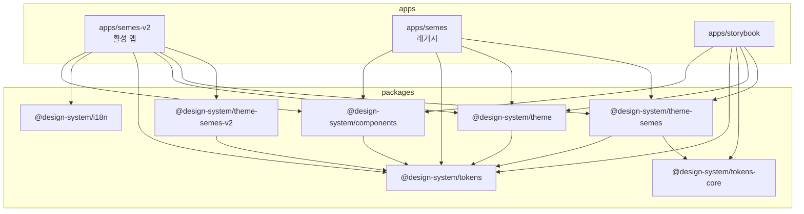
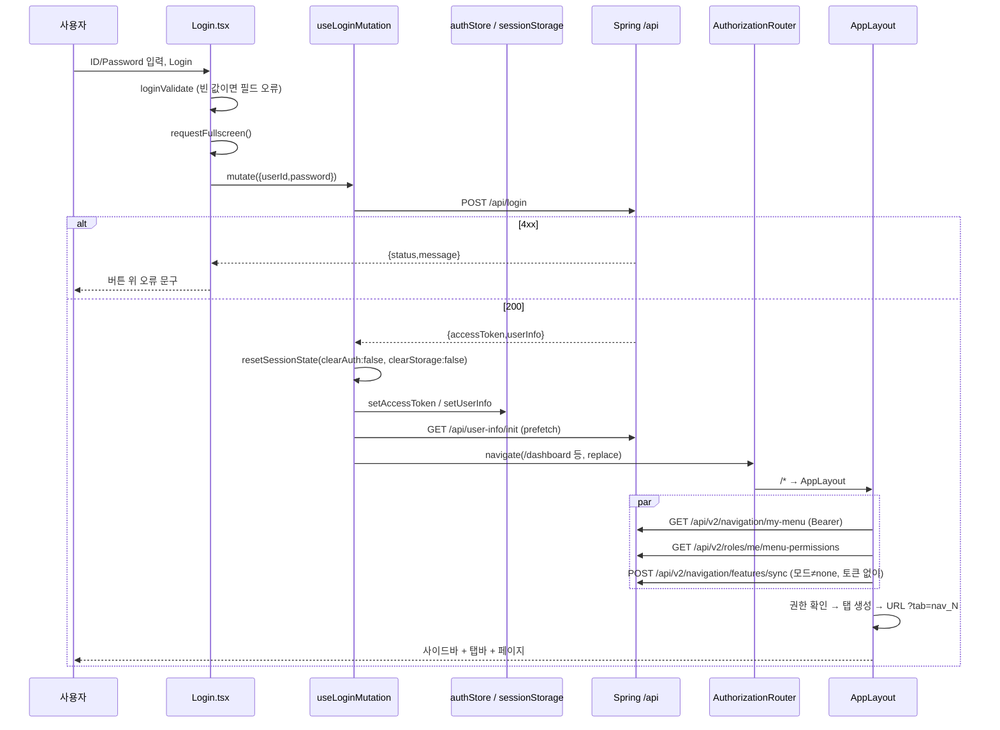
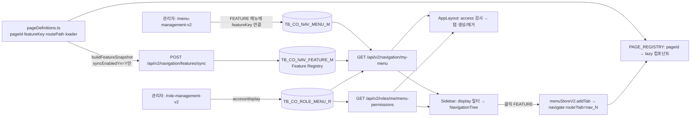
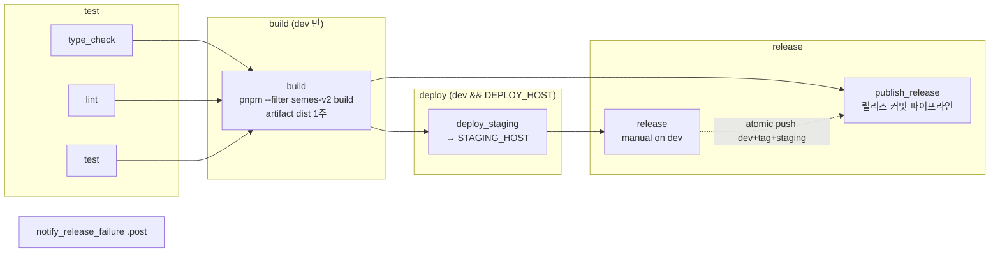

# DUTCHBOY 프론트엔드 (front-monorepo / apps/semes-v2) — 재구현 명세

| 항목 | 값 |
|---|---|
| 대상 리포 | `front-monorepo` (pnpm + Turborepo 모노레포). 활성 앱 `apps/semes-v2`, 공유 패키지 `packages/*` |
| 기준 브랜치 / 커밋 | `dev` / `b50e89a4341b1bab11f968325a419800112eaa17` (2026-10-02 05:16 UTC, `Merge branch 'feat/duts-877-action-recommend-summary' into 'dev'`). 직전 릴리즈 태그 `v2.0.0` (2026-10-02, `chore(release): v2.0.0`) |
| 작성일 | 2026-10-06 |
| 짝 문서 | 백엔드 `backend.md`, DB `database.md` (같은 폴더) |
| 작성 방식 | 소스 정적 분석만 수행(설치·빌드·실행·테스트 없음). 리포 문서(README/AGENTS.md/MENU-GUIDE.md/FRONTEND_TECH_SPEC.md)보다 코드를 우선했고, 코드로 확인하지 못한 서술은 "(추정)"으로 표시 |
| 보안 | 비밀값은 `<PLACEHOLDER>`. 사내 호스트·배포 경로·사용자 계정 ID는 `<STAGING_HOST>`, `<CUSTOMER_SITE>`, `<ADMIN_USER_ID>` 같은 역할명으로 일반화 |

경로 표기는 모노레포 루트 기준이다. `apps/semes-v2/src/...` 는 줄여서 `src/...` 로도 쓴다.

## 목차

1. [개요](#1-개요)
2. [디렉터리 구조](#2-디렉터리-구조)
3. [설정/환경](#3-설정환경)
4. [앱 부트스트랩](#4-앱-부트스트랩)
5. [라우팅](#5-라우팅)
6. [인증/로그인](#6-인증로그인)
7. [사용자 관리 화면](#7-사용자-관리-화면)
8. [메뉴/권한](#8-메뉴권한)
9. [레이아웃/공통 컴포넌트](#9-레이아웃공통-컴포넌트)
10. [API 레이어/서버 상태](#10-api-레이어서버-상태)
11. [상태 관리](#11-상태-관리)
12. [스타일/테마/i18n](#12-스타일테마i18n)
13. [그 외 도메인 화면](#13-그-외-도메인-화면)
14. [테스트/품질](#14-테스트품질)
15. [빌드/배포](#15-빌드배포)
16. [재구현 체크리스트](#16-재구현-체크리스트)

---

## 1. 개요

### 1.1 역할

- 반도체 식각 설비의 센서·AI 이상탐지 결과를 보는 **운영 분석 웹앱**이다. 대시보드(챔버 상태·이력), 모델 분석 타임라인, 웨이퍼 트레이스 비교(Target Trace / In-depth / Cross-Wafer), PM(예방정비) 분석, 기준정보·사용자·역할·메뉴 관리, AI 모델/MLflow/API 성능 모니터링, 디스크 관리 화면을 제공한다.
- 표시 이름: `index.html` `<title>` 은 `Semes v2 - AI Equipment Monitoring`, 릴리즈 알림·릴리즈 페이지에서는 `TAS web app` (`apps/semes-v2/scripts/release-notify.mjs` `APP_NAME`).
- 백엔드는 두 계열이다. Spring 메인 API(`/api/**`, `backend.md`)와 FastAPI 분석 API(`/fastapi/**`, 트레이스 원본·AI 비교·Raw Plot 등). 브라우저는 같은 오리진으로 호출하고 서버 nginx 가 프록시한다(§15).
- 앱은 **탭 셸(SPA 안의 브라우저형 탭)** 구조다. 라우터는 `/login` 과 `/*` 두 개뿐이고, 업무 페이지는 탭 스토어와 Keep-Alive 아웃렛이 렌더한다(§5).

### 1.2 모노레포 구성

| 워크스페이스 | 패키지명 | 역할 | 빌드 산출물 |
|---|---|---|---|
| `apps/semes-v2` | `semes-v2` (version `2.0.0`) | **활성 메인 앱**. 모든 신규 작업 대상 | `dist/` (Vite) |
| `apps/semes` | `semes` | 레거시 앱. 동결(버그 수정만), 배포하지 않음, test 스크립트 없음. 페이지 `/ai-overview`, `/ai-analysis`, `/trace-analysis`, `/data-analysis` | `dist/` |
| `apps/storybook` | `storybook` | 디자인 시스템 문서(Storybook 7.6, `@storybook/react-vite`) | `storybook-static/` |
| `packages/components` | `@design-system/components` | 공용 React UI (Radix UI + Tailwind). Atoms/Molecules/Organisms | `dist/` (tsup cjs+esm+d.ts) + `dist/styles.css` (tailwind CLI) |
| `packages/i18n` | `@design-system/i18n` | 언어 상수(`SUPPORTED_LANGUAGES`, `DEFAULT_LANGUAGE='ko'`, `ACTIVE_LANGUAGES=['ko','en']`), `LocalizedField` 타입, `getLocalizedValue` | `dist/` (tsup) |
| `packages/tokens` | `@design-system/tokens` | 원시 디자인 토큰(colors/typography/spacing/shadows/radius, shadcn·Tailwind 팔레트 기반) | `dist/` |
| `packages/tokens-core` | `@design-system/tokens-core` | 시맨틱 색 계약(`semanticColors`) + `validateTheme` | `dist/` |
| `packages/theme` | `@design-system/theme` | tokens 를 Tailwind `theme.extend` 로 펼친 공통 프리셋(빌드 없음, `index.js`) | — |
| `packages/theme-semes` | `@design-system/theme-semes` | semes 시맨틱 테마(light/dark/dark-v2) + CSS 변수 생성기(`getSemesThemeCSSVariables`) + tailwind 설정 | `dist/` |
| `packages/theme-semes-v2` | `@design-system/theme-semes-v2` | v2 색(`v2Colors`) + Tailwind 프리셋(`./tailwind` → `src/tailwind.config.js`, 내부에서 `../dist/index.js` 를 require) | `dist/` |



### 1.3 기술 스택 (`apps/semes-v2/package.json` 범위, 괄호는 `pnpm-lock.yaml` 해석 버전)

| 영역 | 라이브러리 | 버전 | 비고 |
|---|---|---|---|
| 런타임 | React / React DOM | `^18.2.0` (18.3.1) | `React.StrictMode` |
| 언어 | TypeScript | `^5.3.3` (5.9.3) | `strict`, `target/lib ES2020` |
| 번들러 | Vite | `^5.0.0` (5.4.21) | `@vitejs/plugin-react ^4.2.1`, `vite-plugin-svgr ^5.2.0` |
| 라우터 | react-router-dom | `^6.21.0` (6.30.2) | `createBrowserRouter` + `RouterProvider` |
| 클라이언트 상태 | zustand | `^4.5.0` (4.5.7) | `persist` + sessionStorage/localStorage |
| 서버 상태 | @tanstack/react-query | `^5.8.7` | devtools `^5.17.0`(DEV 전용) |
| HTTP | axios | `^1.7.9` → 루트 `pnpm.overrides` 로 **1.14.0 고정** | |
| 테이블 | @tanstack/react-table / react-virtual | `8.21.3` / `3.14.13` (정확 고정) | 공용 `DataTable` 내부 |
| UI 라이브러리 | `@design-system/components` (Radix: checkbox, collapsible, dialog, dropdown-menu, popover, radio-group, select, switch, toast) | workspace | + `react-icons ^5.5.0`, self-hosted Material Symbols |
| CSS | Tailwind CSS | `^3.4.0` (3.4.18) | **v3 고정**(v4 금지, §12). postcss `^8.4.33`, autoprefixer `^10.4.16` |
| 차트 | uPlot | `^1.6.32` (1.6.32) | 대용량 트레이스·타임라인 |
| 차트 | SciChart | `^5.2.62` (5.2.62) | WebGL/WASM. In-depth·CWA·Trend·Chart Studio 기본, uPlot 폴백 |
| 차트 | ECharts + echarts-for-react | `^5.5.0` (5.6.0) / `^3.0.2` | 레거시 화면·통계 차트·히트맵 |
| 차트 | d3 | `^7.9.0` | 센서 노드 그래프 등 |
| 폼/검증 | (전용 라이브러리 없음) | — | 제어 컴포넌트 + 수동 검증 함수 + Toast/필드 하단 메시지 |
| 날짜 | date-fns / react-datepicker | `^3.3.0` / `^7.4.0` | components 패키지는 date-fns `^4.1.0` |
| i18n | i18next / react-i18next | `^26.0.4` / `^17.0.3` | 일부 관리 화면 전용(§12) |
| 저장소 | idb / pako | `^8.0.3` / `^2.1.0` | IndexedDB 차트 캐시, 압축 페이로드 해제 |
| 창 UI | react-rnd | `^10.5.3` | 위젯 대시보드·분석 사이드바 리사이즈 |
| 테스트 | Vitest / Testing Library / jsdom | `^4.0.8` (4.0.14) / react `^16.3.0` / `^27.1.0` | |
| 린트·포맷 | ESLint / @typescript-eslint / eslint-plugin-compat / Prettier | `^8.57.1` / `^6.21.0` / `^6.2.1` / `^3.6.2` | 루트 devDependencies |
| 커밋 훅 | husky / lint-staged / commitlint | `^9.0.11` / `^15.2.2` / `^20.1.0` | |
| 오케스트레이션 | turbo / pnpm / Node | `^2.0.0` / `pnpm@8.15.9` / `>=18.0.0` (CI 는 20.19.0) | |
| DEV 오버레이 | agentation | `^2.3.3` | `import.meta.env.DEV` 일 때만 마운트 |

### 1.4 지원 브라우저 하한

- 공정 CTC 단말이 **Windows 7 SP1 / Chrome 109**(Windows 7 에 설치되는 마지막 Chrome, 현장 실측 2026-08-28)이고 화면이 **1280x1024**(5:4, 전체화면)다 (`AGENTS.md` Browser Support Floor, `apps/semes-v2/AGENTS.md`, DUTS-765/DUTS-796).
- 아래 세 파일이 하한을 인코딩하며 **반드시 함께** 바꾼다.

| 파일 | 값 | 막는 것 |
|---|---|---|
| `apps/semes-v2/.browserslistrc` | `chrome >= 109` | autoprefixer 출력, `eslint-plugin-compat`(DOM/Web API: `structuredClone`, `navigator.clipboard` 등) |
| `apps/semes-v2/vite.config.ts` | `build.target: 'chrome109'` | esbuild **구문** 다운레벨링(런타임 API 폴리필은 주입하지 않음) |
| `apps/semes-v2/tsconfig.json` | `target: "ES2020"`, `lib: ["ES2020","DOM","DOM.Iterable"]` | ES 언어 API(`toSorted`, `Object.groupBy`, `Promise.withResolvers`, `Set.prototype.union` → TS2550) |

- 폴리필을 먼저 쓰지 않는다(`arr.toSorted()` → `[...arr].sort()`). CSS 는 폴리필 경로가 없어 Tailwind v4(`oklch()` 팔레트, Chrome 111+) 금지.

---

## 2. 디렉터리 구조

### 2.1 루트

```text
front-monorepo/
├── apps/
│   ├── semes-v2/            # 활성 앱 (아래 2.2)
│   ├── semes/               # 레거시 (동결)
│   └── storybook/           # .storybook/main.ts, stories/{atoms,molecules,organisms,*.stories.tsx}
├── packages/
│   ├── components/          # src/{atoms,molecules,organisms}/, src/styles.css, vitest.config.ts, vitest.setup.ts
│   ├── i18n/  tokens/  tokens-core/  theme/  theme-semes/  theme-semes-v2/
├── scripts/                 # setup-git.js (postinstall: commit.template=.gitmessage), export-figma-tokens.js
├── docs/plans/              # 설계 메모 (docs/ 는 .gitignore 대상이나 일부 파일 존재)
├── skills/ templates/       # 코드 에이전트용 가이드(templates/ 는 gitignore)
├── .agents/skills/mr/       # MR 작성 스킬(제목·본문 규칙)
├── .husky/{pre-commit,commit-msg}
├── .gitlab-ci.yml  turbo.json  pnpm-workspace.yaml  package.json
├── .eslintrc.json  .eslintignore  .prettierrc.json  .prettierignore  .lintstagedrc.js
├── commitlint.config.cjs  .gitmessage  .npmrc  .gitattributes
├── AGENTS.md (CLAUDE.md 는 @AGENTS.md 위임)  README.md  MENU-GUIDE.md
```

### 2.2 `apps/semes-v2`

```text
apps/semes-v2/
├── index.html               # 폰트 preload, 다크모드 FOUC 방지 스크립트, icons-ready 스크립트
├── vite.config.ts  vitest.config.ts  tsconfig.json  tsconfig.node.json
├── tailwind.config.js  postcss.config.js  .browserslistrc
├── .env (추적됨)  .env.development.example (추적됨)  .env.development (gitignore)
├── design-tokens.json       # 앱 전용 시각 토큰(§12)
├── AGENTS.md  DESIGN.md  FRONTEND_TECH_SPEC.md  README.md(레거시 앱 내용이 남아 있음)  CHANGELOG.md
├── public/fonts/{public-sans,material-symbols}/*.woff2
├── scripts/                 # app-version.mjs, release.mjs, release-publish.mjs, release-notify.mjs, measure-target-trace-memory.mjs
├── tests/                   # Vitest 202개 파일 (도메인별 폴더) + setup.ts
└── src/
    ├── main.tsx  App.tsx  vite-env.d.ts
    ├── assets/              # login_bg.png, login_logo.png 등
    ├── components/
    │   ├── app-shell/       # ★V2 셸: AppLayout, Sidebar, TabBar, KeepAliveOutlet, NavigationSyncBootstrap, pageRegistry, navigation/{NavigationTree,NavigationNode,FavoritesPanel}
    │   ├── layout/          # 레거시 셸(Header, Sidebar, TabBar…). sidebar/ui 의 PasswordChangeModal·AlarmDropdownSection 은 V2 TabBar 가 재사용
    │   ├── common/          # ConfirmProvider(useConfirm), TextInputModal, ContentTab
    │   ├── page/            # PageHeader, FilterBar, PageFilterBar
    │   ├── form/            # DateInput, FilterSelect, FilterInput, PeriodSelector, BulkFlagMenu
    │   ├── display/         # SectionCard, StatCard, StatusBadge, ScoreBar, DataTable(V2 단순 표)
    │   ├── charts/          # EChart 래퍼, ChartToolbar, chartToolbarContext, uplotZoomPan, templates/*
    │   ├── prototype-ds/    # 관리 화면용 앱 로컬 DS("Version K"): Button, Input, Select, Checkbox, Field, Badge, Card, table, tokens
    │   ├── management-prototype/(구 프로토타입, 동결)  performance/  ThemeStyleInjector.tsx  InfoTooltip
    ├── entities/            # 도메인 API·모델: auth, equipment, issue, sensor, wafer ({api,model,lib}/)
    ├── features/            # 재사용 기능: trace-chart, cwa-chart, wafer-selector, parameter-selector, split-layout, report, role-v2, management-table, common
    ├── pages/               # 페이지 폴더 50개(+ AuthorizationRouter.tsx, Login.tsx). 라우트 53개가 이 폴더들의 export 를 가리킴(§5). 각 <kebab>/{index.ts, ui/, model/, lib/, api/}
    ├── shared/              # navigation(pageDefinitions 등), aiAnalysis, config, constants, lib(date, validation), ui(logos, icons), widget-dashboard
    ├── hooks/               # 공통 훅 + api/ (react-query 훅: navigation-v2/, role-v2/, user-preferences/, dashboard-layout/, widget-dashboard/)
    ├── lib/                 # axiosInstance, queryClient, apiUrlConfig(V2), apiUrls/, i18n/, navigation-v2/, role-v2/, sciChart/, urlParams/, sessionReset, requestMenuContext, permissions, devAutoLogin, webglCapability, cwaHandoff, traceAnalysisHandoff, chromePalette
    ├── stores/              # Zustand(§11) + navigation-v2/{menuStoreV2, navigationStoreV2}
    ├── types/               # auth, menu, navigation-v2, navigation-admin-v2, role-admin-v2, user-admin-v2, …
    ├── utils/               # chartCache/(IndexedDB), memoryMonitor/Profiler, compressedDataDecoder, typedArrayConverter …
    ├── workers/             # chartDataFilter Web Worker
    ├── constants/routes.ts  # MAIN_PAGE_PATHS, DEFAULT_MAIN_PATH
    ├── locales/{ko,en}/*.json  data/(mockMenu 등)  styles/index.css
    └── local/               # gitignore (로컬 전용 도구)
```

### 2.3 폴더 책임과 아키텍처 패턴

- **Feature-Sliced 변형**: `entities`(도메인 API·타입) → `features`(재사용 기능 묶음) → `pages`(라우트 단위 오케스트레이션). 그 옆에 인프라 계층 `lib`, 전역 상태 `stores`, 공용 UI `components`, 공용 유틸 `shared`/`utils`/`hooks` 를 둔다 (`FRONTEND_TECH_SPEC.md` §11 레이어 기준과 일치).
- 페이지 내부 표준 구조: `pages/<page>/index.ts`(lazy loader 가 가져갈 named export) + `ui/<Name>Page.tsx` + `model/`(페이지 전용 훅·타입·스토어) + `lib/`(순수 함수) + 선택 `api/`(페이지 전용 fetch 함수, 예 `pages/dashboard/api/dashboardStatus.ts`).
- 같은 화면의 실험판은 **별도 페이지 폴더**로 둔다: `*-pre-release`(차기 릴리즈 후보), `*-test`, `*-poc`, `*-uplot`(렌더러 비교용, 본문은 원본 컴포넌트를 Provider 로 감싸 재사용).
- 레거시 V1 셸(`components/layout`, `stores/menuStore.ts`)과 V2 셸(`components/app-shell`, `stores/navigation-v2`)이 공존한다. 앱이 실제로 마운트하는 것은 V2 셸뿐이다(`pages/AuthorizationRouter.tsx` 가 `@/components/app-shell/AppLayout` 사용). MENU-GUIDE 의 `VITE_NAVIGATION_SHELL` 은 현재 코드에서 읽지 않는다(`src` 전체 grep 결과 없음).

### 2.4 경로 alias

| alias | 대상 | 정의 위치 |
|---|---|---|
| `@/*` | `apps/semes-v2/src/*` | `vite.config.ts` `resolve.alias`, `tsconfig.json` `paths` |
| `@design-system/components` | `packages/components/src/index.ts` (**소스 직접**) | vite alias(정규식 `^@design-system/components$`) + tsconfig paths. `optimizeDeps.exclude` 에도 등록 |
| `@design-system/components/*` | `packages/components/src/*` | tsconfig paths |
| `@design-system/tokens(/*)` | `packages/tokens/src/...` | tsconfig paths(타입 해석용) |
| `@design-system/theme` | `packages/theme/index.js` | tsconfig paths |

### 2.5 네이밍·임포트 규칙 (코드에서 관찰)

| 대상 | 규칙 | 예 |
|---|---|---|
| 페이지 폴더 / routePath / pageId / featureKey | kebab-case, 셋을 같은 문자열로 맞춤 | `user-management-v2` |
| 페이지 컴포넌트 | `PascalCase` + `Page` (V2 관리 화면은 `PageV2`) | `UserManagementPageV2` |
| 훅 | `useXxx`; V2 네비·역할 API 훅은 접미사 `V2` | `useMenuTreeV2`, `useMyMenuPermissionsV2` |
| 쿼리 키 | 훅 파일에서 `XXX_QUERY_KEY` 상수(또는 팩토리 함수)로 export, 배열 첫 요소가 도메인 | `['navigation-v2','my-menu']`, `USER_ACCOUNTS_V2_QUERY_KEY(filters)` |
| 스토어 | `xxxStore.ts` 에 `useXxxStore` | `useMenuStoreV2` |
| 타입 | 레거시는 `I` 접두사(`IUser`, `ITabMenu`), V2 API 는 `...DTO` 접미사 | `NavigationTreeNodeDTO` |
| UI 텍스트 | **영어 하드코딩**. 한국어는 주석·console 만 | §12.5 |
| import | 앱 내부는 `@/` 절대경로 우선(일부 레거시는 상대경로), 공용 UI 는 `@design-system/components`, 앱 공용 UI 는 `@/components` 배럴, 관리 화면은 `@/components/prototype-ds` | |
| 구조용 레이아웃 | 일반 `div` 대신 `Box`(시맨틱은 `Box as="main"`) — AGENTS.md 규칙. 셸 코드 등 일부는 `div` 사용 | |

### 2.6 패키지를 앱에서 쓰는 방식

- 의존성은 모두 `"workspace:*"` (`apps/semes-v2/package.json`). `.npmrc`: `prefer-symlinked-workspace-packages=false`, `auto-install-peers=true`.
- `@design-system/components` 는 앱에서 **소스 alias** 로 가져오므로 앱 dev/build 에는 패키지 빌드가 필요 없다. 단 `styles.css` 는 `@import '@design-system/components/styles.css'` 로 패키지 `exports["./styles.css"] = ./dist/styles.css` 를 가리키므로 **dist 가 있어야 한다**(`src/styles/index.css`).
- `@design-system/theme-semes`, `@design-system/theme-semes-v2`, `@design-system/i18n`, `@design-system/tokens` 는 package.json `main/module` 이 `dist/*` 다. 각 패키지의 `prepare: "pnpm build"` 가 `pnpm install` 때 빌드한다. `theme-semes-v2/src/tailwind.config.js` 가 `require('../dist/index.js')` 하므로 dist 없이 Tailwind 가 돌면 실패한다.
- Tailwind `content` 에 `../../packages/components/src/**/*.{js,ts,jsx,tsx}` 를 포함해 공용 컴포넌트 클래스가 앱 CSS 에 생성된다.
- turbo `build`/`type-check` 는 `dependsOn: ["^build"]` 로 패키지 빌드를 선행한다.

---

## 3. 설정/환경

### 3.1 환경변수

로드 순서: `.env` → `.env.local` → `.env.[mode]` (envDir 은 `apps/semes-v2` 고정, `vite.config.ts`). mode: `pnpm dev`=development, `build`=production, `build:pt`=pt, `build:staging`=staging. `.env` 와 `.env.development.example` 은 **git 추적**, `.env.development`·`.env.production`·`.env.pt`·`.env.local` 은 gitignore.

| 변수 | 읽는 곳 | 의미 | 추적된 `.env` 값 |
|---|---|---|---|
| `VITE_API_BASE_URL` | `lib/apiUrlConfig.ts`, `apiUrlConfigV2.ts`, `apiUrls/*` | API 경로 prefix. 미설정 시 `/` 가 되어 `//login` 같은 경로가 생기므로 **필수** | `/api` |
| `VITE_API_BASE_URL_FULL` | `lib/axiosInstance.ts`, `useFeatureSyncV2.ts` | 절대 API 오리진(선택). 정의된 곳 없음 → 빌드에서는 `''` | (없음) |
| `VITE_API_TARGET` | `axiosInstance.ts`(baseURL 2순위), `vite.config.ts` proxy `/api` | dev 프록시 타깃(기본 `http://localhost:8081`). **dev 에서 이 값이 있으면 `client` 가 프록시를 거치지 않고 이 오리진으로 직접 호출**(CORS 필요) | (없음, `.env.development` 에 `<API_HOST>`) |
| `VITE_FASTAPI_TARGET` | `vite.config.ts` proxy `/fastapi` | 기본 `http://localhost:8000` | (없음, `.env.development` 에 `<FASTAPI_HOST>`) |
| `VITE_GRAFANA_TARGET` | proxy `/grafana` | 기본 `http://localhost` | (없음, `.env.development` 에 `<GRAFANA_HOST>`) |
| `VITE_APP_MODE` | `axiosInstance.ts` | `base` 이면 인터셉터 미부착·`withCredentials=false` | `development` |
| `VITE_NAVIGATION_SYNC_MODE` | `useFeatureSyncV2.ts` | 앱 시작 Feature Sync: `none`(기본)/`validate`/`update`/`sync` (대소문자 무시, `nothing`→none) | `none` |
| `VITE_NAVIGATION_SHELL` | (코드에서 읽지 않음) | MENU-GUIDE·example 에만 존재 | — |
| `VITE_BRAND` | `shared/ui/logos/BrandLogo.tsx`, `shared/config/pageDefaults.ts` | 로고·기본값 브랜드. 3종 중 하나, 기본 `semes` | `semes` |
| `VITE_INITIAL_PAGE_PATH` | `constants/routes.ts` | 로그인 후 기본 페이지. `MAIN_PAGE_PATHS` 에 없으면 `/dashboard` | (없음) |
| `VITE_TRACE_RENDERER` | `features/trace-chart/model/rendererContract.ts` | `uplot` 이면 전 화면 uPlot 강제. 비우면 SciChart(하드웨어 WebGL 있을 때) | (비움) |
| `VITE_SCICHART_LICENSE_KEY` | `lib/sciChart/sciChartInit.ts` | SciChart 런타임 라이선스. 없으면 Community 워터마크 | (없음, 배포 빌드에는 `<SCICHART_LICENSE_KEY>` 필요) |
| `VITE_DEV_LOGIN_ID` / `VITE_DEV_LOGIN_PW` | `lib/devAutoLogin.ts` (DEV 전용) | 개발 자동 로그인 계정 | (없음, `.env.development` 에 `<DEV_LOGIN_ID>` / `<DEV_LOGIN_PW>`) |
| `VITE_ENABLE_FLOAT32_OPTIMIZATION` | `hooks/api/useTraceChartData.ts` | `'false'` 이면 Float32Array 변환 끔(기본 켬) | — |
| `VITE_USE_WEB_WORKER`, `VITE_PT_PERMISSIONS` | 각 1곳(차트 필터 워커 / 주석 처리된 PT 권한) | 실험용 플래그 | — |

빌드 상수: `__APP_VERSION__ = { version, commitHash }` (`vite.config.ts` `define`, `scripts/app-version.mjs`). 릴리즈 커밋 빌드는 `v2.N.0`/`commitHash:null`, 그 외는 `v2.(N+1).0-dev` + 8자리 해시. CI 에서 git HEAD 를 못 읽으면 빌드 실패.

### 3.2 `vite.config.ts` 핵심

| 항목 | 값 |
|---|---|
| plugins | `react()`, `svgr()` |
| `base` | development `'/'`, 그 외 모든 mode `'/semes/'` (하드코딩) |
| `build.target` | `'chrome109'` (outDir·청크 설정 없음 → 기본 `dist/`, Rollup 기본 청크 + 페이지 lazy import 로 자동 분할) |
| `esbuild.drop` | mode `production`·`pt` 에서 `['console','debugger']` |
| `optimizeDeps` | exclude `@design-system/components`; include react, react-dom, react-router-dom, react-query, react-table, echarts, echarts-for-react, zustand, axios, date-fns, react-icons |
| `css.devSourcemap` | false |
| `server` | port 3000, HMR overlay, watch ignore node_modules/.git/dist |
| `server.proxy` | `/fastapi` → `VITE_FASTAPI_TARGET`, `/api` → `VITE_API_TARGET`, `/grafana` → `VITE_GRAFANA_TARGET` (모두 `changeOrigin:true`, 앞 둘은 `secure:false`) |
| SciChart WASM | `scichart/_wasm/scichart2d.wasm?url`, `scichart2d-nosimd.wasm?url` 를 번들에 포함(폐쇄망 대응, CDN 미사용) |

### 3.3 TypeScript / browserslist

- `tsconfig.json`: `target ES2020`, `lib [ES2020, DOM, DOM.Iterable]`, `module ESNext`, `moduleResolution bundler`, `jsx: "react"`(클래식 런타임 타입 체크; Vite 플러그인이 변환), `strict`, `noUnusedLocals/Parameters`, `noFallthroughCasesInSwitch`, `allowImportingTsExtensions`, `noEmit`, `include ["src"]`(tests 는 타입체크 대상 아님).
- `tsconfig.node.json`: `vite.config.ts` 전용(composite).
- `.browserslistrc`: `chrome >= 109` (주석에 현장 실측값과 DUTS-796).

### 3.4 turbo.json

| task | dependsOn | outputs | 기타 |
|---|---|---|---|
| `build` | `^build` | `dist/**`, `.next/**`, `storybook-static/**`, `build/**` | |
| `lint` | `^lint` | — | 루트 `pnpm lint` 는 turbo 가 아니라 eslint 직접 실행 |
| `type-check` | `^build` | `[]` | 루트 `pnpm type-check` = `turbo run type-check` |
| `dev`, `storybook` | — | — | `cache:false`, `persistent:true` |

### 3.5 ESLint / Prettier / lint-staged / husky / commitlint

| 도구 | 규칙 요약 (파일) |
|---|---|
| ESLint (`.eslintrc.json`, root) | extends `eslint:recommended`, `plugin:@typescript-eslint/recommended`, `plugin:react/recommended`, `plugin:react-hooks/recommended`, `prettier`. 규칙: `react-in-jsx-scope off`, `prop-types off`, `no-unused-vars off`(TS 가 대신), `no-explicit-any warn`, `no-console warn(allow warn,error)`. overrides: ① `apps/semes-v2/**/*.ts(x)` 에 `plugin:compat/recommended` + `lintAllEsApis:true`(browserslist 읽음) ② `*.d.ts` triple-slash 허용 ③ `apps/semes-v2/src/**` 에 **`no-alert: error`**(전체화면 해제 방지) |
| `.eslintignore` | dist, build, .turbo, node_modules, scripts/, `*.config.js/ts`, storybook-static, `.env*` |
| Prettier (`.prettierrc.json`) | `semi`, `singleQuote`, `trailingComma es5`, `printWidth 80`, `tabWidth 2`, `arrowParens always`, `endOfLine lf` |
| lint-staged (`.lintstagedrc.js`) | `*.ts,tsx`: `eslint --fix` → 변경 파일이 속한 워크스페이스마다 `pnpm --filter <ws> type-check` → `prettier --write`. `*.js,jsx`: eslint --fix + prettier. `*.json,md`: prettier |
| husky | `pre-commit`: `pnpm exec lint-staged` / `commit-msg`: `pnpm exec commitlint --edit "$1"` |
| commitlint (`commitlint.config.cjs`) | `@commitlint/config-conventional` + type-enum `feat fix docs style design test refactor build ci perf chore rename remove`, type/scope 소문자, subject 비어있지 않음·마침표 금지, header ≤100, **`jira-ticket-required`**: `/\b[A-Z][A-Z0-9]+-\d+\b/` 필수(`^Merge` 커밋 예외), `subject-case` 해제 |
| 커밋 형식 | `<type>(<scope>): <한국어 설명> <DUTS-N>` (AGENTS.md). 예 `fix(data-analysis): ChartList 가상화 제거로 카드 간격 버그 수정 DUTS-123`. `chore(release):` 접두사는 release job 전용(사람 금지) |
| `.gitmessage` | `postinstall`(`scripts/setup-git.js`)이 `git config --local commit.template .gitmessage` 설정 |

---

## 4. 앱 부트스트랩

### 4.1 엔트리 순서

1. **`apps/semes-v2/index.html`** (React 이전에 실행)
   - Public Sans 400/500/700, Material Symbols 가변 폰트 `<link rel="preload">`.
   - FOUC 방지 인라인 스크립트: `localStorage['semes-theme-mode']` 가 `dark` 이거나 `browser`+`prefers-color-scheme: dark` 이면 `<html class="dark">`. (주의: 실제 `themeStore` 는 persist JSON(`{"state":{"themeMode":...}}`)을 같은 키에 쓰므로 이 단순 문자열 비교는 일치하지 않을 수 있다 (추정))
   - 아이콘 스크립트: `document.fonts.ready` 후 `<html class="icons-ready">`, 5초 안전장치. CSS 가 그 전까지 `.material-symbols-outlined { visibility:hidden }` 로 ligature 텍스트 노출을 막는다.
2. **`src/main.tsx`**
   - `./styles/index.css` import, `./lib/devChartRendererOverride` import(탭 복원이 URL 을 덮어쓰기 전에 DEV 쿼리 `?chartRenderer=`/`?testPage=` 를 sessionStorage `devQueryOverride:*` 에 선점).
   - DEV + `?memReport` 이면 `lib/memReport` 동적 import.
   - DEV 이면 `runDevAutoLogin()` 을 **await 한 뒤** 렌더(토큰이 먼저 있어야 로그인 화면으로 튕기지 않음). 프로덕션 번들에서는 dead-code 로 제거.
   - `ReactDOM.createRoot(#root).render(<React.StrictMode><App/></React.StrictMode>)`.
3. **`src/App.tsx`** — 모듈 로드시 `./lib/i18n` 초기화(side effect), `createBrowserRouter([{ path:'*', element:<AuthorizationRouter/> }], { basename: BASE_URL 끝 슬래시 제거 })`.

### 4.2 Provider 트리

```mermaid
graph TD
    A[React.StrictMode] --> B[App: useThemeSync]
    B --> C[QueryClientProvider client=queryClient]
    C --> D[ThemeStyleInjector<br/>--semes-* CSS 변수 style 태그 주입]
    C --> E[ToastProvider @design-system/components]
    E --> F[StorageErrorToast<br/>sessionStorage 쿼터 초과 → toast.error]
    E --> G[ConfirmProvider<br/>useConfirm: confirm/promptText]
    G --> H[RouterProvider router]
    H --> I[AuthorizationRouter]
    I -->|/login| J[Login]
    I -->|/*| K[AppLayout V2 셸]
    C --> L[DEV: ReactQueryDevtools, Agentation]
```



- `useThemeSync()`(`hooks/useThemeSync.ts`): `themeStore.themeMode` → `resolvedTheme` 계산 → `<html>.classList.toggle('dark')`, `browser` 모드는 `matchMedia` 구독.
- DEV 전용: 30초 주기 메모리 모니터(500MB 임계), 10초 누수 감지(50MB 증가), 5분 주기 메모리 로그 (`utils/memoryMonitor`, `utils/memoryProfiler`).

### 4.3 전역 에러 바운더리

- **앱 전체 ErrorBoundary 는 없다.** 페이지 단위로만 있다: `components/app-shell/KeepAliveOutlet.tsx` 의 `PageLoadErrorBoundary`(클래스 컴포넌트). 오류 시 "Page failed to load." + pageId + (DEV 에서만 error.message) + `Reload` 버튼(`window.location.reload()`). `menuId`/`pageId` 가 바뀌면 상태 리셋.
- lazy 로딩 자체에도 타임아웃이 있다: `definePage` 가 loader 를 `Promise.race([loader(), 30초 timeout])` 로 감싸 `PageLoadTimeoutError` 를 던지고, 상태(`idle|pending|loaded|error`)를 모듈 맵에 기록한다. `LoadingFallback` 은 8초 이상 pending 이면 "Still loading page..." 를 표시한다(`model-analysis`, `model-analysis-pre-release` 는 페이지 수준 로딩 표시를 숨김).

### 4.4 초기 데이터 로드

| 시점 | 데이터 | API | 저장 |
|---|---|---|---|
| 로그인 성공 직후 | 토큰·사용자 정보 | `POST /api/login` 응답 | `authStore`(sessionStorage) |
| 로그인 성공 직후 | 공정→설비타입→설비→챔버 트리 | `GET /api/user-info/init` (prefetch, 쿼리 키 `['userInfo','init']`, staleTime 10분) | react-query |
| AppLayout 마운트 | 사용자 메뉴 트리 | `GET /api/v2/navigation/my-menu` (`['navigation-v2','my-menu']`) | react-query |
| AppLayout 마운트 | 내 메뉴 권한 | `GET /api/v2/roles/me/menu-permissions` (`['role-v2','me','menu-permissions']`) | react-query |
| AppLayout 마운트 | Feature Sync(모드가 none 이 아닐 때) | `POST /api/v2/navigation/features/sync` | — (성공 시 메뉴·즐겨찾기·피처 쿼리 무효화) |
| 관리 화면 진입 | 내 역할/최고 스코프 | `GET /api/v2/roles/me` (`['role-v2','me','roles']`, `select` 로 `highestScope` 계산) | react-query |

- 별도의 "내 정보(me)" 조회 API 호출은 없다. 사용자 이름/부서/ID 는 로그인 응답 `userInfo` 를 sessionStorage 에 보관해 쓴다(TabBar 사용자 메뉴). 백엔드에도 프로필 조회 API 가 없다(`backend.md` §4.4).

---

## 5. 라우팅

### 5.1 라우터 구성

react-router 에는 두 경로만 있다 (`src/pages/AuthorizationRouter.tsx`).

| path | element | 비고 |
|---|---|---|
| `/login` | `Login` | 인증 상태면 기본 페이지로 `<Navigate replace>` |
| `/*` | `AppLayout` (V2 셸) | 미인증이면 `/login` 으로 `<Navigate replace>` |

업무 페이지는 Route element 가 아니라 **탭 스토어 → `KeepAliveOutlet` → `PAGE_REGISTRY[pageId]`(lazy 컴포넌트)** 로 렌더된다. URL 은 `<routePath>?tab=<menuId>` 형태이며 `AppLayout` 이 URL ↔ 탭을 동기화한다(§5.4).

### 5.2 `pageDefinitions.ts` 구조

`src/shared/navigation/pageDefinitions.ts` 가 **페이지 등록의 단일 진실 공급원**이다. `definePage()`(`definePage.ts`) 입력:

| 필드 | 필수 | 기본값 | 용도 |
|---|---|---|---|
| `pageId` | O | — | 프론트 내부 페이지 ID(탭 복원·레지스트리 키) |
| `featureKey` | O | — | 백엔드 Feature Registry(`TB_CO_NAV_FEATURE_M.FTR_KEY`)와 메뉴의 연결 키 |
| `routePath` | O | — | URL. 유일해야 함 |
| `defaultTitle` | O | — | 탭/메뉴 기본 제목 |
| `defaultLocaleCode` | | `'en'` | Feature Sync 로 전달 |
| `iconName` | | — | Material Symbols 이름 |
| `programId` | | — | 운영 프로그램 ID(현재 정의된 페이지 없음) |
| `menuEnabledYn` | | `'Y'` | 메뉴 후보 여부(백엔드가 FEATURE 메뉴 생성 시 검사) |
| `syncEnabledYn` | | `'Y'` | Feature Sync 스냅샷 포함 여부. **`'N'` 이면 메뉴 권한 검사 없이 접근 가능한 standalone 페이지** |
| `legacySidebar` | | — | 레거시 사이드바 순서(`{order,label?}`). V2 에서는 무의미 |
| `loader` | O | — | `() => import('@/pages/x').then(m => ({ default: m.XPage }))` |

`definePage` 는 위 기본값을 채우고 `component: React.lazy(withPageLoadStatus(input))` 를 붙인다. 파생 조회 맵은 `shared/navigation/lookups.ts`: `pageDefinitionsById`, `pageRegistryFromDefinitions`(= `PAGE_REGISTRY`), `routePathToPageIdMap`, `pageIdToRoutePathMap`, `featureKeyToPageIdMap`, `normalizeRoutePath`(공백·`#`·`?` 제거, 선행 `/` 보장, 끝 `/` 제거), `resolvePageIdFromRoutePath/FeatureKey`, `resolveRoutePathFromPageId`.

항목 예 (실제 코드):

```ts
definePage({
  // In-depth (DUTS-772). syncEnabledYn 'Y' 라야 기능 스냅샷에 실려 메뉴로 붙일 수 있고,
  // menuEnabledYn 'Y' 라야 그 메뉴가 노출 대상이 된다.
  pageId: 'in-depth',
  featureKey: 'in-depth',
  routePath: '/in-depth',
  defaultTitle: 'In-depth Analysis',
  iconName: 'analytics',
  menuEnabledYn: 'Y',
  syncEnabledYn: 'Y',
  loader: () =>
    import('@/pages/in-depth').then((m) => ({ default: m.InDepthPage })),
}),
```

### 5.3 전체 라우트 표 (53개, 정의 순서)

모두 `AppLayout`(V2 셸) 안의 Keep-Alive 슬롯에서 렌더되고 **로그인 필수**다. "필요 권한" 은 `canAccessNavigationPage`(§8.3) 기준: `sync=Y` 페이지는 해당 featureKey 를 가진 FEATURE 메뉴가 사용자 메뉴 트리에 있고 그 메뉴의 `accessYn='Y'` 여야 한다. `sync=N` 은 인증만 필요. featureKey·pageId 는 routePath 에서 `/` 를 뗀 값과 같다.

| # | routePath | 페이지 export (`src/pages/...`) | menu/sync | 필요 권한 | 비고 |
|---|---|---|---|---|---|
| 1 | `/dashboard` | `dashboard` → `DashboardPage` | Y/Y | 메뉴 access | 기본 랜딩 |
| 2 | `/dashboard-pre-release` | `DashboardPreReleasePage` | Y/Y | 메뉴 access | |
| 3 | `/group-management` | `GroupManagementPage` | Y/Y | 메뉴 access | 대시보드 설비 그룹 |
| 4 | `/group-management-pre-release` | `GroupManagementPreReleasePage` | Y/Y | 메뉴 access | |
| 5 | `/layout-tree-test` | `LayoutTreeTestPage` | Y/Y | 메뉴 access | split-layout 실험 |
| 6 | `/dashboard-sample` | `DashboardSamplePage` | Y/Y | 메뉴 access | 샘플 |
| 7 | `/realtime-monitoring` | `RealTimeMonitoringPage` | Y/Y | 메뉴 access | 폴링 |
| 8 | `/equipment-list` | `EquipmentListPage` | Y/Y | 메뉴 access | AI Overview |
| 9 | `/equipment-management` | `EquipmentManagementPage` | Y/Y | 메뉴 access | 기준정보 |
| 10 | `/process-management` | `ProcessManagementPage` | Y/Y | 메뉴 access | 기준정보 |
| 11 | `/pm-management` | `PmManagementPage` | Y/Y | 메뉴 access | |
| 12 | `/sensor-management` | `SensorManagementPage` | Y/Y | 메뉴 access | |
| 13 | `/custom-sensor-set` | `CustomSensorSetPage` | Y/Y | 메뉴 access | |
| 14 | `/recipe-management` | `RecipeManagementPage` | Y/Y | 메뉴 access | |
| 15 | `/department-management` | `DepartmentManagementPage` | Y/Y | 메뉴 access | |
| 16 | `/model-analysis` | `model-analysis` → `ModelAnalysisMainPage` | Y/Y | 메뉴 access | |
| 17 | `/model-analysis-pre-release` | `ModelAnalysisPreReleasePage` | Y/Y | 메뉴 access | |
| 18 | `/in-depth` | `InDepthPage` | Y/Y | 메뉴 access | SciChart 기본 |
| 19 | `/in-depth-uplot` | `InDepthUplotPage` | Y/Y | 메뉴 access | uPlot 고정 비교판 |
| 20 | `/model-analysis-multi-timeline` | `model-analysis` → `ModelAnalysisMultiTimelinePage` | N/N | 인증만 | 같은 본문 alias |
| 21 | `/model-analysis-trend-test` | `model-analysis` → `ModelAnalysisTrendTestPage` | Y/Y | 메뉴 access | 같은 본문 alias |
| 22 | `/sensor-trace-test` | `SensorTraceTestPage` | Y/Y | 메뉴 access | 테스트 |
| 23 | `/model-analysis-pt` | `ModelAnalysisPtPage` | Y/Y | 메뉴 access | 특정 고객 사이트판 |
| 24 | `/scichart-comparison-poc` | `SciChartComparisonPage` | Y/Y | 메뉴 access | POC |
| 25 | `/scichart-trace-comparison-poc` | `TraceSciChartComparisonPage` | Y/Y | 메뉴 access | POC |
| 26 | `/trace-chart-grid-poc` | `TraceChartGridPage` | Y/Y | 메뉴 access | POC |
| 27 | `/timeline-chart-grid-poc` | `TimelineChartGridPage` | Y/Y | 메뉴 access | POC |
| 28 | `/cwa-chart-sync-poc` | `CwaChartSyncPocPage` | Y/Y | 메뉴 access | POC |
| 29 | `/target-trace` | `TargetTracePage` | Y/Y | 메뉴 access | |
| 30 | `/target-trace-sampling-test` | `TargetTraceSamplingTestPage` | Y/Y | 메뉴 access | 테스트 |
| 31 | `/target-trace-pre-release` | `TargetTracePreReleasePage` | Y/Y | 메뉴 access | |
| 32 | `/target-trace-test` | `TargetTraceTestPage` | Y/Y | 메뉴 access | 테스트 |
| 33 | `/pm-list` | `PmListPage` | Y/Y | 메뉴 access | |
| 34 | `/pm-list-v2` | `pm-list` → `PMListV2Page` | Y/Y | 메뉴 access | PT 빌드 기본 랜딩 |
| 35 | `/data-chart` | `DataChartPage` | Y/Y | 메뉴 access | |
| 36 | `/chart-studio` | `ChartStudioPage` | Y/Y | 메뉴 access | 전 차트 SciChart |
| 37 | `/__new_tab__` | `new-tab` → `NewTabPageV2` | N/N | 인증만 | 빈 탭(+ 버튼) |
| 38 | `/settings` | `settings` → `UserSettingsPage` | N/N | 인증만 | 테마 설정. 레거시 Sidebar 를 자체 렌더 |
| 39 | `/menu-management-v2` | `MenuManagementPageV2` | Y/Y | 메뉴 access | §8.4 |
| 40 | `/role-management-v2` | `RoleManagementPageV2` | Y/Y | 메뉴 access + 스코프 SU/ADMIN | §7.3 |
| 41 | `/user-management-v2` | `UserManagementPageV2` | Y/Y | 메뉴 access + 스코프 SU/ADMIN | §7.2 |
| 42 | `/model-management` | `ModelManagementPage` | Y/Y | 메뉴 access | AI 모델 버전 |
| 43 | `/ai-event-api-management` | `AiEventApiManagementPage` | Y/Y | 메뉴 access | |
| 44 | `/mlflow-monitoring` | `MlflowMonitoringPage` | Y/Y | 메뉴 access | |
| 45 | `/api-performance-logs` | `ApiPerformanceLogsPage` | Y/Y | 메뉴 access(+서버 feature 검사) | |
| 46 | `/disk-usage` | `DiskUsagePage` | Y/Y | 메뉴 access | |
| 47 | `/disk-cleanup` | `DiskCleanupPage` | Y/Y | 메뉴 access(+서버 feature 검사) | |
| 48 | `/ftp-registration` | `FtpRegistrationPage` | Y/Y | 메뉴 access | 제목 "FTP / S3 Registration" |
| 49 | `/widget-dashboard` | `WidgetDashboardPage` | Y/Y | 메뉴 access | |
| 50 | `/widget-dashboard-api` | `WidgetDashboardApiPage` | Y/Y | 메뉴 access | 레이아웃 서버 저장 |
| 51 | `/widget-dashboard-pre-release` | `WidgetDashboardPreReleasePage` | Y/Y | 메뉴 access | |
| 52 | `/cross-wafer-analysis` | `CrossWaferAnalysisPage` | Y/Y | 메뉴 access | |
| 53 | `/cross-wafer-analysis-uplot` | `CrossWaferAnalysisUplotPage` | Y/Y | 메뉴 access | uPlot 고정 비교판 |

`src/pages` 에는 이 밖에 `target-trace` 하위 컴포넌트를 공유하는 화면, 레거시 `NewTabPage`, `management-prototype` 등이 있으나 라우트로 등록되지 않았다.

### 5.4 가드와 URL ↔ 탭 동기화

인증 가드 (`src/pages/AuthorizationRouter.tsx`, 핵심):

```tsx
const AuthorizationRouter = () => {
  const location = useLocation();
  const isAuthenticated = useAuthStore((s) => s.isAuthenticated()); // !!accessToken
  const userId = useAuthStore((s) => (s.userInfo as { userId?: string }).userId ?? '');
  useCacheCleanup(); // 메인 경로 밖으로 나가면 traceChartData 쿼리 제거

  const isLoginPage = location.pathname === '/login';
  if (!isAuthenticated && !isLoginPage) return <Navigate to="/login" replace />;
  if (isAuthenticated && isLoginPage)
    return <Navigate to={getInitialMainPathByUserId(userId, DEFAULT_MAIN_PATH)} replace />;

  return (
    <Routes>
      <Route path="/login" element={<Login />} />
      <Route path="/*" element={<AppLayout />} />
    </Routes>
  );
};
```

권한 가드 + URL→탭 동기화 (`components/app-shell/AppLayout.tsx` 의 effect, 메뉴·권한 쿼리가 모두 성공한 뒤 `location.pathname/search` 변경마다 실행):

1. `findNavigationNodeByRoutePath(menus, pathname)` 로 메뉴 노드를 찾고, 없으면 `resolvePageId(pathname)` 로 pageId 를 구한다. pageId 가 없으면 아무것도 하지 않는다(**404 화면 없음**, 기존 활성 탭 또는 빈 상태가 그대로 보임).
2. `canAccessNavigationPage(menus, pageId, permissionMap)` 가 false 면: 접근 가능한 기존 탭으로 `navigate(replace)`, 없으면 `__new_tab__` standalone 탭을 만들어 이동.
3. `?tab=<id>` 가 있고 그 탭이 같은 pageId 면 선택. 없으면 그 menuId 로 탭을 새로 만든다(새로고침·링크 복원).
4. 같은 pageId 탭이 이미 있으면 선택하고 `?tab=` 을 그 탭으로 교정.
5. 없으면 `toTabMenu(node)`(메뉴 경유, menuId `nav_<navMenuId>`) 또는 `toStandaloneTabMenu(pageId)`(menuId `page_<pageId>`)로 탭 추가 후 `navigate(<url>?tab=<menuId>, {replace:true})`.

추가 동작: 권한 맵이 바뀌면 접근 불가 탭을 자동으로 닫는다. 메뉴 응답이 바뀌면 열린 탭의 `reportYn` 을 다시 맞춘다(DUTS-850). `pagehide` 에서 IndexedDB 차트 캐시를 비운다.

### 5.5 lazy 로딩·탭·Keep-Alive

- 모든 페이지는 `React.lazy` + `Suspense`(`PageHost`). 번들은 페이지 단위로 자동 분할된다. 트레이스/CWA URL 빌더를 별도 모듈(`lib/apiUrls/traceAnalysis.ts`, `cwa.ts`)로 분리해, 다른 페이지 청크에 비교 모드 식별자 문자열이 섞이지 않게 한다(PT 반출 빌드 위생).
- 탭 ID 규칙(`stores/navigation-v2/menuStoreV2.ts`, `lib/navigation-v2/*`): 메뉴 경유 `nav_<navMenuId>`, URL 직접 진입 `page_<pageId>`, 새 탭/복제 `<pageId>_<Date.now()>_<counter>`.
- 최대 탭 `MAX_TABS = 10`. 초과 시 `tabLimitModalOpen` → TabBar 의 "Tab Limit Reached" 모달(Esc/배경 클릭으로 닫히지 않음).
- `KeepAliveOutlet`: 열린 탭 중 최근 활성 순 **`MAX_KEEP_ALIVE = 10`** 개를 DOM 에 유지(LRU). 슬롯은 `position:absolute; inset:0`, 비활성은 `zIndex 0 + pointer-events:none + aria-hidden`. LRU 로 DOM 에서 빠지면 `notifyTabEvictFromDomV2(menuId)` 콜백(대용량 in-memory 데이터 해제용). 탭을 닫으면 `registerTabRemoveCleanupV2` 콜백으로 페이지 스토어의 탭 상태를 정리.
- 슬롯 컨텍스트: `useIsTabActive()`(비활성 탭의 쿼리·차트 작업 중단에 사용), `useKeepAliveMenuId()`, `useKeepAliveSlotElevation(true)`(전체화면 오버레이 시 슬롯 z-index 40 으로 올림). 각 슬롯은 `.overflow-auto/.overflow-y-auto/.overflow-scroll` 요소의 스크롤 위치를 저장했다가 재활성 시 rAF 3회에 걸쳐 복원.
- `useTabMenuId()`(`hooks/useTabMenuId.ts`): 최초 마운트 시 `KeepAliveMenuId → ?tab → 활성 탭 → fallback` 순으로 결정하고 ref 에 고정(이후 URL 변경에 반응하지 않음). 페이지별 탭 상태 키로 쓴다.
- 기본 랜딩: `DEFAULT_MAIN_PATH = VITE_INITIAL_PAGE_PATH`(단 `MAIN_PAGE_PATHS` 목록에 있을 때) 아니면 `/dashboard`. `lib/permissions.ts` 가 덮어쓴다: **PT 빌드(`MODE==='pt'`)는 `/pm-list-v2`**, 특정 고객 계정 ID(`<CUSTOMER_USER_ID>`)는 `/pm-list`. 같은 파일의 `canOpenPmAnalysisByUserId`/`canOpenWaferTraceByUserId` 가 PM List 화면의 분석/트레이스 버튼을 막는다(하드코딩 사용자 프로필, V2 역할 체계와 별개).

---

## 6. 인증/로그인

### 6.1 로그인 화면 (`src/pages/Login.tsx`)

| 항목 | 내용 |
|---|---|
| 레이아웃 | 전체 배경 이미지(`assets/login_bg.png`) + 50% 어두운 오버레이, 가운데 700x500 카드(`rounded-[30px]`). 768px 이상 좌우 50:50(좌 브랜딩: 로고 이미지·슬로건 "We provide the best AI solution through data."·저작권 문구 / 우 폼), 768px 미만 세로 스택 |
| 필드 | `ID`(`login-userId`, text, autoFocus), `Password`(`login-password`, password). `@design-system/components` 의 `Input`/`Button`/`Typography`/`Divider`/`Box`, 상단 `BrandLogo` |
| 검증 | `loginValidate(user)`: 빈 ID → "Please enter your ID.", 빈 비밀번호 → "Please enter your password." 필드 하단 고정 높이(`h-4`) 캡션에 표시, 입력하면 해당 오류 제거 |
| 제출 | 검증 통과 시 **`document.documentElement.requestFullscreen()`**(이미 전체화면이면 생략, 실패 무시) 후 `loginMutation.mutate(user)` |
| 진행/오류 | 버튼 `disabled`+`aria-busy`, 라벨 "Logging in...". 실패 시 버튼 위에 `error.response.data.message` 또는 "Login failed. Please check your ID and password." |
| 이미 로그인 | `isAuthenticated()` 면 `window.location.href = <BASE_URL>/` 로 이동 |

**전체화면과 alert 금지 배경**: 현장 단말은 로그인 시 전체화면으로 들어간다. Chromium 은 JavaScript 대화상자(`alert/confirm/prompt`)를 띄우기 직전에 전체화면을 해제하므로, 앱 코드에서 네이티브 대화상자를 쓰면 확인 한 번에 전체화면이 풀린다. 그래서 ESLint `no-alert: error`(apps/semes-v2/src 한정)로 금지하고 `useConfirm`/`useToast`/`TextInputModal` 로 대체한다(§9.4). 예외는 `beforeunload` 와 파일 선택기.

### 6.2 로그인 API·응답 처리 (`src/hooks/api/useLoginMutation.ts`)

```http
POST /api/login
Content-Type: application/json

{ "userId": "<USER_ID>", "password": "<PASSWORD>" }
```

```json
200
{ "accessToken": "<JWT>", "userInfo": { "userId": "<USER_ID>", "userName": "…", "department": "…", "employeeNo": "…" } }
```

`onSuccess` 순서:
1. `resetSessionState({ clearAuth:false, clearStorage:false })` — react-query 캐시·IndexedDB 차트 캐시·탭/메뉴 스토어만 비우고 sessionStorage 의 페이지 상태는 보존.
2. `setAccessToken(token)`(스토어 + `sessionStorage.accessToken`), `setUserInfo(userInfo)`.
3. `invalidateQueries(['menuList'])`(레거시 메뉴), `await prefetchQuery(['userInfo','init'], GET /api/user-info/init)`.
4. `navigate(getInitialMainPathByUserId(userId, DEFAULT_MAIN_PATH), { replace:true })`.

실패 응답(백엔드 `ApiResponse {status, message}`, `backend.md` §4.4): 사용자 없음 404, 재직 아님/잠금 403, 비밀번호 불일치 400 — 화면은 `message` 를 그대로 보여 준다.

### 6.3 토큰/세션 저장

| 항목 | 내용 |
|---|---|
| 방식 | **JWT Bearer**(HS256, 단일 액세스 토큰, refresh 토큰 없음). 쿠키 세션 아님 |
| 저장 위치 | `sessionStorage['accessToken']`(인터셉터가 읽음) + Zustand persist `sessionStorage['auth-storage']` = `{ state: { accessToken, userInfo } }` (`stores/authStore.ts`) |
| 수명 | 브라우저 탭(세션) 단위. 탭을 닫으면 로그아웃과 같다. 토큰 자체 만료는 백엔드 설정(약 30일, `backend.md` §4.1) |
| 새 창 전달 | Chart Studio 는 새 창을 열 때 `auth-storage`, `accessToken` 키를 넘긴다(`pages/chart-studio/ui/ChartStudioPage.tsx` `SESSION_HANDOFF_KEYS`) |
| `withCredentials` | `client` 는 `VITE_APP_MODE !== 'base'` 이면 true(쿠키를 쓰지 않으므로 기능상 의미 없음, CORS 시 credentials 허용 필요), `fastApiClient` 는 false |

### 6.4 HTTP 클라이언트 인터셉터 (`src/lib/axiosInstance.ts`, 핵심 발췌)

```ts
const isBase = import.meta.env.VITE_APP_MODE === 'base';
const apiBaseURL = import.meta.env.VITE_API_BASE_URL_FULL || import.meta.env.VITE_API_TARGET || '';
export const client = axios.create({ baseURL: apiBaseURL, withCredentials: !isBase, timeout: 30000 });
export const fastApiClient = axios.create({ withCredentials: false, timeout: 30000 });

const createRequestInterceptor = () => (config: InternalAxiosRequestConfig) => {
  const token = sessionStorage.getItem('accessToken');
  const activeTab = getRequestActiveTab();           // AppLayout 이 menuStoreV2.getActiveTab 을 등록
  if (token) config.headers.Authorization = `Bearer ${token}`;
  if (activeTab) {
    config.headers.menuId = config.headers.menuId ?? activeTab.menuId;          // 예: nav_21
    if (activeTab.programId && !config.headers.programId)
      config.headers.programId = activeTab.programId;                         // = featureKey
  }
  return config;
};
const onRejected = (error: AxiosError<{ message?: string }>) => {
  if (error.response?.status === 401) {
    resetSessionState();                                                       // 캐시·탭·auth·세션키 전부 삭제
    const loginPath = `${import.meta.env.BASE_URL?.replace(/\/$/, '') || ''}/login`;
    if (window.location.pathname !== loginPath) window.location.href = loginPath; // 하드 리로드
  }
  return Promise.reject(error);
};
if (!isBase) {
  client.interceptors.request.use(createRequestInterceptor(), (e) => Promise.reject(e));
  fastApiClient.interceptors.request.use(createRequestInterceptor(), (e) => Promise.reject(e));
  client.interceptors.response.use((r) => r, onRejected);
  fastApiClient.interceptors.response.use((r) => r, onRejected);
}
```

| 동작 | 구현 |
|---|---|
| 헤더 | `Authorization: Bearer <token>`, `menuId`, `programId`(활성 탭 기준, 호출부가 지정하면 우선) |
| 401 | 세션 전체 리셋 + `<base>/login` 으로 `window.location.href` 이동 |
| 403 | 전역 처리 없음. 화면별(`lib/role-v2/apiError.ts` `isRoleApiForbidden` 등) |
| 토큰 갱신 | 없음(백엔드 `GET /api/refresh` 는 존재하지만 프론트가 호출하지 않음) |
| 재시도 | axios 수준 없음. react-query 기본 `retry: 1` |
| 응답 언래핑 | 없음. 성공 응답은 백엔드가 DTO 를 그대로 반환하므로 `response.data` 사용 |

### 6.5 로그아웃·세션 만료 UX

- 로그아웃: TabBar 사용자 드롭다운 `Logout`(danger) → `requestUnsavedChangesAction` 통과 후 `resetSessionState()` → `navigate('/login')`. **서버 호출 없음**(백엔드 `GET /api/logout` 미사용).
- `resetSessionState({clearAuth=true, clearStorage=true})`(`lib/sessionReset.ts`): `queryClient.clear()` → IndexedDB 차트 캐시 3종(`traceChartCache`, `dataAnalysisChartCache`, `rawPlotChartCache`) + 사이드바 트레이스 캐시 비움 → 레거시/V2 탭 전부 제거 → 메뉴 상태 초기화 → `clearAuth()` → sessionStorage 소유 키 삭제: `accessToken, auth-storage, config-storage, data-analysis-storage, layout-storage-v4, menu-storage, menu-storage-v2, model-analysis-filter-storage, pm-analysis-filter-storage, trace-analysis-storage, training-storage` (그 외 키는 보존, `tests/session/sessionReset.test.ts`).
- 세션 만료: 어떤 요청이든 401 을 받는 순간 위 리셋 + 로그인 화면 하드 이동. 별도 안내 토스트·모달은 없다.
- 비밀번호 변경: TabBar 에 `PasswordChangeModal`(현재/새/확인, 새 비밀번호 최소 4자 `MIN_PASSWORD_LENGTH`, 확인 일치) + `POST /api/user-info/change {oldPassword,newPassword}` 가 구현돼 있으나 드롭다운 메뉴 항목이 **주석 처리**되어 현재 진입점이 없다.

### 6.6 개발 자동 로그인 (`src/lib/devAutoLogin.ts`)

DEV 빌드 + `VITE_DEV_LOGIN_ID`/`VITE_DEV_LOGIN_PW` 둘 다 있고 미인증일 때만 `POST /api/login` 1회 → 스토어에 저장. 실패하면 경고만 남기고 로그인 화면으로 진행. 브라우저 자동화 검증용.

### 6.7 로그인 시퀀스



---

## 7. 사용자 관리 화면

`apps/semes-v2` 에는 **V2 화면만** 있다. 백엔드 v1 사용자 API(`/api/user-info/user`, `backend.md` §5.2)를 쓰는 화면은 이 앱에 없고, `apiUrlsV2.legacyRoleSupport.users()`(`GET /api/user-info/user`)·`authorities()`(`GET /api/authority`)를 역할 화면의 보조 데이터로만 조회한다(`hooks/api/role-v2/useRoleSupportDataV2.ts`).

### 7.1 접근 제어

- 페이지 진입 시 `useMyRolesV2({ enabled: isTabActive })` → `highestScope`(SU=3 > ADMIN=2 > DEFAULT=1, `lib/role-v2/scope.ts`). 로딩 중 Spinner, `canAccessRoleManagement(scope)`(SU 또는 ADMIN)가 false 면 `RoleAccessDeniedV2`("Role management is restricted / This screen is available only to SU and ADMIN role scopes." + 현재 최고 스코프 배지).
- 대상 편집 가능 여부는 프론트도 같은 규칙으로 미리 막는다: `canManageRoleScope(actor, target) = priority(actor) > priority(target)`, `canManageRole = sysProtYn!=='Y' && canManageRoleScope`. 대상 사용자의 최고 스코프가 actor 이상이면 "You can edit only users with a lower role scope." 등 토스트. 최종 판정은 서버(403).
- 모든 쿼리는 `enabled: isTabActive` — Keep-Alive 비활성 탭에서는 요청하지 않는다.

### 7.2 User Management (`/user-management-v2`, `src/pages/user-management-v2/ui/UserManagementPageV2.tsx`)

화면 구성: 좌측 **Users** 목록 카드(헤더에 건수·"Refreshing" 표시·`New User` 버튼) / 우측 편집 카드(상태 타일 + 폼 + 액션) / 하단 역할 할당(`UserRolePickerV2` + `Save Roles`). UI 부품은 `@/components/prototype-ds`(Button, Checkbox, Field, Badge, `inputClass`).

**목록**

| 요소 | 구현 |
|---|---|
| 검색 | 텍스트 1개("Search user ID, name, department"), `useDeferredValue` 로 지연 → `keyword` |
| 필터 | Status: `Active`(기본 `ACTIVE`) / `Inactive` / `All Statuses`(`ALL` 은 파라미터 생략). Blocked: `All Blocks` / `Blocked`(`blocked=true`) / `Unblocked`(`false`) |
| 페이징 | `page`(0-base) + `size=50`, 이전/다음 버튼. 검색·필터 변경 시 0페이지로 리셋. 총 페이지 = `ceil(total/size)` |
| 행 표시 | `userName`(없으면 userId) / `userId | departmentName` / 상태 배지(`ACTIVE`=ok 톤) / `employeeNo`(없으면 "No employee no") / `N roles` / `Blocked` 배지. 클릭 시 선택 |
| 응답 정규화 | 배열 또는 `{items,total,page,size}` 둘 다 수용(`normalizeUserListResponse`) |

**편집 폼** (생성 모드 `create` / 기존 `existing`)

| 필드 | 컨트롤 | 검증·비고 |
|---|---|---|
| (상태 타일) | Status, Blocked, Login Attempts, Assigned Roles, Highest Scope | 읽기 전용 |
| User ID | input | 필수("User ID is required"). 생성 때만 편집 |
| User Name | input | 필수 |
| Employee No | input | 필수(초기·초기화 비밀번호 원천) |
| User Type Code | input | 필수 |
| Department | select (`useDepartmentList` → `GET /api/department`) | 선택 |
| Rank Code / Position Code | input | 선택 |
| Status | select ACTIVE/INACTIVE | |
| Email | input | `^[^\s@]+@[^\s@]+\.[^\s@]+$` ("Email format is invalid") |
| Mobile Phone / Telephone / Fax | input | `^[\d-]+$` ("Phone fields can contain only numbers and hyphens") |
| Blocked | checkbox "Block login" | 잠금 해제·설정 |

빈 문자열은 `null` 로 변환해 전송(`toNullableText`). 검증 실패는 **Toast** 로 알린다.

**액션**

| 버튼 | 조건 | 동작 |
|---|---|---|
| `Create User` | 생성 모드 | `POST /api/v2/users` → "User account created" |
| `Save User` | 기존 + ACTIVE | `PUT /api/v2/users/{userId}` → "User account saved" |
| `Reactivate` | 기존 + INACTIVE | `POST /api/v2/users/{userId}/reactivate` (본문 = 저장 DTO + `resetPassword?`) |
| `Deactivate` | 기존 + ACTIVE | `useConfirm` "Deactivate User / Deactivate user "<id>"?" → `DELETE /api/v2/users/{userId}` |
| `Reset Password` | 기존 | `useConfirm` "Reset Password" → `POST .../password-reset {resetType:'EMPLOYEE_NO'}` → "Password reset requested" |
| `Reset` | | 폼 초안을 서버 값으로 되돌림 |
| `Save Roles` | 기존 | `PUT /api/v2/users/{userId}/roles {roleIds}` → 내 역할·권한·메뉴·즐겨찾기 쿼리까지 무효화 |

오류 문구는 `getRoleApiErrorMessage(error, fallback)` = `response.data.message ?? data.error ?? error.message`.

### 7.3 Role Management (`/role-management-v2`, `src/pages/role-management-v2/ui/*`)

| 영역 | 구성 |
|---|---|
| 좌 카드 | 헤더 "Roles"(건수, `New Role`) + `RoleListPanelV2`(필터 `roleName/scopeCode/useYn`, 행 선택·삭제) 2 : `RoleEditorPanelV2` 3 |
| 우 카드 | `RoleMenuPermissionSectionV2`(기존 역할 선택 시) — 메뉴 트리(`GET /api/v2/navigation/menus/tree`) 위에 노드별 `Access`/`Display` 토글(`RoleMenuPermissionTreeV2`), `Save Menu Permissions`, `Reset` |
| 정렬 | scope(SU→ADMIN→DEFAULT) 후 이름 |
| 편집 필드 | roleName(활성 역할 간 대소문자 무시 중복 금지, 클라이언트 선검사), roleDescription(textarea), scopeCode(생성 가능 스코프: actor SU→`ADMIN/DEFAULT`, ADMIN→`DEFAULT`), useYn |
| 잠금 | SU 역할("SU role is locked"), `sysProtYn='Y'`("System-protected role is locked")는 편집 불가(`ProtectedRoleLockV2`) |
| 메뉴 권한 규칙 | `displayYn='Y'` 이면 `accessYn` 강제 `'Y'`(`lib/role-v2/menuPermission.ts`, 서버 CHECK 와 동일 불변식) |
| 삭제 | `useConfirm` "Delete Role" → `DELETE /api/v2/roles/{roleId}` |

### 7.4 API 매핑

| 화면 동작 | 훅 (`src/hooks/api/role-v2/*`) | Method · Path | 쿼리 키 / 무효화 |
|---|---|---|---|
| 사용자 목록 | `useUserAccountsV2(filters)` | GET `/api/v2/users?keyword&status&blocked&departmentCode&userTypeCode&page&size` | `['user-v2','accounts',filters]` |
| 사용자 상세 | `useUserAccountDetailV2` | GET `/api/v2/users/{userId}` | `['user-v2','accounts',userId]` |
| 생성/수정 | `useCreateUserAccountV2` / `useUpdateUserAccountV2` | POST `/api/v2/users` / PUT `/api/v2/users/{userId}` | `['user-v2','accounts']`, 상세, `['role-v2','users',id,'roles']` |
| 비활성화/재활성화 | `useDeactivateUserAccountV2` / `useReactivateUserAccountV2` | DELETE `/api/v2/users/{userId}`(204) / POST `.../reactivate` | 동일 |
| 비밀번호 초기화 | `useResetUserPasswordV2` | POST `.../password-reset` | — |
| 사용자 역할 | `useUserRolesV2` / `useSaveUserRolesV2` | GET/PUT `/api/v2/users/{userId}/roles` | `['role-v2','users',id,'roles']` + `me/*`, my-menu, favorites |
| 역할 목록/상세 | `useRolesV2` / `useRoleDetailV2` | GET `/api/v2/roles?roleName&scopeCode&useYn` / `/{roleId}` | `['role-v2','roles',filters|id]` |
| 역할 CUD | `useCreateRoleV2`/`useUpdateRoleV2`/`useDeleteRoleV2` | POST `/api/v2/roles`, PUT/DELETE `/api/v2/roles/{roleId}` | `['role-v2','roles']` |
| 역할-권한코드 | `useRoleAuthorityV2` 계열 | GET/PUT `/api/v2/roles/{roleId}/authorities` (`{authorityIds}`) | |
| 역할-메뉴 권한 | `useRoleMenuPermissionV2` 계열 | GET/PUT `/api/v2/roles/{roleId}/menu-permissions` (`{items:[{navMenuId,accessYn,displayYn}]}`) | |
| 내 역할/권한/메뉴권한 | `useMyRolesV2`/`useMyAuthoritiesV2`/`useMyMenuPermissionsV2` | GET `/api/v2/roles/me`, `/me/authorities`, `/me/menu-permissions` | `['role-v2','me',…]` |
| 부서 옵션 | `useDepartmentList` | GET `/api/department` | |

DTO 타입: `src/types/user-admin-v2.ts`(`UserAccountDTO`, `UserAccountListResponseDTO`, `UserAccountSaveDTO`, `UserAccountCreateDTO`(+`userId`, `status`), `UserAccountReactivateDTO`(+`resetPassword?`), `UserPasswordResetDTO`), `src/types/role-admin-v2.ts`(`RoleDTO{roleId,roleName,roleDescription,scopeCode,useYn,sysProtYn,…}`, `RoleMenuPermissionDTO`, `UserRoleSaveDTO{roleIds}`).

백엔드 문서와 대조한 차이(정적 분석): ① 재활성화 요청 본문 — 프론트는 저장 DTO 를 보내지만 `backend.md` §5.3 표에는 본문이 없다(서버가 무시하는지 확인 필요). ② 생성 시 프론트는 `status` 를 보내나 서버는 `HLFC_DTT_CD='1'` 로 고정한다(§5.3 규칙 3). ③ `lib/role-v2/apiError.ts` 의 `isRoleApiDuplicateError` 는 `data.code==='common.existEntity'` 를 보지만 백엔드 `ApiResponse` 에는 `code` 필드가 없다(현재 호출처 없음).

관련 파일: `src/pages/user-management-v2/**`, `src/pages/role-management-v2/**`, `src/features/role-v2/ui/*`(ScopeBadgeV2, UserRolePickerV2, RoleAuthorityPickerV2, RoleMenuPermissionTreeV2, ProtectedRoleLockV2, RoleAccessDeniedV2), `src/hooks/api/role-v2/*`, `src/lib/role-v2/*`, `src/lib/apiUrlConfigV2.ts`, `tests/role-v2/*`.

---

## 8. 메뉴/권한

### 8.1 전체 흐름



### 8.2 메뉴 응답 JSON → 화면 매핑

`GET /api/v2/navigation/my-menu` → `UserNavigationResponseDTO { localeCode, menus: NavigationTreeNodeDTO[], favorites }` (`src/types/navigation-v2.ts`). 프론트는 `lang` 파라미터를 보내지 않으므로 서버 기본 locale(`ko`) 이름이 온다(`backend.md` §6.5).

| 응답 필드 | 화면에서의 쓰임 |
|---|---|
| `navMenuId` | 탭 ID `nav_<navMenuId>`, 사이드바 펼침 상태 키(`navigationStoreV2.expandedMenuIds`), 권한 맵 키 |
| `parentNavMenuId`, `children` | 트리 구조(재귀 렌더) |
| `menuTypeCode` | `GROUP`: 클릭 시 펼침 토글 / `FEATURE`: 탭 열기 / `LINK`: `window.open(urlAddress,'_blank','noopener,noreferrer')` |
| `featureKey` | `featureKeyToPageIdMap` 으로 pageId 해석(1순위), 탭 `programId` = featureKey → 요청 헤더 `programId` |
| `routePath` | featureKey 로 못 찾을 때 pageId 해석(2순위), URL 매칭(`findNavigationNodeByRoutePath`) |
| `menuName` | 사이드바 라벨, 탭 제목 |
| `iconName` | V2 사이드바는 `hideIcons` 로 아이콘 미표시(텍스트 메뉴 확정, DUTS-844). 아이콘 기본값 로직은 `NavigationNode`(GROUP folder/folder_open, LINK open_in_new, 그 외 description) |
| `sortSequence` | 서버가 정렬해 내려줌(프론트 재정렬 없음) |
| `hiddenYn`, `favoriteYn` | 서버에서 hide 처리된 노드는 이미 빠져 있음. favorites 는 `useFavoriteMenusV2`(`GET /my-menu/favorites`)로 따로 조회 가능하나 `FavoritesPanel` 은 현재 마운트되지 않음 |
| `reportYn` | 탭의 `reportYn` → TabBar 리포트 버튼 활성 조건(DUTS-850/851). 응답에 없으면 `'N'` |

### 8.3 권한 필터링 (`src/lib/role-v2/navigationPermission.ts`)

```ts
// permissionMap = Map<navMenuId, {accessYn, displayYn}>  (GET /api/v2/roles/me/menu-permissions)
export const filterNavigationTreeByDisplayPermission = (nodes, permissionMap) =>
  nodes.flatMap((node) => {
    const children = filterNavigationTreeByDisplayPermission(node.children, permissionMap);
    const isVisible =
      permissionMap.get(node.navMenuId)?.displayYn === 'Y' ||
      (node.menuTypeCode === 'GROUP' && children.length > 0);   // 보이는 자식이 있으면 그룹 유지
    return isVisible ? [{ ...node, children }] : [];
  });

export const canAccessNavigationPage = (nodes, pageId, permissionMap) => {
  if (pageDefinitionsById[pageId]?.syncEnabledYn === 'N') return true; // standalone 페이지
  const node = findNavigationNodeByPageId(nodes, pageId);              // FEATURE 노드 DFS
  return node ? permissionMap.get(node.navMenuId)?.accessYn === 'Y' : false;
};
```

- 서버도 `my-menu` 를 역할 display 권한으로 이미 거르지만(`backend.md` §6.5), 프론트가 한 번 더 거른다. 권한 쿼리가 성공하기 전에는 필터 없이 `data.menus` 를 그대로 보여 준다.
- 메뉴에 연결되지 않은 `sync=Y` 페이지는 URL 직접 진입도 막힌다(→ 접근 가능한 다른 탭 또는 New Tab 으로 이동).

### 8.4 메뉴 트리 → 사이드바 (`src/components/app-shell/Sidebar.tsx`)

```tsx
const visibleMenus = useMemo(() =>
  menuPermissionsQuery.isSuccess
    ? filterNavigationTreeByDisplayPermission(data?.menus ?? [], permissionMap)
    : (data?.menus ?? []), [data?.menus, menuPermissionsQuery.isSuccess, permissionMap]);

const handleSelect = (node: NavigationTreeNodeDTO) => {
  if (node.menuTypeCode === 'GROUP') return toggleExpandedMenuId(node.navMenuId);
  if (node.menuTypeCode === 'LINK') {
    if (node.urlAddress) window.open(node.urlAddress, '_blank', 'noopener,noreferrer');
    return;
  }
  const pageId = resolveNavigationNodePageId(node);      // featureKey → routePath
  if (!pageId) return;
  const openPage = () => {
    const existing = tabMenu.find((t) => getPageId(t) === pageId);
    if (existing) { selectTab(existing.menuId); navigate(`${existing.url}?tab=${existing.menuId}`); return; }
    const tab = toTabMenu(node);                          // menuId nav_<id>, url=routePath, programId=featureKey, reportYn
    if (tab && addTab(tab)) navigate(`${tab.url}?tab=${tab.menuId}`); // 10개 초과면 addTab=false + 모달
  };
  if (pageId === activePageId) openPage();
  else requestUnsavedChangesAction({ action: openPage });   // 미저장 변경 가드
};
// 렌더: <aside w-[220px]> 60px 헤더(BrandLogo + 접기 버튼) + <NavigationTree nodes={visibleMenus} hideIcons/>
// 로딩: Spinner / 오류: "Failed to load navigation menu." / 접힘: null (TabBar 행 왼쪽 ☰ 버튼으로 재오픈)
```

활성 메뉴 강조는 `findActiveMenuMatch(visibleMenus, activePageId)` 로 활성 탭의 pageId 와 같은 FEATURE 노드를 찾는다.

### 8.5 Menu Management V2 (`/menu-management-v2`, `src/pages/menu-management-v2/ui/*`)

| 영역 | 구성 |
|---|---|
| 좌 "Menus" 카드 헤더 | `Sync Features`(진행 중 "Syncing..."), `New Group`(GROUP), `New Link`(LINK), `New Menu`(FEATURE) |
| 좌 트리 | `MenuManagementTreePanelV2`: `GET /api/v2/navigation/menus/tree`, 그룹 기본 펼침, **드래그&드롭 재배치**(자동 스크롤), 순서 변경 시 `Discard`/`Commit` |
| 우 편집기 | 필드: Menu Type(GROUP/FEATURE/LINK), Parent Group(그룹 목록, GROUP 편집 시 비활성), Default Name, Default Locale(기본 `ko`), Sort Sequence, Icon Name, Feature(`GET /api/v2/navigation/features?activeYn=Y` 목록 선택), URL Address, Use Yn, Display Yn, Report Yn, Auth Match(기본 `ANY`), Resolved Feature(읽기 전용), Meta Json(textarea). 버튼 `Create Menu`/`Save Menu`, 삭제 |
| 다국어 이름 | 로케일별 이름 행 + `Save Names` → `PUT /menus/{id}/names [{localeCode,menuName}]` |

저장 페이로드(`NavigationMenuSaveRequestDTO = { menu: {...}, menuNames? }`) 규칙: GROUP 은 `parentNavMenuId=null`(**프론트는 그룹을 루트에만 허용**), FEATURE 만 `featureKey`, LINK 만 `urlAddress`, `reportYn` 은 FEATURE 일 때만 값 유지(그 외 `'N'`), `metaJson` 은 JSON 파싱 검증.

검증 토스트: "Default menu name is required", "Group menus must be placed at root level.", "Feature menu must select a feature", "Link menu must define a URL", "Meta JSON must be valid JSON", 순서 변경 미커밋 상태에서 다른 편집 시 "Commit or discard menu order changes first.", 자식이 있으면 "Delete child menus first", 삭제는 `useConfirm` "Delete Menu".

순서 커밋(`useCommitMenuTreeOrderV2`): 바뀐 노드마다 `PUT /api/v2/navigation/menus/{id}` 를 **순차** 호출(일괄 API 없음). 성공 시 트리·목록·my-menu·favorites 무효화.

### 8.6 Feature Sync 동작

| 트리거 | 모드 | 구현 |
|---|---|---|
| 앱(AppLayout) 마운트 | `VITE_NAVIGATION_SYNC_MODE` (`none`/`validate`/`update`/`sync`) | `NavigationSyncBootstrap.tsx`: 모듈 변수로 `(mode + 스냅샷 요약)` 키를 기억해 **같은 키는 세션당 1회**. 성공 시 my-menu, favorites, user preferences, `features('Y')` 쿼리 무효화. 결과는 console 에만 기록 |
| Menu Management `Sync Features` 버튼 | 항상 `SYNC` | 결과 건수 토스트 |

요청은 인터셉터 없는 **생 axios**(`baseURL = VITE_API_BASE_URL_FULL || ''`, `withCredentials:false`, 30초)로 `POST /api/v2/navigation/features/sync` — 백엔드가 이 경로를 JWT 검사에서 제외했다(`backend.md` §4.2). 본문 `{ syncMode, requestAppName:'semes-v2', features: buildFeatureSnapshot() }`, 응답 `syncResultCode !== 'SUCCESS'` 면 오류로 처리.

모드 의미(백엔드): VALIDATE 는 이력만, UPDATE 는 신규/변경 반영, **SYNC 는 스냅샷에 없는 feature 를 비활성화**까지. 추적된 `.env` 의 기본값이 `none` 이므로 **배포 빌드는 시작 시 동기화하지 않는다** → 운영 환경 반영은 로컬 dev(`update`/`sync`) 또는 Menu Management 의 `Sync Features` 버튼으로 한다.

### 8.7 새 페이지를 메뉴에 노출시키는 3단계 (MENU-GUIDE.md 기반)

| 단계 | 할 일 | 파일 / 화면 / API |
|---|---|---|
| 0. 페이지 작성 | `src/pages/<page>/index.ts` 에서 named export, 본문은 `ui/<Name>Page.tsx` | 예 `src/pages/alarm-history/{index.ts, ui/AlarmHistoryPage.tsx}` |
| 1. 페이지 정의 | `pageDefinitions.ts` 에 `definePage({ pageId, featureKey, routePath, defaultTitle, iconName, loader })` 추가. `pageId=featureKey=routePath(슬래시 제외)` 로 맞추고 이후 바꾸지 않는다. 메뉴 후보면 `menuEnabledYn` Y, 동기화 대상이면 `syncEnabledYn` Y(기본값). 메인 데이터 화면이면 `constants/routes.ts` `MAIN_PAGE_PATHS` 에도 추가(차트 캐시 유지·초기 경로 후보) | `src/shared/navigation/pageDefinitions.ts` |
| 2. Feature Sync | `.env.development` 에 `VITE_NAVIGATION_SYNC_MODE=update`(또는 `sync`)로 dev 서버 **재시작** 후 새 브라우저 탭에서 로그인 → 콘솔 `[navigation-sync] app-start update succeeded` 확인. 운영/스테이징은 배포 후 Menu Management 의 `Sync Features`(SYNC) | `POST /api/v2/navigation/features/sync` → `TB_CO_NAV_FEATURE_M` |
| 3. 메뉴 연결·권한 | `/menu-management-v2` 에서 그룹 선택 → `New Menu`(FEATURE) → Feature 에 새 featureKey 선택 → 이름·정렬·Display/Use/Report 저장(트리 이동 시 `Commit`). `/role-management-v2` 에서 대상 역할의 그 메뉴 `Access`/`Display` 를 켜고 `Save Menu Permissions` | `POST /api/v2/navigation/menus`, `PUT /api/v2/roles/{id}/menu-permissions` |

확인: URL 직접 접근, 탭 열림, 사이드바 노출, 로그아웃·재로그인 후 노출. 자주 하는 실수: pageDefinitions 만 추가(사이드바 미노출 + `sync=Y` 라 URL 접근도 차단), featureKey 변경, 사이드바 하드코딩, 내부 전용 페이지에 `syncEnabledYn:'Y'`.

---

## 9. 레이아웃/공통 컴포넌트

### 9.1 App shell (`src/components/app-shell/AppLayout.tsx`)

```text
┌────────────┬───────────────────────────────────────────────────────────┐
│ Sidebar    │ [☰ 접힘시] TabBar (60px, 남색 #172554)                       │
│ 220px 흰색 │  탭들(드래그 재정렬, 같은 페이지 다중탭 번호) [리포트][+][모두닫기] │
│ BrandLogo  │                                          사용자명/부서 ▾      │
│ 텍스트 트리 ├───────────────────────────────────────────────────────────┤
│ (z-30)     │ <main> KeepAliveOutlet: 슬롯 최대 10개 absolute 겹침          │
│            │   탭 없음 → "Loading menu..." 또는                           │
│            │   "No open page. Select a feature menu to get started."     │
└────────────┴───────────────────────────────────────────────────────────┘
```

- 루트 `div.flex.h-screen.overflow-hidden.bg-v2-bg.font-display`. `NavigationSyncBootstrap` 은 렌더 없는 컴포넌트.
- TabBar(`app-shell/TabBar.tsx`)는 공용 `AppTabs`(`@design-system/components`, headless+styled) 에 `chromePalette.getTabBarChrome()` 클래스 슬롯을 주입한다. `+` 는 `addMode='new'` → `__new_tab__` 탭(메뉴 선택 화면, 선택하면 그 탭을 지우고 해당 route 로 이동). `Close All Tabs` 확인 모달 → 전부 닫고 New Tab 하나. 탭 닫기는 1개 남으면 불가, 그룹 관리 화면은 미저장 가드 경유.
- 사용자 드롭다운: 이름·ID, 디스크 알람 섹션(`AlarmDropdownSection`), `Logout`, 앱 버전(`__APP_VERSION__.version` + 커밋 해시). 아바타 배지는 미확인 알람 수(현재 알람 쿼리 `enabled:false` 로 비활성).
- 리포트 버튼(`TabBarReportButton`, DUTS-851): 활성 탭 `reportYn==='Y'` 이고 페이지가 `useRegisterTabReport` 로 요청 빌더를 등록했을 때 활성. 비활성이어도 숨기지 않고 `aria-disabled` + 사유 툴팁. 클릭 → `ReportPreviewModal` + `POST <페이지별 PDF 엔드포인트>`(blob, 180초).

### 9.2 공통 컴포넌트 카탈로그

| 컴포넌트 | 용도 | 주요 props | 위치 |
|---|---|---|---|
| `Button` | 모든 버튼 | `variant`(primary, secondary, outline, ghost, ghostIcon, sidebar, v2Primary, v2PrimaryIcon, v2Outline), `size`(xxs, xs, compact, sm, md, lg, icon 32, iconCompact 28, iconSm 24, iconXs 20, iconCell 16, actionBar), `fullWidth`, `active`. **className 의 h-/w- 로 크기 바꾸지 말 것**(merge 안 함) | `packages/components/src/atoms/Button` |
| `Input`, `TextArea`, `Select`(Radix), `Checkbox`, `Radio`, `Switch`, `DatePicker`(react-datepicker), `FileUpload` | 폼 | `label`, `error`, `fullWidth` 등 | `atoms/*` |
| `Box` | div 대체 레이아웃 원시 | `as`(main/section…) | `atoms/Box` |
| `Typography`, `Badge`, `CountBadge`, `Alert`, `Divider`, `Spinner`, `GaugeButton` | 표시 | `variant`, `size` | `atoms/*` |
| `Dropdown*`, `Popover*` | 오버레이(Radix) | `open`, `onOpenChange` | `atoms/Dropdown`, `atoms/Popover` |
| `Card`, `Stack`, `Tabs`, `Menu`, `Breadcrumb`, `Collapsible`, `Pagination` | 구성 | | `molecules/*` |
| `Modal`, `ModalContent(size sm/md/lg/xl)`, `ModalHeader/Title/Description/Body/Footer/Close` | 모달(Radix Dialog) | `open`, `onOpenChange` | `organisms/Modal` |
| `ToastProvider`, `useToast` | 알림 | `success/error/warning/info(message, title?)`, 기본 3초 | `organisms/Toast` |
| `ConfirmDialog` | 확인 대화상자 | `open, onClose, onConfirm, title, content, confirmText, cancelText, isLoading` | `organisms/ConfirmDialog` |
| `DataTable`, `ColumnSortFilterHeader`, `ColumnSortFilterPopover`, `columnSortFilterFilterFn` | 표(§9.3) | | `organisms/DataTable` |
| `AppTabs` | 브라우저형 앱 탭 | `tabs, activeTabId, onTabClick, onTabClose, onAddTab, addMode, onReorderTabs, actions, classNames` | `organisms/AppTabs` |
| `Tree` | 트리 | | `organisms/Tree` |
| `useConfirm` (`ConfirmProvider`) | confirm/prompt 대체 | `confirm({title,message,confirmText?,cancelText?}) → Promise<boolean>`, `promptText({title,label,initialValue?,confirmText?,allowEmpty?}) → Promise<string|null>` | `src/components/common/ConfirmProvider.tsx` |
| `TextInputModal` | 단일 텍스트 입력 모달 | `open,onClose,onConfirm(value),title,label,initialValue,allowEmpty,isLoading` | `src/components/common` |
| `PageFilterBar` | 페이지 상단 전폭 검색 바 | `period{type,startValue,endValue,…}`, `eqpType/equipment/chamber/recipeType{value,options,onChange}`, `onSearch`, `actions` | `src/components/page` |
| `PageHeader`, `FilterBar` | 페이지 제목, 필터 컨테이너 | | `src/components/page` |
| `SectionCard` | 카드 패널 | `title, subtitle, count, titleRight, headerRight, growWithContent, bodyScrollMode('auto'|'clip'), noPadding` | `src/components/display` |
| `StatCard`, `StatusBadge`, `ScoreBar`, `DataTable`(V2 단순 표 `columns{key,header,render,align}`, `rows`) | 표시 | | `src/components/display` |
| `DateInput`, `FilterSelect`, `FilterInput`, `PeriodSelector`, `BulkFlagMenu` | 필터 폼 | `tone="filterBar"` 등 | `src/components/form` |
| `EChart`, `ChartToolbar` | ECharts 래퍼(테마 로딩 옵션, ResizeObserver), 내장 toolbox 제어 | `option, height, loading, notMerge, replaceMerge, onEvents …` | `src/components/charts` |
| prototype-ds `Button/Input/Select/Checkbox/Field/Badge/Card/table/tokens` | 관리 화면 "Version K"(엑셀급 밀도, h-8 컨트롤, 라이트그레이 대문자 헤더) | | `src/components/prototype-ds` |
| `ManagementHeaderCell`, `useManagementTableFilters`, `filterManagementRows` | 관리 화면 표 헤더 필터(text/select) | | `src/features/management-table` |
| `SearchConditionGuardModal` | "Invalid Search Conditions" 안내 모달 | `open,message,onOpenChange` | `src/shared/navigation` |

### 9.3 DataTable 규약 (헤더 필터 20 임계값)

- `DataTable<TData>`(`packages/components/src/organisms/DataTable/DataTable.tsx`): TanStack Table + Virtual. 주요 props `data, columns, height(number|'100%'), fillMinHeight, stickyHeader, virtualScroll, rowHeight, rowLimit, enableSorting, enableFiltering, enableCheckboxFilter, isLoading, emptyMessage, onRowClick, density('default'|'compact'|'dense'), renderHeader, getRowClassName, getRowStyle, scrollToRowIndex/scrollToRowKey+getRowId, initialSorting, renderBody, pagination{pageIndex,pageSize,totalRowCount,onPageChange,…}` (+ 제어형 정렬 등).
- 상수(`constants.ts`): **`MAX_FILTER_CHECKBOX_ITEMS = 20`**, `ROW_HEIGHT_DEFAULT 32`, `ROW_HEIGHT_DENSE 28`, `DEFAULT_VIRTUAL_OVERSCAN 12`, `MIN_BODY_CELL_HEIGHT 200`.
- 정렬·필터 UI 는 **엑셀식 컬럼당 아이콘 1개**(`ColumnSortFilterHeader` → `ColumnSortFilterPopover`): 팝오버 안에 오름/내림 정렬 + 필터. 유니크 값이 1~20개면 체크박스 다중선택(필터값 `string[]`), **20개 초과면 텍스트 검색만**(필터값 `string`, 부분일치·대소문자 무시). 팝오버는 열릴 때만 마운트해 전 행 순회를 지연한다(10,000+행 대응). 필터 함수는 `columnSortFilterFilterFn`(두 형태 모두 처리).

사용 예 (`src/pages/widget-dashboard/.../DetectionResultTable.tsx` 패턴):

```tsx
const columns = useMemo<ColumnDef<Row, unknown>[]>(() => [
  { accessorKey: 'chamber', header: 'Chamber', filterFn: columnSortFilterFilterFn },
  { accessorKey: 'score', header: 'Score', filterFn: columnSortFilterFilterFn },
], []);

const renderHeader = useCallback((header: Header<Row, unknown>) => (
  <ColumnSortFilterHeader header={header} table={header.getContext().table} />
), []);

<DataTable<Row>
  data={rows}
  columns={columns}
  height="100%"
  virtualScroll
  rowHeight={28}
  enableSorting
  enableFiltering
  stickyHeader
  initialSorting={[{ id: 'score', desc: true }]}
  renderHeader={renderHeader}
  emptyMessage="No data available"
/>
```

### 9.4 useConfirm / useToast / 모달 패턴

```tsx
const toast = useToast();
const { confirm, promptText } = useConfirm();

const handleDelete = async () => {
  if (!(await confirm({ title: 'Delete Role', message: `Delete role "${name}"?`, confirmText: 'Delete' }))) return;
  try {
    await deleteMutation.mutateAsync(id);
    toast.success('Role deleted');
  } catch (e) {
    toast.error(getRoleApiErrorMessage(e, 'Failed to delete role'));
  }
};
const newName = await promptText({ title: 'Rename', label: 'Name', initialValue: name }); // 취소 시 null
```

- `ConfirmProvider` 는 대기 요청을 **하나만** 유지한다. 새 요청이 오면 이전 것을 취소(false/null)로 종결해 Promise 가 매달리지 않게 한다. 상태와 별도로 `pendingRef` 로 최신 요청을 잡는다.
- 화면 고유 모달은 `Modal` + `ModalContent size` + Header/Body/Footer 조합을 직접 둔다(예: TabBar "Close All Tabs", "Tab Limit Reached"는 `onOpenChange={() => {}}` 로 Esc/배경 닫힘 차단).
- 미저장 변경 가드(`src/shared/navigation/unsavedChangesGuard.ts`): 페이지가 `setGuard(isDirty, discard)` 로 등록 → 사이드바/탭/로그아웃이 `requestUnsavedChangesAction({action})` 호출 → dirty 면 `pendingIntent` 저장(페이지가 확인 UI 표시 후 `confirmDiscard()` 로 action 실행), 아니면 즉시 실행.
- `alert/confirm/prompt` 는 lint 에러. 예외: `beforeunload`, 파일 선택기.

---

## 10. API 레이어/서버 상태

### 10.1 HTTP 클라이언트

| 클라이언트 | baseURL | timeout | 인증 헤더 | 용도 |
|---|---|---|---|---|
| `client` (`lib/axiosInstance.ts`) | `VITE_API_BASE_URL_FULL` → `VITE_API_TARGET` → `''`(같은 오리진) | 30초 | Bearer + menuId/programId | Spring `/api/**` |
| `fastApiClient` | 없음(같은 오리진, dev 는 Vite proxy `/fastapi`) | 30초 | Bearer + menuId/programId | FastAPI `/fastapi/**` |
| 생 `axios` | `VITE_API_BASE_URL_FULL || ''` | 30초 | 없음 | Feature Sync 전용 |
| 리포트 요청 | `client` | 180초(`REPORT_TIMEOUT_MS`) | 동일 | PDF blob (`features/report/model/useReportRequest.ts`) |

**언래핑 없음**: 백엔드 성공 응답이 DTO/배열을 그대로 반환하므로 훅은 `response.data` 를 반환하고 null 방어(`?? []`)만 한다.

### 10.2 URL 빌더와 API 모듈 규칙

| 모듈 | 내용 |
|---|---|
| `lib/apiUrlConfig.ts` (`apiUrls`, `callApiUrl(key)`) | prefix=`VITE_API_BASE_URL`. 그룹: `auth`(login, logout, changePassword=`/user-info/change`), `menu`(main/list/detail), `user`(`/user-info`, init=`/user-info/init`), `department`, `authority`, `sensor`(process, equipment(+typeList `/sensor/equipment-type`, chamberRemovalImpact), sensorGroup, sensorSet, pmManagement(list/all/analysis-wafers/latest-pm/merge/wafers/discord/exclusions/comment), pmAnalysis(`/pm/management/list`, `/wafers`), dataAnalysis(recipe, sensor-group, sensor-list, stat-plot + FastAPI raw/wafers-fast, raw/chart-data, ppt), aiOverview, realtimeMonitoring(history, latest), aiAnalysis(list, with-change-points, production-info, heatmap, sensors, daily-report, change-points, action-items, FastAPI timeline/wafer-list)), `search`, `history`, `aiModelVersion`, `aiEventApi`, `mlflowMonitoring`, `apiPerformanceLogs`, `system`(disk-usage/browse/scan/alarms…, disk-cleanup targets/preview/execute/policies, ftp-registration) |
| `lib/apiUrlConfigV2.ts` (`apiUrlsV2`) | `/api/v2/navigation/*`(my-menu, favorites, preferences, features, features/sync, menus, menus/tree, menus/{id}, menus/{id}/names), `/api/v2/roles/*`, `/api/v2/users/*`, `legacyRoleSupport`(`/api/authority`, `/api/user-info/user`), `/api/v2/user/dashboard-layout/{pageId}`, `/api/v2/user/preferences/{key}`, `inDepth`(`/api/v2/wafer-bookmarks`, 삭제는 `?fileSnos=` 쿼리, `/api/v2/anomaly-reviews`), `widgetDashboard`(`/api/ai-anomaly-chambers`, `/api/pm-inspection-recommendations`), `dashboard`(`/api/v2/sensor/dashboard/{status,history,major-criticals,groups…,favorites/equipments/{no}}`) |
| `lib/apiUrls/traceAnalysis.ts` | Spring `/api/sensor/trace-analysis/{wafers, wafers/lot, wafers/fileSnos, golden/presets, sensor-average}` + FastAPI `/fastapi/sensor/trace-analysis/raw/{graph-data, graph-overview, graph-window}`, `ai-compare/{in-chamber/wafers, tttm/wafers, golden/wafers, golden/sigma-band, sensor-delta}`. 다른 페이지 청크에 문자열이 섞이지 않게 분리 |
| `lib/apiUrls/cwa.ts` | `/api/sensor/cwa/reports/pdf` |

API 함수 위치 규칙: URL 은 위 빌더에만 두고, 호출은 ① 공용이면 `src/hooks/api/useXxx.ts`(react-query 훅) ② 도메인 엔티티면 `src/entities/<x>/api` ③ 페이지 전용이면 `src/pages/<page>/api|model` 에 둔다(`FRONTEND_TECH_SPEC.md` §14).

### 10.3 React Query 설정과 키 규칙

`lib/queryClient.ts` 기본값: queries `retry 1`, `staleTime 60_000`, `gcTime 180_000`, `refetchOnWindowFocus false`, `refetchOnReconnect true`; mutations `retry 1`. Devtools 는 DEV 전용.

| 화면/훅 | 개별 설정 |
|---|---|
| `useUserInfoInit` | staleTime 10분 |
| In-depth 타임라인 | staleTime 60초, gcTime 60초, retry false, focus/reconnect refetch 끔 |
| 대시보드 상태·이력·Major Critical·그룹 상태 | `refetchInterval = getMillisecondsUntilNextDashboardRefresh()`(다음 10분 경계 + 5초, 최소 1초 여유), retry false |
| Realtime Monitoring latest | `refetchInterval = 선택 주기(1/5/10/30분)`, staleTime 0 |
| 디스크 알람 count/list | 1분 폴링, `refetchIntervalInBackground:false` — 현재 `enabled:false`(TODO) |
| 디스크 사용량 / 정리 정책 | 사용자가 고른 폴링(Off/5s/10s/30s). 스캔 상태는 완료되면 `refetchInterval` 이 false |
| 콤보·센서·레시피 목록 | `refetchInterval:false`, 일부 `retry:false` |
| 대용량 트레이스(`useTraceChartData`) | 키 `['traceChartData', …]`, IndexedDB 캐시(§10.6) 병행 |

키 규칙: 배열 첫 요소가 도메인(`'navigation-v2'`, `'role-v2'`, `'user-v2'`, `'dashboard'`, `'pm-management'`, `'realtime-monitoring'`, `'disk-usage'`, `'user-preference'` …), 이어서 리소스·파라미터 객체. 훅 파일이 키 상수/팩토리를 export 하고 mutation 의 `onSuccess` 가 관련 접두 키를 `invalidateQueries` 한다(예: 사용자 역할 저장 → my-menu 까지 무효화).

오류 처리: 전역 onError 없음. 401 만 인터셉터가 처리하고, 나머지는 화면이 `toast.error(response.data.message ?? 기본문구)` 하거나 패널 안에 오류 상태를 그린다.

### 10.4 공통 응답/에러 JSON

```json
// 성공 조회: DTO 그대로 (래퍼 없음)
{ "items": [ { "userId": "u01", "userName": "…", "status": "ACTIVE", "blocked": false, "roleCount": 1 } ],
  "total": 1, "page": 0, "size": 50 }

// 저장/삭제(v1)와 모든 오류: ApiResponse
{ "status": "OK", "message": "…저장 성공." }
{ "status": "FORBIDDEN", "message": "<i18n 메시지>" }

// v2 삭제: 204 No Content. 사용자 설정 조회에 값이 없을 때: 204 → 훅이 null 로 변환
```

`status` 는 Spring `HttpStatus` enum 이름이다(`backend.md` §8.1). 프론트는 `message` 만 읽는다.

### 10.5 실시간/폴링

WebSocket·SSE·EventSource 는 없다(`src` grep). 실시간성은 모두 react-query `refetchInterval` 폴링이다(§10.3 표). 화면 시계(Realtime Monitoring "Live Status")는 1초 `setInterval`.

### 10.6 대용량 데이터 경로

- `useTraceChartData`: FastAPI `graph-data`(raw) / `graph-overview`(`maxPointsPerSeries`) / `graph-window`(`startIndex`,`endIndex`) 중 모드별 호출, 파라미터 `fileSno`(콤마 구분), `sensorName`. 숫자 배열을 Float32Array 로 변환(기본 켬).
- IndexedDB(`idb`): DB `chart-cache`, store `chartData`(인덱스 `by-timestamp`, `by-chart-type`), 트레이스 TTL 30분 (`utils/chartCache/indexedDBChartCache.ts`, `traceChartCache.ts`). 데이터 분석·Raw Plot 캐시도 같은 구조.
- 압축 페이로드 해제(`utils/compressedDataDecoder.ts`, pako + Base64 Float32)는 준비만 되어 있고 현재 주석 처리.
- Web Worker `workers/chartDataFilter/chartDataFilter.worker.ts`(트레이스 스텝 필터).
- 정리: 메인 경로를 벗어나면 `['traceChartData']` 쿼리 제거(`useCacheCleanup`), `pagehide`·로그아웃 시 IndexedDB 비움, 비활성 탭 트레이스 렌더는 JS 힙 1,200MB 또는 70% 이상이면 해제(`features/trace-chart/lib/chartMemoryPolicy.ts`).

---

## 11. 상태 관리

원칙(AGENTS.md): 서버 데이터=React Query, 클라이언트 전역=Zustand, 공유 가능한 페이지 상태=URL, 대용량 차트=IndexedDB. 페이지 상태는 대부분 **탭(menuId)별 레코드**로 저장한다.

| 스토어 (파일) | 상태 | 주요 액션 | persist |
|---|---|---|---|
| `useAuthStore` (`stores/authStore.ts`) | `accessToken`, `userInfo` | `setAccessToken`(+`sessionStorage.accessToken`), `setUserInfo`, `clearAuth`, `isAuthenticated` | session `auth-storage` |
| `useMenuStoreV2` (`stores/navigation-v2/menuStoreV2.ts`) | `tabMenu[]`(menuId, pageId, menuName, url, programId, reportYn, isActive…), `appMenu/headerMenu/sideMenu/myMenu`(미사용 잔재), `tabLimitModalOpen` | `addTab`(동일 menuId 면 선택, 10개 초과면 모달), `addNewTab(pageId,name)`, `duplicateTab`, `removeTab`(+정리 콜백), `removeAllOtherTabs`, `removeAllTabs`, `selectTab`, `reorderTabs`, `getActiveTab`; 모듈 함수 `registerTabRemoveCleanupV2`, `registerTabEvictFromDomCallbackV2`, `setTabReportYnResolver`, `getPageId` | session `menu-storage-v2` (v1, partialize, migrate: pageId 보정) |
| `useNavigationStoreV2` | `expandedMenuIds[]` | `toggleExpandedMenuId`, `setExpandedMenuIds`, `isExpanded` | 없음 |
| `useMenuStore` (레거시) | V2 와 동일 구조 | 동일 + `registerTabRemoveCleanup` | session `menu-storage` |
| `useLayoutStore` | `sidebarOpen`, `sidebarState`(`collapsed`|`normal`), `headerOpen` | `toggleSidebarState` 등 | session `layout-storage-v4` (구값 정규화 merge) |
| `useThemeStore` | `themeMode`(`light`|`dark`|`dark-v2`|`browser`), `resolvedTheme` | `setThemeMode`, `setResolvedTheme` | **local** `semes-theme-mode` (themeMode 만) |
| `useConfigStore` | `urlConfig` | `setUrlConfig` | session `config-storage` |
| `useTrainingStore` | 최근/이력 검색 조건 | set/update | session `training-storage` |
| `useTraceAnalysisStore` | `traceAnalysisTabStates[menuId]`(검색 조건, 비교 타입, 선택 웨이퍼, visibleSteps…), `issueManagementTabStates` | `set/getTraceAnalysisTabState`, 스텝 토글, `removeTabState`, `reset` | session `trace-analysis-storage`(커스텀 storage, 쿼터 초과 시 `setStorageErrorListener` → App 의 Toast) |
| `useDataAnalysisStore` | `tabStates[menuId]` | `setTabState`, `clearAllChartDataLists`, `removeTabState` | session `data-analysis-storage`(커스텀) |
| `useDataAnalysisChartAreaStore` | menuId별 `chartDataMap`/`rawPlotDataMap`(Map), `loadingChartIds`(Set), `selectedChartId` | 갱신 함수들, LRU evict 시 해제 | 없음(메모리 전용) |
| `useModelAnalysisFilterStore` | `filters`, `committedFilters`, `pageStates`(사이드바 폭, 선택 웨이퍼, 툴팁 고정, pendingPmRange…) per menuId, 외부 주입 카운터 | set/get, 탭 정리 | session `model-analysis-filter-storage` |
| `usePmAnalysisFilterStore` | PM List 필터·페이지 상태 per menuId | 동일 | session `pm-analysis-filter-storage` |
| `useAiAnalysisContextStore` | 화면 간 전달 payload | `setPayload`, `consumePayload` | 없음 |
| `useUnsavedChangesGuard` (`shared/navigation`) | `isDirty`, `discardChanges`, `pendingIntent` | `setGuard`, `request`, `cancel`, `confirmDiscard`, `clear` | 없음 |
| `useTabReportStore` (`features/report`) | `entries[menuId]`(리포트 요청 빌더) | `useRegisterTabReport` | 없음 |
| `useInDepthWorkspaceStore` (`pages/in-depth/model`) | 창 스택(fileSno, tab TREND/SPIKE/AWC, minimized, sensorCodes…), 체크 선택, 배치 모드(dock/float), Sensor Sync, 고정 시점선 | | 없음(탭 구분 없는 전역) |
| `useCwaStore` (`pages/cross-wafer-analysis/model`) | 탭별 CWA 상태(target, 목록, plot 높이…) | `setPlotHeight` 등 | session `cross-wafer-analysis-storage` |

- 대용량 원시 배열은 persist 하지 않는다(메타데이터·fileSno 만 저장, 데이터는 IndexedDB).
- 탭 닫힘/LRU 퇴출 정리는 각 스토어 모듈이 import 시점에 `registerTabRemoveCleanup(V2)` / `registerTabEvictFromDomCallback(V2)` 로 콜백을 등록하는 방식(순환 import 방지).
- 화면 간 데이터 전달은 sessionStorage 1회성 키: `pendingTraceTabState:{menuId}`(PM List → Target Trace, `lib/traceAnalysisHandoff.ts`), `pendingCwaHandoff:{menuId}`(In-depth → CWA, `lib/cwaHandoff.ts`), `devQueryOverride:*`(DEV).

---

## 12. 스타일/테마/i18n

### 12.1 디자인 토큰 계층

| 계층 | 위치 | 내용 |
|---|---|---|
| 원시 토큰 | `packages/tokens/src/*` | slate/gray/zinc, semantic(success `#10B981`, error `#EF4444`, warning `#F59E0B`, info `#3B82F6`), chart 1~10, typography/spacing/shadows/radius |
| 시맨틱 계약 | `packages/tokens-core` | 제품 테마가 구현해야 할 시맨틱 색 키 + `validateTheme` |
| semes 테마 | `packages/theme-semes` | `semesTheme`, `semesThemeDark`, `semesThemeDarkV2`, `semesBrandPalette` → `ThemeStyleInjector` 가 `:root`/`.dark` 에 `--semes-*` CSS 변수 `<style id="semes-theme-vars">` 주입 |
| v2 프리셋 | `packages/theme-semes-v2` | `v2Colors`: primary `#2563eb`, 크롬 남색 `#172554`, accent `#3B82F6`, bg `#F8FAFC`, border `#e2e8f0`, 상태(doing/prevent/breakdown/idle), 22색 차트 팔레트. Tailwind 색 `v2-primary`, `v2-bg`, `v2-card`, `v2-border`, `v2-status-*`, `primary`; 폰트 `Public Sans`; radius `lg 8/xl 12/2xl 16`; shadow `v2-card` |
| 앱 토큰 | `apps/semes-v2/design-tokens.json` | 화면 색(background `#f6f8fb`, surface, border `#d8dee8`, primary, danger…), 타이포(pageTitle 20/600, sectionTitle 15/600, body 13, dense 12/500, caption 12), spacing(base 4, page 24/16, panel 16, toolbarGap 8), radius(control 4, panel 6), 컴포넌트 치수(button/input 32, table row/header 36, icon button 레벨 16/20/28/32), 차트 색(series normal/anomaly/golden, threshold, CWA waterfall), In-depth 레이아웃 치수, **density**(breakpoint 1600; comfortable row 24/header 28/control 32; compact row 20/header 24/control 28) |

규칙(`apps/semes-v2/DESIGN.md`, `AGENTS.md`): 새 앱 전용 시각 값은 먼저 `design-tokens.json` 에 추가, 하드코딩 hex·임의 spacing·일회성 radius 금지, 아이콘 버튼은 `size` prop 3단계(iconCell/iconXs/iconCompact)만, 로딩·빈·오류·비활성·선택·hover·focus 상태를 갖출 것.

### 12.2 Tailwind 설정 (v3)

```js
// apps/semes-v2/tailwind.config.js (요약)
module.exports = {
  darkMode: 'class',
  presets: [require('@design-system/theme-semes-v2/tailwind')],
  content: ['./index.html', './src/**/*.{js,ts,jsx,tsx}', '../../packages/components/src/**/*.{js,ts,jsx,tsx}'],
  safelist: [{ pattern: /^(gap|p|m|space)-(0|1|2|3|4|6|8)$/ }, { pattern: /^overflow-(auto|hidden|y-auto|x-auto|scroll)$/ },
             'bg-[#172554]', 'bg-[#C04000]'],
  theme: { extend: { colors: { 'brand-logo': '#0053a5', 'recipe-run': '#2C56F6', 'recipe-aging': '#00C2FF', 'recipe-ni': '#94A3B8' } } },
};
```

- PostCSS: `tailwindcss` + `autoprefixer`(browserslist 반영). `packages/components/src/styles.css` 는 `@tailwind base/components/utilities` + `.scrollbar-none` + DatePicker z-index(10001) + Toast 애니메이션.
- **v3 유지 이유**: v4 는 기본 팔레트가 `oklch()` 라 Chrome 109(oklch 는 111+)에서 모든 색이 깨지고, CSS 는 폴리필 경로가 없다(AGENTS.md).

### 12.3 테마

- 모드 `light`(기본) / `dark` / `dark-v2`(SEMES 브랜드 팔레트) / `browser`(시스템). 설정 화면 `/settings`(`ThemeSettingSection`, Select). `<html class="dark">` 토글 + `--semes-*` 변수 교체. 다크에는 `--semes-canvas = semesBrandPalette[975]` 추가.
- 셸(사이드바·탭바)은 고정 색(흰 사이드바, 남색 탭바)이다.

### 12.4 폰트·아이콘·반응형

- 폰트 self-host(폐쇄망): `public/fonts/public-sans/*.woff2`(300~900), `public/fonts/material-symbols/MaterialSymbolsOutlined[FILL,GRAD,opsz,wght].woff2`. `src/styles/index.css` 의 `@font-face` 는 `/fonts/...` 절대경로다(Vite 가 base `/semes/` 를 반영해 재작성하는지 빌드 산출물로 확인할 것, `FRONTEND_TECH_SPEC.md` §13 검증 항목).
- 기준 해상도 **1280x1024**(전체화면, 뷰포트 폭 1280). 새 레이아웃은 이 크기에서 먼저 검증한다.
  - CSS: `:root { --spacing-unit: 8px; --table-row-height: 40px }`, `@media (max-width:1280px)` 에서 4px/36px + `[data-ds='card']` 패딩 축소.
  - JS: `useIsSiteDisplayLayout()` = `(max-width: 1439px)` (`hooks/useMediaQuery.ts`, 검색 영역 상단 전폭 + 좌우 2단 배치), `useIsMobile ≤768`, `useIsTablet 769~1024`, `useIsDesktop ≥1025`.
  - In-depth 는 `density.breakpoint`(1600) 기준 comfortable/compact 2단계(`pages/in-depth/model/useDensity.ts`).
  - 로그인 카드 768px 기준 1단/2단.

### 12.5 i18n 인프라와 "영어 하드코딩" 규칙의 범위

- 규칙: **사용자에게 보이는 텍스트는 영어로 JSX 에 직접 쓴다**(AGENTS.md Key Conventions, `apps/semes-v2/AGENTS.md`, DESIGN.md Content). 한국어는 주석·console 만. 이모지 금지.
- 인프라(`src/lib/i18n/*`): `i18next.use(initReactI18next).init({ lng: detectLanguage(), fallbackLng: DEFAULT_LANGUAGE('ko'), ns: ['common','dashboard','header','model-management'], defaultNS:'common', resources, interpolation:{escapeValue:false} })`. 언어 결정: `localStorage['app-language']` → `navigator.language` 앞 2자 → `ko`. 리소스는 `src/locales/{ko,en}/{common,header,model-management,mlflow-monitoring}.json`(`widget-dashboard.json` 은 파일만 있고 미등록). `i18next.d.ts` 로 키 타입 지정. `useLanguage()` 훅이 있으나 언어 전환 UI 는 주석 처리.
- 실제 `useTranslation` 사용처는 8개 파일뿐: 레거시 `components/layout/Header.tsx`, `pages/ai-event-api-management/*`, `pages/mlflow-monitoring/*`, `pages/model-management/*`. 그 외 전 화면(셸, 로그인, 사용자/역할/메뉴 관리, 분석 화면)은 영어 하드코딩.
- 메뉴 이름만은 서버가 로케일별 이름(`TB_CO_NAV_MENU_NM_M`)을 내려 준다. 프론트가 `lang` 을 보내지 않으므로 기본 `ko` 이름이 표시된다(Menu Management 에서 로케일별 이름 편집 가능).

---

## 13. 그 외 도메인 화면

차트 렌더러 결정 규칙(`features/trace-chart/model/rendererContract.ts`, DUTS-820/872/876): `VITE_TRACE_RENDERER==='uplot'` 이면 uPlot → 세션에서 SciChart 시작 실패가 있었으면 uPlot → `getWebglCapability().ok`(하드웨어 WebGL; SwiftShader·WebGL 없음은 불가, `lib/webglCapability.ts`)면 **SciChart**, 아니면 uPlot. 화면이 `TraceChartRendererContext.Provider value="uplot"` 로 감싸면 강제 지정(`/in-depth-uplot`, `/cross-wafer-analysis-uplot`). SciChart 는 `lazy` import 라 uPlot 트랙 번들에 WASM 이 실리지 않는다. 라이선스 키 없으면 Community 워터마크. 화면별 기본값은 아래 표.

| 화면 | 목적 | 주요 컴포넌트 | 사용 API | 차트·성능 포인트 |
|---|---|---|---|---|
| **Dashboard** `/dashboard` (+ `-pre-release`) | 날짜 기준 챔버 상태·이력·Major Critical 한 화면 요약 | `ChamberStatusSection`, `HistorySection`, `ChamberStatusDetailSection`, `MajorCriticalSection`(펼치면 전체 화면), `SectionCard`, `DateInput`(Asia/Seoul 오늘) | `/api/v2/sensor/dashboard/{status,history,major-criticals,groups/...}` | 서버 10분 집계 주기에 맞춘 폴링(경계+5초). 상태 쿼리 키 공유로 요청 1회. Pre-release 는 Action Recommend(DUTS-877), 이력 ECharts |
| **Group Management** (+ `-pre-release`) | 대시보드 설비 그룹 CRUD·정렬·설비 배정 | `GroupListPanel`, `GroupWorkspace`, `SearchEquipmentSection`(DataTable 헤더 필터) | `/api/v2/sensor/dashboard/groups/*`, `equipment-candidates`, `favorites/equipments/{no}` | 미저장 가드(탭 닫기 포함) |
| **Realtime Monitoring** | 설비별 챔버 이상점수 히트맵 | `ChamberHeatmap`, `FilterBar` | `/api/sensor/real-monitoring/chamber-scores/history`(3시간), `/latest?since=` | 1/5/10/30분 폴링, 응답 병합 |
| **Equipment List** | AI Overview(모델별 판정 결과) 표 | `EquipmentListPage` | `/api/sensor/ai-overview/{start}/{end}?equipmentTypeCode` | 기본 최근 24시간, 클릭 시 Model Analysis 로 이동 |
| **Model Analysis** `/model-analysis` (+ `-multi-timeline`, `-trend-test` 동일 본문) | 설비·챔버·기간의 모델 타임라인 + 웨이퍼 표 + 분석 사이드바(센서 이상점수, 트렌드, AWC, 히트맵) | `ModelAnalysisPage`, `TimelineSectionEcharts`, `WaferTableNew`, `AnalysisSidebar`(react-rnd 리사이즈), `DailyReportModal`, `ChangePointModal` | `/api/sensor/ai-analysis`, `/production-info`, `/{fileSno}/heatmap`, `/sensors`, `/daily-report`, `/change-points`, `/action-items` | 타임라인 **ECharts**. 필터는 `modelAnalysisFilterStore`(탭별, committed 필터로 탭 복귀 시 즉시 복원) |
| **Model Analysis Pre-Release** | 차기판 | `TimelineSectionUplot`(기본), `TimelineSectionSciChart`/`Echarts`(DEV `?chartRenderer=scichart|echarts`), Trend(SciChart 기본·uPlot 폴백), AWC SciChart 패널, `PdfPreviewModal` | 위와 동일 | **타임라인 기본 uPlot**(ECharts 에서 교체, DUTS-720 성능 비교), SciChart 는 POC/비교 트랙 |
| **Model Analysis PT** | 특정 고객 사이트판 | | | |
| **In-depth** `/in-depth` (+ `-uplot`) | 이상 그룹·웨이퍼를 골라 여러 분석 창(TREND/SPIKE/AWC)을 나란히 비교 | `PageFilterBar`, `InDepthTimelineView`, `SelectionPanel`(AnomalyGroupList, WaferDetailsTable, MarkedWaferTable, BookmarkToggle, ReviewModal), `DockedWindowGrid`/`AllWindowModal`, `SensorSyncToggle` | `/api/sensor/ai-analysis/with-change-points`, `/production-info`, `/action-items`, `/api/v2/wafer-bookmarks`, `/api/v2/anomaly-reviews`, 리포트 PDF | 타임라인 SciChart 기본(uPlot 폴백). density 2단계(1600). 이미지 저장 버튼 숨김(차트 높이 확보). 전체화면 확대 시 슬롯 elevation. CWA 로 웨이퍼 핸드오프. 탭은 1개 재사용 |
| **Target Trace** `/target-trace` (+ `-pre-release`, `-test`, `-sampling-test`) | 선택 웨이퍼의 센서 트레이스 비교(target/manual/in-chm/tttm/golden) | `TraceAnalysisPage`, `wafer-selector`(AdvancedTable, TraceSelectTable, ComparisonTypeTabs, PresetManageModal), `TraceUplotView`/`TraceChartView`(ECharts)/`TraceSciChartView`, `StepTogglePanel` | `/api/sensor/trace-analysis/wafers*`, `golden/presets`, `sensor-average`; FastAPI `raw/graph-*`, `ai-compare/*` | 기본 옵션 `renderer:'uplot', dataMode:'raw', disableWindowFetch:true`(DEV `?chartRenderer=echarts|uplot`). 최대 선택 500웨이퍼/타깃 21,000 fileSno. IndexedDB 캐시, Float32, 워커 스텝 필터, 비활성 탭 렌더 해제 |
| **Cross-Wafer Analysis** `/cross-wafer-analysis` (+ `-uplot`) | 타깃 웨이퍼 기준 다수 웨이퍼 센서 Waterfall 비교 | `WaferListPanel`, `SensorListPanel`, `SensorPlotPanel`(ResizeHandle 로 높이 조절), `features/cwa-chart`(`SyncWaterfallChart` SciChart, `UplotWaterfallChart`), `WaferSearchModal`, `HandoffChoiceModal` | `/api/sensor/cwa/reports/pdf`, `/api/v2/user/preferences/cwa-favorite-sensors`, 트레이스 API | SciChart(WebGL 없으면 uPlot). 첫 웨이퍼가 Target. 상태 `cross-wafer-analysis-storage` |
| **PM List** `/pm-list`, **PMListV2** `/pm-list-v2` | PM 이력·요약·웨이퍼 목록, CSV 다운로드(BOM), Trace/Model Analysis 로 이동 | `PmSummaryCards`, `PmListTable`, `PmWaferListTable`, `PageFilterBar` | `/api/pm/management/list?fromDate&toDate…`, `/api/pm/management/wafers?pmSno` | 사용자 프로필(`lib/permissions.ts`)로 버튼 제한. PT 빌드 랜딩 |
| **PM Management** | PM 병합·제외·코멘트 관리 | prototype-ds 표, `management-table` 필터 | `/api/sensor/pm-management*`(list, wafers, merge, discord, exclusions, comment) | |
| **Data Chart** `/data-chart` | 조건별 통계/Raw 차트 다중 생성, PPT 다운로드 | `DataAnalysisPage`, `DataAnalysisChart`, `StatisticChart`, `RawChart`, `ChartDetailDataTable`(DataTable 필터) | `/api/sensor/data-analysis/{recipe,sensor-group/{id},sensor-list,stat-plot}`, FastAPI `raw/wafers-fast`, `raw/chart-data`, `ppt` | ECharts. 메타는 `dataAnalysisStore`, 데이터는 IndexedDB + 메모리 스토어 |
| **Chart Studio** `/chart-studio` | 앱의 모든 차트를 조건만 골라 그리기, 북마크(URL 파라미터 인코딩) | `ConditionPanel`, `parameter-selector`, `LineSciChart`, `HistoryChartCard` | 각 도메인 API 재사용 | **전 차트 SciChart**(DUTS-884). 새 창 열 때 세션 키 전달 |
| **Widget Dashboard** (+ `-api`, `-pre-release`) | 데스크톱식 창 위젯(드래그·리사이즈·최소화·작업표시줄·카탈로그) | `WindowFrame`, `WidgetTaskbar`, `WidgetCatalogPopover`, widget registry | `/api/ai-anomaly-chambers`, `/api/pm-inspection-recommendations`, `-api` 판은 `/api/v2/user/dashboard-layout/{pageId}` 로 레이아웃 저장 | 기본판은 레이아웃 저장 안 함 |
| **기준정보 관리** equipment / process / sensor / custom-sensor-set / recipe / department | 그리드 편집(행 상태 NORMAL/INSERTED/UPDATED/DELETED) | prototype-ds, `management-table` | `/api/sensor/equipment(-type)`, `chamber-removal-impact`, `/api/sensor/process`, `/sensor/sensor-group`, `/sensor/sensor-set*`, `/sensor/recipe-management`, `/api/department` | 설비 삭제는 소프트 삭제(`enabled_yn='N'`, 비가동 배지), 신규 PM 수 기본 6 |
| **AI 모델/모니터링** model-management / ai-event-api-management / mlflow-monitoring / api-performance-logs | 모델 버전·벤더·일괄 상태/삭제·추론 트리거, 이벤트 API, MLflow 호출 로그·지연 시계열·재시도, API 성능 로그(커서 페이징 상세 드로어) | 각 페이지 `model/*` 훅 | `/api/ai-model-version*`, `/api/ai-event-api*`(+`/visible`, `/{id}/permissions`), `/api/monitoring/mlflow/*`, `/api/system/api-performance-logs(/{id})` | 이 화면군만 i18n(`useTranslation`) 사용. MLflow 는 ECharts |
| **시스템** disk-usage / disk-cleanup / ftp-registration | 디스크 사용량·스캔·폴더 브라우저, 정리 대상 미리보기·실행·정책, FTP/S3 등록 | prototype-ds | `/api/system/disk-usage*`, `/system/disk-cleanup*`, `/system/ftp-registration` | 폴링 선택, 폴더 브라우저는 하드코딩 사용자(`<ADMIN_USER_ID>`)에게만 노출 |
| **알람** (TabBar) | 디스크 사용량 알람 배지·자동 미리보기·드롭다운(읽음/해제/모두 읽음, 수신 설정) | `AlarmDropdownSection`, `AlarmAutoPreview` | `/api/system/disk-usage/alarms/*` | 1분 폴링 설계, 현재 쿼리 비활성 |
| **POC/테스트** scichart-comparison / scichart-trace-comparison / trace-chart-grid / timeline-chart-grid / cwa-chart-sync / sensor-trace-test / layout-tree-test / dashboard-sample | 렌더러 성능 비교·벤치(`cwa-chart-sync-poc/lib/bench.ts`), 레이아웃 실험 | | | 메뉴 연결 시에만 노출 |

---

## 14. 테스트/품질

### 14.1 도구와 구성

| 대상 | 도구 | 설정 |
|---|---|---|
| `apps/semes-v2` | Vitest 4 + jsdom + Testing Library(react, user-event, jest-dom) | `vitest.config.ts`: `vite.config` 를 `mode:'test'` 로 병합, `environment: jsdom`, `globals: true`, `setupFiles: ./tests/setup.ts`, `testTimeout: 15000`(병렬 실행 경합 대응), CI 에서만 `junit` 리포터 → `junit.xml`. `@testing-library/react`·`user-event` 는 components 패키지의 node_modules 로 alias |
| `tests/setup.ts` | 공통 setup(`packages/components/vitest.setup.ts`: jest-dom, ResizeObserver/IntersectionObserver/matchMedia/PointerCapture 스텁) + **canvas 2D 컨텍스트 no-op 스텁**, `Path2D` 스텁, `toDataURL` 스텁(uPlot·ECharts 가 jsdom 에서 터지지 않게). WebGL 은 null |
| `packages/components` | Vitest + jsdom + RTL, `src/**/*.test.{ts,tsx}`(31개), coverage v8 | `test`, `test:run`, `test:watch`, `test:ui`, `test:coverage` |
| `packages/theme-semes`, `packages/tokens-core` | Vitest | `test: vitest run` |
| E2E | 없음 | — |

`apps/semes-v2/tests` 는 202개 테스트 파일, 도메인별 폴더: `api`(인터셉터 menuId/programId 헤더), `session`(sessionReset, devAutoLogin), `layout`(appShellState, navigationSyncBootstrap, 페이지 등록, 사이드바 폭, 리포트 버튼, tabReportYn), `lib`(appVersion, release changelog/publish), `shared`(traceChartRenderer, uplotZoomPan, inDepthNavigation, useTimelineZoomRange), `menu-management-v2`, `role-v2`, `dashboard*`, `model-analysis*`, `in-depth`, `target-trace`, `cross-wafer-analysis`, `cwa-chart*`, `data-chart`, `chart-studio`, `pm-list`, `management-table`, `split-layout`, `report`, `widget-dashboard`, `performance` 등. `tsconfig.include` 가 `src` 뿐이라 tests 는 `tsc` 타입체크 대상이 아니다(Vitest 가 esbuild 로 변환만).

실행: `pnpm --filter semes-v2 test`, 일부 `pnpm --filter semes-v2 test -- tests/dashboard`, `pnpm --filter semes-v2 test:watch`, `pnpm --filter @design-system/components test:run`.

### 14.2 CI 게이트 (`.gitlab-ci.yml` test 단계, MR·dev 파이프라인)

| job | 명령 | 실패 시 |
|---|---|---|
| `type_check` | `pnpm type-check` (turbo, 패키지 빌드 선행) | 파이프라인 red |
| `lint` | `pnpm lint` (루트 eslint, error 만 실패. warning 약 286건 존재) | red |
| `test` | `pnpm -r --if-present test` (test 스크립트가 있는 모든 워크스페이스) + JUnit 아티팩트(`apps/semes-v2/junit.xml`, `packages/components/junit.xml`, 1주) | red |

- 세 job 모두 `allow_failure` 없음. 그러나 GitLab 프로젝트 설정 **"Pipelines must succeed" 가 꺼져 있어**(`only_allow_merge_if_pipeline_succeeds: false`) 빨간 파이프라인도 병합 가능한 "알림 모드"다. 차단으로 바꿀 때는 CI 파일이 아니라 그 설정만 켠다(`.gitlab-ci.yml` 주석, AGENTS.md Testing).
- 기준선 주의: 비동기 settle 값을 단언하는 일부 테스트가 CI 부하에서 간헐 실패한다. 새 실패로 보기 전에 최신 `dev` 파이프라인과 비교·재시도(DUTS-706).

### 14.3 커밋·MR 규칙

- 형식 `type(scope): 한국어 설명 DUTS-N` (header ≤100자, Jira 키 필수, `Merge` 제외). 타입 13종(§3.5). 예: `feat(in-depth): 창 카드 선택 영역 접기를 추가 DUTS-892`.
- 작업 브랜치 `<type>/<ticket 소문자>-<짧은 설명>`(예 `feat/duts-896-app-version-menu`), `origin/dev` 에서 분기, MR 대상 `dev`. MR 제목도 같은 형식(CHANGELOG 가 MR 제목 타입으로 묶음).
- 금지: `staging`/`archive/*` push, `apps/semes-v2/package.json` `version`·`CHANGELOG.md`·`v2.*` 태그 수동 변경, `chore(release):` 제목 사용.
- pre-commit: lint-staged(eslint --fix → 해당 워크스페이스 type-check → prettier). commit-msg: commitlint.

---

## 15. 빌드/배포

### 15.1 scripts

루트 `package.json`:

| script | 명령 |
|---|---|
| `dev` / `build` | `turbo run dev` / `turbo run build` |
| `type-check` (`:watch`) | `turbo run type-check` |
| `lint` / `lint:fix` | `eslint . --ext .ts,.tsx,.js,.jsx` (`--fix`) |
| `format` / `format:check` | `prettier --write|--check "**/*.{ts,tsx,js,jsx,json,md}"` |
| `check` / `check:fix` | type-check + lint + format:check / lint:fix + format |
| `prepare` / `postinstall` | `husky` / `node scripts/setup-git.js` |
| `semes`, `semes-v2`, `storybook`, `build-storybook`, `commitlint` | 필터 단축 |

`apps/semes-v2/package.json`:

| script | 명령 | 용도 |
|---|---|---|
| `dev` | `vite` | :3000 |
| `build` | `tsc && vite build` | mode production (CI 가 쓰는 명령) |
| `build:pt` / `build:staging` | `tsc && vite build --mode pt|staging` | 특정 고객 사이트판(pt: console 제거, `lib/permissions.ts` PT 프로필) / 사내 |
| `type-check` | `tsc --noEmit` | |
| `test` / `test:watch` | `vitest run` / `vitest` | |
| `preview` | `vite preview` | |
| `memory:target-trace` | `node scripts/measure-target-trace-memory.mjs` | 메모리 측정 |
| `archive` / `build:archive` / `build:pt:archive` | `tar -czf dist/$(date +%Y%m%d).tar.gz -C dist .` | 반입 아카이브 |
| `encrypt` / `build:encrypt` / `build:pt:encrypt` | `tar … | openssl enc -aes-256-cbc -pbkdf2 -iter 100000 -out dist/<date>.tar.gz.enc` (암호는 실행 시 입력) | 고객 사이트 수동 전달용 암호화 아카이브 |

### 15.2 산출물과 서빙

- `apps/semes-v2/dist/`: `index.html`, 해시 JS/CSS 청크, `fonts/`(public 복사), SciChart `.wasm`. 모든 URL 이 `/semes/` 기준. `.gitignore` 에서 `dist/` 제외(레거시 `apps/semes/dist` 만 주석상 예외 언급).
- 리포에는 Dockerfile·nginx 설정이 없다(`deploy/` gitignore). CI 주석 기준 서빙 방식: 스테이징 서버에서 **nginx 가 Docker 로 뜨고 dist 는 bind mount**, 디렉터리를 통째로 교체하면 마운트가 끊겨 `make nginx-down && make nginx-up` 재기동이 필요하다.
- nginx 요구사항: `/semes/` 정적 서빙 + 미존재 경로를 `index.html` 로 fallback(BrowserRouter basename `/semes`) (추정), `/api` → Spring, `/fastapi` → FastAPI 프록시(빌드 baseURL 이 `''` 라 같은 오리진으로 나감, DUTS-717), 필요 시 `/grafana`.
- 사이트별 설정은 빌드에 들어가지 않는다: CI 는 추적된 `.env`(+ 없는 `.env.production`)만으로 빌드하므로 `VITE_API_TARGET` 미정의 → baseURL `''`. `VITE_NAVIGATION_SYNC_MODE=none`, SciChart 키 없음(배포 시 워터마크) 상태가 그대로 산출물에 반영된다.

### 15.3 `.gitlab-ci.yml` 단계

러너: shell executor(tag `sonarqube`, `image: node:20` 은 무시됨). `before_script` 가 Node `20.19.0` 을 job 디렉터리에 내려받고(Alpine 이면 musl 빌드 + libstdc++ 를 apk fetch), corepack 으로 pnpm `8.15.9` 활성화, `pnpm install --frozen-lockfile`. 캐시 `.pnpm-store`, `.node`(키 `pnpm-lock.yaml`). 파이프라인 생성: MR 이벤트, `dev` push(릴리즈 커밋 파이프라인은 `auto_cancel: none`), 그 외 없음.



| job | 조건 | 내용 |
|---|---|---|
| `build` | dev | `pnpm --filter semes-v2 build`, `apps/semes-v2/dist/` 아티팩트 |
| `deploy_staging` (environment `staging`, URL `https://<STAGING_HOST>/semes/`) | dev + `$DEPLOY_HOST` | SSH 키 정규화(File 변수 CRLF·끝개행 처리 후 `ssh-keygen -y` 검증) → `tar | ssh` 로 `<DEPLOY_DIST_DIR>.incoming` 전송 → 기존 dist 를 `<DEPLOY_BACKUP_DIR>/dist_<STAMP>` 로 이동 → 교체 → nginx down/up → `HEALTH_URL` 이 60초 안에 HTTP 200 이 아니면 **롤백**(백업 복구 + 재기동) → 백업 최근 10개만 유지 |
| `release` | dev 에서 **manual**(allow_failure), MR 에서 릴리즈 관련 파일 변경 시 dry-run | `needs: type_check, lint, test, deploy_staging(optional)`, `resource_group: release`, 전체 clone. `scripts/release.mjs` 가 first-parent 이력으로 CHANGELOG 항목 작성(MR 제목 타입별 묶음), `version` 을 `2.N+1.0` 으로, 커밋 `chore(release): v2.N.0` + 태그. 배포 키(`RELEASE_SSH_KEY`)로 `dev`·태그·`staging` **atomic push**. `RELEASE_DRY_RUN=true` 면 `--dry-run`. 실패 시 Slack |
| `publish_release` | 릴리즈 커밋 파이프라인 | build 의 dist 를 `semes-v2-v2.N.0.tar.gz` 로 Generic Package Registry 업로드, 릴리즈 페이지("TAS web app v2.N.0") 생성, Slack 알림(`CI_JOB_TOKEN`) |
| `notify_release_failure` | 릴리즈 커밋 파이프라인 `.post` on_failure | Slack 알림 |

CI 변수(값은 모두 프로젝트 설정, 여기선 이름만): `DEPLOY_SSH_KEY`(File), `DEPLOY_HOST`, `DEPLOY_USER`, `DEPLOY_SETUP_DIR`/`DEPLOY_DIST_DIR`/`DEPLOY_BACKUP_DIR`(기본값 `<DEPLOY_SETUP_DIR>/volumes/semes-frontend/{dist,backup}`), `HEALTH_URL`, `HEALTH_TIMEOUT_SEC`(60), `BACKUP_KEEP`(10), `RELEASE_SSH_KEY`(File, Protected), `SLACK_RELEASE_WEBHOOK_URL`(Protected, Masked), `RELEASE_DRY_RUN`.

배포 대상 정리: `dev` 머지 = 사내 스테이징(`<STAGING_HOST>`) 자동 배포. 고객 사이트(`<CUSTOMER_SITE>`)는 릴리즈 페이지의 tar.gz 를 사람이 반입(사내 위키 배포 가이드). 그 밖의 고객 사이트는 `build:pt:encrypt` 암호화 아카이브 수동 전달. 버전 체계 `v2.N.0`(N 은 고객 사이트 반입마다 +1, 끝자리는 미정의 hotfix 용, DUTS-898). `staging` 브랜치 = 고객 사이트에 마지막으로 반입한 릴리즈.

### 15.4 브라우저 하한 유지 체크리스트

1. `.browserslistrc`(`chrome >= 109`), `vite.config.ts`(`build.target: 'chrome109'`), `tsconfig.json`(`lib: ES2020`) 세 곳을 같이 유지한다. 하나만 올리지 않는다.
2. ES2021+ 런타임 API 금지: `Array.prototype.toSorted/toReversed/toSpliced/with/findLast…`(일부는 109 지원이지만 lib 가 막음), `Object.groupBy`, `Promise.withResolvers`, `Set` 집합 메서드, `structuredClone` 등은 lint/TS 에서 걸리면 대체 구현.
3. Tailwind 는 v3 유지. `oklch()`, `color-mix()`, `:has()` 의존 CSS 를 새로 쓰지 않는다(추정: 109 미지원 CSS 전반).
4. 1280x1024 전체화면에서 레이아웃 확인(`useIsSiteDisplayLayout`).
5. 하드웨어 WebGL 이 없는 단말을 가정해 SciChart 화면은 uPlot 폴백이 동작하는지 확인(SwiftShader 판정).
6. 네이티브 대화상자 금지(`no-alert`), 전체화면 해제 동작 금지.
7. 폐쇄망: 외부 CDN(폰트·아이콘·WASM) 금지, 모두 번들/`public` 에 포함.
8. `pnpm lint` 의 `compat/compat` 경고·오류와 `pnpm type-check` 의 TS2550 을 그대로 두지 않는다.

---

## 16. 재구현 체크리스트

### 16.1 순서

1. **모노레포 골격**: pnpm 8.15.9 workspace(`apps/*`, `packages/*`), turbo 2(`build/type-check` dependsOn `^build`), 루트 ESLint/Prettier/husky/lint-staged/commitlint(Jira 키 규칙 플러그인), `.npmrc`, `.gitattributes`(LF).
2. **패키지**: tokens → tokens-core → theme(프리셋) → theme-semes(시맨틱+CSS 변수) → theme-semes-v2(v2Colors+프리셋, dist 를 require) → components(Radix+Tailwind, tsup + styles.css, DataTable 20 임계값, AppTabs, ConfirmDialog, Toast, Modal) → i18n 상수. 각 패키지 `prepare: pnpm build`.
3. **앱 설정**: Vite 5(react, svgr, alias, base `/semes/`, target chrome109, proxy 3종, `__APP_VERSION__`), tsconfig(ES2020), `.browserslistrc`, Tailwind 3(darkMode class, v2 프리셋, components 소스 content), `index.html`(폰트 preload, FOUC·icons-ready 스크립트), `styles/index.css`(self-host 폰트, density 변수), `.env`(`VITE_API_BASE_URL=/api` 필수).
4. **인프라 코드**: `queryClient`(retry1/stale1m/gc3m), `axiosInstance`(client/fastApiClient, Bearer+menuId/programId, 401 리셋+하드 리다이렉트), `requestMenuContext`, `sessionReset`(소유 키 목록), URL 빌더(v1/v2/도메인 분리).
5. **스토어**: authStore(session `auth-storage` + `accessToken` 키), menuStoreV2(탭 10개 제한, 정리/퇴출 콜백 레지스트리), navigationStoreV2, layoutStore, themeStore(local), 이후 페이지 스토어.
6. **인증**: `Login`(검증, requestFullscreen, 오류 메시지), `useLoginMutation`(리셋→저장→init prefetch→랜딩), `AuthorizationRouter`, `devAutoLogin`(DEV).
7. **페이지 레지스트리**: `definePage`(기본값, lazy + 30초 타임아웃 + 로드 상태), `pageDefinitions`(53개), `lookups`, `featureSnapshot`, `constants/routes`(MAIN_PAGE_PATHS), `lib/permissions`.
8. **V2 셸**: `AppLayout`(URL↔탭 동기화·권한 가드·reportYn 갱신·pagehide 캐시 정리), `Sidebar`(display 필터 트리, GROUP/LINK/FEATURE 동작, 접힘), `TabBar`(AppTabs, New Tab, Close All, 사용자 메뉴·로그아웃·버전, 탭 한도 모달, 리포트 버튼), `KeepAliveOutlet`(LRU 10, 슬롯 컨텍스트, 스크롤 복원, PageLoadErrorBoundary), `NavigationSyncBootstrap`, `useTabMenuId`, 미저장 가드.
9. **권한 라이브러리**: `navigationPermission`(display 필터, access 판정, standalone=sync N), `scope`(SU>ADMIN>DEFAULT), `menuPermission`(display→access 강제), `apiError`.
10. **관리 화면**: Menu Management V2(트리 DnD + 순차 커밋, 편집기 검증, Sync Features=SYNC), Role Management V2, User Management V2, `useConfirm`/`TextInputModal`/`useToast` 패턴.
11. **도메인 화면**: Dashboard → Model Analysis → Target Trace(uPlot) → In-depth/CWA(SciChart+폴백, `rendererContract`, `webglCapability`, `sciChartInit` 로컬 WASM) → PM List/PM Management → Data Chart/Chart Studio → Widget Dashboard → 기준정보·AI 모델·시스템 화면. 대용량 경로(IndexedDB 캐시, Float32, 워커, 비활성 탭 렌더 해제).
12. **테스트/CI**: Vitest(jsdom, canvas 스텁, timeout 15s, junit), GitLab CI(test→build→deploy 롤백 포함→release/publish).

### 16.2 함정

| # | 함정 | 대응 |
|---|---|---|
| 1 | `VITE_API_BASE_URL` 미설정 시 prefix 가 `/` 가 되어 `//login` 같은 URL 생성 | 추적되는 `.env` 에 `/api` 를 둔다 |
| 2 | 라우터는 `/login`·`/*` 둘뿐이고 업무 페이지는 탭 스토어가 렌더 | 페이지 이동은 반드시 `addTab`/`selectTab` + `navigate(url?tab=menuId)` 쌍으로. `navigate` 만 하면 AppLayout 이 탭을 만들지만 같은 pageId 탭으로 합쳐진다 |
| 3 | `sync=Y` 페이지는 메뉴에 연결되고 `accessYn='Y'` 가 아니면 **URL 직접 접근도 차단** | 개발 중 화면 확인은 메뉴 연결 + 역할 권한까지 해야 함. 내부 전용은 `syncEnabledYn:'N'` |
| 4 | 배포 빌드의 Feature Sync 모드는 `none` | 운영 반영은 Menu Management `Sync Features`(SYNC). **SYNC 는 스냅샷에 없는 feature 를 비활성화**하므로 구버전 프론트에서 누르면 신규 기능 메뉴가 사라질 수 있다 |
| 5 | Feature Sync 엔드포인트는 JWT 검사 제외 + 인터셉터 없는 axios | 서버 경로 제외 설정과 짝을 맞출 것(`backend.md` §4.2) |
| 6 | 백엔드 v1 권한 실패(`common.noAuthority`)가 **401** 로 온다(`backend.md` §4.4/§4.6) | 프론트 401 인터셉터가 세션 만료로 보고 강제 로그아웃한다. v1 권한 API(예 `PUT /api/sensor/process`)를 쓰는 화면에서 주의 |
| 7 | 403 전역 처리 없음 | 화면별 `isRoleApiForbidden` 등으로 처리 |
| 8 | 세션은 sessionStorage(탭 단위) | 새 창은 로그아웃 상태. 필요하면 Chart Studio 처럼 `auth-storage`·`accessToken` 키를 전달 |
| 9 | 네이티브 `alert/confirm/prompt` 는 전체화면을 해제 | `useConfirm`/`useToast`/`TextInputModal`, lint `no-alert` |
| 10 | Chrome 109: `build.target` 은 구문만 낮춤 | lib ES2020 + eslint-plugin-compat 로 API 차단, Tailwind v3 고정 |
| 11 | `theme-semes-v2` tailwind 설정이 `dist` 를 require | install 시 패키지 빌드(`prepare`) 또는 turbo `^build` 선행 |
| 12 | dev 에서 `VITE_API_TARGET` 이 있으면 `client` 가 Vite 프록시를 우회해 타깃으로 직접 호출(`withCredentials:true`) | 백엔드 CORS 허용 필요. FastAPI 는 프록시 경유 |
| 13 | Keep-Alive 로 최대 10개 페이지가 동시에 살아 있음 | 쿼리 `enabled: isTabActive`, 비활성 탭 무거운 렌더 해제, LRU 퇴출 콜백으로 메모리 반환 |
| 14 | 메인 경로 목록(`MAIN_PAGE_PATHS`) 밖으로 나가면 `traceChartData` 캐시 삭제 | 차트 화면을 추가하면 목록에도 추가 |
| 15 | SciChart: 라이선스 키 없으면 워터마크, WASM CDN 로딩은 폐쇄망에서 실패 | `?url` 로 WASM 번들, 키는 빌드 env. 하드웨어 WebGL 없으면 uPlot 폴백 |
| 16 | `index.html` 다크모드 스크립트는 `semes-theme-mode` 를 단순 문자열로 비교하지만 스토어는 persist JSON 을 저장 | 다크 초기 적용이 깜빡일 수 있음 (추정). 재구현 시 JSON 파싱으로 통일 |
| 17 | 사용자 정보 조회 API 가 없음 | 로그인 응답 `userInfo` 를 저장해 사용. 이름 변경은 재로그인 전까지 반영 안 됨 |
| 18 | 하드코딩 사용자 프로필(`lib/permissions.ts`, 디스크 브라우저 허용 ID) | V2 역할 체계와 별개로 남아 있음. 재구현 시 역할/feature 권한으로 대체 권장 |
| 19 | 비밀번호는 평문으로 전송·서버 평문 저장(`backend.md` §4.1) | HTTPS 필수, 서버 해싱 도입 |
| 20 | `tests/` 는 tsc 대상이 아님 | 테스트 타입 오류는 Vitest 실행 때만 드러남 |

