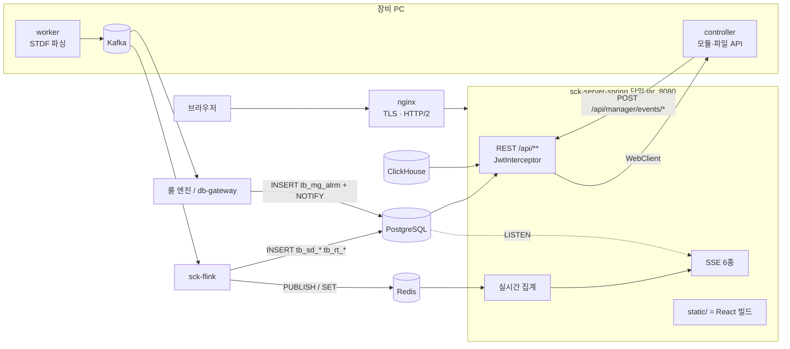
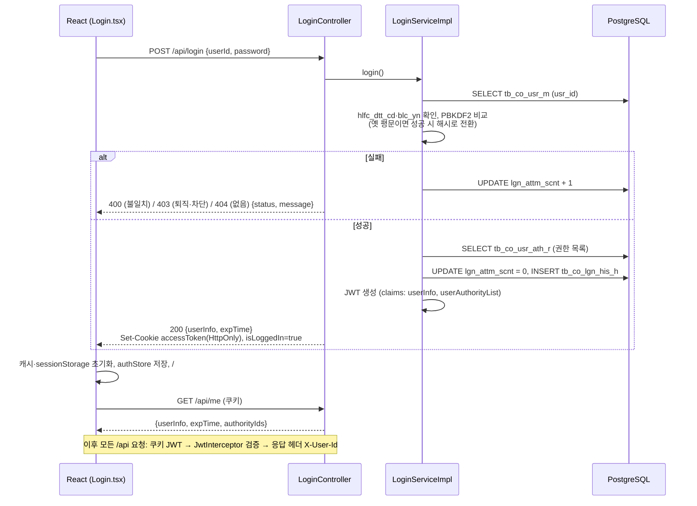

# SCK — DUTCHBOY OSAT 플랫폼 구성 개요

반도체 후공정(OSAT) 테스트 장비가 만드는 STDF 데이터를 실시간으로 수집·집계해 화면에 밀어 주고, 장비·모듈·규칙·알람·레이아웃·분석 위젯과 사용자·권한·메뉴를 관리하는 웹 플랫폼이다.

| 문서 | 내용 |
|---|---|
| [frontend.md](./frontend.md) | React SPA(`sck-server-react`) — 인증·세션, 메뉴→사이드바→탭, 시스템 관리 화면, SSE, 빌드 |
| [backend.md](./backend.md) | Spring Boot(`sck-server-spring`) — 쿠키 JWT, 사용자/권한/메뉴 API, 실시간 집계·SSE, CI/CD |
| [database.md](./database.md) | PostgreSQL 스키마 — 시스템 테이블 DDL, 메뉴 뷰·함수, 도메인 테이블, 파티션 |

기준: 백엔드 `develop@3750fd16`, 프론트 `develop@d83f0e75` (2026-10-02). 작성일 2026-10-06.

---

## 1. 한눈에 보는 구성

| 계층 | 기술 | 비고 |
|---|---|---|
| 프론트엔드 | React 18.2, TypeScript 5.9, Vite 7, React Router 6(HashRouter), Zustand 5, TanStack Query 5 / Table 8 / Virtual 3, styled-components 6 + Tailwind 3, Chart.js·ECharts·billboard·D3, i18next(ko/en) | 백엔드 리포의 git 서브모듈 `src/main/frontend` |
| 백엔드 | Java 17, Spring Boot 3.1.6, MyBatis 3.0.2(XML), jjwt 0.12.3, Lettuce Redis, `SseEmitter`, springdoc 2.2, jasypt | Spring Security 미사용, `HandlerInterceptor` 로 JWT 검증 |
| 주 DB | PostgreSQL (DB `sckte`, 스키마 `public`), 월 파티션 테이블 | 마이그레이션 도구 없이 DDL 문서로 관리 |
| 실시간 | Redis Pub/Sub(`realtime-record`, `parm-hist`), PostgreSQL `LISTEN/NOTIFY`(`alrm_new`) → SSE | 서버 안에서 장비별 메모리 집계 |
| 분석 | ClickHouse(읽기 전용 JDBC) | 애널리틱스 스페이스 위젯 |
| 상류 | 장비 PC 에이전트(`sck-project`: worker·controller·daemon), Kafka, Flink(`sck-flink`), 룰 엔진/db-gateway | 이 서버는 Kafka 를 직접 쓰지 않는다 |
| 빌드·배포 | GitLab CI: Vite 빌드 → `static/` 복사 → Gradle bootJar(단일 jar) → SonarQube 게이트 → 수동 dev 배포(SSH + 배포 호스트의 `make <service>-up`) | Dockerfile 은 리포 밖 |



---

## 2. 배포 환경

| 항목 | 값 |
|---|---|
| 산출물 | `sck-server-spring-0.0.1-SNAPSHOT.jar` 하나. 프론트 빌드(`build/`)가 `BOOT-INF/classes/static/` 에 들어간다 |
| 실행 | JDK 17. 배포 호스트에서 컨테이너가 `app.jar` 와 `application.yaml`(gitignore, 비밀값 포함)을 볼륨으로 받아 실행 |
| 앞단 | nginx: TLS 종료, HTTP/2(SSE 다중 연결 때문에 필수), `/api` SSE 경로 버퍼링 off·긴 read timeout, 업로드 본문 1000MB |
| 외부 의존 | PostgreSQL(12+ 권장), Redis 6+, ClickHouse(분석), 장비 controller(사내망) |
| CI/CD | develop push → `build_frontend_job`(node 20) → `build_backend_job`(JDK 17) → `sonarqube-check` → `deploy_dev_job`(수동). master 는 빌드·배포 없음, CalVer 태그 `YYYYMMDDvN` 은 릴리즈 노트만 |
| 브랜치 | `feature/ROSAT-###` → `develop` → `release/<yyyymmdd>vN` → `master` |
| 로컬 | 백엔드 `./gradlew bootRun`(:8080, `application.yaml` 필요) + 프론트 `npm run dev`(:3000, `/api` → 8080 프록시, 인증서 있으면 HTTPS/HTTP2) |

---

## 3. 로그인 흐름 (프론트 ↔ 백엔드 ↔ DB)



| 단계 | 프론트 | 백엔드 | DB |
|---|---|---|---|
| 토큰 보관 | 저장하지 않음(쿠키). 화면 상태만 sessionStorage `auth-storage` | 쿠키 `accessToken`(HttpOnly, Secure·SameSite 설정값), `isLoggedIn` | — |
| 요청 인증 | `axios withCredentials` + 헤더 `Accept-Language`, `menuId`, `programId` | `JwtInterceptor`(`/api/**`, 로그인·장비 이벤트·Swagger 제외) | — |
| 연장 | 활동이 있으면 10분 간격 `GET /api/refresh`, 사이드바 연장 버튼 | 유효 토큰으로 새 토큰 재발급 | — |
| 만료 | 240분 비활동 → `GET /api/logout` 후 로그인 화면 | 쿠키 삭제 | — |
| 실패 처리 | 401/403 → 세션 정리 + 로그인 화면에 사유 표시 | `DemoException` → `{status, message}` (i18n yaml) | 실패 횟수 증가(자동 잠금 없음) |
| 다중 탭 | `BroadcastChannel('sck-auth-sync')` + `x-user-id` 대조 | 응답 헤더 `X-User-Id` | — |

---

## 4. 사용자 관리 흐름

| 화면(프론트) | API | 테이블 |
|---|---|---|
| 사용자 관리 `userInfo`: 편집 그리드(추가/수정/삭제 → 저장) | `GET /api/user-info`(page·fetchSize) / `POST /api/user-info`(`rowType` 1·2·3 배열) | `tb_co_usr_m`, 부서 `tb_co_dpt_m`, 공통코드 |
| 비밀번호 초기화 버튼 | `PUT /api/user-info/reset` → DB 의 사번으로 해시 재설정, 차단·실패 횟수 해제 | `tb_co_usr_m.pwd, blc_yn, lgn_attm_scnt` |
| 내 비밀번호 변경(헤더) | `POST /api/user-info/change {oldPassword, newPassword}` | `tb_co_usr_m.pwd` |
| 사용자 권한 매핑 `userAuthMapping`: 부여 ◀▶ 가능 | `GET /api/user-authority/assigned|possible?userId`, `POST /api/user-authority/assigned`(전체 교체) | `tb_co_usr_ath_r` |
| 사용자 권한 관리 `userAuthority`: 사용자×권한 매트릭스 | `GET/POST /api/user-authority` | `tb_co_usr_ath_r`, `tb_co_ath_m` |
| 권한 관리 `authority` | `GET/POST /api/authority` | `tb_co_ath_m` |
| 로그인 이력 `loginHistory` | `GET /api/login-history` | `tb_co_lgn_his_h` |

규칙 요약: 신규 사용자의 초기 비밀번호 = 사번(PBKDF2 해시 저장). 사번은 토큰·응답에 싣지 않는다. 사용자 삭제는 FK 대신 서비스가 개인 설정·레이아웃·즐겨찾기·권한을 순서대로 지운다(공개 레이아웃은 삭제자에게 이관).

---

## 5. 메뉴·권한 흐름

```mermaid
flowchart LR
  subgraph DB
    PGM[tb_co_pgm_m<br/>pgm_id = 화면 키]
    MNU[tb_co_mnu_m<br/>mnu_id 7자리, hrk_mnu_id]
    MA[tb_co_mnu_ath_r<br/>ath_id × mnu_id<br/>inq/upd/prnt_ath_yn]
    UA[tb_co_usr_ath_r]
    V[VI_CO_MNU_M_01<br/>재귀 CTE: level, path]
  end
  MNU --> V
  PGM --> MNU
  UA --> Q
  MA --> Q
  V --> Q[selectMenuListByUserAuthority<br/>권한 OR 합산, inq_ath_yn='Y']
  Q -->|GET /api/menu/main| S[menuStore<br/>level1 = 스페이스, 나머지 = 사이드바]
  S --> SB[사이드바 트리·검색]
  SB -->|클릭| T[탭 최대 20개]
  T --> FR[Frame.tsx<br/>tabFrame[programId]]
```

- 서버는 권한별로 **볼 수 있는 메뉴만** 평면 목록으로 내려주고, 트리는 프론트가 `parentMenuId`·`level`·`path` 로 그린다. 메뉴 외 API 에는 권한 검사가 없다(로그인만 확인).
- 즐겨찾기: `GET/POST /api/menu/my-menu` → `tb_co_favr_mnu_r`.
- **새 화면 추가 절차**: ① 프론트 `features/frame/<Feature>` 구현 ② `Frame.tsx` 의 `tabFrame` 에 `programId` 매핑 ③ i18n `menu.<menuId>` ④ DB: `tb_co_pgm_m` → `tb_co_mnu_m` → `tb_co_mnu_ath_r`(화면: 프로그램 관리 → 메뉴 관리 → 권한별 메뉴 매핑) ⑤ 재로그인.

---

## 6. 재구현 순서 (요약)

1. DB: [database.md](./database.md) 의 시스템 테이블·뷰·함수 → 공통코드 → 관리자 계정·권한·메뉴 시드.
2. 백엔드: [backend.md](./backend.md) §3 설정 → §4 JWT 쿠키 인증·인터셉터 → §5·6 사용자/권한/메뉴 API → §7 실시간(Redis 구독 → 집계 → SSE).
3. 프론트: [frontend.md](./frontend.md) §6 인증·세션 → §8 메뉴·탭·Frame → §7 시스템 관리 그리드 → §10 SSE.
4. 배포: CI 에서 프론트 빌드 → `static/` 복사 → bootJar, nginx(TLS·HTTP/2·SSE 버퍼링 off) 뒤에 단일 jar.
