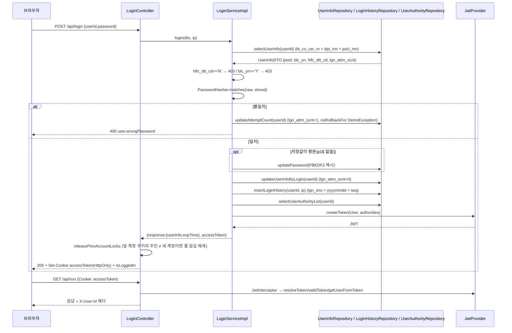
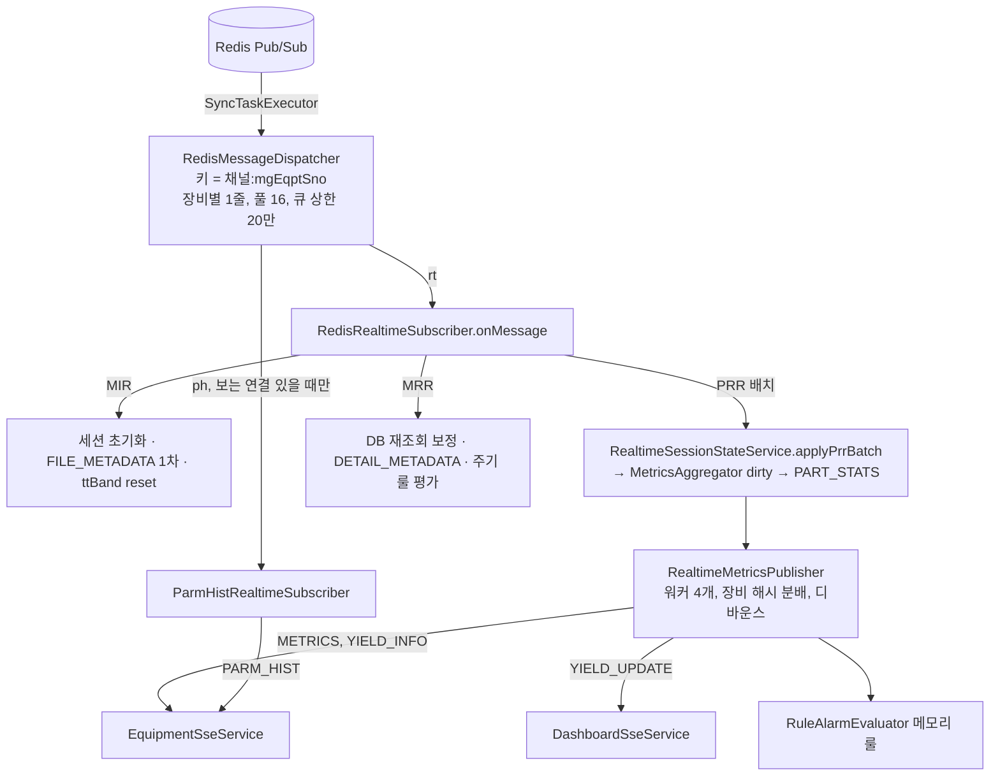

# SCK 관리서버 백엔드 (sck-server-spring) 기술 명세

| 항목 | 값 |
|---|---|
| 대상 리포 | `sck-server-spring` (Spring Boot 백엔드, SCK 반도체 테스트 데이터 플랫폼 관리서버) |
| 기준 브랜치 / 커밋 | `develop` / `3750fd16` (2026-10-02, "Merge branch 'feature/ROSAT-965'") |
| 프론트 서브모듈 핀 | `src/main/frontend` → `sck-server-react` `d83f0e75` (태그 `20260804v1-474-gd83f0e75`) |
| 최근 릴리즈 태그 | `20261001v1` (CalVer `YYYYMMDDvN`) |
| 작성일 | 2026-10-06 |
| 짝 문서 | `frontend.md` (React SPA, 별도 작성) / `database.md` (DB 스키마) |
| 표기 규칙 | 비밀값·사내 호스트는 `<PLACEHOLDER>`. 코드에서 확인 못 한 항목은 **(추정)** 표기. 근거 경로는 리포 루트 기준 `(src/...)` |

## 목차

1. [시스템 개요](#1-시스템-개요)
2. [디렉터리/패키지 구조](#2-디렉터리패키지-구조)
3. [설정](#3-설정)
4. [인증/로그인](#4-인증로그인)
5. [사용자 관리](#5-사용자-관리)
6. [메뉴/권한 관리](#6-메뉴권한-관리)
7. [그 외 도메인 모듈](#7-그-외-도메인-모듈)
8. [공통 인프라](#8-공통-인프라)
9. [빌드/배포](#9-빌드배포)
10. [재구현 체크리스트](#10-재구현-체크리스트)

---

## 1. 시스템 개요

### 1.1 역할

반도체 후공정 테스트 장비(STDF 생성 테스터)에서 실시간으로 올라오는 데이터를 **화면에 밀어 주고(SSE)**, 장비·모듈·룰·알람·레이아웃·애널리틱스 스페이스를 **관리**하며, 사용자/부서/권한/메뉴 같은 **공통 프레임워크** API를 제공하는 단일 Spring Boot 애플리케이션이다. React SPA 빌드 산출물을 같은 jar 안에서 정적 리소스로 서빙한다.

이 서버는 **Kafka를 전혀 알지 못한다**(의존성·코드 모두 없음, `build.gradle` 에 kafka 없음). 상류에서 가공된 결과를 **PostgreSQL + Redis Pub/Sub + PostgreSQL LISTEN/NOTIFY** 세 경로로만 받는다.

### 1.2 상류/하류 시스템 (형제 리포 요약)

| 시스템 | 리포 | 관계 | 이 리포에서 보이는 계약 |
|---|---|---|---|
| 장비 에이전트 (controller / worker / daemon) | `sck-project` | 상류 + 하류 | 에이전트 → 서버: `POST /api/manager/events/*` (헬스체크·모듈상태·이벤트로그·설치 자동등록), `GET /api/die-id-rules/by-family/**` (무인증). 서버 → 에이전트: `http://<장비IP>:<port>/api/modules/*`, `/api/filesystem/*`, `/api/filelist` (`src/main/java/com/dutchboy/demo/client/service/Impl/*.java`) |
| Flink 스트리밍 잡 | `sck-flink` | 상류 | `tb_sd_*`, `tb_rt_*` 테이블 적재, Redis 채널 `realtime-record`·`parm-hist` 발행, Redis 키 `eqpt:session:{mgEqptSno}` SET (`model/service/realtime/*`, `model/dto/realtime/EqptSessionCache.java`) |
| 룰 엔진 / db-gateway | (별도 리포, 로컬 없음) | 상류 | `tb_rl_*` 테이블(룰 정의·실행 로그), `tb_mg_alrm` INSERT 후 `pg_notify('alrm_new', {"alrmSno","kind"})` (`model/service/realtime/AlarmNotifyListener.java`) |
| 분석 저장소 ClickHouse | (적재 파이프라인 별도, **추정**) | 상류 | 테이블 `file_meta`, `agg_yield_daily`, `agg_bin_daily`, `agg_parm_daily`, `param_dict`, `bin_dict` 등 읽기 전용 (`model/analytics/AnalyticsCatalog.java`, `resources/sqlmap/mapper/clickhouse/**`) |
| React SPA | `sck-server-react` (서브모듈) | 하류 | `/api/**` REST + 쿠키 JWT + SSE 6종. jar 내 `static/` 으로 서빙 |

전체 파이프라인(형제 리포 CLAUDE.md 요약): 장비 PC의 **worker** 가 STDF 파일 변화를 NIO WatchService 로 감지해 직접 파싱, Kafka `stdf.record.{equipmentId}` / `file-ready` 토픽으로 발행 → **sck-flink** `RecordWriterJob` 이 `parsing-result` 토픽을 소비해 PostgreSQL(`tb_sd_*`, `tb_rt_*`)에 저장하고 PRR/MIR/MRR 마다 Redis `realtime-record` 채널에 1건씩 publish, 장비 세션 스냅샷을 `eqpt:session:{id}` 키에 SET → **이 서버**가 Redis 구독 → 메모리 집계 → SSE 로 브라우저에 푸시. 룰 엔진은 같은 Kafka 를 구독해 판정하고 db-gateway 가 알람을 `tb_mg_alrm` 에 기록하며 `NOTIFY` 로 이 서버를 깨운다. (`../sck-project/CLAUDE.md`, `../sck-flink/README.md`)

### 1.3 전체 데이터 흐름

```mermaid
flowchart LR
  subgraph EQ[장비 PC - sck-project]
    W[worker<br/>STDF 파싱] --> K[(Kafka)]
    C[controller<br/>:30080 모듈/파일 API]
  end
  K --> F[sck-flink<br/>RecordWriterJob]
  F -->|INSERT tb_sd_* / tb_rt_*| PG[(PostgreSQL<br/>sckte)]
  F -->|PUBLISH realtime-record / parm-hist<br/>SET eqpt:session:id| R[(Redis)]
  K --> RE[룰 엔진 / db-gateway]
  RE -->|INSERT tb_mg_alrm, tb_rl_*<br/>pg_notify alrm_new| PG
  subgraph S[sck-server-spring :8080]
    RS[RedisMessageDispatcher<br/>장비별 직렬 큐] --> AGG[RealtimeSessionState<br/>MetricsAggregator]
    AGG --> SSE[SSE 서비스 6종]
    AN[AlarmNotifyListener<br/>LISTEN alrm_new] --> SSE
    API[REST /api/**<br/>JwtInterceptor] --> MB[MyBatis reader/writer]
    SCH[@Scheduled 10종]
    ST[static/ React 빌드]
  end
  R -->|SUBSCRIBE| RS
  PG --> MB
  PG -->|NOTIFY| AN
  CH[(ClickHouse<br/>분석 저장소)] -->|JDBC read-only| API
  S -->|HTTP WebClient| C
  C -->|POST /api/manager/events/*| API
  B[브라우저 SPA] -->|쿠키 JWT| API
  SSE -->|text/event-stream| B
  ST --> B
```

### 1.4 기술 스택 (build.gradle 기준)

| 구분 | 기술 | 버전 | 근거 |
|---|---|---|---|
| 언어 | Java | 17 (`sourceCompatibility = 17`) | `build.gradle` |
| 프레임워크 | Spring Boot | 3.1.6 (`io.spring.dependency-management` 1.1.4) | `build.gradle` |
| 빌드 | Gradle Wrapper | 8.5 | `gradle/wrapper/gradle-wrapper.properties` |
| 웹 | spring-boot-starter-web (Tomcat, MVC), starter-validation, starter-aop, starter-webflux(WebClient 용), starter-websocket(의존성만 있고 STOMP 설정 없음) | Boot 관리 | `build.gradle` |
| 보안 | **Spring Security 없음.** `jjwt-api/impl/gson` 0.12.3 + 자체 `HandlerInterceptor` | 0.12.3 | `build.gradle`, `util/JwtInterceptor.java` |
| 설정 암호화 | jasypt-spring-boot-starter 3.0.5 (`PBEWITHHMACSHA512ANDAES_256`) | 3.0.5 | `config/JasyptConfigAES.java` |
| ORM | MyBatis Spring Boot Starter 3.0.2 (XML 매퍼, JPA 아님) | 3.0.2 | `build.gradle` |
| DB 드라이버 | PostgreSQL(Boot 관리), ClickHouse `clickhouse-jdbc` 0.6.5 + `clickhouse-http-client` 0.6.5 + `lz4-java` 1.8.0 + `httpclient5` 5.2.1 (4종 세트 필수), Trino JDBC 467(의존성만, 사용처 없음), log4jdbc-log4j2 1.16 | | `build.gradle` |
| 캐시/실시간 | spring-boot-starter-data-redis (Lettuce, Pub/Sub + GET) | Boot 관리 | `config/RedisSubscriberConfig.java` |
| 실시간 전송 | Spring MVC `SseEmitter` (text/event-stream) | | `model/service/sse/*` |
| API 문서 | springdoc-openapi-starter-webmvc-ui 2.2.0 (`/swagger-ui.html`, `/v3/api-docs`) | 2.2.0 | `config/SwaggerConfig.java` |
| 기타 | commons-lang3 3.13.0, commons-codec 1.15, snakeyaml 2.2(i18n yaml), Apache POI 5.2.5(xlsx 스트리밍 내보내기), pyrolite 4.30(Airflow pickle, 사용처 없음), Lombok | | `build.gradle` |
| 테스트 | JUnit5, spring-boot-starter-test, assertj 3.24.2, mybatis-spring-boot-starter-test, reactor-test; 테스트는 `spring.profiles.active=test` | | `build.gradle` |
| 품질 | SonarQube Gradle plugin 5.1.0.4882 | | `build.gradle`, `.gitlab/quality/sonarqube.yml` |

---

## 2. 디렉터리/패키지 구조

### 2.1 트리

```
sck-server-spring/
├── build.gradle / settings.gradle (rootProject.name = 'sck-server-spring')
├── .gitlab-ci.yml, .gitlab/{build,deploy,quality}/*.yml   # CI 파이프라인
├── .gitmodules                                            # src/main/frontend → ../sck-server-react.git (branch develop)
├── CLAUDE.md                                              # 개발 컨벤션 (일부는 코드와 어긋남: controller/airflow, controller/lot 패키지는 현재 없음)
├── docs/db/*.sql                                          # 형상관리용 DDL 사본 (ROSAT-xxx 단위)
├── docs/stdf/stdf-pin-records.md
├── airflow-dags/*.py                                      # 레거시 Airflow DAG (호출 대상 API 가 현재 서버에 없음)
└── src/main
    ├── java/com/dutchboy/demo
    │   ├── DemoApplication.java            # @SpringBootApplication @EnableScheduling
    │   ├── aspect/                         # SystemLoggingAspectJoinPoint, SystemErrorAspectJoinPoint, UserIdInjectAspect
    │   ├── client/                         # 장비 에이전트(controller) HTTP 클라이언트 + 응답 DTO
    │   ├── code/                           # enum 코드 (ConnectionStatus, ModuleStatus, AlarmTypeCode, RuleTypeCode, …)
    │   ├── config/                         # DataSource 4종, MyBatis 3 세션팩토리, Redis 구독, CORS/인터셉터, Swagger, i18n, 캐시, 마스킹
    │   ├── controller/
    │   │   ├── analytics/                  # 애널리틱스 스페이스 (ClickHouse 조회 + 스페이스/위젯 저장)
    │   │   ├── manager/                    # 장비·알람·룰·레이아웃·파일·패치·die_id·parm-hist·장비 이벤트 수신
    │   │   └── system/                     # 로그인·사용자·부서·권한·메뉴·공통코드·로그·개인화 설정
    │   ├── equipment/                      # EquipmentTestTimeStatsController (테스트타임 밴드/인덱스타임)
    │   ├── exception/                      # ApiResponse, DemoException, GlobalExceptionHandler
    │   ├── model/
    │   │   ├── analytics/ (+query/)        # 데이터소스 카탈로그(필드 화이트리스트), 검증된 조회 계획·SQL 명세
    │   │   ├── dto/{common,system,manager,realtime,equipment,analytics}/
    │   │   ├── repository/{reader,writer,clickhouse}/   # @Mapper 인터페이스 (DataSource 별 패키지 분리)
    │   │   ├── service/{system,manager,realtime,sse,equipment,analytics}/ + impl/
    │   │   └── usecase/system/UserInfoUseCase.java
    │   ├── scheduler/                      # @Scheduled 10종
    │   └── util/ (+mask/, +typehandler/)   # JwtProvider/Interceptor, PasswordHasher, WebClientUtil, 시연 마스킹, MyBatis 타입핸들러
    ├── resources
    │   ├── application.yaml                # gitignore 됨 — 로컬/배포 환경별로 주입
    │   ├── globals.properties              # 레거시 전역 설정(spring.config.import 로 로드, 대부분 미사용)
    │   ├── logback-spring.xml
    │   ├── i18n/{exception,success,validation}[_ko].yaml  (+ 레거시 .properties)
    │   ├── sqlmap/sql-mapper-config.xml + sqlmap/mapper/{reader,writer,clickhouse}/**.xml
    │   ├── static/                         # 프론트 빌드 산출물 (gitignore, CI 가 복사)
    │   └── templates/                      # 빈 디렉터리
    └── frontend/                           # git 서브모듈 (React + Vite, outDir=build)
```
(`git ls-files`, `CLAUDE.md`)

### 2.2 패키지 책임과 레이어링

| 레이어 | 패키지 | 규칙 |
|---|---|---|
| Controller | `controller.{system,manager,analytics}`, `equipment` | `@RestController` + `@RequestMapping("/api/...")`, Swagger `@Tag/@Operation`. 파라미터 1개는 `@RequestParam`, 2개 이상은 DTO, 파일은 `@RequestPart`. 로그인 사용자는 `request.getAttribute("userInfo")`(`User`) 또는 `UserContext`(request scope) 로 얻는다 |
| Service | `model.service.*` (인터페이스) / `model.service.impl.*` (구현) | `@Service @Transactional @RequiredArgsConstructor`. `SaveDTO` 상속 DTO 는 `UserIdInjectAspect` 가 `registerId/updateId` 자동 주입, `isInsert()/isUpdate()/isDelete()` 로 매퍼 분기 |
| Repository | `model.repository.reader.*` → `readerSqlSessionFactory`, `writer.*` → `writerSqlSessionFactory`, `clickhouse.*` → `clickhouseSqlSessionFactory` | `@Mapper` 인터페이스 + XML. **패키지가 곧 DataSource** (`config/*DataSourceConfig.java` 의 `@MapperScan(basePackages, sqlSessionFactoryRef)`). 시스템 테이블은 전부 `writer/system` 에 있다(읽기도 writer 커넥션) |
| DTO | `model.dto.*` | `@Getter @Setter @NoArgsConstructor`, 두 번째 글자가 대문자인 필드는 `@JsonProperty` 명시. MyBatis typeAlias 는 `model.dto` 하위 클래스 단순명 사용 가능 |
| 실시간 | `model.service.realtime` (Redis→집계), `model.service.sse` (발행) | 컨트롤러를 거치지 않는 내부 경로. 삭제 판단 시 전체 참조 검색 필수 |

네이밍: 테이블 접두사 `tb_{sd,mg,rt,bt,ag,cf,co,ai,rl}_`, 컬럼 소문자 스네이크 → MyBatis `mapUnderscoreToCamelCase=true` 로 camelCase DTO 매핑 (`resources/sqlmap/sql-mapper-config.xml`). URI 는 kebab-case, 2단어 이상일 때 하이픈 (`/api/user-info`, `/api/menu-authority`).

---

## 3. 설정

### 3.1 설정 파일 구조

| 파일 | 추적 여부 | 역할 |
|---|---|---|
| `src/main/resources/application.yaml` | **gitignore** (`application.yaml`, `application-*.yml` 모두 무시) | 실제 환경값. 환경별로 운영자가 배치. 프로파일 분기는 코드에 없고(`@Profile` 미사용), 테스트만 `spring.profiles.active=test` |
| `src/main/resources/globals.properties` | 추적 | `spring.config.import: classpath:globals.properties` 로 로드. 레거시 키(`filePath`, `ftp.*`, `google*`)이며 현재 Java 코드에서 참조하는 키는 없다 (`grep` 결과). 비밀값 금지 |
| 환경변수 | — | Spring relaxed binding 으로 모든 키를 환경변수로 대체 가능 (예: `SPRING_DATASOURCE_READER_PASSWORD`). 코드 주석이 명시한 환경변수: `CLICKHOUSE_PASSWORD`, `DEMO_MASKING_AVAILABLE` (`model/service/analytics/ClickhouseHealthChecker.java`, `util/mask/DemoMaskingProperties.java`) |
| jasypt | — | `ENC(...)` 값은 `jasypt.secret-key` 로 복호화 (`config/JasyptConfigAES.java`) |

### 3.2 설정 키 전체 목록

값은 전부 플레이스홀더. "기본값" 은 `@Value("${key:default}")` 의 기본값이며, 기본값이 없는 키는 **필수**(없으면 기동 실패).

**필수 (기본값 없음)**

| 키 | 용도 | 예시 |
|---|---|---|
| `jwt.secret-key` | JWT HMAC 서명 키 (UTF-8 바이트 → `Keys.hmacShaKeyFor`, 32바이트 이상) | `<JWT_SECRET_64CHARS>` |
| `jwt.access-token-validity-in-seconds` | 액세스 토큰 수명(초). 쿠키 Max-Age 와 동일 | `14400` (4시간) |
| `jasypt.secret-key`, `jasypt.encryptor.bean` | 설정 복호화 키 / 빈 이름 `jasyptEncryptorAES` | `<JASYPT_KEY>` |
| `spring.datasource.reader.{driver-class-name,jdbc-url,username,password}` | 조회용 PG 풀 (실시간 화면·`AlarmNotifyListener` 전용 커넥션도 이 값 사용) | `jdbc:postgresql://<PG_HOST>:5432/sckte` |
| `spring.datasource.writer.{...}` | 쓰기용 PG 풀 (시스템 테이블·업서트) | 동일 |
| `spring.datasource.clickhouse.{driver-class-name,jdbc-url,username,password}` | 분석 저장소. 미설정이어도 기동은 되고 애널리틱스만 실패(기동 시 1회 연결 확인 로그) | `jdbc:clickhouse://<CH_HOST>:8123/<DB>?session_timezone=Asia/Seoul` **(추정: URL 파라미터명은 코드 주석 근거)** |
| `spring.datasource.airflow.*` | 빈 `airflowDataSource` 가 선언돼 있으나 사용처 없음(지연 초기화라 미설정 가능) | — |
| `spring.data.redis.{host,port,user,password}` | Redis 접속 | `<REDIS_HOST>` / `6379` |
| `spring.data.redis.channel.realtime-record` | Flink 발행 채널명 | `realtime-record` |
| `spring.data.redis.channel.parm-hist` | 파라메트릭 채널명 (**로컬 yaml 에 없으면 기동 실패**) | `parm-hist` |
| `mybatis.config-location` | `classpath:/sqlmap/sql-mapper-config.xml` | 고정 |
| `cors.allowed-origins` | 리스트. `/api/**` 에 적용 | `- http://localhost:3000` |
| `app.patch.file-path` | 모듈 jar 업로드 저장 경로 | `/data/patch` |

**선택 (기본값 있음)**

| 키 | 기본값 | 용도 |
|---|---|---|
| `server.port` | 8080 | 컨텍스트 패스 없음(`/`) |
| `spring.servlet.multipart.max-file-size / max-request-size` | Boot 기본 1MB → yaml 에서 `1000MB` 로 상향 | 모듈 jar 업로드 |
| `spring.jackson.mapper.accept-case-insensitive-properties` | `true` (yaml) | 요청 JSON 키 대소문자 무시 |
| `app.cookie.secure` / `app.cookie.same-site` | `true` / `Lax` | 토큰 쿠키 속성. HTTP 로컬 개발 시 `secure: false` |
| `swagger-ui.server-url`, `application.version` | `http://localhost:8080`, `0.0.1` | OpenAPI servers/info |
| `layout.admin-authority-ids` | 빈 값(관리자 없음) | CSV. 레이아웃 수정/삭제·시연 마스킹 토글의 관리자 권한 ID |
| `demo.masking.{available,enabled,prefix,letterShift,digitShift,fields,excludes,...}` | `false/false/"DEMO-"/7/3/...` | 시연 촬영용 랏·제품 마스킹 |
| `realtime.redis-dispatch.threads` / `.max-queued-per-equipment` | 16 / 200000 | Redis 메시지 처리 풀·장비별 큐 상한 |
| `realtime.sse.equipment.send-threads` / `realtime.sse.dashboard.send-threads` | 32 / 16 | SSE 전송 풀 |
| `realtime.sse.stall-timeout-ms` / `realtime.sse.max-queued-events` | 30000 / 50000 | 막힌 SSE 연결 강제 종료 기준 |
| `realtime.metrics.publish-worker-count` | 4 | 메트릭 발행 워커(장비 해시 분배) |
| `realtime.streaming.idle-timeout-ms` / `realtime.streaming.state-ttl-ms` | 600000 / 86400000 | STREAMING→IDLE 판정, 세션 상태 TTL |
| `realtime.connection.check.interval-ms` | 2000 | 연결상태·스트리밍 타임아웃 스케줄 |
| `realtime.comparison.idle-visible-minutes` | 30 | 동일 제품 비교군 노출 기준 |
| `realtime.stale-cleanup.threshold-hours` / `.interval-ms` | 6 / 600000 | 장시간 무응답 장비 세션 정리 |
| `health.check.timeout-ms` / `health.check.interval-ms` | 60000 / 5000 | 에이전트 heartbeat 두절 판정 |
| `equipment.os-sync.retry-interval-ms` | 600000 | 장비 OS 정보 동기화 재시도 |
| `alarm.response.expire-minutes` / `.expire-enabled` / `.expire-check-ms` | 30 / true / 60000 | 미응답 알람 만료 |
| `alarm.retention.{enabled,days,cron,batch-size,max-per-run}` | false / 180 / `0 40 4 * * *` / 5000 / 200000 | `tb_mg_alrm` 물리 삭제 |
| `alarm.history.display-days` | 180 | 알람 이력 조회 창 |
| `alert.silent-equipment.threshold-hours` / `.interval-ms` | 24 / 600000 | 무수집 장비 알람(006) |
| `evt-log.retention.{enabled,days,cron}` | false / 90 / `0 20 4 * * *` | `tb_mg_evt_log` 삭제 |
| `sys-log.retention.{enabled,days,cron}` | false / 180 / `0 0 5 * * *` | `tb_co_sys_log_g` 삭제 |
| `rt-part.retention.{enabled,months,cron}` | false / 12 / `0 0 4 * * *` | `tb_rt_part` 월 파티션 DROP |
| `die-id.sample.{enabled,max-payload-bytes,max-per-famly}` | true / 2097152 / 3 | worker 표본 수신 게이트 |
| `tt-band.*` (`group-flush-ms` 1500, `mad-floor` 0.0, `min-samples` 2, `point-min-samples` 2, `prewarm-concurrency` 4, `prewarm-enabled` true, `publish-worker-count` 4, `scale` 1.4826, `series-cache-ttl-ms` 3000, `session-abandon-timeout-ms` 600000, `session-idle-timeout-ms` 60000, `log-eqpt-snos` 빈값) | | 테스트타임 밴드 산출 |
| `minimap.source` | `db` | 미니맵 프리뷰 소스 |
| `logging.level.*` | root info | |

**레거시(코드가 읽지 않음, yaml 에 남아 있어도 무해)**: `spring.kafka.*`, `airflow.api.*`, `ws.*`, `spring.datasource.analysis-reader.*`, `app.kafka.*`. (`src/main/java` 전역 `@Value`/`@ConfigurationProperties` grep 결과와 로컬 yaml 비교)

### 3.3 서버·웹 설정

| 항목 | 값 | 근거 |
|---|---|---|
| 포트 / 컨텍스트 패스 | 8080 / 없음 | yaml |
| CORS | `/api/**`, `cors.allowed-origins` 목록, 메서드 GET/POST/PUT/DELETE/PATCH/OPTIONS, 헤더 `*`, `allowCredentials=true`, `exposedHeaders: X-User-Id` | `config/WebConfigs.java` |
| 인터셉터 | `JwtInterceptor` → `/api/**`, 제외: `/api/login`, `/api/renew`, `/v3/api-docs/**`, `/api/manager/events/**`, `/swagger-ui/**`, `/swagger-ui.html`, `/api/die-id-rules/by-family/**` | `config/WebConfigs.java` |
| 서블릿 필터 | `DemoMaskingFilter` (`/api/*`, order `HIGHEST_PRECEDENCE+10`) — 응답 헤더 `X-Demo-Masking: on/off` | `config/DemoMaskingConfig.java` |
| Async 타임아웃 | 40분 (SSE 포함 모든 async 요청) | `WebConfigs.configureAsyncSupport` |
| 파일 업로드 | 1000MB | yaml |
| 타임존 | JVM TZ 설정 없음(호스트 기본). **DB 세션 TZ 는 커넥션 초기화 SQL `SET TIME ZONE 'Asia/Seoul'` 로 고정**, reader/writer 는 추가로 `SET jit = off` | `config/DataSourceBeanConfig.java` |
| JSON | Boot 기본 ObjectMapper + 대소문자 무시 역직렬화 + `DemoUnmaskStringDeserializer`(String 역직렬화 시 마스킹 접두어 원복). 응답용 MVC 컨버터는 `DemoMaskingObjectMapper`(기본 매퍼 copy + 마스킹 직렬화기) 로 교체 | `config/DemoMaskingConfig.java`, `WebConfigs.extendMessageConverters` |
| i18n | `AcceptHeaderLocaleResolver`, 기본 `Locale.ENGLISH`; 메시지는 `classpath:i18n/{exception,success,validation}[_{lang}[_{COUNTRY}]].yaml` 을 중첩 키 flatten 하여 로드 | `config/MessageSourceConfig.java`, `config/YamlMessageSource.java` |
| Swagger | `/swagger-ui.html`, 그룹 `sck-main-api` = `controller.manager` + `controller.system` 패키지만 스캔(analytics/equipment 컨트롤러는 기본 그룹 밖), Bearer 스키마 `JWT Authentication` 선언(실제 인증은 쿠키) | `config/SwaggerConfig.java` |
| 로깅 | logback: CONSOLE + SiftingAppender(`department` MDC 키, 기본 `default`) → `/logs/application.log`, 일자+8MB 롤링, 200개 보관, 총 1GB. `com.dutchboy.demo.model.repository` INFO. 컨테이너 안에서 `/logs` 마운트 필요 | `resources/logback-spring.xml` |

### 3.4 DataSource / MyBatis 배선 (핵심 코드)

```java
// config/DataSourceBeanConfig.java (발췌)
private static final String SESSION_TZ_INIT_SQL = "SET TIME ZONE 'Asia/Seoul'";
private static final String DISABLE_JIT_INIT_SQL = "SET jit = off";   // tb_rt_part 파티션 다수 → JIT 컴파일이 µs 쿼리를 ms 로 만든다
@Bean @ConfigurationProperties(prefix = "spring.datasource.reader")
public DataSource readerDataSource() { return buildForRealtime(); }   // TZ + jit off
@Bean @ConfigurationProperties(prefix = "spring.datasource.writer")
public DataSource writerDataSource() { return buildForRealtime(); }
@Bean @ConfigurationProperties(prefix = "spring.datasource.airflow")
public DataSource airflowDataSource() { return buildWithKstSession(); } // 미사용
@Bean @ConfigurationProperties(prefix = "spring.datasource.clickhouse")
public DataSource clickhouseDataSource() { return DataSourceBuilder.create().type(HikariDataSource.class).build(); } // PG 전용 SET 금지
```

| SqlSessionFactory | 매퍼 패키지 | XML 위치 | typeAliases | typeHandlers |
|---|---|---|---|---|
| `readerSqlSessionFactory` | `model.repository.reader` | `classpath:/sqlmap/mapper/reader/**/*.xml` | `model.dto` | `util.typehandler` |
| `writerSqlSessionFactory` | `model.repository.writer` | `classpath:/sqlmap/mapper/writer/**/*.xml` | `model.dto` | `util.typehandler` |
| `clickhouseSqlSessionFactory` | `model.repository.clickhouse` | `classpath:/sqlmap/mapper/clickhouse/**/*.xml` | `model.dto.analytics` | (없음, `callSettersOnNulls=true`) |

공통 MyBatis 설정: `callSettersOnNulls=true`, `jdbcTypeForNull=NULL`, `mapUnderscoreToCamelCase=true` (`resources/sqlmap/sql-mapper-config.xml`). 타입핸들러: `IntegerArrayTypeHandler`(int[]), `SmallIntArrayTypeHandler`, `StringArrayTypeHandler`(text[] → `String[] path`), `JsonNodeTypeHandler`(jsonb ↔ JsonNode), `ByteaTypeHandler`, `BigDecimalToDoubleTypeHandler`, `LocalDate(Time)TypeHandler` (`util/typehandler/`).

---

## 4. 인증/로그인

### 4.1 방식 요약

| 항목 | 내용 |
|---|---|
| 방식 | **쿠키에 담긴 JWT 액세스 토큰 1종** (Refresh 토큰·서버 세션 없음). 갱신은 유효한 토큰으로 새 토큰 재발급 |
| 토큰 전달 | 쿠키 `accessToken` (HttpOnly, Path=/, Secure=`app.cookie.secure`, SameSite=`app.cookie.same-site`, Max-Age=유효초). `Authorization` 헤더는 **읽지 않는다** |
| 보조 쿠키 | `isLoggedIn=true` (HttpOnly 아님, 같은 수명) — 로그인 화면이 상태 판정용으로 읽음 |
| 서명 | HMAC-SHA (`Keys.hmacShaKeyFor(secret.getBytes(UTF_8))`; jjwt 0.12 가 키 길이로 HS256/384/512 자동 선택) |
| 클레임 | `sub="accessToken"`, `iat`, `exp`, `userInfo`(User 객체), `userAuthorityList`(권한 목록). **서명만 되고 암호화는 아니므로 비밀값을 넣지 않는다**(사번 제거 이력) |
| 검증 지점 | `JwtInterceptor.preHandle` (`/api/**`, 제외 경로 외 전부). Spring Security 필터체인 **없음** |
| 비밀번호 | PBKDF2WithHmacSHA256, 210,000회, 16바이트 솔트, 256비트, 저장형식 `p1$<iter>$<saltB64>$<hashB64>`(패딩 없는 Base64, ≤80자). 접두어 `p1$` 없으면 옛 평문으로 보고 상수시간 비교 후 **로그인 성공 시 해시로 자동 전환** |
| 잠금 정책 | 자동 잠금 **없음**(실패 횟수 `lgn_attm_scnt` 만 증가, 성공 시 0). `blc_yn='Y'` 는 관리자 수동 차단. 비밀번호 초기화 시 차단·횟수 함께 해제 |
| 로그인 이력 | 성공 시 `tb_co_lgn_his_h` INSERT (실패는 기록 안 함) |

### 4.2 필터/인터셉터 구성 (핵심 코드)

```java
// config/WebConfigs.java
registry.addInterceptor(jwtInterceptor)
        .addPathPatterns("/api/**")
        .excludePathPatterns("/api/login", "/api/renew", "/v3/api-docs/**",
            "/api/manager/events/**",            // 장비 에이전트 무인증 수신
            "/swagger-ui/**", "/swagger-ui.html",
            "/api/die-id-rules/by-family/**");   // worker 규칙 조회·표본 POST (무인증)

// util/JwtInterceptor.java
public boolean preHandle(HttpServletRequest request, HttpServletResponse response, Object handler) {
    String token = jwtProvider.resolveToken(request);          // 쿠키 accessToken 없으면 401 token.notValidToken
    if (jwtProvider.validToken(token)) {                       // 서명·만료 검증, 실패는 예외
        User user = jwtProvider.getUserFromToken(token);
        List<UserAuthority> auths = jwtProvider.getUserAuthorityListFromToken(token);
        userContext.setUserId(user.getUserId());               // @RequestScope 빈
        response.setHeader("X-User-Id", URLEncoder.encode(user.getUserId(), UTF_8)); // 탭 계정 대조용
        request.setAttribute("userInfo", user);
        request.setAttribute("userAuthorityList", auths);
        return true;
    }
    throw new DemoException(HttpStatus.FORBIDDEN, "token.parsingFail");
}
```

주의: `SystemLoggingAspectJoinPoint` 도 모든 `*Controller` 메서드에서 토큰을 다시 읽으므로, **무인증 엔드포인트는 인터셉터 제외와 별개로 aspect 의 `excludeMethod` 목록(메서드명)에 등록**해야 401 이 나지 않는다 (`aspect/SystemLoggingAspectJoinPoint.java`).

### 4.3 토큰 생성·검증 (핵심 코드)

```java
// util/JwtProvider.java (발췌)
@PostConstruct void init() { key = Keys.hmacShaKeyFor(rawSecretKey.getBytes(UTF_8)); }
public String createToken(User user, List<UserAuthority> auths) {
    Date now = new Date(), validity = new Date(now.getTime() + 1000 * accessTokenValidityInSeconds);
    return Jwts.builder().header().add("typ","JWT").and()
        .subject("accessToken").issuedAt(now).expiration(validity)
        .claim("userInfo", user).claim("userAuthorityList", auths)
        .signWith(key).compact();
}
public String resolveToken(HttpServletRequest req) { /* 쿠키 accessToken, 없으면 401 token.notValidToken */ }
public boolean validToken(String token) {
    try { Jwts.parser().verifyWith(key).build().parseSignedClaims(token); return true; }
    catch (SignatureException | MalformedJwtException e) { throw new DemoException(NOT_FOUND, "token.notValidToken"); } // 404 (코드 그대로)
    catch (ExpiredJwtException e)      { throw new DemoException(FORBIDDEN, "token.expired"); }
    catch (UnsupportedJwtException e)  { throw new DemoException(FORBIDDEN, "token.unsupported"); }
    catch (IllegalArgumentException e) { throw new DemoException(BAD_REQUEST, "token.undefined"); }
    catch (Exception e)                { throw new DemoException(INTERNAL_SERVER_ERROR, "common.internal"); }
}
```

`User` 클래스는 `@JsonIgnoreProperties(ignoreUnknown = true)` 필수 — 토큰 클레임 역직렬화에 `new ObjectMapper()` 를 쓰므로 필드를 제거하면 발급된 토큰이 전부 401 이 된다 (`model/dto/common/User.java`).

### 4.4 API

| Method | Path | 인증 | 설명 |
|---|---|---|---|
| POST | `/api/login` | 없음 | ID/PW 검증, 토큰 발급, 쿠키 설정. `releaseLockSnos` 가 있으면 요청에 붙어 온 **이전 계정 쿠키**의 주인이 잡은 룰 편집 잠금 해제 |
| GET | `/api/me` | 쿠키 | 토큰 클레임만으로 내 정보 + 권한 ID 목록 반환(DB 조회 없음) |
| GET | `/api/refresh` | 쿠키 | 토큰 유효하면 같은 클레임으로 재발급(수명 연장). 프론트가 활동 중 10분마다 호출 |
| POST | `/api/renew` | 없음(인터셉터 제외) | `/api/login` 과 동일 처리(ID/PW 재검증) |
| GET | `/api/logout` | 쿠키 | 내 룰 편집 잠금 전부 해제 후 두 쿠키 Max-Age=0 |
| POST | `/api/co/cm/updateLoginUnlock` | 쿠키 | 레거시. `request.getAttribute("userInfo")` 를 `Map` 으로 캐스팅하므로 현재 구조(`User`)에서는 **ClassCastException → 500** (재구현 시 제외 권장) |

**요청/응답 예시**

```http
POST /api/login
Content-Type: application/json

{"userId": "admin", "password": "<PASSWORD>", "releaseLockSnos": [12, 34]}
```
```http
HTTP/1.1 200
Set-Cookie: accessToken=<JWT>; Path=/; Max-Age=14400; HttpOnly; Secure; SameSite=Lax
Set-Cookie: isLoggedIn=true; Path=/; Max-Age=14400; Secure; SameSite=Lax

{"userInfo":{"userId":"admin","userName":"관리자","department":"D001","deptName":"시스템팀","positionName":"책임"},
 "expTime":14400}
```
(`expTime` 은 로그인/refresh 응답에서는 **유효 초**, `/api/me` 에서는 **만료 epoch ms** — 단위가 다르다. `model/service/impl/system/LoginServiceImpl.java`, `controller/system/LoginController.java`)

```http
GET /api/me  →  200
{"userInfo":{...},"expTime":1759800000000,"authorityIds":["A001","A010"]}

GET /api/refresh  →  200  {"expTime":14400}  (+ 두 쿠키 재설정)
GET /api/logout   →  200  {"status":"OK","message":"정상적으로 로그아웃 되었습니다."}
```

**실패 응답** (`exception/GlobalExceptionHandler.java`, 메시지는 `Accept-Language` 에 따라 en/ko)

| 상황 | HTTP | body |
|---|---|---|
| 사용자 없음 | 404 | `{"status":"NOT_FOUND","message":"User information not found. Please verify and try again."}` |
| 재직구분 `hlfc_dtt_cd='N'` | 403 | `user.notRegist` |
| `blc_yn='Y'` | 403 | `user.lock` |
| 비밀번호 불일치 | 400 | `user.wrongPassword` (실패 횟수 +1, 메시지 인자로 `attempts+1` 전달) |
| 쿠키 없음 | 401 | `token.notValidToken` |
| 만료 | 403 | `token.expired` |
| 서명/형식 오류 | 404 | `token.notValidToken` |

### 4.5 권한 판정 방식

- 역할(권한) = `tb_co_ath_m.ath_id`. 사용자-권한은 `tb_co_usr_ath_r` 다대다. 토큰의 `userAuthorityList` 에 로그인 시점 권한이 박힌다(권한 변경은 재로그인/refresh 전까지 반영 안 됨 — refresh 는 기존 클레임을 그대로 복사).
- **URL 패턴·어노테이션 기반 인가 없음.** 인증만 통과하면 모든 `/api/**` 호출 가능. 화면 노출 제어는 메뉴-권한 매핑(`tb_co_mnu_ath_r.inq_ath_yn`) 으로 프론트가 수행.
- 서버 측 관리자 판정은 두 곳만: 레이아웃 수정/삭제(소유자 또는 `layout.admin-authority-ids` 포함 권한), 시연 마스킹 토글 (`model/service/manager/LayoutPermissionChecker.java`, `controller/system/DemoMaskingController.java`).
- 소유자 판정: 애널리틱스 스페이스/위젯은 `usr_id = 토큰 사용자` 전용(403), 레이아웃은 `owner_id`.

### 4.6 로그인 시퀀스



---

## 5. 사용자 관리

### 5.1 도메인 모델

`UserInfoDTO extends SaveDTO` (`model/dto/system/UserInfoDTO.java`, 매핑 `resources/sqlmap/mapper/writer/system/userInfoMapper.xml`)

| 필드 | 컬럼 | 타입 | 비고 |
|---|---|---|---|
| userId | usr_id | String | PK, 변경 불가 |
| userName | usr_nm | String | |
| password | pwd | String | `@JsonProperty(access=WRITE_ONLY)` — 응답에 절대 안 나감. 목록 SELECT 도 PWD 제외 |
| employeeNo | emp_no | String | 사번 = **초기 비밀번호 재료** |
| deptCode / deptName / parentDeptCode | dpt_cd / (조인 dpt_nm) / hrk_dpt_cd | String | 부서는 `tb_co_dpt_m`, 목록은 뷰 `VI_CO_DPT_M_01` 조인 |
| positionCode / positionName | pscl_cd / (공통코드 `SC_CO_PSCL_CD`) | String | 직급 |
| responsibilityCode / responsibilityName | rspofc_cd | String | 직책 |
| blockYn | blc_yn | String | 'Y' 차단(관리자 수동) |
| attemptCount | lgn_attm_scnt | Integer | 로그인 실패 횟수 (nullable → 0 취급) |
| holdOfficeDttCode / holdOfficeDttName | hlfc_dtt_cd | String | 재직구분. 검색 시 '001'↔'1', '002'↔'2' 동치 처리 |
| userDttCode / userTypeCode | usr_dtt_cd / usr_tp_cd | String | |
| relationCompanyCode | rlt_cmp_cd | String | 관계사 |
| mobileNo / telNo / faxNo / email | mbl_tel_no / tel_no / fax_no / eml_addr | String | |
| oldPassword / newPassword | — | String | 비밀번호 변경 요청 전용 |
| registerId/Date, updateId/Date, rowType | reg_id/dt, upd_id/dt | | `SaveDTO` 공통. rowType 0=normal,1=insert,2=update,3=delete |

검색 DTO `UserInfoSearch extends InfinityScrollDTO`: userId, userName, deptCode, deptName, holdOfficeDttCode, positionCode, responsibilityCode, userTypeCode, parentDeptCode, key, value + `fetchSize`(기본 50)/`page`(0-base).

세션 사용자 `User`(토큰 클레임): userId, userName, department(dpt_cd), deptName, positionName (`model/dto/common/User.java`).

### 5.2 API 목록

| Method | Path | 설명 | 권한 | 요청 | 응답 |
|---|---|---|---|---|---|
| GET | `/api/user-info` | 사용자 목록(페이징, LIKE 검색) | 로그인 | query `UserInfoSearch` | `List<UserInfoDTO>` (pwd 제외) |
| POST | `/api/user-info` | 목록 저장 (rowType 별 insert/update/delete) | 로그인 | `List<UserInfoDTO>` | `{"status":"OK","message":"사용자, N record(s) saved successfully."}` |
| POST | `/api/user-info/change` | 내 비밀번호 변경 | 로그인(본인) | `{"oldPassword","newPassword"}` | ApiResponse `common.update` |
| PUT | `/api/user-info/reset` | 비밀번호 초기화(사번으로) | 로그인 | `{"userId"}` | ApiResponse |
| GET | `/api/user-authority` | 사용자×권한 매트릭스(권한 ID 를 컬럼으로 피벗) | 로그인 | `UserInfoSearch` | `List<Map>` (`userId,userName,employeeNo,...,"<ATH_ID>":"Y/N"`) |
| GET | `/api/user-authority/assigned` | 사용자에 부여된 권한 | 로그인 | `userId` | `List<UserAuthorityDTO>` |
| GET | `/api/user-authority/possible` | 부여 가능한(미보유) 권한 | 로그인 | `userId` | `List<UserAuthorityDTO>` |
| POST | `/api/user-authority` | 권한 매핑 저장(행 단위 delete→insert) | 로그인 | `List<UserAuthorityDTO>` (userId, authId, rowType) | ApiResponse |
| POST | `/api/user-authority/assigned` | 사용자 권한 **전체 교체** (deleteAll → insert) | 로그인 | `List<UserAuthorityDTO>` (첫 행의 userId 기준) | ApiResponse |
| GET/POST | `/api/authority` | 권한 마스터 목록/저장 (`AuthSearch`: authId, authName, useYn) | 로그인 | `List<Authority>` | ApiResponse (POST 는 리터럴 `"message"` 반환 — 버그) |
| GET/POST | `/api/department` | 부서 목록/저장. insert/update 시 `dpt_lvl_val = 상위 레벨+1` 자동 계산 | 로그인 | `List<DepartmentDTO>` | ApiResponse |
| GET/POST | `/api/login-history` | 로그인 이력 조회(기간·ID·IP LIKE, 페이징)/저장 | 로그인 | `LoginHistorySearch` | `List<LoginHistoryDTO>` |

(`controller/system/{UserInfo,UserAuthority,Authority,Department,LoginHistory}Controller.java`)

### 5.3 비즈니스 규칙

- **등록**: `selectCheckUserId` 로 중복이면 409 `common.existEntity("사용자 ID")`. 사번 공백이면 400 `validation.required("사번")`. `pwd = PBKDF2(emp_no)` 로 저장(초기 비밀번호 = 사번). (`model/service/impl/system/UserInfoService.java`)
- **수정**: `usr_id` 불변. `blockYn='Y'` 일 때만 `blc_yn`,`lgn_attm_scnt` 를 요청값으로, 아니면 `blc_yn='N'` 으로 되돌린다(차단 해제 경로).
- **삭제**: FK 가 없어 고아 방지를 서비스가 수행. 순서: 애널리틱스 위젯→스페이스 → 비공개 레이아웃 장비배치→레이아웃(공개 레이아웃은 **삭제자에게 소유권 이전**) → `tb_cf_grid_col`, `tb_cf_wgt_pos`, `tb_cf_eqpt_grid_r`, `tb_cf_bin`, `tb_cf_test_time_chart` → `tb_cf_grid` → `tb_co_favr_mnu_r` → `tb_co_usr_ath_r` → `tb_co_usr_m`. 로그인 이력·시스템/에러 로그·알람 응답자·룰 작성자·`tb_mg_eqpt.usr_id` 는 남긴다. 한 트랜잭션.
- **비밀번호 변경**: 저장값과 `oldPassword` 를 `PasswordHasher.matches` 로 비교(평문/해시 모두), 불일치 404 `user.notSamePassword`. 새 값은 해시 저장.
- **초기화**: 요청의 사번은 무시하고 **DB 의 emp_no 를 읽어** 해시, `blc_yn='N'`, `lgn_attm_scnt=0` 함께 리셋.
- **권한 저장(`saveUserAuthorityList`)**: 행마다 `deleteUserAuthority(userId, authId)` 후 insert/normal 이면 insert. 이력 테이블(`tb_co_usr_ath_his_h`) insert 는 주석 처리됨.
- **권한 마스터**: insert 시 `srt_sqn` 미지정이면 `MAX+1`. 삭제 시 존재 확인 후 삭제.

### 5.4 역할/권한 모델

```
tb_co_ath_m (권한 마스터: ath_id, ath_nm, use_yn, srt_sqn, utr_dpt_ath_yn, utr_use_dpt_cd, whl_rlt_cmp_use_yn)
   1 ─┬─ N tb_co_usr_ath_r (usr_id, ath_id)         ← 사용자에게 부여
       └─ N tb_co_mnu_ath_r (ath_id, mnu_id, inq/upd/prnt_ath_yn, inq_rng_dtt_cd)  ← 메뉴별 조회/수정/출력 권한
```
토큰에 실리는 `UserAuthority`: userId, authorityId, authorityName, singleAuthority(`utr_dpt_ath_yn`), wholeAuthority(`whl_rlt_cmp_use_yn`). "관리자" 전용 역할은 없고 `layout.admin-authority-ids` 설정으로 지정한다.

---

## 6. 메뉴/권한 관리

### 6.1 메뉴 테이블 모델

| 테이블 | 역할 | 핵심 컬럼 |
|---|---|---|
| `tb_co_mnu_m` | 메뉴 마스터(트리) | `mnu_id`(PK, VARCHAR 10), `hrk_mnu_id`(부모; 루트는 `'-1'`, 그 아래 `'0'` HOME), `mnu_nm`, `pgm_id`(FK→`tb_co_pgm_m`), `srt_sqn`, `mnu_idct_yn`(표시), `use_yn`, `dmn_cd`, `cnn_dtt_cd`, `nth_lgn_pms_yn`, `prv_inf_icd_yn` |
| `tb_co_pgm_m` | 프로그램(화면) 마스터 | `pgm_id`(PK, 프론트 라우트 키), `pgm_nm`, `sys_dtt_cd`(공통코드 `SC_CO_SYS_DTT_CD`: 011 MS / 012 EM / 013 CS / 014 AS / 015 SS …), `use_yn`, `pgm_url_nm`, `desc_rmk` |
| `tb_co_mnu_ath_r` | 권한×메뉴 | `ath_id`, `mnu_id`, `inq_ath_yn`, `upd_ath_yn`, `prnt_ath_yn`, `inq_rng_dtt_cd` |
| `tb_co_favr_mnu_r` | 즐겨찾기(마이메뉴) | `usr_id`, `mnu_id` |
| 뷰 `VI_CO_MNU_M_01` | 재귀 CTE 로 `level`, `path`(text[]), `cycle` 산출 | `path = ARRAY[mnu_id] ‖ lpad(srt_sqn,6,'0') ‖ mnu_id ...` |
| 함수 `SF_GET_MENU_LEVEL(mnu_id)`, `SF_GET_FULL_MENU_ID(mnu_id)`, `SF_GET_FULL_MENU_NAME(mnu_id)` | 최대 6단 조상 조인으로 레벨/전체 ID(6자리 lpad 연결)/전체 이름 | database.md §6 |

### 6.2 트리 구성 방식

- **DB 가 트리를 평탄화**한다: `VI_CO_MNU_M_01` 의 `path` 배열과 `SF_GET_FULL_MENU_ID` 의 `MNU_GROUP` 문자열로 정렬 키를 만들고, 서버는 그대로 리스트를 내려 준다(서버 측 트리 빌더 없음). 프론트가 `parentMenuId`/`level`/`path` 로 트리를 만든다.
- 사용자 메뉴 쿼리(`selectMenuListByUserAuthority`): 사용자의 권한 집합 → `tb_co_mnu_ath_r` 를 `mnu_id` 로 GROUP BY 하고 `MAX(inq_ath_yn)` 등으로 **여러 권한 중 하나라도 'Y' 면 허용** → `VI_CO_MNU_M_01` 와 조인 → `use_yn='Y' AND inq_ath_yn='Y'` 만 → `ORDER BY path, mnu_group, srt_sqn`. `MNU_GROUP` 은 `pgm_id` 가 있으면 `LEFT(MNU_GROUP,-2) || srt_sqn`.
- 메뉴 저장: insert 시 `existsMenu` 로 409. 삭제는 자식 검사 없음(FK 없음).

```sql
-- resources/sqlmap/mapper/writer/system/menuMapper.xml : selectMenuListByUserAuthority (구조)
SELECT MNU_ID, HRK_MNU_ID, MNU_NM, PGM_ID, PGM_NM, PGM_USE_YN, SRT_SQN, USE_YN, INQ_ATH_YN, LEVEL,
       CASE WHEN NULLIF(PGM_ID,'') IS NOT NULL THEN CONCAT(LEFT(MNU_GROUP,-2), SRT_SQN) ELSE MNU_GROUP END AS MNU_GROUP,
       MNU_PATH, MNU_IDCT_YN, PATH
FROM ( SELECT M.MNU_ID, SF_GET_MENU_LEVEL(M.MNU_ID) AS LEVEL,
              RIGHT(SF_GET_FULL_MENU_ID(M.MNU_ID), -6) AS MNU_GROUP,
              SF_GET_FULL_MENU_NAME(M.MNU_ID) AS MNU_PATH, ... , M.PATH
       FROM VI_CO_MNU_M_01 M
       LEFT JOIN TB_CO_PGM_M P ON M.PGM_ID = P.PGM_ID
       INNER JOIN ( SELECT MNU_ID, MAX(INQ_ATH_YN) INQ_ATH_YN, MAX(UPD_ATH_YN) ..., MAX(UTR_USE_DPT_CD)
                    FROM TB_CO_MNU_ATH_R M INNER JOIN TB_CO_ATH_M A ON M.ATH_ID = A.ATH_ID
                    WHERE M.ATH_ID IN (SELECT ATH_ID FROM TB_CO_USR_ATH_R WHERE USR_ID = #{userId})
                    GROUP BY MNU_ID ) U ON M.MNU_ID = U.MNU_ID
       WHERE M.USE_YN = 'Y' ) A
WHERE INQ_ATH_YN = 'Y'
ORDER BY PATH, MNU_GROUP, SRT_SQN
```

### 6.3 프론트에 내려주는 메뉴 응답 (`GET /api/menu/main`)

`MainMenuDTO` 배열 (`model/dto/common/MainMenuDTO.java`). `menuId`·`programId`·`menuName` 은 프론트 i18n(`menu.<menuId>`)과 `Frame.tsx` 매핑에서 확인한 실제 체계(7자리 ID, 그룹은 백만 단위, 리프는 그룹+100 단위)를 따랐다. `menuGroup`·`path` 의 정렬 키 값은 뷰·함수 계산 결과의 **예시(추정)** 다(실제 메뉴 행은 DB 데이터이며 리포에 시드가 없음).

```json
[
  {"menuId":"0","parentMenuId":"-1","menuGroup":"000000","menuPath":"HOME","menuName":"HOME",
   "menuDisplay":"Y","menuUsage":"Y","path":["0"],"level":0,"viewingRights":"Y",
   "programId":null,"programName":null,"programUsage":null,"sortOrder":"0"},
  {"menuId":"1000000","parentMenuId":"0","menuGroup":"0000001000000","menuPath":"HOMEMonitoring Space",
   "menuName":"Monitoring Space","menuDisplay":"Y","menuUsage":"Y","path":["0","000010","1000000"],
   "level":1,"viewingRights":"Y","programId":null,"programName":null,"programUsage":null,"sortOrder":"10"},
  {"menuId":"1000100","parentMenuId":"1000000","menuGroup":"000000100000010","menuPath":"HOMEMonitoring SpaceRealtime Monitoring",
   "menuName":"Realtime Monitoring","menuDisplay":"Y","menuUsage":"Y",
   "path":["0","000010","1000000","000010","1000100"],"level":2,"viewingRights":"Y",
   "programId":"stateList","programName":"Realtime Monitoring","programUsage":"Y","sortOrder":"10"}
]
```

- `level` 1 = 스페이스(사이드바 상위 그룹), `programId` 가 있는 행 = 리프 화면(프론트가 탭으로 연다), `programId` 가 없는 level ≥ 2 행 = 중간 그룹.
- 전체 메뉴 ID·programId 대응표는 [frontend.md §8.1](./frontend.md#81-메뉴-데이터-모델-modelsinterfacesmenuinterfacets).
필드 매핑: `menuDisplay←mnu_idct_yn`, `menuUsage←use_yn`, `viewingRights←inq_ath_yn`, `programUsage←pgm_use_yn`, `path←text[]`(StringArrayTypeHandler). 프론트 mock(`src/main/frontend/src/mocks/menuHandlers.ts`)도 같은 구조를 사용한다.

### 6.4 메뉴 관련 API

| Method | Path | 설명 | 요청 | 응답 |
|---|---|---|---|---|
| GET | `/api/menu/main` | 로그인 사용자 권한별 메뉴 | — | `List<MainMenuDTO>` |
| GET | `/api/menu` | 메뉴 관리 목록 (`MenuSearch`: parentMenuId, domainCode, useYn) | query | `List<Menu>` |
| GET | `/api/menu/parent` | 상위 메뉴 후보 (`useYn='N'` 이면 비활성 트리 포함 규칙, `systemDivisionMenu`, `orgMenuGroup` 제외) | query | `List<Menu>` |
| POST | `/api/menu` | 저장 (rowType). insert 중복 409 | `List<Menu>` | ApiResponse |
| GET | `/api/menu/my-menu` | 즐겨찾기 목록 | — | `List<MainMenuDTO>` |
| POST | `/api/menu/my-menu` | 즐겨찾기 토글 (JSON 또는 form) — 있으면 삭제, 없으면 등록 | `{"menuId"}` | `myMenu.regist` / `myMenu.remove` |
| GET | `/api/menu-authority` | 권한별 메뉴 매핑 목록 (`authId`, `useYn`, `systemDttMenu`) — 전체 메뉴에 해당 권한의 Y/N 을 LEFT JOIN | query | `List<MenuAuthority>` |
| POST | `/api/menu-authority` | 저장: 행마다 delete 후 `inq+upd+prnt != "000"` 또는 범위코드 있으면 insert | `List<MenuAuthority>` | ApiResponse |
| GET/POST | `/api/program` | 프로그램 목록/저장 (`ProgramSearch`: systemDttCode, programName, programId) | | |

`Menu` DTO 필드: menuId, parentMenuId, parentMenuName, menuName, programId, programName, connectionDttCode, sortSequence, menuIndicateYn, privateInfoIndicateYn, nonLoginPermissionYn, domainCode, systemDttCode, useYn, path[] (+SaveDTO). `MenuAuthority`: authId, parentMenuId, menuId, menuName, sortSequence, level, menuGroup, inquiryAuthYn, updateAuthYn, printAuthYn, inquiryRangeDttCode(+Name), programId.

### 6.5 메뉴 권한 판정 로직

1. 서버: `/api/menu/main` 이 `inq_ath_yn='Y'` 인 메뉴만 반환 → 프론트 라우팅/사이드바 구성.
2. 서버는 메뉴 외 API 에 권한 검사를 하지 않는다. 프론트 요청 헤더 `menuId`, `programId` 는 **사용 이력/에러 로그 기록용**으로만 읽는다 (`aspect/*`).
3. `upd_ath_yn`, `prnt_ath_yn` 은 저장만 되고 서버 로직에서 쓰이지 않는다(프론트 버튼 제어용 **추정**).

---

## 7. 그 외 도메인 모듈

각 모듈: 책임 / 핵심 테이블 / 핵심 API.

### 7.1 장비 관리 (`controller/manager/EquipmentController.java`, `/api/manager/equipment`)
장비 등록·수정·삭제, 실시간 모니터링 목록, 장비 상세 종합 정보. 테이블 `tb_mg_eqpt`(+`tb_sd_eqpt` 매핑, `rule_eval_yn`, `mntr_hide_yn`, `last_hb_dt`), `tb_rt_eqpt`, `tb_eqpt_memo`, `tb_mg_cust/_alias/_prod`(고객 표시). 캐시 `equipmentControlCache`(ConcurrentMap). 주요 API: `GET /` 관리 목록(`EquipmentDTO.Control`: mgEqptSno, tstrTyp, eqptNm, statCd, ipAddr, portNo, mngrId, osType, osVer, mnfrNm, eqptMdel, useYn, remark, ruleEvalYn, mntrHideYn), `POST /`, `PUT /`, `DELETE /{sno}`(Worker 활성 시 거부), `POST /batch-delete`, `GET /ping`, `GET /real-time`(`Monitoring`: yield, goodParts, totalParts, statCd, famlyId, partTyp, lotId, wafrId, alarms, handId, loadBoard, probeCard, displayType, customer, elapsedTime, memo …), `POST /grid/heatmap-preview`, `POST /grid/delta`, `GET /search-options`, `GET /list`, `GET /{sno}`, `GET /{sno}/info`, `GET /{sno}/detail/charts`, `GET /{sno}/product-yield-comparison`, `GET /{sno}/site-yield-trend`, `GET /{sno}/modules`, `POST /{sno}/modules/{start|stop|restart}`(에이전트 호출), `GET /{eqptPk}/{bins|hbr|sbr|parts|parts/count|parts/statistic}`, `GET /{sno}/event-logs`, `GET|PUT /{sno}/memo`, `PATCH /{sno}/rule-eval`, `PATCH /{sno}/monitoring-visible`. 장비 삭제 시 `tb_mg_eqpt_mod`, `tb_mg_rule_eqpt_r`, `tb_cf_lyt_eqpt_r`, `tb_rt_eqpt`, `tb_eqpt_memo` 정리(`equipmentWriterMapper.xml`).

### 7.2 장비 이벤트 수신 (에이전트 → 서버, 무인증) (`controller/manager/EquipmentEventController.java`, `/api/manager/events`)
| Method | Path | 요청 | 처리 |
|---|---|---|---|
| GET | `/equipment-id?ipAddr=&portNo=` | — | ip(+port) 로 `mg_eqpt_sno` 조회 (설치 스크립트). 없으면 404 |
| POST | `/equipment-register` | `EquipmentDTO.AutoRegister{ipAddr, portNo, eqptNm,…}` | 멱등 자동 등록. 신규 201 / 기존 200 |
| POST | `/module-status-changed` | `ModuleStatusEvent{mgEqptSno, mdulSno, mdulNm, statCd, verNo, patchStatCd, timestamp}` | 메모리 health 캐시 갱신 → SSE `MODULE_STATUS` |
| POST | `/equipment-health-check` | `EquipmentHealthCheckDTO{mgEqptSno, ipAddr, portNo, modules[{mdulSno,statCd,verNo}], timestamp, eventLogs[]}` (30초 주기) | IP 변경 동기화(10분 내 3회 flapping 가드), 모듈 상태 캐시+`tb_mg_eqpt_mod.run_stat_cd/run_stat_dt`+`tb_mg_eqpt.last_hb_dt` 기록, 배치 이벤트로그 저장. 두절 60초 → DISCONNECTED/UNKNOWN |
| POST | `/event-log` | `EventLogReceiveRequest{mgEqptSno, eventLogs[{evtSno,mdulSno,logLvl,evtTyp,msgTxt,dtlJson,regDt}]}` | `tb_mg_evt_log` 저장 + SSE `EVENT_LOG`, WARN/ERROR(002/003) 는 `EVENT_LOG_ALERT` |

응답은 `{"success":true,"message":"..."}` Map (공통 래퍼 아님). 상태 enum: `ModuleStatus` 001 RUNNING/002 STOPPED/003 ERROR/004 STARTING/005 STOPPING/006 RESTARTING/007 PATCHING/099 UNKNOWN, `ConnectionStatus` 001 CONNECTED/002 STREAMING/003 IDLE/004 ERROR/099 UNKNOWN (`code/*.java`).

### 7.3 서버 → 에이전트 호출 (`client/service/Impl/*.java`, `util/WebClientUtil.java`)
WebClient, URL `http://<ipAddr>:<portNo>` + 경로. 기본 응답 타임아웃 3초, 모듈 액션 15초, 파일 스트리밍 30분. 경로: `GET /api/modules`, `POST /api/modules/{id}/{start|stop|restart}`, `POST /api/modules/patch`(multipart files + `modules` JSON), `GET /api/filelist?type=`, `GET /api/eqpFiles`, `POST /api/files/updateStatus/stream`(form), `GET /api/filesystem/list?path=`, `GET /api/filesystem/download?path=&expectedSize=&expectedMtime=`(409 → `file.modified`), `GET /api/filesystem/tail?path=&module=&lines=&fromByte=&maxBytes=`. 파일 탐색기 API: `GET /api/manager/file-explorer/{sno}/{list|download|tail}` (`controller/manager/FileExplorerController.java`). 모듈 패치: `/api/manager/mngr-patch/{equipment/list, module/list, module/version(GET/POST multipart), module/patch}` — 버전 jar 는 `app.patch.file-path` 에 저장, `tb_mg_mdul_ver`/`tb_mg_eqpt_mod` 기록.

### 7.4 실시간 파이프라인 (Redis → 집계 → SSE) (`model/service/realtime/*`)



- **Redis 구독**: `RedisMessageListenerContainer` + `SyncTaskExecutor`(구독 스레드에서 바로 분배기 호출). 채널 2개: `${spring.data.redis.channel.realtime-record}`, `${...parm-hist}` (`config/RedisSubscriberConfig.java`).
- **메시지 형식 (realtime-record)** — Flink 가 레코드 1건당 1메시지(배열/줄바꿈 다건도 허용):
  ```json
  {"mgEqptSno":123,"fileSno":4567,"recordCode":"PRR",
   "record":{"hnsNum":"1-3","numTest":120,"hardBin":1,"softBin":1,"partFlg":0,"partSeq":17,"partId":"17",
             "testTMs":2310,"hardBinName":"PASS","hardBinPf":"P","softBinName":"PASS","softBinPf":"P",
             "wafrSno":null,"xCoord":10,"yCoord":20},
   "partCount":100,"passCount":97,"yield":97.0}
  ```
  `recordCode` ∈ `MIR|MRR|WIR|PRR`(그 외 무시). `wafrSno` 가 있으면 CP(웨이퍼), 없으면 FT. `hnsNum` = `"head-site"`. (`RedisRealtimeSubscriber.toEnvelope`)
- **메시지 형식 (parm-hist)**: `{ruleKey, eqptId(mg_eqpt_sno 문자열), fileName, lotId, wafrId, partId, headNum, siteNum, xCoord, yCoord, testNum, testTxt, result, units, loLimit, hiLimit, ingestTimestamp}` → SSE `PARM_HIST` 로 그대로 relay (DB 저장은 Flink 단독 `tb_rt_parm_hist`).
- **Redis 키 `eqpt:session:{mgEqptSno}`** (Flink SET, 서버 GET/DEL): `{mgEqptSno, fileSno, fileName, statCd(STREAMING|IDLE), lastRec(MIR|PRR|MRR), partCount, passCount, yield, errorCount, updDt}` — 서버 재기동/구독 유실 시 초기 화면 부트스트랩용 (`model/dto/realtime/EqptSessionCache.java`, `EqptSessionCacheReader.java`).
- **세션 규칙**: 장비별 활성 `fileSno` 1개. 더 큰 fileSno 가 오면 세션 교체, 작은 것은 stale 로 버림. MIR 과 PRR 중 먼저 온 쪽이 초기화.
- **연결 상태**: MIR/PRR → STREAMING, MRR → IDLE, `realtime.streaming.idle-timeout-ms`(10분) 무PRR → IDLE, heartbeat 두절 → ERROR/UNKNOWN (`RealtimeConnectionCacheService`, `StreamingActivityTracker`).
- **큐 넘침**: 장비 큐가 20만 건 초과 시 버리고 그 장비의 상세 SSE 를 끊어(`disconnectForResync`) 화면이 재조회하게 함.

### 7.5 SSE 모듈 (`model/service/sse/*`)

공통: `SseEmitter` 타임아웃 30분(만료 시 브라우저가 재연결·재조회), 응답 헤더 `Cache-Control: no-cache`, `X-Accel-Buffering: no`, `Connection: keep-alive`(nginx 버퍼링 방지). 연결마다 `SseConnectionSender` 가 전송 큐를 들고 **연결당 동시 전송 1개**, 큐 5만 건 또는 30초 정체 시 서버가 연결을 닫는다. 이벤트 JSON 은 한 번만 직렬화해 모든 연결이 공유. 직렬화는 `DemoMaskingObjectMapper`.

| 엔드포인트 (GET, text/event-stream) | 서비스 | 이벤트 이름 → 페이로드 | 하트비트 |
|---|---|---|---|
| `/api/manager/equipment/real-time/sse` | `DashboardSseService` (전역, 200ms 배치 flush, 전송 풀 16) | `CONNECTED`:"ok" · `CONNECTION_STATUS`:`{mgEqptSno,statCd,timestamp}` · `FILE_METADATA`:`EquipmentDTO.FileMetadata` · `DETAIL_METADATA`:`EquipmentDetailMetadataDTO` · `YIELD_UPDATE`:`{mgEqptSno,prodSno,famlyId,operation,yield,windowYield,windowSaturated,yieldDeltaPct,totalParts,goodParts,failParts,fileSno,timestamp}` · `EQUIPMENT_MEMO`:`EquipmentMemoDTO` · `ALARM_FIRED/ALARM_CONFIRMED/ALARM_DELETED`:Object | 주석 `:heartbeat` 30s |
| `/api/manager/equipment/{sno}/sse` | `EquipmentSseService` (장비별 full, 전송 풀 32) | `CONNECTED`:`{"connId":"<uuid>"}` · `PART_STATS`:`{type:"PART_STATS",eqptPk,fileSno,ts,seq,parts:[PartDelta…]}` · `METRICS`:`RealtimeMetricsDTO{eqptPk,fileSno,ts,seq,totalParts,passParts,validParts,yieldPct,yieldChanged,sessionReset,mrrReceived,lastActivityAtMs,avgTestTimeMs,yieldDeltaPct,hardBinDistribution[],softBinDistribution[],siteYield[],windowSiteYield[],windowYieldDeltaPct,windowSiteSaturated}` · `YIELD_INFO`:`{eqptPk,totalParts,passParts,failParts,yieldRate,recoverableCount,recoveredCount,timestamp}` · `DETAIL_METADATA` · `CONNECTION_STATUS` · `TEST_TIME_BAND`:`TestTimeBandDTO` · `TEST_TIME_GROUP_STATS` · `PARM_HIST`:`ParmHistDTO` · `EQUIPMENT_MEMO` · `ACTIVE_RULES_CHANGED`:(mgEqptSno, fileSno — 페이로드 구조 **추정**) | 15s |
| `/api/manager/equipment/{sno}/sse/tracking` | 동일 서비스 tracking 레지스트리 | `CONNECTED`:"ok" · `METRICS` 만 | 15s |
| `/api/manager/equipment/management/sse` | `ManagementSseService` | `CONNECTED` · `MODULE_STATUS`:`ModuleDTO` · `EQUIPMENT_CONTROL`:`List<EquipmentDTO.Control>` · `EVENT_LOG_ALERT`:`{mgEqptSno,logLevel}` | 30s |
| `/api/manager/equipment/{sno}/event-logs/sse` | `EventLogSseService` | `CONNECTED` · `EVENT_LOG`:`EventLogDTO{evtSno,mgEqptSno,mdulSno,mdulNm,logLvl,evtTyp,msgTxt,dtlJson,regDt,rcvDt}` | 30s |
| `/api/alarms/unconfirmed/sse` | `AlarmSseService` (전역, 상한 2000 연결, 전송 풀 8) | `CONNECTED` · `ALARM_CHANGED`:`{kind:"FIRED"|"STATE",count,lastAlrmSno,watermark:{alrmSno,evtSno},changed:[AlarmListDTO…],openByEqpt:[AlarmOpenEqptDTO…],reload?:true}` · `RULE_CHANGED`:`{ruleSnos:[…],kind}` | 30s |

PARM_HIST 수신 조건: `PUT /api/manager/equipment/{sno}/sse/{connId}/parm-hist-interest` body `{chartOpen, pageHidden, ruleKey, tests:[{testNum,testTxt}] (≤20)}` — 차트가 떠 있고 탭이 보이는 연결에만, 체크한 테스트는 매번·그 외는 파일당 첫 1건만 전송. 연결·사용자 불일치면 404 (`EquipmentSseService.updateParmHistInterest`, `ParmHistDelivery`).

**SSE emitter 관리 핵심 코드**
```java
// model/service/sse/EquipmentSseService.java (발췌)
private SseEmitter register(Map<Long, List<SseEmitter>> registry, Long mgEqptSno, String kind,
                            Consumer<SseEmitter> onCreated, Object connectedData) {
    SseEmitter emitter = createEmitter();                       // new SseEmitter(30 * 60 * 1000L)
    emitter.onCompletion(() -> removeEmitter(registry, mgEqptSno, emitter, kind + ":completion"));
    emitter.onTimeout(()    -> removeEmitter(registry, mgEqptSno, emitter, kind + ":timeout"));
    emitter.onError(e       -> removeEmitter(registry, mgEqptSno, emitter,
                                 kind + ":" + SseDisconnects.errorReason(log, "[EQUIPMENT-SSE]", e)));
    onCreated.accept(emitter);                                  // connId 등록 (CONNECTED 보다 먼저)
    String connectedJson = connectedData instanceof String s ? s : toJson(connectedData);
    createSender(registry, mgEqptSno, emitter).enqueue(CONNECTED, connectedJson); // 목록에 올리기 전에 CONNECTED 를 큐 맨 앞에
    registry.computeIfAbsent(mgEqptSno, k -> new CopyOnWriteArrayList<>()).add(emitter);
    return emitter;
}
```

### 7.6 알람 (`controller/manager/AlarmController.java`, `/api/alarms`)
룰 엔진이 넣은 `tb_mg_alrm`(+`tb_rl_alrm_evt` 이벤트: ACK/RSP/STQ/STC/STF/RSQ/RSC/RSF)을 조회·확인·정지재개. 서버는 알람을 **생성하지 않는다**(무수집 006 알람 `SilentEquipmentAlertService` 와 레거시 `insertAlarm` 제외). 실시간 통지는 `AlarmNotifyListener` 가 `DriverManager` 로 **풀 밖 전용 커넥션**을 열어 `LISTEN alrm_new`, 30초 백업 워터마크(`max(alrm_sno)`, `max(alrm_evt_sno)`), 1초 창으로 묶어 `ALARM_CHANGED` 1회 발행(바뀐 행 ≤200건은 실어 보내고 넘으면 `reload:true`). API: `GET /`(장비·키워드·미확인·`alarm.history.display-days` 창, LIMIT ≤2000), `GET /{sno}`, `POST /{sno}/resume`(RSP 이벤트: `usrCanBit`, `respActCd`, `actorId`), `POST /{sno}/dismiss`(ACK), `PUT /{sno}/confirm`, `PUT /confirm`, `DELETE /{sno}`, `DELETE /`, `GET /changed?sinceAlrmSno=&sinceEvtSno=`, `GET /unconfirmed/count`, `GET /unconfirmed/summary`, `GET /response-actions`(`tb_rl_resp_act_c`), `GET /responders`. 알람 유형 `AlarmTypeCode` 001 YIELD … 006 SILENT, 007 RULE_ENGINE.

### 7.7 룰 (`controller/manager/RuleController.java`, `/api/rules`)
두 세대가 공존: 레거시 `tb_mg_rule`(+`tb_mg_rule_eqpt_r`, 메모리 판정 `RuleAlarmEvaluator` 의 10개 전략 `RuleTypeCode` 001~010)과 **룰 엔진** `tb_rl_rule`(+`_bin`, `_bin_tgt`, `_pop`, `_alrm_cfg`, `_h` 판 이력, `_h_disc` 롤백 폐기분, `_stat_h`, `_rt_stat(_h)`, `_run_log`, `_skip_log`, `_reset_log`, `_dply`, `_typ_c`, `_resp_act_c`, `tb_rl_ruledef_pub_h`). 상태 `stat_cd`: DRF(초안)·PND(승인대기)·ACT·DEA·ARC·DEL(**추정** — 메시지 키와 SQL 분기에서 유추), `origin_cd` USR/MIG, `revision_no`, 편집 잠금(`locked_by_user_id`, `locked_at`, 8시간), 초안(`is_draft_yn`, `parent_rule_sno`) → 활성화 시 원본 덮어쓰기 + 판 +1. 변경 시 `RuleChangedEvent` → `RULE_CHANGED` SSE. 주요 API: `GET /catalog`, `GET /`, `GET /{sno}`, `POST /`, `PUT /{sno}`, `DELETE /{sno}`, `DELETE /`, `GET|POST|DELETE /{sno}/equipments`, `GET /engine/types`, `POST /engine`, `GET /engine/{sno}`(JSON 문자열), `GET /engine/{sno}/form`, `PUT /engine/{sno}`, `GET /engine/{sno}/timeline`, `POST /{sno}/rt-stat/enable`, `GET /equipment/{sno}`, `PATCH /status`, `PATCH /{sno}/status`, `POST|GET|DELETE /{sno}/lock`, `PATCH /{sno}/enabled`, `POST /{sno}/draft`, `POST /{sno}/activate-draft`, `GET /{sno}/history`, `GET /{sno}/history/{rev}`, `POST /{sno}/draft-from/{rev}`, `POST /{sno}/rollback/{rev}`, `GET /{sno}/pending`, `GET /population-axes`, `POST /bin-candidates`, `GET /population-candidates`, `POST /{sno}/duplicate`.

### 7.8 die_id 추출 규칙 (`controller/manager/DieIdRuleController.java`, `/api/die-id-rules`)
worker 가 MIR.FAMLY_ID 로 규칙을 받아 die_id 를 뽑는다. 테이블 `tb_mg_die_id_rule`, 표본 `tb_mg_die_id_smpl`. 무인증: `GET /by-family/{famlyId}`, `POST /by-family/{famlyKey}/samples`(규칙 없는 제품군의 DTR 표본, 장비당 1건·famly 당 `die-id.sample.max-per-famly`·2MB 상한). 인증: `GET /`, `GET /{sno}`, `POST /`(정규식은 `Pattern.compile` 검증), `PUT /{sno}`, `DELETE /{sno}`(소프트 `use_yn='N'`).

### 7.9 파라메트릭 이력 (`controller/manager/ParmHistController.java`, `/api/manager/parm-hist`)
`tb_rt_parm_hist`(Flink 적재, 월 LIST 파티션) 조회 전용. `GET /{sno}/tests`(현재 파일의 테스트 목록), `POST /{sno}/values`(체크한 테스트 ≤10개 값, 테스트당 최근 10만). 요청 파일이 바뀌었으면 빈 값 + 현재 fileSno.

### 7.10 테스트타임 밴드 / 인덱스타임 (`equipment/EquipmentTestTimeStatsController.java`, `/api/equipment`, `model/service/equipment/*`)
`tb_rt_part` 를 partId 순으로 터치다운(TD)으로 묶어 닫힌 TD 마다 self 테스트시간과 같은 famly 형제 장비의 시각 정합 표본으로 MAD 밴드(scale 1.4826)를 **1회 확정**하여 `tb_ag_test_time` upsert + SSE `TEST_TIME_BAND`. 인덱스타임 = `td_start_obsv_dt − td_start_obsv_from_dt`(에이전트 관측 시각, NULL 이면 미산출). 기동 시 `TestTimeBandPrewarmer` 가 활성 파일을 선계산. API: `GET /{sno}/test-time-band`, `GET /{sno}/index-time-stats`, `POST /{sno}/test-time-band/backfill`, `GET /{sno}/test-time-group-stats`.

### 7.11 레이아웃 (`controller/manager/LayoutController.java`, `/api/manager/layout`)
대시보드 장비 배치. `tb_cf_lyt`(lyt_sno, lyt_nm, owner_id, pub_yn) + `tb_cf_lyt_eqpt_r`(grid_x/y/w/h). 목록 = 내 소유 + 공개. 수정/삭제는 소유자 또는 관리자(403 `layout.forbidden`). 이름 ≤100자. API: `GET /`, `POST /`, `PUT /{sno}`, `DELETE /{sno}`, `GET|POST /{sno}/equipment`.

### 7.12 파일 이력·관리 파일 (`FileHistoryController`, `MngrFileController`)
`/api/manager/file-history/equipment/{sno}`(lot run 이력 페이지: `tb_sd_file`+`tb_sd_lot`+`tb_sd_prgm`+`tb_sd_prod`+파트 집계), `/api/manager/file-history/{fileSno}`. `/api/manager/mngr-file/*`: `tb_sd_file`+`tb_bt_file` CRUD(배치 파이프라인 상태 `SC_BT_PROC_STS_CD`), `PATCH /{filePk}/{status|parsing|inference}`.

### 7.13 애널리틱스 스페이스 (`controller/analytics/*`, `/api/analytics`)
사용자별 위젯 페이지. 저장은 PostgreSQL `tb_cf_anlt_spc`/`tb_cf_anlt_wgt`(`wgt_cfg` jsonb ↔ `JsonNode`), 조회는 **ClickHouse** 전용 세션. 데이터소스 카탈로그 `YIELD_DAILY`, `BIN_DATA`, `PARAM_TEST`, `FAIL_TEST`(필드 화이트리스트, `AnalyticsCatalog.java`) → 검증기(`AnalyticsQueryValidator`) → SQL 명세(`AnalyticsSqlSpecBuilder`) → 매퍼 `selectGroupAggregate/selectScatterPivot/selectStatistics/selectWaferDies` 등. 행 상한: 막대·선 50,000 / 산점도 10,000 / 표 50,000, 기간 상한 집계 730일·원본 365일, 초과 시 400 또는 `truncated:true`. API: `GET /data-sources`, `GET /data-sources/{srcId}/fields`, `GET /filter-options`, `GET /parameters`, `POST /query`(JsonNode 로 받아 **엄격 파서**: 계약 외 필드 400), `POST /query/export`(TABLE 전용 xlsx 스트리밍, 엑셀 한계 1,048,575행), `GET|POST /spaces`, `PUT|DELETE /spaces/{spcSno}`, `GET /spaces/{spcSno}/export`, `POST /spaces/import`(format=`sck-analytics-space` v1), `GET|POST /spaces/{spcSno}/widgets`, `PUT|DELETE /spaces/{spcSno}/widgets/{wgtSno}`, `POST /spaces/{spcSno}/widgets/positions`. 기동 시 `ClickhouseHealthChecker` 가 `SELECT version(), currentDatabase()` 1회(실패해도 기동).

### 7.14 개인화·시스템 설정 (`controller/system/*`)
| 경로 | 테이블 | 설명 |
|---|---|---|
| `/api/user-grid-settings` (GET, POST, POST `/selected-layout`, `/dashboard-pref`, `/rule-search-pref`, `/selected-analytics-space`) | `tb_cf_grid` (usr_id PK) | 대시보드 뷰옵션·마지막 레이아웃/스페이스·JSON 선호(jsonb) upsert. 응답 `{gridViewOption, dashboardView, selectedLayoutSno, selectedAnalyticsSpaceSno, dashboardPref, ruleSearchPref}` |
| `/api/grid-column-settings/{gridId}` (GET, POST, DELETE) | `tb_cf_grid_col` | 표 컬럼 순서/폭 스냅샷(delete→bulk insert) |
| `/api/widget-position` (GET, POST, DELETE) | `tb_cf_wgt_pos` | 장비 상세 위젯 배치(계정당 단일) |
| `/api/user-bin-settings` (GET, POST) | `tb_cf_bin` | 장비×빈타입(H/S) 제외 빈 `int[]` |
| `/api/test-time-chart-setting/{sno}` (GET, POST) | `tb_cf_test_time_chart` | y축 범위·기준선 |
| `/api/common/code`, `/api/common/code-type` | `tb_co_cmn_cd_c`, `tb_co_cmn_cd_tp_c` | 공통코드 CRUD |
| `/api/search/combo` (`/common` 은 저장된 SQL 조각 실행), `/api/search/popup` (`/info/{code}`, `/list`) | `tb_co_cmn_cmb`, `tb_co_srch_ppu_m` | **DB 에 저장된 SQL 을 `${query}` 로 실행**하는 레거시 동적 조회(SQL 인젝션 표면 — 재구현 시 제외 권장) |
| `/api/system/message` (`/main`, GET, POST) | `tb_co_sys_msg_c` | 시스템 메시지 |
| `/api/system-history` (GET/POST/DELETE), `/api/error-history` (GET) | `tb_co_sys_log_g`, `tb_co_err_log_g` | AOP 가 쌓는 사용 이력/에러 로그 조회 |
| `/api/system/demo-masking` (GET, PUT `?enabled=`) | — | `demo.masking.available=true` 일 때만 빈 등록. 관리자만 토글 |

---

## 8. 공통 인프라

### 8.1 응답 래퍼

통일된 봉투는 **없다**. 조회는 DTO/List 를 그대로, 명령은 `ApiResponse` 를 반환한다.

```java
// exception/ApiResponse.java
public class ApiResponse { private HttpStatus status; private String message;
  public ApiResponse(HttpStatus status, String message) {...}   // 오류
  public ApiResponse(String message) { this.status = HttpStatus.OK; ... } } // 성공
```
```json
{"status":"OK","message":"장비, 3 record(s) saved successfully."}
{"status":"CONFLICT","message":"The 사용자 ID already exists."}
```
`status` 는 `HttpStatus` enum 이름 문자열. 장비 이벤트 수신 API 만 `{"success":bool,"message"}` Map 을 쓴다.

### 8.2 예외/에러 코드

- `DemoException(HttpStatus, messageKey, args...)` 가 유일한 비즈니스 예외. 코드값 체계 없이 **i18n 메시지 키**가 곧 에러 코드 (`exception/DemoException.java`).
- `GlobalExceptionHandler` (`@RestControllerAdvice`): `DemoException` → 해당 상태 + `ApiResponse`; `MethodArgumentNotValidException` → 400, 첫 FieldError 의 `defaultMessage` 를 키로 번역(인자=필드명); `HttpMessageNotReadableException` → 400 `common.readFail` / `common.format.invalid`; `AsyncRequestTimeoutException`, `ClientAbortException` → 응답 없이 debug 로그(SSE/스트리밍); 그 외 → 500 `common.internal`.
- 메시지 키 그룹 (`resources/i18n/exception.yaml`): `common.*`(existEntity, notExistEntity, invalidState, invalidParameter, noAuthority, internal, readFail, format.invalid …), `token.*`, `user.*`, `equipment.*`, `file.modified`, `layout.*`, `validation.*`, `testTimeChartSetting.*`, `analytics.*`(60여 개), `analyticsSpace.*`, `analyticsWidget.*`, `rule.*`, `userGridSettings.*`. 성공 메시지는 `success.yaml`(`common.save`, `common.update`, `myMenu.regist/remove`, `rule.*`, `alarm.*`, `layout.*` …). Bean Validation 메시지는 `validation.yaml`(`length.min/max/range`, `not.empty/blank/null`, `pattern.localDate`).
- 레거시 `.properties`(en/ko_KR) 파일은 남아 있으나 `YamlMessageSource` 는 `.yaml` 만 읽는다.

### 8.3 페이징·CRUD 규약

- 페이징: `InfinityScrollDTO { fetchSize=50, page=0 }` 상속 → 매퍼에서 `LIMIT #{fetchSize} OFFSET (#{page} * #{fetchSize})` (fetchSize>0 일 때만). 전체 건수는 내려주지 않는다(무한 스크롤). 알람은 `limit(≤2000)/offset`, 시스템 메시지는 `FETCHSIZE/PAGE` 대문자 키.
- 목록 저장: 클라이언트가 행마다 `rowType`(0 normal / 1 insert / 2 update / 3 delete) 을 넣어 `List<DTO>` 로 POST, 서비스가 분기 (`util/RowTypeConstants.java`, `model/dto/common/SaveDTO.java`).
- 등록자/수정자: `UserIdInjectAspect` 가 `model.service..*` 메서드 인자 중 `SaveDTO`(또는 그 List) 에 `UserContext.userId`(요청 스코프 없으면 `"SYSTEM"`) 주입.

### 8.4 AOP / 로깅

| Aspect | 포인트컷 | 동작 |
|---|---|---|
| `SystemLoggingAspectJoinPoint` | `@Before execution(* com.dutchboy.demo..*Controller.*(..))` | 메서드명이 `excludeMethod`(login, renew, logout, refreshToken, SSE 구독 6종, 미니맵·폴링류, 무인증 수신 메서드 등) 가 아니면 토큰에서 사용자 추출 후 `tb_co_sys_log_g` upsert (`log_sno = yyyymmdd + 12자리 시퀀스`, 파라미터 4000자 절단, 헤더 `menuId`/`programId`) |
| `SystemErrorAspectJoinPoint` | `@AfterThrowing` 같은 포인트컷 | 로그인 사용자가 있을 때만 `tb_co_err_log_g` insert (`err_tp_cd` 20=비즈니스/10=시스템, `### SQL:` 마스킹, 4000자) 후 재던짐 |
| `UserIdInjectAspect` | `model.service..*` | §8.3 |

### 8.5 스케줄러 (`scheduler/*.java`, `@EnableScheduling`, 단일 기본 스케줄러 스레드)

| 클래스 | 주기 | 동작 |
|---|---|---|
| `EquipmentHealthCheckScheduler` | fixedDelay `health.check.interval-ms`(5s) | heartbeat 60s 두절 → DISCONNECTED, 모듈 UNKNOWN, SSE |
| `RealtimeConnectionStatusScheduler` | 2s | STREAMING 유휴 10분 → IDLE |
| `StreamingTimeOutScheduler` | 2s | 룰 009 STREAMING_TIME_OUT 평가 |
| `StaleEquipmentCleanupScheduler` | 10분 | 6시간 무응답 세션 정리 |
| `SilentEquipmentAlertScheduler` | 10분 | health 정상인데 24h 무수집 → 알람 006 |
| `AlarmResponseExpiryScheduler` | 60s (initialDelay 30s) | 30분 미응답 알람 만료 |
| `AlarmRetentionScheduler` | cron `0 40 4 * * *` KST | `tb_mg_alrm` 180일 삭제(기본 off) |
| `EventLogRetentionScheduler` | `0 20 4 * * *` | `tb_mg_evt_log` 90일(off) |
| `SystemLogRetentionScheduler` | `0 0 5 * * *` | `tb_co_sys_log_g` 180일, 1만 건 배치·회당 최대 500만(off) |
| `RtPartRetentionScheduler` | `0 0 4 * * *` | `tb_rt_part` 12개월 지난 파티션 DROP(off) |

SSE/실시간 서비스 내부 `@Scheduled`: 하트비트(15/30s), 1분 전송·처리 요약 로그, 세션 상태 evict(60s).

### 8.6 캐시·Redis 사용처

- Spring Cache: `ConcurrentMapCacheManager("equipmentControlCache")` 장비 관리 목록 (`config/CacheConfig.java`).
- Redis: Pub/Sub 채널 `realtime-record`, `parm-hist`(구독만), 키 `eqpt:session:{mgEqptSno}` GET/DEL. 서버가 Redis 에 **쓰는 것은 DEL 뿐**. 세션/캐시 저장소로는 쓰지 않는다.
- PostgreSQL LISTEN/NOTIFY: 채널 `alrm_new`.
- 메모리 상태(재기동 시 소실, Redis 세션 캐시/DB 로 부트스트랩): 장비 세션(`RealtimeSessionStateService`), 메트릭(`RealtimeMetricsAggregator`), health/IP 레지스트리(`EquipmentHealthCacheService`), 연결 상태, 룰 추적기, SSE 연결 목록, 룰 편집 잠금은 DB.

### 8.7 외부 연동

- 장비 에이전트 HTTP (§7.3). 인증 없음(사내망 전제).
- ClickHouse JDBC 읽기 전용 (§7.13).
- Airflow: `airflow-dags/*.py` 가 `GET /api/manager/equipment/list`, `GET /api/manager/ftp/sync/{id}` 를 호출하도록 돼 있으나 **후자는 현재 서버에 없다**(레거시). `spring.datasource.airflow` 빈만 남아 있음.
- FTP/메일: 코드 없음(`globals.properties` 의 `ftp.*`, `google*` 키는 미참조 레거시).

### 8.8 i18n

`Accept-Language` → `LocaleContextHolder`; `MessageUtil.getMessage(key, args)`. 로케일별 로드 순서 `_ko_KR.yaml` → `_ko.yaml` → `.yaml`(첫 존재 파일만, baseName 별 병합) → 없으면 기본(en) 폴백. 중첩 YAML 을 `a.b.c` 키로 flatten. `MessageFormat` `{0}` 치환 (`config/YamlMessageSource.java`).

---

## 9. 빌드/배포

### 9.1 Gradle

| 명령 | 설명 |
|---|---|
| `./gradlew clean build -x test` | jar 빌드(테스트 제외). 산출물 `build/libs/sck-server-spring-0.0.1-SNAPSHOT.jar` (+ `-plain.jar`) |
| `./gradlew test` | `spring.profiles.active=test` 로 JUnit5 |
| `./gradlew bootRun` | 로컬 실행 (`application.yaml` 필요) |
| `./gradlew sonar -Dsonar.projectKey=… -Dsonar.projectName=…` | SonarQube (`SONAR_HOST_URL`, `SONAR_TOKEN` 환경변수) |

### 9.2 프론트 빌드 통합

- 서브모듈 `src/main/frontend`(Vite, `outDir: 'build'`, `npm run build` = `tsc && vite build`). 개발 서버는 3000 포트에서 `/api` 를 `http://localhost:8080` 으로 프록시 (`src/main/frontend/vite.config.ts`).
- **CI**: `build_frontend_job`(node:20-alpine, `npm ci && npm run build`) 산출물 `src/main/frontend/build/` → `build_backend_job` 이 `cp -r src/main/frontend/build/* src/main/resources/static/` 후 Gradle 빌드 → jar 안 `BOOT-INF/classes/static/` (`.gitlab/build/*.yml`).
- **로컬**: `build.gradle` 하단에 주석 처리된 `installReact/buildReact/cleanStaticFolder/copyReactBuildFiles` 태스크(processResources dependsOn)를 주석 해제해 빌드하고 다시 주석 처리한다(커밋 금지, `CLAUDE.md`). `static/` 은 gitignore.
- **서빙**: Spring Boot 기본 정적 리소스 핸들러(`classpath:/static/`) 로 `/index.html`, `/assets/*` 제공. **SPA fallback(딥링크 → index.html 포워드) 컨트롤러가 없다** — 새로고침 딥링크는 리버스 프록시(nginx)의 `try_files` 로 처리해야 한다 **(추정: 배포 nginx 설정은 리포 밖)**. `index.html` 은 `/assets/index-<hash>.js` 절대 경로를 참조하므로 컨텍스트 패스는 `/` 여야 한다.

### 9.3 CI/CD (`.gitlab-ci.yml`, `.gitlab/**`)

| Stage | Job | 조건 | 내용 |
|---|---|---|---|
| build_frontend | `build_frontend_job` | `develop` push | Vite 빌드, artifacts 3일 |
| build_backend | `build_backend_job` (`<CI_BUILDER_IMAGE>:17-jdk-alpine`) | `develop` | static 복사 + `gradlew clean build -x test`, artifacts `build/libs/*.jar` |
| check | `sonarqube-check` | `develop`, `allow_failure:false` | 품질 게이트 미통과 시 배포 잡 미생성 |
| deploy | `deploy_dev_job` (`when: manual`, env `development`) | `develop` | jar → `app.jar` 로 개명, SSH 로 `<DEPLOY_PATH>/app.jar` 백업(`app_YYYY-MM-DD_HHMM.jar`) 후 scp, `cd <DEPLOY_SETUP_DIR> && make ${DOCKER_SERVICE_NAME}-down && make ${DOCKER_SERVICE_NAME}-up` |
| notify | 공용 템플릿(`sck-ci-templates`) | MR/머지/소나/배포/릴리즈 태그 알림 | |

파이프라인 생성 조건: MR→develop/master, develop/master push, CalVer 태그 `^\d{8}v\d+$`(릴리즈 노트만). master 는 빌드·배포 없음(prod 배포 잡은 주석). CI 변수: `SSH_PRIVATE_KEY`, `SERVER_USER`, `SERVER_IP`, `DEPLOY_PATH`, `DOCKER_SERVICE_NAME`, `SONAR_PROJECT_KEY/NAME`, `SONAR_HOST_URL/TOKEN`. 서브모듈은 `GIT_SUBMODULE_STRATEGY: recursive`(부모가 박제한 커밋 그대로, `--remote` 금지).

**Dockerfile / docker-compose 는 리포에 없다.** 배포 호스트의 `make <service>-up` 이 컨테이너를 띄우며(외부 compose, **추정**), 로그 경로 `/logs` 와 `app.jar` 를 볼륨으로 받는다.

### 9.4 런타임 요구사항·기동

| 항목 | 값 |
|---|---|
| JDK | 17 (CI 이미지 17-jdk-alpine) |
| PostgreSQL | 버전 미명시. 사용 기능: LIST 파티션(10+), `ADD COLUMN IF NOT EXISTS`, jsonb, `json_populate_record`, `LISTEN/NOTIFY`, `FULL JOIN USING` → **12 이상 권장(추정)**. DB `sckte`(개발 `sckte_dev`), 스키마 `public` |
| Redis | 6.x 이상 (`spring.data.redis.user` ACL 사용 → 6+) **(추정)** |
| ClickHouse | 23+ **(추정)**, HTTP 8123 |
| 기동 순서 | PostgreSQL(DDL·뷰·함수·시퀀스·공통코드 적용) → Redis → (Flink/룰엔진은 독립) → 이 서버. `parm-hist` 채널 키 누락 시 기동 실패 |
| 기동 시 동작 | `EquipmentHealthCacheService.loadIpRegistry`(장비 IP 레지스트리 적재), `AlarmNotifyListener` LISTEN 스레드, `ClickhouseHealthChecker`(ApplicationReady), `TestTimeBandPrewarmer`(활성 파일 선계산, `tt-band.prewarm-enabled`) |
| 헬스체크 | **Actuator 없음.** `GET /v3/api-docs`(인증 제외) 또는 `GET /`(index.html) 로 liveness 확인 **(추정: 운영 헬스체크 방식은 리포 밖)** |
| 로컬 실행 | 1) `src/main/resources/application.yaml` 작성(§3.2 필수 키) 2) `./gradlew bootRun` 3) 프론트 `cd src/main/frontend && npm ci && npm run dev`(3000→8080 프록시) 4) HTTP 로컬이면 `app.cookie.secure: false` |

---

## 10. 재구현 체크리스트

1. **DB 먼저**: `database.md` 의 시스템 테이블 DDL + 뷰 `VI_CO_MNU_M_01`/`VI_CO_DPT_M_01` + 함수 `SF_GET_MENU_LEVEL/FULL_MENU_ID/FULL_MENU_NAME` + 시퀀스 `SQ_LGN_HIS_01/SQ_SYS_LOG_01/SQ_ERR_LOG_01/SQ_USR_ATH_HIS_01` + 공통코드 시드(특히 `SC_CO_SYS_DTT_CD`, `SC_CO_PSCL_CD`, `SC_CO_ERR_TP_CD`, `SC_MG_ALRM_TP_CD` 006/007). 이것들이 없으면 로그인·메뉴·로그 AOP 가 전부 500.
2. **초기 관리자**: `tb_co_dpt_m` 1행 → `tb_co_usr_m`(`pwd` 는 PBKDF2 `p1$...` 또는 과도기 평문, `hlfc_dtt_cd` ≠ 'N', `blc_yn='N'`) → `tb_co_ath_m` → `tb_co_usr_ath_r` → `tb_co_pgm_m`/`tb_co_mnu_m`(루트 `hrk_mnu_id='-1'` 행 필수 — 뷰의 재귀 시작점) → `tb_co_mnu_ath_r(inq_ath_yn='Y')`.
3. **설정 필수 키**(§3.2) 를 `application.yaml` 로 주입. `jwt.secret-key` ≥ 32바이트. `spring.data.redis.channel.parm-hist` 누락 주의. 로그 디렉터리 `/logs` 쓰기 권한.
4. **인증**: Spring Security 를 넣지 말고(넣으면 CSRF/기본 로그인 페이지로 전 API 가 깨진다) `HandlerInterceptor` + 쿠키 JWT 로 재현. 제외 경로 7개와 AOP `excludeMethod` 를 **둘 다** 등록. `User` 에 `@JsonIgnoreProperties(ignoreUnknown)`.
5. **CORS** 는 `allowCredentials=true` + 명시 origin(와일드카드 불가), `exposedHeaders X-User-Id`.
6. **MyBatis**: DataSource 3개(reader/writer/clickhouse)를 **패키지로 분리**, `mapUnderscoreToCamelCase`, `callSettersOnNulls`, 타입핸들러 패키지 등록(`int[]`, `text[]`, `jsonb`). reader/writer 커넥션 초기화 SQL `SET TIME ZONE 'Asia/Seoul'; SET jit = off` — ClickHouse 에는 넣지 말 것.
7. **공통 규약**: `ApiResponse{status,message}`, `DemoException(status,key,args)`, `rowType` 리스트 저장, `InfinityScrollDTO` LIMIT/OFFSET, `UserIdInjectAspect`.
8. **Redis 구독**: `SyncTaskExecutor` + 장비별 직렬 큐(순서 보장). 메시지 파서는 Jackson 자동 매핑이 아니라 **필드별 안전 getter**(키 표기 흔들림 `xCoord/xcoord`, `wafrSno/wafrsno` 허용).
9. **SSE**: 6 엔드포인트·이벤트 이름·페이로드(§7.5) 를 그대로. 연결당 전송 큐 + 정체 종료, `CONNECTED` 를 큐 맨 앞에, 하트비트는 SSE 주석(`:heartbeat`). `X-Accel-Buffering: no`. Async 타임아웃 40분 > emitter 30분.
10. **알람 통지**: HikariCP 밖 전용 커넥션으로 `LISTEN alrm_new` + 30초 워터마크 백업 + 1초 묶음. db-gateway 와 채널명·페이로드(`{"alrmSno","kind"}`) 일치.
11. **스케줄러**: retention 4종은 기본 off. `zone="Asia/Seoul"` cron.
12. **프론트 통합**: Vite `outDir=build` → `static/` 복사 → jar. SPA 딥링크 fallback 은 리버스 프록시에서. 컨텍스트 패스 `/` 고정.
13. **함정**
    - `/api/me` 와 `/api/login` 의 `expTime` 단위가 다르다(ms vs s). 프론트와 맞출 것.
    - 토큰 서명 오류가 404 로 나간다(코드 그대로 재현할지 결정).
    - `POST /api/authority` 가 `"message"` 리터럴을 반환, `/api/co/cm/updateLoginUnlock` 은 ClassCastException — 레거시 결함.
    - `tb_co_usr_m` 을 참조하는 FK 가 없어 사용자 삭제 시 정리 순서를 서비스가 지켜야 한다(§5.3).
    - `tb_rt_part`/`tb_rt_parm_hist` 월 파티션은 cron/pg_partman 으로 **선생성** 필요(없으면 Flink INSERT 실패). `tb_rt_parm_hist` 는 DEFAULT 파티션으로 방어.
    - 검색 콤보/팝업은 DB 저장 SQL 을 그대로 실행한다 — 재구현 시 제거 또는 화이트리스트.
    - `application.yaml` 은 gitignore 이므로 환경별 비밀값은 CI 변수/볼륨으로 주입하고, 레거시 키(kafka/airflow/ws)는 넣지 않아도 된다.
