# SCK 관리서버 데이터베이스 명세

| 항목 | 값 |
|---|---|
| 대상 리포 | `sck-server-spring` (+ 정본 DDL 리포 `sck-test-python/docs/db/`) |
| 기준 브랜치 / 커밋 | `sck-server-spring` `develop` / `3750fd16` (2026-10-02) · 정본 DDL `sckte_postgre_v0.3.sql` 최종 커밋 `4a60524` (2026-02-19) |
| 작성일 | 2026-10-06 |
| 짝 문서 | `backend.md` (API·인증·실시간) / `frontend.md` |
| 표기 규칙 | 비밀값·사내 호스트·실명은 `<PLACEHOLDER>`. DDL 파일 없이 **매퍼 SQL 에서 역산한** 컬럼·타입은 **(추정)**. 근거는 `(경로)` |

> **DDL 출처 우선순위**: ① 이 리포 `docs/db/*.sql` (증분, 최신) → ② `sck-test-python/docs/db/sckte_postgre_v0.3.sql` (정본 CREATE) → ③ MyBatis 매퍼 XML 의 INSERT/SELECT 에서 역산 **(추정)** → ④ 같은 공통 프레임워크를 쓰는 형제 프로젝트 초기화 스크립트(뷰·함수·시퀀스) **(추정: SCK DB 에 동일 정의가 있다고 가정)**.

## 목차

1. [DB 개요](#1-db-개요)
2. [ERD](#2-erd)
3. [시스템 테이블 상세](#3-시스템-테이블-상세)
4. [도메인 테이블](#4-도메인-테이블)
5. [시드/초기 데이터](#5-시드초기-데이터)
6. [뷰/함수/트리거/시퀀스/파티션](#6-뷰함수트리거시퀀스파티션)
7. [재구현 체크리스트](#7-재구현-체크리스트)

---

## 1. DB 개요

### 1.1 저장소 구성

| 저장소 | 용도 | 접근 주체 | 비고 |
|---|---|---|---|
| **PostgreSQL** `sckte` (개발 `sckte_dev`, 현장 별도 DB `<SITE_DB_NAME>`) | 운영 원장: STDF 식별자·실시간 파트·관리·룰·알람·공통 프레임워크·개인화 | Spring(reader/writer 풀 2개), Flink, 룰엔진/db-gateway, Python 배치 | 스키마 `public`. 버전은 코드·문서에 명시 없음 — LIST 파티션·jsonb·`ADD COLUMN IF NOT EXISTS`·`LISTEN/NOTIFY` 사용 → **12 이상 필요(추정)** |
| **ClickHouse** (분석 저장소) | 애널리틱스 스페이스 조회 전용 | Spring `clickhouseDataSource` 읽기 전용 | 테이블 `file_meta`, `agg_yield_daily`, `agg_bin_daily`, `agg_parm_daily`, `param_dict`, `bin_dict` 등을 참조. **DDL·적재 파이프라인은 이 리포 밖(추정)** (`src/main/java/com/dutchboy/demo/model/analytics/AnalyticsCatalog.java`, `src/main/resources/sqlmap/mapper/clickhouse/**`) |
| **Redis** | DB 아님. Pub/Sub + 세션 스냅샷 키 `eqpt:session:{mgEqptSno}` | Flink(쓰기), Spring(구독·GET/DEL) | backend.md §7.4 |

### 1.2 마이그레이션 관리 방식

- **마이그레이션 도구 없음** (Flyway/Liquibase 의존성 없음, `build.gradle`). 애플리케이션은 기동 시 스키마를 만들거나 검사하지 않는다.
- **정본 DDL**: `sck-test-python/docs/db/sckte_postgre_v0.3.sql` (v0.3, 1,154줄, CREATE TABLE 49개: `tb_sd_*` 9 · `tb_mg_*` 11 · `tb_cf_*` 3 · `tb_rt_*` 3 · `tb_bt_*` 2 · `tb_ag_*` 2 · `tb_ai_*` 3 · `tb_co_*` 16 + 공통코드 시드). v0.2(`jcet_dev`) → v0.3 이관 스크립트 `sck_mig_0.2_to_0.3.sql`.
- **증분 변경**: 이 리포 `docs/db/` 에 티켓 단위 SQL 사본을 두고 **DBA/개발자가 수동 적용**. 파일 머리말 규칙: "형상 관리용 사본 — 정본 DDL 에도 반영할 것". 대부분 `IF NOT EXISTS` 로 재실행 안전, `SET lock_timeout = '3s'` 로 라이브 적재와의 락 경합 방지.

| 파일 (`docs/db/`) | 내용 |
|---|---|
| `ROSAT-568_tb_cf_wgt_pos.sql` | 장비 상세 위젯 레이아웃 테이블 |
| `ROSAT-597_tb_mg_die_id_rule.sql` / `_seed_die_id_rule.sql` | die_id 추출 규칙 테이블 + 제품군 규칙 시드 |
| `ROSAT-619_tb_rt_parm_hist.sql` | 파라메트릭 이력 (월 LIST 파티션, dedup UNIQUE) |
| `ROSAT-836_tb_cf_anlt.sql` | 애널리틱스 스페이스/위젯 + `tb_cf_grid.sel_anlt_spc_sno` |
| `ROSAT-856_*` (3개) | `tb_rt_part`/`tb_ag_test_time` 관측 시각 컬럼 (인덱스 타임) |
| `ROSAT-891_tb_rt_parm_hist_partition_guard.sql` | parm_hist 월 파티션 소급/선생성 + DEFAULT 파티션 |
| `ROSAT-917_module_run_stat.sql` | `tb_mg_eqpt_mod.run_stat_cd/dt`, `tb_mg_eqpt.last_hb_dt` |
| `ROSAT-939_anlt_wgt_parent.sql` | `tb_cf_anlt_wgt.prnt_wgt_sno` |
| `ROSAT-XXX_tb_cf_test_time_chart.sql` | 테스트타임 차트 사용자 설정 |
| `sync_20260917_mntr_hide.sql` | `tb_mg_eqpt.mntr_hide_yn` + CHECK |
| `tb_sd_file_frst_seen_dt.sql` | `tb_sd_file.frst_seen_dt` |
| (git 이력, 현재 삭제) `sync_20261002_cf_grid_col_layout_origin.sql`, `sync_20261002_bt_part_die_id_256.sql`, `dml_20261002_cmn_cd_sys_dtt_<SITE>.sql` | `tb_cf_grid_col` 컬럼 길이·PK명, `tb_cf_lyt.pub_yn` 기본값 'N', `tb_bt_part.die_id varchar(256)`, `SC_CO_SYS_DTT_CD` 코드 시드 (`git show cdb1bfb0^:docs/db/...`) |

- **배포 순서 규칙**(각 파일 머리말): `[DDL] → sck-flink → 장비 에이전트 → sck-server-spring → sck-server-react`. 역순이면 INSERT 컬럼 불일치로 적재가 조용히 실패한다.
- 매퍼 주석에만 이름이 남은 DDL 파일(리포에 없음): `alter_20260907_alrm_eqpt_dt_idx.sql`, `sync_20260908_alrm_dtl_jsonb.sql`, `alter_20260928_cf_grid_rule_srch_pref.sql`, `seed_20260906_alrm_tp_007.sql` — 내용은 매퍼에서 역산 **(추정)**.

### 1.3 네이밍 규칙 (정본 `DB_DESIGN.md` v0.3)

| 대상 | 규칙 | 예 |
|---|---|---|
| 테이블 | `tb_{그룹2자}_{엔티티3자(2~4)}_{접미사}` | `tb_co_usr_m`, `tb_rt_part` |
| 그룹 | `sd` STDF 발견 · `mg` 관리 · `rt` 실시간 · `bt` 배치 · `ag` 집계 · `cf` 설정/개인화 · `co` 공통 프레임워크 · `ai` 학습/추론 · `rl` 룰 엔진 | |
| 테이블 접미사 | `_m` 마스터 · `_d` 디테일 · `_c` 코드 · `_r` 관계 · `_g` 로그 · `_h` 이력 · 없음=도메인 | `tb_co_lgn_his_h` |
| 뷰 / 함수 / 프로시저 | `vi_` / `sf_` / `sp_` | `vi_co_mnu_m_01`, `sf_get_menu_level` |
| 컬럼 접미사 | `_sno` 자동순번 · `_id` 의미 식별자 · `_cd` 코드 · `_no` 번호 · `_num` STDF 번호 · `_nm` 이름 · `_txt`/`_cont` 내용 · `_yn` CHAR(1) Y/N · `_cnt` 건수 · `_sz` 바이트 · `_sqn` 정렬순서 · `_dt` 시스템 일시(timestamptz) · `_t` STDF 원본 시각 · `_typ` 유형 · `_pf` Pass/Fail | |
| STDF 필드 | 원본 이름 소문자 그대로 (`lot_id`, `head_num`, `hard_bin`, `start_t`) | |
| sd/mg 공유 엔티티 | sd 는 bare (`eqpt_sno`), mg 는 `mg_` 접두 (`mg_eqpt_sno`) | |
| 코드값 | 공통코드 `tb_co_cmn_cd_tp_c/_c`, 유형코드 `SC_` 접두, 숫자 3자리(`'001'`) 또는 STDF 1자리 | `SC_RT_CONN_STS_CD` |
| 레거시 금지 | `tb_stdf_*`, `tb_mngr_*` (v0.2 표현) | |

(`sck-test-python/docs/db/DB_DESIGN.md`, `CLAUDE.md`)

### 1.4 공통 컬럼과 관례

| 컬럼 | `tb_co_*` (프레임워크 원본) | `tb_mg_*`, `tb_cf_*` | 채움 |
|---|---|---|---|
| `reg_id` | VARCHAR(20) NOT NULL | VARCHAR(20) NOT NULL (일부 `tb_cf_*` 는 50) | 서비스가 `UserIdInjectAspect` 로 로그인 사용자 주입, 배치/무요청은 `'SYSTEM'` |
| `reg_dt` | **DATE** NOT NULL | TIMESTAMPTZ NOT NULL | 매퍼가 `NOW()` |
| `upd_id` | VARCHAR(20) NOT NULL | VARCHAR(20) NOT NULL | 동일 |
| `upd_dt` | **DATE** NOT NULL | TIMESTAMPTZ DEFAULT now() NOT NULL | `NOW()` |

- `tb_co_*` 의 일시가 DATE 라 시분초가 버려진다(정본 그대로). 로그·이력은 별도 TIMESTAMPTZ 컬럼(`lgn_date`, `log_occ_date`)이 시각을 들고 있다.
- **FK 제약을 선언하지 않는다** (v0.3 관례, "참조 관계는 주석으로만" — `ROSAT-836` 머리말). 예외: `tb_rl_alrm_evt.alrm_sno → tb_mg_alrm` 은 `ON DELETE CASCADE` (`scheduler/AlarmRetentionScheduler.java` 로그 문구) **(추정: 룰 엔진 측 DDL)**. 따라서 삭제 시 정리 순서는 애플리케이션 책임(backend.md §5.3).
- 실시간·배치 대용량 테이블은 `file_ym CHAR(6)`(`YYYYMM`) LIST 파티션, PK 에 파티션 키 포함.
- 세션 타임존: Spring reader/writer 커넥션은 `SET TIME ZONE 'Asia/Seoul'`. STDF 시각(timestamptz)은 Flink 가 UTC 로 적재한다(`config/DataSourceBeanConfig.java` 주석).

---

## 2. ERD

### 2.1 시스템(공통 프레임워크 + 개인화) — 전체 컬럼 키

```mermaid
erDiagram
  tb_co_dpt_m ||--o{ tb_co_dpt_m : "hrk_dpt_cd 상위부서"
  tb_co_dpt_m ||--o{ tb_co_usr_m : "dpt_cd"
  tb_co_usr_m ||--o{ tb_co_usr_ath_r : "usr_id"
  tb_co_ath_m ||--o{ tb_co_usr_ath_r : "ath_id"
  tb_co_usr_m ||--o{ tb_co_usr_ath_his_h : "usr_id"
  tb_co_ath_m ||--o{ tb_co_mnu_ath_r : "ath_id"
  tb_co_mnu_m ||--o{ tb_co_mnu_ath_r : "mnu_id"
  tb_co_mnu_m ||--o{ tb_co_mnu_m : "hrk_mnu_id 상위메뉴"
  tb_co_pgm_m ||--o{ tb_co_mnu_m : "pgm_id"
  tb_co_usr_m ||--o{ tb_co_favr_mnu_r : "usr_id"
  tb_co_mnu_m ||--o{ tb_co_favr_mnu_r : "mnu_id"
  tb_co_usr_m ||--o{ tb_co_lgn_his_h : "usr_id"
  tb_co_usr_m ||--o{ tb_co_sys_log_g : "usr_id"
  tb_co_usr_m ||--o{ tb_co_err_log_g : "usr_id"
  tb_co_cmn_cd_tp_c ||--o{ tb_co_cmn_cd_c : "tp_cd"
  tb_co_usr_m ||--o| tb_cf_grid : "usr_id"
  tb_co_usr_m ||--o{ tb_cf_grid_col : "usr_id"
  tb_co_usr_m ||--o{ tb_cf_wgt_pos : "usr_id"
  tb_co_usr_m ||--o{ tb_cf_bin : "usr_id"
  tb_co_usr_m ||--o{ tb_cf_eqpt_grid_r : "usr_id"
  tb_co_usr_m ||--o{ tb_cf_test_time_chart : "usr_id"
  tb_co_usr_m ||--o{ tb_cf_lyt : "owner_id"
  tb_cf_lyt ||--o{ tb_cf_lyt_eqpt_r : "lyt_sno"
  tb_co_usr_m ||--o{ tb_cf_anlt_spc : "usr_id"
  tb_cf_anlt_spc ||--o{ tb_cf_anlt_wgt : "spc_sno"
  tb_cf_anlt_wgt ||--o{ tb_cf_anlt_wgt : "prnt_wgt_sno 드릴부모"

  tb_co_usr_m {
    varchar usr_id PK
    varchar pwd "PBKDF2 p1$ 형식"
    varchar dpt_cd FK
    varchar emp_no "초기비밀번호 재료"
    varchar usr_nm
    varchar blc_yn
    numeric lgn_attm_scnt
    varchar hlfc_dtt_cd "재직구분"
  }
  tb_co_dpt_m {
    varchar dpt_cd PK
    varchar dpt_nm
    varchar hrk_dpt_cd FK
    numeric dpt_lvl_val
  }
  tb_co_ath_m {
    varchar ath_id PK
    varchar ath_nm
    varchar use_yn
    numeric srt_sqn
  }
  tb_co_usr_ath_r {
    varchar usr_id PK
    varchar ath_id PK
  }
  tb_co_usr_ath_his_h {
    varchar usr_ath_his_sno PK
    varchar chg_dtt_cd "I or D"
    varchar usr_id
    varchar ath_id
  }
  tb_co_mnu_m {
    varchar mnu_id PK
    varchar hrk_mnu_id FK "루트 -1"
    varchar pgm_id FK
    numeric srt_sqn
    varchar use_yn
    varchar mnu_idct_yn
  }
  tb_co_pgm_m {
    varchar pgm_id PK "프론트 화면 키"
    varchar pgm_nm
    varchar sys_dtt_cd
  }
  tb_co_mnu_ath_r {
    varchar ath_id PK
    varchar mnu_id PK
    varchar inq_ath_yn
    varchar upd_ath_yn
    varchar prnt_ath_yn
    varchar inq_rng_dtt_cd
  }
  tb_co_favr_mnu_r {
    varchar usr_id PK
    varchar mnu_id PK
  }
  tb_co_lgn_his_h {
    varchar lgn_sno PK "yyyymmdd+7자리"
    timestamptz lgn_date
    varchar usr_id
    varchar ip_addr
  }
  tb_co_sys_log_g {
    varchar log_sno PK "yyyymmdd+12자리"
    varchar usr_id
    varchar mnu_id
    varchar pgm_id
    varchar cl_mth_nm
  }
  tb_co_err_log_g {
    varchar log_sno PK
    varchar usr_id
    varchar err_tp_cd "10 or 20"
  }
  tb_co_cmn_cd_tp_c {
    varchar tp_cd PK
    varchar tp_cd_nm
  }
  tb_co_cmn_cd_c {
    varchar tp_cd PK
    varchar cmn_cd PK
    varchar cmn_cd_nm
  }
  tb_cf_grid {
    varchar usr_id PK
    varchar view_opt
    varchar dash_view
    bigint sel_lyt_sno
    bigint sel_anlt_spc_sno
    jsonb dash_pref
    jsonb rule_srch_pref
  }
  tb_cf_lyt {
    bigint lyt_sno PK
    varchar lyt_nm
    varchar owner_id FK
    char pub_yn
  }
  tb_cf_lyt_eqpt_r {
    bigint lyt_sno PK
    bigint mg_eqpt_sno PK
  }
  tb_cf_anlt_spc {
    bigint spc_sno PK
    varchar usr_id UK
    varchar spc_nm UK
  }
  tb_cf_anlt_wgt {
    bigint wgt_sno PK
    bigint spc_sno FK
    jsonb wgt_cfg
    bigint prnt_wgt_sno FK
  }
```


`tb_co_sys_msg_c`, `tb_co_cmn_cmb`, `tb_co_srch_ppu_m` 은 독립 테이블(관계 없음).

### 2.2 도메인 핵심 — 관계만

```mermaid
erDiagram
  tb_sd_prod ||--o{ tb_sd_prgm : prod_sno
  tb_sd_lot ||--o{ tb_sd_wafr : lot_sno
  tb_sd_eqpt ||--o{ tb_sd_file : eqpt_sno
  tb_sd_lot ||--o{ tb_sd_file : lot_sno
  tb_sd_prgm ||--o{ tb_sd_file : prgm_sno
  tb_sd_pin_map ||--o{ tb_sd_file : pin_map_sno
  tb_sd_file ||--o{ tb_sd_site : file_sno
  tb_sd_prgm ||--o{ tb_sd_parm : prgm_sno
  tb_sd_prgm ||--o{ tb_sd_bin : prgm_sno
  tb_sd_file ||--o| tb_rt_file : file_sno
  tb_sd_file ||--o| tb_bt_file : file_sno
  tb_sd_file ||--o{ tb_rt_part : file_sno
  tb_sd_file ||--o{ tb_bt_part : file_sno
  tb_sd_wafr ||--o{ tb_rt_part : wafr_sno
  tb_sd_file ||--o{ tb_rt_parm_hist : file_sno
  tb_sd_file ||--o{ tb_ag_test_time : file_sno
  tb_sd_eqpt ||--o{ tb_mg_eqpt : eqpt_sno
  tb_mg_eqpt ||--o| tb_rt_eqpt : mg_eqpt_sno
  tb_mg_eqpt ||--o{ tb_rt_parm_hist : mg_eqpt_sno
  tb_mg_eqpt ||--o{ tb_mg_eqpt_mod : mg_eqpt_sno
  tb_mg_mdul ||--o{ tb_mg_mdul_ver : mdul_sno
  tb_mg_mdul_ver ||--o{ tb_mg_eqpt_mod : mduv_sno
  tb_mg_eqpt ||--o{ tb_mg_evt_log : mg_eqpt_sno
  tb_mg_eqpt ||--o{ tb_mg_alrm : mg_eqpt_sno
  tb_mg_eqpt ||--o{ tb_eqpt_memo : mg_eqpt_sno
  tb_mg_eqpt ||--o{ tb_cf_lyt_eqpt_r : mg_eqpt_sno
  tb_mg_eqpt ||--o{ tb_mg_rule_eqpt_r : mg_eqpt_sno
  tb_mg_rule ||--o{ tb_mg_rule_eqpt_r : rule_sno
  tb_rl_rule ||--o{ tb_mg_alrm : rule_sno
  tb_mg_alrm ||--o{ tb_rl_alrm_evt : "alrm_sno CASCADE"
  tb_rl_rule ||--o| tb_rl_rule_bin : rule_sno
  tb_rl_rule ||--o{ tb_rl_rule_bin_tgt : rule_sno
  tb_rl_rule ||--o{ tb_rl_rule_pop : rule_sno
  tb_rl_rule ||--o{ tb_rl_rule_alrm_cfg : rule_sno
  tb_rl_rule ||--o{ tb_rl_rule_h : rule_sno
  tb_rl_rule ||--o{ tb_rl_rule : "parent_rule_sno 초안"
  tb_sd_prod ||--o{ tb_mg_canon : prod_sno
  tb_mg_canon ||--o{ tb_mg_parm : canon_sno
  tb_sd_parm ||--o| tb_mg_parm : parm_sno
  tb_mg_cust ||--o{ tb_mg_cust_alias : cust_sno
  tb_mg_cust ||--o{ tb_mg_cust_prod : cust_sno
  tb_mg_eqpt ||--o{ tb_mg_die_id_smpl : mg_eqpt_sno
```


`tb_mg_alrm.rule_sno` 는 레거시 `tb_mg_rule` 과 룰 엔진 `tb_rl_rule` 양쪽 의미로 쓰인다(조회 SQL 이 `COALESCE(r.rule_nm, er.rule_nm)` 로 둘 다 조인 — `reader/manager/alarmReaderMapper.xml`).

---

## 3. 시스템 테이블 상세

정본 DDL(`sckte_postgre_v0.3.sql` §6 "공통 관리 — tb_co_* (16개)")을 그대로 옮기고, 매퍼에서 확인한 사용 방식을 덧붙인다. 인덱스는 정본에 PK 외 선언이 없다.

### 3.1 `tb_co_usr_m` — 사용자

```sql
CREATE TABLE tb_co_usr_m (
  usr_id            VARCHAR(20)  NOT NULL,             -- 사용자 ID (PK, 로그인 ID)
  pwd               VARCHAR(100),                      -- 비밀번호 (PBKDF2 저장형식, ≤80자)
  hrk_rlt_cmp_cd    VARCHAR(4),                        -- 상위 관계사코드
  rlt_cmp_cd        VARCHAR(4),                        -- 관계사코드
  dpt_cd            VARCHAR(10)  NOT NULL,             -- 부서코드 (→ tb_co_dpt_m)
  pscl_cd           VARCHAR(10),                       -- 직급코드 (공통코드 SC_CO_PSCL_CD)
  rspofc_cd         VARCHAR(10),                       -- 직책코드
  emp_no            VARCHAR(10),                       -- 사번 (초기 비밀번호 재료)
  usr_nm            VARCHAR(100),                      -- 사용자명
  mbl_tel_no        VARCHAR(20),
  tel_no            VARCHAR(20),
  fax_no            VARCHAR(20),
  eml_addr          VARCHAR(100),
  blc_yn            VARCHAR(1)   DEFAULT 'N' NOT NULL, -- 차단 여부 (관리자 수동)
  lgn_attm_scnt     NUMERIC(5,0),                      -- 로그인 실패 횟수 (nullable)
  hlfc_dtt_cd       VARCHAR(4),                        -- 재직구분 ('N' 이면 로그인 거부; 정본 주석은 "반기 구분코드")
  usr_dtt_cd        VARCHAR(4),                        -- 사용자 구분코드
  usr_tp_cd         VARCHAR(4),                        -- 사용자 유형코드
  gogl_lnkg_use_yn  VARCHAR(1),                        -- (미사용)
  refresh_token_val VARCHAR(1000),                     -- (미사용, 이 서버는 refresh 토큰을 저장하지 않음)
  usr_nm_eng        VARCHAR(100),
  usr_posi_eng      VARCHAR(20),
  reg_id            VARCHAR(20)  NOT NULL,
  reg_dt            DATE         NOT NULL,
  upd_id            VARCHAR(20)  NOT NULL,
  upd_dt            DATE         NOT NULL,
  PRIMARY KEY (usr_id)
);
```

| 컬럼 | 설명 / 애플리케이션 규칙 |
|---|---|
| usr_id | 등록 후 변경 불가. 중복 시 409 |
| pwd | `p1$<반복>$<솔트B64>$<해시B64>` (PBKDF2WithHmacSHA256, 210,000회, 16B 솔트, 256bit, 패딩 없는 Base64). `p1$` 없으면 옛 평문 → 로그인 성공 시 해시로 전환. 목록 조회 SELECT 에서 제외 |
| emp_no | 신규 등록·초기화 시 `pwd = hash(emp_no)`. 공백 금지 |
| blc_yn | 'Y' 면 로그인 403. 자동 잠금 없음. 초기화 시 'N' |
| lgn_attm_scnt | 실패 시 +1, 성공 시 0, 초기화 시 0 |
| hlfc_dtt_cd | 'N' 이면 403 `user.notRegist`. 검색에서 '001'≡'1', '002'≡'2' |
| dpt_cd | NOT NULL — 사용자 등록 전 부서 행 필요 |

샘플 행:

| usr_id | pwd | dpt_cd | emp_no | usr_nm | blc_yn | lgn_attm_scnt | hlfc_dtt_cd | reg_id |
|---|---|---|---|---|---|---|---|---|
| `admin` | `<PASSWORD_HASH>` | `D0001` | `<EMP_NO>` | `<ADMIN_NAME>` | N | 0 | 001 | SYSTEM |

(`resources/sqlmap/mapper/writer/system/userInfoMapper.xml`, `loginSqlMap.xml`, `util/PasswordHasher.java`)

### 3.2 `tb_co_dpt_m` — 부서

```sql
CREATE TABLE tb_co_dpt_m (
  dpt_cd       VARCHAR(10)  NOT NULL,              -- 부서코드 (PK)
  dpt_nm       VARCHAR(200),
  dpt_dtt_cd   VARCHAR(4),                         -- 부서 구분코드 (공통코드 DPT_DTT_CD)
  hrk_dpt_cd   VARCHAR(10),                        -- 상위 부서코드
  reg_ymd      VARCHAR(8),                         -- 등록일자 YYYYMMDD (화면 'YYYY-MM-DD' → '-' 제거)
  dus_ymd      VARCHAR(8),                         -- 폐지일자 YYYYMMDD (빈값 → NULL)
  srt_sqn      NUMERIC(5,0),
  use_yn       VARCHAR(1)   DEFAULT 'Y' NOT NULL,
  rmk_cont     VARCHAR(100),
  dpt_lvl_val  NUMERIC(5,0),                       -- 계층 깊이 = 상위 dpt_lvl_val + 1 (없으면 1), 저장 시 서버가 계산
  dpt_whl_cd   VARCHAR(50),
  dpt_whl_nm   VARCHAR(200),
  eml_addr     VARCHAR(500),
  dpt_nm_eng   VARCHAR(100),
  reg_id       VARCHAR(20)  NOT NULL,
  reg_dt       DATE         NOT NULL,
  upd_id       VARCHAR(20)  NOT NULL,
  upd_dt       DATE         NOT NULL,
  PRIMARY KEY (dpt_cd)
);
```
샘플: `('D0001','<DEPT_NAME>',NULL,NULL,'20260101',NULL,1,'Y',NULL,1,...,'SYSTEM',now(),'SYSTEM',now())`. 조회는 뷰 `vi_co_dpt_m_01`(§6.1) 로 상위부서명·폐지 여부를 붙인다. (`departmentMapper.xml`)

### 3.3 `tb_co_ath_m` — 권한(역할)

```sql
CREATE TABLE tb_co_ath_m (
  ath_id              VARCHAR(10)   NOT NULL,             -- 권한 ID (PK). 토큰 userAuthorityList.authorityId
  ath_nm              VARCHAR(100),
  hrk_ath_id          VARCHAR(10),                        -- 상위 권한 (미사용)
  ath_desc_cont       VARCHAR(2000),
  use_yn              VARCHAR(1)    DEFAULT 'Y' NOT NULL,
  srt_sqn             NUMERIC(5,0),                       -- 미지정 insert 시 MAX+1
  utr_dpt_ath_yn      VARCHAR(1),                         -- 부서 권한 사용 여부 (토큰 singleAuthority)
  utr_use_dpt_cd      VARCHAR(10),                        -- 부서 권한 대상 부서 (공통코드 DPT_CD 로 이름 조회)
  whl_rlt_cmp_use_yn  VARCHAR(1),                         -- 전체 관계사 사용 여부 (토큰 wholeAuthority)
  str_mnu_id          VARCHAR(10),                        -- 시작 메뉴 (미사용)
  reg_id              VARCHAR(20)   NOT NULL,
  reg_dt              DATE          NOT NULL,
  upd_id              VARCHAR(20)   NOT NULL,
  upd_dt              DATE          NOT NULL,
  PRIMARY KEY (ath_id)
);
```
샘플 **(추정 — 리포에 권한 시드 없음)**: `('ADMIN','관리자',...,'Y',1,'N',NULL,'Y')`, `('USER','일반 사용자',...,'Y',2,'N',NULL,'N')`. `layout.admin-authority-ids=ADMIN` 처럼 설정해야 레이아웃·마스킹 관리자 판정이 동작한다. (`authorityMapper.xml`)

### 3.4 `tb_co_usr_ath_r` — 사용자-권한 매핑

```sql
CREATE TABLE tb_co_usr_ath_r (
  usr_id  VARCHAR(20) NOT NULL,
  ath_id  VARCHAR(10) NOT NULL,
  reg_id  VARCHAR(20) NOT NULL,
  reg_dt  DATE        NOT NULL,
  upd_id  VARCHAR(20) NOT NULL,
  upd_dt  DATE        NOT NULL,
  PRIMARY KEY (usr_id, ath_id)
);
```
| 사용 | SQL 패턴 |
|---|---|
| 로그인 시 토큰 클레임 | `SELECT ua.usr_id, a.ath_id, a.ath_nm, a.utr_dpt_ath_yn, a.whl_rlt_cmp_use_yn FROM tb_co_usr_ath_r ua, tb_co_ath_m a WHERE ua.usr_id=? AND ua.ath_id=a.ath_id` |
| 화살표 할당 저장 | `DELETE ... WHERE usr_id=?` 후 행마다 INSERT (전체 교체) |
| 매트릭스 조회 | 권한 목록으로 `MAX(CASE WHEN ath_id='X' THEN 'Y' ELSE 'N' END) AS "X"` 피벗 SQL 을 서버가 문자열 생성 후 `${pivotSql}` 로 삽입 |

샘플: `('admin','ADMIN','SYSTEM',now(),'SYSTEM',now())`. (`userAuthorityMapper.xml`, `model/service/impl/system/UserAuthorityServiceImpl.java`)

### 3.5 `tb_co_usr_ath_his_h` — 사용자 권한 변경 이력

정본 v0.3 에 CREATE 가 없고 매퍼 INSERT 만 있다(현재 서비스 코드에서 호출 주석 처리). DDL 은 매퍼 역산 **(추정)**.

```sql
CREATE TABLE tb_co_usr_ath_his_h (           -- (추정)
  usr_ath_his_sno  VARCHAR(20) NOT NULL,      -- 'YYMMDDHH24MISS' || lpad(nextval('sq_usr_ath_his_01'), 8, '0')
  his_occ_date     VARCHAR(10),               -- 'YYYY-MM-DD'
  chg_dtt_cd       VARCHAR(1),                -- 'I' 부여 / 'D' 회수
  usr_id           VARCHAR(20),
  ath_id           VARCHAR(10),
  reg_id           VARCHAR(20) NOT NULL,
  reg_dt           DATE        NOT NULL,
  upd_id           VARCHAR(20) NOT NULL,
  upd_dt           DATE        NOT NULL,
  PRIMARY KEY (usr_ath_his_sno)
);
```

### 3.6 `tb_co_mnu_m` — 메뉴

```sql
CREATE TABLE tb_co_mnu_m (
  mnu_id          VARCHAR(10)   NOT NULL,             -- 메뉴 ID (PK)
  hrk_mnu_id      VARCHAR(10),                        -- 상위 메뉴 ID. 최상위 루트 행은 '-1' (뷰 재귀 시작점)
  mnu_nm          VARCHAR(100),
  pgm_id          VARCHAR(20),                        -- → tb_co_pgm_m (폴더 메뉴는 NULL/빈값)
  mnu_cont        VARCHAR(2000),
  srt_sqn         NUMERIC(5,0),                       -- 형제 간 정렬 (뷰 path 에 lpad 6자리로 들어감)
  mnu_idct_yn     VARCHAR(1),                         -- 메뉴 표시 여부 → MainMenuDTO.menuDisplay
  use_yn          VARCHAR(1)    DEFAULT 'Y' NOT NULL, -- 사용 여부 (사용자 메뉴는 'Y' 만)
  dmn_cd          VARCHAR(8),                         -- 도메인코드
  cnn_dtt_cd      VARCHAR(3),                         -- 연결 구분코드
  mnu_parm_val    VARCHAR(1000),
  hlsn_url_addr   VARCHAR(100),
  nth_lgn_pms_yn  VARCHAR(1),                         -- 비로그인 허용 (저장만, 서버 미사용)
  prv_inf_icd_yn  VARCHAR(1),                         -- 개인정보 포함 (저장만)
  od_cd           VARCHAR(20),
  reg_id          VARCHAR(20)   NOT NULL,
  reg_dt          DATE          NOT NULL,
  upd_id          VARCHAR(20)   NOT NULL,
  upd_dt          DATE          NOT NULL,
  PRIMARY KEY (mnu_id)
);
```
| 규칙 | 내용 |
|---|---|
| 트리 깊이 | 함수 `sf_get_*` 가 최대 6단 조상까지만 조인 (레벨 0~5) |
| 루트 | `mnu_id='0'`(HOME) 의 `hrk_mnu_id='-1'` **(추정: 프론트 mock 과 상위메뉴 SQL 의 `HRK_MNU_ID='-1'`, `MNU_ID='0'` 분기 근거)** |
| 상위메뉴 조회 | 시스템 구분 필터가 `SUBSTR(mnu_id,1,1) IN ('1','2','3')` 처럼 **ID 첫 자리로 영역을 구분** → 메뉴 ID 를 영역 접두 숫자로 설계해야 한다 |

샘플은 §5.4.

### 3.7 `tb_co_pgm_m` — 프로그램(화면)

```sql
CREATE TABLE tb_co_pgm_m (
  pgm_id         VARCHAR(20)   NOT NULL,   -- 프로그램 ID (PK) = 프론트 Frame.tsx 의 화면 키
  pgm_nm         VARCHAR(200),
  pgm_desc_cont  VARCHAR(2000),
  sys_dtt_cd     VARCHAR(10),              -- 시스템(스페이스) 구분 (공통코드 SC_CO_SYS_DTT_CD)
  pgm_url_nm     VARCHAR(200),
  use_yn         VARCHAR(1),
  desc_rmk       VARCHAR(1000),
  reg_id         VARCHAR(20)   NOT NULL,
  reg_dt         DATE          NOT NULL,
  upd_id         VARCHAR(20)   NOT NULL,
  upd_dt         DATE          NOT NULL,
  PRIMARY KEY (pgm_id)
);
```
주의: `updatePgm` 이 `REG_ID/REG_DT` 까지 덮어쓴다(레거시). (`programMapper.xml`)

### 3.8 `tb_co_mnu_ath_r` — 권한별 메뉴 권한

```sql
CREATE TABLE tb_co_mnu_ath_r (
  ath_id          VARCHAR(10)  NOT NULL,
  mnu_id          VARCHAR(10)  NOT NULL,
  inq_ath_yn      VARCHAR(1),          -- 조회 권한: 'Y' 인 메뉴만 /api/menu/main 에 내려간다
  upd_ath_yn      VARCHAR(1),          -- 수정 권한 (서버 미사용, 프론트용)
  prnt_ath_yn     VARCHAR(1),          -- 출력 권한 (서버 미사용)
  inq_rng_dtt_cd  VARCHAR(1),          -- 조회 범위 (공통코드 INQ_RNG_DTT_CD)
  reg_id          VARCHAR(20)  NOT NULL,
  reg_dt          DATE         NOT NULL,
  upd_id          VARCHAR(20)  NOT NULL,
  upd_dt          DATE         NOT NULL,
  PRIMARY KEY (ath_id, mnu_id)
);
```
저장 규칙: 행마다 `DELETE (ath_id, mnu_id)` 후, Java 가 세 값을 문자열로 이어 `"000"` 과 비교해 다르거나 `inq_rng_dtt_cd` 가 있으면 INSERT 한다. 값이 'Y'/'N' 이면 결합값이 `"000"` 일 수 없으므로 **사실상 항상 INSERT 되어 'N','N','N' 행도 남는다**(레거시 비교식). 여러 권한 보유 시 `MAX(inq_ath_yn)` 으로 'Y' 우선. 샘플: `('ADMIN','20040','Y','Y','Y',NULL,...)`. (`menuAuthorityMapper.xml`, `model/service/impl/system/MenuAuthorityServiceImpl.java`)

### 3.9 `tb_co_favr_mnu_r` — 즐겨찾기 메뉴

```sql
CREATE TABLE tb_co_favr_mnu_r (
  usr_id  VARCHAR(20) NOT NULL,
  mnu_id  VARCHAR(10) NOT NULL,
  reg_id  VARCHAR(20) NOT NULL,
  reg_dt  DATE        NOT NULL,
  upd_id  VARCHAR(20) NOT NULL,
  upd_dt  DATE        NOT NULL,
  PRIMARY KEY (usr_id, mnu_id)
);
```
토글: 존재하면 DELETE, 없으면 INSERT(`reg_id=upd_id=usr_id`).

### 3.10 `tb_co_lgn_his_h` — 로그인 이력

```sql
CREATE TABLE tb_co_lgn_his_h (
  lgn_sno          VARCHAR(15)  NOT NULL,  -- TO_CHAR(NOW(),'YYYYMMDD') || LPAD(nextval('sq_lgn_his_01')::text, 7, '0')
  lgn_date         TIMESTAMPTZ,            -- NOW()
  usr_id           VARCHAR(20),
  ip_addr          VARCHAR(100),           -- X-FORWARDED-FOR → Proxy-Client-IP → WL-Proxy-Client-IP → remoteAddr
  lgn_sucs_yn      VARCHAR(1),             -- 항상 'Y' (성공만 기록)
  dmn_cd           VARCHAR(8),             -- 고정 도메인 코드 (<DOMAIN_CODE>)
  ope_rsbr_cnn_yn  VARCHAR(1),             -- '0'
  ope_rsbr_id      VARCHAR(10),
  cnn_prps_cd      VARCHAR(4),
  cnn_rsn_cont     VARCHAR(2000),
  reg_id           VARCHAR(20)  NOT NULL,
  reg_dt           DATE         NOT NULL,
  upd_id           VARCHAR(20)  NOT NULL,
  upd_dt           DATE         NOT NULL,
  PRIMARY KEY (lgn_sno)
);
```
샘플: `('202610060000123', '2026-10-06 09:00:00+09', 'admin', '<CLIENT_IP>', 'Y', '<DOMAIN_CODE>', '0', NULL, NULL, NULL, 'admin', ...)`. 시퀀스는 9자리 CYCLE 이라 7자리 lpad 를 넘으면 문자열 길이가 늘어난다(VARCHAR(15) 초과 위험) — 하루 1천만 건 미만 전제. (`loginHistorySqlMap.xml`)

### 3.11 `tb_co_sys_log_g` — 시스템 사용 이력 (AOP)

```sql
CREATE TABLE tb_co_sys_log_g (
  log_sno       VARCHAR(20)   NOT NULL,  -- 'YYYYMMDD' || LPAD(nextval('sq_sys_log_01')::text, 12, '0')  (앞 8자리 = 등록일 → 보존기간 삭제가 PK 범위로 동작)
  mnu_id        VARCHAR(10),             -- 요청 헤더 menuId
  pgm_id        VARCHAR(20),             -- 요청 헤더 programId
  cl_mth_nm     VARCHAR(200),            -- 컨트롤러 메서드명
  cl_vrb_cont   VARCHAR(4000),           -- 파라미터 (4000자 절단)
  usr_id        VARCHAR(20),
  log_occ_date  TIMESTAMPTZ,
  cl_ip_addr    VARCHAR(100),
  dmn_cd        VARCHAR(8),              -- 고정 도메인 코드
  reg_id        VARCHAR(20)   NOT NULL,
  reg_dt        DATE          NOT NULL,
  upd_id        VARCHAR(20)   NOT NULL,
  upd_dt        DATE          NOT NULL,
  PRIMARY KEY (log_sno)
);
```
INSERT 는 `ON CONFLICT (log_sno) DO UPDATE`(upsert). 보존 삭제: `DELETE ... WHERE ctid IN (SELECT ctid ... WHERE log_sno < TO_CHAR(NOW() - N days,'YYYYMMDD') LIMIT batch)`. (`systemUsageSqlMap.xml`)

### 3.12 `tb_co_err_log_g` — 에러 로그 (AOP)

```sql
CREATE TABLE tb_co_err_log_g (
  log_sno       VARCHAR(20)   NOT NULL,  -- 'YYYYMMDD' || LPAD(nextval('sq_err_log_01')::text, 12, '0')
  mnu_id        VARCHAR(10),
  pgm_id        VARCHAR(20),             -- 없으면 SUBSTR(cl_mth_nm,1,20)
  cl_mth_nm     VARCHAR(200),
  cl_vrb_cont   VARCHAR(4000),           -- INSERT 시 2000자 절단
  usr_id        VARCHAR(20),
  log_occ_date  TIMESTAMPTZ,
  err_log_cont  VARCHAR(4000),           -- 스택트레이스(### SQL 마스킹), 2000자 절단
  cl_ip_addr    VARCHAR(100),
  err_tp_cd     VARCHAR(2),              -- '20' 비즈니스(DemoException) / '10' 시스템 (공통코드 SC_CO_ERR_TP_CD)
  reg_id        VARCHAR(20)   NOT NULL,
  reg_dt        DATE          NOT NULL,
  upd_id        VARCHAR(20)   NOT NULL,
  upd_dt        DATE          NOT NULL,
  PRIMARY KEY (log_sno)
);
```
조회는 `INNER JOIN tb_co_usr_m` 이라 사용자가 삭제되면 그 에러 로그는 화면에서 사라진다. (`errorLogHisotrySqlMap.xml`)

### 3.13 공통코드 `tb_co_cmn_cd_tp_c` / `tb_co_cmn_cd_c`

```sql
CREATE TABLE tb_co_cmn_cd_tp_c (
  tp_cd                 VARCHAR(30)   NOT NULL,   -- 유형코드 (PK)
  tp_cd_nm              VARCHAR(200),
  tp_cd_cont            VARCHAR(4000),
  use_yn                VARCHAR(1),
  use_clsf_cd           VARCHAR(3),
  sys_dtt_cd            VARCHAR(10),
  tsk_dtt_cd            VARCHAR(10),
  cmn_cd_len_val        NUMERIC(5,0),
  usr_fld_1_nm          VARCHAR(200), usr_fld_1_inp_frm_cd VARCHAR(5), usr_fld_1_tp_cd VARCHAR(32),
  usr_fld_2_nm          VARCHAR(200), usr_fld_2_inp_frm_cd VARCHAR(5), usr_fld_2_tp_cd VARCHAR(32),
  usr_fld_3_nm          VARCHAR(200), usr_fld_3_inp_frm_cd VARCHAR(5), usr_fld_3_tp_cd VARCHAR(32),
  usr_fld_4_nm          VARCHAR(200), usr_fld_4_inp_frm_cd VARCHAR(5), usr_fld_4_tp_cd VARCHAR(32),
  usr_fld_5_nm          VARCHAR(200), usr_fld_5_inp_frm_cd VARCHAR(5), usr_fld_5_tp_cd VARCHAR(32),
  od_tp_cd              VARCHAR(20),
  reg_id                VARCHAR(20)   NOT NULL,
  reg_dt                DATE          NOT NULL,
  upd_id                VARCHAR(20)   NOT NULL,
  upd_dt                DATE          NOT NULL,
  PRIMARY KEY (tp_cd)
);

CREATE TABLE tb_co_cmn_cd_c (
  tp_cd           VARCHAR(30)   NOT NULL,           -- → tb_co_cmn_cd_tp_c
  cmn_cd          VARCHAR(10)   NOT NULL,
  cmn_cd_nm       VARCHAR(100),
  cmn_cd_cont     VARCHAR(2000),
  srt_sqn         NUMERIC(5,0),
  use_yn          VARCHAR(1)    DEFAULT 'Y' NOT NULL,
  usr_fld_1_cont  VARCHAR(100),
  usr_fld_2_cont  VARCHAR(100),
  usr_fld_3_cont  VARCHAR(100),
  usr_fld_4_cont  VARCHAR(100),
  usr_fld_5_cont  VARCHAR(100),
  od_cd           VARCHAR(20),
  cmn_cd_abv_nm   VARCHAR,
  reg_id          VARCHAR(20)   NOT NULL,
  reg_dt          DATE          NOT NULL,
  upd_id          VARCHAR(20)   NOT NULL,
  upd_dt          DATE          NOT NULL,
  PRIMARY KEY (tp_cd, cmn_cd)
);
```
조회 시 `INNER JOIN tb_co_cmn_cd_tp_c` — 유형 행이 없으면 코드가 안 보인다. 시드는 §5.1.

### 3.14 기타 공통: `tb_co_sys_msg_c`, `tb_co_cmn_cmb`, `tb_co_srch_ppu_m`

```sql
CREATE TABLE tb_co_sys_msg_c (
  msg_cd      VARCHAR(10)   NOT NULL,   -- PK
  msg_nm      VARCHAR(500),
  msg_dtt_cd  VARCHAR(4),
  msg_tlt     VARCHAR(10),
  msg_cont    VARCHAR(2000),
  use_yn      VARCHAR(1),               -- 'Y' 만 /api/system/message/main 노출
  reg_id VARCHAR(20) NOT NULL, reg_dt DATE NOT NULL, upd_id VARCHAR(20) NOT NULL, upd_dt DATE NOT NULL,
  PRIMARY KEY (msg_cd)
);

CREATE TABLE tb_co_cmn_cmb (            -- 검색 콤보: SQL 조각을 저장해 서버가 조립·실행 (레거시)
  cmb_cd            VARCHAR(10)   NOT NULL,
  cmb_nm            VARCHAR(100),
  mngr_nm           VARCHAR(20),
  inq_tgt_sntx_cont VARCHAR(4000),      -- SELECT 절
  inq_cnd_sntx_cont VARCHAR(1000),      -- WHERE 절
  use_yn_sntx_cont  VARCHAR(1000),
  apn_cnd_sntx_cont VARCHAR(500),
  srt_sntx_cont     VARCHAR(1000),      -- ORDER BY 절
  reg_id VARCHAR(30) NOT NULL, reg_dt DATE NOT NULL, upd_id VARCHAR(30) NOT NULL, upd_dt DATE NOT NULL,
  PRIMARY KEY (cmb_cd)
);

CREATE TABLE tb_co_srch_ppu_m (         -- 검색 팝업: 그리드 JSON + SQL 조각 (레거시)
  srch_ppu_cd        VARCHAR(10)   NOT NULL,
  ppu_nm             VARCHAR(100),
  ppu_cont           VARCHAR(1000),
  sys_dtt_cd         VARCHAR(10),
  at_inq_yn          VARCHAR(1),
  srch_cnd_esn_yn    VARCHAR(1),
  grid_cont          VARCHAR(4000),
  inq_tgt_sntx_cont  VARCHAR(2000),
  inq_tbl_sntx_cont  VARCHAR(2000),
  inq_cnd_sntx_cont  VARCHAR(2000),
  cmb_colm_sntx_cont VARCHAR(2000),
  use_yn_sntx_cont   VARCHAR(1000),
  srt_sntx_cont      VARCHAR(1000),
  srch_cmb_cont      VARCHAR(2000),
  apn_cnd_sntx_cont  VARCHAR(1000),
  ppu_wdt_val        NUMERIC(5,0),
  ppu_hgh_val        NUMERIC(5,0),
  mngr_nm            VARCHAR(100),
  use_yn             VARCHAR(1),        -- INSERT 시 'Y' 고정, 목록은 'Y' 만
  reg_id VARCHAR(20) NOT NULL, reg_dt DATE NOT NULL, upd_id VARCHAR(20) NOT NULL, upd_dt DATE NOT NULL,
  PRIMARY KEY (srch_ppu_cd)
);
```
⚠️ 콤보/팝업은 저장된 SQL 을 MyBatis `${query}` 로 실행한다 — 재구현 시 제거 또는 화이트리스트 권장.

### 3.15 사용자 개인화 테이블 (`tb_cf_*`)

사용자 삭제 시 서비스가 함께 지우는 테이블들이다(backend.md §5.3).

```sql
-- 대시보드 보기 옵션·마지막 선택 (정본 v0.3 + 증분 ALTER)
CREATE TABLE tb_cf_grid (
  usr_id            VARCHAR(20)  NOT NULL,
  view_opt          VARCHAR(20),                          -- 그리드 방향
  fllw_yn           CHAR(1)      DEFAULT 'Y' NOT NULL,    -- 자동 스크롤
  dash_view         VARCHAR(20),                          -- LIST/GRID… (신규 행 기본 'LIST')
  sel_lyt_sno       BIGINT,                               -- 마지막 선택 레이아웃 (추정 타입)
  sel_anlt_spc_sno  BIGINT,                               -- 마지막 선택 애널리틱스 스페이스 (ROSAT-836)
  dash_pref         JSONB,                                -- 실시간 모니터링 개인 설정 (추정 타입: ::jsonb 캐스트)
  rule_srch_pref    JSONB,                                -- 룰 화면 Populations 필터 (추정 타입)
  reg_id            VARCHAR(20)  NOT NULL,
  reg_dt            TIMESTAMPTZ  NOT NULL,
  upd_id            VARCHAR(20)  NOT NULL,
  upd_dt            TIMESTAMPTZ  DEFAULT now() NOT NULL,
  PRIMARY KEY (usr_id)
);

-- 표 컬럼 순서/폭 (원본 모양, 2026-10-02 정리 기준)
CREATE TABLE tb_cf_grid_col (
  usr_id    VARCHAR(50)  NOT NULL,
  grid_id   VARCHAR(100) NOT NULL,                        -- 예: realtimeEquipmentList
  col_id    VARCHAR(100) NOT NULL,
  ord_no    INTEGER,                                      -- 0-base (추정 타입)
  width_px  INTEGER,                                      -- NULL = 기본 폭 (추정 타입)
  reg_id    VARCHAR(50),
  reg_dt    TIMESTAMP,
  upd_id    VARCHAR(50),
  upd_dt    TIMESTAMP,
  CONSTRAINT pk_tb_cf_grid_col PRIMARY KEY (usr_id, grid_id, col_id)
);

-- 장비 상세 위젯 배치 (계정당 단일, ROSAT-568)
CREATE TABLE tb_cf_wgt_pos (
  usr_id    VARCHAR(50)  NOT NULL,
  wgt_id    VARCHAR(100) NOT NULL,
  pos_x     INTEGER NOT NULL DEFAULT 0,
  pos_y     INTEGER NOT NULL DEFAULT 0,
  pos_w     INTEGER NOT NULL DEFAULT 1,
  pos_h     INTEGER NOT NULL DEFAULT 1,
  hidden    BOOLEAN NOT NULL DEFAULT FALSE,
  collapsed BOOLEAN NOT NULL DEFAULT FALSE,
  reg_id    VARCHAR(50), reg_dt TIMESTAMP DEFAULT NOW(),
  upd_id    VARCHAR(50), upd_dt TIMESTAMP DEFAULT NOW(),
  CONSTRAINT pk_tb_cf_wgt_pos PRIMARY KEY (usr_id, wgt_id)
);

-- 장비×빈타입 제외 빈 (정본)
CREATE TABLE tb_cf_bin (
  usr_id      VARCHAR(20) NOT NULL,
  mg_eqpt_sno BIGINT      NOT NULL,
  bin_typ     CHAR(1)     NOT NULL,                       -- 'H' / 'S'
  excl_bins   INT[],                                      -- IntegerArrayTypeHandler
  reg_id VARCHAR(20) NOT NULL, reg_dt TIMESTAMPTZ NOT NULL,
  upd_id VARCHAR(20) NOT NULL, upd_dt TIMESTAMPTZ DEFAULT now() NOT NULL,
  PRIMARY KEY (usr_id, mg_eqpt_sno, bin_typ)
);

-- 사용자별 장비 격자 (정본, 현재 레이아웃 기능으로 대체되어 삭제 정리만 함)
CREATE TABLE tb_cf_eqpt_grid_r (
  usr_id VARCHAR(20) NOT NULL, mg_eqpt_sno BIGINT NOT NULL,
  grid_x INT, grid_y INT, grid_w INT, grid_h INT,
  reg_id VARCHAR(20) NOT NULL, reg_dt TIMESTAMPTZ NOT NULL,
  upd_id VARCHAR(20) NOT NULL, upd_dt TIMESTAMPTZ DEFAULT now() NOT NULL,
  PRIMARY KEY (usr_id, mg_eqpt_sno)
);

-- 테스트타임 차트 y축·기준선 (ROSAT-XXX)
CREATE TABLE tb_cf_test_time_chart (
  usr_id      VARCHAR(50) NOT NULL,
  mg_eqpt_sno BIGINT      NOT NULL,
  y_min_ms    INTEGER,
  y_max_ms    INTEGER,
  ref_time_ms INTEGER,
  reg_id VARCHAR(50), reg_dt TIMESTAMP DEFAULT NOW(),
  upd_id VARCHAR(50), upd_dt TIMESTAMP DEFAULT NOW(),
  CONSTRAINT pk_tb_cf_test_time_chart PRIMARY KEY (usr_id, mg_eqpt_sno),
  CONSTRAINT ck_tb_cf_test_time_chart_nonneg CHECK ((y_min_ms IS NULL OR y_min_ms >= 0)
       AND (y_max_ms IS NULL OR y_max_ms >= 0) AND (ref_time_ms IS NULL OR ref_time_ms >= 0)),
  CONSTRAINT ck_tb_cf_test_time_chart_range CHECK (y_min_ms IS NULL OR y_max_ms IS NULL OR y_min_ms < y_max_ms)
);

-- 대시보드 레이아웃 (정본 DDL 파일 없음 — 매퍼 역산, 타입 추정)
CREATE TABLE tb_cf_lyt (                                  -- (추정)
  lyt_sno   BIGSERIAL    NOT NULL,
  lyt_nm    VARCHAR(100) NOT NULL,                        -- 서비스가 100자 제한
  owner_id  VARCHAR(50)  NOT NULL,                        -- 소유자 usr_id (USR_ID 아님)
  pub_yn    CHAR(1)      DEFAULT 'N',                     -- Y 공개 / N 비공개 (기본 'N' 은 확인됨)
  reg_id VARCHAR(50), reg_dt TIMESTAMP, upd_id VARCHAR(50), upd_dt TIMESTAMP,
  PRIMARY KEY (lyt_sno)
);
CREATE TABLE tb_cf_lyt_eqpt_r (                           -- (추정)
  lyt_sno     BIGINT NOT NULL,
  mg_eqpt_sno BIGINT NOT NULL,
  grid_x INT, grid_y INT, grid_w INT, grid_h INT,
  reg_id VARCHAR(50), reg_dt TIMESTAMP, upd_id VARCHAR(50), upd_dt TIMESTAMP,
  PRIMARY KEY (lyt_sno, mg_eqpt_sno)
);

-- 애널리틱스 스페이스/위젯 (ROSAT-836, ROSAT-939)
CREATE TABLE tb_cf_anlt_spc (
  spc_sno  BIGSERIAL    NOT NULL,
  usr_id   VARCHAR(20)  NOT NULL,                         -- 소유자 (토큰에서 주입)
  spc_nm   VARCHAR(200) NOT NULL,
  reg_id   VARCHAR(20)  NOT NULL, reg_dt TIMESTAMPTZ NOT NULL,
  upd_id   VARCHAR(20)  NOT NULL, upd_dt TIMESTAMPTZ DEFAULT now() NOT NULL,
  CONSTRAINT pk_tb_cf_anlt_spc PRIMARY KEY (spc_sno),
  CONSTRAINT uq_tb_cf_anlt_spc_nm UNIQUE (usr_id, spc_nm)  -- 위반 → DuplicateKeyException → 409
);
CREATE TABLE tb_cf_anlt_wgt (
  wgt_sno      BIGSERIAL    NOT NULL,
  spc_sno      BIGINT       NOT NULL,                     -- 스페이스 삭제 시 서비스가 먼저 삭제
  wgt_nm       VARCHAR(200),
  src_id       VARCHAR(50)  NOT NULL,                     -- YIELD_DAILY / BIN_DATA / PARAM_TEST / FAIL_TEST
  chart_tp_cd  VARCHAR(20)  NOT NULL,                     -- BAR / LINE / SCATTER / TABLE / …
  wgt_cfg      JSONB        NOT NULL,                     -- 조회 요청과 같은 구조 (JsonNodeTypeHandler)
  pos_x INT DEFAULT 0 NOT NULL, pos_y INT DEFAULT 0 NOT NULL,
  pos_w INT DEFAULT 6 NOT NULL, pos_h INT DEFAULT 12 NOT NULL,
  hidden    BOOLEAN DEFAULT false NOT NULL,
  collapsed BOOLEAN DEFAULT false NOT NULL,
  prnt_wgt_sno BIGINT,                                    -- 드릴 부모 (부모 삭제 시 NULL 로 정리)
  reg_id VARCHAR(20) NOT NULL, reg_dt TIMESTAMPTZ NOT NULL,
  upd_id VARCHAR(20) NOT NULL, upd_dt TIMESTAMPTZ DEFAULT now() NOT NULL,
  CONSTRAINT pk_tb_cf_anlt_wgt PRIMARY KEY (wgt_sno)
);
CREATE INDEX IF NOT EXISTS idx_anlt_wgt_spc ON tb_cf_anlt_wgt (spc_sno);
```

| 테이블 | 저장 패턴 | 근거 |
|---|---|---|
| tb_cf_grid | `INSERT ... ON CONFLICT (usr_id) DO UPDATE` 부분 컬럼 upsert 6종 | `userGridSettingsSqlMap.xml` |
| tb_cf_grid_col | (usr_id, grid_id) 단위 DELETE → bulk INSERT 스냅샷 | `gridColumnSettingSqlMap.xml` |
| tb_cf_wgt_pos | `ON CONFLICT (usr_id, wgt_id) DO UPDATE` bulk upsert | `widgetPositionSqlMap.xml` |
| tb_cf_bin / tb_cf_test_time_chart | 복합 PK upsert | 각 SqlMap |
| tb_cf_anlt_wgt | INSERT 시 `pos_y` 미지정이면 `COALESCE(MAX(pos_y+pos_h),0)` 로 맨 아래; 위치 스냅샷은 `UPDATE ... FROM (VALUES ...)` 1문장 | `analyticsWidgetMapper.xml` |
| tb_cf_lyt | 목록 = `owner_id = 나 OR pub_yn='Y'` | `layoutReaderMapper.xml` |

---

## 4. 도메인 테이블

### 4.1 전체 목록

적재 주체: **Flink** = sck-flink `RecordWriterJob`(실시간), **Py** = Python 배치(정본 DDL 주석 "aggregate.py 일배치", 배치 파서), **RE** = 룰 엔진/db-gateway(별도 리포), **Spring** = 이 서버, **Agent** = 장비 에이전트(이 서버 API 경유). 파티션 = `file_ym` LIST.

| 테이블 | 용도 | 주요 컬럼 | 적재 주체 | 파티션 |
|---|---|---|---|---|
| tb_sd_eqpt | STDF 장비 (MIR.NODE_NAM) | eqpt_sno, node_nam(UQ), tstr_typ | Flink / Py | N |
| tb_sd_prod | 제품 (PART_TYP+PKG_TYP) | prod_sno, part_typ, pkg_typ, famly_id | Flink / Py | N |
| tb_sd_prgm | 테스트 프로그램 | prgm_sno, prod_sno, job_nam, job_rev, exec_typ, exec_ver | Flink / Py | N |
| tb_sd_lot | LOT | lot_sno, lot_id, sblot_id | Flink / Py | N |
| tb_sd_wafr | 웨이퍼 (WIR/WCR/WRR) | wafr_sno, lot_sno, wafr_id, fabwf_id, die_ht/wid, center_x/y | Flink / Py | N |
| tb_sd_file | STDF 파일 1건 = lot run 1회 | file_sno, eqpt_sno, lot_sno, prgm_sno, file_nm, start_t, finish_t, mode_cod, test_cod, frst_seen_dt, pin_map_sno | Flink / Py (+Spring 수동 등록) | N |
| tb_sd_site | 파일별 SDR (핸들러·로드보드·프로브카드) | site_sno, file_sno, head_num, site_num[], hand_id, load_id, card_id | Flink / Py | N |
| tb_sd_parm | 프로그램별 파라미터 슈퍼셋 | parm_sno, prgm_sno, test_num, col_idx | Py | N |
| tb_sd_bin | 프로그램별 빈 정의 | bin_sno, prgm_sno, bin_typ, bin_num, bin_pf, bin_nam | Flink / Py (+Spring 갱신) | N |
| tb_sd_pin_map | 핀맵 (PMR/PGR/PLR) **(DDL 미확인)** | pin_map_sno, map_hash, stat_cd, pmr_cnt, pgr_cnt, plr_cnt | (추정) Flink/파서 | N |
| tb_mg_eqpt | 관리 장비 (사용자 등록, 에이전트 자동 등록) | mg_eqpt_sno, eqpt_sno, eqpt_nm, ip_addr(inet), port_no, use_yn, rule_eval_yn, mntr_hide_yn, last_hb_dt | Spring | N |
| tb_mg_mdul / tb_mg_mdul_ver | 에이전트 모듈 / 버전(jar) | mdul_sno, mdul_nm / mduv_sno, ver_no | Spring(버전 등록) | N |
| tb_mg_eqpt_mod | 장비별 설치 모듈·패치·실행상태 | eqmd_sno, mg_eqpt_sno, mduv_sno, stat_cd, run_stat_cd, run_stat_dt | Spring | N |
| tb_mg_evt_log | 에이전트 이벤트 로그 | evt_sno, mg_eqpt_sno, mdul_sno, log_lvl, evt_typ, msg_txt, dtl_json, reg_dt, rcv_dt | Spring (Agent 수신) | N |
| tb_mg_alrm | 알람 | alrm_sno, alrm_dt, alrm_tp_cd, mg_eqpt_sno, rule_sno, alrm_msg, alrm_dtl(jsonb), ack_yn | RE (+Spring: 006 무수집) | N |
| tb_mg_rule / tb_mg_rule_eqpt_r | 레거시 메모리 판정 룰 / 장비 적용 | rule_sno, rule_tp_cd, yld_thld / stat_cd | Spring | N |
| tb_mg_die_id_rule | die_id 추출 규칙 (worker 주입) | die_id_rule_sno, famly_pat, source, builder_type, dtr_regex, ptr_config(jsonb), priority, use_yn | Spring | N |
| tb_mg_die_id_smpl | 규칙 없는 제품군의 DTR 표본 | famly_key, mg_eqpt_sno (UQ), payload(jsonb) | Spring (worker 수신) | N |
| tb_mg_dtr_rule | (구) DTR 규칙 — die_id_rule 로 대체 | | Py | N |
| tb_mg_canon / tb_mg_parm | 제품별 표준 파라미터 / sd_parm 매핑 | canon_sno, prod_sno, canon_nm | (추정) Py·별도 관리 화면 | N |
| tb_mg_cust / _alias / _prod | 고객 표시용 사전 (DDL 미확인) | cust_sno, cust_nm, use_yn / alias_cd / famly_base | (추정) 수동 SQL | N |
| tb_eqpt_memo | 장비 메모(이력형, 최신 1행 표시) **(접두사 규칙 예외)** | memo_sno, mg_eqpt_sno, memo_cont, reg_id, reg_dt | Spring | N |
| tb_rt_eqpt | 장비별 현재 수신 상태 (1행/장비) | mg_eqpt_sno, file_sno, last_rec, stat_cd, yield, delta | Flink | N |
| tb_rt_file | 실시간 수집 파일 상태 | file_sno, stat_cd, cmpl_dt | Flink | N |
| tb_rt_part | 실시간 PRR 파트 | file_ym, part_sno, file_sno, wafr_sno, head/site, x/y, hard/soft_bin, test_t_ms, obsv_dt, start_obsv_dt | Flink | **Y** |
| tb_rt_parm_hist | 규칙 매칭 PTR 값 (온도 등) | file_ym, parm_hist_sno, rule_key, mg_eqpt_sno, file_sno, test_num, result | Flink | **Y** (+DEFAULT) |
| tb_bt_file / tb_bt_part | 배치 파이프라인 파일 / 파트 | file_sno, stat_cd, pars_yn, infr_yn, npy_path / part_sno, die_id | Py (+Spring 파일 상태 PATCH) | part: **Y** |
| tb_ag_yld_day / tb_ag_yld_wafr | 일별·웨이퍼별 수율 집계 | aggr_dt×prod×prgm×eqpt×lot×head×site / prod×lot×wafr | Py | N |
| tb_ag_test_time | 터치다운별 테스트타임 + 형제 밴드 + 관측시각 | file_sno, touchdown_index, self_test_time_ms, band_min/max, median, mad, td_obsv_dt | Spring | N |
| tb_ai_mdel / _mdel_feat / tb_ai_infr | 모델 / 특징 / 추론 결과 | mdel_sno / canon_sno / part_sno×mdel_sno | (추정) Py | infr: **Y** |
| tb_rl_rule (+_bin, _bin_tgt, _pop, _alrm_cfg) | 룰 엔진 룰 정의 | rule_sno, rule_typ_cd, stat_cd, revision_no, is_draft_yn, lock_* | Spring(편집) / RE(이관·읽기) | N |
| tb_rl_rule_h / _h_disc / _stat_h / _rt_stat / _rt_stat_h / _dply / ruledef_pub_h | 판 이력·롤백 폐기분·상태 이력·장비별 런타임 상태·배포·발행 이력 | rule_sno, revision_no, snapshot(jsonb) | Spring / RE | N |
| tb_rl_rule_run_log / _skip_log / _reset_log | 판정 실행·미실행·리셋 로그 | rule_sno, mg_eqpt_sno, run_key | RE | N (추정) |
| tb_rl_alrm_evt | 알람 이벤트 (ACK/RSP/EXP/STQ/STC/STF/RSQ/RSC/RSF) | alrm_evt_sno, alrm_sno, evt_tp_cd, usr_can_bit, resp_act_cd, actor_id, evt_dtl(jsonb) | RE + Spring(ACK/RSP/EXP) | N |
| tb_rl_rule_typ_c / tb_rl_resp_act_c | 룰 타입 사전 / 조치 사전 | | (추정) 시드 | N |

`tb_rl_*` 의 CREATE DDL 은 이 리포·정본 어디에도 없다(룰 엔진 리포 소유, **추정**). 아래 §4.3 은 매퍼에서 확인한 컬럼만 적는다.

### 4.2 핵심 도메인 DDL

#### 4.2.1 `tb_mg_eqpt` (정본 + ROSAT-917 + 2026-09-17 동기화)
```sql
CREATE TABLE tb_mg_eqpt (
  mg_eqpt_sno   BIGSERIAL    NOT NULL,
  eqpt_sno      BIGINT,                              -- → tb_sd_eqpt (STDF NODE_NAM 매핑, 미매핑 NULL)
  eqpt_nm       VARCHAR(200),
  os_typ        VARCHAR(50),
  os_ver        VARCHAR(50),
  ip_addr       INET,                                -- INSERT 시 #{ipAddr}::inet
  port_no       INT,                                 -- 에이전트 controller 포트
  usr_id        VARCHAR(20),                         -- 장비 로그인 계정 (INSERT 시 코드 고정값, 값 비공개)
  pswd          VARCHAR(200),                        -- 장비 로그인 비밀번호 (동일)
  mnfr_nm       VARCHAR(100),
  eqpt_mdel     VARCHAR(100),
  mngr_id       VARCHAR(50),
  use_yn        CHAR(1)      DEFAULT 'Y' NOT NULL,   -- 관리 축 (N 이면 수집·판정·배포 목록에서 빠짐)
  stat_cd       CHAR(3),                             -- SC_MG_EQPT_STS_CD, INSERT 시 '099'
  rmk_cont      VARCHAR(100),
  rule_eval_yn  CHAR(1),                             -- 장비별 룰 판정 on/off (DDL 미확인, 추정 타입)
  mntr_hide_yn  CHAR(1)      NOT NULL DEFAULT 'N',   -- 모니터링 All Equipment 에서 감춤 (표시 전용)
  last_hb_dt    TIMESTAMPTZ,                         -- 마지막 heartbeat 수신 (30초 주기)
  reg_id        VARCHAR(20)  NOT NULL,
  reg_dt        TIMESTAMPTZ  NOT NULL,
  upd_id        VARCHAR(20)  NOT NULL,
  upd_dt        TIMESTAMPTZ  DEFAULT now() NOT NULL,
  PRIMARY KEY (mg_eqpt_sno),
  CONSTRAINT ck_mg_eqpt_mntr_hide_yn CHECK (mntr_hide_yn IN ('Y','N'))
);
CREATE INDEX idx_eqpt_sd ON tb_mg_eqpt(eqpt_sno);
```
규칙: ip+port 중복 등록 409, 에이전트 자동 등록은 ip(+port) 재조회로 멱등. (`equipmentWriterMapper.xml`, `docs/db/ROSAT-917_module_run_stat.sql`, `docs/db/sync_20260917_mntr_hide.sql`)

#### 4.2.2 `tb_mg_eqpt_mod`
```sql
CREATE TABLE tb_mg_eqpt_mod (
  eqmd_sno     BIGSERIAL   NOT NULL,
  mg_eqpt_sno  BIGINT      NOT NULL,
  mduv_sno     BIGINT,                         -- → tb_mg_mdul_ver
  appl_dt      TIMESTAMPTZ DEFAULT now() NOT NULL,
  stat_cd      CHAR(3),                        -- 패치 상태(001 APPLIED/002 FAILED/003 PATCHING)와 사용자 액션 pending(004/005/006)이 섞인 컬럼
  run_stat_cd  VARCHAR(3),                     -- 실행 상태 = Spring ModuleStatus 코드 (001 RUNNING … 099 UNKNOWN)
  run_stat_dt  TIMESTAMPTZ,                    -- run_stat_cd 가 바뀐 시각
  PRIMARY KEY (eqmd_sno, mg_eqpt_sno)
);
```
장비당 모듈(mdul_sno)별 1행만 두도록 INSERT 가 `NOT EXISTS (같은 장비·같은 mdul_sno)` 를 건다. worker 모듈은 `mdul_sno = 2` 로 하드코딩(`EquipmentHealthCacheService.WORKER_MDUL_SNO`).

#### 4.2.3 `tb_sd_file` (정본 + frst_seen_dt)
```sql
CREATE TABLE tb_sd_file (
  file_sno      BIGSERIAL    NOT NULL,     -- 시퀀스 tb_sd_file_file_sno_seq (Spring 수동 등록이 nextval 직접 호출)
  eqpt_sno      BIGINT,                   -- → tb_sd_eqpt (mg_eqpt_sno 아님! tb_mg_eqpt.eqpt_sno 로 매핑)
  lot_sno       BIGINT,
  prgm_sno      BIGINT,
  file_nm       VARCHAR(512) NOT NULL,
  file_dt       TIMESTAMPTZ,
  setup_t       TIMESTAMPTZ,              -- MIR.SETUP_T
  start_t       TIMESTAMPTZ,              -- MIR.START_T (UTC 적재)
  finish_t      TIMESTAMPTZ,              -- MRR.FINISH_T
  stat_num      SMALLINT,
  mode_cod      CHAR(1),                  -- SC_SD_MODE_CD
  rtst_cod      CHAR(1),                  -- SC_SD_RTST_CD
  prot_cod      CHAR(1),
  burn_tim      INT,
  cmod_cod      CHAR(1),
  date_cod      VARCHAR(256),
  oper_frq      VARCHAR(256),
  rom_cod       VARCHAR(256),
  supr_nam      VARCHAR(256),
  oper_nam      VARCHAR(256),
  test_cod      VARCHAR(256),             -- operation (형제 비교 3번째 키)
  tst_temp      VARCHAR(256),
  user_txt      VARCHAR(256),             -- 고객 alias 매칭에 사용
  aux_file      VARCHAR(256),
  frst_seen_dt  TIMESTAMPTZ,              -- 파일 최초 관측(DB 서버 시계, Flink INSERT 때만, 불변)
  pin_map_sno   BIGINT,                   -- → tb_sd_pin_map (DDL 미확인, 추정)
  upd_dt        TIMESTAMPTZ  DEFAULT now() NOT NULL,
  PRIMARY KEY (file_sno)
);
CREATE INDEX idx_sfile_eqpt_start ON tb_sd_file(eqpt_sno, start_t) WHERE eqpt_sno IS NOT NULL;
CREATE INDEX idx_sfile_lot  ON tb_sd_file(lot_sno);
CREATE INDEX idx_sfile_prgm ON tb_sd_file(prgm_sno);
```

#### 4.2.4 `tb_rt_eqpt`, `tb_rt_file`
```sql
CREATE TABLE tb_rt_eqpt (
  mg_eqpt_sno  BIGINT       NOT NULL,      -- 장비당 1행
  file_sno     BIGINT,                     -- 수신 중 파일
  last_rec     VARCHAR(10),                -- MIR/PRR/MRR …
  stat_cd      CHAR(3),                    -- SC_RT_CONN_STS_CD (001 Connected/002 Streaming/003 Idle/004 Error)
  yield        NUMERIC(5,2),
  delta        NUMERIC(5,2),
  upd_dt       TIMESTAMPTZ  DEFAULT now() NOT NULL,
  PRIMARY KEY (mg_eqpt_sno)
);
CREATE TABLE tb_rt_file (
  file_sno  BIGINT      NOT NULL,
  stat_cd   CHAR(3)     NOT NULL,          -- SC_RT_COLL_STS_CD
  cmpl_dt   TIMESTAMPTZ,
  upd_dt    TIMESTAMPTZ DEFAULT now() NOT NULL,
  PRIMARY KEY (file_sno)
);
CREATE INDEX idx_rt_file_stat ON tb_rt_file(stat_cd);
```

#### 4.2.5 `tb_rt_part` (정본 + ROSAT-856 ×3 + die_id)
```sql
CREATE TABLE tb_rt_part (
  file_ym             CHAR(6)      NOT NULL,         -- 파티션 키 'YYYYMM' (※ 파트 적재 시각 기준 — 재처리 파일은 파일 날짜와 다른 달에 들어갈 수 있음)
  part_sno            BIGSERIAL    NOT NULL,
  file_sno            BIGINT       NOT NULL,
  wafr_sno            BIGINT,                        -- CP 판별자 (FT 는 NULL)
  head_num            SMALLINT,
  site_num            SMALLINT,
  x_coord             SMALLINT,
  y_coord             SMALLINT,
  test_t_ms           BIGINT,                        -- PRR.TEST_T (ms)
  part_id             VARCHAR(256),
  part_txt            VARCHAR(256),
  part_flg            SMALLINT,
  hard_bin            INT,
  soft_bin            INT,
  num_test            INT,
  rtst_yn             CHAR(1)      DEFAULT 'N' NOT NULL,
  die_id              VARCHAR(256),                  -- die_id 규칙 추출값 (정본 이후 추가, 위치·NULL 여부 추정)
  obsv_dt             TIMESTAMPTZ,                   -- 에이전트가 PRR 바이트를 관측한 시각
  obsv_mode           CHAR(1),                       -- L 실시간 관측 / R 소급 파싱
  start_obsv_dt       TIMESTAMPTZ,                   -- PIR(시작) 관측 시각
  start_obsv_from_dt  TIMESTAMPTZ,                   -- start_obsv_dt 직전 관측 시각 (인덱스 = 둘의 차)
  upd_dt              TIMESTAMPTZ  DEFAULT now() NOT NULL,
  PRIMARY KEY (file_ym, part_sno)
) PARTITION BY LIST (file_ym);
CREATE INDEX idx_rt_part_file  ON tb_rt_part(file_sno);
CREATE INDEX idx_rt_part_wafer ON tb_rt_part(wafr_sno);
-- 월 파티션: CREATE TABLE tb_rt_part_YYYYMM PARTITION OF tb_rt_part FOR VALUES IN ('YYYYMM');
```
Flink 는 MIR 마다 해당 파일의 행을 지우고 재적재한다(재시작/replay 대비 — `RedisRealtimeSubscriber` 주석). 보존 스케줄러는 `^tb_rt_part_\d{6}$` 파티션만 DROP.

#### 4.2.6 `tb_rt_parm_hist` (ROSAT-619 + ROSAT-891)
```sql
CREATE TABLE tb_rt_parm_hist (
  file_ym        CHAR(6)          NOT NULL,          -- tb_sd_file.start_t 기준 YYYYMM
  parm_hist_sno  BIGSERIAL        NOT NULL,
  rule_key       VARCHAR(50)      NOT NULL,          -- v1: 'temp'
  mg_eqpt_sno    BIGINT           NOT NULL,
  file_sno       BIGINT           NOT NULL,
  lot_id         VARCHAR(100),
  wafr_id        VARCHAR(100),
  part_id        VARCHAR(100),
  head_num       INTEGER,
  site_num       INTEGER,
  x_coord        INTEGER,
  y_coord        INTEGER,
  test_num       BIGINT           NOT NULL,
  test_txt       VARCHAR(255),
  result         DOUBLE PRECISION,
  units          VARCHAR(50),
  lo_limit       DOUBLE PRECISION,
  hi_limit       DOUBLE PRECISION,
  ingest_ts      BIGINT,                             -- epoch ms
  crt_dt         TIMESTAMPTZ      DEFAULT NOW() NOT NULL,
  CONSTRAINT pk_tb_rt_parm_hist PRIMARY KEY (file_ym, parm_hist_sno)
) PARTITION BY LIST (file_ym);
CREATE INDEX IF NOT EXISTS idx_rt_parm_hist_eqpt_rule_file
  ON tb_rt_parm_hist (mg_eqpt_sno, rule_key, file_sno, ingest_ts);
CREATE UNIQUE INDEX IF NOT EXISTS uq_parm_hist_dedup            -- Flink ON CONFLICT DO NOTHING arbiter
  ON tb_rt_parm_hist (file_ym, rule_key, file_sno, test_num,
                      COALESCE(part_id,''), COALESCE(head_num,-1), COALESCE(site_num,-1));
CREATE TABLE IF NOT EXISTS tb_rt_parm_hist_202610 PARTITION OF tb_rt_parm_hist FOR VALUES IN ('202610'); -- 월마다
CREATE TABLE IF NOT EXISTS tb_rt_parm_hist_default PARTITION OF tb_rt_parm_hist DEFAULT;               -- 최후 방어
```
월 파티션을 **먼저** 만들고 DEFAULT 를 마지막에 만든다(DEFAULT 가 있으면 새 월 파티션 생성 시 DEFAULT 전체 스캔 + ACCESS EXCLUSIVE). DEFAULT 에 행이 쌓였으면 그 월 파티션을 `LIKE` 로 만들고 행을 옮긴 뒤 `ATTACH` (`docs/db/ROSAT-891_*.sql`).

#### 4.2.7 `tb_ag_test_time` (DDL 파일 없음 — 매퍼 역산, 타입 추정)
```sql
CREATE TABLE tb_ag_test_time (                        -- (추정)
  file_sno               BIGINT      NOT NULL,
  touchdown_index        INT         NOT NULL,        -- partId 순으로 묶은 터치다운 번호
  product_key            VARCHAR(256),                -- famly_id (비교군 키)
  self_test_time_ms      BIGINT,
  band_min_test_time     DOUBLE PRECISION,
  band_max_test_time     DOUBLE PRECISION,
  median                 DOUBLE PRECISION,
  mad                    DOUBLE PRECISION,
  scale_used             DOUBLE PRECISION,            -- tt-band.scale (1.4826)
  min_val                DOUBLE PRECISION,
  max_val                DOUBLE PRECISION,
  mad_floor_applied      BOOLEAN,
  n_samples              INT,
  compared_eqpt_snos     BIGINT[],                    -- #{...}::bigint[]
  td_dt                  TIMESTAMPTZ,                 -- to_timestamp(ms/1000.0)
  td_obsv_dt             TIMESTAMPTZ,                 -- TD part 들의 max(obsv_dt)  (ROSAT-856)
  td_obsv_mode           CHAR(1),                     -- L / R
  td_start_obsv_dt       TIMESTAMPTZ,                 -- TD part 들의 min(start_obsv_dt)
  td_start_obsv_from_dt  TIMESTAMPTZ,                 -- 그 최솟값을 낸 파트의 직전 관측
  upd_dt                 TIMESTAMPTZ DEFAULT now(),
  PRIMARY KEY (file_sno, touchdown_index)             -- ON CONFLICT (file_sno, touchdown_index) 의 arbiter
);
```
두 가지 쓰기: 확정된 TD 는 `ON CONFLICT DO NOTHING`(스냅샷 고정), 백필은 `ON CONFLICT DO UPDATE`. (`writer/equipment/testTimeBandWriterMapper.xml`)

#### 4.2.8 `tb_mg_alrm` (정본 + 증분, 추가 컬럼 타입 추정)
```sql
CREATE TABLE tb_mg_alrm (
  alrm_sno          BIGSERIAL    NOT NULL,
  alrm_dt           TIMESTAMPTZ  NOT NULL,
  alrm_tp_cd        CHAR(3)      NOT NULL,          -- SC_MG_ALRM_TP_CD (006 무수집, 007 룰엔진 이상 포함)
  mg_eqpt_sno       BIGINT       NOT NULL,
  rule_sno          BIGINT,                          -- tb_mg_rule 또는 tb_rl_rule
  alrm_msg          VARCHAR(500) NOT NULL,
  alrm_dtl          JSONB,                           -- 정본 TEXT → jsonb 로 변경 (deferred/postponedBy/slotCd 등)
  ack_yn            CHAR(1)      DEFAULT 'N' NOT NULL CHECK (ack_yn IN ('Y','N')),
  ack_id            VARCHAR(20),
  ack_dt            TIMESTAMPTZ,
  alrm_src_cd       VARCHAR(10),                     -- (추정) 발생 출처
  chan_cd           VARCHAR(10),                     -- (추정) SC/ENG 채널
  rule_revision_no  INT,                             -- (추정) 발생 시점 룰 판
  urgncy_cd         VARCHAR(10),                     -- (추정) 긴급도
  reg_dt            TIMESTAMPTZ  NOT NULL,
  PRIMARY KEY (alrm_sno)
);
CREATE INDEX idx_alrm_eqpt ON tb_mg_alrm(mg_eqpt_sno);
CREATE INDEX idx_alrm_eqpt_dt ON tb_mg_alrm(mg_eqpt_sno, alrm_dt DESC);   -- (추정) alter_20260907 — 장비별 최신 N건 조회용
```
알람 목록 SQL 은 `alrm_dtl->>'deferred'` 를 쓰며 jsonb `?` 연산자를 쓰지 않는다(JDBC 파라미터 자리와 충돌).

#### 4.2.9 `tb_mg_evt_log`
```sql
CREATE TABLE tb_mg_evt_log (
  evt_sno      BIGSERIAL    NOT NULL,
  mg_eqpt_sno  BIGINT       NOT NULL,
  mdul_sno     BIGINT,
  log_lvl      CHAR(3)      DEFAULT '001' NOT NULL,  -- SC_LOG_LVL_CD (002 Warning·003 Error 는 SSE 경보)
  evt_typ      CHAR(3)      NOT NULL,                -- SC_MG_EVT_TP_CD
  msg_txt      TEXT,
  dtl_json     TEXT,
  reg_dt       TIMESTAMPTZ  NOT NULL,                -- 장비에서 발생한 시각 (보존 삭제 기준)
  rcv_dt       TIMESTAMPTZ  DEFAULT now() NOT NULL,  -- 서버 수신 시각
  PRIMARY KEY (evt_sno)
);
CREATE INDEX idx_evt_eqpt_reg ON tb_mg_evt_log(mg_eqpt_sno, reg_dt DESC);
-- 보존 삭제가 reg_dt 단독 범위로 돌므로 reg_dt 인덱스 권장 (매퍼 주석: CREATE INDEX CONCURRENTLY 선행 확인)
```

#### 4.2.10 `tb_mg_die_id_rule` / `tb_mg_die_id_smpl`
```sql
CREATE TABLE IF NOT EXISTS tb_mg_die_id_rule (
  die_id_rule_sno BIGSERIAL    NOT NULL,
  famly_pat       VARCHAR(100) NOT NULL,                 -- MIR.FAMLY_ID CONTAINS 매칭(대소문자 무시)
  source          VARCHAR(10)  NOT NULL DEFAULT 'dtr',   -- dtr | ptr
  builder_type    VARCHAR(20)  NOT NULL DEFAULT 'regex', -- regex | part_text | ptr_xy | tiny_ascii
  dtr_regex       TEXT,                                  -- Java named group (camelCase) — 저장 시 Pattern.compile 검증
  context_regex   TEXT,
  part_txt_fmt    VARCHAR(200) DEFAULT '{die_id}',
  map_method      VARCHAR(20)  NOT NULL DEFAULT 'SITE_ORDER',  -- UNIQUE_SEQ | SITE_ORDER
  dedup           VARCHAR(20)  NOT NULL DEFAULT 'none',        -- none | primary_only | set | seq_dedup_3
  extract_xy      CHAR(1)      NOT NULL DEFAULT 'N',
  x_group         VARCHAR(50),
  y_group         VARCHAR(50),
  ptr_config      JSONB,
  priority        INTEGER      NOT NULL DEFAULT 0,
  use_yn          CHAR(1)      NOT NULL DEFAULT 'Y',     -- 삭제 = 'N' (소프트)
  memo            TEXT,
  crt_dt          TIMESTAMPTZ  DEFAULT NOW() NOT NULL,
  upd_dt          TIMESTAMPTZ  DEFAULT NOW() NOT NULL,
  CONSTRAINT pk_tb_mg_die_id_rule PRIMARY KEY (die_id_rule_sno)
);
CREATE INDEX IF NOT EXISTS idx_mg_die_id_rule_famly ON tb_mg_die_id_rule (famly_pat, use_yn, priority);

CREATE TABLE tb_mg_die_id_smpl (                         -- (추정 — INSERT 문에서 역산)
  smpl_sno     BIGSERIAL    NOT NULL,                    -- (추정)
  famly_key    VARCHAR(256) NOT NULL,
  part_typ     VARCHAR(256) NOT NULL DEFAULT '',
  famly_id     VARCHAR(256) NOT NULL DEFAULT '',
  mg_eqpt_sno  BIGINT       NOT NULL,
  node_nam     VARCHAR(256),
  file_nm      VARCHAR(512),
  smpl_ver     INT,
  dies_cnt     INT,
  dtr_cnt      INT,
  hit_cnt      INT,
  payload      JSONB,                                    -- ≤ die-id.sample.max-payload-bytes(2MB)
  crt_dt       TIMESTAMPTZ  DEFAULT NOW() NOT NULL,
  PRIMARY KEY (smpl_sno),
  UNIQUE (famly_key, mg_eqpt_sno)                        -- ON CONFLICT (famly_key, mg_eqpt_sno) DO NOTHING
);
```

### 4.3 룰 엔진 테이블 — 매퍼에서 확인된 컬럼 (DDL 미보유)

| 테이블 | 컬럼 (확인분) | 비고 |
|---|---|---|
| tb_rl_rule | rule_sno(PK, 생성키), rule_typ_cd(CBL/BINMN…), family_cd('BIN'), rule_nm, desc_txt, rmk_cont, origin_cd(USR/MIG), stat_cd(DRF…), is_draft_yn, enabled_yn, revision_no(새 룰 0), exec_pt_cd('ETD'), cond_exec_cd, trig_once_yn, scope_cd('Run'), exec_on_cd, exec_on_iter_no, has_rl_lmt_yn, rl_lmt_cnt, rl_lmt_tp_cd, parent_rule_sno(초안의 원본), lock_stat_cd('LCK'), locked_by_user_id, locked_at, reset_dt/reset_rsn_cd/reset_scp_cd/reset_dtl, pop_tr_tp_cd/pop_tr_count/pop_tr_period_cd/pop_tr_inc_curr_yn, is_exported_to_facilities_yn, is_imported_from_other_facility_yn, crt_dt, crt_by, mod_dt, mod_by, reg_id/dt, upd_id/dt | 편집 잠금: `lock_stat_cd<>'LCK' OR 본인 OR locked_at < now()-maxHours` 일 때만 획득 |
| tb_rl_rule_bin | rule_sno, bin_kind_cd, bins_mode_cd, per_site_yn, split_mode_cd, thr_mode_cd, trigger_at_cd('NRM'), min_data, pvt_reset_yn, rtn_wnd_size, win_unit_cd, min_data_unit_cd, split_cnt, min_unit_lmt, occur_limit, reg_id, upd_id | CHECK `ck_rl_rule_bin_win_pair` 등 존재(주석) |
| tb_rl_rule_bin_tgt | rule_sno, hard_bins INT[], soft_bins INT[], bin_group_nm, deviation_limit, min_unit_var, target_name, target_value | |
| tb_rl_rule_pop | rule_sno, grp_nm(축), op_cd, grp_val | 적용 대상 population |
| tb_rl_rule_alrm_cfg | rule_sno, slot_cd(PRI/LMT), chan_cd(SC/ENG), enabled_yn, msg_template, pause_tstr_yn, silent_yn, prevent_cr_yn, disp_in_ctlr_yn, require_auth_yn, cnsl_site_yn, usr_can_flag, recipients | UNIQUE(rule_sno, slot_cd, chan_cd), CHECK `ck_rl_alrm_cfg_disp_ctl` (`disp_in_ctlr_yn='N' OR chan_cd='ENG'`) |
| tb_rl_rule_h | rule_sno, revision_no, snapshot(jsonb), change_tp_cd, change_smry, reg_id, reg_dt | UNIQUE(rule_sno, revision_no) |
| tb_rl_alrm_evt | alrm_evt_sno(PK), alrm_sno(FK CASCADE), evt_tp_cd, usr_can_bit, resp_act_cd, actor_id(고른 응답자), reg_id(로그인 사용자), reg_dt, evt_dtl(jsonb) | ACK/RSP 는 `NOT EXISTS` 로 알람당 1회 |
| 시퀀스 | `tb_rl_rule_rollback_no_seq` | 롤백 1회 = 번호 1개 |

### 4.4 ClickHouse (참고)

`AnalyticsCatalog` 가 참조하는 테이블: `file_meta`(파일 차원), `agg_yield_daily`, `agg_bin_daily`, `agg_parm_daily`(데이터소스 YIELD_DAILY/BIN_DATA/PARAM_TEST·FAIL_TEST 의 집계 경로), `param_dict`(파라미터 검색), `bin_dict`(빈 이름·양불 사전, 미할당 빈 FULL JOIN). 테이블명은 카탈로그 상수로 `${table}` 치환되며 사용자 입력으로 들어오지 않는다. DDL·엔진·파티션은 **이 리포에 없음(추정: 별도 적재 파이프라인)**.

---

## 5. 시드/초기 데이터

리포에 사용자·권한·메뉴 시드 SQL 은 **없다**. 정본에는 공통코드 시드만 있다. 아래 5.2~5.4 는 동작에 필요한 최소 구성의 **예시(추정)** 이다.

### 5.1 공통코드

정본 시드(`sckte_postgre_v0.3.sql` §7, `reg_id='SYSTEM'`):

| tp_cd | 대상 컬럼 | 코드 |
|---|---|---|
| SC_MG_EQPT_STS_CD | tb_mg_eqpt.stat_cd | 001 Active, 002 Inactive, 003 Maintenance |
| SC_MG_MDUL_STS_CD | tb_mg_eqpt_mod.stat_cd | 001 Installed, 002 Running, 003 Stopped (※ Spring `ModuleStatus` 코드체계와 다름 — 실행 상태는 `run_stat_cd`) |
| SC_MG_RULE_TP_CD | tb_mg_rule.rule_tp_cd | 001 Yield, 002 Bin, 003 Parameter, 004 SPC (※ Spring `RuleTypeCode` 는 001~010 의미가 다름, 운영 DB 에 별도 행 **추정**) |
| SC_MG_REQA_STS_CD | tb_mg_rule_eqpt_r.stat_cd | 001 Enabled, 002 Disabled |
| SC_MG_ALRM_TP_CD | tb_mg_alrm.alrm_tp_cd | 001 Yield, 002 Bin, 003 Equipment, 004 Connection, 005 System (+ **006 Silent, 007 Rule Engine 추가 필요** — `code/AlarmTypeCode.java`) |
| SC_RT_CONN_STS_CD | tb_rt_eqpt.stat_cd | 001 Connected, 002 Streaming, 003 Idle, 004 Error |
| SC_RT_COLL_STS_CD | tb_rt_file.stat_cd | 001 Streaming, 002 Completed, 003 Stopped, 004 Error |
| SC_BT_PROC_STS_CD | tb_bt_file.stat_cd | 001 Retrieved, 002 Parsed, 003 Inferred, 004 Completed, 005 Stopped, 006 Error |
| SC_LOG_LVL_CD | tb_mg_evt_log.log_lvl | 001 Info, 002 Warning, 003 Error, 004 Fatal, 005 Debug |
| SC_MG_EVT_TP_CD | tb_mg_evt_log.evt_typ | 001 Connection, 002 File, 003 Parse, 004 Module, 005 System |
| SC_SD_BIN_TP_CD | bin_typ | H Hardware Bin, S Software Bin |
| SC_SD_BIN_PF_CD | bin_pf | P Pass, F Fail |
| SC_SD_TEST_TP_CD | tb_sd_parm.test_typ | P PTR, M MPR, F FTR |
| SC_SD_MODE_CD | tb_sd_file.mode_cod | P Production, D Development, E Engineering, M Maintenance, A AEL, C Characterization, Q Quality |
| SC_SD_RTST_CD | tb_sd_file.rtst_cod | Y Retest, N Initial Test |
| SC_STORGE_BASE | tb_bt_file.strg_cd | 1 numpy 저장소 경로 (`cmn_cd_cont = <STORAGE_BASE_PATH>`) |

코드에서 참조하지만 정본 시드에 없는 유형(운영 DB 에 별도 등록 — 값은 사이트 데이터라 **추정/미기재**):

| tp_cd | 사용처 | 알려진 값 |
|---|---|---|
| SC_CO_SYS_DTT_CD | tb_co_pgm_m.sys_dtt_cd (스페이스 분류) | 007 AF(Airflow용 메뉴), 011 MS(Monitoring Space), 012 EM(Equipment Management), 013 CS(Control Space), 014 AS(Analytics Space **추정 명칭**), 015 SS(System Space) — `dml_20261002_cmn_cd_sys_dtt_<SITE>.sql`(이력) |
| SC_CO_PSCL_CD | 직급명 조회 | 사이트별 |
| SC_CO_ERR_TP_CD | tb_co_err_log_g.err_tp_cd | 10 시스템, 20 비즈니스 (이름 추정) |
| DPT_CD, DPT_DTT_CD, INQ_RNG_DTT_CD | 권한 부서·부서구분·조회범위 이름 | 사이트별 |

정본 시드 형식:
```sql
INSERT INTO tb_co_cmn_cd_tp_c (tp_cd, tp_cd_nm, tp_cd_cont, use_yn, reg_id, reg_dt, upd_id, upd_dt) VALUES
('SC_MG_ALRM_TP_CD', '알람유형코드', 'tb_mg_alrm.alrm_tp_cd', 'Y', 'SYSTEM', now(), 'SYSTEM', now());
INSERT INTO tb_co_cmn_cd_c (tp_cd, cmn_cd, cmn_cd_nm, srt_sqn, use_yn, reg_id, reg_dt, upd_id, upd_dt) VALUES
('SC_MG_ALRM_TP_CD', '001', 'Yield', 1, 'Y', 'SYSTEM', now(), 'SYSTEM', now()),
-- … 002~005 …
('SC_MG_ALRM_TP_CD', '006', 'Silent',      6, 'Y', 'SYSTEM', now(), 'SYSTEM', now()),
('SC_MG_ALRM_TP_CD', '007', 'Rule Engine', 7, 'Y', 'SYSTEM', now(), 'SYSTEM', now());
```

### 5.2 초기 부서·관리자·권한

```sql
-- 부서 (tb_co_usr_m.dpt_cd NOT NULL 이므로 먼저)
INSERT INTO tb_co_dpt_m (dpt_cd, dpt_nm, reg_ymd, srt_sqn, use_yn, dpt_lvl_val, reg_id, reg_dt, upd_id, upd_dt)
VALUES ('D0001', '<DEPT_NAME>', to_char(now(),'YYYYMMDD'), 1, 'Y', 1, 'SYSTEM', now(), 'SYSTEM', now());

-- 권한 (추정 — 리포에 시드 없음)
INSERT INTO tb_co_ath_m (ath_id, ath_nm, ath_desc_cont, use_yn, srt_sqn, utr_dpt_ath_yn, whl_rlt_cmp_use_yn, reg_id, reg_dt, upd_id, upd_dt) VALUES
('ADMIN', 'Administrator', '시스템 관리자', 'Y', 1, 'N', 'Y', 'SYSTEM', now(), 'SYSTEM', now()),
('USER',  'User',          '일반 사용자',   'Y', 2, 'N', 'N', 'SYSTEM', now(), 'SYSTEM', now());

-- 관리자 계정: pwd 는 PBKDF2 저장형식 p1$210000$<salt>$<hash> (해시값 미기재).
-- 과도기 방식으로 평문을 넣으면 첫 로그인 성공 시 서버가 해시로 바꿔 저장한다 — 운영에서는 금지.
INSERT INTO tb_co_usr_m (usr_id, pwd, dpt_cd, emp_no, usr_nm, blc_yn, lgn_attm_scnt, hlfc_dtt_cd, reg_id, reg_dt, upd_id, upd_dt)
VALUES ('admin', '<PASSWORD_HASH>', 'D0001', '<EMP_NO>', '<ADMIN_NAME>', 'N', 0, '001', 'SYSTEM', now(), 'SYSTEM', now());

INSERT INTO tb_co_usr_ath_r (usr_id, ath_id, reg_id, reg_dt, upd_id, upd_dt)
VALUES ('admin', 'ADMIN', 'SYSTEM', now(), 'SYSTEM', now());
```
위 `ADMIN`/`USER` 는 설명용 ID 다. 실제 운영 권한 ID 는 `ATCO` + 3자리 형식(예: `ATCO090`)과 고객 전용 코드가 섞여 있고(프론트 `utils/adminAuthority.ts` 주석), 레이아웃 관리자 권한은 서버 설정 `layout.admin-authority-ids` 와 프론트 상수 `ADMIN_AUTH_IDS` 에 **같은 값**을 넣어야 한다(backend.md §3.2, frontend.md §6.10). 이후 계정은 화면(사용자 관리)에서 사번으로 생성 → 초기 비밀번호 = 사번 해시.

### 5.3 프로그램 (`tb_co_pgm_m`)

`pgm_id` 는 프론트 `Frame.tsx` 의 화면 키와 **정확히 일치**해야 한다(불일치 시 빈 프레임). 키 목록은 코드로 확인됨, `sys_dtt_cd` 배정은 **추정**.

| pgm_id | 화면 | sys_dtt_cd (메뉴 영역 기준, 일부 추정) |
|---|---|---|
| stateList | 실시간 모니터링 대시보드 | 011 |
| stateDetail | 장비 상세 (menuId 에 장비 PK 인코딩해 장비별 탭) | 011 |
| editLayout | 레이아웃 편집 | 011 |
| testHistory (구 `config`) | 테스트(파일) 이력 | 011 |
| managementList | 장비 관리 | 012 |
| moduleDeploy | 모듈 배포/패치 | 012 |
| fileList | 파일 목록 | 012 |
| fileExplorer | 장비 파일 탐색기 | 012 |
| ruleList | 룰 관리 | 013 |
| alarm | 알람 이력 (메뉴 3000104, Control Space 소속) | 013 |
| analyticsSpace / analyticsSpace2 | 애널리틱스 스페이스 1·2 (같은 컴포넌트, variant 만 다름) | 014 (analyticsSpace 는 ROSAT-842 SQL 로 확인) |
| department, userInfo, authority, userAuthority, userAuthMapping, menu, menuAuthority, program, commonCodeType, commonCode, searchPopup, searchCombo, loginHistory, systemHistory, errorHistory, systemMessage | 시스템 관리 화면 16종 | 015 |

### 5.4 메뉴 트리

메뉴 ID·이름·`pgm_id` 는 프론트 i18n(`src/main/frontend/src/i18n/locales/en.json` 의 `menu.<mnu_id>`)과 `Frame.tsx` 매핑, 리포의 메뉴 등록 SQL(`src/main/frontend/docs/db/ROSAT-842_analytics_space_menu.sql`)에서 확인한 실제 체계다. 상위 연결과 `srt_sqn` 은 운영 DB 데이터라 **일부 추정**이다.

규칙:
- 루트 `hrk_mnu_id='-1'` 는 HOME(`0`) 하나. 스페이스(사이드바 최상위 그룹)는 `hrk_mnu_id='0'`, `pgm_id` NULL, ID 는 백만 단위(`1000000`, `2000000` …).
- 리프 화면은 그룹 ID + 100 단위(`1000100`, `3000103` …), `pgm_id` 필수. 프론트 메뉴 관리 그리드는 `mnu_id` 를 **정확히 7자**로 검증한다.
- ID 첫 자리가 영역이다(상위메뉴 SQL 의 `SUBSTR(mnu_id,1,1)` 필터). 영역 코드 `sys_dtt_cd`: 011 MS(Monitoring) · 012 EM(Equipment Management) · 013 CS(Control) · 014 AS(Analysis) · 015 SS(System).
- 공통 값: `dmn_cd='AIBIZ'`, `cnn_dtt_cd='WEB'`, `use_yn='Y'`, `mnu_idct_yn='Y'`.

| mnu_id | mnu_nm | pgm_id | 상위 |
|---|---|---|---|
| 0 | HOME | NULL | -1 |
| 1000000 | Monitoring Space | NULL | 0 |
| 1000100 | Realtime Monitoring | stateList | 1000000 |
| 1000200 | Equipment Detail | stateDetail | 1000000 (프론트가 사이드바에서 숨기고 장비 클릭으로만 연다) |
| 1000300 | Edit Layout | editLayout | 1000000 |
| 1500000 | Test History | testHistory (구 `config`) | (추정) 1000000 |
| 2000000 | Equipment Management | NULL | 0 |
| 2000100 / 2000101 / 2000102 / 2000105 | Management List / Module Deploy / File List / File Explorer | managementList / moduleDeploy / fileList / fileExplorer | 2000000 |
| 3000000 | Control Space | NULL | 0 |
| 3000103 / 3000104 | Rule / Alarm | ruleList / alarm | 3000000 |
| 4000000 | Analytics Space | NULL | 0 (`srt_sqn` 30) |
| 4000100 / 4000200 | Analytics Space / Analytics Space 2 | analyticsSpace / analyticsSpace2 | 4000000 |
| 8000000 | System Space | NULL | 0 |
| 8000100 ~ 8000600 | Department / User / Permission / Permission-Menu Mapping / User Permission / User Permission Mapping | department / userInfo / authority / menuAuthority / userAuthority / userAuthMapping | 8000000 |
| 8200250 / 8200260 / 8200270 / 8300000 | Authority Management / Code Management / Search Management / History (중간 그룹) | NULL | (추정) 8000000 |
| 8200100 / 8200200 | Program Management / Menu Management | program / menu | (추정) 8200250 |
| 8200900 / 8201000 | Common Code Type / Common Code | commonCodeType / commonCode | (추정) 8200260 |
| 6000300 / 6000400 / 6000700 | Search Popup / Search Combo / System Message Management | searchPopup / searchCombo / systemMessage | (추정) 8200270 |
| 8300100 / 8300200 / 8300300 | Login History / System Usage History / Error History | loginHistory / systemHistory / errorHistory | 8300000 |

```sql
-- 스페이스(그룹) → 리프 → 권한 순서. ON CONFLICT 로 재실행 안전 (ROSAT-842 SQL 과 같은 패턴)
INSERT INTO tb_co_pgm_m (pgm_id, pgm_nm, sys_dtt_cd, use_yn, reg_id, reg_dt, upd_id, upd_dt)
VALUES ('stateList', 'Realtime Monitoring', '011', 'Y', 'SYSTEM', CURRENT_DATE, 'SYSTEM', CURRENT_DATE)
ON CONFLICT (pgm_id) DO NOTHING;

INSERT INTO tb_co_mnu_m (mnu_id, hrk_mnu_id, mnu_nm, pgm_id, srt_sqn, mnu_idct_yn, use_yn, dmn_cd, cnn_dtt_cd, reg_id, reg_dt, upd_id, upd_dt)
VALUES ('0',       '-1',      'HOME',                NULL,        0,  'Y', 'Y', 'AIBIZ', 'WEB', 'SYSTEM', CURRENT_DATE, 'SYSTEM', CURRENT_DATE),
       ('1000000', '0',       'Monitoring Space',    NULL,        10, 'Y', 'Y', 'AIBIZ', 'WEB', 'SYSTEM', CURRENT_DATE, 'SYSTEM', CURRENT_DATE),
       ('1000100', '1000000', 'Realtime Monitoring', 'stateList', 10, 'Y', 'Y', 'AIBIZ', 'WEB', 'SYSTEM', CURRENT_DATE, 'SYSTEM', CURRENT_DATE)
ON CONFLICT (mnu_id) DO NOTHING;

-- 관리자 권한에 전 메뉴 조회·수정·출력 권한
INSERT INTO tb_co_mnu_ath_r (ath_id, mnu_id, inq_ath_yn, upd_ath_yn, prnt_ath_yn, reg_id, reg_dt, upd_id, upd_dt)
SELECT '<ADMIN_ATH_ID>', mnu_id, 'Y', 'Y', 'Y', 'SYSTEM', CURRENT_DATE, 'SYSTEM', CURRENT_DATE FROM tb_co_mnu_m
ON CONFLICT DO NOTHING;
```
상위 메뉴(그룹)에도 `inq_ath_yn='Y'` 행이 있어야 `/api/menu/main` 에 내려간다(쿼리가 메뉴별로 권한을 조인하므로 부모 누락 시 트리가 끊김). 새 리프를 추가할 때는 그룹 행이 가진 권한을 리프에 그대로 복제하는 것이 관례다(ROSAT-842 SQL).

### 5.5 기타 시드

| 대상 | 내용 |
|---|---|
| tb_mg_mdul | 모듈 정의 (정본 주석 "Controller, Worker, Sender, Operator"). **worker = mdul_sno 2 로 코드 하드코딩**이므로 ID 고정 필요. 나머지 번호 **추정** |
| tb_mg_die_id_rule | `ROSAT-597_seed_die_id_rule.sql`: 제품군 패턴 7행(DTR XML·라벨 정규식, PTR ECID/좌표). 고객 제품군명이 포함되어 여기서는 생략 — 구조는 §4.2.10 |
| tb_rl_rule_typ_c, tb_rl_resp_act_c | 룰 타입·조치 사전 — 룰 엔진 측 시드 **(추정)** |

---

## 6. 뷰/함수/트리거/시퀀스/파티션

### 6.1 뷰

SCK 리포·정본 DDL 에는 정의가 없고, 같은 공통 프레임워크를 쓰는 형제 프로젝트의 초기화 스크립트에 정의가 있다. 매퍼가 쓰는 컬럼(`path`, `level`, `hrk_dpt_nm`, `use_yn`)과 일치하므로 동일하다고 **추정**한다.

```sql
CREATE OR REPLACE VIEW vi_co_dpt_m_01 AS
SELECT a.dpt_cd, a.dpt_nm, a.dpt_dtt_cd, a.hrk_dpt_cd, b.dpt_nm AS hrk_dpt_nm,
       a.srt_sqn, a.reg_ymd, a.dus_ymd, a.dpt_whl_cd, a.dpt_whl_nm, a.dpt_lvl_val,
       CASE WHEN a.dus_ymd IS NULL OR a.dus_ymd::text > to_char(now(), 'YYYYMMDD') THEN '1' ELSE '0' END AS use_yn
  FROM tb_co_dpt_m a
  LEFT JOIN tb_co_dpt_m b ON a.hrk_dpt_cd::text = b.dpt_cd::text;

CREATE OR REPLACE VIEW vi_co_mnu_m_01 AS
SELECT z.* FROM (
  WITH RECURSIVE menu_record(mnu_id, hrk_mnu_id, mnu_nm, pgm_id, mnu_cont, srt_sqn, mnu_idct_yn, use_yn,
                             dmn_cd, cnn_dtt_cd, mnu_parm_val, hlsn_url_addr, nth_lgn_pms_yn, prv_inf_icd_yn,
                             od_cd, reg_id, reg_dt, upd_id, upd_dt, level, path, cycle) AS (
    SELECT d.mnu_id, d.hrk_mnu_id, d.mnu_nm, d.pgm_id, d.mnu_cont, d.srt_sqn, d.mnu_idct_yn, d.use_yn,
           d.dmn_cd, d.cnn_dtt_cd, d.mnu_parm_val, d.hlsn_url_addr, d.nth_lgn_pms_yn, d.prv_inf_icd_yn,
           d.od_cd, d.reg_id, d.reg_dt, d.upd_id, d.upd_dt,
           0, ARRAY[d.mnu_id::varchar], false
      FROM tb_co_mnu_m d
     WHERE d.hrk_mnu_id::text = '-1'                                  -- 재귀 시작점
    UNION ALL
    SELECT d.mnu_id, d.hrk_mnu_id, d.mnu_nm, d.pgm_id, d.mnu_cont, d.srt_sqn, d.mnu_idct_yn, d.use_yn,
           d.dmn_cd, d.cnn_dtt_cd, d.mnu_parm_val, d.hlsn_url_addr, d.nth_lgn_pms_yn, d.prv_inf_icd_yn,
           d.od_cd, d.reg_id, d.reg_dt, d.upd_id, d.upd_dt,
           dr.level + 1,
           (dr.path || lpad(d.srt_sqn::text, 6, '0')::varchar) || d.mnu_id,   -- [.., 정렬6자리, mnu_id]
           d.mnu_id::text = ANY (dr.path::text[])                              -- 순환 감지
      FROM tb_co_mnu_m d, menu_record dr
     WHERE d.hrk_mnu_id::text = dr.mnu_id::text AND NOT dr.cycle
  )
  SELECT * FROM menu_record ORDER BY path
) z;
```
`path` 는 text 배열이며 `MainMenuDTO.path(String[])` 로 그대로 내려간다(정렬 키 겸 트리 경로). `hrk_mnu_id='-1'` 행에서 도달하지 못하는 메뉴는 뷰에 나오지 않는다.

### 6.2 함수 (형제 프로젝트 정의, 동일 **추정**)

```sql
-- 메뉴 레벨: 조상 수 (0~5)
CREATE OR REPLACE FUNCTION sf_get_menu_level(character varying) RETURNS integer LANGUAGE plpgsql AS $function$
DECLARE nLEVEL INT;
BEGIN
  SELECT CASE WHEN F.MNU_ID IS NOT NULL THEN 5 WHEN E.MNU_ID IS NOT NULL THEN 4
              WHEN D.MNU_ID IS NOT NULL THEN 3 WHEN C.MNU_ID IS NOT NULL THEN 2
              WHEN B.MNU_ID IS NOT NULL THEN 1 ELSE 0 END
    INTO nLEVEL
    FROM tb_co_mnu_m A
    LEFT JOIN tb_co_mnu_m B ON A.HRK_MNU_ID = B.MNU_ID
    LEFT JOIN tb_co_mnu_m C ON B.HRK_MNU_ID = C.MNU_ID
    LEFT JOIN tb_co_mnu_m D ON C.HRK_MNU_ID = D.MNU_ID
    LEFT JOIN tb_co_mnu_m E ON D.HRK_MNU_ID = E.MNU_ID
    LEFT JOIN tb_co_mnu_m F ON E.HRK_MNU_ID = F.MNU_ID
   WHERE A.MNU_ID = $1;
  RETURN nLEVEL;
END; $function$;

-- 전체 메뉴 ID: 최상위 조상부터 자신까지 각 MNU_ID 를 LPAD(…,6,'0') 로 이어 붙임 (MNU_GROUP 정렬 키)
CREATE OR REPLACE FUNCTION sf_get_full_menu_id(character varying) RETURNS character varying LANGUAGE plpgsql AS $function$
DECLARE vFULL_MENU_ID varchar(1000);
BEGIN
  SELECT CASE WHEN F.MNU_ID IS NOT NULL THEN CONCAT(LPAD(F.MNU_ID,6,'0'),LPAD(E.MNU_ID,6,'0'),LPAD(D.MNU_ID,6,'0'),LPAD(C.MNU_ID,6,'0'),LPAD(B.MNU_ID,6,'0'),LPAD(A.MNU_ID,6,'0'))
              WHEN E.MNU_ID IS NOT NULL THEN CONCAT(LPAD(E.MNU_ID,6,'0'),LPAD(D.MNU_ID,6,'0'),LPAD(C.MNU_ID,6,'0'),LPAD(B.MNU_ID,6,'0'),LPAD(A.MNU_ID,6,'0'))
              WHEN D.MNU_ID IS NOT NULL THEN CONCAT(LPAD(D.MNU_ID,6,'0'),LPAD(C.MNU_ID,6,'0'),LPAD(B.MNU_ID,6,'0'),LPAD(A.MNU_ID,6,'0'))
              WHEN C.MNU_ID IS NOT NULL THEN CONCAT(LPAD(C.MNU_ID,6,'0'),LPAD(B.MNU_ID,6,'0'),LPAD(A.MNU_ID,6,'0'))
              WHEN B.MNU_ID IS NOT NULL THEN CONCAT(LPAD(B.MNU_ID,6,'0'),LPAD(A.MNU_ID,6,'0'))
              ELSE LPAD(A.MNU_ID,6,'0') END
    INTO vFULL_MENU_ID
    FROM tb_co_mnu_m A
    LEFT JOIN tb_co_mnu_m B ON A.HRK_MNU_ID = B.MNU_ID
    LEFT JOIN tb_co_mnu_m C ON B.HRK_MNU_ID = C.MNU_ID
    LEFT JOIN tb_co_mnu_m D ON C.HRK_MNU_ID = D.MNU_ID
    LEFT JOIN tb_co_mnu_m E ON D.HRK_MNU_ID = E.MNU_ID
    LEFT JOIN tb_co_mnu_m F ON E.HRK_MNU_ID = F.MNU_ID
   WHERE A.MNU_ID = $1;
  RETURN vFULL_MENU_ID;
END; $function$;

-- 전체 메뉴 이름: 같은 조인으로 MNU_NM 을 구분자 없이 CONCAT (결과 예: 'HOMEMonitoringRealtime Monitoring')
CREATE OR REPLACE FUNCTION sf_get_full_menu_name(character varying) RETURNS character varying LANGUAGE plpgsql AS $function$
DECLARE vFULL_MENU_ID varchar(1000);
BEGIN
  SELECT CASE WHEN F.MNU_ID IS NOT NULL THEN CONCAT(F.MNU_NM,E.MNU_NM,D.MNU_NM,C.MNU_NM,B.MNU_NM,A.MNU_NM)
              WHEN E.MNU_ID IS NOT NULL THEN CONCAT(E.MNU_NM,D.MNU_NM,C.MNU_NM,B.MNU_NM,A.MNU_NM)
              WHEN D.MNU_ID IS NOT NULL THEN CONCAT(D.MNU_NM,C.MNU_NM,B.MNU_NM,A.MNU_NM)
              WHEN C.MNU_ID IS NOT NULL THEN CONCAT(C.MNU_NM,B.MNU_NM,A.MNU_NM)
              WHEN B.MNU_ID IS NOT NULL THEN CONCAT(B.MNU_NM,A.MNU_NM)
              ELSE A.MNU_NM END
    INTO vFULL_MENU_ID
    FROM tb_co_mnu_m A
    LEFT JOIN tb_co_mnu_m B ON A.HRK_MNU_ID = B.MNU_ID
    LEFT JOIN tb_co_mnu_m C ON B.HRK_MNU_ID = C.MNU_ID
    LEFT JOIN tb_co_mnu_m D ON C.HRK_MNU_ID = D.MNU_ID
    LEFT JOIN tb_co_mnu_m E ON D.HRK_MNU_ID = E.MNU_ID
    LEFT JOIN tb_co_mnu_m F ON E.HRK_MNU_ID = F.MNU_ID
   WHERE A.MNU_ID = $1;
  RETURN vFULL_MENU_ID;
END; $function$;
```
사용자 메뉴 SQL 은 `RIGHT(sf_get_full_menu_id(mnu_id), -6)`(맨 앞 6자리 제거) 를 `MNU_GROUP` 으로 쓴다.

### 6.3 시퀀스

| 시퀀스 | 정의 | 사용 |
|---|---|---|
| `sq_lgn_his_01` | `INCREMENT 1 MINVALUE 1 MAXVALUE 999999999 START 1 CACHE 1 CYCLE` **(형제 정의, 추정)** | `tb_co_lgn_his_h.lgn_sno` (7자리 lpad) |
| `sq_sys_log_01` | 동일 | `tb_co_sys_log_g.log_sno` (12자리 lpad) |
| `sq_err_log_01` | 동일 | `tb_co_err_log_g.log_sno` (12자리 lpad) |
| `sq_usr_ath_his_01` | 동일 | `tb_co_usr_ath_his_h` (현재 미호출) |
| `sq_ath_his_01` | 동일 | (미사용) |
| `tb_sd_file_file_sno_seq` | BIGSERIAL 암시 시퀀스 | Spring 수동 파일 등록 `selectKey nextval` |
| `tb_rl_rule_rollback_no_seq` | 룰 엔진 측 **(추정)** | 롤백 번호 |
| 그 외 `*_sno` BIGSERIAL 암시 시퀀스 | | MyBatis `useGeneratedKeys` |

```sql
CREATE SEQUENCE sq_lgn_his_01 INCREMENT BY 1 MINVALUE 1 MAXVALUE 999999999 START 1 CACHE 1 CYCLE;
CREATE SEQUENCE sq_sys_log_01 INCREMENT BY 1 MINVALUE 1 MAXVALUE 999999999 START 1 CACHE 1 CYCLE;
CREATE SEQUENCE sq_err_log_01 INCREMENT BY 1 MINVALUE 1 MAXVALUE 999999999 START 1 CACHE 1 CYCLE;
CREATE SEQUENCE sq_usr_ath_his_01 INCREMENT BY 1 MINVALUE 1 MAXVALUE 999999999 START 1 CACHE 1 CYCLE;
```
CYCLE 이므로 시퀀스가 한 바퀴 돌면 같은 날 PK 가 충돌할 수 있다(`sys_log` 는 upsert 라 덮어씀, 나머지는 INSERT 실패) — 하루 10억 건 미만 전제.

### 6.4 트리거·NOTIFY

- 이 리포 코드·DDL 에 **트리거 정의 없음**.
- 알람 통지는 트리거가 아니라 db-gateway 애플리케이션이 커밋 트랜잭션 안에서 `pg_notify('alrm_new', '{"alrmSno":N,"kind":"FIRED|..."}')` 를 호출한다(이 서버 주석이 `AlarmDao.notifyAlarm` 을 지칭). 페이로드 8000바이트 제한 때문에 식별자만 싣는다 (`model/service/realtime/AlarmNotifyListener.java`).

### 6.5 파티션 운영

| 부모 테이블 | 키 | 파티션 이름 | 생성 | 삭제 |
|---|---|---|---|---|
| tb_rt_part | `file_ym` LIST | `tb_rt_part_YYYYMM` | 운영 cron/pg_partman 선생성 (없으면 Flink INSERT 실패) | Spring `RtPartRetentionScheduler` (`rt-part.retention.enabled`, 12개월, `DROP TABLE IF EXISTS`) |
| tb_rt_parm_hist | `file_ym` | `tb_rt_parm_hist_YYYYMM` + `_default` | `ROSAT-891` 이 202505~202703 선생성 | 없음 |
| tb_bt_part | `file_ym` | `tb_bt_part_YYYYMM` | 운영 cron (추정) | 없음 |
| tb_ai_infr | `file_ym` | (추정) | | |

컬럼 추가(`ADD COLUMN`)는 부모에 걸면 모든 파티션에 전파되지만 파티션마다 ACCESS EXCLUSIVE 락을 잡으므로 `SET lock_timeout = '3s'` 후 재시도 방식으로 적용한다(`ROSAT-856` 머리말).

---

## 7. 재구현 체크리스트

1. **DB 생성**: PostgreSQL(12+ 권장, **추정**) DB `sckte`, 스키마 `public`. 애플리케이션 계정에 DDL 권한은 불필요하나 `tb_rt_part` 파티션 DROP(보존 스케줄러 켤 때)과 `LISTEN` 권한은 필요.
2. **정본 DDL 적용**: `sckte_postgre_v0.3.sql` 전체(테이블 49개 + 공통코드 시드) → 이 문서 §3·§4 의 증분 컬럼(`tb_mg_eqpt.rule_eval_yn/mntr_hide_yn/last_hb_dt`, `tb_mg_eqpt_mod.run_stat_*`, `tb_sd_file.frst_seen_dt/pin_map_sno`, `tb_rt_part` 관측 4종·`die_id`, `tb_mg_alrm.alrm_dtl jsonb`+추가 4컬럼, `tb_cf_grid` 4컬럼) → 신규 테이블(`tb_cf_wgt_pos`, `tb_cf_grid_col`, `tb_cf_test_time_chart`, `tb_cf_lyt(_eqpt_r)`, `tb_cf_anlt_*`, `tb_mg_die_id_rule/_smpl`, `tb_rt_parm_hist`, `tb_ag_test_time`, `tb_eqpt_memo`, `tb_co_usr_ath_his_h`, `tb_mg_cust*`, `tb_sd_pin_map`, `tb_rl_*`).
3. **뷰·함수·시퀀스**(§6.1~6.3)를 테이블 다음에 생성. 없으면 메뉴 API·로그인 이력·사용/에러 로그가 전부 실패한다.
4. **파티션 선생성**: `tb_rt_part`, `tb_bt_part`, `tb_rt_parm_hist` 의 현재월±N 개월 + parm_hist DEFAULT. 월 경계 자동 생성 작업(cron/pg_partman) 등록.
5. **시드**: 공통코드(§5.1, 006/007 알람 유형·`SC_CO_SYS_DTT_CD` 포함) → 부서 → 권한 → 관리자 → 사용자-권한 → 프로그램(키는 프론트와 일치) → 메뉴(루트 `-1`) → 메뉴-권한(폴더 포함) → `tb_mg_mdul`(worker=2).
6. **배포 순서**: 스키마 변경은 항상 `DDL → Flink → 에이전트 → Spring → React`. 역순이면 INSERT 컬럼 불일치로 적재가 조용히 비거나 화면이 죽는다(`mntr_hide_yn` 없이 Spring 을 올리면 모니터링 목록 SQL 오류).
7. **함정**
   - FK 가 없다 — 사용자·장비·스페이스 삭제 시 자식 정리 순서를 애플리케이션이 지킨다(backend.md §5.3).
   - `tb_sd_file.eqpt_sno` 는 `tb_sd_eqpt` 키다. 화면의 `mg_eqpt_sno` 와 섞어 쓰지 말고 `tb_mg_eqpt.eqpt_sno` 로 매핑한다(시퀀스 값이 우연히 겹친다).
   - `tb_rt_part.file_ym` 은 파트 적재 시각 기준이라 파일 날짜로 파티션 프루닝하면 재처리 파일이 누락된다 — 실시간 조회는 `file_sno` 인덱스 + 세션 `SET jit = off`.
   - `tb_co_*` 의 `reg_dt/upd_dt` 는 DATE(시각 손실). 로그 시각은 `lgn_date`/`log_occ_date` 를 쓴다.
   - `pwd VARCHAR(100)` — PBKDF2 저장형식(≈80자)에 맞춘 길이이므로 해시 알고리즘을 바꿀 때 길이 확인.
   - jsonb 컬럼 쿼리에서 `?` 연산자 금지(JDBC 파라미터 마커와 충돌) — `->>` 비교 사용.
   - `sys_log` 는 무한 누적되므로 `sys-log.retention.enabled=true` 를 운영에서 켠다(PK 앞 8자리가 날짜라 인덱스 추가 없이 삭제 가능).
   - `tb_mg_alrm` 은 하루 수만~수십만 건이 쌓일 수 있다 — `(mg_eqpt_sno, alrm_dt)` 복합 인덱스 없으면 알람 목록이 초 단위로 느려진다.
   - ClickHouse 스키마는 별도 — 애널리틱스 없이도 서버는 기동한다.
