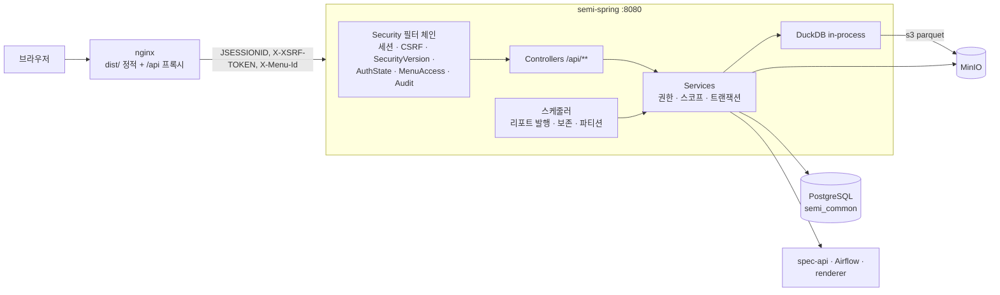
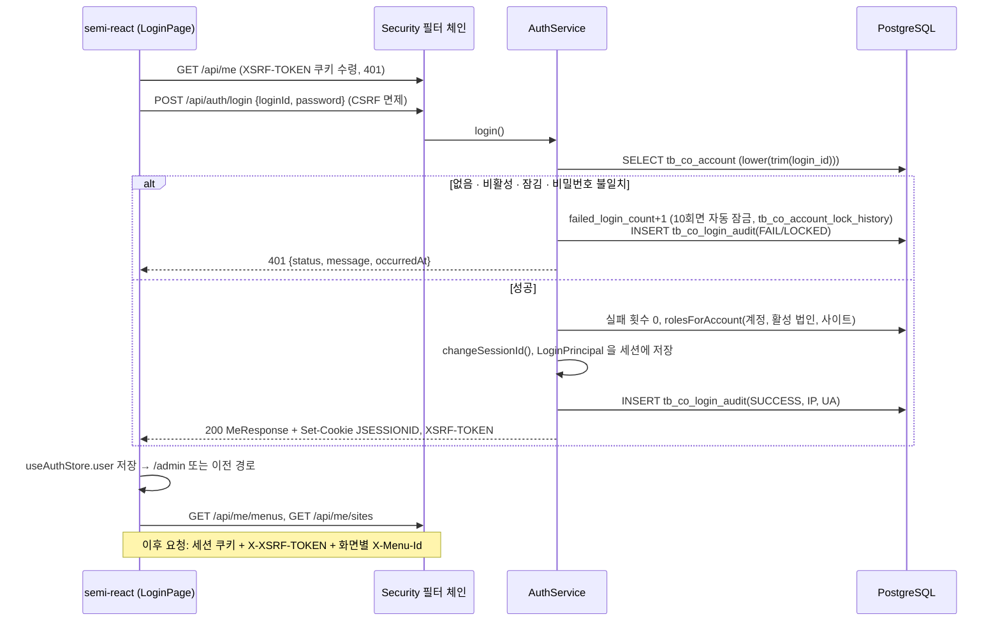

# SEMI — Semi Common System (PRISM) 구성 개요

반도체 설비(에칭·클린) 센서·알람·레시피·AI 모델 운영을 위한 **멀티 법인/사이트(멀티테넌트) 공통 시스템**이다. 법인·사이트·기준정보·계정·역할·메뉴·feature 권한 같은 공통 기능 위에 트레이스 분석, 대시보드, FDC/DCOP, 데일리 리포트, 모델 설정 화면을 얹는다.

| 문서 | 내용 |
|---|---|
| [frontend.md](./frontend.md) | React SPA(`semi-react`) — FSD 구조, 세션+CSRF, 메뉴 트리·워크스페이스 탭(keep-alive), feature manifest, i18n, nginx 배포 |
| [backend.md](./backend.md) | Spring Boot 4(`semi-spring`) — Security 필터 체인, 계정·역할·메뉴·feature API, MinIO·DuckDB, 데일리 리포트, CI/CD |
| [database.md](./database.md) | PostgreSQL 스키마 `semi_common` — Flyway 마이그레이션, 시스템 테이블 DDL, 감사 트리거, 시드 |

기준: 백엔드·DB `dev@25ebde62` (2026-10-05), 프론트 `855af1b5` (2026-10-02). 작성일 2026-10-06. 두 리포 모두 작성 도중 pull 로 전진했다. 백엔드 문서는 `640ab2ba` 로 쓴 뒤 `25ebde62` 변경분을 반영했고, 프론트는 `f79a4be9`(10-05)와의 차이를 frontend.md §16.3 에 요약했다.

---

## 1. 한눈에 보는 구성

| 계층 | 기술 | 비고 |
|---|---|---|
| 프론트엔드 | React 18.3, TypeScript 5.8, Vite 5, React Router 6.30, Zustand 5, TanStack Query 5.80, Tailwind 3.4, ECharts 5, Tiptap 3, i18next 26(기본 `ko`), pnpm 9 | FSD(Feature-Sliced Design) + eslint-plugin-boundaries 로 레이어 경계 강제 |
| 백엔드 | Java 25, Spring Boot 4.0.6, Spring Security(세션), JPA(validate) + MyBatis 4 + JdbcClient, Flyway, MinIO SDK 9, DuckDB 1.3(임베디드), Caffeine, Apache FOP·POI, Actuator, springdoc 3 | Gradle 9.1 toolchain 25 |
| DB | PostgreSQL 17 기준, 스키마 `semi_common` | Flyway 타임스탬프 버전, `out-of-order` 허용 |
| 저장소 | MinIO/S3 — 트레이스 parquet(DuckDB httpfs 로 직접 질의), 리포트 산출물, VOC 첨부 | |
| 외부 | spec-api(모델 버전·Champion), Airflow REST(학습/추론 DAG), node-renderer(차트 PNG), 외부 렌더러, MariaDB(선택, 읽기 전용) | 미설정 시 해당 기능만 비활성 |
| 배포 | 프론트 `dist/` → nginx 정적 서빙 + 같은 출처 `/api` 리버스 프록시. 백엔드 fat jar → 컨테이너 재시작 | dev 브랜치 push = 검증 서버 자동 배포 |



---

## 2. 배포 환경

| 항목 | 프론트 | 백엔드 |
|---|---|---|
| 산출물 | `dist/`(단일 엔트리 번들) + CI 가 만드는 `feature-manifest.json` | `semi-spring-0.0.1-SNAPSHOT.jar`(fat jar) + 같은 리비전 `application.yml` |
| 실행 | nginx 컨테이너의 html 볼륨에 복사. 모르는 경로는 `index.html` 로(추정) | JDK 25 컨테이너가 볼륨의 `app.jar` 와 `/config/application.yml` 을 읽음 |
| CI (MR → dev) | `verify`: type-check · lint · test | `test`: `./gradlew test bootJar`(Testcontainers `postgres:17-alpine`) |
| CI (dev push) | `build_and_deploy`: 빌드 → manifest 생성 → 웹 루트 백업(tgz 10개) → 교체 → **`POST /api/features/sync`**(SU 로그인) | `build_jar` → jar·yml 원자 교체(백업 10개) → `restart`(docker restart, healthy 최대 200초 대기) |
| 헬스체크 | — | `GET /actuator/health`(공개) |
| 필수 env(백엔드) | — | `SPRING_DATASOURCE_*`, `APP_DB_SCHEMA`, `APP_SU_LOGIN_ID`, `APP_SU_INITIAL_PASSWORD`(SU 최초 생성 시), `MINIO_*`, `APP_DAILY_REPORT_MINIO_*` 등 — 값은 `<PLACEHOLDER>`, 목록은 backend.md §3 |
| 폐쇄망 배포 | `react.tar` → nginx html 볼륨 | 순서: DB 백업 → 서비스 정지 → jar 교체 → springboot 기동(Flyway 확인) → spec-api → airflow → 프론트 dist |
| 로컬 | `pnpm dev`(:3000, `/api` → `VITE_API_TARGET`) | `set -a; source .env; set +a; ./gradlew bootRun`(:8080). env 미주입 시 Boot 4 가 `${VAR}` 를 리터럴로 넘겨 형식 오류로 위장된다 |

---

## 3. 로그인 흐름 (프론트 ↔ 백엔드 ↔ DB)



| 항목 | 내용 |
|---|---|
| 인증 방식 | 서블릿 세션(JSESSIONID, 톰캣 메모리, 3시간 무통신 만료). JWT 없음. 브라우저 저장소에 토큰 0개 |
| CSRF | `CookieCsrfTokenRepository`(쿠키 `XSRF-TOKEN` → 헤더 `X-XSRF-TOKEN`). axios `withXSRFToken: true` |
| 비밀번호 | bcrypt. 계정 생성·초기화 시 초기 비밀번호 = 로그인 ID 이고 `password_change_required=TRUE` → 로그인해도 `CHANGE_PASSWORD_ONLY` 상태라 비밀번호 변경 API 만 허용. 새 비밀번호 8자 이상, ID 와 달라야 함 |
| 권한 즉시 반영 | 권한·비밀번호·메뉴가 바뀌면 `security_version` 또는 법인 `revision` 이 오르고, `SecurityVersionFilter` 가 다음 요청에서 세션 principal 을 재생성한다(재로그인 불필요). 계정이 잠기거나 삭제되면 세션 무효화 + 401 |
| 컨텍스트 | 로그인 계정은 GLOBAL(SU) · COMPANY · SITE. 활성 법인/사이트를 `PATCH /api/me/active-context` 로 전환하며, 역할은 컨텍스트마다 다시 계산된다. SU 는 관리자 콘솔용 의사 컨텍스트 `ADMIN/ADMIN` 으로 시작 |
| 최초 관리자 | `BootstrapSeed`(ApplicationRunner, 매 기동 멱등)가 ADMIN 컨텍스트, SU 역할, SU 계정(`APP_SU_LOGIN_ID`/`APP_SU_INITIAL_PASSWORD`), 기본 feature 10개를 만든다 |

---

## 4. 사용자(계정)·역할 관리 흐름

| 화면(프론트, 관리자 콘솔) | API (`/api/companies/{companyId}/...`) | 테이블 |
|---|---|---|
| 계정 관리: 목록·생성·수정·삭제(soft) | `GET/POST .../accounts`, `GET/PATCH/DELETE .../accounts/{accountId}` | `tb_co_account` |
| 비밀번호 초기화(로그인 ID 로, 강제 변경 ON) | `PATCH .../accounts/{accountId}/password-reset` | `tb_co_account` |
| 수동 잠금·해제 | `PATCH .../accounts/{accountId}/lock {reason}`, `PATCH .../unlock` | `tb_co_account`, `tb_co_account_lock_history` |
| 계정 ↔ 역할 지정(집합 교체) | `PUT .../accounts/{accountId}/roles {roleIds[]}` | `tb_co_account_role` |
| 계정 ↔ 사업부(데이터 범위) | `GET .../sites/{siteId}/account-business-divisions`, `PUT .../sites/{siteId}/accounts/{accountId}/business-divisions {divisionIds[]}` | `tb_co_account_business_division` |
| 역할 관리(USER/ADMIN, 법인 또는 사이트 단위) | `GET/POST .../roles`, `PATCH/DELETE .../roles/{roleId}` | `tb_co_role`(SU 는 전역 1개) |
| 역할별 메뉴 권한(`canView`·`canAccess`) | `GET/PUT .../roles/{roleId}/menu-permissions?siteId=` | `tb_co_role_menu_permission` |
| 감사 로그·로그인 이력 | `GET /api/admin/{audit-logs,login-logs}`(SU), `GET /api/companies/{c}/sites/{s}/{audit-logs,login-logs}`(사이트 ADMIN) | `tb_co_audit_log`(DB 트리거가 기록), `tb_co_login_audit` |
| 성능·에러 로그 | `GET /api/admin/performance-{logs,slowest,dashboard}`, `GET /api/admin/error-logs` | `tb_co_api_performance_log`, `tb_co_error_log`(월 파티션) |

권한 등급: `USER(1) < ADMIN(2) < SU(3)`. ADMIN 이상은 메뉴 권한 표를 우회하고, USER 만 `tb_co_role_menu_permission` 으로 판정한다. 사업부 권한은 "어느 데이터를 보나"를 정하며 화면 권한과 별개다. 정확한 경로·요청·응답은 backend.md §5.

---

## 5. 메뉴·feature 권한 흐름

```mermaid
flowchart TB
  subgraph FE[semi-react]
    MAN[featureManifest.ts<br/>화면 코드 · 기본 경로 · 필요 등급 · API 규칙]
    APP[AppShell 사이드바]
    REQ[API 요청 + X-Menu-Id]
  end
  subgraph CI[프론트 배포 잡]
    SYNC[feature-sync.sh<br/>POST /api/features/sync]
  end
  subgraph DB[(PostgreSQL)]
    FEAT[tb_co_feature]
    RULE[tb_co_feature_api_rule]
    MENU[tb_co_menu<br/>법인·사이트별 트리 FOLDER/MENU]
    PERM[tb_co_role_menu_permission]
  end
  MAN --> SYNC --> FEAT & RULE
  FEAT --> MENU
  MENU --> PERM
  MENU -->|GET /api/me/menus<br/>USER 는 canView 메뉴만| APP
  REQ --> MAF[MenuAccessFilter]
  RULE --> MAF
  PERM --> MAF
  MAF -->|규칙 불일치 · canAccess 없음| X[403]
```

- **두 겹의 권한**: ① 화면(메뉴)을 볼 수 있나(`canView`) / 들어갈 수 있나(`canAccess`) ② 그 화면이 이 API 를 불러도 되나(feature API 규칙, Ant 패턴). 서버는 요청의 `X-Menu-Id` 로 메뉴를 찾아 두 가지를 모두 검사한다.
- 관리자 콘솔(ADMIN/ADMIN)의 사이드바는 프론트 정적 목록(`STATIC_NAV_ITEMS`)이 정본이고, 법인·사이트 화면은 DB 메뉴 트리가 정본이다.
- 메뉴 라벨은 DB `menuName`/`menuNameEn` 우선, 비어 있으면 i18n 폴백.
- **새 화면 추가 절차**: ① 프론트 화면 구현 + 라우트 등록 ② `featureManifest.ts` 에 feature 코드·경로·API 규칙 추가 ③ dev 머지 → CI 가 feature 동기화 ④ 관리자 콘솔 메뉴 관리에서 해당 사이트에 MENU 노드 생성(feature 선택, URL) ⑤ 역할별 메뉴 권한 부여. 동기화를 빠뜨리면 새 API 가 "Menu access is denied." 403 으로 막힌다.

---

## 6. 재구현 순서 (요약)

1. DB: [database.md](./database.md) — 스키마 생성 권한, Flyway 마이그레이션 순서, 감사 트리거, 파티션 유지 프로시저.
2. 백엔드: [backend.md](./backend.md) §3 env → §4 Security 필터 체인·세션·CSRF·BootstrapSeed → §5 계정·역할 → §6 메뉴·feature 동기화·`MenuAccessFilter` → §7 도메인(트레이스·리포트 등).
3. 프론트: [frontend.md](./frontend.md) §6 인증(세션·CSRF·강제 비밀번호 변경) → §8 메뉴·feature manifest → §5·§11 워크스페이스 탭 keep-alive → §12 i18n.
4. 배포: nginx(정적 + `/api` 프록시, 같은 출처) + 백엔드 컨테이너, 프론트 배포 직후 feature 동기화.
