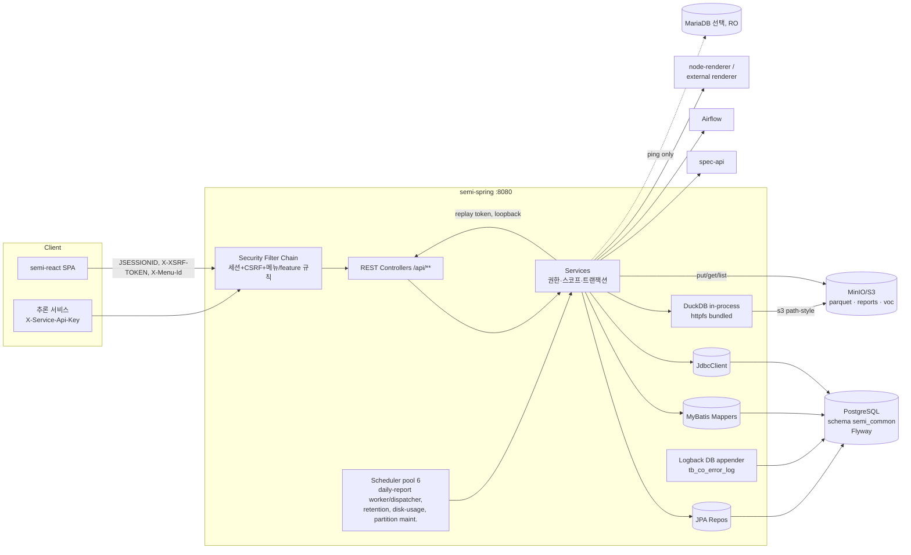
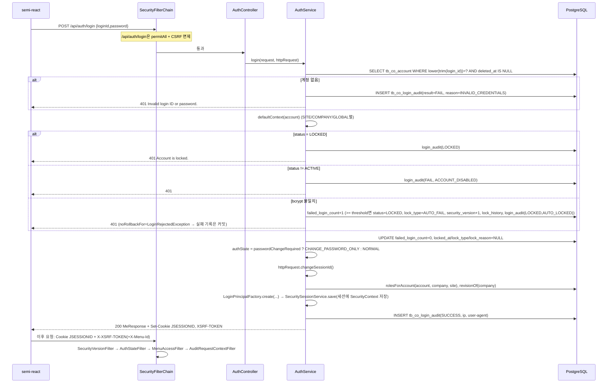

# Semi Common System — 백엔드(semi-spring) 기술 명세

| 항목 | 값 |
|---|---|
| 대상 리포 | `semi-spring` (GitLab `<GITLAB_HOST>/<GROUP>/semi-spring`, 기본 패키지 `com.dutchboy.semi`) |
| 기준 브랜치 / 커밋 | `dev` / `25ebde62c23585d5cc679b0da4b44ba21e7db8f0` (2026-10-05 13:38 UTC, "Merge branch 'feature/RSDSEP-35-step-error-wafer' into 'dev'") |
| 작성 경위 | `640ab2ba`(2026-10-02) 기준으로 작성 후 `25ebde62` 변경분 반영 |
| 작성일 | 2026-10-06 |
| 짝 문서 | 프론트엔드 `frontend.md`(semi-react, 별도 작성), DB `database.md` |
| 보안 주의 | 본 문서는 공개 저장소 게시를 전제로 **모든 비밀값·사내 호스트·고객 코드를 플레이스홀더로 치환**했다. 리포의 `.env`는 git에 추적 중이며 실제 자격증명이 들어 있으므로(2026-10-01 재확인) 값을 절대 복사하지 않는다. |

## 목차

1. [시스템 개요](#1-시스템-개요)
2. [디렉터리/패키지 구조](#2-디렉터리패키지-구조)
3. [설정](#3-설정)
4. [인증/로그인](#4-인증로그인)
5. [사용자 관리](#5-사용자-관리)
6. [메뉴/권한 관리](#6-메뉴권한-관리)
7. [그 외 도메인 모듈](#7-그-외-도메인-모듈)
8. [공통 인프라](#8-공통-인프라)
9. [빌드/배포](#9-빌드배포)
10. [재구현 체크리스트](#10-재구현-체크리스트)

표기 규칙: 근거 경로는 리포 루트 기준 `(src/main/java/...)`. 코드에서 확인하지 못한 서술은 **(추정)** 으로 표시한다.

---

## 1. 시스템 개요

### 1.1 역할

반도체 설비(에칭/클린) 센서·알람·레시피·모델 운영을 위한 **다중 법인/사이트(멀티테넌트) 공통 백엔드**다. 하나의 Spring Boot 프로세스가 아래를 모두 담당한다.

- **공통 시스템**: 법인(company)·사이트(site)·사업부(business division)·기준정보(공정/라인/설비군/설비/챔버), 계정·역할·feature·메뉴 권한, 세션 인증, 감사 로그, 성능 로그, 에러 로그, 디스크 사용량 모니터링 (`controller/{company,site,businessdivision,masterdata,account,role,feature,menu,audit,performance,errorlog,diskusage}`)
- **센서/트레이스 분석**: 웨이퍼 마스터(`tb_semi_data_m`)·추론 결과·알람 로그를 조회하고, MinIO의 parquet 파형을 DuckDB로 읽어 차트 데이터로 변환 (`controller/{trace,fdc,datachart,alarm,alarmevent,chamber,overview}`)
- **모델 운영**: 모델 설정(MODEL_CFG)·모델 버전/Champion 승격(spec-api 경유)·학습/추론 DAG 트리거(Airflow)·외부 모델 레지스트리 (`controller/{modelcfg,modelregistry}`)
- **리포팅**: Daily Report 템플릿 편집·예약 발행·워커 렌더링(PDF/DOCX)·MinIO 보관·사이트 소스(뷰) 재생, 진단 분석 리포트 (`controller/{dailyreport,report,diagnosisreport}`)
- **운영 보조**: VOC(문의·댓글·이미지 첨부·담당자 관리·사이트별 사용 안내), QA 체크리스트, FTP/S3 수집 대상 등록과 수집 원본 미러 탐색·다운로드, Parquet 뷰어, 담당 그룹(개인별 선택지 묶음), 메뉴별 도움말 자료, 화면 이름 사전, 엑셀 데이터 적재, 가상데이터 시프트, 테스트 데이터 정리 도구(SU 전용) (`controller/{voc,qa,collector,mirror,parquetviewer,filtergroup,menu,auth,dataload,virtualdata,recipe}`)

### 1.2 연동 시스템

| 시스템 | 용도 | 접속 설정 | 근거 |
|---|---|---|---|
| PostgreSQL 17(테스트 기준) | 주 저장소. 스키마 `semi_common`(기본), Flyway 마이그레이션, JPA(`ddl-auto: validate`)+MyBatis+JdbcClient | `SPRING_DATASOURCE_*`, `APP_DB_SCHEMA` | `application.yml`, `src/test/java/com/dutchboy/semi/support/SharedPostgres.java` |
| MariaDB(선택, 조회 전용) | `APP_MARIADB_ENABLED=true`일 때만 별도 MyBatis 세션(READ ONLY 강제, SELECT 외 차단). 현재 `ping()`만 존재 | `MARIADB_DATASOURCE_*` | `common/config/MariaDbMyBatisConfig.java`, `MariaDbReadOnlyInterceptor.java` |
| MinIO/S3 | (a) 트레이스/FDC parquet 읽기(DuckDB httpfs, `s3://{bucket}/{schema}/...`)·Parquet 뷰어, (b) Daily Report 산출물/에셋, (c) VOC 첨부·사용 안내 이미지, (d) 메뉴 도움말 자료(PDF·영상) | `MINIO_*`, `APP_DAILY_REPORT_MINIO_*`, `APP_VIOLIN_MINIO_*` | `common/storage/ParquetSession.java`, `service/dailyreport/MinioDailyReportStorage.java`, `common/config/DailyReportRuntimeConfig.java` |
| DuckDB(임베디드 JDBC 1.3.1) | parquet 질의. `httpfs` 확장은 classpath에 번들(linux_amd64/osx_arm64)하여 폐쇄망에서 `LOAD`만 수행 | `APP_DUCKDB_EXTENSION_DIR` | `service/trace/DuckDbExtensionLoader.java`, `src/main/resources/duckdb/extensions/` |
| spec-api(내부 모델 서비스) | 모델 버전 조회·Champion 승격. 브라우저가 직접 부르지 않고 이 서버가 경유해 인증·스코프·감사를 건다 | `APP_SPEC_API_BASE_URL`, `APP_SPEC_API_TIMEOUT_SECONDS`, `APP_SPEC_API_QUERY_TIMEOUT_SECONDS` | `common/client/SpecApiClient.java`, `common/config/AppProperties.java` |
| Airflow REST | 학습/추론 DAG 트리거·상태 조회. 사업부별 base URL 매핑 가능 | `APP_AIRFLOW_*` | `common/client/AirflowClient.java` |
| node-renderer(차트 PNG) | Daily Report 차트 렌더링(필수 의존; 비우면 차트 포함 문서 발행 실패) | `APP_DAILY_REPORT_CHART_RENDERER_BASE_URL` | `common/client/DailyReportChartRendererClient.java` |
| reporting 외부 렌더러 | EXTERNAL 템플릿 문서 생성 | `APP_DAILY_REPORT_EXTERNAL_RENDERER_BASE_URL` | `common/client/DailyReportExternalReportClient.java` |
| 외부 모델 API | 모델 레지스트리의 EXTERNAL 모델 추론 호출(계약 카탈로그 기반) | DB `tb_semi_model_m.api_base_url` | `common/client/ExternalModelClient.java`, `ModelApiAuth.java` |
| 기계 호출자(추론 서비스) | `/api/internal/wafer-stats/{dataMId}` — 세션 대신 헤더 키 인증 | `APP_SERVICE_API_KEY` | `common/filter/ServiceApiKeyFilter.java` |
| 수집 원본 미러 | 수집 파이프라인이 내려받은 원본 파일 트리 탐색·다운로드. root마다 로컬 읽기 전용 마운트 또는 다른 노드의 읽기 전용 FTP(commons-net) | `mirror.roots.<key>`(env `MIRROR_ROOTS_<KEY>`) | `common/config/MirrorProperties.java`, `service/mirror/{LocalMirrorSession,FtpMirrorSession}.java` |

### 1.3 전체 구성



### 1.4 기술 스택

| 구분 | 값 | 근거 |
|---|---|---|
| 언어 | Java 25 (`options.release = 25`, toolchain 25) | `build.gradle.kts` |
| 프레임워크 | Spring Boot **4.0.6** (`org.springframework.boot` 플러그인), `io.spring.dependency-management` 1.1.7 | `build.gradle.kts` |
| 빌드 | Gradle Wrapper **9.1.0**, `org.gradle.toolchains.foojay-resolver-convention` 1.0.0, `org.gradle.jvmargs=-Xmx2g` | `gradle/wrapper/gradle-wrapper.properties`, `settings.gradle.kts`, `gradle.properties` |
| 웹/직렬화 | `spring-boot-starter-webmvc`, `spring-boot-starter-json`(Jackson), `spring-boot-starter-validation` | `build.gradle.kts` |
| 보안 | `spring-boot-starter-security` — 서블릿 세션 + 쿠키 CSRF | `common/config/SecurityConfig.java` |
| 영속성 | `spring-boot-starter-data-jpa`(Hibernate, validate), `mybatis-spring-boot-starter` 4.0.0, `JdbcClient`(공통 시스템 테이블 대부분이 순수 SQL) | `build.gradle.kts`, `repository/common/CommonJdbcRepository.java` |
| 마이그레이션 | `spring-boot-starter-flyway` + `flyway-database-postgresql` (버전은 Boot BOM 관리) | `build.gradle.kts` |
| DB 드라이버 | `org.postgresql:postgresql`, `org.mariadb.jdbc:mariadb-java-client`(runtime) | `build.gradle.kts` |
| 객체 저장소 | `io.minio:minio` 9.0.1 | `build.gradle.kts` |
| 분석 | `org.duckdb:duckdb_jdbc` 1.3.1.0 | `build.gradle.kts` |
| 캐시 | `com.github.ben-manes.caffeine:caffeine` 3.2.0 (Spring Cache 미사용, 직접 인스턴스) | `common/filter/MenuAccessFilter.java` 등 |
| FTP 클라이언트 | `commons-net:commons-net` 3.11.1 (원격 노드 미러 읽기 전용 FTP), 테스트 `org.mockftpserver:MockFtpServer` 3.2.0 | `build.gradle.kts` |
| 문서/파일 | `org.apache.poi:poi-ooxml` 5.5.1(엑셀 적재), `org.apache.xmlgraphics:fop` 2.11(PDF), 번들 폰트 NotoSansCJKkr(OFL) | `build.gradle.kts`, `src/main/resources/fonts/` |
| AOP | `spring-aop`, `aspectjweaver`(감사 컨텍스트 Aspect) | `common/audit/AuditTransactionContextAspect.java` |
| 모니터링 | `spring-boot-starter-actuator`(`health,info,metrics`), Micrometer 카운터/타이머 | `application.yml` |
| API 문서 | `springdoc-openapi-starter-webmvc-ui` 3.0.3 (`/swagger-ui.html`, `/v3/api-docs`) | `common/config/OpenApiConfig.java` |
| 테스트 | `spring-boot-starter-test`, `spring-security-test`, Testcontainers BOM 2.0.5(`postgres:17-alpine` 단일 공유 컨테이너), `pdfbox` 3.0.3 | `build.gradle.kts`, `src/test/.../support/SharedPostgres.java` |

---

## 2. 디렉터리/패키지 구조

### 2.1 트리

```
semi-spring/
├── AGENTS.md / CLAUDE.md          # 작업 규칙(CLAUDE.md는 @AGENTS.md import 한 줄)
├── README.md                       # 일부 구식(README의 "V2__seed_system_admin.java"는 존재하지 않음 → BootstrapSeed가 대체)
├── build.gradle.kts / settings.gradle.kts / gradle.properties
├── .env (git 추적, 실값 포함 — 복사 금지) / .env.example (키만 참고)
├── .gitlab-ci.yml                  # MR 테스트 + dev 머지 시 jar 교체/컨테이너 재시작
├── docs/
│   ├── offline-build.md            # 폐쇄망 빌드(GRADLE_USER_HOME 반입, DuckDB 확장 번들)
│   ├── model-cfg-feature-map.md    # MODEL_CFG/MODEL_MANAGE 기능-API-쿼리 표
│   └── deploy/                     # 폐쇄망 배포 절차·점검 SQL
├── tools/
│   ├── check_migration_drift.py    # flyway_schema_history 체크섬/고아 버전 대조
│   └── seed/*.sql                  # 데모/현장 시드(설정 C, paramatcher, 레시피, 설비군 등)
└── src/
    ├── main/java/com/dutchboy/semi/
    │   ├── CommonSystemApplication.java
    │   ├── common/                  # 횡단 관심사
    │   │   ├── audit/               # 감사 컨텍스트(ThreadLocal → set_config → DB 트리거)
    │   │   ├── client/              # spec-api, Airflow, 렌더러, 외부 모델 HTTP 클라이언트
    │   │   ├── config/              # Security, Jackson, MyBatis, OpenAPI, *Properties, MariaDB
    │   │   ├── domain/              # 공통 enum(AccountType, RoleLevel, AuthState, ...)
    │   │   ├── exception/           # ApiException, DailyReportException, ReportException, GlobalExceptionHandler
    │   │   ├── filter/              # 보안 필터 7종
    │   │   ├── image/               # ImageNormalizer(재인코딩 방어)
    │   │   ├── logging/             # Logback DB appender(에러 로그 수집)
    │   │   ├── mybatis/             # @MariaDbMapper
    │   │   ├── response/            # ApiErrorResponse
    │   │   ├── security/            # LoginPrincipal, AccessControlService, 스코프 리졸버, 재생 principal
    │   │   ├── seed/BootstrapSeed.java   # ApplicationRunner: ADMIN 법인/사이트, SU 역할/계정, 기본 feature
    │   │   └── storage/             # ObjectStorage 포트, ParquetSession(DuckDB), StorageSchemas
    │   ├── controller/<domain>/     # 66개 컨트롤러 클래스, 요청/응답 매핑 + validation만
    │   ├── service/<domain>/        # 비즈니스 흐름, 권한 검증, @Transactional 경계
    │   ├── repository/<domain>/     # JPA Repository(일부) + <domain>/mapper/*Mapper.java(MyBatis)
    │   ├── domain/<domain>/         # JPA 엔티티·도메인 타입(17개 @Entity)
    │   ├── dto/<domain>/            # 요청/응답 record
    │   └── mariadb/health/mapper/   # MariaDB 전용 mapper(@MariaDbMapper)
    ├── main/resources/
    │   ├── application.yml          # 단일 프로파일, 전부 ${ENV:default}
    │   ├── db/migration/            # Flyway V1~V30 + V<yyyyMMddHHmm>__*.sql + R__*.sql (README.md 포함)
    │   ├── mapper/<domain>/*.xml    # MyBatis XML (mapper/mariadb/** 는 별도 팩토리)
    │   ├── duckdb/extensions/v1.3.1/{linux_amd64,osx_arm64}/httpfs.duckdb_extension.gz
    │   └── fonts/                   # NotoSansCJKkr Regular/Bold + OFL.txt
    └── test/java/com/dutchboy/semi/ # 224개 *Test(그중 43개 *IntegrationTest), support/SharedPostgres
```

### 2.2 패키지 책임과 레이어링 규칙

| 레이어 | 책임 | 금지 | 근거 |
|---|---|---|---|
| `controller` | `@RestController` + `@Validated`, 경로/본문 매핑, `@Tag/@Operation/@ApiResponses` Swagger 주석 | 비즈니스 판단, `@Transactional` | `AGENTS.md` 2부 "코드 구조", `.claude/skills/new-endpoint/SKILL.md` |
| `service` | 권한 게이트(`AccessControlService`, `*ScopeResolver`), 비즈니스 규칙, `@Transactional`(JPA/MyBatis/JdbcClient 혼용 시에도 여기) | — | `AGENTS.md` |
| `repository` | JPA Repository(엔티티 CRUD) / `mapper`(복합 SQL) / `*JdbcRepository`(JdbcClient) | 비즈니스 판단 | `AGENTS.md` "JPA와 MyBatis 사용 기준" |
| `domain` | `@Entity`, 도메인 enum/값 객체, 파서(dataload) | — | |
| `dto` | 요청/응답 전용 `record`, `@Schema` | 엔티티 노출 | |
| `common` | 횡단 관심사. 도메인 코드가 `common`에 의존하되 역방향 금지 | — | |

- **JPA vs MyBatis 선택 기준**: 단순 CRUD/엔티티 생명주기는 JPA, 다중 테이블 집계·동적 조건·권한 OR 계산·통계·대량 조회는 MyBatis. 공통 시스템 테이블(계정/역할/메뉴/법인 등)은 `CommonJdbcRepository`의 `JdbcClient` 문자열 SQL로 직접 다룬다(JPA 엔티티 없음) (`repository/common/CommonJdbcRepository.java`).
- **MyBatis 위치 규칙**: 인터페이스 `com.dutchboy.semi.repository.<domain>.mapper`, XML `classpath:mapper/<domain>/*.xml`(`mybatis.mapper-locations: classpath:mapper/*/*.xml`, 한 단계 디렉터리만 스캔). MariaDB용은 `com.dutchboy.semi.mariadb.**` + `mapper/mariadb/**`에 두고 `@MariaDbMapper`를 붙인다 (`application.yml`, `MariaDbMyBatisConfig.java`).
- **스키마 참조**: MyBatis XML은 `${dbSchema}.tb_...`로 스키마를 변수화하며, `MyBatisConfig`가 `app.db-schema`를 소문자 식별자 정규식으로 검증해 주입한다. Hikari `connection-init-sql: SET search_path TO ${APP_DB_SCHEMA}`도 함께 적용된다 (`common/config/MyBatisConfig.java`, `application.yml`).

### 2.3 네이밍 규칙

- Java: 패키지 소문자, 클래스 PascalCase, 상수 UPPER_SNAKE, boolean `is/has/can/should`, Config는 `XxxConfig`/`XxxProperties`, `I` 접두 인터페이스 금지 (`AGENTS.md` 1부 §8).
- 코드 스타일: 제어 키워드 뒤 공백 없음(`if(x)`), 주석 괄호 `텍스트( 내용 )`, 탭 4칸(yaml/json/md는 space 2) (`AGENTS.md` §9).
- 테이블: 공통 `tb_co_*`, 센서 도메인 `tb_semi_*`, 뷰 `vw_co_*`/`v_co_*`, 제약 `pk_/fk_/uq_/chk_/ix_` 접두 (database.md 참조).
- 커밋: `<type>(<scope>): <JIRA-KEY> <subject>` (`.gitmessage.txt`).

### 2.4 모듈 경계(한 프로세스 안의 논리 경계)

| 경계 | 포함 | 외부 의존 |
|---|---|---|
| 공통 시스템 | company/site/businessdivision/masterdata/account/role/feature/menu/auth/audit/performance/errorlog/diskusage/storage-mng | PG만 |
| 센서 분석 | trace/fdc/datachart/alarm/alarmevent/chamber/overview/sensor/recipe/configc/etchconfig/paramatcher/waferstats | PG + MinIO(DuckDB) |
| 모델 운영 | modelcfg/modelregistry | PG + spec-api + Airflow + 외부 모델 API |
| 리포팅 | dailyreport/report(view/replay/output/access)/diagnosisreport | PG + MinIO + 렌더러 + **자기 자신(재생 토큰 loopback 호출)** |
| 운영 보조 | voc/qa/collector/mirror/parquetviewer/filtergroup/menu 도움말/dataload/virtualdata | PG + MinIO(voc·도움말·parquet 뷰어) + 로컬 마운트/원격 FTP(미러) |

---

## 3. 설정

### 3.1 application.yml 구조

단일 파일, 프로파일 분기 없음(`src/main/resources/application.yml`). 모든 환경 의존 값은 `${ENV_NAME:default}` 플레이스홀더다. 최상위 키:

| 키 | 내용 |
|---|---|
| `spring.application.name` | `semi-common-system` |
| `spring.datasource` | PG URL/계정, Hikari `connection-init-sql: SET search_path TO ${APP_DB_SCHEMA:semi_common}` |
| `spring.flyway` | `locations: classpath:db/migration`, `schemas`/`default-schema`=`${APP_DB_SCHEMA}`, `create-schemas: true`, **`out-of-order: true`**, `ignore-migration-patterns: "*:missing,*:future"`, `postgresql.transactional-lock: false`(CONCURRENTLY 인덱스용) |
| `spring.jpa` | `open-in-view: false`, `hibernate.ddl-auto: validate`, `default_schema`, `format_sql: true` |
| `spring.jackson` | `default-property-inclusion: always` (null 키도 직렬화 — 2026-09-29 결정; NON_NULL은 DTO 단위로만) |
| `spring.task.scheduling.pool.size` | `${SCHEDULING_POOL_SIZE:6}` (키 철자 `pool.size` 주의, `pool-size`는 바인딩 안 됨) |
| `spring.servlet.multipart` | `max-file-size: 100MB`, `max-request-size: 110MB` (메뉴 도움말 영상 상한 `MenuHelpAttachmentService.MAX_BYTES`와 함께 바꾼다. 앞단 nginx `client_max_body_size`도 이 이상이어야 함) |
| `mybatis` | `mapper-locations: classpath:mapper/*/*.xml`, `map-underscore-to-camel-case`, `default-fetch-size: 100`, `default-statement-timeout: 30`, `jdbc-type-for-null: NULL` |
| `springdoc` | `/v3/api-docs`, `/swagger-ui.html`, method/alpha 정렬 |
| `server` | `port: ${SPRING_SERVER_PORT:8080}`, gzip(`application/json`, ≥8KB), 세션 `timeout: ${SERVER_SERVLET_SESSION_TIMEOUT:3h}`, 쿠키 `http-only: true`, `same-site: strict`, `secure: ${SERVER_SERVLET_SESSION_COOKIE_SECURE:false}` |
| `app.*` | 앱 고유 설정(아래 환경변수 표) — `AppProperties`(`app`), `DailyReportProperties`(`app.daily-report`), `ReportProperties`(`app.report`), `MinioStorageProperties`(`app.storage.minio`), `FdcProperties`(`app.fdc`), `DuckDbExtensionProperties`(`app.duckdb.extension`)에 바인딩 |
| `management.endpoints.web.exposure.include` | `health,info,metrics` |
| `logging.level` | daily-report 패키지/MinIO 로그 레벨만 env로 조정 |
| `mirror` | `roots`(키→경로/FTP URL 맵, 기본 비어 있음=기능 꺼짐), `in-progress-seconds`(120), `max-download-bytes`(10GB), `max-download-files`(20000), `ftp-timeout-seconds`(30) — yml에는 주석 예시만 있고 값은 env로 준다 |
| `disk-usage` | `scheduler.enabled`, `node-name`; `targets[]`는 환경변수 인덱스 바인딩 전용 |

### 3.2 환경변수 전체 목록

필수(기본값 없음, 미주입 시 기동 실패)는 **굵게**. 값은 전부 `<PLACEHOLDER>`.

**DB / 스키마 / 서버**

| 변수 | 용도 | 필수 | 예시 |
|---|---|---|---|
| **`SPRING_DATASOURCE_URL`** | PG JDBC URL | 필수 | `jdbc:postgresql://<DB_HOST>:5432/<DB_NAME>` |
| **`SPRING_DATASOURCE_USERNAME`** / **`SPRING_DATASOURCE_PASSWORD`** | PG 계정(스키마 생성 권한 필요) | 필수 | `<DB_USER>` / `<DB_PASSWORD>` |
| `APP_DB_SCHEMA` | 스키마명(search_path, Flyway, Hibernate, MyBatis `${dbSchema}`) | 선택(기본 `semi_common`) | `semi_common` |
| `SPRING_SERVER_PORT` | HTTP 포트 | 선택(8080) | `8080` |
| `SERVER_SERVLET_SESSION_TIMEOUT` | 세션 무통신 만료(프론트 `SESSION_IDLE_TIMEOUT_MS`와 동기) | 선택(3h) | `3h` |
| `SERVER_SERVLET_SESSION_COOKIE_SECURE` | 쿠키 Secure 플래그(HTTPS면 true) | 선택(false) | `true` |
| `SCHEDULING_POOL_SIZE` | `@Scheduled` 스레드 수 | 선택(6) | `6` |

**보안 / 부트스트랩**

| 변수 | 용도 | 필수 | 예시 |
|---|---|---|---|
| **`APP_SU_INITIAL_PASSWORD`** | SU 계정 최초 생성 시 비밀번호(`System.getenv` 직접 읽음, 시드 시점에만 사용) | SU 행이 없는 DB에서 필수 | `<SU_INITIAL_PASSWORD>` |
| `APP_SU_LOGIN_ID` | SU 로그인 ID(소문자 정규화) | 선택(코드 상수 기본값) | `<SU_LOGIN_ID>` |
| `APP_LOGIN_FAIL_LOCK_THRESHOLD` | 비밀번호 실패 N회 시 자동 잠금 | 선택(10) | `10` |
| `APP_SECURITY_CORS_ALLOWED_ORIGINS` | CORS 허용 origin(쉼표) | 선택(`http://localhost:3000,http://localhost:5173`) | `https://<FRONT_HOST>` |
| `APP_SERVICE_API_KEY` | `/api/internal/**` 기계 호출 키. 비우면 해당 경로 404 | 선택 | `<SERVICE_API_KEY>` |
| `APP_REPORT_REPLAY_SECRET` | 재생 토큰 HMAC 키(32바이트 이상). 비우면 프로세스마다 난수(단일 인스턴스 전용) | 다중 인스턴스면 필수 | `<32+_BYTE_SECRET>` |
| `APP_REPORT_REPLAY_TTL` / `_BASE_URL` / `_CONNECT_TIMEOUT` / `_READ_TIMEOUT` / `_PREVIEW_READ_TIMEOUT` / `_DOCUMENT_MAX_ROWS` / `_EXPORT_MAX_ROWS` / `_EXPORT_MAX_PERIOD_DAYS` / `_DOCUMENT_MAX_PERIOD_DAYS` / `_PREVIEW_ROWS` | 재생 토큰/뷰 재생 한도 | 선택(300s / `http://127.0.0.1:${server.port}` / 3s / 60s / 15s / 5000 / 100000 / 92 / 366 / 50) | |
| ~~`APP_TEST_TOOLS_HOSTS` / `APP_TEST_TOOLS_FORCE`~~ | **삭제됨**(`app.test-tools.*`). 테스트 데이터 정리 도구(레시피 표시명·LOT 10자 단축)는 주소 판정 없이 **SU에게만** 열린다(`RecipeTestToolService`) | — | — |
| `APP_VIRTUAL_DATA_REMARK_TAG` | 가상데이터 식별 태그(`tb_semi_data_m.remark`) | 선택 | `<TAG>` |

**MariaDB(선택)**

| 변수 | 용도 | 필수 |
|---|---|---|
| `APP_MARIADB_ENABLED` | true면 아래 3개 필수, URL은 `jdbc:mariadb:`로 시작·`allowMultiQueries/allowLocalInfile` 옵션 금지 | 선택(false) |
| `MARIADB_DATASOURCE_URL` / `_USERNAME` / `_PASSWORD` | 조회 전용 연결(세션 `SET SESSION TRANSACTION READ ONLY`) | 활성 시 필수 |

**객체 저장소 / 분석**

| 변수 | 용도 | 필수 | 예시 |
|---|---|---|---|
| **`MINIO_ENDPOINT`** | MinIO 주소(스킴 생략 가능, DuckDB에는 스킴 제거해 전달) | 필수 | `<MINIO_ENDPOINT>:9000` |
| **`MINIO_ACCESS_KEY`** / **`MINIO_SECRET_KEY`** | 자격증명(`$`,`#` 포함 시 작은따옴표) | 필수 | `<MINIO_ACCESS_KEY>` |
| **`MINIO_BUCKET`** / **`MINIO_SCHEMA`** | parquet 버킷 / 버킷 내 최상위 prefix | 필수 | `<BUCKET>` / `<SCHEMA>` |
| `MINIO_USE_SSL` | TLS | 선택(false) | |
| `APP_VIOLIN_MINIO_BUCKET` / `_ENDPOINT` / `_ACCESS_KEY` / `_SECRET_KEY` | 학습 분포(바이올린) parquet가 있는 MLflow 아티팩트 버킷. endpoint 비우면 위 MinIO 재사용 | 선택(`mlflow-artifacts`) | |
| `APP_FDC_MAX_FILES` / `APP_FDC_READ_CONCURRENCY` | FDC 파형 한 번에 읽는 parquet 수 상한 / 동시 DuckDB 연결 수 | 선택(300 / 8) | |
| `APP_FDC_JOB_CONCURRENCY` / `APP_FDC_JOB_PER_USER` / `APP_FDC_JOB_RESULT_TTL` | FDC 백그라운드 파형 조회: 서버 전체 동시 실행 수 / 계정당 동시 조회 수(초과 429) / 끝난 결과 보관 시간. 정리 주기 `app.fdc.job-purge-interval-ms` | 선택(2 / 2 / 10m / 60000) | |
| `APP_PARQUET_VIEWER_MAX_FILES` / `_CSV_MAX_ROWS` / `_MAX_CONCURRENT` / `_QUERY_TIMEOUT` / `_EXPORT_TIMEOUT` / `_BROWSE_MAX_ENTRIES` | Parquet 뷰어: 요청당 파일 수(초과 400) / CSV 행 상한 / 서버 전체 동시 DuckDB 조회(초과 429) / 미리보기·SQL 시간 / CSV 시간 / 폴더 탐색 항목 수 | 선택(50 / 1000000 / 3 / 60s / 10m / 1000) | |
| `MIRROR_ROOTS_<KEY>` (+ `MIRROR_IN_PROGRESS_SECONDS`, `MIRROR_MAX_DOWNLOAD_BYTES`, `MIRROR_MAX_DOWNLOAD_FILES`, `MIRROR_FTP_TIMEOUT_SECONDS`) | 수집 원본 미러 root(키는 소문자로 바인딩, 값은 로컬 경로 또는 `ftp://<USER>:<PASSWORD>@<HOST>:<PORT>/<PATH>`, 특수문자 URL 인코딩). 비우면 기능 꺼짐 | 선택 | `MIRROR_ROOTS_ETCH=/mirror/etch` |
| `APP_DUCKDB_EXTENSION_DIR` | 번들 확장을 풀 디렉터리(비우면 `${java.io.tmpdir}/semi-common-system/duckdb/extensions`) | 선택 | `/opt/semi/duckdb/extensions` |

**Daily Report**

| 변수 | 용도 | 필수 |
|---|---|---|
| **`APP_DAILY_REPORT_MINIO_BUCKET`** / **`APP_DAILY_REPORT_MINIO_SCHEMA`** | 리포트 산출물·에셋·VOC 첨부 버킷/prefix(버킷은 자동 생성하지 않음) | 필수 |
| `APP_DAILY_REPORT_TEMP_RETENTION` / `_OUTPUT_RETENTION` / `_SNAPSHOT_RETENTION` | 보존 기간 | 선택(24h / 30d / 90d) |
| `APP_DAILY_REPORT_SCHEDULER_ENABLED` / `_SCHEDULER_CATCH_UP_WINDOW` | 예약 발행 디스패처(인스턴스 1개만 true) | 선택(false / 24h) |
| `APP_DAILY_REPORT_WORKER_ENABLED` / `_CONCURRENCY` / `_LEASE_DURATION` / `_HEARTBEAT_INTERVAL` / `_MAX_ATTEMPTS` / `_QUEUED_TIMEOUT` / `_VERSION` | 발행 워커 | 선택(true / 2 / 10m / 1m / 3 / 2h / "") |
| `APP_DAILY_REPORT_WORKER_POLL_DELAY_MS` / `_RECOVERY_DELAY_MS` / `_QUEUED_SWEEP_DELAY_MS` / `APP_DAILY_REPORT_METRICS_DELAY_MS` | `@Scheduled` 주기(코드 `@Value`) | 선택(1000 / 60000 / 3600000 / 15000) |
| `APP_DAILY_REPORT_DATA_QUERY_TIMEOUT` | 데이터소스 조회 타임아웃 | 선택(10s) |
| `APP_DAILY_REPORT_CHART_RENDERER_BASE_URL` / `_TIMEOUT_SECONDS` | 차트 PNG 렌더러 | 차트 발행 시 필수 / 10 |
| `APP_DAILY_REPORT_EXTERNAL_RENDERER_BASE_URL` / `_TIMEOUT_SECONDS` / `_MAX_WINDOW_MINUTES` | EXTERNAL 템플릿 렌더러 | 선택(`http://<RENDERER_HOST>:8010` / 120 / 1440) |
| `APP_DAILY_REPORT_FONT_{REGULAR,BOLD,ITALIC,BOLD_ITALIC}` + `_SHA256` | 폰트 경로/무결성 해시(기본 classpath 번들) | 선택 |
| `APP_DAILY_REPORT_LOG_LEVEL` / `_SQL_LOG_LEVEL` / `_MINIO_LOG_LEVEL` | 로그 레벨 | 선택(INFO / OFF / INFO) |

**모델 운영**

| 변수 | 용도 | 기본 |
|---|---|---|
| `APP_SPEC_API_BASE_URL` / `_TIMEOUT_SECONDS` / `_QUERY_TIMEOUT_SECONDS` | spec-api(비우면 모델 버전 기능만 비활성) | "" / 600 / 15 |
| `APP_AIRFLOW_BASE_URL` / `_BASE_URLS`(사업부별 `CODE=url,...`) / `_USERNAME` / `_PASSWORD` / `_TIMEOUT_SECONDS` / `_TRAIN_DAG_ID` / `_TRAIN_DAG_IDS` / `_INFERENCE_DAG_ID` / `_INFERENCE_DAG_IDS` | Airflow 트리거 | "" / "" / "" / "" / 15 / `ds_train_spec_stat` / "" / `ds_inference_spec_stat` / "" |
| `app.model-step-daily.enabled` / `.initial-delay-ms` / `.interval-ms` | 모델 스텝 일집계 리프레셔(`@Value`, env 매핑명은 완화 바인딩 규칙) | true / 60000 / 600000 |

**디스크 사용량 / 로그 보존**

| 변수 | 용도 | 기본 |
|---|---|---|
| `DISK_USAGE_SCHEDULER_ENABLED` | 매시간 수집 적재(서버에서만 true) | false |
| `DISK_USAGE_NODE_NAME` | 이력 `node_name` | "" → `app` |
| `DISKUSAGE_TARGETS_<n>_NAME` / `_PATH` / `_COMPCD` / `_SITECD` | 감시 대상 n번(완화 바인딩이 `disk-usage.targets[n].comp-cd`로 묶음; 접두가 `DISK_USAGE_`가 아니라 `DISKUSAGE_`) | 없음 |
| `app.performance-log.retention-months` / `.ahead-months`, `app.error-log.retention-months` / `.ahead-months` / `.capture-enabled` | 파티션 보존·에러 로그 수집 스위치(`@Value`) | 3 / 1 / 3 / 1 / true |

### 3.3 .env 주입 방식

- Spring Boot와 IntelliJ는 `.env`를 **자동으로 읽지 않는다**. `application.yml`은 OS 환경변수를 참조하므로 셸에서 `set -a; source .env; set +a; ./gradlew bootRun` 또는 IntelliJ Run Configuration의 Environment variables(또는 EnvFile 플러그인)에 넣어야 한다 (`README.md` "IntelliJ 실행 설정").
- 컨테이너 배포는 `SPRING_CONFIG_ADDITIONAL_LOCATION=file:/config/`로 `application.yml`을 덮어 읽으며, CI가 같은 리비전의 yml을 `/config`에 함께 놓는다(옛 yml이 남으면 옛 키가 새 코드를 덮는 사고 방지) (`.gitlab-ci.yml` 주석).
- **함정**: Spring Boot 4 Binder는 해석되지 않은 `${VAR}`를 리터럴 문자열로 넘긴다. 예를 들어 `MINIO_ENDPOINT` 미주입 시 `DailyReportRuntimeConfig`는 `"${MINIO_ENDPOINT}"`를 URI로 파싱하다 "MINIO_ENDPOINT 형식이 올바르지 않습니다"로, `APP_DAILY_REPORT_MINIO_SCHEMA` 미주입 시 `StorageSchemas.normalize`가 "storage schema 형식이 올바르지 않습니다"로 실패한다. 즉 **env 미주입이 형식 검증 에러로 위장**된다 (`common/config/DailyReportRuntimeConfig.java`, `common/storage/StorageSchemas.java`).

### 3.4 포트·CORS·업로드·타임존·Jackson·로깅

| 항목 | 값 | 근거 |
|---|---|---|
| 포트 | `8080`(`SPRING_SERVER_PORT`) | `application.yml` |
| CORS | 허용 origin 목록(env), 메서드 `GET,POST,PUT,PATCH,DELETE,OPTIONS`, 허용 헤더 `Content-Type, X-XSRF-TOKEN, X-Menu-Id, X-Requested-With`, 노출 헤더 `X-XSRF-TOKEN, Location, Retry-After, Content-Disposition`, `allowCredentials: true`, maxAge 3600, 경로 `/**` | `SecurityConfig.corsConfigurationSource` |
| 업로드 | 전역 100MB/파일, 110MB/요청(메뉴 도움말 영상 기준, 큰 파일은 임시 파일로 받음). 서비스별 제한: 엑셀 적재는 전역 한도, VOC 첨부 5MB·3장·6000px, VOC 사용 안내 이미지 10장, 메뉴 도움말 PDF·MP4·WebM 100MB·메뉴당 10개, Daily Report 에셋 10MB·6000px·템플릿당 20개 | `application.yml`, `VocService`, `DailyReportProperties.Image` |
| 타임존 | JVM/DB 세션 TZ에 의존하지 않도록 **라인 TZ(IANA, `tb_co_line.time_zone`)** 를 하루 경계로 쓰고, 사이트 TZ는 `fn_site_time_zone`이 하나로 정해질 때만, 아니면 `Asia/Seoul` 폴백. Daily Report `zone-id: Asia/Seoul`은 "지금"·보존 기준에만 사용. 파티션 경계는 KST 고정 | `repository/common/SiteTimeZoneResolver.java`, `DailyReportProperties` |
| Jackson | `JsonMapper.builder().findAndAddModules().disable(WRITE_DATES_AS_TIMESTAMPS)` → `OffsetDateTime`은 ISO-8601 문자열; `default-property-inclusion: always` | `common/config/JacksonConfig.java` |
| 로깅 | Logback 기본(콘솔). 별도 logback-spring.xml 없음. WARN 이상은 코드로 붙인 `DbErrorLogAppender`가 `tb_co_error_log`에 비동기 적재(§8.4) | `common/logging/ErrorLogCaptureInitializer.java` |

---

## 4. 인증/로그인

### 4.1 방식 요약

- **서블릿 세션(JSESSIONID) 기반 상태 유지 인증**. JWT/Refresh 토큰 없음. `SessionCreationPolicy.IF_REQUIRED`, 로그인 성공 시 `changeSessionId()`로 세션 고정 공격 방지, `SecurityContext`를 `HttpSessionSecurityContextRepository.SPRING_SECURITY_CONTEXT_KEY`에 직접 저장 (`common/security/SecuritySessionService.java`, `service/auth/AuthService.java`).
- 세션은 톰캣 인메모리 → 백엔드 재시작 시 전원 로그아웃. 무통신 3시간 만료.
- **CSRF**: `CookieCsrfTokenRepository.withHttpOnlyFalse()` → 쿠키 `XSRF-TOKEN`, 요청 헤더 `X-XSRF-TOKEN`. 응답마다 `csrfTokenResponseFilter`가 `X-XSRF-TOKEN` 헤더로 토큰을 내려준다. 면제: `/api/auth/login`, `/api/internal/**`, `/actuator/**`, swagger 경로, `X-Report-Replay-Token` 헤더가 있는 요청.
- 프론트(semi-react)는 axios `withCredentials: true, withXSRFToken: true, xsrfCookieName: 'XSRF-TOKEN', xsrfHeaderName: 'X-XSRF-TOKEN'`로 맞춰져 있다 (`semi-react/src/shared/api/http.ts`).
- 보조 인증 입구 2개: 기계 호출 `X-Service-Api-Key`(ROLE_SERVICE, `/api/internal/**`만), 재생 토큰 `X-Report-Replay-Token`(HMAC, 발행 워커/미리보기가 자기 API를 사람 권한으로 다시 부름).
- `UserDetailsService`는 예외만 던지는 더미(formLogin/httpBasic/logout 모두 disable). 인증 객체는 `UsernamePasswordAuthenticationToken.authenticated(LoginPrincipal, "", authorities)`.

### 4.2 Security 필터 체인(핵심 코드)

```java
// src/main/java/com/dutchboy/semi/common/config/SecurityConfig.java (발췌)
http.cors(cors -> cors.configurationSource(corsConfigurationSource))
    .csrf(csrf -> csrf
        .csrfTokenRepository(CookieCsrfTokenRepository.withHttpOnlyFalse())
        .csrfTokenRequestHandler(new CsrfTokenRequestAttributeHandler())
        .ignoringRequestMatchers(CSRF_IGNORED_PATHS.toArray(String[]::new))
        .ignoringRequestMatchers(request -> request.getHeader(ReplayTokenService.HEADER) != null))
    .formLogin(AbstractHttpConfigurer::disable)
    .httpBasic(AbstractHttpConfigurer::disable)
    .logout(AbstractHttpConfigurer::disable)
    .sessionManagement(s -> s.sessionCreationPolicy(SessionCreationPolicy.IF_REQUIRED))
    .exceptionHandling(e -> e
        .authenticationEntryPoint(restAuthenticationEntryPoint)   // 401 JSON
        .accessDeniedHandler(restAccessDeniedHandler))            // 403 JSON
    .authorizeHttpRequests(a -> a
        .requestMatchers(HttpMethod.OPTIONS, "/**").permitAll()
        .requestMatchers(PUBLIC_PATHS.toArray(String[]::new)).permitAll()
        //   PUBLIC_PATHS = /api/auth/login, /actuator/health, /v3/api-docs/**, /swagger-ui.html, /swagger-ui/**
        .requestMatchers("/api/internal/**").hasRole("SERVICE")
        .requestMatchers("/actuator/metrics/**").hasRole("SU")
        .anyRequest().authenticated())
    .addFilterAfter(reportReplayAuthFilter, SecurityContextHolderFilter.class)
    .addFilterAfter(serviceApiKeyFilter, ReportReplayAuthFilter.class)
    .addFilterAfter(securityVersionFilter, ServiceApiKeyFilter.class)
    .addFilterAfter(authStateFilter, SecurityVersionFilter.class)
    .addFilterAfter(apiPerformanceLoggingFilter, AuthStateFilter.class)
    .addFilterAfter(menuAccessFilter, ApiPerformanceLoggingFilter.class)
    .addFilterAfter(auditRequestContextFilter, MenuAccessFilter.class)
    .addFilterAfter(csrfTokenResponseFilter(), CsrfFilter.class);
```

필터 순서와 책임:

| 순서 | 필터 | 역할 | 근거 |
|---|---|---|---|
| 1 | `ReportReplayAuthFilter` | `X-Report-Replay-Token` 있을 때만: HMAC 검증 → 발행 RUNNING·요청자 일치·요청 경로 스냅샷 일치(미리보기는 해시) → 계정 ACTIVE → 뷰 스코프로 `LoginPrincipal` 생성, 세션 생성 차단, ThreadLocal 사업부/장비 스코프 설정 후 finally에서 clear. loopback 전용(base-url이 127.0.0.1이면 remoteAddr도 loopback 요구). GET만 허용. 401/403 본문 없음 | `common/filter/ReportReplayAuthFilter.java` |
| 2 | `ServiceApiKeyFilter` | `/api/internal/**`만. 키 미설정이면 404, 불일치면 401(본문 없음, `MessageDigest.isEqual`), 일치 시 `ROLE_SERVICE` 설정 후 finally clear | `common/filter/ServiceApiKeyFilter.java` |
| 3 | `SecurityVersionFilter` | 세션 principal이 있으면 매 요청 DB에서 계정을 읽어 (a) 비활성/삭제면 세션 무효화+401, (b) `security_version`/법인 `revision`/`password_change_required`가 바뀌었으면 principal을 **제자리 재생성**(재로그인 없이 권한 변경 반영) | `common/filter/SecurityVersionFilter.java` |
| 4 | `AuthStateFilter` | `CHANGE_PASSWORD_ONLY` 상태면 `GET /api/me`, `PATCH /api/me/password`, `POST /api/auth/logout` 외 전부 403 | `common/filter/AuthStateFilter.java` |
| 5 | `ApiPerformanceLoggingFilter` | `/api/**` 요청 시간·상태·principal을 `tb_co_api_performance_log`에 `REQUIRES_NEW`로 기록(auth/me/performance/actuator/swagger/재생 요청 제외) | `common/filter/ApiPerformanceLoggingFilter.java` |
| 6 | `MenuAccessFilter` | feature/API 규칙 + 역할-메뉴 권한 판정(§6.5) | `common/filter/MenuAccessFilter.java` |
| 7 | `AuditRequestContextFilter` | principal·IP·UA를 ThreadLocal `AuditRequestContextHolder`에 두고 finally clear(§8.4 감사 트리거의 재료) | `common/filter/AuditRequestContextFilter.java` |

### 4.3 LoginPrincipal과 권한 모델

```java
// src/main/java/com/dutchboy/semi/common/security/LoginPrincipal.java (구조)
public class LoginPrincipal implements UserDetails, Serializable {
    Long accountId; AccountType accountType;         // GLOBAL | COMPANY | SITE
    String loginId, accountName;
    Long activeCompanyId; String activeCompanyName;  // 현재 활성 컨텍스트(전환 가능)
    Long activeSiteId;    String activeSiteName;
    List<GrantedRole> roles;                         // roleId, roleName, roleLevel, companyId, siteId
    AuthState authState;                             // NORMAL | CHANGE_PASSWORD_ONLY
    long accountSecurityVersion;                     // tb_co_account.security_version 스냅샷
    long companySecurityRevision;                    // tb_co_company_security_revision.revision 스냅샷
    boolean passwordChangeRequired;
    // authorities = roleLevels() -> "ROLE_" + level ; GLOBAL 계정은 항상 SU 포함
    public Set<RoleLevel> roleLevels() { ... if(accountType == GLOBAL) levels.add(SU); ... }
    public RoleLevel highestRoleLevel() { ... orElse(USER) }
}
```

- `RoleLevel`은 `USER(1) < ADMIN(2) < SU(3)`. SU 역할은 전역 단 하나(`uq_tb_co_role_single_su_active`), GLOBAL 계정 타입은 역할 매핑과 무관하게 SU로 취급된다 (`common/domain/RoleLevel.java`, `LoginPrincipal.roleLevels`).
- 역할은 **활성 컨텍스트에 따라 재계산**된다: `rolesForAccount(accountId, companyId, siteId)` = 계정에 매핑된 활성 역할 중 `SU` 또는 `(r.company_id = 활성법인 AND (r.site_id IS NULL OR r.site_id = 활성사이트))` (`repository/common/CommonJdbcRepository.rolesForAccount`).
- 예약 컨텍스트 `ADMIN/ADMIN`(코드 상수 `SystemContext.ADMIN_COMPANY_CODE = "ADMIN"`, 이름 "Administrator")은 실제 법인이 아닌 관리자 콘솔 의사 컨텍스트로 SU만 진입 가능 (`common/config/SystemContext.java`, `AccessControlService.isAdminContext`).

### 4.4 비밀번호 해싱·정책

| 항목 | 규칙 | 근거 |
|---|---|---|
| 해시 | `BCryptPasswordEncoder()` 기본 강도(10) | `SecurityConfig.passwordEncoder` |
| 초기 비밀번호 | 관리자가 계정 생성/초기화하면 **로그인 ID가 초기 비밀번호**, `password_change_required = TRUE` | `AccountService.create/resetPassword` |
| 변경 규칙 | 현재 비밀번호 일치, 새 비밀번호 8자 이상, 로그인 ID와 같으면(대소문자 무시) 거부. 변경 시 `security_version + 1`, `password_change_required = FALSE`, 세션 principal을 `NORMAL`로 재저장 | `AuthService.changePassword`, `dto/auth/PasswordChangeRequest` |
| 강제 변경 상태 | `password_change_required`면 `AuthState.CHANGE_PASSWORD_ONLY` → `AuthStateFilter`가 비밀번호 변경 외 차단 | `AuthService.login`, `AuthStateFilter` |
| 로그인 ID 정규화 | `trim().toLowerCase(ROOT)`; DB도 `lower(trim(login_id))` 유니크 인덱스 | `CommonJdbcRepository.normalizeLoginId` |

### 4.5 로그인/로그아웃/내정보 API

| Method | Path | 설명 | 인증 | 근거 |
|---|---|---|---|---|
| POST | `/api/auth/login` | 로그인, 세션 생성, `MeResponse` 반환 | 공개(CSRF 면제) | `controller/auth/AuthController` |
| POST | `/api/auth/logout` | 세션 무효화, 204 | 세션 | 〃 |
| GET | `/api/me` | 현재 사용자 | 세션 | `controller/auth/MeController` |
| PATCH | `/api/me/password` | 비밀번호 변경 | 세션(강제변경 상태에서도 허용) | 〃 |
| GET | `/api/me/sites` | 전환 가능한 법인/사이트 옵션(사이트 TZ 포함) | 세션 | 〃 |
| PATCH | `/api/me/active-context` | 활성 법인/사이트 전환, `MeResponse` 반환, `tb_co_site_switch_audit` 기록 | 세션 | 〃 |
| GET | `/api/me/menus` | 내 메뉴 트리(§6.4) | 세션 | `controller/menu/MyMenuController` |
| GET | `/api/me/performance-logs` 등 | 내 호출 성능 로그 | 세션 | `controller/performance/ApiPerformanceController` |

요청/응답 예시:

```http
POST /api/auth/login
Content-Type: application/json

{"loginId":"<LOGIN_ID>","password":"<PASSWORD>"}
```

```json
HTTP/1.1 200
Set-Cookie: JSESSIONID=...; HttpOnly; SameSite=Strict
Set-Cookie: XSRF-TOKEN=...
X-XSRF-TOKEN: ...

{
  "accountId": 7,
  "accountType": "SITE",
  "loginId": "<LOGIN_ID>",
  "accountName": "홍길동",
  "activeCompanyId": 2,
  "activeCompanyName": "<COMPANY_NAME>",
  "activeSiteId": 5,
  "activeSiteName": "<SITE_NAME>",
  "roleLevels": ["ADMIN", "USER"],
  "authState": "NORMAL",
  "passwordChangeRequired": false,
  "roles": [
    {"roleId": 11, "roleName": "site-admin", "roleLevel": "ADMIN", "companyId": 2, "siteId": 5}
  ],
  "businessDivisions": [
    {"id": 3, "code": "<BSN_DIV_CODE>", "name": "<BSN_DIV_NAME>"}
  ]
}
```

- `roleLevels`는 ordinal 내림차순 정렬. `businessDivisions`는 세션이 아니라 **응답 시점에 DB에서** 읽는다(ADMIN이 권한을 바꾸면 즉시 반영) (`AuthService.toMeResponse`).
- SU가 로그인하면 기본 컨텍스트는 `ADMIN/ADMIN`(없으면 첫 활성 법인/사이트); COMPANY 계정은 소속 법인+첫 활성 사이트; SITE 계정은 소속 사이트 (`AuthService.defaultContext`).

```http
PATCH /api/me/active-context
X-XSRF-TOKEN: ...
{"companyId": 2, "siteId": 6}
```
→ `ensureContextAllowed`: SU는 전부, 그 외는 ADMIN 법인/사이트 금지, GLOBAL은 전부, COMPANY는 자기 법인 내 사이트, SITE는 자기 법인+자기 사이트만. 위반 시 403 `"Context switch is denied."` (`AuthService.ensureContextAllowed`).

실패 응답(모두 `ApiErrorResponse`, §8.1):

| 상황 | 상태 | 본문 |
|---|---|---|
| ID 없음 / 비밀번호 불일치 / 비활성 | 401 | `{"status":401,"message":"Invalid login ID or password.","occurredAt":"..."}` (사유 구분 없음, 감사 테이블에는 `INVALID_CREDENTIALS`/`ACCOUNT_DISABLED` 기록) |
| 잠김 | 401 | `{"status":401,"message":"Account is locked.", ...}` |
| 세션 없음 | 401 | `{"status":401,"message":"Authentication is required.", ...}` (daily-report 경로는 `code: "AUTHENTICATION_REQUIRED"` + 한국어 메시지) |
| 강제 변경 상태에서 다른 API | 403 | `{"status":403,"message":"Only password change is allowed.", ...}` |
| 계정 상태 변경(잠금/삭제) 후 요청 | 401 | `"Account state changed."` + 세션 무효화 |

### 4.6 로그인 시퀀스



### 4.7 SU와 BootstrapSeed

`common/seed/BootstrapSeed.java`는 `ApplicationRunner`로 **매 기동마다 멱등**하게 실행된다(Flyway 적용 이후). README의 "V2__seed_system_admin" 설명은 구식이며 해당 파일은 존재하지 않는다.

```java
// src/main/java/com/dutchboy/semi/common/seed/BootstrapSeed.java (발췌)
@Override @Transactional
public void run(ApplicationArguments args) {
    seedAdminContext();        // tb_co_company(code=ADMIN,'Administrator') + security_revision + tb_co_site(ADMIN)
    seedReservedLoginId();     // tb_co_reserved_login_id(suLoginId, 'Reserved global SU account')
    long suRoleId = seedSuRole();       // tb_co_role('Super User','SU', is_system=TRUE) — 없을 때만
    long suAccountId = seedSuAccount(); // 아래
    seedAccountRole(suAccountId, suRoleId);
    seedFeatures();            // 기본 feature 10개 + API rule, sync_status='MANUAL' (없는 것만 INSERT)
}
private long seedSuAccount() {
    return db.jdbc().sql("SELECT id FROM tb_co_account WHERE lower(trim(login_id))=:loginId")
        .param("loginId", suLoginId).query(Long.class).optional()
        .orElseGet(() -> {
            String initialPassword = System.getenv("APP_SU_INITIAL_PASSWORD");
            if(initialPassword == null || initialPassword.isBlank())
                throw ApiException.internal("APP_SU_INITIAL_PASSWORD is required to seed SU account.");
            return db.jdbc().sql("""
                INSERT INTO tb_co_account (account_type, login_id, account_name, password_hash, status, password_change_required)
                VALUES ('GLOBAL', :loginId, 'Super User', :passwordHash, 'ACTIVE', TRUE) RETURNING id""")
                .param("loginId", suLoginId).param("passwordHash", passwordEncoder.encode(initialPassword))
                .query(Long.class).single();
        });
}
```

- SU 계정은 `account_type='GLOBAL'`, `password_change_required=TRUE`로 생성되어 첫 로그인 시 비밀번호 변경이 강제된다. 이미 행이 있으면 env를 바꿔도 비밀번호는 바뀌지 않는다.
- 기본 feature 시드: `ADMIN_HOME(SU)`, `COMPANY_MANAGE(SU)`, `MASTER_DATA_MANAGE(ADMIN)`, `FEATURE_MANAGE(SU)`, `AUDIT_LOG_VIEW(ADMIN)`, `PERFORMANCE_MONITOR(ADMIN)`, `MENU_MANAGE(ADMIN)`, `ACCOUNT_MANAGE(ADMIN)`, `ROLE_MANAGE(ADMIN)`, `DAILY_REPORT(USER)` — 각각 `(http_method, path_pattern)` 규칙 포함(database.md §5 표).
- `APP_SU_LOGIN_ID`는 `CommonJdbcRepository.normalizeLoginId`로 정규화되며 공백이면 `IllegalStateException`.

### 4.8 로그인 이력/잠금 정책

| 항목 | 규칙 | 테이블 |
|---|---|---|
| 로그인 이력 | SUCCESS / FAIL(INVALID_CREDENTIALS, ACCOUNT_DISABLED) / LOCKED(LOCKED, AUTO_LOCKED) / LOGOUT, IP(`X-Forwarded-For` 첫 항목 우선, 형식 검증), User-Agent | `tb_co_login_audit` |
| 자동 잠금 | 연속 실패 `failed_login_count >= APP_LOGIN_FAIL_LOCK_THRESHOLD(10)` → `status=LOCKED, lock_type=AUTO_FAIL, locked_at=now()`, `security_version+1` | `tb_co_account`, `tb_co_account_lock_history(action=LOCK)` |
| 수동 잠금/해제 | ADMIN 이상이 `PATCH /accounts/{id}/lock {reason}` / `/unlock`; `lock_type=MANUAL`, 해제 시 실패 횟수 0 | 〃(performed_by_account_id 기록) |
| 성공 시 | `failed_login_count=0`, 잠금 필드 NULL | `tb_co_account` |
| 컨텍스트 전환 | from/to 법인·사이트, IP/UA | `tb_co_site_switch_audit` |
| 세션 폐기 트리거 | 계정 삭제/비활성/잠금 → 다음 요청에서 `SecurityVersionFilter`가 401 + 세션 무효화 | |

---

## 5. 사용자 관리

### 5.1 도메인 모델

**계정(`tb_co_account` ↔ `AccountRow` / `AccountResponse`)**

| 필드(JSON) | 컬럼 | 타입 | 설명 |
|---|---|---|---|
| `id` | id | long | PK |
| `accountType` | account_type | `GLOBAL`/`COMPANY`/`SITE` | GLOBAL: company/site NULL(SU 전용), COMPANY: company만, SITE: 둘 다(CHECK 제약) |
| `companyId`, `siteId` | company_id, site_id | long? | 소속 |
| `loginId` | login_id | string(50) | 소문자 정규화, 전역 유니크(`lower(trim(login_id))`) |
| `accountName` | account_name | string(100) | |
| `email`, `phoneNo`, `faxNo` | email(200), phone_no(50), fax_no(50) | string? | |
| `status` | status | `ACTIVE`/`LOCKED`/`DISABLED` | 삭제 시 DISABLED + deleted_at |
| `passwordChangeRequired` | password_change_required | bool | 생성/초기화 시 TRUE |
| `securityVersion` | security_version | long | 권한·비밀번호 변경마다 +1 → 세션 재생성 트리거 |
| — | password_hash | varchar(200) | bcrypt, 응답에 미포함(감사 로그에서도 `tb_co_audit_sanitize_row`가 제거) |
| — | failed_login_count, locked_at, lock_type(`AUTO_FAIL`/`MANUAL`), lock_reason | | 잠금 상태(CHECK로 상태-필드 정합 강제) |
| `roles[]` | (tb_co_account_role ⋈ tb_co_role) | `RoleSummaryResponse{roleId, roleName, roleLevel, companyId, siteId}` | GLOBAL은 SU 역할만, 그 외는 `r.company_id = a.company_id AND (r.site_id IS NULL OR SITE 계정의 site)` |

**역할(`tb_co_role` ↔ `RoleResponse`)**: `id, companyId, siteId, roleName, roleLevel(SU/ADMIN/USER), description, system, active`. SU는 company/site NULL이며 전역 1개; ADMIN/USER는 company 필수, site는 선택(NULL=법인 전체 역할). 이름 유니크는 `(company_id, role_name)` (site NULL) / `(company_id, site_id, role_name)`.

**사업부 권한(`tb_co_account_business_division`)**: 계정 × 사업부(사이트 단위 마스터) hard-delete 매핑. "어느 데이터를 보나"를 결정(화면 권한과 별개). SU는 체계 밖(전부 봄).

### 5.2 API

경로 접두 `/api/companies/{companyId}` (`controller/account/AccountController.java`, `controller/role/RoleController.java`, `controller/account/AccountBusinessDivisionController.java`). 모두 세션 + CSRF(변경형) + 아래 권한.

| Method | Path | 설명 | 필요 권한 | 요청 | 응답 |
|---|---|---|---|---|---|
| GET | `/accounts` | 계정 목록(+roles). 사이트 관리자는 자기 사이트 계정만, 법인 전체 계정(site NULL)은 숨김 | `managedSiteIdOrNull` (SU 또는 그 법인 ADMIN) | — | `AccountResponse[]` |
| POST | `/accounts` | 계정 생성. 초기 비밀번호=loginId, 예약 ID·중복 ID 409, GLOBAL 생성 불가, ADMIN 법인 불가 | `requireCompanyManager` + 소속/역할 검증 | `AccountCreateRequest{accountType, siteId?, loginId, accountName, email?, phoneNo?, faxNo?, roleIds[]}` | 201 `AccountResponse` |
| GET | `/accounts/{accountId}` | 단건 | `requireCompanyManager` + 사이트 대조(404) | — | `AccountResponse` |
| PATCH | `/accounts/{accountId}` | 이름/연락처 수정 | 〃 | `AccountUpdateRequest{accountName, email?, phoneNo?, faxNo?}` | `AccountResponse` |
| PATCH | `/accounts/{accountId}/password-reset` | 비밀번호를 loginId로 초기화, 강제 변경 ON, security_version+1 | 〃 | — | `AccountResponse` |
| PATCH | `/accounts/{accountId}/lock` | 수동 잠금(MANUAL) | 〃 | `{reason}` | `AccountResponse` |
| PATCH | `/accounts/{accountId}/unlock` | 잠금 해제, 실패 횟수 0 | 〃 | — | `AccountResponse` |
| DELETE | `/accounts/{accountId}` | soft delete(DISABLED), 역할 매핑 soft delete, 본인 삭제 400 | 〃 | — | `AccountResponse` |
| PUT | `/accounts/{accountId}/roles` | 역할 집합 교체(전부 soft delete 후 재삽입), security_version+1, 법인 revision+1 | 〃 + `requireCanManageRoleLevel` | `{roleIds[]}` | `AccountResponse` |
| GET | `/roles?siteId=` | 역할 목록(법인 전체 역할 + 해당 사이트 역할). 사이트 관리자는 siteId 강제 | `managedSiteIdOrNull` | — | `RoleResponse[]` |
| POST | `/roles` | 역할 생성(SU 불가, 사이트 관리자는 법인 전체 역할 불가) | `requireCanManageRoleLevel` | `RoleCreateRequest{siteId?, roleName, roleLevel, description?}` | 201 `RoleResponse` |
| PATCH | `/roles/{roleId}` | 이름/활성/설명(시스템 역할 불가). 비활성화 시 계정 매핑 해제 | `requireCompanyManager` | `{roleName, active, description?}` | `RoleResponse` |
| DELETE | `/roles/{roleId}` | soft delete + 계정 매핑·메뉴 권한 soft delete | 〃 | — | `RoleResponse` |
| GET | `/roles/{roleId}/menu-permissions?siteId=` | 역할의 메뉴 권한 | `requireSiteManager` | — | `[{menuId, canView, canAccess}]` |
| PUT | `/roles/{roleId}/menu-permissions?siteId=` | 그 사이트 메뉴 권한 집합 교체(`canAccess`는 `canView` 필요) | 〃 | `{permissions:[{menuId, canView, canAccess}]}` | 〃 |
| GET | `/sites/{siteId}/account-business-divisions` | 사이트에서 사업부를 가질 수 있는 계정과 각자의 사업부 | `requireSiteManager` | — | `[{accountId, loginId, accountName, accountType, status, divisions[]}]` |
| PUT | `/sites/{siteId}/accounts/{accountId}/business-divisions` | 사업부 권한 집합 교체(빈 목록=전부 회수), security_version+1 | 〃 | `{divisionIds[]}` | 〃 단건 |

### 5.3 비즈니스 규칙

- **관리 가능 등급**: 대상 역할 레벨은 자기 최고 레벨보다 **낮아야** 한다(`requireCanManageRoleLevel`: `targetRoleLevel == SU || !target.isLowerThan(principal.highestRoleLevel())` → 403). 즉 ADMIN은 USER 역할만, SU는 ADMIN/USER 역할을 부여할 수 있다 (`common/security/AccessControlService.java`).
- **사이트 관리자 격리**: `managedSiteIdOrNull(companyId)` — SU/COMPANY 계정은 null(제한 없음), SITE 계정 ADMIN은 자기 site_id. 목록·단건·변경 모두 이 값으로 대상 행을 거르며, 다룰 수 없는 대상은 403이 아닌 **404**로 답해 존재를 감춘다 (`AccountService.findCompanyAccount`).
- **역할 유효성**: 부여하려는 역할은 같은 법인·활성·SU 아님, COMPANY 계정은 법인 전체 역할만, SITE 계정은 자기 사이트 역할 또는 법인 전체 역할 (`AccountService.validateRoleForAccount`).
- **보안 revision**: 계정/역할/메뉴/권한이 바뀌면 `tb_co_company_security_revision.revision + 1` → 같은 법인 세션 전원이 다음 요청에서 principal 재생성(`db.increaseRevision`). feature sync는 전 법인 revision + 1.
- **사이트 생성 부수효과**: `SiteService.create`는 `role_name='user'`(USER, is_system=TRUE, 메뉴 권한 없음) 기본 역할과 Daily Report 기본 템플릿을 자동 생성한다 (`service/site/SiteService.java`).
- **삭제 정책**: 전부 soft delete(`deleted_at`), 유니크 인덱스는 `WHERE deleted_at IS NULL` 부분 인덱스라 코드 재사용 가능(계정 login_id는 예외: 삭제돼도 유니크).

### 5.4 권한 판정 유틸(AccessControlService)

```java
// src/main/java/com/dutchboy/semi/common/security/AccessControlService.java (요약)
requireNormalPrincipal()        // 로그인 + authState NORMAL
requireSu()                     // SU 아니면 403
requireSuAdministratorContext() // SU + 활성 컨텍스트가 ADMIN/ADMIN (전역 감사/에러/성능 로그)
requireActiveSiteAdmin(c, s)    // ADMIN|SU, 테넌트 컨텍스트, 경로 c/s == 활성 c/s
requireFeatureMenuAccess(code)  // SU 통과, ADMIN 컨텍스트면 SU만, ADMIN 통과, USER는 역할-메뉴 can_access(feature_code 역조회)
requireCompanyManager(c)        // SU 또는 (ADMIN && 활성법인==c)
requireSiteAccess(c, s)         // SU 통과, 활성법인==c, SITE 계정이면 활성사이트==s
requireSiteManager(c, s)        // requireCompanyManager + requireSiteAccess
requireCompanyWideManager(c)    // requireCompanyManager + SITE 계정 금지(법인 정보/사이트 생성·삭제·순서)
managedSiteIdOrNull(c)          // SU/COMPANY → null, SITE ADMIN → 자기 site
requireCanManageRoleLevel(lvl)  // lvl < 내 최고 레벨
```

데이터 스코프 보조: `SiteScopeResolver`(센서/레시피 마스터: 테넌트 컨텍스트면 세션 값으로 덮고, ADMIN 컨텍스트면 SU 확인 후 요청 compCd/siteCd 사용), `SessionScope`(dataload: 유일 테넌트 폴백), `ModelCfgScopeResolver`(MODEL_CFG feature 게이트 + 같은 규칙), `BusinessDivisionScopeResolver`(사업부 데이터 스코프: SU null=무제한, 빈 집합이면 403, 재생 중이면 토큰의 사업부와 교집합).

---

## 6. 메뉴/권한 관리

### 6.1 모델

| 개념 | 테이블 | 핵심 컬럼 | 설명 |
|---|---|---|---|
| Feature(화면) | `tb_co_feature` | `feature_code`(유니크), `feature_name`, `default_path`, `required_role_level`, `sync_status(SYNCED/MISSING/MANUAL)`, `is_active`, `missing_since` | 화면 단위. 정본은 **프론트 feature manifest**이며 `POST /api/features/sync`로 동기화. BootstrapSeed/마이그레이션이 MANUAL 껍데기를 만들기도 함 |
| API 규칙 | `tb_co_feature_api_rule` | `feature_id`, `http_method`, `path_pattern`(Ant 패턴), `is_active` | 그 화면이 호출해도 되는 API. sync 시 전부 soft delete 후 재삽입 |
| 메뉴 | `tb_co_menu` | `company_id`, `site_id`, `parent_id`, `feature_id`, `node_type(FOLDER/MENU)`, `menu_name`, `menu_name_en`, `url_path`, `display_order`, `is_active`, `is_home` | 법인+사이트별 트리. FOLDER는 feature/url NULL, MENU는 둘 다 필수(CHECK). 사이트당 홈 메뉴 1개 |
| 역할-메뉴 권한 | `tb_co_role_menu_permission` | `role_id`, `menu_id`, `can_view`, `can_access` | `can_access ⇒ can_view`(CHECK). USER 등급만 이 표로 판정, ADMIN/SU는 우회 |

### 6.2 메뉴 트리 구성(MenuService)

```java
// src/main/java/com/dutchboy/semi/service/menu/MenuService.java (발췌)
public List<MenuNodeResponse> myMenus() {
    LoginPrincipal principal = accessControlService.requireNormalPrincipal();
    if(principal.activeCompanyId() == null || principal.activeSiteId() == null) return List.of();
    List<MenuRow> rows = menuRows(principal.activeCompanyId(), principal.activeSiteId(), true); // is_active=TRUE, ORDER BY display_order, id
    if(principal.isSuperUser() || principal.hasRoleLevel(RoleLevel.ADMIN)) {
        return buildTree(rows, Map.of(), true);          // 전부 canView=canAccess=true
    }
    Map<Long, PermissionValue> permissions = permissions(principal);   // 역할들의 bool_or(can_view), bool_or(can_access) GROUP BY menu_id
    List<MenuRow> visibleRows = rows.stream()
        .filter(row -> row.nodeType() == MenuNodeType.FOLDER
                    || permissions.getOrDefault(row.id(), PermissionValue.NONE).canView())
        .toList();
    return buildTree(visibleRows, permissions, false);
}
private List<MenuNodeResponse> buildTree(List<MenuRow> rows, Map<Long, PermissionValue> permissions, boolean management) {
    Map<Long, List<MenuRow>> children = new LinkedHashMap<>();
    for(MenuRow row : rows) children.computeIfAbsent(row.parentId(), key -> new ArrayList<>()).add(row);
    return buildChildren(null, children, permissions, management);   // parentId=null 부터 재귀
}
```

- 관리 트리(`GET /companies/{c}/sites/{s}/menus/tree`)는 비활성 메뉴 포함, 권한값은 전부 true.
- USER용 트리는 `can_view` 메뉴만 남기되 **폴더는 항상 남긴다**(빈 폴더 가지치기는 하지 않음 — 프론트 몫, (추정)).
- `menu_name_en`은 빈 문자열을 NULL로 눕혀 저장하고, 영문 화면에서 비면 `menu_name`으로 폴백(프론트 `translateMenuName`).

### 6.3 메뉴 CRUD API (`/api/companies/{companyId}/sites/{siteId}/menus`, 권한 `requireSiteManager`)

| Method | Path | 설명 | 요청 |
|---|---|---|---|
| GET | `/tree` | 관리용 전체 트리 | — |
| POST | `/folders` | 폴더 생성(부모는 폴더여야 함) | `{parentId?, menuName, menuNameEn?, displayOrder}` |
| POST | `` | 메뉴 생성(feature 활성 확인, 사이트 내 url 중복 409) | `{parentId?, featureId, menuName, menuNameEn?, urlPath, displayOrder}` |
| PATCH | `/{menuId}` | 수정(MENU면 feature/url 필수) | `{nodeType, featureId?, menuName, menuNameEn?, urlPath?, displayOrder, active}` |
| PATCH | `/{menuId}/home` | 홈 메뉴 지정(사이트당 1개, MENU만) | — |
| PATCH | `/{menuId}/move` | 부모/순서 이동 | `{newParentId?, displayOrder}` |
| PATCH | `/reorder` | 일괄 순서 | `{items:[{menuId, parentId?, displayOrder}]}` |
| DELETE | `/{menuId}` | 자신+직계 자식 soft delete | — |

모든 변경은 `db.increaseRevision(companyId)`로 세션 재생성을 유도한다.

### 6.4 프론트에 내려주는 메뉴 응답(`GET /api/me/menus`)

```json
[
  {
    "id": 101, "companyId": 2, "siteId": 5, "parentId": null, "featureId": null,
    "nodeType": "FOLDER", "menuName": "대시보드", "menuNameEn": "Dashboard", "urlPath": null,
    "displayOrder": 1, "active": true, "home": false, "canView": true, "canAccess": true,
    "children": [
      {
        "id": 102, "companyId": 2, "siteId": 5, "parentId": 101, "featureId": 31,
        "nodeType": "MENU", "menuName": "Anomaly Score Dash", "menuNameEn": "Anomaly Score Dash",
        "urlPath": "/dashboard/anomaly-score", "displayOrder": 1, "active": true, "home": true,
        "canView": true, "canAccess": true, "children": []
      }
    ]
  },
  {
    "id": 110, "companyId": 2, "siteId": 5, "parentId": null, "featureId": null,
    "nodeType": "FOLDER", "menuName": "센서", "menuNameEn": "Sensor", "urlPath": null,
    "displayOrder": 2, "active": true, "home": false, "canView": true, "canAccess": true,
    "children": [
      {
        "id": 111, "companyId": 2, "siteId": 5, "parentId": 110, "featureId": 32,
        "nodeType": "MENU", "menuName": "Sensor", "menuNameEn": "Sensor",
        "urlPath": "/sensor/trace-analysis", "displayOrder": 1, "active": true, "home": false,
        "canView": true, "canAccess": false, "children": []
      }
    ]
  }
]
```

(`dto/menu/MenuNodeResponse.java` 필드 그대로. `canView=true, canAccess=false`인 메뉴는 보이지만 진입 시 403.)

### 6.5 권한 판정 로직(MenuAccessFilter)

```java
// src/main/java/com/dutchboy/semi/common/filter/MenuAccessFilter.java (요약)
doFilterInternal:
  principal 없음 || isAlwaysAllowed(path) → 통과
     // /api/auth/**, /api/me, /api/me/{password,menus,sites,active-context}, /api/me/performance-*,
     // /api/me/{master-names,recipe-names,sensor-names}(이름 사전), /api/me/filter-groups[/**](담당 그룹),
     // /api/me/help-attachments[/**](도움말 자료 보기), /api/voc, /api/voc/**
     // → 이 경로들은 서비스가 직접 판정한다(VOC 범위·담당자, 도움말은 메뉴 can_view, 담당 그룹은 소유·공유·관리자)
  X-Menu-Id 헤더 있음 → ensureHeaderMenuAccess(menuId)
     menu = findActiveMenuForHeader(menuId, activeCompanyId)  (없으면 403)
     menu.site_id != 활성 site && !SU → 403
     feature 규칙(method, URI Ant 매칭, Caffeine 60s 캐시) 불일치 → 403 "Feature API rule is denied."
     !(SU||ADMIN) && !hasAccessPermission(menuId, roleIds) → 403
  헤더 없음 → ensureMatchedMenuAccess
     후보 = 활성 법인/사이트의 활성 MENU 중 feature 규칙이 (method, URI)에 매칭되는 것
     후보 없음: /api/daily-report, /api/report 는 403(fail-closed), 그 외는 WARN 로그 남기고 통과(fail-open)
     SU||ADMIN → 통과
     후보 중 하나라도 can_access 있으면 통과, 없으면 403 "Menu access is denied."
```

- **중요 정책**: 매칭 메뉴가 없는 경로는 **fail-open**이다(2026-08-27 실측: 관리자 콘솔 계열 등). 그래서 fail-closed 전환 전제로 관리자 콘솔 메뉴를 ADMIN/ADMIN 컨텍스트에 시드했다(V202609012240, V202609081520 등). 서비스 계층은 `requireFeatureMenuAccess(featureCode)`로 2차 방어를 둔다(예: `ModelCfgScopeResolver.FEATURE_CODE="MODEL_CFG"`).
- 프론트는 화면 경로로 메뉴 행을 찾아 `X-Menu-Id`를 붙인다(`useMenuId`). 한 API를 여러 화면이 쓰면 **feature마다 규칙을 따로** 등록해야 한다(필터는 헤더가 가리키는 feature의 규칙만 본다) (`semi-react/src/entities/feature/lib/featureManifest.ts` 주석).
- `(featureId|method) → path_pattern[]` 캐시: Caffeine `maximumSize(2000)`, `expireAfterWrite(60s)`.

### 6.6 Feature 동기화 API

| Method | Path | 권한 | 설명 |
|---|---|---|---|
| GET | `/api/features` | 로그인(NORMAL) | 활성 feature 목록. SU가 아니면 `required_role_level=SU` feature는 숨김 |
| POST | `/api/features/sync` | SU | 프론트 manifest 전체를 받아 upsert(`sync_status=SYNCED`), API 규칙 전부 교체, manifest에 없는 활성 feature는 `MISSING`+`is_active=FALSE`+`missing_since`, 전 법인 revision+1, `tb_co_feature_sync_history`에 payload JSON 보관 |

요청 형식(`dto/feature/FeatureSyncRequest`):

```json
{"features":[
  {"featureCode":"TRACE_ANALYSIS","featureName":"Sensor","defaultPath":"/sensor/trace-analysis",
   "requiredRoleLevel":"USER","description":"...",
   "apiRules":[{"httpMethod":"GET","pathPattern":"/api/sensor/trace-analysis/**"},
               {"httpMethod":"POST","pathPattern":"/api/sensor/trace-analysis/presets/**"}]}
]}
```
응답 `{"addedCount":n,"updatedCount":n,"missingCount":n}`. **부분 manifest로 호출하면 나머지가 MISSING 처리**되므로 항상 전체를 보낸다(`docs/deploy/` 의 폐쇄망 배포 절차 문서 §4.1).

---

## 7. 그 외 도메인 모듈

각 모듈: 책임 / 핵심 테이블 / 핵심 API. 경로 접두는 표기된 그대로. 권한은 특별히 적지 않으면 "세션 + MenuAccessFilter(feature 규칙) + 서비스 스코프 강제".

### 7.1 법인/사이트/사업부/기준정보 (`controller/{company,site,businessdivision,masterdata}`)
SU가 법인을, SU·법인 ADMIN이 사이트·사업부·공정·라인·설비군·설비·챔버를 관리한다. 모든 목록은 `display_order` 1..N 연속 규칙이며 `MasterDisplayOrderPlanner`가 재배열한다. 법인 코드·사이트 코드는 전역 유일(사이트는 V202609082350부터). 설비는 `equipment_group_id`(사이트 경유), `process_id`, `line_id`(+`line_required`), `bsn_div_id`(+`bsn_div_required`), `device_prefix`/`pm_count`로 챔버 파생, 2026-10-02부터 `tb_co_equipment_device`에 챔버 목록(`dvc_cd`, `ed_cd`)을 명시 저장하고 `v_co_equipment_device` 뷰가 목록 없으면 접두어+개수로 펼친다. 라인은 IANA `time_zone`과 위·경도를 가진다.
테이블: `tb_co_company, tb_co_site, tb_co_business_division, tb_co_process, tb_co_line, tb_co_equipment_group, tb_co_equipment, tb_co_equipment_device, tb_co_storage_mng`.
API: `GET/POST /api/companies`, `PATCH /api/companies/order`, `PATCH/DELETE /api/companies/{id}`; `GET/POST /api/companies/{c}/sites`, `PATCH .../sites/order`, `PATCH/DELETE .../sites/{s}`; `.../sites/{s}/business-divisions`(GET/POST/PATCH order/PATCH id/DELETE), `.../processes`, `.../lines`, `.../equipment-groups`, `.../equipment-groups/{g}/equipment`(각 GET/POST/PATCH order/PATCH id/DELETE), `GET .../equipment-groups/{g}/equipment/{e}/chamber-usage`(챔버별 쓰임: Daily Report 대상·트레이스 프리셋·적재 웨이퍼 수 — 챔버 목록 변경 전 확인용, `EquipmentController`), `GET/PATCH .../storage-mng`(데이터 종류별 보관일수). 설비 코드는 2026-10-05부터 DB 전체 유일, 설비 이름은 사이트 안 유일(409).

### 7.2 감사/성능/에러 로그/디스크 (`controller/{audit,performance,errorlog,diskusage}`)
감사 로그는 DB 트리거가 자동 기록(§8.4)하고 조회만 제공한다. 전역 조회는 SU 관리자 컨텍스트, 사이트 조회는 그 사이트 ADMIN(`requireActiveSiteAdmin`). 성능 로그는 필터가 기록하고 월 파티션을 매일 00:05에 유지(보존 3개월). 에러 로그는 Logback appender가 적재, SU 전용 조회, 00:10 파티션 유지. 디스크 사용량은 매시간(부팅 1분 후) 설정된 경로를 walk해 `tb_co_disk_usage_h`에 적재하며 다른 노드의 Airflow가 쓴 행도 같은 표에서 읽는다; 수동 스캔 잡은 메모리에 두고 1분마다 TTL 정리.
테이블: `tb_co_audit_log, tb_co_login_audit, tb_co_api_performance_log(파티션), tb_co_error_log(파티션), tb_co_disk_usage_h`.
API: `GET /api/admin/audit-logs`, `GET /api/admin/login-logs`, `GET /api/companies/{c}/sites/{s}/{audit-logs,login-logs}`(페이징 `page,size≤200`), `GET /api/admin/performance-{logs,slowest,dashboard}`, `GET /api/me/performance-*`, `GET /api/admin/error-logs`, `GET /api/admin/disk-usage`, `GET .../history`, `POST .../scan`, `GET .../scan/{scanId}`.

### 7.3 트레이스 분석 / 데이터 차트 / 웨이퍼 통계 (`controller/{trace,datachart,waferstats}`)
`tb_semi_data_m`(웨이퍼 마스터, 월 파티션)에서 조건으로 웨이퍼를 고르고, parquet(`obj_path`)를 DuckDB로 읽어 센서 시계열·그리드·히트맵을 만든다(`TraceParquetGraphReader`, LTTB 다운샘플 `TraceSeriesDownsampler`, Caffeine 캐시). 사업부 스코프와 재생 장비 스코프를 mapper의 `divisionScope` 조각이 공통 적용한다. 프리셋(`tb_semi_trace_preset`)은 사이트 스코프. 웨이퍼 통계는 `tb_semi_data_sts_d`(300열 스텝 통계)를 센서 slot→이름으로 풀어 주며, `/api/internal/wafer-stats/{dataMId}`는 추론 서비스용 기계 API다.
테이블: `tb_semi_data_m, tb_semi_data_d, tb_semi_data_sts_d, tb_semi_data_spec_inf, tb_semi_sensor_m, tb_semi_sensor_g, tb_semi_sensor_limit_m, tb_semi_trace_preset, tb_semi_model_m`.
API: `GET /api/sensor/trace-analysis/{wafers,filter-options,sensors,sensor-average,graph-data,sensor-compare,grid-data,anomaly-heatmap,anomaly-heatmap/cells,warning-chambers,wafer-compare/{dataSno}[/distribution|/auto-limits|/population],ai-compare/...}`, `GET/POST/PATCH/DELETE /api/sensor/trace-analysis/presets`, `GET /api/sensor/data-chart/{stats,steps,recipes,recipe-stats}`, `GET/PATCH /api/sensor/data-chart/sensor-limits`, `GET /api/internal/wafer-stats/{dataMId}`.

### 7.4 FDC / 스케줄 로그 (`controller/fdc`)
FDC 파형(`tb_semi_fdc_m` 월 파티션 + MinIO parquet)과 스케줄러 로그(`tb_semi_schlog_*` 월 파티션)를 조회한다. 기간 필수·파일 수 상한(`APP_FDC_MAX_FILES`, 초과 시 400)·동시 읽기 연결 수(`APP_FDC_READ_CONCURRENCY`, 연결당 DuckDB threads=4·memory_limit 2GB)를 설정으로 둔다. 조회 범위는 설비 마스터 × 센서 사전이며 사업부 스코프를 건다. 센서 사전은 장비 단위 스냅샷(`tb_semi_fdc_sensor_m_snapshot`).
- **백그라운드 파형 조회**(`FdcGraphJobService`): 등록 → 상태 폴링 → 결과. 기간 ≤14일·모듈 ≤12·센서 ≤20·사업부 범위는 등록 시 400으로 거름. 같은 계정·같은 조건이면 기존 작업 반환, 계정당 동시 2개(초과 429). 작업은 **서버 메모리에만** 있고(재기동 시 소실 → 상태 404), 등록 세션의 인증을 들고 실행, 남의 작업 id는 404. 결과는 10분 보관 후 1분 주기 정리.
- **FDC 센서 규격**(`tb_semi_fdc_sensor_limit_m`)·**DCOP 파라미터 규격**(`tb_semi_dcop_param_limit_m`, 레시피 이름×스텝 관리선 `tb_semi_dcop_param_step_limit_m`): PATCH 한 번에 고른 모듈/챔버 여러 개에 한 트랜잭션으로 씀, 5칸 모두 비우면 삭제, `LSL ≤ LCL ≤ TARGET ≤ UCL ≤ USL` 위반 400, 해당 센서·DCOP이 없거나 사업부 밖인 대상은 `skippedEdCds`로 건너뜀, 쓸 대상이 없으면 404. API 규칙은 마이그레이션이 `FDC_ANALYSIS`/`DCOP_ANALYSIS` feature에 추가(`V202610021900`, `V202610022100`).
API: `GET /api/sensor/fdc/{limits,scope,coverage,chambers,sensors,files,graph-data,wafer-spans}`, `POST /api/sensor/fdc/graph-jobs`, `GET .../graph-jobs/{jobId}[/result]`, `DELETE .../graph-jobs/{jobId}`, `GET/PATCH /api/sensor/fdc/sensor-limits`; `GET /api/sensor/fdc/dcop/{models,scope,recipes,coverage,steps,params,points}`, `GET /api/sensor/fdc/dcop/param-limits[/steps]`, `PATCH /api/sensor/fdc/dcop/param-limits` (`controller/fdc/{FdcQueryController,FdcGraphJobController,FdcSensorLimitController,FdcDcopController,DcopParamLimitController}`).

### 7.5 알람/챔버/Overview (`controller/{alarm,alarmevent,chamber,overview}`)
알람 현황(`tb_semi_alarm_log`, 한 행=알람 생애), 알람 이벤트(`tb_semi_alarm_event`, 한 행=이벤트, ACT만 발생 건수), 챔버 가동현황(`tb_semi_mars_current` + `v_co_equipment_device`), 라인 현황 Overview(`tb_semi_data_m` RUN 레시피 집계, 라인 TZ별 전일). CSV export는 `text/csv;charset=UTF-8`.
API: `GET /api/sensor/alarm-status/{summary,list,export}`, `GET /api/sensor/alarm-events[/summary|/chart-series|/lifecycles|/lifecycles/export|/export|/module-names]`, `GET /api/sensor/chamber-status`, `GET /api/overview/production`.

### 7.6 센서/레시피/설정 비교 (`controller/{sensor,recipe,configc,etchconfig,paramatcher}`)
센서 그룹·센서 마스터(`tb_semi_sensor_g/m`, 공정 스코프 + 설비군 축), 센서 관리 한계(`tb_semi_sensor_limit_m`), 레시피 마스터/스텝/센서-스텝(`tb_semi_recipe_m, _step_m, _sensor_step_m`), EC Compare(`tb_semi_config`, `tb_semi_config_excl`), Comparator(`tb_semi_config_c`, 스냅샷), Parameter TTTM(`tb_semi_paramatcher_eqp`). 스코프는 `SiteScopeResolver`, 설비 접근은 `BusinessDivisionScopeResolver.requireEquipmentsInScope`(범위 밖 404). 테스트 데이터 정리 도구(`/test-tools`, 표시명/LOT 10자 단축, 원본은 `tb_semi_recipe_nm_bak`·`tb_semi_lot_cd_bak`에 보관해 되돌리기 가능)는 서버 주소와 무관하게 **SU 전용**이다(`RecipeTestToolService`; 예전 `app.test-tools.*` 호스트 판정은 삭제).
API: `GET /api/sensor/sensor-management/{groups,sensors,models,limits,limits/detail}`, `POST/PATCH/DELETE .../groups[/{id}]`, `PATCH .../sensors`, `PATCH .../limits`; `GET/PATCH /api/sensor/recipe-management/recipes`, `POST .../recipes/step-sync`, `GET .../recipes/duration-stats`, `/api/sensor/recipe-step-management/...`, `/api/sensor/recipe-management/test-tools/...`; `GET /api/sensor/config-compare/{lines,equipment-groups,equipments,{eqp}/chamber,{eqp}/common,exclude}`, `POST .../exclude`; `GET /api/sensor/comparator/{lines,equipment-groups,equipments,compare,snapshot-dates,compare-snapshot}`; `GET /api/sensor/parameter/{lines,equipment-groups,equipments,compare}`.

### 7.7 모델 설정 / 모델 버전 / 모델 레지스트리 (`controller/{modelcfg,modelregistry}`)
MODEL_CFG(값 정의·저장: `tb_semi_model_cfg, _cond, _floor, _step`, 공정 기본값 상속)와 MODEL_MANAGE(학습/추론 실행·Champion 승격)로 feature를 나눈다. 모델 키는 `(법인, 사이트, 공정, 모델종류, 설비군, 레시피)` 6개. **MLflow가 진실, `tb_semi_model_map`은 캐시**이며 승격은 spec-api를 먼저 바꾼 뒤 캐시를 따라간다. 학습/추론은 Airflow DAG 트리거(`AirflowClient`), 실행 이력은 `tb_semi_model_train_run`. 리플레이는 두 버전으로 과거 기간을 재채점(가장 무거운 조회, 600s). 모델 레지스트리는 INTERNAL/EXTERNAL 모델 마스터(`tb_semi_model_m`)와 계약 카탈로그(`tb_semi_model_contract_m`, R__ 시드), 외부 추론 호출 이력(`tb_semi_model_infer_call`). 스텝 일집계(`tb_semi_model_step_daily`)는 10분 주기 리프레셔. 관리자 컨텍스트에서는 SU만, 요청 compCd/siteCd를 필터로 쓴다.
API: `GET/PUT/DELETE /api/model-cfg`, `GET .../{detail,equipment-groups,bin-fill,history,preflight,models,sensors}`, `POST/DELETE .../bootstrap`, `/api/model-cfg/steps[...]`; `GET /api/model-versions[/card|/recipes|/eqp-groups|/overview|/cfg-snapshot|/step-profile|/train-runs|/infer-runs|/train-history|/reinfer-target]`(`step-profile`=학습된 (스텝, 센서) 통계·조건 구간별 값과 KDE, 모델 셋업 판정 근거용), `POST .../{train,infer,reinfer,cancel,retry,replay,promote,delete}`; `GET/POST /api/model-registry`, `GET/PATCH/DELETE .../{id}`, `POST .../{id}/{health-check,contract-test,inference}`, `/api/model-contracts[...]`.

### 7.8 Daily Report / 사이트 소스 / 진단 리포트 (`controller/{dailyreport,report,diagnosisreport}`)
템플릿(`document_json` JSONB, EDITOR/EXTERNAL/DIAGNOSIS 소스 유형)을 편집·미리보기하고, 예약(`tb_co_daily_report_schedule_time`, pub_time + 데이터 기간 오프셋 + 요일)이나 수동으로 발행(`tb_co_daily_report_generation`, 상태 `QUEUED→RUNNING→SUCCEEDED|FAILED`, lease/heartbeat/attempt)한다. 디스패처(1분 cron, `scheduler.enabled` 인스턴스만)가 due 스케줄을 claim해 generation을 큐잉하고, 워커(1초 poll, 동시 2)가 `claimGeneration`(lease 10m, 1분 heartbeat, 만료 lease 복구 1분, 방치 QUEUED 2h 정리)으로 집어 렌더링(FOP PDF / DOCX, 차트는 node-renderer PNG)해 MinIO `{schema}/outputs/{company}/{site}/{generationId}.pdf|docx`에 저장한다. 리텐션: 매시 17분 temp 24h, 매일 03:27 outputs 30d·snapshot 90d. **사이트 소스(뷰)**는 화면 조회를 저장(`tb_co_report_view`)해 발행 시 재생 토큰으로 자기 API를 다시 부른다(`ReplayTokenService`, `ReportReplayAuthFilter`, loopback). 진단 분석(Total Daily) 리포트는 화면 섹션을 즉석 문서로 만든다. 모든 오류는 `DAILY_REPORT_*`/`ReportErrorCode` 코드 + 한국어 메시지(§8.2).
테이블: `tb_co_daily_report_*`(15개), `tb_co_report_view_group, tb_co_report_view, tb_co_report_template_view, tb_co_diagnosis_report_text`, 뷰 `vw_co_daily_report_*`.
API(`/api/daily-report`): `GET catalog`, `GET/PATCH data-sources[/{code}]`, `GET templates`, `GET template-tree`, `POST templates`, `GET/PATCH/DELETE templates/{id}`, `POST templates/external`, `PATCH templates/{id}/{external,diagnosis}`, `GET templates/{id}/export`, `POST templates/import[/analyze|-text|/analyze-text]`, `POST assets`, `GET assets/{id}/content`, `DELETE assets/{id}`, `POST previews/{sample,actual,page-counts,table-data}`, `POST generations`, `GET generations/{id}[/file]`, `POST generations/{id}/retries`, `GET histories[/report-options]`, `POST histories/{id}/reprints`, `data-source-categories` CRUD, `render-fonts/{regular,bold}`; `/api/report/views`(POST, preview-draft, {id}/preview, GET, GET/PUT/DELETE {id}), `/api/report/view-groups`(GET/POST/PATCH order/PUT/DELETE); `/api/dashboard/diagnosis-analysis/report/cards/{kpi,tables,alarm,wafer-count,hourly,heatmap}`, `POST .../report`, `GET/PUT .../report/texts`.

### 7.9 VOC (`controller/voc`)
로그인 사용자의 공개 Q&A. 2026-10-04 개편으로 **답변 컬럼이 없어지고 댓글 스레드**가 되었다: 누구나 댓글을 달 수 있고 담당자(ADMIN·SU)의 댓글만 `kind=ANSWER`(답변)이며, 문의 상태는 마지막 살아 있는 댓글이 ANSWER면 `ANSWERED`, 아니면 `OPEN`으로 댓글 등록·삭제 트랜잭션에서 다시 계산한다(`VocService`). 범위는 `tb_voc.company_id/site_id`로 판정(`comp_cd/site_cd`는 표시용): SITE 계정=자기 사이트(요청 `siteId` 무시), 그 밖의 계정(테넌트 컨텍스트 SU 포함)=기본 활성 사이트이고 `siteId`로 같은 법인 다른 사이트 선택 가능(다른 법인이면 404), 관리자 콘솔 SU=전체(`siteId`로 좁힘) (`service/voc/VocScopeResolver.java`). 범위 밖 문의·댓글·첨부는 404. 제출 시 요청 IP·User-Agent를 기록. 이미지 첨부(본문·댓글 공통 `tb_voc_attachment`, `comment_id`로 구분)는 PNG/JPEG ≤3장·각 ≤5MB·≤6000px, `ImageNormalizer`가 매직바이트 판정 후 **재인코딩**, MinIO `{schema}/voc/{uuid}.png|jpg`(Daily Report 버킷 공유, 리텐션 잡 미대상). 문의 글 수정·삭제는 제출 시 정한 비밀번호(bcrypt, 불일치 `VOC_PASSWORD_MISMATCH`, 미설정 `VOC_EDIT_LOCKED`), 댓글 수정·삭제는 작성 계정 또는 담당자. 담당자 관리(담당자 이름·처리 기한·통계·CSV)는 담당자만(아니면 403 `VOC_MANAGE_FORBIDDEN`, `VocManageService`). 사이트별 "사용 안내"(본문·이미지 ≤10장·흐름 그림 숨김 경로)는 담당자가 편집하며 `version` 불일치 시 409(`VocGuideService`, 이미지 `{schema}/voc/guide/`). `MenuAccessFilter` 항상 허용 목록에 포함.
테이블: `tb_voc, tb_voc_comment, tb_voc_attachment, tb_voc_guide, tb_voc_guide_attachment`.
API: `POST /api/voc`(JSON 또는 multipart `request`+`images`), `GET /api/voc`(페이징 size≤100, `status`·`keyword`·`siteId`), `GET /api/voc/badge`(모든 화면이 2분마다 부르는 배지), `GET /api/voc/{id}`, `GET /api/voc/summary`(건수·작성자 상위 10, 사이트 시간대), `GET /api/voc/sites`(고를 수 있는 사이트), `GET /api/voc/attachments/{uuid}`(private cache 1d, nosniff), `POST /api/voc/{id}/edit`(multipart), `DELETE /api/voc/{id}`(JSON 본문 `{editPassword}`), `POST /api/voc/{id}/comments`(multipart), `PATCH/DELETE /api/voc/{id}/comments/{commentId}`; 관리 `GET /api/voc/manage`(페이징 size≤200), `PATCH /api/voc/{id}/manage`, `GET /api/voc/manage/{stats,assignees,export.csv}`(CSV UTF-8 BOM·최대 5000행); 안내 `GET /api/voc/guide`, `PUT /api/voc/guide`(multipart), `GET /api/voc/guide/attachments/{id}` (`controller/voc/{VocController,VocManageController,VocGuideController}.java`). `PATCH /api/voc/{id}/answer`는 **제거**됨.

### 7.10 데이터 적재 / 수집 대상 / QA / 가상데이터 (`controller/{dataload,collector,qa,virtualdata}`)
엑셀 업로드(`ExcelLoadService`: 해시→멱등→유형 판별→파싱/적재, 한 파일=한 트랜잭션, RUNSHEET 구현)와 타겟 트레이스 조회(`tb_proc_run, tb_proc_wafer_summary, tb_trace_*, tb_msmt_*` — V7이 소급 정의, 일부 `tb_load_batch/tb_proc_lot/tb_proc_wafer/tb_co_equip_*`는 마이그레이션에 없음 **(추정: Flyway 밖 수동 DDL 레거시)**). FTP/S3 수집 대상 마스터(`tb_semi_collector_m`, 자격증명은 입력 시에만 교체). QA 체크리스트(`tb_qa_checklist_run, tb_qa_check_result`, 항목 정의는 프론트). 가상데이터 "오늘로 시프트"는 `remark` 태그 행만 이동(ADMIN_HOME feature).
API: `POST /api/loads/excel`(multipart), `GET /api/loads/report`, `POST /api/loads/wafer-summary`, `GET /api/loads/target[/sensors|/series|/wafer-metrics|/etch-thickness|/thickness-map|/trace-log|/trace-series]`; `GET/POST /api/collectors`, `PATCH/DELETE /api/collectors/{id}`; `GET/POST /api/qa/runs`, `PATCH /api/qa/runs/{runId}/items/{itemKey}`, `DELETE /api/qa/runs/{runId}`; `POST /api/admin/virtual-data/shift-to-today`.

**수집 원본 미러**(`controller/mirror/MirrorController.java`, `service/mirror/MirrorService.java`, 관리자 콘솔 RAW_FILE 메뉴): 수집 파이프라인이 내려받은 원본 파일 트리를 root별(로컬 읽기 전용 마운트 또는 원격 노드 읽기 전용 FTP)로 탐색·다운로드(폴더는 zip). 1단계 폴더=수집원 `source_cd`라 로그인 스코프의 수집 대상(`COLLECTOR` feature 권한)과 계정 사업부에 속한 것만 보인다(사업부 없는 수집원은 SU만). 경로는 신뢰하지 않음(`../`·절대경로 403, 점으로 시작하는 조각 404, 로컬은 실경로가 root 밖이면 403), 최근 `in-progress-seconds` 안에 바뀐 파일은 숨김, 다운로드 상한 10GB·20000파일, 다운로드마다 `tb_co_file_download_audit` 기록. API: `GET /api/collectors/mirror/{roots,list,download/check,download}`.

### 7.11 Parquet 뷰어 (`controller/parquetviewer`)
관리자용 원본 parquet 점검 화면(`/system/parquet-viewer`, feature `PARQUET_VIEW`). 메뉴가 아니라 서비스가 등급으로 판정해 **ADMIN 이상**만(아니면 403 `PARQUET_VIEW_FORBIDDEN`), 사업부 스코프는 걸지 않는다(`ParquetViewerAccess`). 사용자 SQL을 받으므로 전용 DuckDB 상자 `ParquetSandbox`를 쓴다: `allow_persistent_secrets=false`·확장 자동 설치 끔 → httpfs 번들 LOAD → 자격증명은 `CREATE TEMPORARY SECRET ... SCOPE 's3://{bucket}/{schema}/'`(SET이면 설정 조회로 비밀키가 읽힘) → 고른 파일만 `TEMP VIEW t` → `allowed_paths`=고른 파일 + `enable_external_access=false` → `lock_configuration=true`. SQL은 `ParquetSqlGuard`, 동시 실행 세마포어(초과 429 `PARQUET_VIEWER_BUSY`), 행·시간 상한, DuckDB 오류는 400 `PARQUET_QUERY_FAILED`(버킷·자격증명 제거). SQL 실행·CSV·원본 다운로드는 `tb_co_audit_log`에 `table_name='parquet_viewer'`로 기록. API: `GET /api/parquet-viewer/{browse,files,equipment,download}`, `POST /api/parquet-viewer/{schema,query,sql,export.csv}` (`service/parquetviewer/*`).

### 7.12 담당 그룹 · 메뉴 도움말 자료 · 이름 사전
- **담당 그룹**(`controller/filtergroup/FilterGroupController.java`, `tb_co_filter_group(_item)`): 계정+활성 사이트에 귀속된 설비·챔버·레시피·센서 묶음으로, 화면 선택지와의 교집합으로만 쓰인다. 읽기=소유자·공유 그룹·그 사이트 ADMIN/SU, 수정·삭제=소유자·ADMIN/SU, 다른 사이트 그룹 404·권한 없음 403, 저장 시 설비 항목만 사업부 검사, 활성 사이트가 없으면(관리자 콘솔) 목록 빈 배열·쓰기 400. API: `GET/POST /api/me/filter-groups`, `PUT/DELETE /api/me/filter-groups/{id}`, `GET .../search/{recipes,sensors,dcop-recipes,fdc-sensors}`, `POST .../resolve/{recipes,sensors,dcop-recipes,fdc-sensors}`.
- **메뉴 도움말 자료**(`service/menu/MenuHelpAttachmentService.java`, `tb_co_menu_help_attachment`): 메뉴(화면)별 PDF·MP4·WebM(확장자+파일 앞부분 판정, 100MB, 메뉴당 10개). 올리기·이름 변경·삭제는 `requireSiteManager`(MENU_MANAGE 규칙 경로), 보기는 그 메뉴가 활성 법인·사이트의 활성 메뉴이고 `can_view`가 있어야 함(SU·ADMIN 전부, 밖이면 404). 올릴 때 multipart 임시 파일에서 MinIO로 스트림 put(해시도 흘리며 계산), 볼 때는 HTTP Range로 구간만 읽음. 키 `{schema}/help/{menuId}/{id}.pdf|mp4|webm`. API: `GET/POST .../sites/{s}/menus/{menuId}/help-attachments`, `GET .../{id}/content`, `PATCH/DELETE .../{id}`; `GET /api/me/help-attachments`, `GET /api/me/help-attachments/{id}/content`.
- **이름 사전**(`controller/auth/MeController.java`): 화면·문서에는 장비·라인·모델(설비군)·레시피·센서의 **기준정보 이름만** 보이고 코드는 조회·저장 키로만 쓴다(AGENTS.md 2026-10-04 규칙). `GET /api/me/master-names`(활성 사이트의 라인·설비군·설비 코드→이름 사전, 메뉴 권한 무관), 레시피·센서는 마스터가 커서 `POST /api/me/recipe-names`·`POST /api/me/sensor-names`(원본 이름 목록→표시 이름). 서버가 직접 글자를 만드는 곳(진단 카드·리포트 표지·CSV·재생 표)은 `DisplayNameService`로 같은 이름을 쓴다.


---

## 8. 공통 인프라

### 8.1 공통 응답 규약

- **성공 응답은 래퍼 없이 DTO 자체**(`record`)를 반환한다. 생성은 `@ResponseStatus(CREATED)`, 삭제/로그아웃은 `NO_CONTENT`. null 필드도 키를 싣는다(`default-property-inclusion: always`).
- **오류 응답**은 단일 형식 `ApiErrorResponse`(`NON_NULL`이라 `code`가 없으면 키 생략):

```java
// src/main/java/com/dutchboy/semi/common/response/ApiErrorResponse.java
@JsonInclude(JsonInclude.Include.NON_NULL)
public record ApiErrorResponse(int status, String code, String message, OffsetDateTime occurredAt) {
    public ApiErrorResponse(int status, String message) { this(status, null, message, OffsetDateTime.now()); }
    public ApiErrorResponse(int status, String code, String message) { this(status, code, message, OffsetDateTime.now()); }
}
```

```json
{"status":403,"code":"DAILY_REPORT_SCOPE_FORBIDDEN","message":"요청한 사이트에 접근할 수 없습니다.","occurredAt":"2026-10-06T09:30:00.123+09:00"}
```

### 8.2 예외/에러 코드 체계

| 예외 | 용도 | 상태/코드 | 근거 |
|---|---|---|---|
| `ApiException(status, code?, message)` | 범용. 정적 팩토리 `badRequest/conflict/forbidden/notFound/unauthorized/internal` | 코드 없이 영어 메시지(일부 한국어) | `common/exception/ApiException.java` |
| `DailyReportException` | Daily Report 도메인. `code`는 `DAILY_REPORT_*` 상수 | 400/403(`DAILY_REPORT_SCOPE_FORBIDDEN`)/404/409/410/422/500 | `DailyReportException.java` |
| `ReportException` | 사이트 소스 도메인. `ReportErrorCode` enum이 status+code, `ErrorClass.TRANSIENT`만 워커 재시도 | enum 기준 | `ReportException.java`, `dto/report/ReportErrorCode` |
| `LoginRejectedException` | 로그인 거부(401), 트랜잭션 noRollback | 401 | `AuthService` |

`GlobalExceptionHandler`(`@RestControllerAdvice`) 매핑:

| 예외 | 상태 | 일반 경로 메시지 | `/api/daily-report`, `/api/report` 경로 |
|---|---|---|---|
| `ApiException` | 예외의 status | 예외 message/code 그대로 | 5xx면 ERROR 로그, 4xx면 DEBUG |
| `MethodArgumentNotValidException`, `ConstraintViolationException`, `HandlerMethodValidationException` | 400 | `Request value is invalid.` | `DAILY_REPORT_REQUEST_INVALID` "요청 값을 확인해 주세요." |
| `HttpMessageNotReadable`, `TypeMismatch`, `MissingParameter/Part`, `MaxUploadSizeExceeded` | 400 | 〃 | `DAILY_REPORT_REQUEST_INVALID` "요청 형식을 확인해 주세요." |
| `AccessDeniedException` | 403 | `Access is denied.` | `DAILY_REPORT_SCOPE_FORBIDDEN` |
| `AuthenticationException` | 401 | `Authentication is required.` | `AUTHENTICATION_REQUIRED` |
| `NoResourceFoundException` | 404 | `Resource was not found.` | `DAILY_REPORT_NOT_FOUND` |
| `HttpRequestMethodNotSupported` | 405 | `Request method is not supported.` | `DAILY_REPORT_METHOD_NOT_ALLOWED` |
| 그 외 `Exception` | 500 | `Server error occurred.`(스택은 로그만) | `DAILY_REPORT_INTERNAL_ERROR` "요청을 처리할 수 없습니다." |
| 클라이언트 연결 끊김(`DisconnectedClientHelper.isClientDisconnectedException`, 예: 영상 재생 위치 이동·창 닫기) | — | 본문을 쓰지 않고 `null` 반환, DEBUG 로그만(에러 로그·500 집계에 남기지 않음) | 같음 |

보안 핸들러(`RestAuthenticationEntryPoint` 401, `RestAccessDeniedHandler` 403)도 같은 분기를 한다. 스코프 밖 리소스는 403 대신 **404**로 존재를 감추는 것이 관례(계정, VOC, 모델 설정, 설비).

### 8.3 페이징 규약

- 로그 계열(`audit-logs`, `login-logs`, `error-logs`, `performance-logs`): 쿼리 `page`(0-based, 기본 0), `size`(기본 50, 최대 200), 범위 `from/to`(ISO DATE_TIME, `from > to`면 400). 응답:

```json
{"content":[...],"totalElements":125,"page":0,"size":50,"totalPages":3}
```
(`dto/audit/AuditLogPageResponse.java` — 에러/성능 로그도 같은 record 재사용.)
- 그 외 목록 API는 페이징 없이 전체 또는 기간/상한(예: Daily Report `max_rows`, 재생 `document-max-rows` 5000)으로 제한.

### 8.4 감사 로그(AOP + DB 트리거)

1. `AuditRequestContextFilter`가 요청마다 `AuditRequestContext(accountId, loginId, companyId, siteId, ip, userAgent)`를 ThreadLocal에 둔다.
2. `AuditTransactionContextAspect`(`@Around("@annotation(transactional)")`, `@Order(LOWEST_PRECEDENCE)`, `@EnableTransactionManagement(order=HIGHEST_PRECEDENCE)`)가 **쓰기 트랜잭션 시작 시 1회** `set_config('app.audit_enabled'|'app.account_id'|'app.login_id'|'app.company_id'|'app.site_id'|'app.ip_address'|'app.user_agent', ..., true)`를 같은 커넥션에 실행한다(actor가 있을 때만 enabled=true). 트랜잭션 종료 시 바인딩 해제.
3. `tb_co_*` 마스터/권한 테이블의 `AFTER INSERT OR UPDATE OR DELETE` 트리거 `tb_co_audit_record_row()`가 `app.audit_enabled='true'`일 때 `tb_co_audit_log`에 old/new JSONB(`password_hash` 제거), actor, 범위(company/site: 행 자체 스코프 우선, 없으면 요청 컨텍스트), IP/UA, `current_query()`를 기록한다 (`common/audit/*`, database.md §6).
- 결과: 서비스 코드는 감사 코드를 전혀 쓰지 않는다. 읽기 전용 트랜잭션·배치 스레드(actor 없음)는 감사 비활성.

### 8.5 스케줄러

`@EnableScheduling`, 풀 6(`SCHEDULING_POOL_SIZE`). 전체 목록:

| 클래스 | 주기 | 역할 | 조건 |
|---|---|---|---|
| `DailyReportDispatcher.dispatch` | cron `0 * * * * *` KST | due 스케줄 claim(≤100) → generation 큐잉, catch-up 24h 밖은 skip | `scheduler.enabled` |
| `DailyReportGenerationWorker.poll` | 1s fixedDelay | `claimGeneration`(lease) → 스레드풀 처리 | `worker.enabled` |
| 〃 `.heartbeat` | `heartbeat-interval`(1m) | lease 연장 | 〃 |
| 〃 `.recover` | 60s | 만료 lease 복구(attempt 소모, 3회면 FAILED) | 〃 |
| 〃 `.sweepAbandonedQueued` | 1h | QUEUED 2h 방치 → FAILED | 〃 |
| `DailyReportRetentionService.hourly` | cron `0 17 * * * *` | temp 24h 정리 | |
| 〃 `.daily` | cron `0 27 3 * * *` | outputs 30d·snapshot 90d 정리 | |
| `DailyReportMetrics.refresh` | 15s | 상태별 generation 수 게이지 | |
| `DiskUsageCollectionScheduler.collectAndPersist` | 1h(초기 1m), overlap skip | 경로 walk → 이력 적재 | `disk-usage.scheduler.enabled` |
| `DiskUsageScanService.cleanupExpiredJobs` | 1m | 수동 스캔 잡 TTL | |
| `ModelStepDailyRefresher.refreshAll` | 10m(초기 1m) | 모델 스텝 일집계 | `app.model-step-daily.enabled` |
| `ApiPerformancePartitionMaintenanceService.maintainDaily` | cron `0 5 0 * * *` + `@PostConstruct` | `CALL tb_co_api_performance_log_maintain_partitions(3,1)` | |
| `ErrorLogPartitionMaintenanceService.maintainDaily` | cron `0 10 0 * * *` + `@PostConstruct` | `CALL tb_co_error_log_maintain_partitions(3,1)` | |
| `FdcGraphJobService.purgeExpired` | `app.fdc.job-purge-interval-ms`(60s) | 끝난 FDC 백그라운드 조회 결과 중 보관 시간(`APP_FDC_JOB_RESULT_TTL`) 지난 것 제거 | |

`tb_semi_*` 파티션 선생성은 앱이 아니라 외부 Airflow DAG가 `ensure_range_partitions()`를 매일 호출한다(database.md §6).

### 8.6 캐시

Spring Cache 추상화 미사용. Caffeine 직접 인스턴스: `MenuAccessFilter`(feature 규칙 60s), `TraceParquetGraphReader`/`FdcParquetReader`/`ViolinProfileReader`(parquet 읽기 결과) — 크기/TTL은 각 클래스 상수 **(세부값 미확인)**. `SiteTimeZoneResolver`는 폴백 로그 중복 억제용 `ConcurrentHashMap`.

### 8.7 파일 저장(MinIO)

| 용도 | 버킷/스키마 설정 | 키 규칙 | 근거 |
|---|---|---|---|
| 트레이스/FDC parquet(읽기) | `MINIO_BUCKET`/`MINIO_SCHEMA` | `s3://{bucket}/{schema}/{obj_path}`(DuckDB path-style, `SET s3_*`). 연결은 `ParquetSession.newConnection()`이 `allow_persistent_secrets=false`로 연다 — 서버 계정 홈의 DuckDB 영구 secret이 앱 설정(`MINIO_*`)을 덮어 옛 주소·키로 붙은 사례(2026-10-02) 방지 | `common/storage/ParquetSession.java` |
| 바이올린 분포 | `APP_VIOLIN_MINIO_BUCKET`(기본 `mlflow-artifacts`) | MLflow 아티팩트 경로 | `service/trace/ViolinProfileReader.java` |
| Daily Report 에셋 | `APP_DAILY_REPORT_MINIO_BUCKET`/`_SCHEMA` | `{schema}/assets/{companyId}/{siteId}/{assetId}.png|jpg` | `service/dailyreport/DailyReportStorageKeyFactory.java` |
| Daily Report 임시 출력 | 〃 | `{schema}/temp/{generationId}/{token}.pdf|docx` (24h) | 〃 |
| Daily Report 산출물 | 〃 | `{schema}/outputs/{companyId}/{siteId}/{generationId}.pdf|docx` (30d) | 〃 |
| VOC 첨부(본문·댓글) | 〃(공유) | `{schema}/voc/{attachmentId}.png|jpg` (리텐션 미대상) | `service/voc/VocAttachmentKeyFactory.java` |
| VOC 사용 안내 이미지 | 〃 | `{schema}/voc/guide/{attachmentId}.png|jpg` | 〃 |
| 메뉴 도움말 자료 | 〃 | `{schema}/help/{menuId}/{attachmentId}.pdf|mp4|webm` | `service/menu/MenuHelpAttachmentKeyFactory.java` |
| Parquet 뷰어 원본 읽기·다운로드 | `MINIO_BUCKET`/`MINIO_SCHEMA` | 버킷·스키마를 뺀 상대 경로(`obj_path` 형태) | `service/parquetviewer/ParquetViewerStorageService.java` |

`ObjectStorage` 포트(`put/get/delete/move/list` + `put(key, InputStream, size, contentType)` 스트림 업로드 + `getRange(key, offset, length)` 구간 읽기)의 구현은 `MinioDailyReportStorage` 하나이며 `DailyReportStorage`는 별칭 인터페이스. 스트림 put은 큰 파일(도움말 영상)을 힙에 올리지 않기 위한 것으로 크기를 알아야 단일 PUT이 되므로 `size`가 필수, 스트림은 호출자가 닫는다. `getRange`는 HTTP Range 재생(영상 탐색)용. `MinioClient` 빈은 `MINIO_ENDPOINT`(스킴 없으면 `MINIO_USE_SSL`로 보완)로 생성, 버킷은 자동 생성하지 않는다. 스키마 문자열은 `StorageSchemas.normalize`(`[A-Za-z0-9._/-]+`)로 정규화.

### 8.8 i18n

백엔드는 i18n 프레임워크(MessageSource)를 쓰지 않는다. 메시지는 영어 기본(공통 시스템) / 한국어(Daily Report, 재생, 일부 서비스) 하드코딩이고, 프론트가 코드(`code`)로 번역한다. 메뉴명은 `menu_name`(ko)/`menu_name_en`(en) 두 컬럼. feature 이름/설명은 sync 시점의 프론트 언어로 저장된다.

### 8.9 Swagger/OpenAPI

`OpenApiConfig`가 보안 스키마 `SessionCookie(JSESSIONID)`·`CsrfHeader(X-XSRF-TOKEN)`를 정의하고, 공개 경로를 제외한 모든 `/api/**` 오퍼레이션에 `X-Menu-Id` 선택 헤더 파라미터를 붙인다. 변경형 메서드는 CSRF 요구를 표시한다.

---

## 9. 빌드/배포

### 9.1 Gradle 명령

| 작업 | 명령 | 비고 |
|---|---|---|
| 테스트 | `./gradlew test` (Windows `.\gradlew.bat test --no-daemon`) | 통합 테스트는 Docker 필요. **Docker 없으면 skip되고 BUILD SUCCESSFUL**로 보임 → `build/reports/tests/test`에서 skipped 확인 |
| 패키징 | `./gradlew bootJar` | 산출 `build/libs/semi-spring-0.0.1-SNAPSHOT.jar`(fat jar ~250MB) + `-plain.jar`. `docs/offline-build.md`의 `semi-common-system-...jar` 표기는 구식 |
| 실행 | `./gradlew bootRun` | env 필요(§3.3) |
| 골든 갱신 | `-DdailyReport.updateGolden=true`, `-DdailyReport.updateDocxGolden=true`, `-DdailyReport.libreOfficeExecutable=...` | `build.gradle.kts` `tasks.withType<Test>` |
| 폐쇄망 | `GRADLE_USER_HOME` 고정 후 온라인에서 `./gradlew test bootJar --no-daemon`, 캐시 반입, `./gradlew --offline test bootJar --no-daemon` | `docs/offline-build.md` |

### 9.2 JDK toolchain·IDE 주의

- `java.toolchain.languageVersion = 25`, `JavaCompile.options.release = 25`, 테스트 런처도 25 고정. 로컬에 JDK 25가 없으면 foojay-resolver가 내려받는다(CI는 `eclipse-temurin:25-jdk` 이미지로 다운로드 회피).
- 로컬 환경 메모: JDK 25는 `~/.gradle/jdks`에만 있고 시스템 JDK는 17, IntelliJ Project SDK는 별도 지정 필요.
- `--no-daemon`은 Windows 경로 이슈 대응용; macOS/Linux에서는 붙이지 않는다(호출당 30~45초 손실).
- Testcontainers + colima: `DOCKER_HOST=unix://$HOME/.colima/default/docker.sock`, `TESTCONTAINERS_DOCKER_SOCKET_OVERRIDE=/var/run/docker.sock`, `colima start --cpu 4 --memory 4` (`AGENTS.md`).

### 9.3 Docker / compose

리포에는 Dockerfile·compose가 **없다**. 컨테이너 정의는 별도 인프라 리포(문서상 언급)에 있고, 컨테이너는 `/app/app.jar`(볼륨 마운트)와 `SPRING_CONFIG_ADDITIONAL_LOCATION=file:/config/`의 `application.yml`을 읽는다 **(추정: CI 스크립트와 주석에서 역산)**. 헬스체크는 컨테이너 `HEALTHCHECK`가 `/actuator/health`를 보는 것으로 보인다 **(추정)**.

### 9.4 .gitlab-ci.yml

| 스테이지/잡 | 트리거 | 내용 |
|---|---|---|
| `test` | MR(대상 `dev`) | `./gradlew test bootJar`, JUnit 리포트 아티팩트. 머지 게이트 |
| `verify_dev` | `dev` push | `./gradlew test` (배포와 병렬, 실패해도 배포는 진행 — 알림 목적) |
| `build_jar` | `dev` push, `resource_group` 직렬화 | `./gradlew bootJar -x test` → `$APP_DIR/app.jar`(백업 10개 보관, `cp`+`mv`로 원자 교체) + 같은 리비전 `application.yml` → `$CONF_DIR`, 소유자 `1000:1000` |
| `restart` | `build_jar` 이후, `docker:27-cli` | `docker restart <CONTAINER_NAME>` 후 최대 200초 `healthy` 대기, 최근 로그에서 `Migrating schema|Successfully applied|up to date|Started CommonSystemApplication|ERROR` 추출 |

- 러너: GitLab 그룹 러너 `<RUNNER_TAG>`(docker executor), 잡 컨테이너에 `/deploy`(호스트 볼륨)와 `/var/run/docker.sock` 마운트. `GRADLE_USER_HOME=$CI_PROJECT_DIR/.gradle`를 캐시(`key: gradle`).
- Feature manifest 동기화는 **semi-react 배포 잡**이 수행한다(API 규칙은 프론트 manifest 소유).
- MR 파이프라인은 브랜치 끝에서 돌므로 "각각은 통과하나 합치면 깨지는" 변경을 못 잡는다(2026-09-17 사고) — `verify_dev`가 그 알림이다.

### 9.5 런타임 요구와 기동 순서

| 구성요소 | 요구 |
|---|---|
| JDK | 25 (`java -jar build/libs/semi-spring-0.0.1-SNAPSHOT.jar`) |
| PostgreSQL | 17 기준(테스트 컨테이너 `postgres:17-alpine`). 사용자에 스키마 생성 권한. 파티션·`pg_timezone_names`·JSONB 사용 |
| MinIO/S3 | parquet 버킷 + 리포트 버킷 사전 생성 |
| 선택 | spec-api, Airflow, node-renderer, external renderer, MariaDB — 비어 있으면 해당 기능만 비활성 |

기동 순서(한 프로세스 내부): Flyway 마이그레이션(`out-of-order`, missing/future 무시) → Hibernate `validate` → `@PostConstruct`(파티션 유지 프로시저 CALL, 에러 로그 appender 부착, 워커 executor) → `BootstrapSeed`(ApplicationRunner) → 스케줄러 시작. 배포 창에서는 **DB 백업 → springboot/spec-api/airflow 정지 → 파일 교체 → springboot 기동(Flyway 확인) → spec-api → airflow → 프론트 dist** 순서를 권고한다(`docs/deploy/` 의 폐쇄망 배포 절차 문서).

헬스체크: `GET /actuator/health`(공개). `/actuator/metrics/**`는 SU 세션 필요.

### 9.6 로컬 실행

```bash
# 1) env 주입 (.env 는 git 추적 중이므로 값은 로컬에서만 다룬다)
set -a; source .env; set +a
# 2) 필수 최소: SPRING_DATASOURCE_URL/USERNAME/PASSWORD, APP_SU_INITIAL_PASSWORD(SU 없을 때),
#    MINIO_ENDPOINT/ACCESS_KEY/SECRET_KEY/BUCKET/SCHEMA, APP_DAILY_REPORT_MINIO_BUCKET/SCHEMA
./gradlew bootRun
# 3) 확인
curl -s http://localhost:8080/actuator/health
open http://localhost:8080/swagger-ui.html
```

---

## 10. 재구현 체크리스트

순서대로 진행한다. 각 항목의 근거 섹션을 괄호로 적는다.

1. **프로젝트 골격**: Gradle Kotlin DSL, Boot 4.0.6, toolchain 25, 의존성 표 §1.4 그대로. `@SpringBootApplication @ConfigurationPropertiesScan @EnableScheduling @EnableTransactionManagement(order=HIGHEST_PRECEDENCE)` (§2, §8.4).
2. **설정 바인딩**: `application.yml`을 단일 파일로, 모든 값 `${ENV:default}`. `AppProperties`/`DailyReportProperties`/`ReportProperties`/`MinioStorageProperties`/`FdcProperties`/`DiskUsageProperties` record/클래스 (§3). 함정: `spring.task.scheduling.pool.size`(하이픈 아님), `DISKUSAGE_TARGETS_n_*` 완화 바인딩, Boot4 미해석 `${VAR}` 리터럴 전달 → "형식 오류"로 위장(§3.3), `APP_DAILY_REPORT_WORKER_VERSION` 빈 문자열→null 정규화.
3. **DB**: database.md의 DDL을 Flyway `V1…`로 적용. `out-of-order: true`, `ignore-migration-patterns: *:missing,*:future`, `transactional-lock: false`. Hikari `SET search_path`. MyBatis `${dbSchema}` 변수 주입 (§2.2, §3.1).
4. **공통 응답/예외**: `ApiErrorResponse`, `ApiException` 패밀리, `GlobalExceptionHandler` 매핑 표, Daily Report 경로의 코드+한국어 분기, 404로 존재 감추기 (§8.1–8.2).
5. **보안 체인**: §4.2 코드 그대로. CSRF 쿠키/헤더 이름, 공개 경로, `OPTIONS` permitAll, `/api/internal/**` ROLE_SERVICE, `/actuator/metrics/**` ROLE_SU, 7개 필터 순서. `UserDetailsService` 더미. bcrypt.
6. **Principal/권한**: `LoginPrincipal`(Serializable, 세션 저장), `RoleLevel` 서열, GLOBAL=SU 규칙, 컨텍스트별 역할 재계산 SQL, `AccessControlService` 메서드 집합, `security_version`/`revision` 이중 버전으로 세션 제자리 갱신 (§4.3, §5.4).
7. **BootstrapSeed**: ApplicationRunner 멱등 시드(ADMIN 법인/사이트, SU 역할/계정, 예약 ID, 기본 feature 10개+규칙). `APP_SU_INITIAL_PASSWORD`는 `System.getenv` (§4.7).
8. **인증 API**: login/logout/me/password/sites/active-context, 실패 사유 비노출, 잠금 임계값, 로그인/전환/잠금 감사 테이블 (§4.5–4.8).
9. **계정/역할/메뉴/feature**: API 표와 규칙(관리 가능 등급, 사이트 관리자 격리, 역할 유효성, 메뉴 CHECK, 홈 메뉴 유일, feature sync의 MISSING 처리, 전 법인 revision+1) (§5, §6).
10. **MenuAccessFilter**: `X-Menu-Id` 경로와 URL 매칭 경로, fail-open(+report 경로 fail-closed), Caffeine 60s, 항상 허용 목록. 서비스 2차 게이트 `requireFeatureMenuAccess` (§6.5).
11. **감사 인프라**: ThreadLocal 컨텍스트 → AOP `set_config` → 트리거 함수(database.md §6). `@Transactional(readOnly)`는 제외 (§8.4).
12. **스코프 리졸버**: `SiteScopeResolver`, `SessionScope`, `ModelCfgScopeResolver`, `BusinessDivisionScopeResolver`(null=무제한, 빈 집합=403/404, 재생 교집합), `SiteTimeZoneResolver`(라인 TZ 묶음 경계) (§5.4, §3.4).
13. **MinIO/DuckDB**: `ObjectStorage` 포트+MinIO 구현(스트림 put·getRange 포함), 키 팩토리 3종(Daily Report·VOC·도움말), `ParquetSession`(연결 옵션 `allow_persistent_secrets=false`, threads 4, memory 2GB, http_timeout 60s, path-style), httpfs 번들 LOAD, 사용자 SQL용 `ParquetSandbox` 잠금 순서 (§8.7, §7.11, §1.2).
14. **도메인 모듈**: §7 순서로. 스코프는 항상 서버가 세션으로 덮어쓴다(요청 compCd/siteCd는 ADMIN 컨텍스트에서만 의미).
15. **Daily Report 큐/워커**: 상태 머신 CHECK(database.md), 디스패처 `ON CONFLICT (schedule_time_id, scheduled_for) DO NOTHING`(소실 주의 → 스케줄 풀 ≥6), lease/heartbeat/recover/sweep, 리텐션 cron, 재생 토큰 `v1.<payload>.<hmac>` + loopback 필터 (§7.8, §8.5).
16. **로그/모니터링**: 성능 로그 필터(REQUIRES_NEW), 에러 로그 appender(큐 2048, dedup 600s, 실패 억제 30s), 파티션 유지 프로시저 호출 (§7.2, §8.5).
17. **CI/배포**: MR 테스트 게이트, dev 머지 시 jar+yml 원자 교체·컨테이너 재시작·healthy 대기. Feature sync는 프론트 배포가 담당 (§9.4).
18. **운영 함정 재확인**: `.env` git 추적(비밀 로테이션 필요), README의 V2 Java 시드 설명 구식, 적용된 마이그레이션 파일 수정 금지(체크섬), 통합 테스트 Docker skip, Flyway `future` 무시 설정 누락 시 공유 dev DB에서 기동 실패, `tb_semi_*` 파티션은 외부 DAG가 선생성(없으면 DEFAULT 파티션으로 조용히 떨어짐), 세션 인메모리(재시작=전원 로그아웃), 테스트 서버 전용 도구는 호스트명으로 가림.
