# Semi Common System — 데이터베이스 명세

| 항목 | 값 |
|---|---|
| 대상 리포 | `semi-spring` (Flyway 마이그레이션 `src/main/resources/db/migration`, MyBatis XML `src/main/resources/mapper`) |
| 기준 브랜치 / 커밋 | `dev` / `25ebde62c23585d5cc679b0da4b44ba21e7db8f0` (2026-10-05 13:38 UTC, "Merge branch 'feature/RSDSEP-35-step-error-wafer' into 'dev'") |
| 작성일 | 2026-10-06 |
| 짝 문서 | `backend.md`(기준 커밋 `25ebde62`, `640ab2ba` 기준 작성 후 보정), `frontend.md`(semi-react, 별도 작성) |
| 기준 차이 주의 | `640ab2ba` → `25ebde62` 사이에 마이그레이션 19개가 추가되고 `R__daily_report_views.sql`이 1회 수정됐다(§7 표에서 **★** 표시). 두 문서 모두 `25ebde62` 기준이다. 마이그레이션 디렉터리의 파일 212개(README 포함)는 전부 git 추적 중이며 작업 트리에만 있는 파일은 없다. |
| 보안 주의 | 고객 법인/사이트/공정/설비 코드, 사업부 코드, 계정 ID, 비밀번호(해시 포함), 사내 호스트는 `<PLACEHOLDER>`로 치환했다. |

## 목차

1. [DB 개요](#1-db-개요)
2. [ERD](#2-erd)
3. [시스템 테이블 상세](#3-시스템-테이블-상세)
4. [도메인 테이블](#4-도메인-테이블)
5. [시드/초기 데이터](#5-시드초기-데이터)
6. [뷰/함수/트리거/시퀀스](#6-뷰함수트리거시퀀스)
7. [마이그레이션 이력 요약](#7-마이그레이션-이력-요약)
8. [재구현 체크리스트](#8-재구현-체크리스트)

근거 경로는 리포 루트 기준이며 마이그레이션은 파일명만 적는다(모두 `src/main/resources/db/migration/` 아래). 코드로 확인하지 못한 서술은 **(추정)**.

---

## 1. DB 개요

### 1.1 DBMS·버전

| 항목 | 값 | 근거 |
|---|---|---|
| DBMS | PostgreSQL | `build.gradle.kts`(`org.postgresql:postgresql`, `flyway-database-postgresql`) |
| 버전 | 17 기준. 통합 테스트가 `postgres:17-alpine` 컨테이너를 쓰고, 마이그레이션 주석이 PG17 동작을 근거로 든다(`V202608261200` "PG17에서 확인"). 운영 버전은 문서에 없음 → **17 (추정)** | `src/test/java/com/dutchboy/semi/support/SharedPostgres.java` |
| JDBC 드라이버 | `postgresql-42.7.10` | 빌드 산출 jar의 `BOOT-INF/lib` |
| 필요 기능 | 선언적 RANGE 파티셔닝(+DEFAULT 파티션), 부분 인덱스, `GENERATED ALWAYS AS ... STORED` 생성 컬럼, JSONB, INET, `text[]`, `DEFERRABLE INITIALLY DEFERRED` 유니크, PL/pgSQL, `pg_timezone_names`, `set_config/current_setting`, `current_query()` | 각 마이그레이션 |
| 보조 DB | MariaDB(선택, 조회 전용 MyBatis) — 스키마를 관리하지 않음 | `common/config/MariaDbMyBatisConfig.java` |

### 1.2 스키마

- 단일 스키마. 이름은 환경변수 `APP_DB_SCHEMA`(기본 **`semi_common`**). Flyway `schemas`/`default-schema`, Hikari `connection-init-sql: SET search_path TO <schema>`, Hibernate `default_schema`, MyBatis `${dbSchema}` 변수가 모두 같은 값을 쓴다 (`src/main/resources/application.yml`, `common/config/MyBatisConfig.java`).
- 스키마 이름은 소문자 PostgreSQL 식별자(`[a-z_][a-z0-9_]*`)여야 한다(`MyBatisConfig`가 검증).
- Flyway `create-schemas: true` → DB 사용자는 스키마 생성 권한이 필요하다.
- 과거 dev 환경은 `semi_common_v2_test` 스키마를 썼다는 기록이 있다(`V7__backfill_trace_dataload_tables.sql` 주석). 마이그레이션 SQL 자체는 스키마를 수식하지 않고 `search_path`/`current_schema()`로 해석한다.

### 1.3 마이그레이션 도구와 관리 방식

| 항목 | 값 | 근거 |
|---|---|---|
| 도구 | Flyway **11.14.1** (`flyway-core`, `flyway-database-postgresql`; Spring Boot 4.0.6 BOM 관리) | 빌드 산출 jar 의 lib 목록 |
| 위치 | `classpath:db/migration` (= `src/main/resources/db/migration`) | `application.yml` |
| 파일 수 | 211개(`.sql` 206 + `.sql.conf` 5, 별도 `README.md`) — V1~V30(V24_1 포함) 31개, 타임스탬프 V 172개, R__ 3개 | 디렉터리 |
| 실행 시점 | Spring Boot 기동 시 자동(`spring.flyway.enabled: true`). 실패하면 `flywayInitializer` 빈 생성이 실패해 컨텍스트가 뜨지 않는다 | `application.yml`, `db/migration/README.md` |
| `out-of-order` | `true` — 늦게 머지된 낮은 버전도 적용 | `application.yml` |
| `ignore-migration-patterns` | `"*:missing,*:future"` — 공유 dev DB에서 다른 브랜치가 먼저 적용한 버전 때문에 기동이 막히지 않게 | `application.yml` |
| `postgresql.transactional-lock` | `false` — `CREATE INDEX CONCURRENTLY` 파일이 Flyway 잠금을 기다리지 않게 | `application.yml` |
| 트랜잭션 밖 실행 | `*.sql.conf`에 `executeInTransaction=false`(CONCURRENTLY 인덱스 5개 파일) | `V24__*.conf`, `V24_1__*.conf`, `V202608031500/1510/1520__*.conf` |
| JPA 검증 | `spring.jpa.hibernate.ddl-auto: validate` — 엔티티와 스키마가 다르면 기동 실패(예: `char(64)` vs `varchar(64)` 불일치로 실패한 사례가 `V202608281205` 주석에 있다) | `application.yml` |

**네이밍 규칙** (`db/migration/README.md`):

1. `V1`~`V30`은 순차 번호(이미 적용된 히스토리, 리네임 금지).
2. 이후 신규는 `V<yyyyMMddHHmm>__<설명>.sql`(생성 시각). 숫자 비교라 항상 `V30`보다 크다.
3. 뷰/시드처럼 반복 갱신되는 것은 `R__<설명>.sql`(repeatable, 내용 체크섬이 바뀌면 재적용) — 멱등하게(`CREATE OR REPLACE`, `ON CONFLICT`, `UPDATE`) 작성.
4. 브랜치당 미머지 마이그레이션은 1개로 유지, **dev에 머지된 파일은 절대 수정하지 않는다**(체크섬 불일치 → validate 실패 → 기동 실패). 교정이 필요하면 새 파일로 덧붙인다(예: `V202608181023__fix_menu_name_en_seed`, `V202608281205__alter_voc_attachment_sha256_type`).
5. 머지 전 검증: (a) 중복 버전 검사 한 줄 스크립트, (b) `DailyReportMigrationIntegrationTest`(빈 DB에 전체 적용), (c) 이미 적용된 DB와의 드리프트 검사 `python3 tools/check_migration_drift.py [--run]`(체크섬 CRC32 재계산, 고아 버전, 미적용 파일 대조, 드리프트 시 종료 코드 1).
6. 테이블/부모 테이블을 rename·재생성하는 마이그레이션을 추가하면 `R__daily_report_views.sql`의 체크섬도 바꿔(주석 한 줄) 의존 뷰를 재생성시킨다(같은 사고가 여러 번 발생 — 파일 머리 주석).

### 1.4 객체 네이밍 규칙

| 대상 | 규칙 | 예 |
|---|---|---|
| 공통/시스템 테이블 | `tb_co_<name>` | `tb_co_account`, `tb_co_menu` |
| 센서·설비 도메인 테이블 | `tb_semi_<name>` (`_m`=마스터, `_d`=디테일, `_g`=그룹, `_h`=이력, `_bak`=백업) | `tb_semi_data_m`, `tb_semi_sensor_g` |
| 기타 | `tb_voc*`, `tb_qa_*`, 레거시 적재 `tb_proc_*`/`tb_trace_*`/`tb_msmt_*` | |
| 뷰 | `vw_co_daily_report_*`(리포트 데이터소스), `v_co_*` | `v_co_equipment_device` |
| 제약/인덱스 | `pk_`, `fk_`, `uq_`(유니크, 부분 인덱스 포함), `ux_`/`uix_`(유니크 인덱스, 도메인 일부), `chk_`, `ix_`; 일부는 Postgres 기본명(`<table>_pkey`) | `uq_tb_co_site_code_active` |
| 트리거 | `trg_<table>_audit`(감사), `trg_<table>_updated_at`, 예외 `tg_tb_semi_model_cfg_step_audit` | |
| 파티션 자식 | `tb_semi_*`: `<parent>_YYYY_MM` / `<parent>_YYYY_MM_DD` + `<parent>_default`; 시스템 로그: `<parent>_YYYYMM` | `tb_semi_data_m_2026_10`, `tb_co_error_log_202610` |

### 1.5 공통 컬럼/관례

| 관례 | 내용 |
|---|---|
| PK | 시스템 테이블: `id BIGINT GENERATED BY DEFAULT AS IDENTITY PRIMARY KEY`. 일부 도메인: `GENERATED ALWAYS AS IDENTITY`(`tb_voc`, `tb_semi_fdc_m`, `tb_semi_collector_m`), `BIGSERIAL`(`*_limit_m`), `UUID`(첨부/에셋 — 앱이 `UUID.randomUUID()`로 발급). 파티션 테이블은 `(id, <파티션키>)` 복합 PK |
| 감사 컬럼 | `created_at TIMESTAMPTZ NOT NULL DEFAULT now()`, `updated_at TIMESTAMPTZ NOT NULL DEFAULT now()`, `deleted_at TIMESTAMPTZ NULL` |
| `updated_at` 갱신 | 대부분 **애플리케이션 SQL이 `updated_at = now()`를 직접 기록**. 모델 계열 테이블만 `BEFORE UPDATE` 트리거 `fn_set_updated_at()` |
| 삭제 | soft delete(`deleted_at`) 기본. 유니크는 `WHERE deleted_at IS NULL` 부분 인덱스라 삭제 후 같은 코드 재사용 가능(단 `tb_co_account`의 로그인 ID는 삭제돼도 유일). hard delete 예외: `tb_co_account_business_division`, `tb_co_equipment_device`(CASCADE) |
| 활성 플래그 | `is_active BOOLEAN NOT NULL DEFAULT TRUE`(시스템), `use_yn`(도메인, BOOLEAN 또는 `VARCHAR(1)`) |
| 표시 순서 | `display_order INT NOT NULL CHECK (>= 1)`(기준정보 1..N 연속, 메뉴는 `>= 0`) |
| 범위 키 | 시스템 테이블은 `company_id`/`site_id` FK. **도메인 테이블은 FK 없이 코드 문자열**(`comp_cd VARCHAR(30)`, `site_cd VARCHAR(100)`, `proc_cd`, `line_cd`, `eqp_grp_cd`, `eqp_cd`, `dvc_cd`, `ed_cd`, `rcp_cd`)로 `tb_co_company.code`/`tb_co_site.code` 등과 논리 조인한다 |
| 설비-챔버 키 `ed_cd` | `'{eqp_cd}-{챔버 끝 번호}'`, 번호가 겹치는 설비는 `'{eqp_cd}-{dvc_cd}'`. 센서 마스터·통계 슬롯의 키(`V202610021500` 주석) |
| 시각 | 전부 `TIMESTAMPTZ`. 하루 경계는 라인 타임존(`tb_co_line.time_zone`), 파티션 경계는 KST 고정 |
| 감사 대상 | `tb_co_*` 마스터·권한 테이블과 일부 도메인 테이블에 `AFTER INSERT OR UPDATE OR DELETE` 감사 트리거(§6.3) |

---

## 2. ERD

### 2.1 시스템 테이블(물리 FK 기준, 점선은 FK 없는 논리 참조)

```mermaid
erDiagram
  tb_co_company ||--o{ tb_co_site : "company_id"
  tb_co_company ||--o| tb_co_company_security_revision : "company_id"
  tb_co_site ||--o{ tb_co_business_division : "site_id"
  tb_co_site ||--o{ tb_co_process : "site_id"
  tb_co_site ||--o{ tb_co_line : "site_id"
  tb_co_site ||--o{ tb_co_equipment_group : "site_id"
  tb_co_site ||--o{ tb_co_storage_mng : "site_id"
  tb_co_equipment_group ||--o{ tb_co_equipment : "equipment_group_id"
  tb_co_process |o--o{ tb_co_equipment : "process_id"
  tb_co_line |o--o{ tb_co_equipment : "line_id"
  tb_co_business_division |o--o{ tb_co_equipment : "bsn_div_id"
  tb_co_equipment ||--o{ tb_co_equipment_device : "equipment_id"
  tb_co_company |o--o{ tb_co_account : "company_id"
  tb_co_site |o--o{ tb_co_account : "site_id"
  tb_co_company |o--o{ tb_co_role : "company_id"
  tb_co_site |o--o{ tb_co_role : "site_id"
  tb_co_account ||--o{ tb_co_account_role : "account_id"
  tb_co_role ||--o{ tb_co_account_role : "role_id"
  tb_co_account ||--o{ tb_co_account_business_division : "account_id"
  tb_co_business_division ||--o{ tb_co_account_business_division : "business_division_id"
  tb_co_feature ||--o{ tb_co_feature_api_rule : "feature_id"
  tb_co_company ||--o{ tb_co_menu : "company_id"
  tb_co_site |o--o{ tb_co_menu : "site_id"
  tb_co_menu |o--o{ tb_co_menu : "parent_id"
  tb_co_feature |o--o{ tb_co_menu : "feature_id"
  tb_co_role ||--o{ tb_co_role_menu_permission : "role_id"
  tb_co_menu ||--o{ tb_co_role_menu_permission : "menu_id"
  tb_co_menu ||--o{ tb_co_menu_help_attachment : "menu_id"
  tb_co_site |o--o{ tb_co_disk_usage_h : "site_id"
  tb_co_site ||--o{ tb_co_filter_group : "site_id+company_id"
  tb_co_account ||--o{ tb_co_filter_group : "owner_account_id"
  tb_co_filter_group ||--o{ tb_co_filter_group_item : "group_id"
  tb_co_equipment |o--o{ tb_co_filter_group_item : "eqp_id"
  tb_co_account ||..o{ tb_co_login_audit : "account_id (FK 없음)"
  tb_co_account ||..o{ tb_co_account_lock_history : "account_id (FK 없음)"
  tb_co_account ||..o{ tb_co_site_switch_audit : "account_id (FK 없음)"
  tb_co_account ||..o{ tb_co_audit_log : "changed_by_account_id (FK 없음)"
  tb_co_account ||..o{ tb_co_feature_sync_history : "synced_by_account_id (FK 없음)"
  tb_co_account ||..o{ tb_co_api_performance_log : "account_id (FK 없음)"
  tb_co_account ||..o{ tb_co_file_download_audit : "account_id (FK 없음)"

  tb_co_company {
    bigint id PK
    varchar code UK "삭제되지 않은 행 기준 유일"
    varchar name
    boolean is_active
    int display_order
  }
  tb_co_site {
    bigint id PK
    bigint company_id FK
    varchar code UK "전역 유일"
    varchar name
    boolean is_active
    int display_order
  }
  tb_co_account {
    bigint id PK
    varchar account_type "GLOBAL COMPANY SITE"
    bigint company_id FK
    bigint site_id FK
    varchar login_id UK "lower(trim) 유일"
    varchar password_hash "bcrypt"
    varchar status "ACTIVE LOCKED DISABLED"
    boolean password_change_required
    int failed_login_count
    bigint security_version
  }
  tb_co_role {
    bigint id PK
    bigint company_id FK
    bigint site_id FK
    varchar role_name
    varchar role_level "SU ADMIN USER"
    boolean is_system
    boolean is_active
  }
  tb_co_feature {
    bigint id PK
    varchar feature_code UK
    varchar default_path
    varchar required_role_level
    varchar sync_status "SYNCED MISSING MANUAL"
  }
  tb_co_feature_api_rule {
    bigint id PK
    bigint feature_id FK
    varchar http_method
    varchar path_pattern "Ant 패턴"
  }
  tb_co_menu {
    bigint id PK
    bigint company_id FK
    bigint site_id FK
    bigint parent_id FK
    bigint feature_id FK
    varchar node_type "FOLDER MENU"
    varchar menu_name
    varchar menu_name_en
    varchar url_path
    boolean is_home
  }
  tb_co_role_menu_permission {
    bigint id PK
    bigint role_id FK
    bigint menu_id FK
    boolean can_view
    boolean can_access
  }
  tb_co_equipment {
    bigint id PK
    bigint equipment_group_id FK
    bigint bsn_div_id FK
    bigint process_id FK
    bigint line_id FK
    varchar code
    varchar device_prefix
    int pm_count
  }
```



### 2.2 도메인 핵심 관계

도메인 테이블 대부분은 FK 없이 코드로 조인한다(점선). 실선은 물리 FK.

```mermaid
erDiagram
  tb_co_site ||..o{ tb_semi_data_m : "comp_cd, site_cd (코드)"
  tb_co_equipment ||..o{ tb_semi_data_m : "eqp_cd (코드)"
  tb_co_equipment_device ||..o{ tb_semi_data_m : "dvc_cd, ed_cd (코드)"
  tb_co_line ||..o{ tb_semi_data_m : "site_cd+line_cd (tz 해석)"
  tb_semi_recipe_m ||..o{ tb_semi_data_m : "rcp_org_nm = rcp_cd"
  tb_semi_data_m ||..o{ tb_semi_data_d : "data_m_id"
  tb_semi_data_m ||..o{ tb_semi_data_sts_d : "data_m_id"
  tb_semi_data_m ||..o{ tb_semi_data_spec_inf : "data_m_id (+wafer_start_datetime)"
  tb_semi_sensor_g ||..o{ tb_semi_sensor_m : "sns_grp_cd = id"
  tb_semi_sensor_m ||..o{ tb_semi_data_sts_d : "ed_cd+slot_no -> sNNN 컬럼"
  tb_semi_sensor_m ||..o{ tb_semi_sensor_limit_m : "ed_cd+sns_org_nm"
  tb_semi_recipe_m ||..o{ tb_semi_recipe_step_m : "recipe"
  tb_semi_model_m ||..o{ tb_semi_model_map : "model_cd"
  tb_semi_model_map ||..o{ tb_semi_data_spec_inf : "model_cd+model_version"
  tb_semi_model_cfg ||--o{ tb_semi_model_cfg_cond : "6키 복합 FK"
  tb_semi_model_cfg ||--o{ tb_semi_model_cfg_floor : "6키 복합 FK"
  tb_semi_collector_m ||--o{ tb_semi_collector_d : "collector_m_id"
  tb_semi_fdc_m ||..o{ tb_semi_fdc_sensor_m : "ed_cd"
  tb_semi_schlog_wafflow ||..o{ tb_semi_fdc_m : "path_unit+구간 -> 웨이퍼 매핑"
  tb_co_daily_report_template ||--o{ tb_co_daily_report_schedule_time : "template_id"
  tb_co_daily_report_schedule_time ||--o{ tb_co_daily_report_schedule_time_weekly_day : "schedule_time_id"
  tb_co_daily_report_template ||--o{ tb_co_daily_report_generation : "template_id+company_id+site_id"
  tb_co_daily_report_schedule_time |o--o{ tb_co_daily_report_generation : "schedule_time_id+template_id"
  tb_co_daily_report_template ||--o{ tb_co_daily_report_template_asset : "template_id"
  tb_co_daily_report_asset ||--o{ tb_co_daily_report_template_asset : "asset_id"
  tb_co_daily_report_generation ||--o{ tb_co_daily_report_generation_asset : "generation_id"
  tb_co_daily_report_template ||--o{ tb_co_daily_report_template_target : "template_id"
  tb_co_equipment ||--o{ tb_co_daily_report_template_target : "eqp_id"
  tb_co_daily_report_data_source ||--o{ tb_co_daily_report_data_source_column : "data_source_id"
  tb_co_report_view_group |o--o{ tb_co_report_view : "group_id (SET NULL)"
  tb_co_report_view ||--o{ tb_co_report_template_view : "view_id"
  tb_co_daily_report_template ||--o{ tb_co_report_template_view : "template_id"
  tb_co_business_division |o--o{ tb_co_daily_report_template : "bsn_div_id"
  tb_voc ||--o{ tb_voc_comment : "voc_id"
  tb_voc ||--o{ tb_voc_attachment : "voc_id"
  tb_voc_comment |o--o{ tb_voc_attachment : "comment_id"
  tb_co_site ||--o| tb_voc_guide : "site_id (PK)"
  tb_voc_guide ||--o{ tb_voc_guide_attachment : "site_id"
```



---

## 3. 시스템 테이블 상세

아래 DDL은 **마이그레이션을 순서대로 적용한 최종 상태**를 하나의 `CREATE TABLE`로 재구성한 것이다. `ALTER TABLE ... ADD COLUMN`으로 붙은 컬럼은 실제 물리 순서대로 뒤에 둔다. 감사 트리거 함수 `tb_co_audit_record_row()`와 `fn_is_iana_time_zone()`은 §6에 정의가 있다(테이블보다 먼저 만들어야 하는 것은 `fn_is_iana_time_zone`). 샘플 행은 **가상 예시**다.

### 3.1 조직·기준정보

#### tb_co_company — 법인

```sql
CREATE TABLE tb_co_company (
    id            BIGINT       GENERATED BY DEFAULT AS IDENTITY PRIMARY KEY,
    code          VARCHAR(30)  NOT NULL,
    name          VARCHAR(100) NOT NULL,
    is_active     BOOLEAN      NOT NULL DEFAULT TRUE,
    description   VARCHAR(500) NULL,
    created_at    TIMESTAMPTZ  NOT NULL DEFAULT now(),
    updated_at    TIMESTAMPTZ  NOT NULL DEFAULT now(),
    deleted_at    TIMESTAMPTZ  NULL,
    display_order INT          NOT NULL DEFAULT 1,                       -- V202609051030
    CONSTRAINT chk_tb_co_company_display_order CHECK (display_order >= 1)
);
CREATE UNIQUE INDEX uq_tb_co_company_code_active ON tb_co_company (code) WHERE deleted_at IS NULL;
CREATE TRIGGER trg_tb_co_company_audit AFTER INSERT OR UPDATE OR DELETE ON tb_co_company
    FOR EACH ROW EXECUTE FUNCTION tb_co_audit_record_row();
```

| 컬럼 | 설명 |
|---|---|
| code | 법인 코드(전역 유일). 예약 코드 `ADMIN`은 관리자 콘솔용 의사 법인(BootstrapSeed가 생성) |
| display_order | 목록 순서. 관리자 법인이 1, 테넌트 법인은 2부터 연속(`CompanyService`가 재배열) |

샘플: `(1,'ADMIN','Administrator',true,'Reserved administrator company',...,1)`, `(2,'<COMPANY_CODE>','<COMPANY_NAME>',true,NULL,...,2)`

#### tb_co_site — 사이트

```sql
CREATE TABLE tb_co_site (
    id            BIGINT       GENERATED BY DEFAULT AS IDENTITY PRIMARY KEY,
    company_id    BIGINT       NOT NULL,
    code          VARCHAR(30)  NOT NULL,
    name          VARCHAR(100) NOT NULL,
    is_active     BOOLEAN      NOT NULL DEFAULT TRUE,
    description   VARCHAR(500) NULL,
    created_at    TIMESTAMPTZ  NOT NULL DEFAULT now(),
    updated_at    TIMESTAMPTZ  NOT NULL DEFAULT now(),
    deleted_at    TIMESTAMPTZ  NULL,
    display_order INT          NOT NULL DEFAULT 1,                       -- V202609051030
    CONSTRAINT fk_tb_co_site_company FOREIGN KEY (company_id) REFERENCES tb_co_company(id) ON DELETE RESTRICT,
    CONSTRAINT uq_tb_co_site_id_company UNIQUE (id, company_id),         -- V23: (site_id, company_id) 복합 FK 대상
    CONSTRAINT chk_tb_co_site_display_order CHECK (display_order >= 1)
);
CREATE UNIQUE INDEX uq_tb_co_site_company_code_active ON tb_co_site (company_id, code) WHERE deleted_at IS NULL;
CREATE UNIQUE INDEX uq_tb_co_site_code_active ON tb_co_site (code) WHERE deleted_at IS NULL;   -- V202609082350: 전역 유일
CREATE TRIGGER trg_tb_co_site_audit AFTER INSERT OR UPDATE OR DELETE ON tb_co_site
    FOR EACH ROW EXECUTE FUNCTION tb_co_audit_record_row();
```

| 컬럼 | 설명 |
|---|---|
| code | **전역 유일**(법인이 달라도 중복 불가). `fn_site_time_zone(site_cd)` 등이 코드만으로 사이트를 찾기 때문. 서비스 검사(`SiteService.ensureCodeAvailable`)와 인덱스 범위가 같아야 한다 |
| display_order | 법인 안 1..N |

샘플: `(1,1,'ADMIN','Administrator',true,'Reserved administrator site',...,1)`, `(5,2,'<SITE_CODE>','<SITE_NAME>',true,NULL,...,1)`

#### tb_co_business_division — 사업부(사이트 단위 마스터)

```sql
CREATE TABLE tb_co_business_division (
    id            BIGINT       GENERATED BY DEFAULT AS IDENTITY PRIMARY KEY,
    site_id       BIGINT       NOT NULL,
    code          VARCHAR(30)  NOT NULL,
    name          VARCHAR(100) NOT NULL,
    display_order INT          NOT NULL,
    created_at    TIMESTAMPTZ  NOT NULL DEFAULT now(),
    updated_at    TIMESTAMPTZ  NOT NULL DEFAULT now(),
    deleted_at    TIMESTAMPTZ  NULL,
    start_date    DATE         NULL,                                     -- V202609051700
    end_date      DATE         NULL,                                     -- V202609051700
    CONSTRAINT fk_tb_co_business_division_site FOREIGN KEY (site_id) REFERENCES tb_co_site(id) ON DELETE RESTRICT,
    CONSTRAINT chk_tb_co_business_division_display_order CHECK (display_order >= 1),
    CONSTRAINT chk_tb_co_business_division_dates CHECK (start_date IS NULL OR end_date IS NULL OR start_date <= end_date)
);
CREATE UNIQUE INDEX uq_tb_co_business_division_site_code_active ON tb_co_business_division (site_id, code) WHERE deleted_at IS NULL;
CREATE INDEX ix_tb_co_business_division_site_order_active ON tb_co_business_division (site_id, display_order) WHERE deleted_at IS NULL;  -- 유니크 아님(직접 입력)
CREATE TRIGGER trg_tb_co_business_division_audit AFTER INSERT OR UPDATE OR DELETE ON tb_co_business_division
    FOR EACH ROW EXECUTE FUNCTION tb_co_audit_record_row();
```

| 컬럼 | 설명 |
|---|---|
| code | 사업부 코드(생성 후 불변, 다른 데이터의 참조 키). 사이트마다 같은 코드를 각자 가짐 |
| display_order | 유니크 제약 없음(겹치면 id로 안정 정렬) |

샘플: `(3,5,'<BSN_DIV_CODE>','<BSN_DIV_NAME>',1,...,NULL,NULL)`

#### tb_co_process — 공정

```sql
CREATE TABLE tb_co_process (
    id            BIGINT       GENERATED BY DEFAULT AS IDENTITY PRIMARY KEY,
    site_id       BIGINT       NOT NULL,
    code          VARCHAR(30)  NOT NULL,
    name          VARCHAR(100) NOT NULL,
    start_date    DATE         NULL,
    end_date      DATE         NULL,
    created_at    TIMESTAMPTZ  NOT NULL DEFAULT now(),
    updated_at    TIMESTAMPTZ  NOT NULL DEFAULT now(),
    deleted_at    TIMESTAMPTZ  NULL,
    display_order INT          NOT NULL,                                 -- V4
    CONSTRAINT fk_tb_co_process_site FOREIGN KEY (site_id) REFERENCES tb_co_site(id) ON DELETE RESTRICT,
    CONSTRAINT chk_tb_co_process_dates CHECK (start_date IS NULL OR end_date IS NULL OR start_date <= end_date),
    CONSTRAINT chk_tb_co_process_display_order CHECK (display_order >= 1)
);
CREATE UNIQUE INDEX uq_tb_co_process_site_code_active ON tb_co_process (site_id, code) WHERE deleted_at IS NULL;
CREATE UNIQUE INDEX uq_tb_co_process_site_display_order_active ON tb_co_process (site_id, display_order) WHERE deleted_at IS NULL;
CREATE TRIGGER trg_tb_co_process_audit AFTER INSERT OR UPDATE OR DELETE ON tb_co_process
    FOR EACH ROW EXECUTE FUNCTION tb_co_audit_record_row();
```

`code`는 도메인 테이블의 `proc_cd`와 같은 값. 표시 순서가 유니크라 재배열은 서비스가 전체를 다시 매긴다(`MasterDisplayOrderPlanner`). 샘플: `(10,5,'<PROC_CODE>','<PROC_NAME>',NULL,NULL,...,1)`

#### tb_co_line — 라인

```sql
CREATE TABLE tb_co_line (
    id            BIGINT        GENERATED BY DEFAULT AS IDENTITY PRIMARY KEY,
    site_id       BIGINT        NOT NULL,
    code          VARCHAR(30)   NOT NULL,
    name          VARCHAR(100)  NOT NULL,
    start_date    DATE          NULL,
    end_date      DATE          NULL,
    display_order INT           NOT NULL,
    created_at    TIMESTAMPTZ   NOT NULL DEFAULT now(),
    updated_at    TIMESTAMPTZ   NOT NULL DEFAULT now(),
    deleted_at    TIMESTAMPTZ   NULL,
    time_zone     VARCHAR(64)   NOT NULL DEFAULT 'Asia/Seoul',           -- V202609071000
    latitude      NUMERIC(9,6)  NULL,                                    -- V202609092354
    longitude     NUMERIC(9,6)  NULL,                                    -- V202609092354
    CONSTRAINT fk_tb_co_line_site FOREIGN KEY (site_id) REFERENCES tb_co_site(id) ON DELETE RESTRICT,
    CONSTRAINT chk_tb_co_line_dates CHECK (start_date IS NULL OR end_date IS NULL OR start_date <= end_date),
    CONSTRAINT chk_tb_co_line_display_order CHECK (display_order >= 1),
    CONSTRAINT chk_tb_co_line_time_zone CHECK (fn_is_iana_time_zone(time_zone)),
    CONSTRAINT chk_tb_co_line_latitude  CHECK (latitude  IS NULL OR (latitude  >= -90  AND latitude  <= 90)),
    CONSTRAINT chk_tb_co_line_longitude CHECK (longitude IS NULL OR (longitude >= -180 AND longitude <= 180))
);
CREATE UNIQUE INDEX uq_tb_co_line_site_code_active ON tb_co_line (site_id, code) WHERE deleted_at IS NULL;
CREATE UNIQUE INDEX uq_tb_co_line_site_display_order_active ON tb_co_line (site_id, display_order) WHERE deleted_at IS NULL;
CREATE TRIGGER trg_tb_co_line_audit AFTER INSERT OR UPDATE OR DELETE ON tb_co_line
    FOR EACH ROW EXECUTE FUNCTION tb_co_audit_record_row();
```

| 컬럼 | 설명 |
|---|---|
| code | 도메인 `line_cd`와 같은 값. 사이트 안에서만 유일(다른 사이트에 같은 코드 가능) |
| time_zone | 그 라인 설비 벽시계의 **IANA** 타임존(고정 오프셋·약어 거부). 집계 하루 경계·표시의 기준, 파티션 경계와는 무관 |
| latitude/longitude | Overview 지도용(NULL 허용, 현장 입력) |

샘플: `(20,5,'<LINE_CODE>','<LINE_NAME>',NULL,NULL,1,...,'Asia/Seoul',NULL,NULL)`

#### tb_co_equipment_group — 설비군(Model)

```sql
CREATE TABLE tb_co_equipment_group (
    id            BIGINT       GENERATED BY DEFAULT AS IDENTITY PRIMARY KEY,
    site_id       BIGINT       NOT NULL,
    code          VARCHAR(30)  NOT NULL,
    name          VARCHAR(100) NOT NULL,
    start_date    DATE         NULL,
    end_date      DATE         NULL,
    created_at    TIMESTAMPTZ  NOT NULL DEFAULT now(),
    updated_at    TIMESTAMPTZ  NOT NULL DEFAULT now(),
    deleted_at    TIMESTAMPTZ  NULL,
    display_order INT          NOT NULL,                                 -- V4
    CONSTRAINT fk_tb_co_equipment_group_site FOREIGN KEY (site_id) REFERENCES tb_co_site(id) ON DELETE RESTRICT,
    CONSTRAINT chk_tb_co_equipment_group_dates CHECK (start_date IS NULL OR end_date IS NULL OR start_date <= end_date),
    CONSTRAINT chk_tb_co_equipment_group_display_order CHECK (display_order >= 1)
);
CREATE UNIQUE INDEX uq_tb_co_equipment_group_site_code_active ON tb_co_equipment_group (site_id, code) WHERE deleted_at IS NULL;
CREATE UNIQUE INDEX uq_tb_co_equipment_group_site_display_order_active ON tb_co_equipment_group (site_id, display_order) WHERE deleted_at IS NULL;
CREATE TRIGGER trg_tb_co_equipment_group_audit AFTER INSERT OR UPDATE OR DELETE ON tb_co_equipment_group
    FOR EACH ROW EXECUTE FUNCTION tb_co_audit_record_row();
```

`code` = 도메인 `eqp_grp_cd`. `bsn_div_id` 컬럼은 `V202608241130`에서 추가됐다가 `V202608251200`에서 제거(사업부는 설비 단위로 지정). 샘플: `(30,5,'<EQP_GRP_CODE>','<EQP_GRP_NAME>',NULL,NULL,...,1)`

#### tb_co_equipment — 설비

`V202608261200`이 컬럼 순서를 정리하며 테이블을 재생성했다(구 테이블은 `tb_co_equipment_old`로 남음, §4.3).

```sql
CREATE TABLE tb_co_equipment (
    id                 BIGINT       GENERATED BY DEFAULT AS IDENTITY,
    equipment_group_id BIGINT       NOT NULL,
    bsn_div_id         BIGINT,
    process_id         BIGINT,
    line_id            BIGINT,
    code               VARCHAR(30)  NOT NULL,
    name               VARCHAR(100) NOT NULL,
    device_prefix      VARCHAR(10)  NOT NULL DEFAULT 'PM',
    start_date         DATE,
    end_date           DATE,
    display_order      INTEGER      NOT NULL,
    pm_count           INTEGER      NOT NULL DEFAULT 6,
    bsn_div_required   BOOLEAN      NOT NULL DEFAULT false,
    line_required      BOOLEAN      NOT NULL DEFAULT false,
    created_at         TIMESTAMPTZ  NOT NULL DEFAULT now(),
    updated_at         TIMESTAMPTZ  NOT NULL DEFAULT now(),
    deleted_at         TIMESTAMPTZ,
    param_key          VARCHAR(100),                                     -- V202608271000
    CONSTRAINT tb_co_equipment_pkey PRIMARY KEY (id),
    CONSTRAINT chk_tb_co_equipment_dates CHECK (start_date IS NULL OR end_date IS NULL OR start_date <= end_date),
    CONSTRAINT chk_tb_co_equipment_display_order CHECK (display_order >= 1),
    CONSTRAINT chk_tb_co_equipment_line_required CHECK (line_required = false OR line_id IS NOT NULL),
    CONSTRAINT chk_tb_co_equipment_pm_count CHECK (pm_count >= 1),
    CONSTRAINT chk_tb_co_equipment_device_prefix CHECK (device_prefix ~ '^[A-Z0-9]+$'),
    CONSTRAINT fk_tb_co_equipment_group FOREIGN KEY (equipment_group_id) REFERENCES tb_co_equipment_group(id) ON DELETE RESTRICT,
    CONSTRAINT fk_tb_co_equipment_line FOREIGN KEY (line_id) REFERENCES tb_co_line(id) ON DELETE RESTRICT,
    CONSTRAINT fk_tb_co_equipment_process FOREIGN KEY (process_id) REFERENCES tb_co_process(id) ON DELETE RESTRICT,
    CONSTRAINT fk_tb_co_equipment_business_division FOREIGN KEY (bsn_div_id) REFERENCES tb_co_business_division(id) ON DELETE RESTRICT
);
CREATE UNIQUE INDEX uq_tb_co_equipment_group_code_active ON tb_co_equipment (equipment_group_id, code) WHERE deleted_at IS NULL;
CREATE UNIQUE INDEX uq_tb_co_equipment_group_display_order_active ON tb_co_equipment (equipment_group_id, display_order) WHERE deleted_at IS NULL;
CREATE INDEX ix_tb_co_equipment_line_active ON tb_co_equipment (line_id) WHERE deleted_at IS NULL AND line_id IS NOT NULL;
CREATE INDEX ix_tb_co_equipment_process_active ON tb_co_equipment (process_id) WHERE deleted_at IS NULL AND process_id IS NOT NULL;
CREATE INDEX ix_tb_co_equipment_bsn_div_active ON tb_co_equipment (bsn_div_id) WHERE deleted_at IS NULL;
-- V202610052100: 기존 데이터에 중복이 없을 때만 만든다(중복이 있으면 WARNING만 남기고 건너뜀 → 환경마다 존재 여부가 다를 수 있음)
CREATE UNIQUE INDEX uq_tb_co_equipment_code_active ON tb_co_equipment (code) WHERE deleted_at IS NULL;
CREATE TRIGGER trg_tb_co_equipment_audit AFTER INSERT OR UPDATE OR DELETE ON tb_co_equipment
    FOR EACH ROW EXECUTE FUNCTION tb_co_audit_record_row();
```

| 컬럼 | 설명 |
|---|---|
| code | 도메인 `eqp_cd`와 같은 값. 2026-10-05부터 **DB 전체에서 유일**(사이트가 달라도 겹치면 센서 슬롯이 섞임) |
| bsn_div_id / bsn_div_required | 사업부 데이터 스코프의 기준. required=true면 서비스가 bsn_div_id를 강제(DB CHECK 없음) |
| line_id / line_required | 라인(타임존) 연결. required=true면 CHECK로 강제 |
| device_prefix / pm_count | 챔버 파생 규칙(`PM`+1..6). `tb_co_equipment_device` 행이 있으면 그쪽이 우선 |
| param_key | ParaMatcher 대상명(파서가 자동 갱신, 설비 간 중복 가능) |

샘플: `(100,30,3,10,20,'<EQP_CODE>','<EQP_NAME>','PM',NULL,NULL,1,4,true,false,...,NULL,NULL)`

#### tb_co_equipment_device — 설비 챔버 목록 (V202610021500)

```sql
CREATE TABLE tb_co_equipment_device (
    id            BIGINT       GENERATED BY DEFAULT AS IDENTITY,
    equipment_id  BIGINT       NOT NULL,
    dvc_cd        VARCHAR(30)  NOT NULL,
    ed_cd         VARCHAR(100) NOT NULL,
    display_order INTEGER      NOT NULL,
    created_at    TIMESTAMPTZ  NOT NULL DEFAULT now(),
    updated_at    TIMESTAMPTZ  NOT NULL DEFAULT now(),
    CONSTRAINT tb_co_equipment_device_pkey PRIMARY KEY (id),
    CONSTRAINT fk_tb_co_equipment_device_equipment FOREIGN KEY (equipment_id) REFERENCES tb_co_equipment (id) ON DELETE CASCADE,
    CONSTRAINT uq_tb_co_equipment_device_dvc UNIQUE (equipment_id, dvc_cd),
    CONSTRAINT uq_tb_co_equipment_device_ed UNIQUE (equipment_id, ed_cd),
    CONSTRAINT chk_tb_co_equipment_device_dvc CHECK (dvc_cd ~ '^[A-Za-z0-9_]+$'),
    CONSTRAINT chk_tb_co_equipment_device_order CHECK (display_order >= 1)
);
CREATE INDEX ix_tb_co_equipment_device_equipment ON tb_co_equipment_device (equipment_id, display_order);
```

| 컬럼 | 설명 |
|---|---|
| dvc_cd | 챔버 코드(수집 데이터 `tb_semi_data_m.dvc_cd`와 글자 그대로 일치, `-` 금지) |
| ed_cd | 설비-챔버 키. 한 번 정하면 챔버를 지우기 전까지 불변 |

마이그레이션이 기존 설비를 `device_prefix || i`, `code || '-' || i`(i=1..pm_count)로 백필한다. 소비처는 뷰 `v_co_equipment_device`(§6.1)를 읽는다. 샘플: `(1,100,'PM1','<EQP_CODE>-1',1,...)`

#### tb_co_storage_mng — 데이터 종류별 보관기간 (V202608281430)

```sql
CREATE TABLE tb_co_storage_mng (
    id         BIGINT      GENERATED BY DEFAULT AS IDENTITY PRIMARY KEY,
    site_id    BIGINT      NOT NULL,
    dest       VARCHAR(30) NOT NULL,
    term_days  INT         NOT NULL,
    created_at TIMESTAMPTZ NOT NULL DEFAULT now(),
    updated_at TIMESTAMPTZ NOT NULL DEFAULT now(),
    deleted_at TIMESTAMPTZ NULL,
    CONSTRAINT fk_tb_co_storage_mng_site FOREIGN KEY (site_id) REFERENCES tb_co_site(id) ON DELETE RESTRICT,
    CONSTRAINT uk_tb_co_storage_mng UNIQUE (site_id, dest),
    CONSTRAINT chk_tb_co_storage_mng_term CHECK (term_days >= 1)
);
```

`dest`=보관 기준을 적용할 데이터 구분(현재 `EDIP`). 지금은 화면 표시용, 추후 삭제 워커 기준 (추정: 워커 미구현 — 주석 "나중에"). 샘플: `(1,5,'EDIP',60,...)`

### 3.2 계정·역할·권한 범위

#### tb_co_account — 계정

```sql
CREATE TABLE tb_co_account (
    id                       BIGINT       GENERATED BY DEFAULT AS IDENTITY PRIMARY KEY,
    account_type             VARCHAR(20)  NOT NULL,
    company_id               BIGINT       NULL,
    site_id                  BIGINT       NULL,
    login_id                 VARCHAR(50)  NOT NULL,
    account_name             VARCHAR(100) NOT NULL,
    email                    VARCHAR(200) NULL,
    phone_no                 VARCHAR(50)  NULL,
    fax_no                   VARCHAR(50)  NULL,
    password_hash            VARCHAR(200) NOT NULL,
    status                   VARCHAR(20)  NOT NULL DEFAULT 'ACTIVE',
    password_change_required BOOLEAN      NOT NULL DEFAULT TRUE,
    failed_login_count       INT          NOT NULL DEFAULT 0,
    locked_at                TIMESTAMPTZ  NULL,
    lock_type                VARCHAR(20)  NULL,
    lock_reason              VARCHAR(500) NULL,
    security_version         BIGINT       NOT NULL DEFAULT 1,
    created_at               TIMESTAMPTZ  NOT NULL DEFAULT now(),
    updated_at               TIMESTAMPTZ  NOT NULL DEFAULT now(),
    deleted_at               TIMESTAMPTZ  NULL,
    CONSTRAINT fk_tb_co_account_company FOREIGN KEY (company_id) REFERENCES tb_co_company(id) ON DELETE RESTRICT,
    CONSTRAINT fk_tb_co_account_site FOREIGN KEY (site_id) REFERENCES tb_co_site(id) ON DELETE RESTRICT,
    CONSTRAINT chk_tb_co_account_type CHECK (account_type IN ('GLOBAL','COMPANY','SITE')),
    CONSTRAINT chk_tb_co_account_company_site CHECK (
        (account_type = 'GLOBAL'  AND company_id IS NULL     AND site_id IS NULL)
     OR (account_type = 'COMPANY' AND company_id IS NOT NULL AND site_id IS NULL)
     OR (account_type = 'SITE'    AND company_id IS NOT NULL AND site_id IS NOT NULL)),
    CONSTRAINT chk_tb_co_account_status CHECK (status IN ('ACTIVE','LOCKED','DISABLED')),
    CONSTRAINT chk_tb_co_account_lock_type CHECK (lock_type IS NULL OR lock_type IN ('AUTO_FAIL','MANUAL')),
    CONSTRAINT chk_tb_co_account_lock_fields CHECK (
        (status = 'LOCKED'  AND locked_at IS NOT NULL AND lock_type IS NOT NULL)
     OR (status <> 'LOCKED' AND locked_at IS NULL     AND lock_type IS NULL)),
    CONSTRAINT chk_tb_co_account_failed_count CHECK (failed_login_count >= 0)
);
CREATE UNIQUE INDEX uq_tb_co_account_login_normalized ON tb_co_account (lower(trim(login_id)));   -- 삭제 행 포함 전역 유일
CREATE INDEX ix_tb_co_account_company_active ON tb_co_account (company_id) WHERE deleted_at IS NULL;
CREATE INDEX ix_tb_co_account_site_active ON tb_co_account (site_id) WHERE deleted_at IS NULL;
CREATE TRIGGER trg_tb_co_account_audit AFTER INSERT OR UPDATE OR DELETE ON tb_co_account
    FOR EACH ROW EXECUTE FUNCTION tb_co_audit_record_row();
```

| 컬럼 | 설명 |
|---|---|
| account_type | `GLOBAL`(SU 전용, 소속 없음) / `COMPANY`(법인 전체) / `SITE`(한 사이트). CHECK로 소속 조합 강제 |
| login_id | 앱이 `trim().toLowerCase()`로 정규화해 저장. 인덱스도 `lower(trim())` |
| password_hash | bcrypt(Spring `BCryptPasswordEncoder`, 강도 10). 감사 로그 JSON에서는 제거됨 |
| status / lock_* | 잠금 상태와 잠금 필드는 CHECK로 정합. 자동 잠금 `AUTO_FAIL`, 수동 `MANUAL` |
| security_version | 비밀번호·역할·사업부·잠금 변경 시 +1 → 로그인 세션의 principal 재생성 트리거(`SecurityVersionFilter`) |

샘플: `(1,'GLOBAL',NULL,NULL,'<SU_LOGIN_ID>','Super User',NULL,NULL,NULL,'<bcrypt 해시>','ACTIVE',true,0,NULL,NULL,NULL,1,...)`

#### tb_co_reserved_login_id — 예약 로그인 ID

```sql
CREATE TABLE tb_co_reserved_login_id (
    id         BIGINT       GENERATED BY DEFAULT AS IDENTITY PRIMARY KEY,
    login_id   VARCHAR(50)  NOT NULL,
    reason     VARCHAR(200) NULL,
    created_at TIMESTAMPTZ  NOT NULL DEFAULT now(),
    updated_at TIMESTAMPTZ  NOT NULL DEFAULT now(),
    deleted_at TIMESTAMPTZ  NULL
);
CREATE UNIQUE INDEX uq_tb_co_reserved_login_normalized_active ON tb_co_reserved_login_id (lower(trim(login_id))) WHERE deleted_at IS NULL;
CREATE TRIGGER trg_tb_co_reserved_login_id_audit AFTER INSERT OR UPDATE OR DELETE ON tb_co_reserved_login_id
    FOR EACH ROW EXECUTE FUNCTION tb_co_audit_record_row();
```

계정 생성 API가 이 표에 있는 ID를 409로 거부한다. 샘플: `(1,'<SU_LOGIN_ID>','Reserved global SU account',...)`

#### tb_co_role — 역할

```sql
CREATE TABLE tb_co_role (
    id          BIGINT       GENERATED BY DEFAULT AS IDENTITY PRIMARY KEY,
    company_id  BIGINT       NULL,
    site_id     BIGINT       NULL,
    role_name   VARCHAR(100) NOT NULL,
    role_level  VARCHAR(20)  NOT NULL,
    description VARCHAR(500) NULL,
    is_system   BOOLEAN      NOT NULL DEFAULT FALSE,
    is_active   BOOLEAN      NOT NULL DEFAULT TRUE,
    created_at  TIMESTAMPTZ  NOT NULL DEFAULT now(),
    updated_at  TIMESTAMPTZ  NOT NULL DEFAULT now(),
    deleted_at  TIMESTAMPTZ  NULL,
    CONSTRAINT fk_tb_co_role_company FOREIGN KEY (company_id) REFERENCES tb_co_company(id) ON DELETE RESTRICT,
    CONSTRAINT fk_tb_co_role_site FOREIGN KEY (site_id) REFERENCES tb_co_site(id) ON DELETE RESTRICT,
    CONSTRAINT chk_tb_co_role_level CHECK (role_level IN ('SU','ADMIN','USER')),
    CONSTRAINT chk_tb_co_role_company_site CHECK (
        (role_level = 'SU' AND company_id IS NULL AND site_id IS NULL)
     OR (role_level IN ('ADMIN','USER') AND company_id IS NOT NULL)),
    CONSTRAINT chk_tb_co_role_site_company CHECK (site_id IS NULL OR company_id IS NOT NULL)
);
CREATE UNIQUE INDEX uq_tb_co_role_company_name_active ON tb_co_role (company_id, role_name) WHERE deleted_at IS NULL AND site_id IS NULL;
CREATE UNIQUE INDEX uq_tb_co_role_site_name_active ON tb_co_role (company_id, site_id, role_name) WHERE deleted_at IS NULL AND site_id IS NOT NULL;
CREATE UNIQUE INDEX uq_tb_co_role_single_su_active ON tb_co_role (role_level) WHERE deleted_at IS NULL AND role_level = 'SU';   -- SU 역할은 전역 1개
CREATE TRIGGER trg_tb_co_role_audit AFTER INSERT OR UPDATE OR DELETE ON tb_co_role
    FOR EACH ROW EXECUTE FUNCTION tb_co_audit_record_row();
```

| 컬럼 | 설명 |
|---|---|
| site_id | NULL=법인 전체 역할, 값=그 사이트 전용 역할 |
| is_system | 시스템 역할(수정·삭제 불가). SU 역할과 사이트 생성 시 자동 생성되는 `user`(USER) 역할 |

샘플: `(1,NULL,NULL,'Super User','SU','Global super user',true,true,...)`, `(11,2,5,'user','USER','Default site user role without menu permissions',true,true,...)`

#### tb_co_account_role — 계정-역할 매핑

```sql
CREATE TABLE tb_co_account_role (
    id         BIGINT      GENERATED BY DEFAULT AS IDENTITY PRIMARY KEY,
    account_id BIGINT      NOT NULL,
    role_id    BIGINT      NOT NULL,
    created_at TIMESTAMPTZ NOT NULL DEFAULT now(),
    updated_at TIMESTAMPTZ NOT NULL DEFAULT now(),
    deleted_at TIMESTAMPTZ NULL,
    CONSTRAINT fk_tb_co_account_role_account FOREIGN KEY (account_id) REFERENCES tb_co_account(id) ON DELETE CASCADE,
    CONSTRAINT fk_tb_co_account_role_role FOREIGN KEY (role_id) REFERENCES tb_co_role(id) ON DELETE CASCADE
);
CREATE UNIQUE INDEX uq_tb_co_account_role_active ON tb_co_account_role (account_id, role_id) WHERE deleted_at IS NULL;
CREATE INDEX ix_tb_co_account_role_role_active ON tb_co_account_role (role_id) WHERE deleted_at IS NULL;
CREATE TRIGGER trg_tb_co_account_role_audit AFTER INSERT OR UPDATE OR DELETE ON tb_co_account_role
    FOR EACH ROW EXECUTE FUNCTION tb_co_audit_record_row();
```

역할 교체는 기존 행 soft delete 후 새 행 INSERT. 샘플: `(1,1,1,...)`

#### tb_co_account_business_division — 계정별 사업부 데이터 권한 (V202609152340)

```sql
CREATE TABLE tb_co_account_business_division (
    id                   BIGINT      GENERATED BY DEFAULT AS IDENTITY PRIMARY KEY,
    account_id           BIGINT      NOT NULL,
    business_division_id BIGINT      NOT NULL,
    created_at           TIMESTAMPTZ NOT NULL DEFAULT now(),
    CONSTRAINT fk_tb_co_account_bsn_div_account  FOREIGN KEY (account_id) REFERENCES tb_co_account(id) ON DELETE CASCADE,
    CONSTRAINT fk_tb_co_account_bsn_div_division FOREIGN KEY (business_division_id) REFERENCES tb_co_business_division(id) ON DELETE CASCADE,
    CONSTRAINT uq_tb_co_account_bsn_div UNIQUE (account_id, business_division_id)
);
CREATE INDEX ix_tb_co_account_bsn_div_division ON tb_co_account_business_division (business_division_id);
CREATE TRIGGER trg_tb_co_account_business_division_audit AFTER INSERT OR UPDATE OR DELETE ON tb_co_account_business_division
    FOR EACH ROW EXECUTE FUNCTION tb_co_audit_record_row();
```

**hard delete**(집합 교체가 잦아 이력은 감사 트리거에 맡김). 사업부가 사이트 단위라 매핑도 자연히 사이트별. SU는 매핑 없이 전부 본다. 샘플: `(1,7,3,...)`

#### tb_co_company_security_revision — 법인 보안 리비전

```sql
CREATE TABLE tb_co_company_security_revision (
    id         BIGINT      GENERATED BY DEFAULT AS IDENTITY PRIMARY KEY,
    company_id BIGINT      NOT NULL,
    revision   BIGINT      NOT NULL DEFAULT 1,
    created_at TIMESTAMPTZ NOT NULL DEFAULT now(),
    updated_at TIMESTAMPTZ NOT NULL DEFAULT now(),
    deleted_at TIMESTAMPTZ NULL,
    CONSTRAINT fk_tb_co_company_security_revision_company FOREIGN KEY (company_id) REFERENCES tb_co_company(id) ON DELETE CASCADE,
    CONSTRAINT chk_tb_co_company_security_revision_revision CHECK (revision >= 1)
);
CREATE UNIQUE INDEX uq_tb_co_company_security_revision_company_active ON tb_co_company_security_revision (company_id) WHERE deleted_at IS NULL;
```

법인 생성 시 1행 생성. 계정/역할/메뉴/권한 변경마다 그 법인 `revision + 1`, feature sync는 전 법인 +1 → 같은 법인 세션 전원이 다음 요청에서 principal 재생성. 샘플: `(1,1,1,...)`

### 3.3 Feature·메뉴

#### tb_co_feature — 화면(feature)

```sql
CREATE TABLE tb_co_feature (
    id                  BIGINT       GENERATED BY DEFAULT AS IDENTITY PRIMARY KEY,
    feature_code        VARCHAR(100) NOT NULL,
    feature_name        VARCHAR(100) NOT NULL,
    default_path        VARCHAR(300) NOT NULL,
    required_role_level VARCHAR(20)  NOT NULL,
    description         VARCHAR(500) NULL,
    sync_status         VARCHAR(20)  NOT NULL DEFAULT 'MANUAL',
    is_active           BOOLEAN      NOT NULL DEFAULT TRUE,
    missing_since       TIMESTAMPTZ  NULL,
    created_at          TIMESTAMPTZ  NOT NULL DEFAULT now(),
    updated_at          TIMESTAMPTZ  NOT NULL DEFAULT now(),
    deleted_at          TIMESTAMPTZ  NULL,
    CONSTRAINT chk_tb_co_feature_required_role_level CHECK (required_role_level IN ('SU','ADMIN','USER')),
    CONSTRAINT chk_tb_co_feature_sync_status CHECK (sync_status IN ('SYNCED','MISSING','MANUAL'))
);
CREATE UNIQUE INDEX uq_tb_co_feature_code_active ON tb_co_feature (feature_code) WHERE deleted_at IS NULL;
CREATE TRIGGER trg_tb_co_feature_audit AFTER INSERT OR UPDATE OR DELETE ON tb_co_feature
    FOR EACH ROW EXECUTE FUNCTION tb_co_audit_record_row();
```

| 컬럼 | 설명 |
|---|---|
| feature_code | 프론트 feature manifest의 키(정본은 프론트, `POST /api/features/sync`) |
| sync_status | `SYNCED`(sync로 생성/갱신), `MISSING`(manifest에서 빠짐 → `is_active=false`, `missing_since` 기록), `MANUAL`(BootstrapSeed·마이그레이션 껍데기) |
| required_role_level | `SU` feature는 SU가 아니면 목록에서 숨김 |

샘플: `(31,'TRACE_ANALYSIS','Sensor','/sensor/trace-analysis','USER','...','SYNCED',true,NULL,...)`

#### tb_co_feature_api_rule — feature별 허용 API 규칙

```sql
CREATE TABLE tb_co_feature_api_rule (
    id           BIGINT       GENERATED BY DEFAULT AS IDENTITY PRIMARY KEY,
    feature_id   BIGINT       NOT NULL,
    http_method  VARCHAR(10)  NOT NULL,
    path_pattern VARCHAR(500) NOT NULL,
    is_active    BOOLEAN      NOT NULL DEFAULT TRUE,
    created_at   TIMESTAMPTZ  NOT NULL DEFAULT now(),
    updated_at   TIMESTAMPTZ  NOT NULL DEFAULT now(),
    deleted_at   TIMESTAMPTZ  NULL,
    CONSTRAINT fk_tb_co_feature_api_rule_feature FOREIGN KEY (feature_id) REFERENCES tb_co_feature(id) ON DELETE CASCADE,
    CONSTRAINT chk_tb_co_feature_api_rule_method CHECK (http_method IN ('GET','POST','PUT','PATCH','DELETE'))
);
CREATE UNIQUE INDEX uq_tb_co_feature_api_rule_active ON tb_co_feature_api_rule (feature_id, http_method, path_pattern) WHERE deleted_at IS NULL;
CREATE TRIGGER trg_tb_co_feature_api_rule_audit AFTER INSERT OR UPDATE OR DELETE ON tb_co_feature_api_rule
    FOR EACH ROW EXECUTE FUNCTION tb_co_audit_record_row();
```

`path_pattern`은 Spring `AntPathMatcher` 패턴(`*`, `**`). `MenuAccessFilter`가 (feature, method)로 읽어 60초 캐시. 샘플: `(301,31,'GET','/api/sensor/trace-analysis/**',true,...)`

#### tb_co_feature_sync_history — feature 동기화 이력

```sql
CREATE TABLE tb_co_feature_sync_history (
    id                   BIGINT      GENERATED BY DEFAULT AS IDENTITY PRIMARY KEY,
    synced_by_account_id BIGINT      NOT NULL,
    added_count          INT         NOT NULL DEFAULT 0,
    updated_count        INT         NOT NULL DEFAULT 0,
    missing_count        INT         NOT NULL DEFAULT 0,
    request_payload_json JSONB       NULL,
    created_at           TIMESTAMPTZ NOT NULL DEFAULT now()
);
```

FK 없음(이력 보존). `request_payload_json`에 받은 manifest 전체를 저장. 샘플: `(1,1,3,40,0,'{"features":[...]}',...)`

#### tb_co_menu — 메뉴 트리(법인·사이트별)

```sql
CREATE TABLE tb_co_menu (
    id            BIGINT       GENERATED BY DEFAULT AS IDENTITY PRIMARY KEY,
    company_id    BIGINT       NOT NULL,
    site_id       BIGINT       NULL,
    parent_id     BIGINT       NULL,
    feature_id    BIGINT       NULL,
    node_type     VARCHAR(20)  NOT NULL,
    menu_name     VARCHAR(100) NOT NULL,
    url_path      VARCHAR(300) NULL,
    display_order INT          NOT NULL DEFAULT 0,
    is_active     BOOLEAN      NOT NULL DEFAULT TRUE,
    is_home       BOOLEAN      NOT NULL DEFAULT FALSE,
    created_at    TIMESTAMPTZ  NOT NULL DEFAULT now(),
    updated_at    TIMESTAMPTZ  NOT NULL DEFAULT now(),
    deleted_at    TIMESTAMPTZ  NULL,
    menu_name_en  VARCHAR(100) NULL,                                     -- V202608141157
    CONSTRAINT fk_tb_co_menu_company FOREIGN KEY (company_id) REFERENCES tb_co_company(id) ON DELETE RESTRICT,
    CONSTRAINT fk_tb_co_menu_site FOREIGN KEY (site_id) REFERENCES tb_co_site(id) ON DELETE RESTRICT,
    CONSTRAINT fk_tb_co_menu_parent FOREIGN KEY (parent_id) REFERENCES tb_co_menu(id) ON DELETE RESTRICT,
    CONSTRAINT fk_tb_co_menu_feature FOREIGN KEY (feature_id) REFERENCES tb_co_feature(id) ON DELETE RESTRICT,
    CONSTRAINT chk_tb_co_menu_node_type CHECK (node_type IN ('FOLDER','MENU')),
    CONSTRAINT chk_tb_co_menu_node_type_fields CHECK (
        (node_type = 'FOLDER' AND feature_id IS NULL     AND url_path IS NULL)
     OR (node_type = 'MENU'   AND feature_id IS NOT NULL AND url_path IS NOT NULL)),
    CONSTRAINT chk_tb_co_menu_home CHECK (is_home = FALSE OR (node_type = 'MENU' AND site_id IS NOT NULL)),
    CONSTRAINT chk_tb_co_menu_display_order CHECK (display_order >= 0)
);
CREATE UNIQUE INDEX uq_tb_co_menu_company_url_active ON tb_co_menu (company_id, url_path) WHERE deleted_at IS NULL AND node_type = 'MENU' AND site_id IS NULL;
CREATE UNIQUE INDEX uq_tb_co_menu_site_url_active ON tb_co_menu (company_id, site_id, url_path) WHERE deleted_at IS NULL AND node_type = 'MENU' AND site_id IS NOT NULL;
CREATE UNIQUE INDEX uq_tb_co_menu_site_home_active ON tb_co_menu (site_id) WHERE deleted_at IS NULL AND is_home = TRUE AND node_type = 'MENU';
CREATE INDEX ix_tb_co_menu_company_site_order_active ON tb_co_menu (company_id, site_id, display_order) WHERE deleted_at IS NULL;
CREATE INDEX ix_tb_co_menu_parent_active ON tb_co_menu (parent_id) WHERE deleted_at IS NULL;
CREATE INDEX ix_tb_co_menu_feature_active ON tb_co_menu (feature_id) WHERE deleted_at IS NULL;
CREATE TRIGGER trg_tb_co_menu_audit AFTER INSERT OR UPDATE OR DELETE ON tb_co_menu
    FOR EACH ROW EXECUTE FUNCTION tb_co_audit_record_row();
```

| 컬럼 | 설명 |
|---|---|
| site_id | 현재 서비스는 항상 사이트 메뉴를 만든다(NULL=법인 공통 메뉴 스키마는 남아 있음) |
| url_path | 프론트 라우트 경로. 프론트가 이 경로로 메뉴 행을 찾아 `X-Menu-Id` 헤더를 붙인다 |
| menu_name / menu_name_en | 표시명 정본(ko/en). en이 비면 프론트가 ko로 폴백 |
| is_home | 사이트당 1개 |

샘플: `(101,2,5,NULL,NULL,'FOLDER','대시보드',NULL,1,true,false,...,'Dashboard')`, `(102,2,5,101,31,'MENU','Sensor','/sensor/trace-analysis',1,true,false,...,'Sensor')`

#### tb_co_role_menu_permission — 역할-메뉴 권한

```sql
CREATE TABLE tb_co_role_menu_permission (
    id         BIGINT      GENERATED BY DEFAULT AS IDENTITY PRIMARY KEY,
    role_id    BIGINT      NOT NULL,
    menu_id    BIGINT      NOT NULL,
    can_view   BOOLEAN     NOT NULL DEFAULT FALSE,
    can_access BOOLEAN     NOT NULL DEFAULT FALSE,
    created_at TIMESTAMPTZ NOT NULL DEFAULT now(),
    updated_at TIMESTAMPTZ NOT NULL DEFAULT now(),
    deleted_at TIMESTAMPTZ NULL,
    CONSTRAINT fk_tb_co_role_menu_permission_role FOREIGN KEY (role_id) REFERENCES tb_co_role(id) ON DELETE CASCADE,
    CONSTRAINT fk_tb_co_role_menu_permission_menu FOREIGN KEY (menu_id) REFERENCES tb_co_menu(id) ON DELETE CASCADE,
    CONSTRAINT chk_tb_co_role_menu_permission_access CHECK (can_access = FALSE OR can_view = TRUE)
);
CREATE UNIQUE INDEX uq_tb_co_role_menu_permission_active ON tb_co_role_menu_permission (role_id, menu_id) WHERE deleted_at IS NULL;
CREATE INDEX ix_tb_co_role_menu_permission_menu_active ON tb_co_role_menu_permission (menu_id) WHERE deleted_at IS NULL;
CREATE TRIGGER trg_tb_co_role_menu_permission_audit AFTER INSERT OR UPDATE OR DELETE ON tb_co_role_menu_permission
    FOR EACH ROW EXECUTE FUNCTION tb_co_audit_record_row();
```

USER 등급만 이 표로 판정(ADMIN/SU 우회). 여러 역할이면 `bool_or`로 합친다. 샘플: `(1,11,102,true,true,...)`

#### tb_co_menu_help_attachment — 메뉴별 도움말 자료 (V202610031600)

```sql
CREATE TABLE tb_co_menu_help_attachment (
    id            UUID         PRIMARY KEY,
    menu_id       BIGINT       NOT NULL REFERENCES tb_co_menu(id),
    title         VARCHAR(200) NOT NULL,
    file_name     VARCHAR(255) NOT NULL,
    mime_type     VARCHAR(50)  NOT NULL,
    byte_size     BIGINT       NOT NULL,
    sha256        VARCHAR(64)  NOT NULL,
    storage_key   VARCHAR(300) NOT NULL,
    display_order INTEGER      NOT NULL DEFAULT 0,
    created_by    BIGINT,
    created_at    TIMESTAMPTZ  NOT NULL DEFAULT now(),
    updated_at    TIMESTAMPTZ  NOT NULL DEFAULT now(),
    deleted_at    TIMESTAMPTZ,
    CONSTRAINT chk_tb_co_menu_help_attachment_sha256 CHECK (sha256 ~ '^[0-9a-f]{64}$'),
    CONSTRAINT chk_tb_co_menu_help_attachment_byte_size CHECK (byte_size > 0)
);
CREATE INDEX ix_tb_co_menu_help_attachment_menu ON tb_co_menu_help_attachment (menu_id) WHERE deleted_at IS NULL;
```

바이너리는 MinIO(Daily Report 버킷) `{schema}/help/` prefix. `mime_type`은 `application/pdf`·`video/mp4`·`video/webm`, 최대 100MB·메뉴당 10개(`MenuHelpAttachmentService`). 샘플: `('<uuid>',102,'사용 설명','guide.pdf','application/pdf',524288,'<sha256>','<schema>/help/<uuid>.pdf',0,1,...)`

### 3.4 감사·로그

#### tb_co_audit_log — 데이터 변경 감사(트리거 적재)

```sql
CREATE TABLE tb_co_audit_log (
    id                    BIGINT       GENERATED BY DEFAULT AS IDENTITY PRIMARY KEY,
    table_name            VARCHAR(100) NOT NULL,
    record_id             BIGINT       NULL,
    action_type           VARCHAR(10)  NOT NULL,
    original_data         JSONB        NULL,
    changed_data          JSONB        NULL,
    changed_by            VARCHAR(100) NULL,
    changed_by_account_id BIGINT       NULL,
    company_id            BIGINT       NULL,
    site_id               BIGINT       NULL,
    trace_id              VARCHAR(100) NULL,
    ip_address            INET         NULL,
    user_agent            TEXT         NULL,
    created_at            TIMESTAMPTZ  NOT NULL DEFAULT now(),
    executed_sql          TEXT         NULL,                             -- V29: current_query()
    CONSTRAINT chk_tb_co_audit_log_action CHECK (action_type IN ('INSERT','UPDATE','DELETE'))
);
CREATE INDEX ix_tb_co_audit_log_row ON tb_co_audit_log (table_name, record_id, created_at);
CREATE INDEX ix_tb_co_audit_log_context ON tb_co_audit_log (company_id, site_id, created_at);
CREATE INDEX ix_tb_co_audit_log_actor ON tb_co_audit_log (changed_by_account_id, created_at);
CREATE INDEX ix_tb_co_audit_log_time ON tb_co_audit_log (created_at DESC, id DESC);   -- V202609052110
```

| 컬럼 | 설명 |
|---|---|
| original_data / changed_data | `to_jsonb(OLD/NEW)` − `password_hash` |
| changed_by / changed_by_account_id | 세션의 `app.login_id` / `app.account_id` |
| company_id / site_id | 행 자체 범위(마스터 테이블은 트리거가 계산) 우선, 범위가 없는 테이블만 요청 컨텍스트 |
| executed_sql | 실행된 SQL(prepared statement는 `$1` 플레이스홀더 그대로) |
| trace_id | 현재 채우는 코드 없음 (추정: 예약 컬럼) |

파티셔닝·보존 정책 없음(무기한 누적). 샘플: `(1,'tb_co_account',7,'UPDATE','{...}','{...}','<LOGIN_ID>',1,2,5,NULL,'<CLIENT_IP>','Mozilla/5.0 ...',...,'UPDATE tb_co_account SET ... WHERE id = $1')`

#### tb_co_login_audit — 로그인 이력

```sql
CREATE TABLE tb_co_login_audit (
    id             BIGINT       GENERATED BY DEFAULT AS IDENTITY PRIMARY KEY,
    company_id     BIGINT       NULL,
    site_id        BIGINT       NULL,
    account_id     BIGINT       NULL,
    login_id       VARCHAR(50)  NOT NULL,
    result         VARCHAR(30)  NOT NULL,
    failure_reason VARCHAR(100) NULL,
    ip_address     INET         NULL,
    user_agent     TEXT         NULL,
    created_at     TIMESTAMPTZ  NOT NULL DEFAULT now(),
    CONSTRAINT chk_tb_co_login_audit_result CHECK (result IN ('SUCCESS','FAIL','LOCKED','LOGOUT'))
);
CREATE INDEX ix_tb_co_login_audit_login ON tb_co_login_audit (login_id, created_at);
CREATE INDEX ix_tb_co_login_audit_account ON tb_co_login_audit (account_id, created_at);
CREATE INDEX ix_tb_co_login_audit_context ON tb_co_login_audit (company_id, site_id, created_at);   -- V202608111440
CREATE INDEX ix_tb_co_login_audit_time ON tb_co_login_audit (created_at DESC, id DESC);             -- V202609052110
```

`failure_reason`: `INVALID_CREDENTIALS`, `ACCOUNT_DISABLED`, `LOCKED`, `AUTO_LOCKED`. 없는 ID 시도는 `account_id NULL`. 샘플: `(1,2,5,7,'<LOGIN_ID>','SUCCESS',NULL,'<CLIENT_IP>','Mozilla/5.0 ...',...)`

#### tb_co_account_lock_history — 잠금/해제 이력

```sql
CREATE TABLE tb_co_account_lock_history (
    id                      BIGINT       GENERATED BY DEFAULT AS IDENTITY PRIMARY KEY,
    account_id              BIGINT       NOT NULL,
    action                  VARCHAR(20)  NOT NULL,
    lock_type               VARCHAR(20)  NULL,
    reason                  VARCHAR(500) NULL,
    performed_by_account_id BIGINT       NULL,
    created_at              TIMESTAMPTZ  NOT NULL DEFAULT now(),
    CONSTRAINT chk_tb_co_account_lock_history_action CHECK (action IN ('LOCK','UNLOCK')),
    CONSTRAINT chk_tb_co_account_lock_history_lock_type CHECK (lock_type IS NULL OR lock_type IN ('AUTO_FAIL','MANUAL'))
);
CREATE INDEX ix_tb_co_account_lock_history_account ON tb_co_account_lock_history (account_id, created_at);
```

자동 잠금은 `performed_by_account_id NULL`. 샘플: `(1,7,'LOCK','AUTO_FAIL','Password failure threshold exceeded',NULL,...)`

#### tb_co_site_switch_audit — 컨텍스트 전환 이력

```sql
CREATE TABLE tb_co_site_switch_audit (
    id              BIGINT      GENERATED BY DEFAULT AS IDENTITY PRIMARY KEY,
    account_id      BIGINT      NOT NULL,
    from_company_id BIGINT      NULL,
    from_site_id    BIGINT      NULL,
    to_company_id   BIGINT      NOT NULL,
    to_site_id      BIGINT      NOT NULL,
    ip_address      INET        NULL,
    user_agent      TEXT        NULL,
    created_at      TIMESTAMPTZ NOT NULL DEFAULT now()
);
CREATE INDEX ix_tb_co_site_switch_audit_account ON tb_co_site_switch_audit (account_id, created_at);
```

샘플: `(1,1,1,1,2,5,'<CLIENT_IP>','Mozilla/5.0 ...',...)`

#### tb_co_api_performance_log — API 성능 로그(월 파티션)

```sql
CREATE TABLE tb_co_api_performance_log (
    id           BIGINT        GENERATED BY DEFAULT AS IDENTITY NOT NULL,
    started_at   TIMESTAMPTZ   NOT NULL,
    completed_at TIMESTAMPTZ   NOT NULL,
    duration_ms  BIGINT        NOT NULL,
    http_method  VARCHAR(10)   NOT NULL,
    request_uri  VARCHAR(1000) NOT NULL,
    path_pattern VARCHAR(1000) NULL,
    status_code  INT           NOT NULL,
    outcome      VARCHAR(30)   NOT NULL,
    company_id   BIGINT        NULL,
    site_id      BIGINT        NULL,
    account_id   BIGINT        NULL,
    login_id     VARCHAR(50)   NULL,
    ip_address   INET          NULL,
    user_agent   TEXT          NULL,
    error_type   VARCHAR(200)  NULL,
    created_at   TIMESTAMPTZ   NOT NULL DEFAULT now(),
    CONSTRAINT chk_tb_co_api_performance_log_duration CHECK (duration_ms >= 0),
    CONSTRAINT chk_tb_co_api_performance_log_status CHECK (status_code BETWEEN 100 AND 599),
    CONSTRAINT chk_tb_co_api_performance_log_outcome CHECK (outcome IN ('SUCCESS','REDIRECTION','CLIENT_ERROR','SERVER_ERROR','UNKNOWN')),
    CONSTRAINT pk_tb_co_api_performance_log PRIMARY KEY (id, started_at)
) PARTITION BY RANGE (started_at);
CREATE INDEX ix_tb_co_api_perf_context_time  ON tb_co_api_performance_log (company_id, site_id, started_at DESC);
CREATE INDEX ix_tb_co_api_perf_account_time  ON tb_co_api_performance_log (account_id, started_at DESC);
CREATE INDEX ix_tb_co_api_perf_endpoint_time ON tb_co_api_performance_log (path_pattern, started_at DESC);
CREATE INDEX ix_tb_co_api_perf_duration_time ON tb_co_api_performance_log (duration_ms DESC, started_at DESC);
CREATE INDEX ix_tb_co_api_perf_status_time   ON tb_co_api_performance_log (status_code, started_at DESC);
CREATE INDEX ix_tb_co_api_perf_time          ON tb_co_api_performance_log (started_at DESC);   -- V202609052110
CALL tb_co_api_performance_log_maintain_partitions(3, 1);   -- 자식 tb_co_api_performance_log_YYYYMM, KST 자정 경계
```

`path_pattern`은 Spring 매칭 패턴(없으면 raw URI). 앱이 기동 시·매일 00:05에 프로시저를 호출(보존 3개월, 1개월 앞). DEFAULT 파티션 없음 → 범위 밖 시각 INSERT는 실패하지만 기록은 `REQUIRES_NEW`+예외 로그로 요청에 영향 없음. 샘플: `(1,'2026-10-06T09:00:00+09','2026-10-06T09:00:00.120+09',120,'GET','/api/me/menus','/api/me/menus',200,'SUCCESS',2,5,7,'<LOGIN_ID>','<CLIENT_IP>','...',NULL,...)`

#### tb_co_error_log — 서버 WARN/ERROR 로그(월 파티션)

```sql
CREATE TABLE tb_co_error_log (
    id               BIGINT        GENERATED BY DEFAULT AS IDENTITY NOT NULL,
    occurred_at      TIMESTAMPTZ   NOT NULL,
    last_occurred_at TIMESTAMPTZ   NOT NULL,
    occurrence_count BIGINT        NOT NULL DEFAULT 1,
    level            VARCHAR(10)   NOT NULL,
    logger           VARCHAR(255)  NOT NULL,
    thread           VARCHAR(100)  NULL,
    message          TEXT          NOT NULL,
    stack            TEXT          NULL,
    fingerprint      VARCHAR(32)   NOT NULL,
    request_uri      VARCHAR(1000) NULL,
    login_id         VARCHAR(50)   NULL,
    created_at       TIMESTAMPTZ   NOT NULL DEFAULT now(),
    ip_address       INET          NULL,                                 -- V202609012245
    CONSTRAINT chk_tb_co_error_log_level CHECK (level IN ('WARN','ERROR')),
    CONSTRAINT chk_tb_co_error_log_count CHECK (occurrence_count >= 1),
    CONSTRAINT pk_tb_co_error_log PRIMARY KEY (id, occurred_at)
) PARTITION BY RANGE (occurred_at);
CREATE INDEX ix_tb_co_error_log_time       ON tb_co_error_log (occurred_at DESC);
CREATE INDEX ix_tb_co_error_log_level_time ON tb_co_error_log (level, occurred_at DESC);
CREATE INDEX ix_tb_co_error_log_fp_time    ON tb_co_error_log (fingerprint, occurred_at DESC);
CALL tb_co_error_log_maintain_partitions(3, 1);   -- 자식 tb_co_error_log_YYYYMM
```

`fingerprint`=MD5(`level|logger|message`). 같은 지문이 600초 창 안에 반복되면 새 행 대신 `occurrence_count`/`last_occurred_at`만 갱신(`ErrorLogWriter`). message 4000자·stack 20000자에서 잘림. 샘플: `(1,'...','...',12,'WARN','com.dutchboy.semi.common.filter.MenuAccessFilter','http-nio-8080-exec-3','[menu-access] ...',NULL,'<md5>','/api/...','<LOGIN_ID>',...,'<CLIENT_IP>')`

#### tb_co_file_download_audit — 수집 원본 다운로드 감사 (V202610021100)

```sql
CREATE TABLE tb_co_file_download_audit (
    id          BIGINT       GENERATED BY DEFAULT AS IDENTITY PRIMARY KEY,
    account_id  BIGINT       NOT NULL,
    company_id  BIGINT       NULL,
    site_id     BIGINT       NULL,
    root_key    VARCHAR(100) NOT NULL,
    rel_path    TEXT         NOT NULL,
    is_dir      BOOLEAN      NOT NULL,
    bytes       BIGINT       NOT NULL,
    files       INT          NOT NULL,
    ip_address  INET         NULL,
    user_agent  TEXT         NULL,
    created_at  TIMESTAMPTZ  NOT NULL DEFAULT now()
);
CREATE INDEX ix_tb_co_file_download_audit_account ON tb_co_file_download_audit (account_id, created_at);
CREATE INDEX ix_tb_co_file_download_audit_created ON tb_co_file_download_audit (created_at);
```

`root_key`=미러 root 이름(설정 `mirror.roots`의 키), `rel_path`=root 기준 상대경로, `is_dir`=폴더 zip 여부, `bytes`=압축 전 총 바이트. 샘플: `(1,1,NULL,NULL,'<ROOT_KEY>','<SOURCE_CD>/20261005',true,104857600,120,'<CLIENT_IP>','...',...)`

### 3.5 운영 보조

#### tb_co_disk_usage_h — 디스크/폴더 사용량 이력

```sql
CREATE TABLE tb_co_disk_usage_h (
    id                BIGINT        GENERATED BY DEFAULT AS IDENTITY NOT NULL,
    collected_at      TIMESTAMPTZ   NOT NULL,
    target_type       VARCHAR(20)   NOT NULL,
    target_label      VARCHAR(200)  NOT NULL,
    target_path       VARCHAR(500)  NOT NULL,
    total_bytes       BIGINT        NULL,
    used_bytes        BIGINT        NULL,
    usable_bytes      BIGINT        NULL,
    used_percent      NUMERIC(5,2)  NULL,
    disk_status       VARCHAR(10)   NULL,
    folder_size_bytes BIGINT        NULL,
    message           VARCHAR(500)  NULL,
    created_at        TIMESTAMPTZ   NOT NULL DEFAULT now(),
    site_id           BIGINT        NULL,                                -- V202608251700
    node_name         VARCHAR(100),                                      -- V202609220900
    tree_json         JSONB,                                             -- V202609220900
    bsn_div_cd        VARCHAR(30)   NULL,                                -- V202609231000 (FK 없음)
    CONSTRAINT pk_tb_co_disk_usage_h PRIMARY KEY (id),
    CONSTRAINT chk_tb_co_disk_usage_h_target_type CHECK (target_type IN ('ROOT','FOLDER')),
    CONSTRAINT chk_tb_co_disk_usage_h_disk_status CHECK (disk_status IS NULL OR disk_status IN ('SAFE','WARN','CRIT')),
    CONSTRAINT fk_tb_co_disk_usage_h_site FOREIGN KEY (site_id) REFERENCES tb_co_site(id) ON DELETE RESTRICT
);
CREATE INDEX ix_tb_co_disk_usage_h_collected_at ON tb_co_disk_usage_h (collected_at DESC);
CREATE INDEX ix_tb_co_disk_usage_h_path_time ON tb_co_disk_usage_h (target_path, collected_at DESC);
CREATE INDEX ix_tb_co_disk_usage_h_site_time ON tb_co_disk_usage_h (site_id, collected_at DESC);
CREATE INDEX ix_tb_co_disk_usage_h_latest ON tb_co_disk_usage_h (node_name, target_path, site_id, collected_at DESC);
```

| 컬럼 | 설명 |
|---|---|
| target_type | `ROOT`(파티션) / `FOLDER`(감시 폴더, `folder_size_bytes` 채움) |
| disk_status | SAFE(<80%) / WARN(80~90%) / CRIT(≥90%) |
| node_name | 행을 쓴 노드(앱 = `DISK_USAGE_NODE_NAME`, 워커 노드 Airflow = 자기 변수). NULL=옛 앱 행 |
| tree_json | `[{label,bytes,children:[{label,bytes}]}]` 설비→일자 크기 트리 |
| bsn_div_cd | 워커 노드가 적는 사업부 코드. NULL=공용(모두 봄) |

보존 정책 없음. 샘플: `(1,'...','FOLDER','<LABEL>','<PATH>',NULL,NULL,NULL,NULL,NULL,1073741824,NULL,...,5,'app','[...]',NULL)`

#### tb_co_filter_group / tb_co_filter_group_item — 담당 그룹 (V202610041200)

```sql
CREATE TABLE tb_co_filter_group (
    id                    BIGINT       GENERATED BY DEFAULT AS IDENTITY PRIMARY KEY,
    company_id            BIGINT       NOT NULL,
    site_id               BIGINT       NOT NULL,
    owner_account_id      BIGINT       NOT NULL,
    name                  VARCHAR(100) NOT NULL,
    memo                  VARCHAR(500),
    is_shared             BOOLEAN      NOT NULL DEFAULT FALSE,
    version               INTEGER      NOT NULL DEFAULT 0,
    created_by_account_id BIGINT,
    updated_by_account_id BIGINT,
    created_at            TIMESTAMPTZ  NOT NULL DEFAULT now(),
    updated_at            TIMESTAMPTZ  NOT NULL DEFAULT now(),
    deleted_at            TIMESTAMPTZ,
    CONSTRAINT chk_tb_co_filter_group_name CHECK (btrim(name) <> ''),
    CONSTRAINT chk_tb_co_filter_group_version CHECK (version >= 0),
    CONSTRAINT chk_tb_co_filter_group_timestamps CHECK (created_at <= updated_at AND (deleted_at IS NULL OR deleted_at >= created_at)),
    CONSTRAINT fk_tb_co_filter_group_site_company FOREIGN KEY (site_id, company_id) REFERENCES tb_co_site(id, company_id) ON DELETE RESTRICT,
    CONSTRAINT fk_tb_co_filter_group_owner_account FOREIGN KEY (owner_account_id) REFERENCES tb_co_account(id) ON DELETE RESTRICT,
    CONSTRAINT fk_tb_co_filter_group_created_account FOREIGN KEY (created_by_account_id) REFERENCES tb_co_account(id) ON DELETE RESTRICT,
    CONSTRAINT fk_tb_co_filter_group_updated_account FOREIGN KEY (updated_by_account_id) REFERENCES tb_co_account(id) ON DELETE RESTRICT
);
CREATE UNIQUE INDEX uq_tb_co_filter_group_owner_site_name_active ON tb_co_filter_group (owner_account_id, site_id, lower(btrim(name))) WHERE deleted_at IS NULL;
CREATE INDEX ix_tb_co_filter_group_scope_active ON tb_co_filter_group (company_id, site_id) WHERE deleted_at IS NULL;
CREATE TRIGGER trg_tb_co_filter_group_audit AFTER INSERT OR UPDATE OR DELETE ON tb_co_filter_group
    FOR EACH ROW EXECUTE FUNCTION tb_co_audit_record_row();

CREATE TABLE tb_co_filter_group_item (
    id         BIGINT       GENERATED BY DEFAULT AS IDENTITY PRIMARY KEY,
    group_id   BIGINT       NOT NULL,
    kind       VARCHAR(20)  NOT NULL,
    eqp_id     BIGINT,
    dvc_cd     VARCHAR(50),
    code       VARCHAR(300),
    created_at TIMESTAMPTZ  NOT NULL DEFAULT now(),
    CONSTRAINT chk_tb_co_filter_group_item_kind CHECK (kind IN ('EQUIPMENT','RECIPE_TRACE','RECIPE_DCOP','SENSOR_TRACE','SENSOR_FDC')),
    CONSTRAINT chk_tb_co_filter_group_item_columns CHECK (
        (kind = 'EQUIPMENT' AND eqp_id IS NOT NULL AND code IS NULL)
     OR (kind <> 'EQUIPMENT' AND code IS NOT NULL AND eqp_id IS NULL AND dvc_cd IS NULL)),
    CONSTRAINT fk_tb_co_filter_group_item_group FOREIGN KEY (group_id) REFERENCES tb_co_filter_group(id) ON DELETE CASCADE,
    CONSTRAINT fk_tb_co_filter_group_item_equipment FOREIGN KEY (eqp_id) REFERENCES tb_co_equipment(id) ON DELETE RESTRICT
);
CREATE UNIQUE INDEX uq_tb_co_filter_group_item ON tb_co_filter_group_item (group_id, kind, coalesce(eqp_id, 0), coalesce(dvc_cd, ''), coalesce(code, ''));
CREATE INDEX ix_tb_co_filter_group_item_equipment ON tb_co_filter_group_item (eqp_id) WHERE eqp_id IS NOT NULL;
CREATE TRIGGER trg_tb_co_filter_group_item_audit AFTER INSERT OR UPDATE OR DELETE ON tb_co_filter_group_item
    FOR EACH ROW EXECUTE FUNCTION tb_co_audit_record_row();
```

계정+사이트 귀속의 화면 선택지 묶음. `version`은 낙관적 잠금, `is_shared`면 같은 사이트 다른 계정도 읽는다. `kind=EQUIPMENT`는 설비(+선택 챔버 `dvc_cd`, NULL=전 챔버), 그 외는 레시피·센서 원본 이름(`code`). 샘플: 그룹 `(1,2,5,7,'내 담당','',false,0,7,7,...)`, 항목 `(1,1,'EQUIPMENT',100,NULL,NULL,...)`, `(2,1,'RECIPE_TRACE',NULL,NULL,'<RCP_ORG_NM>',...)`

---

## 4. 도메인 테이블

도메인 테이블은 대부분 **외부 파이프라인(Airflow DAG·파서·spec-api)이 적재하고 이 백엔드는 조회·일부 마스터 편집만** 한다. 범위는 코드 컬럼(`comp_cd`, `site_cd`, ...)이며 FK가 없다. 월 파티션 테이블의 미래 파티션은 앱이 아니라 외부 DAG가 `ensure_range_partitions()`를 매일 호출해 만든다(§6.2) — 호출이 멈추면 새 행이 조용히 `_default` 파티션으로 떨어진다.

### 4.1 전체 목록

| 테이블 | 용도 | 주요 컬럼 | 파티셔닝 |
|---|---|---|---|
| **트레이스/웨이퍼** | | | |
| `tb_semi_data_m` | 장비 트레이스 마스터(웨이퍼 1런 = 1행). parquet 원본 위치(`obj_path`), 모델 이상 점수 | comp/site/proc/line/eqp_grp/eqp/dvc/ed/rcp/lot/target_cd, start/end_datetime, obj_path, model_cd/version, model_anomaly_score, oes_flag, step_err_cd | 월 RANGE(`start_datetime`) + default |
| `tb_semi_data_d` | 트레이스 디테일(시계열, `sns_vals` JSONB) | data_m_id, occur_datetime, step_no, sns_vals | 없음 |
| `tb_semi_data_sts_d` | 스텝별 센서 통계(와이드 `s001..s300` 슬롯, `sts_cd` 1=min 2=max 3=mean 4=std 5=median) | data_m_id, step_no, sts_cd, occur_datetime, s001..s300 | 월 RANGE(`occur_datetime`) |
| `tb_semi_data_spec_inf` | 조건부 spec 모델(spec-api) 추론 결과(웨이퍼×스텝) | data_m_id, wafer_start_datetime, model_cd/version, stp_no, stp_ano_score, sns_ano_score/z_score/cond_key(JSONB) | 월 RANGE(`wafer_start_datetime`) |
| `tb_semi_data_cmpr_inf` | 타겟 웨이퍼 vs 레퍼런스 웨이퍼 비교 추론 결과(2항 관계) | 타겟·레퍼런스 웨이퍼, 모델, 점수 (세부 미기재) | 없음(`BIGSERIAL`) |
| `tb_semi_trace_preset` | 트레이스 비교 프리셋(사이트 스코프, 자동 적용) | preset_sno, data_sno_list, rcp_cd, eqp_cd, dvc_cd, oes_flag, auto_apply | 없음 |
| **센서/레시피 마스터** | | | |
| `tb_semi_sensor_g` | 센서 그룹(공정 스코프, OES 여부) | comp/site/proc_cd, code, name, oes_flag | 없음 |
| `tb_semi_sensor_m` | 센서 마스터(챔버 `ed_cd` × 슬롯) | ed_cd, slot_no, sns_grp_cd, sns_org_nm, sns_nm, unit, use_yn, train_yn | 없음 |
| `tb_semi_sensor_limit_m` | 센서 규격/관리 한계(USL/UCL/target/LCL/LSL), 레시피·스텝 축 | ed_cd, sns_org_nm, (rcp/step), usl..lsl | 없음 |
| `tb_semi_recipe_m` | 레시피 마스터(로더 적재, 표시명·타입·학습 여부 편집) | rcp_org_nm(=rcp_cd), rcp_nm, type, duration, use_yn, train_yn, step_cnt, rcp_norm_nm(생성) | 없음 |
| `tb_semi_recipe_step_m` | 레시피 스텝 마스터(통계에서 발견된 스텝, 주요 스텝 체크) | recipe, step_no, key 여부 | 없음 |
| `tb_semi_recipe_sensor_step_m` | 레시피×센서별 주요 스텝(사용자 입력) | recipe, sns_org_nm, step | 없음 |
| `tb_semi_recipe_keyword` | 레시피 키워드 마스터(현재 읽는 곳 없음 — `RecipeMasterService` 주석) | comp/site_cd, keyword | 없음 |
| `tb_semi_recipe_nm_bak`, `tb_semi_lot_cd_bak` | 테스트 서버 도구(표시명·LOT 10자 단축)의 되돌리기 백업 | recipe_id/prev_rcp_nm, new/prev_lot_cd | 없음 |
| **알람/설비 상태** | | | |
| `tb_semi_alarm_log` | 설비 알람 이력(EDIP export 원본 1:1, 한 행 = 알람 생애) | eqp_cd, alarm_date, occur_datetime, unit_*, code, alarm_name, mode, status, ... remark | 월 RANGE(`occur_datetime`) |
| `tb_semi_alarm_code` | 알람 코드 마스터(장비별 코드 체계) | eqp_cd, code | 없음 |
| `tb_semi_alarm_event` | SCAMS 알람 이벤트(한 행 = ACT/RCV/CLR 이벤트) | event_datetime, eqp_cd, module_name, alarm_id, event_type, file_seq | 월 RANGE(`event_datetime`) |
| `tb_semi_mars` | Mars 유닛 상태 이력 | eqp/dvc_cd, unit_status, start_end, occur_datetime | **일** RANGE(`occur_datetime`) |
| `tb_semi_mars_current` | 설비×유닛×상태×Start/End 최신 1행(챔버 가동현황) | eqp_cd, dvc_cd, unit_status, start_end | 없음 |
| **설비 설정/파라미터** | | | |
| `tb_semi_config` | 설비 config 파라미터 현재값(delta upsert) | eqp_cd, io_name, value | 없음 |
| `tb_semi_config_snapshot` | config 변경 이력(delta-only) | eqp_cd, io_name, chg_date | 월 RANGE(`chg_date`) |
| `tb_semi_config_part_history` | 부품 교체 이력 | eqp_cd, part, install date | 없음 |
| `tb_semi_config_excl` | EC Compare 제외 파라미터 | io_name | 없음 |
| `tb_semi_config_c`, `tb_semi_config_c_snapshot` | 설비 설정 백업(.bak XML) 현재값 / 변경 이력 | eqp_cd, property, value / snap_dt | 스냅샷만 월 RANGE(`snap_dt`) |
| `tb_semi_param`, `tb_semi_io_enum`, `tb_semi_io_param` | 파라미터 정의·enum 사전·구형 설비 io_param(설비군 스코프) | equipment_group, param | 없음 |
| `tb_semi_paramatcher_base`, `_eqp`, `_eqp_snapshot`, `_inspection` | ParaMatcher 기준값 / 실측값 / 실측 변경 이력 / 점검 스펙 | eqp_cd, name, val, min/max/ref | `_eqp_snapshot`만 월 RANGE(`snap_dt`) |
| **수집기** | | | |
| `tb_semi_collector_m` | FTP/S3 수집 대상 접속정보(자격증명 컬럼 포함 — 평문 저장 (추정: 암호화 코드 미확인)) | comp/site/bsn_div/proc_cd, source_cd, source_type, ftp_*, s3_* | 없음 |
| `tb_semi_collector_d` | 수집 파일 이력 | collector_m_id(FK), file, loaded_at | 월 RANGE(`created_at`) |
| `tb_semi_collector_d_consumer` | 파서별 소비 완료 기록 | collector_d, consumer, collector_created_at | 월 RANGE(`collector_created_at`) |
| **모델** | | | |
| `tb_semi_model_cfg`, `_cond`, `_floor`, `_step` | SPEC 모델 학습 설정((공정, 설비군) 단위) / 조건별 bin / 해상도 하한 / 스텝 | comp/site/proc/model/eqp_grp_cd(복합키) | 없음 |
| `tb_semi_model_map` | 레시피별 모델 버전·alias(Champion 등) 캐시(MLflow가 정본) | 6키 + model_version, alias, run_id, cfg_snapshot | 없음 |
| `tb_semi_model_spec_d` | 모델 학습 기준값(레시피×센서×스텝×통계×조건) | ... | 없음 |
| `tb_semi_model_train_run` | 학습 실행 이력(job 단위, spec-api/DAG가 씀) | job, stage, reason_code, trained_rows, triggered_by | 없음 |
| `tb_semi_model_m`, `tb_semi_model_contract_m`, `tb_semi_model_infer_call` | 모델 레지스트리(INTERNAL/EXTERNAL) / API 계약 카탈로그 / 외부 추론 호출 이력 | model_cd, origin, api_base_url, auth / contract_cd, spec_json / 호출 상태 | 없음 |
| `tb_semi_model_step_daily`, `_state`, `tb_semi_model_wafer_daily` | 모델 생성 가능 판정용 일집계(앱 10분 주기 갱신) | eqp_grp, rcp, 일, 스텝, 행 수 | 없음 |
| **FDC/스케줄 로그** | | | |
| `tb_semi_fdc_m` | FDC 파일 원장(본문은 MinIO parquet) | eqp/dvc/ed_cd, fdc_kind, file_id, obj_path, start/end, time_shift_sec | 월 RANGE(`start_datetime`) |
| `tb_semi_fdc_sensor_m`, `_snapshot` | FDC 센서 사전 현재값 / 변경 이력 | ed_cd, sns_org_nm / snap_dt, has_changed | 스냅샷만 월 RANGE(`snap_dt`) |
| `tb_semi_fdc_sensor_limit_m` | FDC 센서 규격/관리 한계 | comp/site/ed_cd, sns_org_nm, usl..lsl | 없음 |
| `tb_semi_schlog_cjinfo`, `_pjinfo`, `_wafinfo`, `_wafflow`, `_dcop`, `_dcop_step` | 캐리어 잡 / 프로세스 잡 / 웨이퍼 / 웨이퍼 유닛 경로(FDC↔웨이퍼 매핑 키) / DCOP 웨이퍼·스텝 파라미터 | event_date, cj/pj_id, waf_sn, path_unit, params | 월 RANGE(`event_date`) |
| `tb_semi_schlog_config` | schlog 사전 원문(스냅샷별) | snap_dt | 없음 |
| `tb_semi_dcop_param_limit_m`, `tb_semi_dcop_param_step_limit_m` | DCOP 파라미터 규격(챔버×키) / 스텝 관리선(레시피명×스텝×키) | ed_cd 또는 rcp_nm+step_no, param_key, usl..lsl | 없음 |
| **리포팅** | | | |
| `tb_co_daily_report_template` | 리포트 템플릿(문서 JSON, 소스 유형, 사업부) | report_cd, document_json, source_type_cd, external_config, bsn_div_id | 없음 |
| `tb_co_daily_report_schedule_time` (+`_weekly_day`) | 예약 발행 시각·데이터 기간 오프셋·주기(DAILY/WEEKLY/MONTHLY)·다음 실행·글로벌 필터 | template_id, pub_time, data_*_offset/time, repeat_cycle_cd, monthly_day_cd, next_run_at, global_filter | 없음 |
| `tb_co_daily_report_generation` | 발행 큐+이력(QUEUED/RUNNING/SUCCEEDED/FAILED, lease, 스냅샷, 출력 메타) | template_id, schedule_time_id, scheduled_for, period_*, status, gen_type_cd, lease_*, output_*, time_zone, bsn_div_id | 없음 |
| `tb_co_daily_report_asset`, `_template_asset`, `_generation_asset` | 이미지 에셋(상태 머신) / 템플릿·발행과의 연결 | storage_key, sha256, status | 없음 |
| `tb_co_daily_report_storage_orphan` | 저장소 고아 객체 정리 큐 | object_key, status, claim_* | 없음 |
| `tb_co_daily_report_data_source`, `_column`, `_category`, `_category_member`, `_site_exclusion`, `_catalog_revision` | 리포트 데이터 소스 카탈로그(SYSTEM/VIEW)·컬럼·카테고리·사이트별 제외·카탈로그 리비전(싱글톤) | code, source_kind, physical_relation, column_cd, aggregation_cd | 없음 |
| `tb_co_daily_report_template_target` | 템플릿 대상 설비(+챔버) | template_id, eqp_id, dvc_cd, sort_order | 없음 |
| `tb_co_report_view_group`, `tb_co_report_view`, `tb_co_report_template_view` | 사이트 소스(화면 조회를 저장해 발행 시 재생) / 그룹 / 템플릿 참조 | scope_type, request_json, columns_json, schema_fingerprint | 없음 |
| `tb_co_diagnosis_report_text` | 진단 분석 리포트 문안(사이트별) | site_id, 섹션, ko/en | 없음 |
| **VOC/QA** | | | |
| `tb_voc`, `tb_voc_comment`, `tb_voc_attachment` | 사용자 문의 / 댓글(담당자 댓글=답변) / 이미지 첨부 메타 | §4.2 | 없음 |
| `tb_voc_guide`, `tb_voc_guide_attachment` | 사이트별 VOC "사용 안내" 본문·이미지 | site_id(PK), body, version, flow_hidden_paths | 없음 |
| `tb_qa_checklist_run`, `tb_qa_check_result` | QA 체크리스트 배포 스냅샷 / 항목별 결과 | screen_key, item_key | 없음 |
| **레거시 적재(V7 소급 정의)** | | | |
| `tb_proc_run`, `tb_proc_wafer_summary`, `tb_trace_snapshot`, `tb_trace_param`, `tb_trace_value`, `tb_msmt_meas`, `tb_msmt_thk_site` | 엑셀 적재·타겟 트레이스 화면(`/api/loads/**`)용. 키는 `comp_id/site_id`(다른 테이블과 명명이 다름) | run_id, lot_id, wafer_no, snapshot_id, param_id, meas_id | 없음 |

**마이그레이션에 정의가 없는 참조 테이블**: MyBatis XML이 `tb_load_batch`, `tb_proc_lot`, `tb_proc_wafer`, `tb_trace_value_text`, `tb_co_equip_group`, `tb_co_equip_m`을 읽고 쓴다(`mapper/dataload/*.xml`). 빈 DB에는 생성되지 않으므로 Flyway 밖 수동 DDL 레거시로 보인다 **(추정)** — 해당 화면(엑셀 적재)을 재구현하려면 별도 정의가 필요하다.

### 4.2 핵심 도메인 테이블 DDL(최종 상태)

#### tb_semi_data_m (V202608261300 재생성 + V202610052300)

```sql
CREATE TABLE tb_semi_data_m (
    id                  BIGINT        GENERATED BY DEFAULT AS IDENTITY,
    comp_cd             VARCHAR(30),
    site_cd             VARCHAR(100),
    proc_cd             VARCHAR(30),
    line_cd             VARCHAR(30),
    eqp_grp_cd          VARCHAR(30),
    eqp_cd              VARCHAR(100),
    dvc_cd              VARCHAR(100),
    ed_cd               VARCHAR(100),
    rcp_cd              VARCHAR(100),
    lot_cd              VARCHAR(100),
    target_cd           VARCHAR(100),
    start_datetime      TIMESTAMPTZ   NOT NULL,
    end_datetime        TIMESTAMPTZ,
    file_id             VARCHAR(500),
    obj_path            VARCHAR(1000),
    model_cd            VARCHAR(100),
    model_version       VARCHAR(30),
    model_anomaly_score REAL          NOT NULL DEFAULT 0,
    remark              VARCHAR(4000),
    oes_flag            BOOLEAN       NOT NULL DEFAULT false,
    created_at          TIMESTAMPTZ   NOT NULL DEFAULT now(),
    updated_at          TIMESTAMPTZ   NOT NULL DEFAULT now(),
    deleted_at          TIMESTAMPTZ,
    step_err_cd         VARCHAR(8),                                       -- V202610052300: S99 | JUMP | NULL
    CONSTRAINT pk_tb_semi_data_m PRIMARY KEY (id, start_datetime)
) PARTITION BY RANGE (start_datetime);
CREATE TABLE tb_semi_data_m_default PARTITION OF tb_semi_data_m DEFAULT;
-- 월 파티션: tb_semi_data_m_YYYY_MM  FOR VALUES FROM ('YYYY-MM-01') TO ('다음달-01')  (ensure_range_partitions('tb_semi_data_m','MONTH',n))
CREATE INDEX ix_tb_semi_data_m_scope_start_active ON tb_semi_data_m (comp_cd, site_cd, start_datetime) WHERE deleted_at IS NULL;
CREATE INDEX ix_tb_semi_data_m_eqp_dvc_ed_start ON tb_semi_data_m (eqp_cd, dvc_cd, ed_cd, start_datetime) WHERE deleted_at IS NULL;
CREATE INDEX ix_tb_semi_data_m_rcp_eqp_dvc_score ON tb_semi_data_m (rcp_cd, eqp_cd, dvc_cd, model_anomaly_score, start_datetime)
    WHERE deleted_at IS NULL AND model_cd IS NOT NULL;
CREATE INDEX ix_tb_semi_data_m_file_id ON tb_semi_data_m (file_id) WHERE deleted_at IS NULL;
CREATE INDEX ix_tb_semi_data_m_warning_scope_time ON tb_semi_data_m (comp_cd, site_cd, start_datetime)
    WHERE deleted_at IS NULL AND oes_flag = false AND model_anomaly_score >= 0.7995;              -- V202609060900
CREATE INDEX ix_tb_semi_data_m_step_err ON tb_semi_data_m (comp_cd, site_cd, start_datetime) WHERE step_err_cd IS NOT NULL;
```

`remark`는 데모 가상데이터 식별 태그(설정 `APP_VIRTUAL_DATA_REMARK_TAG`). `step_err_cd`가 있는 웨이퍼는 집계·추천·모델 생성·리포트 점수 뷰에서 제외된다.

#### tb_semi_data_spec_inf (V202608031611 → V202608031700 스왑)

```sql
CREATE TABLE tb_semi_data_spec_inf (
    id                   BIGINT GENERATED BY DEFAULT AS IDENTITY,
    comp_cd              VARCHAR(30)  NOT NULL,
    site_cd              VARCHAR(100) NOT NULL,
    proc_cd              VARCHAR(30)  NOT NULL,
    data_m_id            BIGINT       NOT NULL,          -- tb_semi_data_m.id (FK 없음)
    wafer_start_datetime TIMESTAMPTZ  NOT NULL,          -- tb_semi_data_m.start_datetime 비정규화(파티션 키 겸 conflict 키)
    model_cd             VARCHAR(100) NOT NULL,
    model_version        VARCHAR(30)  NOT NULL,
    stp_no               BIGINT,
    stp_ano_score        DOUBLE PRECISION,
    sns_ano_score        JSONB,
    sns_z_score          JSONB,
    sns_cond_key         JSONB,
    remark               VARCHAR(4000),
    created_at           TIMESTAMPTZ  NOT NULL DEFAULT now(),
    updated_at           TIMESTAMPTZ  NOT NULL DEFAULT now(),
    deleted_at           TIMESTAMPTZ,
    CONSTRAINT pk_tb_semi_data_spec_inf PRIMARY KEY (id, wafer_start_datetime)
) PARTITION BY RANGE (wafer_start_datetime);
CREATE TABLE tb_semi_data_spec_inf_default PARTITION OF tb_semi_data_spec_inf DEFAULT;
CREATE UNIQUE INDEX ux_tb_semi_data_spec_inf_wafer_step
    ON tb_semi_data_spec_inf (data_m_id, model_cd, model_version, stp_no, wafer_start_datetime) WHERE deleted_at IS NULL;
CREATE INDEX ix_tb_semi_data_spec_inf_data_m_id ON tb_semi_data_spec_inf (data_m_id);
```

#### tb_semi_alarm_log (V202608031612 → 스왑, + V202609052230/2330)

```sql
CREATE TABLE tb_semi_alarm_log (
    comp_cd varchar(30) NOT NULL,   site_cd varchar(100) NOT NULL, proc_cd varchar(30) NOT NULL,
    line_cd varchar(30),            eqp_grp_cd varchar(30),        eqp_cd varchar(100) NOT NULL,
    alarm_date varchar(32) NOT NULL, occur_datetime timestamptz NOT NULL,
    unit_type integer NOT NULL, unit_entry integer NOT NULL, unit_name varchar(32) NOT NULL,
    code integer NOT NULL, alarm_name varchar(255) NOT NULL,
    param1 integer NOT NULL, param2 integer NOT NULL, param3 integer NOT NULL,
    param4 integer NOT NULL, param5 integer NOT NULL, param6 integer NOT NULL,
    sender integer NOT NULL, treat_date varchar(32) NOT NULL, treatment varchar(32) NOT NULL,
    treated_by varchar(32) NOT NULL, mode varchar(32) NOT NULL, status varchar(32) NOT NULL,
    system_name varchar(32) NOT NULL, cause varchar(255) NOT NULL, event_date integer NOT NULL,
    msgno integer NOT NULL, stop_mode integer NOT NULL, online_mode integer NOT NULL,
    cj_id varchar(80) NOT NULL, pj_id varchar(80) NOT NULL, port_no integer NOT NULL, slot_no integer NOT NULL,
    cj_id2 varchar(80) NOT NULL, pj_id2 varchar(80) NOT NULL, port_no2 integer NOT NULL, slot_no2 integer NOT NULL,
    rcp_type varchar(16) NOT NULL, rcp_name varchar(128) NOT NULL, send_to_host integer NOT NULL,
    sub_alarm_code integer NOT NULL, alm_msg_type integer NOT NULL,
    item1 integer NOT NULL, item2 integer NOT NULL, item3 integer NOT NULL,
    created_at timestamptz NOT NULL DEFAULT now(),
    updated_at timestamptz NOT NULL DEFAULT now(),
    remark varchar(4000),                                                       -- V202609052330: 가상데이터 태그
    CONSTRAINT tb_semi_alarm_log_pkey PRIMARY KEY (eqp_cd, alarm_date, unit_entry, code, msgno, occur_datetime)
) PARTITION BY RANGE (occur_datetime);
CREATE TABLE tb_semi_alarm_log_default PARTITION OF tb_semi_alarm_log DEFAULT;
CREATE INDEX ix_tb_semi_alarm_log_scope_time ON tb_semi_alarm_log (comp_cd, site_cd, proc_cd, line_cd, occur_datetime DESC)
    INCLUDE (mode, status, stop_mode, eqp_cd, alarm_name);
CREATE INDEX ix_tb_semi_alarm_log_eqp_unit ON tb_semi_alarm_log (eqp_cd, unit_entry, occur_datetime DESC) INCLUDE (unit_name, mode, status);
CREATE INDEX ix_tb_semi_alarm_log_site_time ON tb_semi_alarm_log (comp_cd, site_cd, occur_datetime DESC, msgno DESC)
    INCLUDE (line_cd, eqp_grp_cd, eqp_cd, code, alarm_name, unit_name, stop_mode);
```

#### tb_semi_sensor_m (V202608261100 재생성 + V202608261400/V202609052245/V202609081010)

```sql
CREATE TABLE tb_semi_sensor_m (
    id          BIGINT        GENERATED BY DEFAULT AS IDENTITY,
    comp_cd     VARCHAR(30),
    site_cd     VARCHAR(100),
    proc_cd     VARCHAR(100),
    ed_cd       VARCHAR(100),
    slot_no     SMALLINT      NOT NULL,            -- tb_semi_data_sts_d 의 sNNN 컬럼 번호
    sns_grp_cd  BIGINT,                            -- tb_semi_sensor_g.id (FK 없음)
    sns_org_nm  VARCHAR(1000),                     -- 원본 센서명(키)
    sns_nm      VARCHAR(1000),                     -- 화면 표시명
    from_date   DATE,
    to_date     DATE,
    unit        VARCHAR(100),
    data_type   VARCHAR(10)   DEFAULT 'NUM',
    digit       VARCHAR(3),
    remark      VARCHAR(4000),
    use_yn      VARCHAR(1),
    created_at  TIMESTAMPTZ   NOT NULL DEFAULT now(),
    updated_at  TIMESTAMPTZ   NOT NULL DEFAULT now(),
    deleted_at  TIMESTAMPTZ,
    train_yn    BOOLEAN       NOT NULL DEFAULT true,          -- V202609081010
    CONSTRAINT pk_tb_semi_sensor_m PRIMARY KEY (id),
    CONSTRAINT uq_tb_semi_sensor_m_ed_cd_slot_no UNIQUE (ed_cd, slot_no)   -- 부분 아님: 삭제 행도 슬롯 점유
);
CREATE UNIQUE INDEX uq_semi_sensor_m_ed_nm ON tb_semi_sensor_m (comp_cd, site_cd, proc_cd, ed_cd, sns_org_nm) WHERE deleted_at IS NULL;
CREATE INDEX ix_tb_semi_sensor_m_scope_name ON tb_semi_sensor_m (comp_cd, site_cd, proc_cd, sns_org_nm)
    INCLUDE (ed_cd, sns_grp_cd, sns_nm, unit, data_type, digit, use_yn, train_yn) WHERE deleted_at IS NULL;
```

`use_yn` 끄면 차트·모델 입력 모두에서 빠지고, `train_yn`만 끄면 모델 입력에서만 빠진다.

#### tb_semi_recipe_m (V202608261100 재생성 + V202608312124/V202609052245)

```sql
CREATE TABLE tb_semi_recipe_m (
    id          BIGINT        GENERATED BY DEFAULT AS IDENTITY,
    comp_cd     VARCHAR(30),
    site_cd     VARCHAR(100),
    proc_cd     VARCHAR(100),
    rcp_org_nm  VARCHAR(100),                      -- 로더가 넣은 원본명(= tb_semi_data_m.rcp_cd), 갱신 금지
    rcp_nm      VARCHAR(100),                      -- 화면 표시명
    type        VARCHAR(100)  DEFAULT 'RUN',       -- RUN(양산) 등
    duration    INTEGER,
    remark      VARCHAR(4000),
    use_yn      BOOLEAN       NOT NULL DEFAULT true,
    train_yn    BOOLEAN       NOT NULL DEFAULT true,
    created_at  TIMESTAMPTZ   NOT NULL DEFAULT now(),
    updated_at  TIMESTAMPTZ   NOT NULL DEFAULT now(),
    deleted_at  TIMESTAMPTZ,
    step_cnt    INTEGER,                                                     -- V202608312124
    rcp_norm_nm TEXT GENERATED ALWAYS AS ('-' || regexp_replace(lower(rcp_org_nm), '[^a-z0-9]+', '-', 'g') || '-') STORED,  -- V202609052245
    CONSTRAINT pk_tb_semi_recipe_m PRIMARY KEY (id)
);
CREATE INDEX ix_tb_semi_recipe_m_scope_name ON tb_semi_recipe_m (comp_cd, site_cd, proc_cd, rcp_org_nm, id) WHERE deleted_at IS NULL;
```

#### tb_semi_model_map (V202608261100 재생성)

```sql
CREATE TABLE tb_semi_model_map (
    id            BIGINT       GENERATED BY DEFAULT AS IDENTITY,
    comp_cd       VARCHAR(30)  NOT NULL,
    site_cd       VARCHAR(100) NOT NULL,
    proc_cd       VARCHAR(30)  NOT NULL,
    eqp_grp_cd    VARCHAR(30)  NOT NULL DEFAULT '',   -- '' = 공정 기본값(NULL과 구분)
    model_cd      VARCHAR(100) NOT NULL,
    model_version VARCHAR(30)  NOT NULL,
    rcp_cd        VARCHAR(100) NOT NULL,
    alias         VARCHAR(20),                        -- 예: Champion
    run_id        VARCHAR(64)  NOT NULL,              -- MLflow run
    experiment_id VARCHAR(64),
    cfg_snapshot  JSONB,
    created_at    TIMESTAMPTZ  NOT NULL DEFAULT now(),
    updated_at    TIMESTAMPTZ  NOT NULL DEFAULT now(),
    deleted_at    TIMESTAMPTZ,
    CONSTRAINT pk_tb_semi_model_map PRIMARY KEY (id)
);
CREATE UNIQUE INDEX uq_tb_semi_model_map_alias ON tb_semi_model_map (comp_cd, site_cd, proc_cd, model_cd, eqp_grp_cd, rcp_cd, alias)
    WHERE alias IS NOT NULL AND deleted_at IS NULL;
CREATE UNIQUE INDEX uq_tb_semi_model_map_version ON tb_semi_model_map (comp_cd, site_cd, proc_cd, model_cd, eqp_grp_cd, rcp_cd, model_version)
    WHERE deleted_at IS NULL;   -- 외부 로더(upsert_model_map)의 ON CONFLICT 대상: 정의 변경 금지
```

#### tb_co_daily_report_template (V23 + V27/V202607141638/V202607161147/V202609121000/V202609222200/V202609271200)

```sql
CREATE TABLE tb_co_daily_report_template (
    id                    BIGINT GENERATED BY DEFAULT AS IDENTITY PRIMARY KEY,
    company_id            BIGINT NOT NULL,
    site_id               BIGINT NOT NULL,
    report_cd             VARCHAR(100) NOT NULL,
    document_json         JSONB NOT NULL,
    schema_version        INTEGER NOT NULL DEFAULT 1,
    schedule_enabled      BOOLEAN NOT NULL DEFAULT FALSE,
    -- (repeat_cycle_cd, weekly_day_cd 는 스케줄 테이블로 옮겨진 뒤 DROP)
    output_format_cd      VARCHAR(32) NOT NULL DEFAULT 'PDF',
    version               BIGINT NOT NULL DEFAULT 0,          -- 낙관적 잠금
    created_by_account_id BIGINT,
    updated_by_account_id BIGINT,
    created_at            TIMESTAMPTZ NOT NULL DEFAULT now(),
    updated_at            TIMESTAMPTZ NOT NULL DEFAULT now(),
    deleted_at            TIMESTAMPTZ,
    source_type_cd        VARCHAR(32) NOT NULL DEFAULT 'EDITOR',   -- V202609121000
    external_config       JSONB,                                    -- V202609121000
    bsn_div_id            BIGINT,                                   -- V202609222200
    CONSTRAINT uq_tb_co_daily_report_template_scope UNIQUE (id, company_id, site_id),
    CONSTRAINT fk_tb_co_daily_report_template_site_company FOREIGN KEY (site_id, company_id) REFERENCES tb_co_site(id, company_id) ON DELETE RESTRICT,
    CONSTRAINT fk_tb_co_daily_report_template_created_account FOREIGN KEY (created_by_account_id) REFERENCES tb_co_account(id) ON DELETE RESTRICT,
    CONSTRAINT fk_tb_co_daily_report_template_updated_account FOREIGN KEY (updated_by_account_id) REFERENCES tb_co_account(id) ON DELETE RESTRICT,
    CONSTRAINT fk_tb_co_daily_report_template_bsn_div FOREIGN KEY (bsn_div_id) REFERENCES tb_co_business_division (id) ON DELETE RESTRICT,
    CONSTRAINT chk_tb_co_daily_report_template_report_cd CHECK (btrim(report_cd) <> ''),
    CONSTRAINT chk_tb_co_daily_report_template_document CHECK (jsonb_typeof(document_json) = 'object'),
    CONSTRAINT chk_tb_co_daily_report_template_schema_version CHECK (schema_version = 1),
    CONSTRAINT chk_tb_co_daily_report_template_output_format CHECK (output_format_cd IN ('PDF', 'WORD')),
    CONSTRAINT chk_tb_co_daily_report_template_version CHECK (version >= 0),
    CONSTRAINT chk_tb_co_daily_report_template_timestamps CHECK (created_at <= updated_at AND (deleted_at IS NULL OR deleted_at >= created_at)),
    CONSTRAINT chk_tb_co_daily_report_template_source_type CHECK (source_type_cd IN ('EDITOR', 'EXTERNAL', 'DIAGNOSIS')),
    CONSTRAINT chk_tb_co_daily_report_template_external_config CHECK (
        (source_type_cd IN ('EDITOR', 'DIAGNOSIS') AND external_config IS NULL)
     OR (source_type_cd = 'EXTERNAL' AND jsonb_typeof(external_config) = 'object'))
);
CREATE UNIQUE INDEX uq_tb_co_daily_report_template_site_report_cd_active ON tb_co_daily_report_template (site_id, lower(btrim(report_cd))) WHERE deleted_at IS NULL;
CREATE INDEX ix_tb_co_daily_report_template_scope_active ON tb_co_daily_report_template (company_id, site_id, id) WHERE deleted_at IS NULL;
CREATE INDEX ix_tb_co_daily_report_template_bsn_div ON tb_co_daily_report_template (site_id, bsn_div_id) WHERE deleted_at IS NULL;
```

`tb_co_daily_report_generation`은 V23 원형(§backend.md 7.8 상태 머신)에 `report_cd_snapshot`·`retry_cycle`(V27), 요청자 스냅샷(V202607161526), 워커 버전 라벨(V202608241401), `time_zone`(V202609071000), `generated_at`(V202609171055), `bsn_div_id`(V202609222200), 소스 유형 스냅샷(V202609261500)이 더해졌고, 예약 발생 중복 방지 유니크 `uq_dr_generation_occurrence (schedule_time_id, scheduled_for) WHERE ... IS NOT NULL`이 있다(디스패처의 `ON CONFLICT DO NOTHING` 대상).

#### tb_voc / tb_voc_comment / tb_voc_attachment / tb_voc_guide (V202607311438 → V202610051400)

```sql
CREATE TABLE tb_voc (
    id                 BIGINT        GENERATED ALWAYS AS IDENTITY PRIMARY KEY,
    comp_cd            VARCHAR(30)   NOT NULL,          -- 표시·호환용(판정은 company_id)
    site_cd            VARCHAR(100)  NOT NULL,
    account_id         BIGINT        NOT NULL,
    writer_name        VARCHAR(100)  NOT NULL,          -- 자유 입력 표시 이름
    screen_key         VARCHAR(100),
    title              VARCHAR(200)  NOT NULL,
    content            VARCHAR(10000) NOT NULL,
    status             VARCHAR(30)   NOT NULL DEFAULT 'OPEN',
    -- answer / answerer_name / answered_by / answered_at: V202610041500 에서 tb_voc_comment(kind=ANSWER)로 이관 후 DROP
    created_at         TIMESTAMPTZ   NOT NULL DEFAULT now(),
    updated_at         TIMESTAMPTZ   NOT NULL DEFAULT now(),
    deleted_at         TIMESTAMPTZ,
    edit_password_hash VARCHAR(100),                    -- 수정·삭제 비밀번호 bcrypt (V202609071530)
    company_id         BIGINT REFERENCES tb_co_company(id),   -- V202610041500 범위 판정 키
    site_id            BIGINT REFERENCES tb_co_site(id),
    ip_address         INET,
    user_agent         VARCHAR(500),
    assignee_name      VARCHAR(50),                     -- V202610041700
    due_date           DATE,
    first_answered_at  TIMESTAMPTZ,
    CONSTRAINT chk_tb_voc_status CHECK (status IN ('OPEN', 'ANSWERED'))
);
CREATE INDEX ix_tb_voc_account_created ON tb_voc (account_id, created_at DESC);
CREATE INDEX ix_tb_voc_scope ON tb_voc (comp_cd, site_cd);
CREATE INDEX ix_tb_voc_site_status_created ON tb_voc (site_id, status, created_at DESC) WHERE deleted_at IS NULL;
CREATE INDEX ix_tb_voc_created ON tb_voc (created_at DESC) WHERE deleted_at IS NULL;
CREATE INDEX ix_tb_voc_open_site_due ON tb_voc (site_id, due_date) WHERE deleted_at IS NULL AND status = 'OPEN';
CREATE TRIGGER trg_tb_voc_audit AFTER INSERT OR UPDATE OR DELETE ON tb_voc FOR EACH ROW EXECUTE FUNCTION tb_co_audit_record_row();

CREATE TABLE tb_voc_comment (
    id                    BIGINT         GENERATED ALWAYS AS IDENTITY PRIMARY KEY,
    voc_id                BIGINT         NOT NULL REFERENCES tb_voc(id),
    account_id            BIGINT         NOT NULL REFERENCES tb_co_account(id),
    writer_name           VARCHAR(50)    NOT NULL,
    kind                  VARCHAR(20)    NOT NULL,       -- 서버가 결정: ADMIN/SU 댓글 = ANSWER
    body                  VARCHAR(10000) NOT NULL,
    ip_address            INET,
    user_agent            VARCHAR(500),
    created_at            TIMESTAMPTZ    NOT NULL DEFAULT now(),
    updated_at            TIMESTAMPTZ    NOT NULL DEFAULT now(),
    updated_by_account_id BIGINT,
    deleted_at            TIMESTAMPTZ,
    CONSTRAINT chk_tb_voc_comment_kind CHECK (kind IN ('ANSWER', 'COMMENT'))
);
CREATE INDEX ix_tb_voc_comment_voc_created ON tb_voc_comment (voc_id, created_at);
CREATE TRIGGER trg_tb_voc_comment_audit AFTER INSERT OR UPDATE OR DELETE ON tb_voc_comment FOR EACH ROW EXECUTE FUNCTION tb_co_audit_record_row();

CREATE TABLE tb_voc_attachment (
    id           UUID         PRIMARY KEY,
    voc_id       BIGINT       NOT NULL REFERENCES tb_voc(id),
    storage_key  VARCHAR(300) NOT NULL,          -- MinIO {schema}/voc/{uuid}.png|jpg
    mime_type    VARCHAR(30)  NOT NULL,          -- image/png | image/jpeg (재인코딩 후)
    byte_size    INTEGER      NOT NULL,
    sha256       VARCHAR(64)  NOT NULL,          -- V202608281205: char(64)→varchar(64) (JPA validate 호환)
    pixel_width  INTEGER      NOT NULL,
    pixel_height INTEGER      NOT NULL,
    created_at   TIMESTAMPTZ  NOT NULL DEFAULT now(),
    deleted_at   TIMESTAMPTZ,
    comment_id   BIGINT REFERENCES tb_voc_comment(id),   -- NULL=본문 첨부
    CONSTRAINT chk_tb_voc_attachment_sha256 CHECK (sha256 ~ '^[0-9a-f]{64}$'),
    CONSTRAINT chk_tb_voc_attachment_byte_size CHECK (byte_size > 0)
);
CREATE INDEX ix_tb_voc_attachment_voc ON tb_voc_attachment (voc_id);
CREATE INDEX ix_tb_voc_attachment_comment ON tb_voc_attachment (comment_id);

CREATE TABLE tb_voc_guide (
    site_id               BIGINT         PRIMARY KEY REFERENCES tb_co_site(id),
    company_id            BIGINT         NOT NULL REFERENCES tb_co_company(id),
    body                  VARCHAR(20000) NOT NULL DEFAULT '',
    version               INTEGER        NOT NULL DEFAULT 0,       -- 낙관적 잠금(다르면 409)
    created_at            TIMESTAMPTZ    NOT NULL DEFAULT now(),
    updated_at            TIMESTAMPTZ    NOT NULL DEFAULT now(),
    updated_by_account_id BIGINT,
    flow_hidden_paths     TEXT[]                                   -- V202610051400
);
CREATE TRIGGER trg_tb_voc_guide_audit AFTER INSERT OR UPDATE OR DELETE ON tb_voc_guide FOR EACH ROW EXECUTE FUNCTION tb_co_audit_record_row();

CREATE TABLE tb_voc_guide_attachment (
    id            UUID         PRIMARY KEY,
    site_id       BIGINT       NOT NULL REFERENCES tb_voc_guide(site_id),
    storage_key   VARCHAR(300) NOT NULL,          -- MinIO {schema}/voc/guide/
    mime_type     VARCHAR(30)  NOT NULL,
    byte_size     INTEGER      NOT NULL,
    sha256        VARCHAR(64)  NOT NULL,
    pixel_width   INTEGER      NOT NULL,
    pixel_height  INTEGER      NOT NULL,
    display_order INTEGER      NOT NULL DEFAULT 0,
    created_at    TIMESTAMPTZ  NOT NULL DEFAULT now(),
    deleted_at    TIMESTAMPTZ,
    CONSTRAINT chk_tb_voc_guide_attachment_sha256 CHECK (sha256 ~ '^[0-9a-f]{64}$'),
    CONSTRAINT chk_tb_voc_guide_attachment_byte_size CHECK (byte_size > 0)
);
CREATE INDEX ix_tb_voc_guide_attachment_site ON tb_voc_guide_attachment (site_id, display_order) WHERE deleted_at IS NULL;
```

문의 `status`는 "마지막 살아 있는 댓글이 ANSWER면 ANSWERED, 아니면 OPEN"으로 댓글 등록·삭제와 같은 트랜잭션에서 다시 계산된다(`VocService`). `tb_voc`는 감사 함수의 행 자체 범위 목록에 없어 감사 로그 범위는 요청 컨텍스트로 채워진다.

### 4.3 남아 있는 레거시 객체

컬럼 순서 재정렬·파티션 스왑 마이그레이션이 구 테이블을 `_old`로 남기고 정리 마이그레이션은 아직 없다. 빈 DB에도 생성된다(재정렬 마이그레이션이 rename 후 재생성하므로).

| 객체 | 출처 | 비고 |
|---|---|---|
| `tb_co_equipment_old`, `tb_semi_collector_m_old` | V202608261200 | `tb_co_equipment_old`에는 감사 트리거가 그대로 붙어 있다(트리거는 rename을 따라감) |
| `tb_semi_config_old`, `tb_semi_config_part_history_old`, `tb_semi_trace_preset_old`, `tb_semi_sensor_m_old`, `tb_semi_recipe_m_old`, `tb_semi_model_map_old`, `tb_semi_model_spec_d_old`, `tb_semi_model_train_run_old` | V202608261100 | 대응 시퀀스 `*_id_seq_old`, 인덱스 `*_old` 동반 |
| `tb_semi_config_snapshot_old`, `tb_semi_data_m_old` | V202608261300 | 자식 파티션을 새 부모로 DETACH/ATTACH한 뒤 남은 빈 부모 |
| `tb_semi_ftp_m_old`, `tb_semi_ftp_d_old` | V28(조건부) | 레거시 ftp 테이블이 있던 환경에만 존재 |

이미 정리된 것: `tb_semi_*_old`(V202608191552가 2026-08-03 스왑 잔재 DROP), `tb_semi_sns_cd_mng`/`tb_semi_sns_grp`(V14 rename → V202608191552 DROP), `tb_co_daily_report_template_weekly_day`, `tb_semi_recipe_keyword_map`, `tb_semi_fdc_m_rcp`.

---

## 5. 시드/초기 데이터

### 5.1 BootstrapSeed (애플리케이션 기동 시, 멱등)

`src/main/java/com/dutchboy/semi/common/seed/BootstrapSeed.java`(`ApplicationRunner`, `@Transactional`)가 Flyway 이후 **매 기동마다** "없으면 넣기"로 실행한다. README의 `V2__seed_system_admin.java` 설명은 구식이며 해당 파일은 없다.

| 순서 | 대상 테이블 | 넣는 것 |
|---|---|---|
| 1 | `tb_co_company` | `code='ADMIN'`, `name='Administrator'`, description `'Reserved administrator company'` |
| 2 | `tb_co_company_security_revision` | ADMIN 법인 리비전 1행(revision=1) |
| 3 | `tb_co_site` | ADMIN 법인 아래 `code='ADMIN'`, `name='Administrator'`, `is_active=TRUE` |
| 4 | `tb_co_reserved_login_id` | SU 로그인 ID(`APP_SU_LOGIN_ID`, 기본값은 코드 상수 `<SU_LOGIN_ID>`, 소문자 정규화), reason `'Reserved global SU account'` |
| 5 | `tb_co_role` | `role_level='SU'` 행이 없으면 `('Super User','SU','Global super user', is_system=TRUE, is_active=TRUE)` |
| 6 | `tb_co_account` | SU 로그인 ID 행이 없으면 `account_type='GLOBAL'`, `account_name='Super User'`, `password_hash=<bcrypt 해시(APP_SU_INITIAL_PASSWORD)>`, `status='ACTIVE'`, `password_change_required=TRUE`. 환경변수가 비면 `ApiException.internal`로 기동 실패. **이미 행이 있으면 비밀번호를 바꾸지 않는다** |
| 7 | `tb_co_account_role` | SU 계정 ↔ SU 역할 |
| 8 | `tb_co_feature` + `tb_co_feature_api_rule` | 아래 10개 feature(`sync_status='MANUAL'`)와 규칙. 이미 같은 `(feature, method, pattern)`이 있으면 건너뜀 |

| feature_code | feature_name | default_path | required_role_level | API 규칙(method pattern) |
|---|---|---|---|---|
| `ADMIN_HOME` | Admin Home | `/admin` | SU | GET `/api/me`, GET `/api/me/sites`, POST `/api/admin/virtual-data/**` |
| `COMPANY_MANAGE` | Company/Site | `/system/companies` | SU | GET·POST·PATCH·DELETE `/api/companies/**` |
| `MASTER_DATA_MANAGE` | Master Data | `/system/master-data` | ADMIN | GET·POST·PATCH·DELETE `/api/companies/*/sites/*/processes/**`, `.../lines/**`, `.../equipment-groups/**` |
| `FEATURE_MANAGE` | Feature | `/system/features` | SU | GET·POST `/api/features/**` |
| `AUDIT_LOG_VIEW` | Audit Logs | `/system/audit-logs` | ADMIN | GET `/api/admin/audit-logs/**`, `/api/admin/login-logs/**`, `/api/companies/*/sites/*/audit-logs/**`, `/api/companies/*/sites/*/login-logs/**` |
| `PERFORMANCE_MONITOR` | Performance Monitor | `/system/performance` | ADMIN | GET `/api/admin/performance-logs/**`, `/api/admin/performance-slowest/**`, `/api/admin/performance-dashboard/**` |
| `MENU_MANAGE` | Menu | `/system/menus` | ADMIN | GET·POST·PATCH·DELETE `/api/companies/*/sites/*/menus/**`, GET `/api/features/**` |
| `ACCOUNT_MANAGE` | Account | `/system/accounts` | ADMIN | GET·POST·PUT·PATCH·DELETE `/api/companies/*/accounts/**`, GET `/api/companies/*/roles/**` |
| `ROLE_MANAGE` | Role | `/system/roles` | ADMIN | GET·POST·PUT·PATCH·DELETE `/api/companies/*/roles/**`, GET `/api/companies/*/sites/*/menus/**` |
| `DAILY_REPORT` | Daily Report | `/sensor/daily-report` | USER | GET·POST·PATCH·DELETE `/api/daily-report/**` |

나머지 feature(약 40개, 예: `TRACE_ANALYSIS`, `DASHBOARD`, `MODEL_CFG`, `FDC_ANALYSIS` ...)와 그 API 규칙은 **프론트 manifest를 `POST /api/features/sync`로 동기화**해 들어온다(semi-react 배포 잡이 수행). 빈 DB에서 sync 전에는 API 규칙이 비어 있어 `MenuAccessFilter`가 fail-open WARN을 남기는 것이 정상이다.

참고: 사이트를 API로 만들면 `SiteService`가 그 사이트의 `user`(USER, `is_system=TRUE`, 메뉴 권한 없음) 역할과 Daily Report 기본 템플릿을 자동 생성한다(마이그레이션 시드 아님).

### 5.2 마이그레이션 내 시드(INSERT/UPDATE)

| 마이그레이션 | 대상 | 내용 |
|---|---|---|
| `V15`, `V16`, `V17` | `tb_co_role_menu_permission`, `tb_co_menu`, `tb_semi_*` | 특정 고객 법인/사이트(`<COMPANY_CODE>`/`<SITE_CODE_A>`,`<SITE_CODE_B>`)의 기본 `user` 역할에 메뉴 권한 부여, 미개발 메뉴 soft delete, 데모 데이터 코드 정합. 코드로 조회하므로 대상이 없는 환경에서는 no-op |
| `V25`, `V27`, `V202607271530`, `V202608082104`, `V202608101430`, `V202609011300`, `V202609031450`, `V202609071345`, `V202609071529`, `V202609172330`, `V202609262000`, `V202609272020` | `tb_co_daily_report_data_source(_column)`, `tb_co_daily_report_catalog_revision` | 리포트 데이터 소스 카탈로그(SYSTEM 소스 + VIEW 소스: trace/wafer 기간 요약, 모델 점수 랭크, 목록, 챔버 가동률, 알람 랭크, 이상 센서 랭크, 경고 요약·챔버, 설정 변경, Total Daily, 알람 이벤트 랭크 등)와 컬럼(타입·포맷·집계) |
| `R__daily_report_system_field_catalog` | `tb_co_daily_report_data_source_column` | SYSTEM 필드 표시명에 "(자동)/(설정)" 부기(UPDATE만, 멱등) |
| `V26` | `tb_co_daily_report_template` | 기존 사이트별 기본 템플릿 `DailyReport_Default` |
| `V202609121000` | `tb_co_daily_report_template` | 특정 사이트용 EXTERNAL 템플릿 2건(이후 `V202609222330`이 레시피 외부 리포트 템플릿 삭제) |
| `V202609271740`, `V202609272055`, `V202609272130`, `V202609272215` | `tb_co_diagnosis_report_text` | 진단 리포트 사이트별 문안(ko/en, 웨이퍼 수 섹션) |
| `V202608031944` | `tb_co_equipment` | 특정 사이트의 누락된 Mars 설비 기준정보 |
| `V202608101100` | `tb_semi_model_cfg` | 특정 공정의 기본 모델 설정 1건 |
| `V202608141000`, `V202608151851` | `tb_semi_model_m` | 내부 모델(`semi_stat` 계열) 레지스트리 행, 계약 연결 |
| `R__model_contract_catalog` | `tb_semi_model_contract_m` | 모델 API 계약 카탈로그(`WAFER_REF_V1`, `ID_ONLY_V1`, `SPEC_INF_V1`, `SPEC_RECORDS_V1` 등) `ON CONFLICT DO UPDATE`(화면 수정은 다음 배포에 되돌아감) |
| `V202608281430` | `tb_co_storage_mng` | 특정 고객 사이트 2곳에 `('EDIP', 60일)` |
| `V202608130935` | `tb_semi_sensor_g` | 센서 그룹을 공정 스코프로 복제·정리 |
| `V202609131130` | `tb_semi_recipe_step_m`, `tb_co_feature`, `tb_co_menu`, `tb_co_role_menu_permission` | 통계에서 스텝 마스터 백필 + `RECIPE_STEP_MANAGEMENT` feature·메뉴·권한 |
| `V202610021500` | `tb_co_equipment_device` | 기존 설비의 챔버 목록 백필(`device_prefix||i`, `code||'-'||i`) |
| `V202608111440`, `V202608302040`, `V202610021700`, `V202610021900`, `V202610022100`, `V202610031900` | `tb_co_feature_api_rule` | 특정 feature(`AUDIT_LOG_VIEW`, `MODEL_CFG`, `FDC_ANALYSIS`, `DCOP_ANALYSIS`)에 API 규칙 추가(없을 때만) |
| `V202608141157`, `V202608181023`, `V202609012055`, `V202609102140` | `tb_co_menu`, `tb_co_feature` | 메뉴 ko/en 표시명 시드·교정, 메뉴명 개칭, 경로 이동 |
| `V202609012240`, `V202609081520`, `V202609092354`, `V202609152340`, `V202609191830`, `V202610021000`, `V202610051200` | `tb_co_feature`(MANUAL 껍데기), `tb_co_menu` | **ADMIN/ADMIN 관리자 콘솔 메뉴** 시드(아래 표). 역할 권한은 배정하지 않음(SU는 메뉴 권한 우회) |
| `V202610022100` | `tb_co_menu` | 특정 사이트(`<SITE_CODE_B>`)에 `DCOP_ANALYSIS` 메뉴 |
| `V202609071530` | `tb_voc` | 수정 비밀번호 컬럼 도입 전 문의를 **공통 기본 비밀번호의 bcrypt 해시**로 백필(값은 공개 문서에 싣지 않음 — 운영에서는 해당 문의들이 같은 비밀번호로 수정·삭제 가능하다는 점에 유의) |
| `V202610041500` | `tb_voc_comment` | 기존 `tb_voc.answer`를 `kind='ANSWER'` 댓글로 이관 후 상태 재계산 |

관리자 콘솔 메뉴(ADMIN 법인·ADMIN 사이트, `node_type='MENU'`, `parent_id NULL`):

| display_order | feature_code | url_path | menu_name / menu_name_en | required_role_level(껍데기) |
|---|---|---|---|---|
| 0 | ADMIN_HOME | `/admin` | 관리 홈 / Admin Home | SU |
| 1 | COMPANY_MANAGE | `/system/companies` | 법인/사이트 관리 / Company/Site Management | SU |
| 2 | BUSINESS_DIVISION_MANAGE | `/system/business-divisions` | 사업부 등록 / Business Management | ADMIN |
| 3 | PROCESS_INFO_MANAGE | `/system/processes` | 공정 관리 / Process Management | ADMIN |
| 4 | LINE_MANAGE | `/system/lines` | 라인 관리 / Line Management | ADMIN |
| 5 | EQUIPMENT_MANAGE | `/system/equipment` | 장비 관리 / Equipment Management | ADMIN |
| 6 | ACCOUNT_MANAGE | `/system/accounts` | 계정 관리 / Account Management | ADMIN |
| 7 | AUDIT_LOG_VIEW | `/system/audit-logs` | 감사 로그 / Audit Logs | ADMIN |
| 8 | ERROR_LOG_VIEW | `/system/error-logs` | 에러 로그 / Error Logs | SU |
| 9 | PERFORMANCE_LOG_VIEW | `/system/performance-logs` | 성능 로그 / Performance Logs | USER |
| 10 | PERFORMANCE_DASHBOARD_VIEW | `/system/performance-dashboard` | 성능 대시보드 / Performance Dashboard | USER |
| 11 | MENU_MANAGE | `/system/menus` | 메뉴 관리 / Menu Management | ADMIN |
| 12 | ROLE_MANAGE | `/system/roles` | 역할 관리 / Role Management | ADMIN |
| 13 | FEATURE_MANAGE | `/system/features` | Feature 관리 / Feature Management | SU |
| 14 | COLLECTOR | `/system/collectors` | FTP / S3 등록 / FTP / S3 Registration | USER |
| 15 | MODEL_REGISTRY | `/system/model-registry` | 모델 등록 / Model Registration | USER |
| 16 | MASTER_DATA_MANAGE | `/system/master-data` | 마스터 데이터 / Master Data | ADMIN |
| 17 | MODEL_CFG | `/system/model-cfg` | 모델 Config / Model Config | USER |
| 18 | MODEL_MANAGE | `/sensor/model-management` | 모델 관리 / Model Management | USER |
| 19 | SENSOR_MANAGEMENT | `/sensor/sensor-management` | 센서 관리 / Sensor Management | USER |
| 19 | MODEL_SETUP | `/sensor/model-setup` | 모델 셋업 / Model Setup | USER |
| 20 | RECIPE_MANAGEMENT | `/sensor/recipe-management` | 레시피 관리 / Recipe Management | USER |
| 21 | DISK_USAGE | `/system/disk-usage` | 디스크 사용량 / Disk Usage | ADMIN |
| 22 | PRODUCTION_OVERVIEW | `/dashboard/production-overview` | Overview / Overview | ADMIN |
| 22 | ACCOUNT_BUSINESS_DIVISION_MANAGE | `/system/account-divisions` | 계정 사업부 권한 / Account Division Access | ADMIN |
| 22 | RAW_FILE | `/system/raw-files` | 원본 파일 / Raw Files | ADMIN |
| 16 | MODEL_CONTRACT | `/system/model-contracts` | 모델 계약 관리 / Model Contracts | SU |

(관리자 콘솔 사이드바 순서는 프론트 정적 배열이 정하므로 `display_order` 중복은 무해하다 — 마이그레이션 주석.)

---

## 6. 뷰/함수/트리거/시퀀스

### 6.1 뷰

| 뷰 | 정의 위치 | 용도 |
|---|---|---|
| `v_co_equipment_device` | `V202610021500` | 설비 챔버 정의. `tb_co_equipment_device` 행이 있으면 그것(`registered=true`), 없으면 `device_prefix||1..pm_count`, `code||'-'||i`로 펼침(`registered=false`). 챔버 상태·센서 한계·Overview·트레이스 매퍼가 읽음 |
| `vw_co_daily_report_model_score_rank` | `R__daily_report_views` | 모델 이상 점수 랭크(`step_err_cd` 웨이퍼 제외) |
| `vw_co_daily_report_trace_period` | 〃 | 트레이스 런 수·런 시간(생산 실적, 스텝 이상 포함) |
| `vw_co_daily_report_equipment_config` | 〃 | 설비 현황(챔버 범위 문자열 "PM1-2, PM4" 형태) |
| `vw_co_daily_report_chamber_utilization` | 〃 | 챔버 가동률(`tb_semi_mars`) |
| `vw_co_daily_report_alarm_rank` | 〃 | 알람 랭크(`tb_semi_alarm_log`) |
| `vw_co_daily_report_sensor_anomaly_rank` | 〃 | 이상 센서 랭크(`tb_semi_data_spec_inf`) |
| `vw_co_daily_report_warning_summary`, `vw_co_daily_report_warning_chamber` | 〃 | 경고 요약 / 경고 챔버 |
| `vw_co_daily_report_config_change` | 〃 | 설정 변경 이력 |
| `vw_co_daily_report_anomaly_tier` | 〃 | 이상 등급 분포(시간대별) |
| `vw_co_daily_report_wafer_period` | `V27` → `V202609222200`(CREATE OR REPLACE) | 웨이퍼 기간 요약(레거시 `tb_proc_*` 기반) |
| `vw_co_daily_report_alarm_event_rank` | `V202609262000` | SCAMS 알람 이벤트 랭크 |

`R__daily_report_views.sql` 규칙: 각 뷰를 `DROP VIEW IF EXISTS` 후 `CREATE VIEW`로 재생성한다. 하루 경계·표시 시각은 `fn_line_time_zone(site_cd, line_cd)`로 라인 타임존을 쓴다(`'UTC'`/`'Asia/Seoul'` 리터럴 금지). 기반 테이블을 rename/재생성하는 마이그레이션을 넣으면 이 파일의 주석을 한 줄 바꿔 재적용을 트리거해야 한다(뷰가 `_old`를 따라가 사라진 사고가 반복됨). 삭제된 뷰: `vw_co_daily_report_trace_period_source`, `vw_co_daily_report_wafer_period_source`(V202608191552).

### 6.2 함수·프로시저

| 이름 | 시그니처 | 정의 | 용도 |
|---|---|---|---|
| `tb_co_audit_sanitize_row` | `(row_data JSONB) RETURNS JSONB` IMMUTABLE SQL | V3 | `row_data - 'password_hash'` |
| `tb_co_audit_record_row` | `() RETURNS TRIGGER` plpgsql | V3 → V8 → V29 → V202608111440 → V202608240844 → **V202609152340(최종)** | 감사 트리거 본체(아래 발췌) |
| `tb_co_api_performance_log_maintain_partitions` | `PROCEDURE (retention_months INT DEFAULT 3, ahead_months INT DEFAULT 1)` `SET timezone TO 'Asia/Seoul'` | V5 → V202609010844 | 월 파티션 `tb_co_api_performance_log_YYYYMM` 생성, 보존 밖 DROP |
| `tb_co_error_log_maintain_partitions` | 같은 형태 | V202609012150 | `tb_co_error_log_YYYYMM` |
| `ensure_range_partitions` | `(p_table text, p_unit text /*MONTH|DAY*/, p_ahead int) RETURNS int` | V202608261000 | `tb_semi_*` 파티션 선생성(`<table>_YYYY_MM` / `_YYYY_MM_DD`), 멱등, 생성 수 반환. **세션 TZ를 따름**(기존 파티션과 같은 TZ로 호출). 외부 Airflow `semi_partition` DAG가 매일 호출 |
| `ensure_config_snapshot_partition` | `(p_chg_date date) RETURNS void` | V202607211530 → V202607231000 | 설정 스냅샷 파티션 보장(적재 전 별도 트랜잭션에서 호출 — BEFORE INSERT 트리거로는 불가) |
| `fn_set_updated_at` | `() RETURNS trigger` | V202608080900 | `NEW.updated_at = now()` |
| `fn_is_iana_time_zone` | `(tz text) RETURNS boolean` STABLE SQL | V202609071000 | `pg_timezone_names`에 있는 이름인지(라인 tz CHECK) |
| `fn_line_time_zone` | `(p_site_cd text, p_line_cd text) RETURNS text` STABLE SQL | V202609071000 | (사이트 코드, 라인 코드) → 라인 tz, 없으면 `'Asia/Seoul'` |
| `fn_site_time_zone` | `(p_site_cd text) RETURNS text` STABLE SQL | V202609071000 | 활성 라인 tz가 하나로 일치할 때만 값, 섞였거나 라인이 없으면 NULL(Java가 KST 폴백 + 로그) |

감사 트리거 함수 핵심(최종본 발췌, `V202609152340__add_account_business_division.sql`):

```sql
CREATE OR REPLACE FUNCTION tb_co_audit_record_row() RETURNS TRIGGER LANGUAGE plpgsql AS $$
DECLARE old_data JSONB; new_data JSONB; effective_data JSONB; record_id_value BIGINT;
        company_id_value BIGINT; site_id_value BIGINT; has_intrinsic_scope BOOLEAN;
BEGIN
    IF COALESCE(current_setting('app.audit_enabled', true), '') <> 'true' THEN   -- 앱이 쓰기 트랜잭션마다 set_config
        IF TG_OP = 'DELETE' THEN RETURN OLD; END IF; RETURN NEW;
    END IF;
    old_data := CASE WHEN TG_OP IN ('UPDATE','DELETE') THEN to_jsonb(OLD) END;
    new_data := CASE WHEN TG_OP IN ('INSERT','UPDATE') THEN to_jsonb(NEW) END;
    effective_data := COALESCE(new_data, old_data);
    record_id_value := NULLIF(effective_data ->> 'id', '')::BIGINT;
    has_intrinsic_scope := TG_TABLE_NAME IN ('tb_co_company','tb_co_site','tb_co_business_division','tb_co_process',
        'tb_co_equipment_group','tb_co_line','tb_co_equipment','tb_co_account','tb_co_role','tb_co_account_role',
        'tb_co_account_business_division','tb_co_menu','tb_co_role_menu_permission','tb_co_reserved_login_id',
        'tb_co_feature','tb_co_feature_api_rule');
    -- 테이블별 범위 계산: company=id / site=(company_id,id) / process·equipment_group·line·business_division=site_id→site.company_id
    -- equipment=equipment_group→site / account·role·menu=행의 company_id,site_id / account_role·account_business_division=account
    -- role_menu_permission=menu 의 company_id,site_id
    ...
    IF NOT has_intrinsic_scope THEN   -- 행 자체 범위가 없는 테이블만 요청 컨텍스트로 채운다
        company_id_value := COALESCE(company_id_value, NULLIF(current_setting('app.company_id', true), '')::BIGINT);
        site_id_value    := COALESCE(site_id_value,    NULLIF(current_setting('app.site_id', true), '')::BIGINT);
    END IF;
    INSERT INTO tb_co_audit_log (table_name, record_id, action_type, original_data, changed_data, changed_by,
         changed_by_account_id, company_id, site_id, ip_address, user_agent, executed_sql)
    VALUES (TG_TABLE_NAME, record_id_value, TG_OP, tb_co_audit_sanitize_row(old_data), tb_co_audit_sanitize_row(new_data),
         NULLIF(current_setting('app.login_id', true), ''), NULLIF(current_setting('app.account_id', true), '')::BIGINT,
         company_id_value, site_id_value, NULLIF(current_setting('app.ip_address', true), '')::INET,
         NULLIF(current_setting('app.user_agent', true), ''), current_query());
    IF TG_OP = 'DELETE' THEN RETURN OLD; END IF; RETURN NEW;
END; $$;
```

`app.*` 세션 변수는 백엔드의 `AuditTransactionContextAspect` → `AuditDatabaseContextService`가 쓰기 `@Transactional` 시작 시 `set_config(..., true)`(트랜잭션 로컬)로 설정한다. 외부 파이프라인·psql 직접 변경은 `app.audit_enabled`가 없으므로 기록되지 않는다.

### 6.3 트리거

| 트리거 | 테이블 | 타이밍/함수 |
|---|---|---|
| `trg_<table>_audit` | `tb_co_company`, `tb_co_site`, `tb_co_process`, `tb_co_equipment_group`, `tb_co_line`, `tb_co_equipment`(+`_old`), `tb_co_business_division`, `tb_co_account`, `tb_co_reserved_login_id`, `tb_co_role`, `tb_co_account_role`, `tb_co_account_business_division`, `tb_co_feature`, `tb_co_feature_api_rule`, `tb_co_menu`, `tb_co_role_menu_permission`, `tb_co_filter_group`, `tb_co_filter_group_item`, `tb_co_daily_report_data_source_category`, `tb_co_daily_report_data_source_category_member`, `tb_co_daily_report_data_source_site_exclusion`, `tb_co_report_view_group`, `tb_co_report_view`, `tb_co_report_template_view`, `tb_semi_model_cfg`, `tb_semi_model_cfg_cond`, `tb_semi_model_cfg_floor`, `tb_semi_model_m`, `tb_voc`, `tb_voc_comment`, `tb_voc_guide` | `AFTER INSERT OR UPDATE OR DELETE FOR EACH ROW EXECUTE FUNCTION tb_co_audit_record_row()` |
| `tg_tb_semi_model_cfg_step_audit` | `tb_semi_model_cfg_step` | 같음(V202609172230) |
| `trg_<table>_updated_at` | `tb_semi_model_cfg`, `tb_semi_model_cfg_cond`, `tb_semi_model_cfg_floor`, `tb_semi_model_spec_d`, `tb_semi_model_m`, `tb_semi_model_contract_m`, `tb_semi_model_infer_call` | `BEFORE UPDATE FOR EACH ROW EXECUTE FUNCTION fn_set_updated_at()` |

테이블을 재생성(rename → CREATE)하는 마이그레이션은 트리거를 다시 붙여야 한다 — 빠뜨리면 감사가 **에러 없이 조용히** 끊긴다(`V202608261200` 주석).

### 6.4 시퀀스

명시적 `CREATE SEQUENCE`는 없다. 모든 시퀀스는 identity 컬럼(`GENERATED BY DEFAULT|ALWAYS AS IDENTITY`)과 `BIGSERIAL`(`tb_semi_*_limit_m`, `tb_semi_data_cmpr_inf`, `tb_co_daily_report_template_target`)이 암묵 생성한다. 재생성 마이그레이션은 데이터를 `OVERRIDING SYSTEM VALUE`/명시 id로 옮긴 뒤 `setval(pg_get_serial_sequence(...), COALESCE(max(id),1), max(id) IS NOT NULL)`로 시퀀스를 맞춘다. 구 시퀀스는 `*_id_seq_old`로 남는다.

---

## 7. 마이그레이션 이력 요약

- 날짜: 타임스탬프 버전은 버전의 날짜, `V1`~`V30`·`R__`는 git 최초 커밋일.
- 내용은 파일명·주석 기준 한 줄 요약. **파괴적**은 DROP/DELETE/rename을 포함한다는 뜻(되돌리는 마이그레이션 없음 → 적용 전 DB 백업).
- ★ = `640ab2ba`(backend.md 최초 작성 기준) 이후 추가·수정.
- `(.conf)` = 같은 이름의 `.sql.conf`에 `executeInTransaction=false`.

| 버전 | 날짜 | 내용 |
|---|---|---|
| V1 | 2026-06-08 | 기본 스키마: 법인·사이트·공정·설비군·설비·계정·예약ID·역할·계정역할·feature·API규칙·메뉴·역할메뉴권한·보안리비전·감사/로그인/잠금/전환/sync 이력 |
| V2 | 2026-06-12 | 트레이스 원본 1세대(`tb_semi_data_m/d`, `tb_semi_sns_cd_mng`, `tb_semi_sns_grp`) |
| V3 | 2026-06-12 | 감사 함수 2종 + `tb_co_*` 13개 감사 트리거 |
| V4 | 2026-06-16 | 공정·설비군·설비 `display_order` 백필·NOT NULL·유니크 |
| V5 | 2026-06-16 | `tb_co_api_performance_log`(월 파티션) + 유지 프로시저 |
| V6 | 2026-06-19 | `tb_co_disk_usage_h` |
| V7 | 2026-06-19 | Flyway 밖 수동 생성 테이블 8종(`tb_proc_*`, `tb_trace_*`, `tb_msmt_*`, `tb_semi_trace_preset`) IF NOT EXISTS 소급 |
| V8 | 2026-06-24 | `tb_co_line` + 설비 `line_id/line_required` + 감사 함수에 라인 |
| V9 | 2026-06-24 | 설비 `pm_count` |
| V10 | 2026-06-25 | `tb_semi_data_m_v2`(JSONB 동적 적재 구조) |
| V11 | 2026-06-25 | `tb_semi_data_d_v2` |
| V12 | 2026-06-25 | data_m/d v2 → 본 테이블 스왑(**파괴적**: 구 테이블 `_old`) |
| V13 | 2026-06-25 | 센서 그룹·센서 마스터·레시피 마스터 신설 및 이관 |
| V14 | 2026-06-25 | 구 센서 사전 2종 `_old` rename |
| V15 | 2026-07-03 | 특정 고객 사이트 기본 `user` 역할에 메뉴 권한 부여 |
| V16 | 2026-07-03 | 특정 고객 사이트 미개발 메뉴 soft delete |
| V17 | 2026-07-03 | 특정 데모 데이터 법인/사이트 코드 정합, `line_cd` 백필 |
| V18 | 2026-07-09 | 설비 `process_id` |
| V19 | 2026-07-10 | 센서 `slot_no` + `(ed_cd, slot_no)` 유니크 |
| V20 | 2026-07-10 | `tb_semi_data_sts_d`(300 슬롯 와이드, 월 파티션) |
| V21 | 2026-07-10 | data_m 모델 컬럼, 센서 data_type 기본값 |
| V22 | 2026-07-13 | 설비 `device_prefix` |
| V23 | 2026-07-14 | Daily Report 핵심 스키마 10개 테이블 + `tb_co_site (id, company_id)` 유니크 |
| V24 | 2026-07-14 | 리포트 소스 인덱스 CONCURRENTLY (.conf) |
| V24_1 | 2026-07-14 | 웨이퍼 소스 인덱스 CONCURRENTLY (.conf) |
| V25 | 2026-07-14 | 리포트 소스 뷰 2종 + 카탈로그 시드 |
| V26 | 2026-07-14 | 기본 템플릿 시드 |
| V27 | 2026-07-14 | Daily Report v1 정렬(데이터소스 컬럼 rename, SYSTEM/VIEW, 발행 제약 재정의, 예약 발생 유니크, wafer_period 뷰) |
| V28 | 2026-07-14 | 수집기 `tb_semi_collector_m/d`(구 ftp 테이블 이관 후 `_old`) |
| V29 | 2026-07-14 | 감사 로그 `executed_sql` |
| V30 | 2026-07-14 | 데이터소스 description |
| V202607141638 | 2026-07-14 | 템플릿 주간 요일 테이블(이후 제거) |
| V202607160922 | 2026-07-16 | 요일을 스케줄 시각 단위로 이동(**파괴적**: 템플릿 요일 테이블 DROP) |
| V202607161147 | 2026-07-16 | 반복 주기를 스케줄로(DAILY/WEEKLY/MONTHLY), 템플릿 `repeat_cycle_cd` DROP |
| V202607161526 | 2026-07-16 | 발행 요청자 스냅샷 |
| V202607211530 | 2026-07-21 | 설비 config 현재값·변경이력(파티션)·부품교체 + `ensure_config_snapshot_partition` |
| V202607231000 | 2026-07-23 | `tb_semi_etch_config*` → `tb_semi_config*` rename |
| V202607231122 | 2026-07-23 | EC Compare 제외 목록 `tb_semi_config_excl` |
| V202607231800 | 2026-07-23 | 파라미터 정의·enum 사전 |
| V202607241030 | 2026-07-24 | 구형 설비 `tb_semi_io_param` |
| V202607271048 | 2026-07-27 | spec 추론 결과 `tb_semi_data_spec_inf` |
| V202607271200 | 2026-07-27 | spec_inf `sns_z_score`, `sns_cond_key` |
| V202607271530 | 2026-07-27 | 리포트 랭킹 표 소스 |
| V202607281100 | 2026-07-28 | Mars 유닛 상태 이력(일 파티션) |
| V202607281105 | 2026-07-28 | 알람 로그 + 알람 코드 마스터 |
| V202607311200 | 2026-07-31 | `tb_semi_mars_current` |
| V202607311300 | 2026-07-31 | mars_current PK 수정 |
| V202607311438 | 2026-07-31 | VOC 테이블 |
| V202608021500 | 2026-08-02 | 모델 점수 랭크 컬럼 라벨 단축 |
| V202608022156 | 2026-08-02 | QA 체크리스트 테이블 |
| V202608022223 | 2026-08-02 | QA run soft delete |
| V202608031500 | 2026-08-03 | data_m 조회 인덱스 (.conf) |
| V202608031510 | 2026-08-03 | dataload LOT 조회 인덱스 (.conf) |
| V202608031520 | 2026-08-03 | collector pending 인덱스 (.conf) |
| V202608031610 | 2026-08-03 | data_m v2 월 파티션 테이블 |
| V202608031611 | 2026-08-03 | spec_inf v2 월 파티션(웨이퍼 시각 비정규화) |
| V202608031612 | 2026-08-03 | alarm_log v2 월 파티션 |
| V202608031613 | 2026-08-03 | collector_d v2 월 파티션 |
| V202608031614 | 2026-08-03 | collector_d_consumer v2 월 파티션 |
| V202608031630 | 2026-08-03 | v2 컬럼 폭을 원본에 맞춤 |
| V202608031650 | 2026-08-03 | 파티션 테이블 백필 |
| V202608031655 | 2026-08-03 | V12 잔존 data_m_old 정리 |
| V202608031700 | 2026-08-03 | 파티션 테이블 5종을 본 테이블로 스왑(**파괴적**: 구 `_old`) |
| V202608031944 | 2026-08-03 | 누락된 Mars 설비 시드 |
| V202608041150 | 2026-08-04 | `tb_semi_model_map` |
| V202608080900 | 2026-08-08 | `fn_set_updated_at`(운영 수동 생성분 보정) |
| V202608081000 | 2026-08-08 | model_map `model_version` |
| V202608081010 | 2026-08-08 | `tb_semi_model_spec_d` |
| V202608082104 | 2026-08-08 | 리포트 목록 소스 |
| V202608100925 | 2026-08-10 | model_spec_d `stp_no` 타입 |
| V202608101100 | 2026-08-10 | 모델 설정 3종·학습 실행 이력, model_map 설비군·alias(**파괴적**: status DROP, 일부 행 DELETE) |
| V202608101430 | 2026-08-10 | 목록·차트 측정값 컬럼 |
| V202608111100 | 2026-08-11 | 센서 그룹 code 유니크 |
| V202608111440 | 2026-08-11 | AUDIT_LOG_VIEW ADMIN화, 사이트 감사 API 규칙, 감사 함수 범위 규칙 교체 |
| V202608120900 | 2026-08-12 | 학습 웨이퍼 수 컬럼 |
| V202608121000 | 2026-08-12 | data_m `oes_flag` |
| V202608130935 | 2026-08-13 | 센서 그룹 공정 스코프 |
| V202608131105 | 2026-08-13 | feature 코드 SENSOR_MASTER → SENSOR_MANAGEMENT(id 유지) |
| V202608141000 | 2026-08-14 | 모델 레지스트리(model_m·contract_m·infer_call) |
| V202608141157 | 2026-08-14 | `tb_co_menu.menu_name_en` + 표시명 시드 |
| V202608150835 | 2026-08-15 | 내부 모델 응답 계약 재지정 |
| V202608151851 | 2026-08-15 | 내부 모델 규칙·클린 공정 시드 |
| V202608160930 | 2026-08-16 | 모델 테이블 축·제약 정렬 |
| V202608171945 | 2026-08-17 | `tb_semi_data_cmpr_inf` |
| V202608181023 | 2026-08-18 | 메뉴명 시드 교정 |
| V202608181519 | 2026-08-18 | 트레이스 프리셋 사이트 스코프 |
| V202608181642 | 2026-08-18 | 레시피 키워드 마스터·매핑 |
| V202608190900 | 2026-08-19 | ParaMatcher 테이블 4종 |
| V202608191552 | 2026-08-19 | 레거시 `_old` 테이블·의존 뷰 DROP(**파괴적**) |
| V202608211100 | 2026-08-21 | `tb_semi_config_c` |
| V202608211127 | 2026-08-21 | recipe `type` 기본값 RUN |
| V202608211149 | 2026-08-21 | 키워드 매핑 DROP(**파괴적**), 키워드 대소문자 무시 유니크 |
| V202608240844 | 2026-08-24 | `tb_co_business_division` + 감사 함수 갱신 |
| V202608241040 | 2026-08-24 | 수집기 사업부 코드 |
| V202608241130 | 2026-08-24 | 설비군 `bsn_div_id`(이후 제거) |
| V202608241401 | 2026-08-24 | 발행 워커 버전 라벨 |
| V202608250918 | 2026-08-25 | 설비 `bsn_div_id/bsn_div_required` |
| V202608251030 | 2026-08-25 | recipe `use_yn` |
| V202608251200 | 2026-08-25 | 설비군 `bsn_div_id` DROP |
| V202608251410 | 2026-08-25 | recipe `train_yn` |
| V202608251700 | 2026-08-25 | 디스크 이력 `site_id` |
| V202608261000 | 2026-08-26 | `ensure_range_partitions` |
| V202608261100 | 2026-08-26 | 단독 테이블 8종 컬럼 재정렬(재생성, 구 `_old` 보존) |
| V202608261200 | 2026-08-26 | collector_m·tb_co_equipment 재정렬(FK·감사 트리거·뷰 복원) |
| V202608261300 | 2026-08-26 | 파티션 부모(config_snapshot·data_m) 재정렬 |
| V202608261400 | 2026-08-26 | 센서명 유니크 인덱스 |
| V202608271000 | 2026-08-27 | ParaMatcher 대상명 → 설비 `param_key` |
| V202608281100 | 2026-08-28 | VOC 첨부 |
| V202608281205 | 2026-08-28 | VOC 첨부 sha256 `char`→`varchar` |
| V202608281430 | 2026-08-28 | `tb_co_storage_mng` + 시드 |
| V202608302040 | 2026-08-30 | model_cfg `use_yn` + bootstrap API 규칙 |
| V202608311400 | 2026-08-31 | ParaMatcher·설정C 스냅샷(월 파티션) |
| V202608312124 | 2026-08-31 | recipe `step_cnt` |
| V202609010844 | 2026-09-01 | 성능 로그 파티션 KST 고정·어긋난 파티션 재배치 |
| V202609011300 | 2026-09-01 | 리포트 차트 소스 3종 |
| V202609012055 | 2026-09-01 | MODEL_CFG 메뉴 개칭 |
| V202609012150 | 2026-09-01 | `tb_co_error_log`(월 파티션) + 프로시저 |
| V202609012240 | 2026-09-01 | 관리자 콘솔 메뉴 시드 16종 |
| V202609012245 | 2026-09-01 | 에러 로그 `ip_address` |
| V202609031450 | 2026-09-03 | 경고·설정변경 리포트 소스 |
| V202609051030 | 2026-09-05 | 법인·사이트 `display_order` |
| V202609051700 | 2026-09-05 | 사업부 사용 기간 |
| V202609052110 | 2026-09-05 | 감사·로그인·성능 로그 시간 인덱스 |
| V202609052230 | 2026-09-05 | 알람 로그 사이트·시간 인덱스 |
| V202609052245 | 2026-09-05 | 레시피 정규화 생성 컬럼·마스터 조회 인덱스 |
| V202609052330 | 2026-09-05 | 알람 로그 `remark` |
| V202609060900 | 2026-09-06 | 경고 웨이퍼 인덱스, 프리셋 자동 적용 컬럼 |
| V202609061800 | 2026-09-06 | 센서 그룹 `oes_flag` |
| V202609070835 | 2026-09-07 | 데이터소스 사이트별 제외 |
| V202609071000 | 2026-09-07 | 라인 `time_zone` + tz 함수 3종 + 발행 `time_zone` |
| V202609071345 | 2026-09-07 | Total Daily 소스 |
| V202609071529 | 2026-09-07 | argmax 집계·챔버 위험 컬럼 |
| V202609071530 | 2026-09-07 | VOC 수정 비밀번호(기존 행 기본 해시 백필) |
| V202609081010 | 2026-09-08 | 센서 `train_yn` |
| V202609081133 | 2026-09-08 | 데이터소스 카테고리 |
| V202609081520 | 2026-09-08 | 관리자 콘솔 누락 메뉴 6종 |
| V202609082350 | 2026-09-08 | 사이트 코드 전역 유일 |
| V202609092224 | 2026-09-09 | VOC 본문 10000자 |
| V202609092354 | 2026-09-09 | 라인 위·경도 + Overview 메뉴 |
| V202609102140 | 2026-09-10 | Overview 메뉴 경로 이동 |
| V202609121000 | 2026-09-12 | 외부 렌더러 템플릿 + 시드 |
| V202609131100 | 2026-09-13 | 외부 시드 `line_cd` 제거 |
| V202609131130 | 2026-09-13 | 레시피 스텝 마스터 + 메뉴·권한 |
| V202609131540 | 2026-09-13 | 레시피×센서 주요 스텝 |
| V202609141000 | 2026-09-14 | `tb_semi_model_cfg_step` |
| V202609141500 | 2026-09-14 | SCAMS 알람 이벤트(월 파티션) |
| V202609152200 | 2026-09-15 | 외부 리포트 출력 키 공유 허용 |
| V202609152340 | 2026-09-15 | 계정별 사업부 권한 + 감사 함수 최종본 + 콘솔 메뉴 |
| V202609171055 | 2026-09-17 | 사이트 소스(뷰·그룹·템플릿 참조) + 발행 `generated_at` |
| V202609171800 | 2026-09-17 | FDC·schlog 테이블(월 파티션) |
| V202609172230 | 2026-09-17 | model_cfg_step 감사 트리거 |
| V202609172330 | 2026-09-17 | 리포트 일자·경고율 컬럼 |
| V202609180915 | 2026-09-18 | FDC 센서 스냅샷 `has_changed` |
| V202609191830 | 2026-09-19 | 모델 계약 사용자 정의 + 콘솔 메뉴 |
| V202609192030 | 2026-09-19 | 모델 계약 사이트 스코프 |
| V202609201100 | 2026-09-20 | 모델 레지스트리 artifact model_cd |
| V202609211400 | 2026-09-21 | 요청자 스냅샷 CHECK 제거 |
| V202609220900 | 2026-09-22 | 디스크 이력 `node_name`, `tree_json` |
| V202609222200 | 2026-09-22 | 템플릿·발행 사업부 + wafer_period 뷰 재정의 |
| V202609222330 | 2026-09-22 | 레시피 외부 리포트 템플릿 soft delete |
| V202609231000 | 2026-09-23 | 디스크 이력 `bsn_div_cd` |
| V202609241000 | 2026-09-24 | 센서 규격 마스터 |
| V202609261000 | 2026-09-26 | 템플릿 대상 설비 |
| V202609261500 | 2026-09-26 | 발행 소스 유형 스냅샷 |
| V202609262000 | 2026-09-26 | 알람 이벤트 리포트 소스·뷰 |
| V202609270900 | 2026-09-27 | 진단 리포트 문안 테이블 |
| V202609271200 | 2026-09-27 | 템플릿 `DIAGNOSIS` 소스 유형 |
| V202609271740 | 2026-09-27 | 진단 문안 사이트 시드 |
| V202609272020 | 2026-09-27 | SYSTEM 대상 필드 |
| V202609272055 | 2026-09-27 | 진단 표지 영문 |
| V202609272130 | 2026-09-27 | 진단 문안 영문 |
| V202609272215 | 2026-09-27 | 진단 웨이퍼 수 섹션 |
| V202609280930 | 2026-09-28 | 센서 규격 레시피·스텝 축 |
| V202609281400 | 2026-09-28 | `tb_semi_schlog_config` |
| V202609281500 | 2026-09-28 | DCOP 스텝 테이블(월 파티션) |
| V202609291024 | 2026-09-29 | 복사 템플릿 뷰 참조 백필 |
| V202609291209 | 2026-09-29 | 사이트 소스 limits 제거 |
| V202609291210 | 2026-09-29 | 스케줄 글로벌 필터 |
| V202609291630 | 2026-09-29 | schlog 과거 파티션 백필 |
| V202609301000 | 2026-09-30 | `tb_semi_fdc_m_rcp` DROP(**파괴적**) |
| V202609301400 | 2026-09-30 | schlog 사전 스냅샷별 보관 |
| V202610011000 | 2026-10-01 | 표시명·LOT 단축 백업 테이블 |
| ★V202610021000 | 2026-10-02 | RAW_FILE 콘솔 메뉴 |
| ★V202610021100 | 2026-10-02 | `tb_co_file_download_audit` |
| V202610021300 | 2026-10-02 | 모델 스텝·웨이퍼 일집계 3종 |
| V202610021500 | 2026-10-02 | `tb_co_equipment_device` + `v_co_equipment_device` |
| ★V202610021700 | 2026-10-02 | FDC 백그라운드 조회 API 규칙 |
| ★V202610021900 | 2026-10-02 | `tb_semi_fdc_sensor_limit_m` + API 규칙 |
| ★V202610022100 | 2026-10-02 | `tb_semi_dcop_param_limit_m` + API 규칙·메뉴 |
| ★V202610022300 | 2026-10-02 | `tb_semi_dcop_param_step_limit_m` |
| ★V202610031100 | 2026-10-03 | fdc_m `time_shift_sec` |
| ★V202610031600 | 2026-10-03 | `tb_co_menu_help_attachment` |
| ★V202610031900 | 2026-10-03 | DCOP filter-options API 규칙 |
| ★V202610032000 | 2026-10-03 | DCOP 스텝 관리선 키를 레시피 이름으로(**파괴적**: 해석 불가 행 DELETE, `rcp_num` DROP) |
| ★V202610032100 | 2026-10-03 | `tb_semi_config*.eqp_cd` VARCHAR(30) |
| ★V202610032200 | 2026-10-03 | `sts_cd` 주석(5=median) |
| ★V202610041200 | 2026-10-04 | 담당 그룹 2종 + 감사 트리거 |
| ★V202610041500 | 2026-10-04 | VOC 사이트 id·IP·댓글·사용 안내(**파괴적**: 답변 4컬럼 이관 후 DROP) |
| ★V202610041700 | 2026-10-04 | VOC 담당자·기한·첫 답변 시각 |
| ★V202610051200 | 2026-10-05 | MODEL_SETUP 콘솔 메뉴 |
| ★V202610051400 | 2026-10-05 | VOC 안내 `flow_hidden_paths` |
| ★V202610052100 | 2026-10-05 | 설비 코드 전역 유일(중복 있으면 WARNING 후 생략) |
| ★V202610052300 | 2026-10-05 | data_m `step_err_cd` 백필 + 인덱스 |
| R__daily_report_system_field_catalog | 2026-07-28 | SYSTEM 필드 표시명(멱등 UPDATE) |
| ★R__daily_report_views | 2026-07-28(최초) | 리포트 뷰 10종 재생성(최종 수정: 스텝 이상 웨이퍼 제외, 챔버 범위 문자열) |
| R__model_contract_catalog | 2026-08-15 | 모델 계약 카탈로그 UPSERT |

---

## 8. 재구현 체크리스트

1. **PostgreSQL 17** 준비, 앱 계정에 스키마 생성 권한. 스키마 이름은 소문자 식별자(`semi_common` 기본).
2. **Flyway 설정을 그대로**: `out-of-order: true`, `ignore-migration-patterns: "*:missing,*:future"`(둘 다 — `*:missing`만 두면 future가 다시 막는다), `postgresql.transactional-lock: false`, CONCURRENTLY 파일엔 `.sql.conf`(`executeInTransaction=false`). Hikari `SET search_path`.
3. **함수 먼저**: `fn_is_iana_time_zone`(라인 CHECK), `tb_co_audit_sanitize_row`/`tb_co_audit_record_row`(감사 트리거), `fn_set_updated_at`(모델 트리거)가 해당 테이블보다 먼저 있어야 빈 DB 적용이 성공한다(`V202608080900`이 같은 이유로 추가됨).
4. **시스템 테이블**(§3)을 DDL 그대로 생성. 특히: 부분 유니크 인덱스(`WHERE deleted_at IS NULL`), 로그인 ID `lower(trim())` 유니크(삭제 행 포함), SU 역할 전역 1개 인덱스, 메뉴 FOLDER/MENU CHECK, 계정 유형·잠금 필드 CHECK, `tb_co_site (id, company_id)` 유니크(복합 FK 대상), 사이트 코드 전역 유일, 설비 코드 전역 유일.
5. **감사**: 마스터·권한 테이블에 `trg_<table>_audit` 부착. 앱은 쓰기 트랜잭션마다 `set_config('app.audit_enabled'...'app.user_agent', ..., true)`를 먼저 실행해야 기록된다. 테이블을 재생성하면 트리거를 다시 붙인다.
6. **파티셔닝**: 시스템 로그 2종은 프로시저(`*_maintain_partitions(3,1)`, `SET timezone 'Asia/Seoul'`)를 기동 시·매일 호출. `tb_semi_*`는 부모+`_default`+월/일 자식 생성 후 외부 스케줄러가 `ensure_range_partitions(table,'MONTH'|'DAY',ahead)`를 매일 호출(같은 세션 TZ로). 파티션 테이블의 PK·UNIQUE에는 파티션 키를 포함한다.
7. **도메인 테이블**은 FK 없이 코드로 조인한다는 전제를 지킨다(`comp_cd`=`tb_co_company.code`, `site_cd`=`tb_co_site.code`, `eqp_cd`=`tb_co_equipment.code`, `ed_cd`=`v_co_equipment_device.ed_cd`, `rcp_cd`=`tb_semi_recipe_m.rcp_org_nm`). 코드가 전역 유일하지 않으면 tz 함수·센서 슬롯이 섞인다.
8. **JPA 엔티티와 타입 일치**(`ddl-auto: validate`): `char(n)` 대신 `varchar(n)`(sha256 컬럼), 엔티티가 있는 테이블(`tb_co_business_division`, `tb_co_daily_report_asset/generation/template`, `tb_co_menu_help_attachment`, `tb_qa_*`, `tb_semi_collector_m`, `tb_semi_model_contract_m/infer_call/m`, `tb_semi_sensor_g`, `tb_voc*`)은 컬럼 타입·길이를 엔티티와 맞춘다.
9. **뷰**: `v_co_equipment_device`, `vw_co_daily_report_*`를 repeatable로 관리하고 기반 테이블 rename 시 체크섬을 바꿔 재생성.
10. **시드**: 마이그레이션 시드(§5.2)는 코드로 대상을 찾아 없으면 no-op이 되게 작성. SU·ADMIN 컨텍스트·기본 feature는 앱 기동 시 BootstrapSeed가 넣으므로 `APP_SU_INITIAL_PASSWORD`를 첫 기동에 반드시 주입(이후 변경은 반영 안 됨). 나머지 feature/API 규칙은 프론트 manifest sync로.
11. **레거시 정리 결정**: `_old` 테이블 15종(§4.3)은 정리 마이그레이션이 없다. 신규 구축이면 재정렬 마이그레이션을 생략하고 최종 DDL로 바로 만드는 편이 깨끗하다(단 이 경우 기존 DB와 `flyway_schema_history`가 달라지므로 같은 Flyway 이력을 공유할 환경에서는 금지).
12. **미정의 테이블**: 엑셀 적재 매퍼가 쓰는 `tb_load_batch`, `tb_proc_lot`, `tb_proc_wafer`, `tb_trace_value_text`, `tb_co_equip_group`, `tb_co_equip_m`은 마이그레이션에 없다 — 해당 기능을 살릴 거면 별도 DDL을 확보.
13. **운영 함정**: 적용된 마이그레이션 파일 수정 금지(체크섬 → 기동 실패), 파괴적 마이그레이션(§7 표) 전 백업, 사이트/설비 코드 유니크 인덱스는 기존 중복이 있으면 실패하거나(사이트) 조용히 생략된다(설비) → 적용 전 중복 확인 쿼리 실행, `tools/check_migration_drift.py --run`으로 이력 대조.
